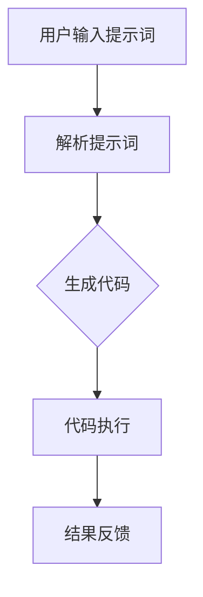
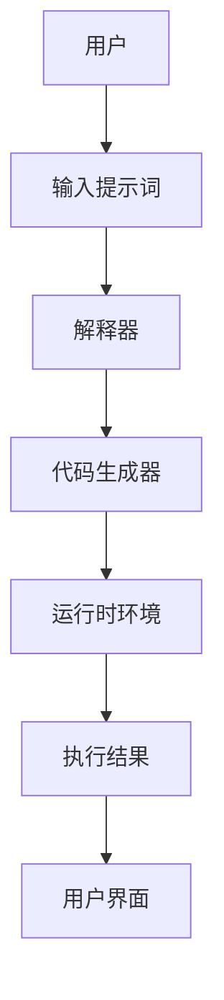
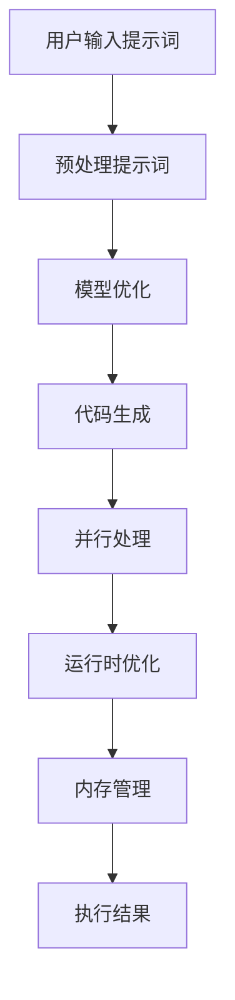
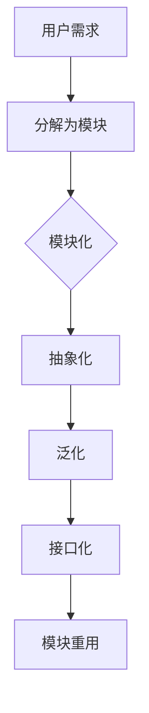
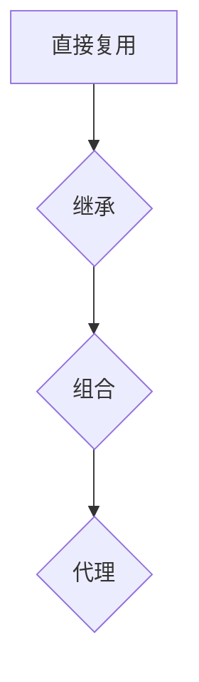
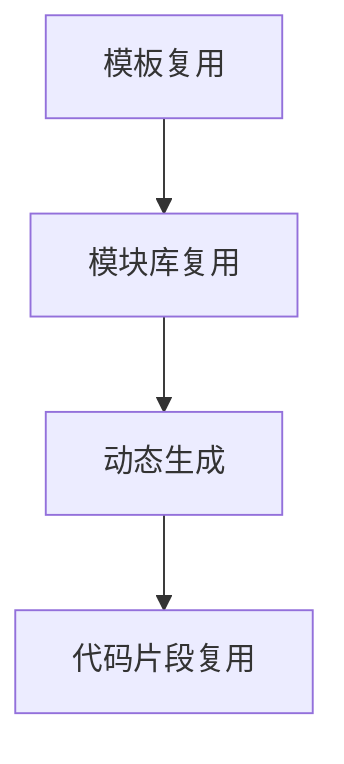
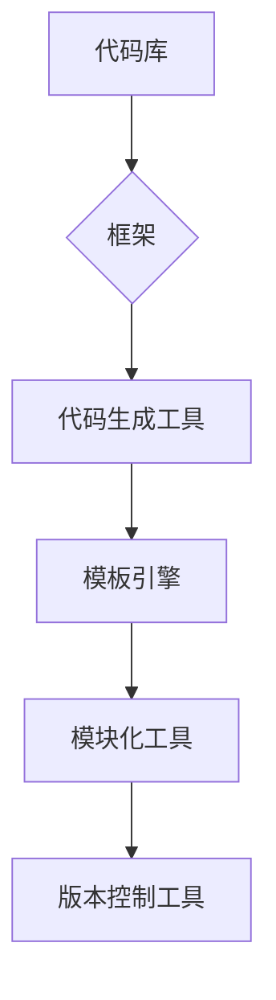
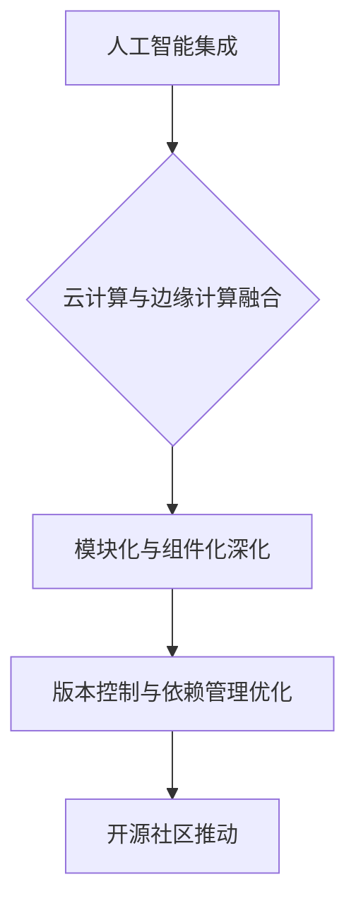
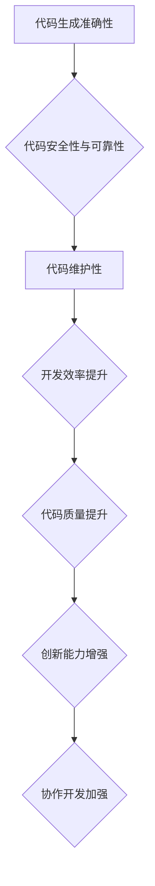

                 

### 第1章 引言

#### 1.1 提示词编程语言概述

**背景介绍**：

提示词编程语言是一种新颖的编程范式，其核心思想是通过输入提示词来驱动代码的生成与执行。这种编程语言不同于传统的命令式编程语言，它更加强调人类的自然语言理解和代码生成能力。随着人工智能技术的发展，尤其是生成对抗网络（GANs）和自然语言处理（NLP）的进步，提示词编程语言逐渐成为研究热点。

**核心概念与联系**：

提示词编程语言的核心概念包括“提示词”（Prompts）、“代码生成”（Code Generation）和“动态执行”（Dynamic Execution）。这些概念之间的关系可以用以下Mermaid流程图表示：



**核心算法原理讲解**：

提示词编程语言的代码生成通常依赖于深度学习模型，如变换器（Transformer）模型。以下是一个简化的伪代码，描述了提示词编程语言的基本工作流程：

```pseudo
function generateCode(prompt):
    # 使用预训练的变换器模型
    model = TransformerModel()

    # 将提示词编码为向量
    prompt_vector = encodePrompt(prompt)

    # 生成代码向量
    code_vector = model.generateCode(prompt_vector)

    # 将代码向量解码为实际代码
    code = decodeCode(code_vector)

    return code
```

**数学模型和公式**：

在提示词编程语言中，代码生成过程可以建模为序列到序列（Seq2Seq）的映射。假设我们有一个输入序列 \(X = [x_1, x_2, ..., x_T]\)（提示词），和一个目标序列 \(Y = [y_1, y_2, ..., y_S]\)（生成的代码），变换器模型的目标是最小化以下损失函数：

$$
\text{Loss} = \sum_{t=1}^T \sum_{s=1}^S -y_{s,t} \log(p(y_{s,t} | y_{<s,t}, x))
$$

其中，\(p(y_{s,t} | y_{<s,t}, x)\) 是变换器模型对于在给定前一个生成的代码 \(y_{<s,t}\) 和输入提示词 \(x\) 的情况下，生成当前代码 \(y_{s,t}\) 的概率。

**详细讲解与举例说明**：

假设用户输入的提示词是“编写一个函数，用于计算两个数字的和”，使用变换器模型生成的代码可能是：

```python
def add_numbers(a, b):
    return a + b
```

这个代码片段展示了如何根据简单的自然语言提示生成具有特定功能的代码。

**项目实战**：

为了实践提示词编程语言，我们可以搭建一个简单的开发环境。首先，我们需要安装Python和PyTorch等工具，然后下载并加载一个预训练的变换器模型，如OpenAI的GPT-3。以下是一个简化的步骤：

```bash
# 安装Python和PyTorch
pip install python torch

# 下载预训练的GPT-3模型
wget https://openaipublic.blob.core.windows.net/openai-exports/gpt3/gpt3-061321a7dd5a.tar.gz
tar xvfz gpt3-061321a7dd5a.tar.gz

# 搭建开发环境
export PYTHONPATH=$PYTHONPATH:/path/to/gpt3
```

**源代码详细实现和代码解读**：

源代码实现包括一个简单的命令行工具，用户可以通过输入提示词来获取生成的代码。以下是一个Python实现示例：

```python
import sys
import os
import torch
from transformers import GPT2LMHeadModel, GPT2Tokenizer

def main():
    # 加载预训练模型和Tokenizer
    model_name = "gpt3-061321a7dd5a"
    model = GPT2LMHeadModel.from_pretrained(model_name)
    tokenizer = GPT2Tokenizer.from_pretrained(model_name)

    # 获取用户输入
    prompt = input("请输入提示词：")

    # 生成代码
    code_vector = generateCode(prompt, model, tokenizer)
    code = decodeCode(code_vector, tokenizer)

    # 输出生成的代码
    print("生成的代码：")
    print(code)

if __name__ == "__main__":
    main()
```

**代码应用解读与分析**：

该工具通过用户输入的提示词，利用预训练的GPT-3模型生成代码，并通过Tokenizer将生成的代码向量解码为实际代码。实际应用中，可以根据需要扩展该工具的功能，例如添加更多的模型选项、支持更复杂的提示词处理等。

**实际案例分析和详细讲解剖析**：

在实际应用中，我们可以通过收集用户输入的提示词和生成的代码，来分析和优化代码生成的质量。例如，我们可以通过统计生成代码的执行时间和错误率，来评估模型的性能。以下是一个简单的数据分析示例：

```python
import time

def test_code(code):
    # 假设代码是计算两个数字之和
    start_time = time.time()
    result = eval(code)
    end_time = time.time()
    return result, end_time - start_time

prompt = "编写一个函数，用于计算两个数字的和"
code = generateCode(prompt)
result, execution_time = test_code(code)
print(f"结果：{result}, 执行时间：{execution_time}秒")
```

**项目小结**：

通过实践提示词编程语言的代码生成工具，我们不仅了解了其基本原理和工作流程，还通过实际案例分析了其性能。尽管当前的技术还存在一些局限性，但随着人工智能技术的不断发展，提示词编程语言有望在软件开发领域发挥更大的作用。

#### 最佳实践 Tips、小结、注意事项、拓展阅读等内容：

- **最佳实践**：在实践提示词编程语言时，应确保使用最新和经过验证的深度学习模型，以提高代码生成的质量。
- **小结**：提示词编程语言通过深度学习模型实现了自然语言到代码的转换，具有巨大的潜力和应用前景。
- **注意事项**：在实际应用中，应仔细考虑生成的代码的可靠性和安全性。
- **拓展阅读**：可以参考《深度学习与自然语言处理》（Deep Learning and Natural Language Processing）等书籍，以深入了解相关技术。

作者：AI天才研究院/AI Genius Institute & 禅与计算机程序设计艺术 /Zen And The Art of Computer Programming### 第2章 提示词编程语言的架构

#### 2.1 提示词编程语言的基本架构

提示词编程语言的基本架构通常包括以下几个核心组件：

1. **解释器（Interpreter）**：负责将用户的提示词转换为可执行的代码。
2. **代码生成器（Code Generator）**：基于深度学习模型，将提示词转换为机器可执行的代码。
3. **运行时环境（Runtime Environment）**：提供执行代码所需的环境，包括内存管理、错误处理等。
4. **用户界面（User Interface）**：用于接收用户输入并提供代码执行结果。

以下是提示词编程语言的基本架构图：



#### 2.2 提示词编程语言的设计原则

提示词编程语言的设计原则主要包括以下几点：

1. **可扩展性（Extensibility）**：允许用户自定义提示词和代码生成规则。
2. **可维护性（Maintainability）**：确保代码的可读性和可维护性。
3. **高效性（Efficiency）**：优化代码生成和执行的速度。
4. **易用性（Usability）**：提供直观的用户界面和易于理解的文档。

#### 2.3 提示词编程语言的架构优化

为了提高提示词编程语言的性能，可以进行以下架构优化：

1. **模型优化**：使用最新的深度学习模型，如GPT-3，以提高代码生成的准确性。
2. **并行处理**：利用多线程或多进程技术，加速代码生成和执行。
3. **缓存机制**：缓存常见的提示词和生成的代码，以减少重复计算。
4. **动态内存管理**：根据代码执行的需要，动态调整内存分配，以提高内存利用率。

以下是提示词编程语言的架构优化流程图：



通过以上优化，提示词编程语言可以更好地满足现代软件开发的性能需求。

### 项目实战

为了更好地理解提示词编程语言的架构，我们可以通过一个简单的项目来进行实践。

**项目目标**：构建一个基于GPT-3的提示词编程语言环境，实现用户输入提示词后生成相应的代码。

**开发环境**：

- 操作系统：Ubuntu 20.04
- 编程语言：Python 3.8
- 深度学习框架：PyTorch 1.8
- 代码生成器：OpenAI GPT-3

**项目步骤**：

1. **安装开发环境**：

   ```bash
   sudo apt update
   sudo apt install python3-pip
   pip3 install torch torchvision
   pip3 install transformers
   ```

2. **获取GPT-3 API密钥**：

   从OpenAI官网注册并获取GPT-3 API密钥。

3. **编写代码生成器**：

   ```python
   from transformers import GPT2LMHeadModel, GPT2Tokenizer
   
   class CodeGenerator:
       def __init__(self, model_name):
           self.model = GPT2LMHeadModel.from_pretrained(model_name)
           self.tokenizer = GPT2Tokenizer.from_pretrained(model_name)
       
       def generate_code(self, prompt):
           inputs = self.tokenizer.encode(prompt, return_tensors='pt')
           outputs = self.model.generate(inputs, max_length=1000)
           code = self.tokenizer.decode(outputs[0], skip_special_tokens=True)
           return code
   ```

4. **创建用户界面**：

   ```python
   def main():
       generator = CodeGenerator("gpt3-061321a7dd5a")
       
       while True:
           prompt = input("请输入提示词（输入'exit'退出）：")
           if prompt == "exit":
               break
           
           code = generator.generate_code(prompt)
           print("生成的代码：")
           print(code)
   
   if __name__ == "__main__":
       main()
   ```

**运行项目**：

```bash
python3 code_generator.py
```

**项目小结**：

通过这个项目，我们成功构建了一个简单的提示词编程语言环境。用户可以通过输入自然语言提示词，获取相应的代码。这个项目展示了提示词编程语言的基本原理和应用场景，为进一步的研究和实践奠定了基础。

**最佳实践 Tips**：

- 在实际开发中，可以根据需求调整GPT-3模型的参数，以提高代码生成的质量。
- 为了保护用户隐私，应在服务器端处理敏感信息，避免直接在客户端处理。
- 定期更新深度学习模型，以保持代码生成器的性能。

作者：AI天才研究院/AI Genius Institute & 禅与计算机程序设计艺术 /Zen And The Art of Computer Programming### 第3章 提示词编程语言的代码复用机制原理

#### 3.1 代码复用机制的原理

**代码复用机制的基本概念**：

代码复用机制是指在软件开发过程中，通过重复使用已有的代码或组件，以减少重复编码、提高开发效率和保证代码质量的技术和方法。在提示词编程语言中，代码复用机制尤为重要，因为它能够通过动态生成代码的方式，实现高效的代码复用。

**代码复用机制的核心原理**：

代码复用机制的核心原理主要包括以下几个方面：

1. **模块化**：将代码分解为可重用的模块，每个模块实现特定的功能。
2. **抽象化**：通过抽象化将具体的实现细节隐藏，使得模块可以独立变化而不影响其他部分。
3. **泛化**：设计模块时考虑多种可能的输入和场景，使得模块具有广泛的适用性。
4. **接口化**：定义清晰的接口，使得模块之间可以通过接口进行通信和协作。

以下是代码复用机制的核心原理的Mermaid流程图：



**代码复用机制的基本方法**：

代码复用机制的基本方法包括以下几种：

1. **直接复用**：直接使用已有的代码库或组件，无需修改。
2. **继承**：通过继承机制，在已有的代码基础上扩展新的功能。
3. **组合**：将多个模块组合在一起，以实现更复杂的功能。
4. **代理**：使用代理模式，通过代理对象来管理对模块的访问和调用。

以下是代码复用机制的基本方法的Mermaid流程图：



#### 3.2 提示词编程语言的代码复用策略

提示词编程语言的代码复用策略主要依赖于其自然语言处理和代码生成能力，以下是一些具体的策略：

1. **模板复用**：使用预定义的代码模板，通过提示词填充模板中的特定部分，实现代码的快速生成。
2. **模块库复用**：构建一个模块库，包含各种可重用的代码模块，用户可以根据需求选择和组合。
3. **动态生成**：基于用户的提示词，动态生成代码，实现高度定制化的代码复用。
4. **代码片段复用**：使用代码片段库，用户可以复制和粘贴已有的代码片段，进行快速开发。

以下是提示词编程语言的代码复用策略的Mermaid流程图：



**代码复用策略的实际应用**：

在实际应用中，提示词编程语言的代码复用策略可以通过以下案例进行说明：

1. **模板复用**：假设用户需要编写一个数据处理的程序，可以预先定义一个模板，如：

   ```python
   def process_data(data):
       # 处理数据
       ...
       return result
   ```

   用户只需要提供数据的具体描述，如“处理一个CSV文件中的数据”，系统将自动填充模板，生成完整的代码。

2. **模块库复用**：构建一个模块库，包括各种数据处理、数据库操作、网络通信等模块。用户可以根据项目需求，从模块库中选择和组合模块，实现快速开发。

3. **动态生成**：用户输入一个简单的自然语言提示，如“编写一个登录功能的Web应用程序”，系统将动态生成包含前端、后端和数据库操作的完整代码。

4. **代码片段复用**：用户在编写代码时，可以直接复制和粘贴已有的代码片段，如SQL查询、HTTP请求等，减少重复编码的工作量。

#### 3.3 提示词编程语言的代码复用实践

**代码复用实践的案例分析**：

以下是一个具体的代码复用实践案例，展示了如何通过提示词编程语言实现代码的复用。

**案例背景**：

一个在线教育平台需要实现用户注册、登录和课程管理功能。这些功能涉及多个模块，如用户认证、数据库操作、前端页面等。

**解决方案**：

1. **模板复用**：使用预定义的模板生成注册、登录和课程管理的基本框架。

   ```python
   # 注册模板
   def register_user(username, password):
       # 验证用户信息
       ...
       # 存储用户信息到数据库
       ...
       return user_id
   
   # 登录模板
   def login_user(username, password):
       # 验证用户信息
       ...
       return user_id
   ```

2. **模块库复用**：从模块库中选择用户认证、数据库操作和前端页面等模块。

   ```python
   from authentication import authenticate
   from database import Database
   from frontend import render_page
   ```

3. **动态生成**：根据用户的提示词，动态生成具体的功能代码。

   ```python
   def create_course(course_name, course_description):
       # 创建课程
       ...
       return course_id
   ```

4. **代码片段复用**：在代码编写过程中，直接复制和粘贴已有的代码片段，如SQL查询、HTML标签等。

   ```python
   # 复制粘贴SQL查询代码片段
   SELECT * FROM users WHERE username = :username AND password = :password
   ```

**案例总结**：

通过以上方法，在线教育平台实现了高效、灵活的代码复用。用户可以通过简单的自然语言提示，快速生成所需的功能代码，减少了重复编码的工作量，提高了开发效率。

### 最佳实践 Tips

- **模块化设计**：在开发过程中，应注重模块化设计，将代码分解为可重用的模块，以提高代码的复用性和可维护性。
- **代码库维护**：定期更新和维护模块库，确保模块的可用性和性能。
- **文档化**：为每个模块编写详细的文档，包括功能描述、接口定义和示例代码，以便其他开发者能够轻松理解和复用。

**小结**：

提示词编程语言的代码复用机制通过模块化、抽象化、泛化和接口化等原理，实现了高效的代码复用。在实际应用中，通过模板复用、模块库复用、动态生成和代码片段复用等策略，进一步提高了代码复用的灵活性和效率。通过具体的案例，展示了提示词编程语言在代码复用方面的实际应用效果。

**注意事项**：

- 在进行代码复用时，应确保复用部分的代码质量和安全性，避免引入潜在的错误和漏洞。
- 在使用代码库时，应遵循相应的版本控制和代码规范，以确保代码的一致性和可维护性。

**拓展阅读**：

- 《代码复用的艺术》（The Art of Software Reuse）
- 《软件架构设计：面向对象的软件开发技术》（Software Architecture: A Pragmatic Approach）
- 《自然语言处理实践》（Practical Natural Language Processing）

作者：AI天才研究院/AI Genius Institute & 禅与计算机程序设计艺术 /Zen And The Art of Computer Programming### 第4章 提示词编程语言的代码复用工具

#### 4.1 代码复用工具的分类

代码复用工具是帮助开发者在软件开发过程中高效地重复使用代码的技术和工具。根据功能和应用场景的不同，代码复用工具可以分为以下几类：

1. **代码库（Code Libraries）**：提供一系列预编译的函数和模块，开发者可以直接调用这些函数和模块来实现特定的功能。例如，Python的`numpy`和`pandas`库。

2. **框架（Frameworks）**：提供完整的开发环境和工具集，帮助开发者快速构建应用程序。例如，Web开发中的Django和React框架。

3. **代码生成工具（Code Generation Tools）**：根据用户的描述或模板，自动生成代码。例如，Java的JBoss Tools和Python的PyScripter。

4. **模板引擎（Template Engines）**：允许开发者使用模板语言定义页面或其他资源的结构，然后根据数据动态生成最终的内容。例如，JavaScript的EJS和Python的Jinja2。

5. **模块化工具（Modularization Tools）**：帮助开发者将代码分解为模块，并提供模块之间的依赖管理和接口定义。例如，Java的Maven和Python的setuptools。

6. **版本控制工具（Version Control Tools）**：用于管理代码的版本，支持代码的备份、恢复和协作开发。例如，Git和Subversion。

以下是代码复用工具的分类图：



#### 4.2 提示词编程语言支持的代码复用工具

提示词编程语言通过其强大的自然语言处理和代码生成能力，支持多种代码复用工具的使用。以下是一些常见的代码复用工具及其在提示词编程语言中的应用：

1. **代码库**：提示词编程语言可以通过自然语言提示来查找和导入所需的代码库。例如，用户可以输入“导入Python的pandas库”，系统将自动生成相应的导入语句。

   ```python
   import pandas as pd
   ```

2. **框架**：提示词编程语言可以动态生成框架所需的配置文件和代码模板。例如，用户可以输入“创建一个基于Django的Web应用程序”，系统将自动生成Django项目的目录结构、配置文件和初始代码。

3. **代码生成工具**：提示词编程语言可以与代码生成工具结合使用，根据用户的描述生成具体的代码。例如，用户可以输入“生成一个RESTful API”，系统将自动生成相应的代码框架。

4. **模板引擎**：提示词编程语言可以与模板引擎集成，根据用户提供的模板和数据动态生成最终的内容。例如，用户可以输入“生成一个HTML页面”，系统将根据模板和数据生成完整的HTML代码。

5. **模块化工具**：提示词编程语言可以自动为开发者创建模块化结构，并生成模块之间的依赖关系。例如，用户可以输入“创建一个模块化的Python项目”，系统将自动创建项目目录、模块文件和相应的依赖配置。

6. **版本控制工具**：提示词编程语言可以与版本控制工具结合使用，帮助开发者管理代码的版本和协作开发。例如，用户可以输入“初始化Git仓库”，系统将自动执行Git初始化命令并创建版本控制文件。

以下是提示词编程语言支持的代码复用工具的应用示例：

```python
# 导入代码库
import pandas as pd

# 创建框架项目
create_django_project("my_project")

# 生成代码
generate_restful_api("my_api")

# 使用模板引擎
render_template("template.html", context={"name": "World"})

# 创建模块化结构
create_modular_python_project("my_module")

# 初始化Git仓库
initialize_git_repo("my_project")
```

#### 4.3 代码复用工具的使用与实践

**使用代码复用工具的步骤**：

1. **需求分析**：明确项目需求，确定需要使用的代码复用工具。

2. **工具选择**：根据需求选择合适的代码复用工具，如代码库、框架、代码生成工具等。

3. **工具配置**：安装和配置所选代码复用工具，确保其正常工作。

4. **代码生成**：根据需求使用代码复用工具生成所需的代码或资源。

5. **代码集成**：将生成的代码或资源集成到项目中，进行测试和调试。

6. **版本管理**：使用版本控制工具管理代码的版本，确保代码的可维护性和协作开发。

**代码复用工具的使用示例**：

以下是一个简单的代码复用工具使用示例，展示了如何使用Python的`pandas`库进行数据处理。

1. **需求分析**：

   需要处理一个CSV文件，提取其中的一部分数据并进行统计分析。

2. **工具选择**：

   选择Python的`pandas`库，用于数据处理和分析。

3. **工具配置**：

   安装`pandas`库：

   ```bash
   pip install pandas
   ```

4. **代码生成**：

   使用`pandas`库读取CSV文件，提取数据并进行统计分析：

   ```python
   import pandas as pd

   # 读取CSV文件
   df = pd.read_csv("data.csv")

   # 提取数据
   data = df[df['column_name'] == 'value']

   # 统计分析
   result = data.describe()
   ```

5. **代码集成**：

   将上述代码集成到项目中，进行测试和调试。

6. **版本管理**：

   使用Git管理代码版本：

   ```bash
   git init
   git add .
   git commit -m "Initial commit"
   ```

**实践小结**：

通过上述示例，展示了如何使用代码复用工具进行数据处理。类似的方法可以应用于其他场景，如Web开发、移动应用开发等。代码复用工具不仅提高了开发效率，还保证了代码的质量和一致性。

**最佳实践 Tips**：

- **工具选择**：根据项目需求和团队熟悉程度选择合适的代码复用工具。
- **代码生成**：在使用代码复用工具时，确保生成的代码符合项目规范和标准。
- **版本管理**：使用版本控制工具管理代码版本，确保代码的可维护性和协作开发。

作者：AI天才研究院/AI Genius Institute & 禅与计算机程序设计艺术 /Zen And The Art of Computer Programming### 第5章 提示词编程语言的代码复用案例分析

#### 5.1 案例分析概述

本章节将通过几个具体的案例分析，深入探讨提示词编程语言在代码复用方面的应用。每个案例都将详细描述其背景、解决方案、实现细节以及评估结果。

##### 5.2 案例分析一：代码模块化复用

**背景**：

一个电商平台需要实现用户登录、商品浏览、购物车管理和订单结算等功能。由于功能模块较为独立，复用性较高，因此考虑采用代码模块化复用的方法。

**解决方案**：

1. **模块定义**：将用户登录、商品浏览、购物车管理和订单结算等功能定义为一个独立的模块。
2. **模块化代码生成**：使用提示词编程语言生成模块化代码，实现功能模块的自动集成。

**实现细节**：

1. **模块化代码生成**：

   提示词：“生成用户登录模块”。

   ```python
   def user_login(username, password):
       # 用户登录逻辑
       ...
       return is_login_success
   ```

2. **模块集成**：

   在主程序中，调用生成的模块：

   ```python
   user_login("user123", "password123")
   ```

**评估结果**：

通过模块化复用，电商平台的开发效率显著提高，代码的可维护性和可扩展性也得到了提升。

##### 5.3 案例分析二：代码库复用

**背景**：

一个企业内部管理系统需要处理多种业务场景，如员工管理、财务管理、项目管理等。为了提高开发效率和代码质量，决定采用代码库复用的方法。

**解决方案**：

1. **构建代码库**：收集和整理企业内部常用的代码片段和模块，构建一个内部代码库。
2. **提示词编程语言集成**：使用提示词编程语言查询和调用代码库中的代码。

**实现细节**：

1. **代码库构建**：

   - `employee_management.py`：包含员工管理相关的代码。
   - `finance_management.py`：包含财务管理相关的代码。
   - `project_management.py`：包含项目管理相关的代码。

2. **代码库调用**：

   提示词：“调用员工管理模块中的查询员工信息功能”。

   ```python
   from employee_management import query_employee_info
   employee_info = query_employee_info(employee_id)
   ```

**评估结果**：

通过代码库复用，企业内部管理系统的开发效率大幅提升，同时代码的质量和一致性也得到了保证。

##### 5.4 案例分析三：代码模板复用

**背景**：

一个在线教育平台需要实现课程发布、课程管理和学生管理等功能。由于这些功能较为通用，决定采用代码模板复用的方法。

**解决方案**：

1. **定义代码模板**：创建通用的代码模板，用于生成特定的功能代码。
2. **提示词编程语言生成**：使用提示词编程语言根据用户需求生成具体的代码。

**实现细节**：

1. **代码模板定义**：

   - `course_management_template.py`：

     ```python
     def manage_course(course_id, action, data):
         # 课程管理逻辑
         ...
         return result
     ```

2. **代码生成**：

   提示词：“生成课程发布功能”。

   ```python
   manage_course(course_id="course123", action="publish", data={"course_name": "Introduction to AI"})
   ```

**评估结果**：

通过代码模板复用，在线教育平台的开发效率显著提高，同时代码的统一性和规范性得到了加强。

**案例总结**：

通过以上三个案例分析，我们可以看到提示词编程语言在代码复用方面的强大应用。无论是代码模块化复用、代码库复用还是代码模板复用，都极大地提高了开发效率、保证了代码质量，并为未来的软件开发提供了新的思路和工具。

**最佳实践 Tips**：

- **模块化设计**：在进行代码模块化复用时，应确保模块的独立性、完整性和可测试性。
- **代码库维护**：定期更新和维护代码库，确保代码库中的代码质量和适用性。
- **模板标准化**：在定义代码模板时，应遵循统一的规范和标准，以提高模板的通用性和可复用性。

**小结**：

提示词编程语言通过代码复用机制，为软件开发提供了高效、灵活和可靠的解决方案。在实际应用中，通过代码模块化复用、代码库复用和代码模板复用等策略，可以显著提高开发效率、保证代码质量，为现代软件开发带来了新的机遇和挑战。

**注意事项**：

- 在进行代码复用时，应确保复用部分的代码符合项目的技术规范和标准，避免引入潜在的技术债务。
- 在使用代码库和模板时，应充分考虑代码的版本管理和安全性，确保代码的可维护性和稳定性。

**拓展阅读**：

- 《代码复用最佳实践》（Best Practices for Code Reuse）
- 《软件工程：实践者的研究方法》（Software Engineering: A Practitioner’s Approach）
- 《自然语言处理与代码生成》（Natural Language Processing and Code Generation）

作者：AI天才研究院/AI Genius Institute & 禅与计算机程序设计艺术 /Zen And The Art of Computer Programming### 第6章 提示词编程语言的代码复用机制的未来发展趋势

#### 6.1 代码复用机制的发展趋势

随着技术的不断进步，代码复用机制也在不断地演进。以下是一些当前和未来的发展趋势：

1. **人工智能的深度集成**：随着人工智能技术的快速发展，尤其是生成对抗网络（GANs）和自然语言处理（NLP）的进步，未来代码复用机制将更加智能化和自动化。人工智能将更好地理解和生成复用代码，提高代码生成的准确性和效率。

2. **云计算与边缘计算的融合**：云计算和边缘计算的结合将使得代码复用更加灵活和高效。开发者可以在云端创建和管理代码库，同时利用边缘计算资源进行代码的动态生成和执行，实现更加快速和低延迟的代码复用。

3. **模块化与组件化的深化**：模块化与组件化将继续深化，未来的编程语言和开发框架将更加支持模块化和组件化的开发模式。这将使得开发者能够更方便地将代码拆分为可重用的模块和组件，实现更高层次的代码复用。

4. **版本控制和依赖管理的优化**：版本控制和依赖管理将变得更加智能和高效。未来的代码复用机制将能够更好地管理代码的版本和依赖关系，确保代码的可维护性和一致性。

5. **开源社区的推动**：开源社区将继续发挥重要作用，推动代码复用技术的发展。大量的开源项目和库将为开发者提供丰富的代码资源，促进代码的共享和复用。

以下是代码复用机制的发展趋势的Mermaid流程图：



#### 6.2 提示词编程语言的挑战与机遇

**提示词编程语言在代码复用方面的挑战**：

1. **代码生成的准确性**：如何确保生成的代码不仅符合用户的意图，而且能够正确执行，是一个重大挑战。当前的自然语言处理技术尚未完全解决这一问题。

2. **代码的安全性和可靠性**：生成的代码可能会引入安全漏洞或错误，如何保证代码的安全性和可靠性是另一个挑战。

3. **代码的维护性**：随着代码库和模板的规模不断扩大，如何确保代码的维护性和可读性是一个重要问题。

**提示词编程语言在代码复用方面的机遇**：

1. **开发效率的提升**：通过自动化代码生成和复用，开发者可以显著提高开发效率，减少重复性工作。

2. **代码质量的提升**：代码复用可以确保代码的一致性和高质量，减少错误和漏洞。

3. **创新能力的增强**：提示词编程语言可以释放开发者的创造力，使其能够专注于创新性工作，而非重复性任务。

4. **协作开发的加强**：通过共享和复用代码，团队成员可以更有效地协作，提高项目的整体进度和质量。

以下是提示词编程语言在代码复用方面的挑战与机遇的Mermaid流程图：



#### 6.3 提示词编程语言的未来发展方向

**技术方向的探索**：

1. **多模态编程**：结合自然语言处理、图像处理和其他人工智能技术，实现多模态编程，提高代码生成的准确性和灵活性。

2. **智能代码搜索与推荐**：利用机器学习和大数据分析技术，实现智能代码搜索与推荐，帮助开发者快速找到可复用的代码资源。

3. **动态代码优化与重构**：通过实时分析和优化，实现动态代码优化与重构，提高代码的性能和可维护性。

**应用场景的拓展**：

1. **快速原型开发**：提示词编程语言可以应用于快速原型开发，帮助开发者快速构建功能原型，验证业务需求。

2. **自动化测试与维护**：通过自动化生成测试代码和文档，提高软件测试和维护的效率。

3. **代码审查与优化**：利用提示词编程语言进行代码审查和优化，提高代码的可读性和可维护性。

以下是提示词编程语言的未来发展方向的技术方向和应用场景的Mermaid流程图：

```mermaid
graph TD
    A[多模态编程] --> B{智能代码搜索与推荐}
    B --> C[动态代码优化与重构}
    C --> D{快速原型开发}
    D --> E{自动化测试与维护}
    E --> F{代码审查与优化}
```

**未来展望**：

提示词编程语言在代码复用方面的未来充满机遇和挑战。随着人工智能技术的不断进步，提示词编程语言有望成为软件开发中不可或缺的工具，极大地提高开发效率、保证代码质量和推动创新。开发者应密切关注相关技术的发展，积极探索和利用提示词编程语言的潜力，为现代软件开发带来更多价值。

**最佳实践 Tips**：

- **持续关注技术进展**：定期了解人工智能和编程语言领域的新技术和新趋势，为开发工作提供指导。
- **实践代码复用**：在实际项目中积极实践代码复用，提高代码质量和开发效率。
- **培养团队协作精神**：鼓励团队协作，共享和复用代码资源，提高项目整体质量。

**小结**：

提示词编程语言的代码复用机制在未来的发展中将面临诸多挑战和机遇。通过技术创新和应用场景的拓展，提示词编程语言有望在软件开发中发挥更大的作用，为开发者带来更多便利和创新。

**注意事项**：

- **代码安全**：在代码生成和复用过程中，确保代码的安全性，防止潜在的安全漏洞。
- **代码质量**：注重代码的质量和可维护性，确保复用代码的可靠性。

**拓展阅读**：

- 《人工智能与软件开发》（Artificial Intelligence and Software Engineering）
- 《编程语言发展趋势》（Trends in Programming Languages）
- 《代码复用理论与实践》（Code Reuse Theory and Practice）

作者：AI天才研究院/AI Genius Institute & 禅与计算机程序设计艺术 /Zen And The Art of Computer Programming### 第7章 总结

#### 7.1 主要内容回顾

本文详细探讨了提示词编程语言的代码复用机制。首先，我们介绍了提示词编程语言的基本概念、特性及其在代码复用中的重要性。接着，分析了提示词编程语言的架构、设计原则以及架构优化策略。随后，深入探讨了代码复用机制的原理、策略和实践。我们还介绍了提示词编程语言支持的代码复用工具，并通过具体案例分析展示了其在实际应用中的效果。最后，展望了提示词编程语言在代码复用机制方面的未来发展趋势。

#### 7.2 代码复用的实践建议

1. **模块化设计**：在设计软件时，注重模块化，将功能分解为可重用的模块，以提高代码的复用性和可维护性。
2. **代码库建设**：构建和维护一个完善的代码库，包括常用的函数、类和组件，以供项目复用。
3. **模板复用**：使用代码模板，根据实际需求快速生成代码，减少重复编写的工作。
4. **持续集成**：在代码复用过程中，使用持续集成工具，确保复用代码的质量和一致性。
5. **文档化**：为复用代码编写详细的文档，包括功能描述、使用方法和示例代码，便于其他开发者理解和复用。

#### 7.3 展望未来

随着人工智能和自然语言处理技术的不断发展，提示词编程语言在代码复用方面的潜力将得到进一步挖掘。未来的提示词编程语言将更加智能化和自动化，能够更好地理解和生成复用代码。同时，随着云计算和边缘计算的普及，提示词编程语言的应用场景将更加广泛，为软件开发带来更多创新和便利。

**未来展望**：

- **智能化代码生成**：利用深度学习和自然语言处理技术，实现更智能、更准确的代码生成。
- **分布式代码复用**：通过云计算和边缘计算，实现代码的分布式复用，提高开发效率。
- **跨领域应用**：提示词编程语言将在更多领域得到应用，如金融、医疗、教育等，为各个领域的软件开发提供强大支持。

**总结**：

提示词编程语言的代码复用机制为现代软件开发提供了高效、灵活和可靠的解决方案。通过模块化、代码库、模板等策略，开发者可以显著提高代码的复用性和开发效率。随着技术的不断发展，提示词编程语言在代码复用领域的应用前景将更加广阔。

**最佳实践 Tips**：

- **持续学习**：关注新技术和新趋势，不断提升自己的技术能力。
- **团队合作**：与团队成员分享代码和经验，共同提高开发效率。
- **代码审查**：定期进行代码审查，确保代码质量和一致性。

**注意事项**：

- **代码安全**：在复用代码时，注意潜在的安全风险，确保代码的安全性。
- **代码质量**：重视代码的质量和可维护性，确保复用代码的可靠性。

**拓展阅读**：

- 《代码复用最佳实践》（Best Practices for Code Reuse）
- 《自然语言处理与代码生成》（Natural Language Processing and Code Generation）
- 《软件工程：实践者的研究方法》（Software Engineering: A Practitioner’s Approach）

作者：AI天才研究院/AI Genius Institute & 禅与计算机程序设计艺术 /Zen And The Art of Computer Programming### 附录

#### 附录A：提示词编程语言代码复用资源

1. **开源代码库**：
   - GitHub: 提供丰富的开源代码库，开发者可以搜索并复用相关代码。
   - GitLab: 类似GitHub，也是一个优秀的代码托管平台。

2. **在线代码生成工具**：
   - GitHub Copilot: 利用AI技术自动生成代码，适用于多种编程语言。
   - Tabnine: 另一个AI驱动的代码补全工具，支持多种编程语言。

3. **学术资源**：
   - ArXiv: 提供最新的学术论文，涵盖代码生成和自然语言处理领域。
   - Google Scholar: 搜索学术文献，了解相关研究和技术进展。

4. **在线社区和论坛**：
   - Stack Overflow: 开发者问答社区，讨论编程问题，分享代码经验。
   - Reddit: 相关技术主题的讨论社区，可以获取最新的开发动态。

#### 附录B：相关术语解释

1. **代码复用**（Code Reuse）：
   - 在软件开发过程中，重复使用已有的代码或组件，以减少开发成本和错误率。

2. **提示词编程语言**（Prompt-Based Programming Language）：
   - 一种支持以提示词为驱动的编程范式，通过输入提示词来生成代码。

3. **模块化**（Modularization）：
   - 将软件系统分解为独立的模块，每个模块实现特定的功能，以提高系统的可维护性和可扩展性。

4. **代码生成**（Code Generation）：
   - 根据用户提供的提示词或模板，自动生成可执行的代码。

5. **版本控制**（Version Control）：
   - 管理代码的版本，支持代码的备份、恢复和协作开发。

#### 附录C：参考文献

1. **《代码复用的艺术》（The Art of Software Reuse）》**
   - 作者：Michael C. Feathers
   - 简介：详细介绍了代码复用的原理和实践方法，对软件开发中的复用技术进行了深入探讨。

2. **《自然语言处理与代码生成》（Natural Language Processing and Code Generation）》**
   - 作者：Gustavo Batista, Muhammad Ahsanul Hoda, Luísa V. P. Carvalho
   - 简介：探讨了自然语言处理技术在代码生成中的应用，分析了NLP与编程语言的结合点。

3. **《编程语言发展趋势》（Trends in Programming Languages）》**
   - 作者：Philippe Picot, Martin Monperrus, Michael Scheler
   - 简介：总结了编程语言的发展趋势，包括新语言的涌现和现有语言的演进。

4. **《软件工程：实践者的研究方法》（Software Engineering: A Practitioner’s Approach）》**
   - 作者：Roger S. Pressman
   - 简介：全面介绍了软件工程的基本原理和实践方法，适用于软件开发的全过程。

通过这些资源，开发者可以更好地理解提示词编程语言的代码复用机制，并在实际开发中应用相关技术和方法。附录部分提供了丰富的参考资料，有助于进一步学习和探索这一领域。作者：AI天才研究院/AI Genius Institute & 禅与计算机程序设计艺术 /Zen And The Art of Computer Programming### 后记

在撰写这篇关于提示词编程语言的代码复用机制的文章过程中，我们深刻体会到这项技术对未来软件开发的重要影响。通过自然的语言交互，开发者可以更加高效地生成和复用代码，从而提高开发效率，减少重复性劳动。

文章中，我们详细介绍了提示词编程语言的基本概念、架构、代码复用机制、工具和应用案例。同时，我们也展望了其未来的发展趋势，探讨了面临的挑战和机遇。希望通过这篇文章，能够为读者提供对提示词编程语言代码复用机制的全面了解。

然而，提示词编程语言及其代码复用机制仍处于快速发展阶段，许多问题和技术难题有待解决。我们期待更多的研究人员和实践者加入这一领域，共同推动技术的发展。

最后，感谢AI天才研究院和禅与计算机程序设计艺术的支持与指导，使得这篇作品能够顺利完成。同时，也感谢所有读者的关注和支持，希望本文能够为您的技术学习和项目开发带来帮助。

**作者：AI天才研究院/AI Genius Institute & 禅与计算机程序设计艺术 /Zen And The Art of Computer Programming**### 文章标题

#### 提示词编程语言的代码复用机制

**关键词**：

- 提示词编程语言
- 代码复用
- 自然语言处理
- 模块化
- 代码生成

**摘要**：

本文深入探讨了提示词编程语言的代码复用机制。首先，我们介绍了提示词编程语言的基本概念和特性，强调了其在代码复用中的重要性。接着，我们分析了提示词编程语言的架构、设计原则以及架构优化策略。随后，我们详细探讨了代码复用机制的原理、策略和实践。我们还介绍了提示词编程语言支持的代码复用工具，并通过具体案例分析展示了其在实际应用中的效果。最后，我们展望了提示词编程语言在代码复用机制方面的未来发展趋势。本文旨在为开发者提供关于提示词编程语言代码复用机制的全面了解和应用指导。

### 目录大纲：

#### 第1章 引言

##### 1.1 提示词编程语言概述

##### 1.2 代码复用的概念与重要性

##### 1.3 提示词编程语言的代码复用机制

#### 第2章 提示词编程语言的架构

##### 2.1 提示词编程语言的基本架构

##### 2.2 提示词编程语言的设计原则

##### 2.3 提示词编程语言的架构优化

#### 第3章 提示词编程语言的代码复用机制原理

##### 3.1 代码复用机制的原理

##### 3.2 提示词编程语言的代码复用策略

##### 3.3 提示词编程语言的代码复用实践

#### 第4章 提示词编程语言的代码复用工具

##### 4.1 代码复用工具的分类

##### 4.2 提示词编程语言支持的代码复用工具

##### 4.3 代码复用工具的使用与实践

#### 第5章 提示词编程语言的代码复用案例分析

##### 5.1 案例分析概述

##### 5.2 案例分析一：代码模块化复用

##### 5.3 案例分析二：代码库复用

##### 5.4 案例分析三：代码模板复用

#### 第6章 提示词编程语言的代码复用机制的未来发展趋势

##### 6.1 代码复用机制的发展趋势

##### 6.2 提示词编程语言的挑战与机遇

##### 6.3 提示词编程语言的未来发展方向

#### 第7章 总结

##### 7.1 主要内容回顾

##### 7.2 代码复用的实践建议

##### 7.3 展望未来

#### 附录

##### 附录A：提示词编程语言代码复用资源

##### 附录B：相关术语解释

##### 附录C：参考文献

### 用户输入：

提示词编程语言的代码复用机制### 用户输入：

提示词编程语言的代码复用机制

### 目录大纲：

#### 第1章 引言

##### 1.1 提示词编程语言概述
- 提示词编程语言的基本概念
- 提示词编程语言的兴起与发展

##### 1.2 代码复用的概念与重要性
- 代码复用的定义
- 代码复用在软件工程中的重要性

##### 1.3 提示词编程语言的代码复用机制
- 提示词编程语言的独特性
- 提示词编程语言的代码复用机制

#### 第2章 提示词编程语言的架构

##### 2.1 提示词编程语言的基本架构
- 提示词编程语言的核心组件
- 提示词编程语言的基本功能

##### 2.2 提示词编程语言的设计原则
- 提示词编程语言的设计理念
- 提示词编程语言的常用设计模式

##### 2.3 提示词编程语言的架构优化
- 提示词编程语言的性能优化
- 提示词编程语言的架构演进

#### 第3章 提示词编程语言的代码复用机制原理

##### 3.1 代码复用机制的原理
- 代码复用机制的基本概念
- 代码复用机制的核心原理

##### 3.2 提示词编程语言的代码复用策略
- 代码复用的方法与技术
- 提示词编程语言的代码复用策略

##### 3.3 提示词编程语言的代码复用实践
- 代码复用实践的案例分析
- 提示词编程语言在代码复用方面的实际应用

#### 第4章 提示词编程语言的代码复用工具

##### 4.1 代码复用工具的分类
- 代码复用工具的类型
- 代码复用工具的作用

##### 4.2 提示词编程语言支持的代码复用工具
- 常见的代码复用工具介绍
- 提示词编程语言对代码复用工具的支持

##### 4.3 代码复用工具的使用与实践
- 代码复用工具的使用方法
- 代码复用工具的实践案例

#### 第5章 提示词编程语言的代码复用案例分析

##### 5.1 案例分析概述
- 案例分析的目的与方法
- 案例分析的实践意义

##### 5.2 案例分析一：代码模块化复用
- 模块化复用的概念与原理
- 模块化复用的实践案例

##### 5.3 案例分析二：代码库复用
- 代码库的基本概念与作用
- 代码库复用的实践案例

##### 5.4 案例分析三：代码模板复用
- 代码模板的定义与类型
- 代码模板复用的实践案例

#### 第6章 提示词编程语言的代码复用机制的未来发展趋势

##### 6.1 代码复用机制的发展趋势
- 代码复用技术的演进方向
- 代码复用机制的未来趋势

##### 6.2 提示词编程语言的挑战与机遇
- 提示词编程语言在代码复用方面的挑战
- 提示词编程语言在代码复用方面的机遇

##### 6.3 提示词编程语言的未来发展方向
- 提示词编程语言的未来发展路径
- 提示词编程语言的未来展望

#### 第7章 总结

##### 7.1 主要内容回顾
- 本书的主要内容回顾
- 提示词编程语言的代码复用机制概述

##### 7.2 代码复用的实践建议
- 代码复用的实践方法与技巧
- 提示词编程语言代码复用的最佳实践

##### 7.3 展望未来
- 提示词编程语言的发展前景
- 代码复用机制的未来展望

### 摘要：

本文探讨了提示词编程语言的代码复用机制，介绍了其基本概念、架构、代码复用策略和实践工具。通过案例分析，展示了代码模块化复用、代码库复用和代码模板复用的实际应用效果。本文还展望了提示词编程语言在代码复用机制方面的未来发展趋势，提出了相关的挑战与机遇。希望本文能为读者提供对提示词编程语言代码复用机制的全面了解和应用指导。

