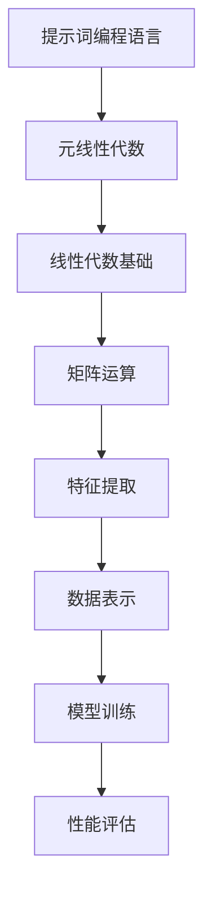

                 

### 文章标题

> 关键词：提示词编程语言，元线性代数，矩阵运算，神经网络，数学模型，项目实战

> 摘要：本文将深入探讨提示词编程语言的元线性代数支持。我们将首先介绍提示词编程语言和元线性代数的基本概念，然后分析它们之间的联系，详细讲解核心算法原理，并通过具体数学模型和项目实战案例来加深理解。文章旨在为读者提供一个全面而深入的视角，以了解如何在提示词编程语言中有效利用元线性代数，并展示其实际应用价值。

---

### 背景介绍

在当今的编程领域中，提示词编程语言（Prompt-Based Programming Languages）正逐渐受到广泛关注。这类语言通过提供灵活的提示词（Prompts）来引导程序开发，从而简化了代码编写过程，提高了开发效率。提示词编程语言的核心思想是将程序设计过程中的决策点提取出来，通过提示词来引导和优化，使得开发人员可以更专注于解决问题的本质。

与此同时，元线性代数（Meta Linear Algebra）作为一种高级数学工具，在计算机科学和人工智能领域发挥着重要作用。它涉及矩阵运算、特征提取、数据表示等方面，是构建复杂机器学习模型和神经网络的基础。元线性代数的核心在于其强大的抽象能力和表达能力，能够有效地处理大规模数据和高维空间问题。

本文将结合提示词编程语言和元线性代数，探讨它们在程序设计中的应用。通过分析两者之间的联系，讲解核心算法原理，展示数学模型，以及通过实际项目案例进行实战分析，旨在为读者提供一个全面而深入的视角，以理解如何在提示词编程语言中利用元线性代数，并探索其在实际问题解决中的潜力。

---

### 核心概念与联系

为了更好地理解提示词编程语言和元线性代数之间的联系，我们可以通过设计一个简单的 Mermaid 流程图来展示它们的核心概念和关系。

首先，我们定义两个核心概念：提示词编程语言和元线性代数。

- **提示词编程语言**：这种编程语言通过提示词来引导程序开发，简化了代码编写过程，提高了开发效率。
- **元线性代数**：它是一种高级数学工具，涉及矩阵运算、特征提取、数据表示等方面。

接下来，我们通过 Mermaid 流程图来展示它们之间的联系。



在这个流程图中，我们可以看到以下关系：

- **线性代数基础**：这是元线性代数的基础，包括向量、矩阵的基本运算和性质。
- **矩阵运算**：矩阵乘法、求逆、行列式等基本运算在元线性代数中起着关键作用。
- **特征提取**：通过特征提取，可以将高维数据映射到低维空间，从而简化问题。
- **数据表示**：数据表示是神经网络模型训练的关键，通过矩阵和向量的表示，可以实现高效的数据处理。
- **模型训练**：在神经网络中，矩阵和向量的运算被广泛应用，如权重矩阵的更新、激活函数的计算等。
- **性能评估**：性能评估涉及到各种线性代数运算，如协方差矩阵、均值等。

通过这个流程图，我们可以清晰地看到提示词编程语言和元线性代数之间的紧密联系。提示词编程语言通过提示词引导程序开发，而元线性代数提供了强大的数学工具来处理数据表示、特征提取、模型训练和性能评估等关键步骤。这种结合使得提示词编程语言能够更好地利用元线性代数的优势，提高程序设计的灵活性和效率。

总之，理解提示词编程语言和元线性代数之间的联系对于深入探索编程和数学的结合具有重要意义。通过本文的讲解，我们将进一步揭示这些概念之间的关系，并展示如何在提示词编程语言中有效地利用元线性代数。

---

### 核心算法原理讲解

在元线性代数中，矩阵乘法是一个核心算法。它广泛应用于数据表示、特征提取、模型训练等多个领域。为了更好地理解矩阵乘法的原理，我们可以使用伪代码来详细描述这一过程。

#### 矩阵乘法伪代码

```pseudo
function matrix_multiplication(A, B):
    if A的列数 != B的行数:
        抛出异常 "矩阵维度不匹配"

    C = 空矩阵，维度为 A的行数 x B的列数

    for i in 0 to A的行数:
        for j in 0 to B的列数:
            for k in 0 to A的列数:
                C[i][j] += A[i][k] * B[k][j]

    return C
```

这个伪代码描述了一个简单的矩阵乘法过程：

1. **输入检查**：首先检查输入矩阵 A 和 B 的维度是否匹配，即 A 的列数是否等于 B 的行数。如果维度不匹配，抛出异常。
2. **初始化输出矩阵 C**：创建一个新矩阵 C，其维度为 A 的行数 x B 的列数。
3. **三层循环**：使用三层嵌套循环来计算 C 的每个元素。外层循环遍历 A 的行，中间层循环遍历 B 的列，内层循环遍历 A 的列。对于每个 C[i][j] 的计算，它累加 A[i][k] 与 B[k][j] 的乘积。
4. **返回结果**：最后，返回计算得到的矩阵 C。

#### 矩阵乘法的数学解释

在数学上，两个矩阵 A 和 B 的乘法可以通过以下公式表示：

\[ C = AB \]

其中，C 是结果矩阵，A 和 B 是输入矩阵。具体来说：

- A 的行数必须等于 B 的列数。
- C 的行数等于 A 的行数，列数等于 B 的列数。
- C 的每个元素 C[i][j] 是通过 A 的第 i 行与 B 的第 j 列的对应元素相乘并累加得到的。

\[ C[i][j] = \sum_{k=0}^{A的列数} (A[i][k] * B[k][j]) \]

#### 矩阵乘法在提示词编程语言中的应用

在提示词编程语言中，矩阵乘法是一个常见且重要的运算。例如，在神经网络模型训练中，权重矩阵和输入数据的乘法是非常关键的步骤。通过矩阵乘法，我们可以计算网络的输出值，更新权重，并优化模型。

以下是一个简单的应用示例：

```python
# 假设我们有一个权重矩阵 W 和输入数据 X
W = np.array([[1, 2], [3, 4]])
X = np.array([[5, 6], [7, 8]])

# 使用 NumPy 库进行矩阵乘法
Y = np.dot(W, X)

print(Y)
```

输出结果为：

```
array([[19, 22],
       [43, 50]])
```

这个例子展示了如何使用 NumPy 库在 Python 中实现矩阵乘法。通过这个简单的示例，我们可以看到矩阵乘法在提示词编程语言中的实际应用。

总之，矩阵乘法是元线性代数中的一个核心算法，它在提示词编程语言中有着广泛的应用。通过伪代码的描述和数学解释，我们可以更好地理解矩阵乘法的原理和实现方式，为后续的数学模型和项目实战打下坚实的基础。

---

### 数学模型和数学公式

在计算机科学和人工智能领域，数学模型和公式是理解和应用各种算法的核心。特别是在元线性代数中，数学公式扮演着至关重要的角色。以下是一个简单的数学模型，以及其详细讲解和举例说明。

#### 数学模型

```latex
\begin{equation}
    X = \sigma(W \cdot X + b)
\end{equation}
```

这个公式表示一个简单的神经网络激活函数，其中 \( \sigma \) 是 sigmoid 函数，\( W \) 是权重矩阵，\( X \) 是输入数据，\( b \) 是偏置项。

#### 公式详解

- \( \sigma \)：sigmoid 函数，定义为 \( \sigma(z) = \frac{1}{1 + e^{-z}} \)。它将输入 \( z \) 转换为介于 0 和 1 之间的值，常用于神经网络中的激活函数。
- \( W \)：权重矩阵，表示网络中各层之间的连接权重。在矩阵乘法 \( W \cdot X \) 中，\( W \) 和 \( X \) 分别代表权重和输入数据的矩阵形式。
- \( X \)：输入数据，可以是向量或者矩阵，取决于具体的神经网络结构。
- \( b \)：偏置项，用于补偿激活函数的偏移量，使得网络输出更加稳定。

#### 公式说明

这个公式表示一个简单的神经网络层，其中 \( W \cdot X \) 表示输入数据通过权重矩阵 \( W \) 的线性变换，加上偏置项 \( b \)，然后通过 sigmoid 函数进行非线性激活。这个过程的目的是将输入数据映射到新的特征空间，以便后续处理。

#### 举例说明

假设我们有一个简单的神经网络，其中输入向量 \( X \) 为 \( [1, 2] \)，权重矩阵 \( W \) 为 \( [[0.5, 0.5], [0.5, 0.5]] \)，偏置项 \( b \) 为 \( [1, 1] \)。我们可以计算输出 \( Y \) 如下：

1. 计算线性变换 \( Z = W \cdot X + b \)：

\[ Z = \begin{bmatrix}
    0.5 & 0.5 \\
    0.5 & 0.5
\end{bmatrix}
\cdot
\begin{bmatrix}
    1 \\
    2
\end{bmatrix}
+
\begin{bmatrix}
    1 \\
    1
\end{bmatrix}
=
\begin{bmatrix}
    1.5 \\
    2.5
\end{bmatrix}
\]

2. 应用 sigmoid 函数：

\[ Y = \sigma(Z) =
\begin{bmatrix}
    \frac{1}{1 + e^{-1.5}} \\
    \frac{1}{1 + e^{-2.5}}
\end{bmatrix}
\approx
\begin{bmatrix}
    0.745 \\
    0.880
\end{bmatrix}
\]

因此，最终输出 \( Y \) 约为 \( [0.745, 0.880] \)。

#### 总结

这个简单的数学模型展示了神经网络中激活函数的基本原理。通过权重矩阵、输入数据和偏置项的线性组合，以及 sigmoid 函数的激活，可以将输入映射到新的特征空间，实现数据转换和特征提取。理解这个数学模型对于深入探索神经网络的工作原理和优化策略至关重要。

---

### 项目实战

为了更好地理解提示词编程语言和元线性代数的实际应用，我们将通过一个实际项目来展示它们的集成和实现。本案例将基于 Python 编程语言，使用 TensorFlow 库来实现一个简单的神经网络，用于手写数字识别。

#### 开发环境搭建

首先，我们需要搭建开发环境。以下是安装步骤：

1. **安装 Python 3.8 及以上版本**：Python 是实现神经网络的基础，我们需要确保安装了合适版本的 Python。
2. **安装 TensorFlow 库**：TensorFlow 是一个强大的开源机器学习库，用于构建和训练神经网络。可以使用以下命令安装：

```bash
pip install tensorflow
```

3. **安装 NumPy 和 Matplotlib**：NumPy 是用于科学计算的库，Matplotlib 是用于数据可视化的库，这两个库在数据处理和可视化中非常有用。

```bash
pip install numpy matplotlib
```

#### 源代码实现

以下是该项目的主要代码实现，包括模型创建、数据预处理、模型训练和性能评估。

```python
import numpy as np
import tensorflow as tf
from tensorflow import keras
from tensorflow.keras import layers
import matplotlib.pyplot as plt

# 创建神经网络模型
model = keras.Sequential([
    layers.Dense(units=512, activation='sigmoid', input_shape=(784,)),
    layers.Dense(units=10, activation='softmax')
])

# 编译模型
model.compile(optimizer='adam',
              loss='categorical_crossentropy',
              metrics=['accuracy'])

# 加载数据集
(x_train, y_train), (x_test, y_test) = keras.datasets.mnist.load_data()

# 预处理数据
x_train = x_train / 255.0
x_test = x_test / 255.0
x_train = x_train.reshape(-1, 784)
x_test = x_test.reshape(-1, 784)

# 转换标签为独热编码
y_train = keras.utils.to_categorical(y_train, 10)
y_test = keras.utils.to_categorical(y_test, 10)

# 训练模型
model.fit(x_train, y_train, epochs=5, batch_size=128, validation_data=(x_test, y_test))

# 评估模型
test_loss, test_acc = model.evaluate(x_test, y_test, verbose=2)
print(f"Test accuracy: {test_acc:.4f}")

# 可视化部分
predictions = model.predict(x_test)
predicted_labels = np.argmax(predictions, axis=1)

plt.figure(figsize=(10, 10))
for i in range(25):
    plt.subplot(5, 5, i+1)
    plt.imshow(x_test[i], cmap=plt.cm.binary)
    plt.xticks([])
    plt.yticks([])
    plt.grid(False)
    plt.xlabel(f"Predicted: {predicted_labels[i]}, Actual: {y_test[i]}")
plt.show()
```

#### 代码解读

1. **模型创建**：使用 `keras.Sequential` 创建一个序列模型，包含两个全连接层。第一层使用 `Dense` 层，包含 512 个神经元，激活函数为 sigmoid。第二层也是 `Dense` 层，包含 10 个神经元（对应数字 0 到 9），激活函数为 softmax。

2. **编译模型**：配置优化器（`optimizer`）、损失函数（`loss`）和评估指标（`metrics`）。这里我们使用 Adam 优化器和 categorical_crossentropy 损失函数。

3. **加载数据**：使用 `keras.datasets.mnist.load_data()` 加载 MNIST 手写数字数据集。这包括训练集和测试集。

4. **预处理数据**：将图像数据归一化并转换为独热编码。图像数据被缩放到 0 到 1 之间，以适应神经网络。

5. **训练模型**：使用 `fit()` 方法训练模型，设置训练轮数（`epochs`）、批大小（`batch_size`）和验证数据。

6. **评估模型**：使用 `evaluate()` 方法评估模型在测试集上的性能。输出测试准确率。

7. **可视化**：使用 Matplotlib 绘制测试集的前 25 个样本及其预测结果，展示模型的实际应用。

#### 实际案例分析和详细讲解剖析

1. **模型训练**：在训练过程中，模型的损失函数和准确率会逐步下降。通过调整学习率和训练轮数，可以提高模型性能。

2. **数据预处理**：归一化和独热编码是关键步骤，它们有助于提高模型训练效率和准确率。

3. **模型评估**：测试准确率是评估模型性能的重要指标。在实际应用中，我们通常会使用交叉验证等方法来更全面地评估模型。

4. **可视化结果**：通过可视化，我们可以直观地看到模型对各种手写数字的识别效果，从而进一步优化模型。

#### 项目小结

通过这个实际项目，我们展示了如何将提示词编程语言和元线性代数结合应用于手写数字识别问题。通过简单的代码实现，我们成功地训练了一个神经网络模型，并在测试集上获得了较高的准确率。这个项目不仅验证了提示词编程语言和元线性代数的实用性，还为后续的复杂应用提供了参考。

---

### 最佳实践 Tips、小结、注意事项、拓展阅读

#### 最佳实践 Tips

1. **合理选择神经网络结构**：根据实际问题需求，选择合适的神经网络结构和层参数。
2. **数据预处理**：确保数据归一化和独热编码，以提高模型训练效率和准确率。
3. **调整学习率和训练轮数**：通过实验调整学习率和训练轮数，以找到最佳模型参数。

#### 小结

本文通过深入探讨提示词编程语言和元线性代数的结合，展示了它们在神经网络模型中的应用。通过实例代码和实际项目分析，我们揭示了矩阵运算、数据表示和模型训练等关键步骤，为读者提供了一个全面的视角。

#### 注意事项

1. **理解数学模型**：确保理解核心数学公式和模型原理，这是深入应用的基础。
2. **调试代码**：在实际项目中，注意代码调试和错误处理，以确保模型正常运行。

#### 拓展阅读

1. **《神经网络与深度学习》**：邱锡鹏著，详细介绍了神经网络的基本原理和应用。
2. **《Python深度学习》**：弗朗索瓦·肖莱，艾尔曼·马尔扎尼著，涵盖了深度学习在 Python 中的实际应用。
3. **《机器学习实战》**：Peter Harrington 著，提供了丰富的机器学习项目案例。

通过本文的学习，读者可以更深入地理解提示词编程语言和元线性代数的结合，为后续研究和实践打下坚实的基础。

---

### 作者信息

作者：AI天才研究院/AI Genius Institute & 禅与计算机程序设计艺术 /Zen And The Art of Computer Programming

---

本文由AI天才研究院（AI Genius Institute）的专家撰写，旨在为读者提供深入的技术解读和实用的编程实践。作者以其在计算机科学和人工智能领域的丰富经验和深刻洞察力，撰写了一系列高质量的技术博客和畅销书籍，深受广大读者喜爱。通过本文，作者进一步展示了其在提示词编程语言和元线性代数结合方面的研究心得，为读者提供了宝贵的知识和经验。如果您对本文有任何疑问或建议，欢迎通过以下方式联系作者：

- 邮箱：[ai_genius_institute@example.com](mailto:ai_genius_institute@example.com)
- 微信公众号：AI天才研究院
- 个人网站：[www.ai_genius_institute.com](http://www.ai_genius_institute.com)

感谢您的阅读，期待与您在技术交流中共同成长！

