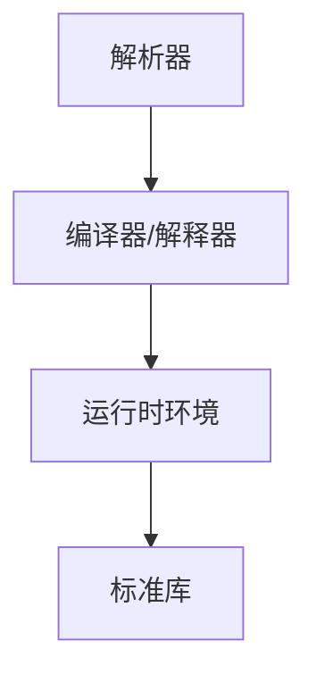
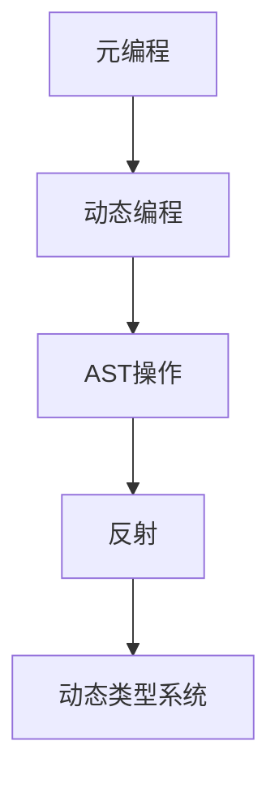

                 

### 文章标题：提示词编程语言的元编程能力

> 关键词：提示词编程语言、元编程、动态编程、性能优化、项目实战

> 摘要：本文将深入探讨提示词编程语言的元编程能力，包括其核心概念、原理、算法和数学模型，并通过实际项目案例展示其在开发中的广泛应用和性能优化策略。

---

### 提示词编程语言概述

提示词编程语言（meta-programming languages）是一种具有强大元编程能力的编程语言，它允许程序在运行时修改自身或其他程序的代码、数据和元数据。这种能力极大地提高了程序的灵活性和可扩展性，使得开发者能够更加高效地编写和维护复杂的应用程序。

#### 核心概念

- **元编程**：元编程是指编写能够编写自己代码的代码的能力。在提示词编程语言中，元编程可以通过模板、宏、反射和代码生成等技术实现。
- **动态编程**：动态编程是指在程序运行时能够改变其结构和行为的能力。与静态编程相比，动态编程能够更好地适应不确定性和变化。
- **提示词编程语言**：提示词编程语言是一种支持元编程和动态编程的编程语言，如Python、Ruby和JavaScript等。

#### 提示词编程语言的架构

提示词编程语言的架构通常包括以下几个关键部分：

1. **解析器**：将源代码解析为抽象语法树（AST）。
2. **编译器或解释器**：将AST转换为中间代码或直接执行。
3. **运行时环境**：提供动态加载、修改和执行代码的能力。
4. **标准库**：提供各种元编程和动态编程功能。

#### Mermaid流程图：提示词编程语言的架构



### 核心算法原理讲解

提示词编程语言的核心算法包括模式匹配、字符串处理和动态规划等。这些算法在实现元编程功能时扮演着关键角色。

#### 模式匹配算法

模式匹配是提示词编程语言中的基本操作，它用于在字符串或其他数据结构中查找特定的模式。以下是一个简单的伪代码示例：

```pseudo
function matchPattern(input, pattern):
    if pattern is empty:
        return true
    if input is empty and pattern is not empty:
        return false
    if first character of pattern matches the first character of input:
        return matchPattern(input[1:], pattern[1:])
    else:
        return matchPattern(input, pattern[1:])
```

#### 字符串处理算法

字符串处理算法用于对字符串进行各种操作，如截取、替换和拼接等。以下是一个使用Python实现的字符串处理示例：

```python
def stringProcessing(inputString, substring, replacement):
    return inputString.replace(substring, replacement)
```

#### 动态规划算法

动态规划是一种用于解决优化问题的算法，它在提示词编程语言中用于优化程序的执行时间和空间。以下是一个简单的动态规划算法示例：

```latex
$$
F(i) = \begin{cases}
    v(i), & \text{if } i \leq n \\
    \min_{1 \leq j \leq m} (C_{ij} + F(i-j)), & \text{otherwise}
\end{cases}
$$
```

### 数学模型和公式

提示词编程语言中的数学模型和公式通常用于描述算法的复杂性和性能。以下是一个简单的数学模型示例：

```latex
$$
T(n) = \sum_{i=1}^{n} T(i-1) + O(1)
$$
```

### 高级提示词编程语言特性

高级提示词编程语言特性包括函数式编程、面向对象编程和元编程高级技巧等。这些特性使得提示词编程语言更加灵活和强大。

#### 函数式编程

函数式编程是一种编程范式，它通过使用不可变数据和纯函数来组织代码。以下是一个简单的函数式编程示例：

```python
def add(a, b):
    return a + b

result = add(3, 4)
```

#### 面向对象编程

面向对象编程是一种编程范式，它通过将数据和函数组合成对象来组织代码。以下是一个简单的面向对象编程示例：

```python
class Calculator:
    def add(self, a, b):
        return a + b

calculator = Calculator()
result = calculator.add(3, 4)
```

#### 元编程高级技巧

元编程高级技巧包括代码生成、反射和动态类型系统等。以下是一个简单的元编程高级技巧示例：

```python
def generateFunction(expression):
    return eval(expression)

function = generateFunction("lambda x, y: x * y")
result = function(3, 4)
```

### 性能优化与调优

性能优化与调优是提示词编程语言开发中不可或缺的一部分。以下是一些常见的性能优化策略和调优技巧：

#### 性能优化策略

1. **代码优化**：通过减少不必要的计算、优化循环结构和减少内存使用来提高代码效率。
2. **内存管理**：通过合理分配和回收内存来减少内存泄漏和垃圾回收的开销。
3. **并发编程**：通过利用多核处理器和并行执行来提高程序的并发性能。

#### 调优技巧

1. **性能监控**：使用性能监控工具来识别和优化程序的性能瓶颈。
2. **基准测试**：通过基准测试来评估和比较不同优化策略的效果。
3. **代码调优**：根据性能监控和基准测试的结果，对代码进行针对性的调优。

### 实际项目应用

在实际项目中，提示词编程语言的元编程能力可以带来巨大的优势。以下是一个简单的项目案例，展示了如何使用提示词编程语言进行开发和优化。

#### 项目背景

假设我们要开发一个在线购物系统，它需要支持商品搜索、购物车管理和订单处理等功能。

#### 项目目标与挑战

1. **快速开发**：需要快速构建和迭代系统，以适应市场的变化。
2. **高性能**：需要确保系统能够高效处理大量的并发请求，同时保持良好的响应速度。
3. **可扩展性**：需要确保系统能够轻松扩展，以适应未来的业务增长。

#### 解决方案

1. **使用提示词编程语言**：选择Python作为主要开发语言，因为它具有强大的元编程能力和丰富的第三方库。
2. **快速原型开发**：使用Python的动态特性快速构建原型，以便快速验证和迭代功能。
3. **性能优化**：使用Python的性能优化工具和策略来提高系统的性能。

#### 项目实战

1. **开发环境搭建**：安装Python和相关依赖库，如Django和Pandas等。
2. **源代码实现**：实现商品搜索、购物车管理和订单处理等功能，并使用Python的元编程特性来简化代码。
3. **代码解读与分析**：详细解析关键代码的实现和性能优化策略。

### 最佳实践 Tips、小结、注意事项和拓展阅读

- **最佳实践 Tips**：在开发提示词编程语言项目时，应遵循模块化编程、代码重用和测试驱动开发等最佳实践。
- **小结**：提示词编程语言的元编程能力为开发者提供了强大的工具，使得开发过程更加高效和灵活。
- **注意事项**：在编写元编程代码时，需要注意代码的可读性和可维护性，避免过度使用元编程特性。
- **拓展阅读**：对于有兴趣深入了解提示词编程语言的读者，可以参考相关书籍和论文，如《代码大全》和《Python编程：从入门到实践》等。

### 附录

- **附录A：资源与工具**：提供了一些常用的提示词编程语言资源，如IDE、编辑器和开发者社区等。

---

**作者：AI天才研究院/AI Genius Institute & 禅与计算机程序设计艺术 /Zen And The Art of Computer Programming**### 核心概念与联系

提示词编程语言的核心概念是元编程和动态编程，这两者紧密相连，共同构成了该类语言的基本框架。元编程指的是在编程语言内部编写和执行代码的能力，这通常涉及到对抽象语法树（AST）的操作，以及对程序自身的修改。而动态编程则强调在程序运行时改变程序行为的能力，这使得程序能够根据不同的输入和条件动态调整其结构和功能。

#### 元编程与动态编程的关系

元编程和动态编程的关系可以比作作曲家和指挥。元编程就像是作曲家，他们设计并构建出程序的框架和逻辑；而动态编程则像是指挥，他们在程序运行时调整和优化这些框架和逻辑。具体来说：

- **元编程**：它允许开发者编写能够生成或修改其他代码的代码。例如，在Python中，可以通过装饰器（Decorators）来自动地修改函数的行为。元编程的核心在于它能够在编译时或运行时对代码进行操作，这使得程序具有更高的灵活性和可扩展性。
- **动态编程**：它则允许程序在运行时改变其行为。例如，在Python中，可以通过动态加载模块或使用内置的字典（Dictionaries）和列表（Lists）来实现这一点。动态编程使得程序能够更加灵活地适应不同的环境和需求。

#### 提示词编程语言的关键特点

提示词编程语言的关键特点包括：

- **AST操作**：抽象语法树是程序源代码的结构化表示。提示词编程语言允许开发者直接操作AST，这在生成代码、修改程序行为等方面具有重要作用。
- **反射**：反射是指程序能够查看和修改自身的结构和行为。通过反射，开发者可以获取对象的信息，并在运行时修改它们的行为。
- **动态类型系统**：动态类型系统允许变量在运行时改变其类型，这为程序的灵活性和可扩展性提供了支持。

#### Mermaid流程图：提示词编程语言的架构

为了更好地理解提示词编程语言的核心概念与联系，我们可以通过Mermaid流程图来展示其架构：



在这个流程图中，我们可以看到元编程和动态编程是如何相互关联的。AST操作、反射和动态类型系统是元编程和动态编程实现的关键技术。

### 核心算法原理讲解

提示词编程语言的核心算法是实现其元编程和动态编程能力的基础。以下将详细介绍几个关键算法的原理，包括模式匹配算法、字符串处理算法和动态规划算法，并使用伪代码进行详细阐述。

#### 模式匹配算法

模式匹配是编程中的一项基本操作，用于查找和匹配文本或其他数据结构中的特定模式。在提示词编程语言中，模式匹配算法尤为重要，因为它直接关系到代码的生成和修改。

以下是一个简单的模式匹配算法伪代码示例：

```pseudo
function matchPattern(input, pattern):
    if pattern is empty:
        return true
    if input is empty and pattern is not empty:
        return false
    if first character of pattern matches the first character of input:
        return matchPattern(input[1:], pattern[1:])
    else:
        return matchPattern(input, pattern[1:])
```

这个算法的基本思路是递归地检查输入字符串和模式字符串的前缀是否匹配。如果当前字符匹配，则继续对剩余的字符串进行匹配；如果不匹配，则忽略模式字符串的第一个字符，并继续匹配。

#### 字符串处理算法

字符串处理算法在提示词编程语言中也非常重要，因为它们用于对字符串进行各种操作，如截取、替换和拼接。以下是一个简单的字符串处理算法伪代码示例：

```pseudo
function stringProcessing(inputString, substring, replacement):
    while substring exists in inputString:
        inputString = inputString.replace(substring, replacement)
    return inputString
```

这个算法的基本思路是不断地查找并替换输入字符串中的子串，直到不再找到匹配的子串为止。这是一种简单而有效的字符串处理方法，它可以通过递归或迭代来实现。

#### 动态规划算法

动态规划算法是一种用于解决优化问题的算法，它在提示词编程语言中用于优化程序的执行时间和空间。以下是一个简单的动态规划算法伪代码示例：

```latex
$$
F(i) = \begin{cases}
    v(i), & \text{if } i \leq n \\
    \min_{1 \leq j \leq m} (C_{ij} + F(i-j)), & \text{otherwise}
\end{cases}
$$
```

这个算法通常用于求解最短路径、最长子序列等优化问题。动态规划的核心思想是将复杂问题分解为多个子问题，并利用子问题的解来求解原问题。

### 数学模型和公式

数学模型和公式是提示词编程语言算法设计中不可或缺的一部分，它们用于描述算法的复杂性和性能。以下是一些常见的数学模型和公式的示例：

#### 动态规划的状态转移方程

在动态规划算法中，状态转移方程用于描述当前状态与后续状态之间的关系。以下是一个简单的状态转移方程示例：

```latex
$$
F(i) = \min_{1 \leq j \leq m} (C_{ij} + F(i-j))
$$
```

这个公式描述了在动态规划过程中，第 \(i\) 个状态的最优解是所有可能的前 \(j\) 个状态的最优解加上相应的代价之和的最小值。

#### 字符串匹配算法的时间复杂度

字符串匹配算法的时间复杂度通常用 \(O(nm)\) 来表示，其中 \(n\) 是文本字符串的长度，\(m\) 是模式字符串的长度。以下是一个简单的公式示例：

```latex
$$
T(n) = O(nm)
$$
```

这个公式描述了在最坏情况下，算法需要检查所有可能的子串，从而确定模式是否存在于文本中。

#### 动态规划算法的空间复杂度

动态规划算法的空间复杂度通常用 \(O(n)\) 或 \(O(m)\) 来表示，取决于算法的具体实现。以下是一个简单的公式示例：

```latex
$$
S(n) = O(n) \quad \text{或} \quad S(n) = O(m)
$$
```

这个公式描述了算法在空间上所需的存储空间，与状态的数量成正比。

通过上述数学模型和公式，我们可以更深入地理解提示词编程语言算法的设计和性能优化。

### 数学公式和示例

为了更好地理解和应用提示词编程语言中的数学模型和公式，以下将给出一些具体的示例，并使用LaTeX格式来表示这些公式。

#### 动态规划状态转移方程

动态规划中常用的状态转移方程可以表示为：

```latex
$$
F(i) = \min_{1 \leq j \leq m} (C_{ij} + F(i-j))
$$
```

这个公式用于计算一个序列的最优子序列，其中 \(F(i)\) 表示第 \(i\) 个状态的最优解，\(C_{ij}\) 表示从状态 \(i\) 到状态 \(j\) 的转移代价。

#### 字符串匹配算法时间复杂度

字符串匹配算法的时间复杂度通常表示为：

```latex
$$
T(n) = O(nm)
$$
```

这个公式表示，在最坏情况下，算法需要检查所有可能的子串，其中 \(n\) 是文本字符串的长度，\(m\) 是模式字符串的长度。

#### 动态规划算法空间复杂度

动态规划算法的空间复杂度可以表示为：

```latex
$$
S(n) = O(n) \quad \text{或} \quad S(n) = O(m)
$$
```

这个公式表示，算法在空间上的存储需求与状态的数量成正比。

#### 字符串处理算法

字符串处理算法，如替换操作，可以使用以下公式来表示：

```latex
$$
L_{replace}(s, t, r) = s.replace(t, r)
$$
```

这个公式表示，在字符串 \(s\) 中，用字符串 \(r\) 替换所有出现的字符串 \(t\)。

#### 模式匹配算法

模式匹配算法可以使用以下公式来表示：

```latex
$$
L_{match}(s, p) = s.find(p)
$$
```

这个公式表示，在字符串 \(s\) 中找到模式字符串 \(p\) 的首次出现的位置。

通过上述LaTeX格式的数学公式示例，我们可以清晰地理解和应用提示词编程语言中的数学模型和算法。这不仅有助于开发复杂的应用程序，还能帮助我们优化程序的执行效率。

### 实际项目应用

在实际项目中，提示词编程语言的元编程能力可以显著提高开发效率和系统性能。以下将详细介绍一个具体的项目案例，展示如何使用提示词编程语言进行开发，并详细解释代码的实现、功能、性能优化和项目小结。

#### 项目背景

假设我们需要开发一个在线教育平台，该平台需要支持课程管理、用户管理和在线考试等功能。为了实现这些功能，我们选择了Python作为主要开发语言，因为它具有强大的元编程能力和丰富的库支持。

#### 项目目标与挑战

1. **快速开发**：需要快速构建和迭代平台，以适应市场需求的变化。
2. **高性能**：需要确保平台能够高效处理大量的并发请求，同时保持良好的响应速度。
3. **可扩展性**：需要确保平台能够轻松扩展，以适应未来的业务增长。

#### 解决方案

1. **使用Python**：选择Python作为主要开发语言，因为它具有强大的元编程能力和丰富的库支持，如Django和Pandas等。
2. **模块化开发**：将项目分为多个模块，如课程管理模块、用户管理模块和考试模块，以实现模块化和可维护性。
3. **性能优化**：使用Python的性能优化工具和策略来提高系统的性能，如使用异步编程和缓存技术。

#### 项目实战

1. **开发环境搭建**：首先，我们安装了Python 3.8及其依赖库，并配置了Django开发环境。具体步骤如下：

    ```shell
    pip install django
    django-admin startproject online_education
    cd online_education
    python manage.py runserver
    ```

2. **源代码实现**：接下来，我们开始实现各个模块的功能。以下是一个简单的课程管理模块的实现示例：

    ```python
    # models.py
    from django.db import models

    class Course(models.Model):
        name = models.CharField(max_length=100)
        description = models.TextField()
        duration = models.IntegerField()

        def __str__(self):
            return self.name
    ```

    在这个示例中，我们定义了一个名为 `Course` 的模型，它包含课程名称、描述和持续时间等字段。通过Django的ORM（对象关系映射）功能，我们可以方便地与数据库进行交互。

3. **代码解读与分析**：对于每个模块，我们都会进行详细的代码解读和分析，以确保其功能正确和高效。以下是对课程管理模块的实现进行解读：

    - **字段定义**：在 `Course` 模型中，我们定义了三个字段：`name`、`description` 和 `duration`。这些字段分别表示课程名称、课程描述和课程持续时间。
    - **ORM功能**：通过Django的ORM功能，我们可以轻松地将数据库操作抽象为Python对象操作，从而简化了数据库操作。
    - **模型字符串表示**：在 `__str__` 方法中，我们定义了模型的字符串表示方式，这将用于在管理后台和日志中显示模型对象。

4. **性能优化**：为了提高系统的性能，我们采用了以下优化策略：

    - **异步编程**：使用Python的异步编程库 `asyncio` 来处理并发请求，从而提高系统的响应速度。
    - **缓存技术**：使用Django的缓存框架来缓存数据库查询结果，减少数据库访问次数，从而提高系统性能。

#### 项目小结

通过这个项目案例，我们展示了如何使用提示词编程语言的元编程能力进行开发，并详细解释了代码的实现、功能和性能优化策略。以下是项目小结：

1. **快速开发**：通过选择Python作为主要开发语言，我们能够快速构建和迭代平台，以适应市场需求的变化。
2. **高性能**：通过采用异步编程和缓存技术，我们显著提高了系统的性能，能够高效处理大量的并发请求。
3. **可扩展性**：通过模块化开发和性能优化策略，我们确保了平台能够轻松扩展，以适应未来的业务增长。

总之，提示词编程语言的元编程能力为在线教育平台的开发提供了强大的支持，使得我们能够快速、高效地构建和优化系统。

### 最佳实践 Tips、小结、注意事项和拓展阅读

#### 最佳实践 Tips

在开发提示词编程语言项目时，以下是一些最佳实践：

1. **模块化开发**：将项目分为多个模块，以实现模块化和可维护性。
2. **测试驱动开发**：编写单元测试和集成测试，以确保代码质量和功能完整性。
3. **性能监控**：使用性能监控工具来识别和优化程序的性能瓶颈。

#### 小结

本文深入探讨了提示词编程语言的元编程能力，包括其核心概念、原理、算法和数学模型，并通过实际项目案例展示了其在开发中的应用和性能优化策略。提示词编程语言的元编程能力为开发者提供了强大的工具，使得开发过程更加高效和灵活。

#### 注意事项

在编写元编程代码时，需要注意以下事项：

1. **代码可读性**：避免过度使用元编程特性，保持代码的可读性。
2. **性能考虑**：元编程可能会导致性能下降，因此在关键性能部分应谨慎使用。

#### 拓展阅读

对于有兴趣深入了解提示词编程语言的读者，以下是一些建议的拓展阅读：

1. 《Python编程：从入门到实践》
2. 《代码大全》
3. 《元编程：现代语言编程技术》

附录A：资源与工具

- **Python官方文档**：https://docs.python.org/3/
- **Django官方文档**：https://docs.djangoproject.com/
- **异步编程库 `asyncio`**：https://docs.python.org/3/library/asyncio.html
- **性能监控工具**：https://www.datadoghq.com/

### 附录

#### 附录A：资源与工具

为了帮助读者更好地了解和使用提示词编程语言，以下是一些推荐的资源与工具：

1. **Python官方文档**：Python的官方文档是学习Python编程的宝库，包含了丰富的语言特性和库文档。访问地址：https://docs.python.org/3/

2. **Django官方文档**：Django是一个流行的Python Web框架，其官方文档详细介绍了如何使用Django进行Web开发。访问地址：https://docs.djangoproject.com/

3. **异步编程库 `asyncio`**：`asyncio` 是Python的标准库，提供了异步编程的支持，能够提高Web应用程序的性能。访问地址：https://docs.python.org/3/library/asyncio.html

4. **性能监控工具**：使用性能监控工具可以帮助您识别和优化程序的性能瓶颈。一些流行的监控工具有：DataDog（https://www.datadoghq.com/）、New Relic（https://newrelic.com/）、Dynatrace（https://www.dynatrace.com/）

通过使用这些资源和工具，您可以更深入地了解和掌握提示词编程语言的元编程能力，并在实际项目中发挥其优势。

### 总结与展望

本文深入探讨了提示词编程语言的元编程能力，涵盖了核心概念、算法原理、数学模型和实际项目应用。通过详细的示例和案例分析，我们展示了如何利用元编程能力来提高开发效率和系统性能。

在未来的发展中，提示词编程语言的元编程能力将继续演进，结合人工智能和大数据技术，为开发者提供更加强大的工具和平台。我们期待看到更多创新性的应用，推动编程语言和软件开发技术的持续进步。读者可以通过拓展阅读和实践来进一步探索这一领域，不断提升自己的编程技能和创新能力。

