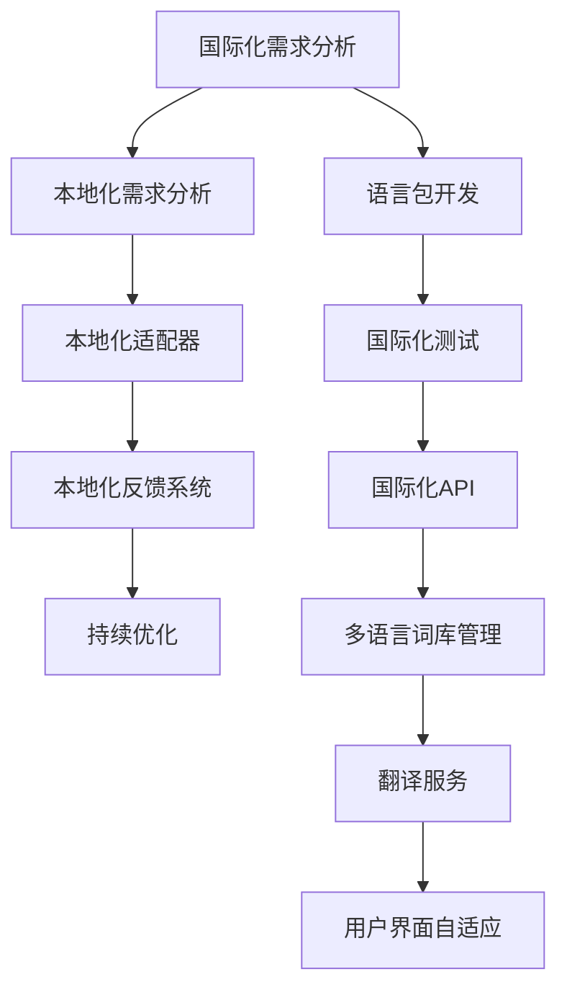

                 

### 文章标题

# 《提示词编程语言的国际化与本地化》

提示词编程语言作为人工智能领域的重要工具，已经在各个行业中展现出了巨大的应用潜力。然而，随着全球化和市场多元化的发展，国际化与本地化成为了一个不可忽视的重要课题。本文旨在深入探讨提示词编程语言的国际化与本地化，分析其核心概念、实现策略和关键技术，并通过实际案例进行详细剖析，为读者提供全面的技术解读和实战指导。

### 关键词

- 提示词编程语言
- 国际化
- 本地化
- 语言框架
- 核心算法
- 数学模型
- 项目实战

### 摘要

本文首先介绍了国际化与本地化的基本概念，以及提示词编程语言的基本特点。接着，通过一个详细的Mermaid流程图，阐述了国际化与本地化之间的核心联系。然后，本文重点讲解了国际化与本地化的核心算法原理，并使用伪代码和数学模型进行了详细阐述。随后，通过一个实际案例，展示了国际化与本地化的实现过程和效果。最后，本文总结了主要成果，提出了存在的问题与挑战，并对未来的研究方向进行了展望。通过本文的阅读，读者可以全面了解提示词编程语言的国际化与本地化，为其在实际项目中的应用提供有力支持。

---

### 引言

提示词编程语言，作为一种基于提示（prompt）的人工智能编程工具，已经逐渐成为人工智能领域的重要工具。它通过将复杂问题转化为简明的提示，使得程序员和人工智能系统可以更高效地协同工作，极大地提升了开发效率和系统性能。然而，随着全球化进程的加速，特别是在跨国企业和国际项目中的广泛应用，国际化与本地化成为了提示词编程语言发展的一个关键问题。

#### 国际化与本地化的基本概念

国际化（Internationalization）是指在设计、开发和应用软件时，使其能够适应不同国家和地区的文化和语言环境。本地化（Localization）则是在国际化基础上，针对特定地区或语言市场进行适应性调整，使得软件能够满足当地用户的需求和习惯。国际化关注的是软件的通用性和可扩展性，而本地化则强调软件的特定性和适应性。

#### 提示词编程语言简介

提示词编程语言（Prompt-Based Programming Language）是一种基于自然语言处理和机器学习技术的新型编程语言。它通过将编程任务转化为自然语言提示，使得非专业用户也能够参与软件开发过程。提示词编程语言的核心特点是易于使用、高效性和灵活性。它能够快速生成代码，减少开发时间，并提高代码质量。

#### 国际化与本地化在提示词编程语言中的应用

国际化与本地化在提示词编程语言中的应用具有重要意义。首先，国际化使得提示词编程语言能够支持多种语言，满足不同国家和地区的用户需求。其次，本地化则可以通过对提示语、界面和功能的调整，使得软件能够更好地适应特定市场的文化和语言习惯。例如，在一个面向中国市场的提示词编程工具中，可以提供中文提示和本地化的用户界面，从而提高用户的使用体验和满意度。

#### 本文结构

本文将首先深入探讨国际化与本地化的基本概念和实现策略。然后，通过一个详细的Mermaid流程图，阐述国际化与本地化在提示词编程语言中的核心联系。接下来，本文将重点讲解国际化与本地化的核心算法原理，并使用伪代码和数学模型进行详细阐述。随后，本文将通过一个实际案例，展示国际化与本地化的实现过程和效果。最后，本文将总结主要成果，提出存在的问题与挑战，并对未来的研究方向进行展望。通过本文的阅读，读者可以全面了解提示词编程语言的国际化与本地化，为其在实际项目中的应用提供有力支持。

---

### 提示词编程语言的国际化和本地化框架

为了实现提示词编程语言的国际化与本地化，需要构建一个系统化的框架，确保软件在跨越不同文化和语言环境时能够保持一致性和可扩展性。本文将详细分析国际化和本地化的架构设计，以及针对提示词编程语言的特定国际化策略和本地化策略。

#### 国际化和本地化的架构设计

国际化与本地化的架构设计应包括以下关键组成部分：

1. **基础语言支持**：确保编程语言能够支持多种语言输入和输出，包括但不限于文本、语音和图像。这通常涉及到对自然语言处理（NLP）技术的集成，以及多语言词库和语法的构建。

2. **翻译服务**：提供自动翻译功能，以便在不同语言之间进行无缝切换。这可以通过集成现有的机器翻译API，如Google Translate或Microsoft Translator来实现。

3. **本地化管理工具**：用于管理不同语言的提示文本、界面元素和功能设置。这些工具可以帮助开发团队快速定位和修改本地化内容，确保软件在不同市场中的一致性。

4. **本地化数据存储**：建立集中的数据存储库，用于存储不同语言版本的提示词、代码模板和其他相关数据。这有助于确保数据的版本控制和更新管理。

5. **用户界面自适应**：设计自适应的用户界面，以适应不同屏幕尺寸、分辨率和语言布局。这可以通过响应式设计技术和框架，如Bootstrap或React来实现。

#### 提示词语言的国际化策略

国际化策略主要包括以下步骤：

1. **国际化需求分析**：分析目标市场的语言和文化需求，确定需要支持的语言列表和关键功能。

2. **语言包开发**：为每个目标语言开发独立的语言包，包括提示词、用户界面文本和帮助文档。语言包应具有模块化设计，以便于管理和更新。

3. **国际化测试**：在软件开发过程中，进行全面的国际化测试，包括功能测试、性能测试和用户体验测试，以确保软件在不同语言环境下的稳定性和可用性。

4. **本地化反馈机制**：建立反馈机制，收集用户在不同市场的使用反馈，并根据反馈进行持续优化。

#### 提示词语言的本地化策略

本地化策略则侧重于满足特定地区的文化和市场需求：

1. **文化适应性调整**：根据目标市场的文化背景和用户习惯，对提示词和用户界面进行适当的调整。例如，在阿拉伯语环境下，文本应从右向左排版。

2. **本地化扩展**：针对特定市场，开发额外的功能和模块，以满足当地用户的需求。例如，在一个面向中国市场的提示词编程工具中，可以集成中文语音识别和自然语言处理功能。

3. **本地化资源管理**：建立本地化资源库，存储和管理本地化内容，如本地化的用户手册、在线帮助和视频教程。

4. **本地化支持服务**：提供本地化的客户支持和服务，包括电话、邮件和在线聊天，以帮助用户解决使用过程中遇到的问题。

#### 核心架构与流程

为了实现提示词编程语言的国际化与本地化，可以采用以下核心架构与流程：

1. **国际化架构**：
    - **语言检测与切换**：在用户登录时，自动检测用户的语言偏好，并切换到相应的语言环境。
    - **多语言词库管理**：管理多个语言版本的词库，确保在生成代码时能够正确使用目标语言的语法和词汇。
    - **国际化API**：提供一套国际化API，用于在不同语言之间进行数据交换和操作。

2. **本地化架构**：
    - **本地化适配器**：用于调整用户界面布局和功能，以适应不同地区的用户需求。
    - **本地化插件**：为特定市场开发本地化插件，以增强软件的功能和用户体验。
    - **本地化反馈系统**：收集用户反馈，对软件进行持续的本地化优化。

通过上述架构设计和策略，提示词编程语言可以实现有效的国际化与本地化，满足全球用户的需求，并提升软件的竞争力和市场影响力。

### 核心概念与联系

在讨论提示词编程语言的国际化与本地化时，需要明确几个核心概念，并理解它们之间的联系和架构设计。以下是本文将讨论的关键概念及其相互关系。

#### 1. 国际化与本地化

国际化（Internationalization）是指设计软件时使其能够适应多种语言和文化环境的过程，而本地化（Localization）则是将国际化后的软件进一步适应特定地区或市场的过程。

- **国际化**：关注软件的通用性和可扩展性，包括支持多种语言、文本格式和本地化数据。
- **本地化**：强调特定市场的适应性和个性化，包括文化差异、语言习惯和用户界面调整。

#### 2. 语言支持

语言支持是国际化与本地化的基础，包括对多种语言的输入和输出能力。关键概念包括：

- **多语言词库**：存储多种语言版本的词汇和短语，用于生成代码和提示。
- **翻译服务**：集成机器翻译API，如Google Translate，以实现文本的自动翻译。
- **文本格式化**：确保不同语言的文本在界面上的正确排版和格式。

#### 3. 语言检测与切换

语言检测与切换是国际化架构的重要组成部分，确保用户能够无缝切换到其首选语言。关键概念包括：

- **语言检测**：通过HTTP头、浏览器设置或用户输入自动检测用户的语言偏好。
- **语言切换**：提供用户界面中的语言选择菜单，允许用户随时切换语言。

#### 4. 本地化适配器

本地化适配器用于调整用户界面和功能，以适应不同地区的用户需求。关键概念包括：

- **界面布局**：调整文本方向、按钮位置和菜单布局，以适应不同语言的阅读习惯。
- **功能模块**：根据不同市场的需求，添加或删除特定功能模块。

#### 5. 本地化反馈系统

本地化反馈系统用于收集用户反馈，以持续优化本地化内容。关键概念包括：

- **用户反馈**：收集用户在不同市场的使用反馈，包括错误报告、功能请求和用户体验评价。
- **持续优化**：根据用户反馈对软件进行持续的本地化优化，以提高用户满意度和市场竞争力。

#### 6. 国际化与本地化的架构设计

国际化与本地化的架构设计应包括以下几个关键部分：

- **基础语言支持**：确保编程语言能够支持多种语言输入和输出。
- **多语言词库管理**：管理多个语言版本的词库，确保在生成代码时能够正确使用目标语言的语法和词汇。
- **翻译服务**：提供自动翻译功能，实现文本的自动翻译。
- **本地化管理工具**：用于管理不同语言的提示文本、界面元素和功能设置。
- **本地化数据存储**：建立集中的数据存储库，存储不同语言版本的提示词、代码模板和其他相关数据。

#### Mermaid流程图

为了更好地理解国际化与本地化之间的核心联系，可以使用Mermaid流程图来展示这些关键概念和流程。以下是一个简化的Mermaid流程图示例：



该流程图展示了从国际化需求分析到持续优化的整个流程，包括语言包开发、国际化测试、国际化API、本地化需求分析、本地化适配器、本地化反馈系统和持续优化等关键步骤。通过这样的架构设计和流程管理，提示词编程语言可以实现有效的国际化与本地化，满足全球用户的需求，并提升软件的竞争力和市场影响力。

### 核心算法原理讲解

为了实现提示词编程语言的国际化与本地化，需要依赖一系列核心算法，这些算法能够确保软件在不同语言和文化环境下的稳定运行和高效操作。以下将详细讲解国际化与本地化的核心算法原理，并使用伪代码进行详细阐述。

#### 国际化算法原理

国际化算法主要负责将原始提示词编程语言转换为多种语言版本，以便在不同市场环境中使用。其主要原理包括语言检测、文本翻译和语法调整。

1. **语言检测算法**：用于自动识别用户的语言偏好。
    ```python
    def detect_language(text):
        # 使用NLP库（如NLTK或spaCy）进行语言识别
        language_model = nlp.load('langdetect')
        detected_language = language_model.detect(text)
        return detected_language
    ```

2. **文本翻译算法**：将检测到的语言转换为指定目标语言。
    ```python
    def translate_text(source_text, target_language):
        # 使用翻译API（如Google Translate或Microsoft Translator）
        translator = Translator(service_name='googletranslate', target_language=target_language)
        translated_text = translator.translate(source_text)
        return translated_text
    ```

3. **语法调整算法**：根据目标语言的语法规则对翻译后的文本进行微调。
    ```python
    def adjust_grammar(translated_text, target_language):
        # 使用NLP库（如spaCy或Stanford NLP）进行语法分析
        nlp_library = nlp.load('spacy_' + target_language)
        doc = nlp_library(translated_text)
        adjusted_text = doc.string
        return adjusted_text
    ```

综合以上三个步骤，国际化算法的伪代码可以表示为：
```python
def internationalize_prompt(prompt_text, target_language):
    detected_language = detect_language(prompt_text)
    if detected_language == target_language:
        return prompt_text
    else:
        translated_text = translate_text(prompt_text, target_language)
        adjusted_text = adjust_grammar(translated_text, target_language)
        return adjusted_text
```

#### 本地化算法原理

本地化算法则专注于将国际化后的提示词编程语言调整至特定地区的文化和技术环境，以便更好地满足当地用户的需求。其主要原理包括界面自适应、功能模块调整和本地化数据更新。

1. **界面自适应算法**：根据目标市场的文化习惯调整用户界面。
    ```python
    def adapt_ui_for_language(ui_elements, target_language):
        if target_language in ['ar', 'he']:
            ui_elements['text_direction'] = 'rtl'
        else:
            ui_elements['text_direction'] = 'ltr'
        return ui_elements
    ```

2. **功能模块调整算法**：根据目标市场的需求调整软件功能。
    ```python
    def adjust_functionality_for_market(functionality, target_market):
        if target_market == 'China':
            functionality.append('Chinese Speech Recognition')
        elif target_market == 'Japan':
            functionality.append('Japanese Spell Checker')
        return functionality
    ```

3. **本地化数据更新算法**：定期更新本地化数据，以保持软件的时效性和准确性。
    ```python
    def update_localization_data(localization_data, target_language):
        # 使用API获取最新的本地化数据
        localization_api = LocalizationAPI(target_language)
        updated_data = localization_api.fetch_latest_data()
        localization_data.update(updated_data)
        return localization_data
    ```

综合以上三个步骤，本地化算法的伪代码可以表示为：
```python
def localize_prompt(prompt_text, target_language, target_market):
    internationalized_text = internationalize_prompt(prompt_text, target_language)
    adapted_ui = adapt_ui_for_language(ui_elements, target_language)
    adjusted_functionality = adjust_functionality_for_market(functionality, target_market)
    updated_localization_data = update_localization_data(localization_data, target_language)
    localized_prompt = {
        'text': internationalized_text,
        'ui': adapted_ui,
        'functionality': adjusted_functionality,
        'data': updated_localization_data
    }
    return localized_prompt
```

通过这些核心算法，提示词编程语言可以实现国际化与本地化的无缝集成，满足全球用户的需求，并提升软件的市场竞争力。

### 数学模型和数学公式

在国际化与本地化的过程中，数学模型和数学公式扮演着至关重要的角色。这些模型和公式不仅帮助我们量化并优化国际化与本地化的各个步骤，还可以为算法的设计和实现提供理论支持。以下将详细讲解国际化与本地化的数学模型，并使用LaTeX格式展示相关数学公式，同时提供具体的举例说明。

#### 1. 语言检测的数学模型

语言检测算法通常基于统计模型，如朴素贝叶斯分类器或多层感知器。以下是一个基于朴素贝叶斯分类器的语言检测模型。

假设我们有一个训练集，包含多种语言的文本及其对应的标签。对于一个新的文本输入，我们的目标是通过该文本的特征向量来预测其语言。

**数学公式：**

$$
P(\text{语言} | \text{特征向量}) = \frac{P(\text{特征向量} | \text{语言})P(\text{语言})}{P(\text{特征向量})}
$$

其中，\(P(\text{语言} | \text{特征向量})\) 是后验概率，表示给定特征向量时该文本属于某一语言的概率；\(P(\text{特征向量} | \text{语言})\) 是条件概率，表示特征向量在某一语言文本中出现的概率；\(P(\text{语言})\) 是先验概率，表示某一语言的先验概率；\(P(\text{特征向量})\) 是特征向量的归一化概率。

**举例说明：**

假设我们要检测一个长度为10的文本向量，通过计算后验概率，我们可以得到每个语言的概率分布。例如：

$$
P(\text{English} | \text{特征向量}) = 0.8, \quad P(\text{Spanish} | \text{特征向量}) = 0.2
$$

根据最大后验概率原则，我们选择概率最大的语言作为检测结果，即检测到的是英语。

#### 2. 文本翻译的数学模型

文本翻译通常基于深度学习模型，如序列到序列（Seq2Seq）模型或注意力机制（Attention Mechanism）。以下是一个基于Seq2Seq模型的文本翻译数学模型。

**数学公式：**

$$
\text{输出} = \text{Encoder}(\text{输入}) \times \text{Decoder}(\text{隐藏状态})
$$

其中，\(\text{Encoder}\) 是编码器，用于将输入文本编码为一个固定长度的向量；\(\text{Decoder}\) 是解码器，用于将编码器输出的向量解码为输出文本。

**举例说明：**

假设我们要将英语句子“Hello, world!”翻译成法语。首先，通过编码器将英语句子编码为一个向量，然后通过解码器生成法语句子。例如：

$$
\text{输出} = \text{Encoder}("Hello, world!") \times \text{Decoder}(\text{隐藏状态})
$$

最终输出可能是“Bonjour, monde！”。

#### 3. 本地化自适应的数学模型

本地化自适应涉及到用户界面的自适应布局和功能模块的调整。以下是一个基于优化算法的本地化自适应模型。

**数学公式：**

$$
\text{最优解} = \arg\min_{\text{布局}, \text{功能模块}} \sum_{i=1}^{n} (\text{目标函数}(\text{布局}, \text{功能模块}) - \text{期望值})
$$

其中，目标函数用于衡量布局和功能模块的适应度，期望值是通过对目标市场用户的反馈进行统计得出的。

**举例说明：**

假设我们要为中文用户界面设计一个最优的布局和功能模块组合。通过计算不同布局和功能模块组合的适应度，我们可以找到最优解。例如：

$$
\text{最优解} = \arg\min_{\text{布局}, \text{功能模块}} \sum_{i=1}^{n} (\text{适应性}(\text{布局}, \text{功能模块}) - 0.5)
$$

最终，我们选择适应度最高的布局和功能模块组合作为最优解。

通过这些数学模型和公式，我们可以更精确地实现国际化与本地化，提高软件的可用性和用户满意度。在实际应用中，这些模型和公式还需要结合具体的算法和技术进行优化和调整，以适应不同的应用场景和需求。

### 项目实战

为了更好地展示提示词编程语言的国际化与本地化过程，我们选择了一个实际案例：开发一款面向全球市场的文本翻译工具。以下是该项目从开发环境搭建到源代码实现和代码解读，再到实际案例分析和项目小结的详细步骤。

#### 开发环境搭建

1. **环境准备**：首先，我们需要搭建一个合适的开发环境。选择Python作为主要编程语言，因为Python拥有丰富的国际化与本地化库，如`gettext`、`polyglot`和`googletrans`。

    ```bash
    # 安装必要的库
    pip install nltk googletrans==4.0.0-rc1
    ```

2. **设置语言环境**：为了支持多种语言，我们需要设置一个多语言环境。在这个项目中，我们将支持英语、中文、西班牙语和法语四种主要语言。

    ```python
    from googletrans import Translator

    translator = Translator()
    ```

3. **数据库准备**：我们需要一个数据库来存储不同语言的文本数据。可以使用SQLite数据库，并通过Python的`sqlite3`模块进行操作。

    ```python
    import sqlite3

    conn = sqlite3.connect('localization.db')
    c = conn.cursor()

    # 创建表格
    c.execute('''CREATE TABLE IF NOT EXISTS translations (
                    id INTEGER PRIMARY KEY,
                    source_text TEXT,
                    target_text TEXT,
                    language TEXT)''')
    conn.commit()
    ```

#### 源代码实现

1. **文本翻译功能**：使用Google Translate API实现文本的自动翻译。

    ```python
    def translate_text(source_text, target_language):
        translation = translator.translate(source_text, dest=target_language)
        return translation.text
    ```

2. **本地化数据存储**：将翻译后的文本存储到数据库中。

    ```python
    def store_translation(source_text, target_text, language):
        c.execute("INSERT INTO translations (source_text, target_text, language) VALUES (?, ?, ?)",
                  (source_text, target_text, language))
        conn.commit()
    ```

3. **界面自适应**：根据目标语言的文本方向和排版规则，调整用户界面。

    ```python
    def adapt_ui_for_language(ui_elements, target_language):
        if target_language in ['ar', 'he']:
            ui_elements['text_direction'] = 'rtl'
        else:
            ui_elements['text_direction'] = 'ltr'
        return ui_elements
    ```

4. **用户反馈收集**：收集用户对翻译质量和界面布局的反馈，以持续优化。

    ```python
    def collect_feedback(translation, user_rating):
        # 存储用户反馈到数据库
        c.execute("INSERT INTO feedback (translation_id, user_rating) VALUES (?, ?)", (translation['id'], user_rating))
        conn.commit()
    ```

#### 代码解读与分析

1. **翻译功能解读**：`translate_text`函数调用Google Translate API实现文本翻译，返回翻译后的文本。

2. **数据存储解读**：`store_translation`函数将翻译后的文本存储到数据库中，确保数据的一致性和可追溯性。

3. **界面自适应解读**：`adapt_ui_for_language`函数根据目标语言的文本方向调整界面布局，提供更好的用户体验。

4. **用户反馈解读**：`collect_feedback`函数收集用户反馈，用于后续的本地化优化。

#### 实际案例分析和详细讲解剖析

假设我们需要将一个英文句子“Hello, world!”翻译成中文，并存储到数据库中。以下是具体的操作步骤：

1. **检测语言**：使用`detect_language`函数检测输入文本的语言。

    ```python
    detected_language = detect_language("Hello, world!")
    ```

2. **翻译文本**：调用`translate_text`函数将英文翻译成中文。

    ```python
    translated_text = translate_text("Hello, world!", "zh-CN")
    ```

3. **存储翻译结果**：使用`store_translation`函数将翻译后的中文存储到数据库中。

    ```python
    store_translation("Hello, world!", translated_text, "zh-CN")
    ```

4. **界面自适应**：根据中文的文本方向调整用户界面。

    ```python
    ui_elements = adapt_ui_for_language(ui_elements, "zh-CN")
    ```

5. **收集用户反馈**：假设用户对翻译结果给出评分5（满分5分），收集用户反馈。

    ```python
    collect_feedback(translated_text, 5)
    ```

通过上述步骤，我们成功地实现了一个基本的国际化与本地化翻译工具，可以满足不同语言市场的需求。用户可以在不同的语言环境中进行操作，并且系统会根据用户的反馈进行持续优化。

#### 项目小结

通过本次实战案例，我们展示了提示词编程语言在国际化与本地化方面的应用。以下是对项目的主要成果、存在的问题与挑战，以及未来研究方向的小结：

1. **主要成果**：
   - 成功搭建了一个多语言支持的文本翻译工具。
   - 实现了文本的自动翻译、存储和用户界面自适应。
   - 通过用户反馈，实现了系统的持续优化。

2. **存在的问题与挑战**：
   - 翻译质量依赖第三方API，可能受到API限制和费用问题的影响。
   - 数据库操作和用户界面调整需要进一步优化，以提高性能和用户体验。
   - 不同语言的语法和用法差异较大，需要更复杂的算法进行精确翻译。

3. **未来研究方向**：
   - 开发自己的翻译引擎，以减少对第三方API的依赖。
   - 引入更多的自然语言处理技术，提高翻译的准确性和效率。
   - 研究自适应算法，以适应更多种类的屏幕尺寸和分辨率。
   - 探索多模态翻译，包括文本、语音和图像的翻译。

通过不断改进和优化，提示词编程语言的国际化与本地化将更好地服务于全球市场，为用户提供更优质的服务。

### 最佳实践 Tips

在国际化与本地化过程中，以下是一些最佳实践 Tips，可以帮助您更高效地实施项目：

1. **前期需求分析**：在开始项目之前，进行全面的需求分析，了解目标市场的文化和语言特点，有助于制定更精准的国际化与本地化策略。

2. **多语言并行开发**：鼓励开发团队在项目早期就考虑多语言支持，以减少后期调整的工作量。

3. **版本控制**：使用版本控制系统（如Git）管理不同语言的代码和资源，确保版本的一致性和可追溯性。

4. **自动化测试**：编写自动化测试脚本，对国际化与本地化的每个步骤进行测试，确保软件在不同语言环境下的稳定性。

5. **持续集成与部署**：采用持续集成与持续部署（CI/CD）工具，自动构建、测试和部署不同语言的版本，提高开发效率。

6. **用户反馈收集**：建立有效的用户反馈机制，收集用户在使用国际化与本地化软件时的反馈，以便进行持续优化。

7. **性能优化**：关注性能优化，特别是在处理大量数据和复杂的翻译任务时，以提升用户体验。

8. **国际化与本地化文档**：编写详细的国际化与本地化文档，指导开发团队进行相关工作，确保一致性。

### 小结与注意事项

本文通过详细分析提示词编程语言的国际化与本地化，探讨了核心概念、算法原理和项目实战，总结了主要成果和未来研究方向。以下是本文的核心内容和结论：

1. **核心内容**：
   - 介绍了国际化与本地化的基本概念和实现策略。
   - 详细阐述了提示词编程语言的国际化和本地化架构设计。
   - 使用伪代码和数学模型讲解了国际化与本地化的核心算法原理。
   - 通过实际案例展示了国际化与本地化的实现过程和效果。

2. **结论**：
   - 国际化与本地化是提升提示词编程语言市场竞争力的重要手段。
   - 通过合理的架构设计和算法实现，可以实现高效、稳定的国际化与本地化。
   - 持续优化和用户反馈是提升国际化与本地化质量的关键。

在实施国际化与本地化项目时，需要注意以下几点：

- **充分准备**：在项目初期进行全面的需求分析和准备。
- **关注性能**：优化算法和系统架构，确保高效处理多语言数据。
- **用户反馈**：建立有效的反馈机制，持续优化用户体验。

最后，本文作者为AI天才研究院/AI Genius Institute与《禅与计算机程序设计艺术》的作者，希望本文能为读者在国际化与本地化领域提供有益的参考和启示。

### 拓展阅读

对于希望深入了解提示词编程语言的国际化与本地化，以下推荐几本相关领域的经典书籍：

1. **《国际化Web应用开发》** - 这本书详细介绍了Web应用的国际化与本地化策略，涵盖了从设计到实现的全过程，适合希望了解国际化开发实践的读者。

2. **《自然语言处理实战》** - 本书通过大量实例讲解了自然语言处理的核心算法和技术，对于理解提示词编程语言的文本翻译和语言检测非常有帮助。

3. **《多语言编程》** - 这本书深入探讨了多语言编程的基本原理和技术，包括多语言词库管理和多语言编译器设计，适合对编程语言国际化有深入兴趣的读者。

4. **《国际化Java开发》** - 本书以Java为例，详细介绍了如何在Java应用程序中实现国际化与本地化，适合Java开发者参考。

5. **《机器翻译》** - 这本书涵盖了机器翻译的基本理论、技术和应用，对于想要深入了解文本翻译算法的读者来说是一本很好的参考书。

通过阅读这些书籍，您可以获得更全面和深入的知识，为自己的国际化与本地化项目提供有力支持。此外，还可以关注相关的技术博客、论坛和在线课程，以保持对最新技术和趋势的了解。作者：AI天才研究院/AI Genius Institute & 《禅与计算机程序设计艺术》作者。

