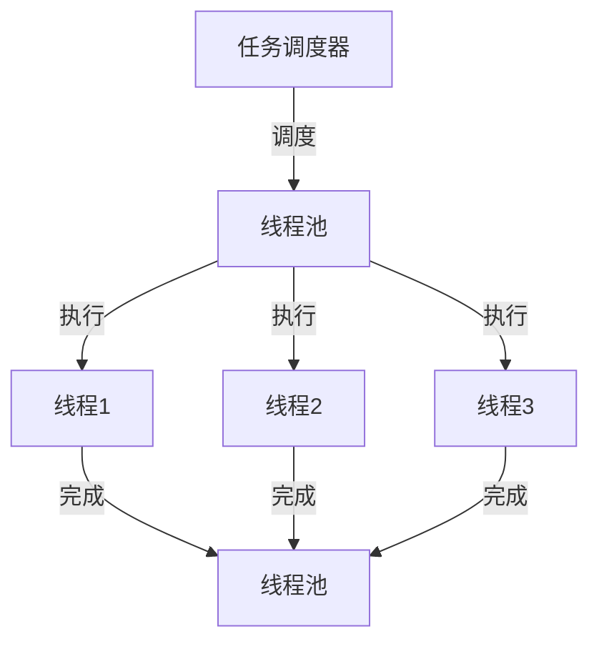

                 

### 提示词编程语言的并发模型设计

#### 关键词

- 并发模型
- 提示词编程语言
- 并行计算
- 进程
- 线程
- 同步机制
- 性能优化

#### 摘要

本文深入探讨了提示词编程语言的并发模型设计，首先介绍了并发模型的基本概念和重要性，然后详细阐述了提示词编程语言的特点及其与并发模型的紧密关系。文章从并发模型的基础概念出发，逐步深入到核心原理、工作机制、设计原则，并探讨其在提示词编程语言中的应用和实践。最后，文章展望了并发模型的未来发展趋势，以及面临的技术挑战和解决策略。通过本文的阅读，读者将能够全面理解并发模型在提示词编程语言设计中的关键作用，以及如何有效地利用并发模型提升编程效率和应用性能。

## 第一部分：引论

### 1.1 并发模型的基本概念

并发模型（Concurrency Model）是指计算机系统中对多个任务同时执行的管理方式。在计算机科学中，并发（Concurrency）指的是多个任务或进程在同一时间段内交替执行，从而提高系统的整体效率和响应速度。并发模型的核心目标是在确保任务执行的正确性和完整性的同时，最大化利用系统资源，提高系统的吞吐量。

#### 1.1.1 并发与并行

并发（Concurrency）和并行（Parallelism）是两个相关的但有所不同的概念。并发指的是多个任务或进程在时间上交替执行，而并行则是指在时间上多个任务同时执行。并行通常涉及硬件上的多核处理器或多台计算机，而并发则更多地依赖于软件层面的任务调度和资源管理。

在单核处理器系统中，并发是通过时间分片（Time Slicing）或轮询（Polling）等方式实现的。每个任务或进程在分配到处理器的时间片内执行，当时间片结束时，任务控制权转移到下一个任务。这种方式的优点是简单易实现，缺点是任务之间的切换开销较大，可能影响系统性能。

而在多核处理器系统中，并行执行成为了可能。每个核可以独立执行不同的任务，从而实现真正的并行计算。并行计算的优势在于可以大幅提升处理速度，减少任务的等待时间，提高系统的整体性能。

#### 1.1.2 并发模型的重要性

并发模型在计算机系统中具有重要意义，主要体现在以下几个方面：

1. **资源利用率**：通过并发模型，系统能够同时处理多个任务，从而最大化利用处理器资源。在多核处理器系统中，并行计算能够充分利用每个核心的处理能力，提高系统的整体性能。

2. **响应速度**：并发模型能够提升系统的响应速度，特别是在多用户环境中，系统能够快速响应用户请求，提高用户体验。

3. **任务调度灵活性**：并发模型允许系统灵活地调度任务，根据任务的优先级和资源需求进行动态调整。这种灵活性有助于优化系统性能，确保关键任务的优先执行。

4. **错误隔离**：并发模型中的任务通常是独立执行的，一旦某个任务发生错误，不会影响其他任务的执行。这种隔离性有助于提高系统的稳定性和可靠性。

### 1.2 提示词编程语言概述

提示词编程语言（Prompt-Based Programming Language）是一种以自然语言提示为基础的编程语言。在这种语言中，程序员通过编写自然语言提示来指导计算机执行特定任务，而不是编写传统的指令代码。提示词编程语言具有以下特点：

1. **自然语言交互**：提示词编程语言允许程序员使用自然语言编写提示，这使得编程变得更加直观和易于理解，降低了编程门槛。

2. **灵活性**：提示词编程语言能够灵活地处理各种复杂任务，特别是在处理自然语言理解和文本生成方面具有显著优势。

3. **跨领域适用性**：提示词编程语言适用于多种领域，包括自然语言处理、机器学习、数据分析等，能够实现跨领域的编程任务。

4. **易扩展性**：提示词编程语言通常具有良好的扩展性，可以通过添加新的提示和功能模块来扩展语言的能力。

### 1.3 并发模型与提示词编程语言的关系

并发模型与提示词编程语言之间存在紧密的关系。提示词编程语言为并发模型提供了良好的应用场景，而并发模型则能够提升提示词编程语言的应用性能和效率。

#### 1.3.1 提示词编程语言对并发模型的需求

提示词编程语言通常涉及大量的数据处理和任务执行，因此对并发模型有着较高的需求：

1. **并行处理**：提示词编程语言处理大量文本数据时，可以利用并发模型实现并行处理，提高数据处理速度。

2. **任务调度**：提示词编程语言需要高效的任务调度机制，以便根据任务的重要性和资源需求进行动态调整。

3. **同步与通信**：并发模型需要提供可靠的同步和通信机制，确保任务之间的数据一致性和正确性。

#### 1.3.2 并发模型对提示词编程语言的支持

并发模型为提示词编程语言提供了以下支持：

1. **性能优化**：通过并发模型，提示词编程语言能够充分利用多核处理器的性能优势，实现高效的并行计算。

2. **灵活性**：并发模型提供了灵活的任务调度和资源管理机制，有助于优化提示词编程语言的执行效率。

3. **稳定性**：并发模型中的任务隔离机制有助于提高提示词编程语言的稳定性和可靠性，降低错误传播的风险。

### 1.4 书籍结构概述

本书分为五个主要部分，每个部分都有明确的目标和内容安排：

#### 第一部分：引论

- **目标**：介绍并发模型的基本概念、提示词编程语言的特点，以及它们之间的紧密关系。
- **内容**：包括并发模型的基本概念、并发与并行的区别、提示词编程语言的特点、并发模型与提示词编程语言的关系等。

#### 第二部分：核心并发模型原理

- **目标**：深入探讨并发模型的核心原理和机制，为后续内容奠定基础。
- **内容**：包括进程、线程、任务调度、并发模型的基本架构、核心组件、工作机制和设计原则等。

#### 第三部分：并发模型的应用实践

- **目标**：通过实际案例展示并发模型在提示词编程语言中的应用，提高读者的理解。
- **内容**：包括并发模型在数据处理、机器学习等领域的应用案例、性能评估方法等。

#### 第四部分：并发模型的设计与实现

- **目标**：介绍并发模型的设计流程、关键技术和开发实践，帮助读者掌握并发模型的设计与实现方法。
- **内容**：包括并发模型的设计流程、关键技术、开发环境搭建、代码实现和代码解读等。

#### 第五部分：展望与挑战

- **目标**：展望并发模型的未来发展，探讨面临的挑战和解决策略。
- **内容**：包括并发模型的新趋势、面临的技术挑战、提升并发模型性能的方法、安全性提升策略等。

#### 1.4.2 阅读指南

本书适合对并发模型和提示词编程语言感兴趣的读者，特别是计算机科学、软件工程、人工智能等领域的学生和专业人士。读者可以按照以下建议进行阅读：

- **逐步阅读**：按照章节顺序逐步阅读，从基础概念到实际应用，逐步深入理解并发模型和提示词编程语言。
- **实践操作**：结合本书中的案例和代码示例，进行实际操作和实践，加深对并发模型的理解。
- **思考与总结**：在阅读过程中，思考并发模型的应用场景和实际意义，总结所学内容，提高自己的编程能力和技术水平。

## 第二部分：核心并发模型原理

### 2.1 并发模型的基础概念

并发模型的基础概念主要包括进程、线程和任务调度等。这些概念是理解并发模型和提示词编程语言并发特性的基础。

#### 2.1.1 进程

进程（Process）是计算机中正在执行的程序的实例。进程拥有独立的地址空间、代码、数据、堆栈等资源，是操作系统进行资源分配和调度的基本单位。进程之间相互独立，运行时不会相互干扰。进程的主要特点如下：

- **独立性**：每个进程都有自己的独立内存空间，进程之间的数据不共享。
- **并发性**：多个进程可以在多个处理器上同时执行，从而提高系统的并行处理能力。
- **并发通信**：进程之间可以通过各种通信机制（如管道、信号量、共享内存等）进行数据交换和同步。

进程的主要优点是隔离性和稳定性，但缺点是创建和销毁进程的开销较大，进程间的通信开销也相对较大。

#### 2.1.2 线程

线程（Thread）是进程中的一条执行路径，是进程内的最小执行单元。与进程相比，线程的创建和销毁开销较小，线程之间的通信和同步也相对简单。线程的主要特点如下：

- **轻量级**：线程的创建、销毁和切换开销较小，比进程更轻量。
- **共享内存**：同一进程内的所有线程共享进程的内存空间，可以方便地进行数据共享和通信。
- **并发性**：多个线程可以在同一处理器上并发执行，提高程序的执行效率。

线程的优点是高效和灵活，但缺点是线程之间的同步和通信较为复杂，可能引入竞态条件和死锁等问题。

#### 2.1.3 任务调度

任务调度（Task Scheduling）是并发模型中的核心机制，负责将处理器时间分配给各个任务，以实现并发执行。常见的任务调度算法包括：

- **先来先服务（FCFS）**：按照任务到达的顺序进行调度，简单但可能导致长任务阻塞短任务。
- **短作业优先（SJF）**：优先调度执行时间最短的作业，可以提高平均响应时间，但可能导致饥饿现象。
- **时间片轮转（Round Robin）**：每个任务分配一个固定的时间片，轮流执行，适用于交互式系统。
- **优先级调度**：根据任务的优先级进行调度，优先级高的任务优先执行，适用于关键任务调度。

任务调度算法的选择对系统的性能和响应时间有重要影响，需要根据具体应用场景进行选择和优化。

### 2.2 提示词编程语言的并发模型

提示词编程语言的并发模型设计旨在充分利用多核处理器的性能优势，提高数据处理和任务执行效率。该并发模型通常包括以下核心组件：

- **任务调度器**：负责将提示词任务分配给不同处理器核心，实现并行执行。
- **线程池**：提供一组预先创建的线程，避免频繁创建和销毁线程的开销。
- **数据共享机制**：实现线程间的数据共享和通信，保证数据的一致性和正确性。
- **同步与锁机制**：保证线程之间的同步，防止竞态条件和死锁等问题。

提示词编程语言的并发模型通常基于线程池模型，通过任务调度器将任务分配给线程池中的线程执行。线程池中的线程负责执行具体任务，并在任务完成后归还线程池，以便复用。

#### 2.2.1 并发模型的基本架构

提示词编程语言的并发模型基本架构如图2-1所示：



在该架构中，任务调度器负责将提示词任务分配给线程池中的线程执行。线程池包含多个线程，每个线程负责执行一个任务。当线程完成任务后，归还线程池，以便复用。

#### 2.2.2 并发模型的核心组件

提示词编程语言的并发模型核心组件包括任务调度器、线程池、数据共享机制和同步与锁机制。

1. **任务调度器**：任务调度器负责将提示词任务分配给线程池中的线程执行。调度算法可以选择时间片轮转、优先级调度等算法，以优化任务执行效率。

2. **线程池**：线程池提供一组预先创建的线程，避免频繁创建和销毁线程的开销。线程池通常包括以下功能：
    - 线程创建与销毁
    - 线程状态管理（运行、就绪、阻塞等）
    - 线程池扩容与缩容

3. **数据共享机制**：数据共享机制实现线程间的数据共享和通信，保证数据的一致性和正确性。常见的数据共享机制包括：
    - 共享内存：多个线程共享同一块内存区域，适用于大数据量的快速访问。
    - 管道：通过管道实现线程间的数据传递，适用于中小数据量的传输。
    - 消息队列：通过消息队列实现线程间的异步通信，适用于多线程并发处理。

4. **同步与锁机制**：同步与锁机制保证线程之间的同步，防止竞态条件和死锁等问题。常见的同步与锁机制包括：
    - 互斥锁（Mutex）：用于防止多个线程同时访问共享资源。
    - 信号量（Semaphore）：用于控制多个线程对共享资源的访问权限。
    - 读写锁（Read-Write Lock）：允许多个线程同时读取共享资源，但只允许一个线程写入共享资源。

### 2.3 并发模型的工作机制

提示词编程语言的并发模型通过任务调度器、线程池、数据共享机制和同步与锁机制实现并发执行。其工作机制如下：

1. **任务提交**：程序员将提示词任务提交给任务调度器。

2. **任务调度**：任务调度器根据调度算法将任务分配给线程池中的线程执行。

3. **任务执行**：线程池中的线程执行任务，并访问共享数据。

4. **同步与通信**：线程通过同步与锁机制访问共享数据，确保数据的一致性和正确性。

5. **任务完成**：线程完成任务后，归还线程池，等待下一个任务的执行。

6. **结果处理**：任务调度器收集任务执行结果，返回给程序员。

通过上述工作机制，提示词编程语言的并发模型能够实现高效的并发执行，提高数据处理和任务执行效率。

#### 2.3.1 并发模型的通信机制

并发模型中的通信机制是确保多个线程或进程之间能够有效传递信息和协调工作的重要手段。以下是几种常见的通信机制：

1. **共享内存**：共享内存是一种高效的通信方式，允许多个线程共享同一块内存区域。线程可以直接访问共享内存中的数据，从而实现快速的通信。共享内存的缺点是数据的一致性管理复杂，需要使用互斥锁（Mutex）、读写锁（Read-Write Lock）等同步机制来避免竞态条件（Race Condition）。

2. **消息队列**：消息队列是一种异步通信机制，允许线程将消息放入消息队列中，其他线程从消息队列中读取消息。消息队列通常用于解耦不同的模块或组件，使得线程之间可以独立工作。常见的消息队列实现有队列（Queue）和优先级队列（Priority Queue）。消息队列的缺点是引入了额外的同步开销，可能导致性能下降。

3. **管道**：管道是一种简单的单向通信机制，允许一个线程向管道中写入数据，另一个线程从管道中读取数据。管道通常用于进程间的通信，但也可以用于线程间的通信。管道的缺点是数据传输速度较慢，不适合大量数据的传输。

4. **信号量**：信号量是一种用于控制多个线程对共享资源访问权限的同步机制。通过信号量，线程可以请求或释放资源，从而实现线程间的同步。常见的信号量实现有二进制信号量（Binary Semaphore）和计数信号量（Counting Semaphore）。

5. **信号**：信号是一种异步通知机制，允许线程发送信号给其他线程。线程可以注册对特定信号的处理器函数，当接收到信号时，执行相应的处理。信号通常用于线程间的异步通信，如通知线程结束执行或处理特定事件。

6. **套接字**：套接字（Socket）是一种网络通信机制，允许不同主机上的进程通过网络进行通信。套接字可以用于线程间的通信，也可以用于进程间的通信。套接字通信通常涉及复杂的网络协议和同步机制，如TCP/IP协议、UDP协议等。

#### 2.3.2 并发模型的同步机制

并发模型中的同步机制是确保多个线程或进程在执行过程中不会相互干扰，保持数据一致性和正确性的重要手段。以下是几种常见的同步机制：

1. **互斥锁（Mutex）**：互斥锁是一种最基本的同步机制，用于保护共享资源。当一个线程持有互斥锁时，其他线程无法同时访问该资源。互斥锁通过锁定和解锁操作实现线程的同步，从而避免竞态条件（Race Condition）。

2. **读写锁（Read-Write Lock）**：读写锁是一种用于控制共享资源访问权限的同步机制，允许多个线程同时读取共享资源，但只允许一个线程写入共享资源。读写锁通过读锁和写锁的锁定和解锁操作实现线程的同步，从而提高资源的利用率。

3. **条件变量（Condition Variable）**：条件变量是一种用于线程间同步的机制，允许线程根据特定条件等待或通知其他线程。线程可以通过条件变量实现阻塞和唤醒操作，从而实现复杂的同步逻辑。

4. **信号量（Semaphore）**：信号量是一种用于控制多个线程对共享资源访问权限的同步机制。信号量通过计数器实现线程的同步，线程可以请求或释放资源，从而实现线程间的同步。

5. **未来模式（Future Pattern）**：未来模式是一种用于异步编程的机制，允许线程在执行过程中异步返回结果。未来模式通过包装异步操作的结果，实现线程间的数据传递和同步。

6. **线程局部存储（Thread Local Storage, TLS）**：线程局部存储是一种用于线程间隔离的机制，允许每个线程拥有独立的数据存储。线程局部存储通过在每个线程中维护独立的数据结构，实现线程间的数据隔离。

通过以上同步机制，并发模型能够有效管理多个线程或进程的执行，确保数据的一致性和正确性。

#### 2.4 并发模型的设计原则

在设计并发模型时，需要遵循一系列原则，以确保并发系统的性能、稳定性和可扩展性。以下是并发模型设计的主要原则：

1. **性能优化**：并发模型应尽量减少同步开销，提高并发执行的效率。可以通过以下方法实现性能优化：
    - 减少锁的使用：避免无谓的锁竞争，减少锁的持有时间。
    - 数据局部性：尽量减少共享数据的使用，提高数据的局部性。
    - 缓存友好设计：设计缓存友好的数据结构和算法，提高缓存命中率。

2. **可扩展性设计**：并发模型应具有较好的可扩展性，能够适应不同规模的应用场景。可以通过以下方法实现可扩展性设计：
    - 模块化设计：将并发模型分解为多个模块，每个模块负责特定的功能，便于扩展和替换。
    - 灵活的线程池配置：提供灵活的线程池配置选项，如线程数量、队列大小等，以便根据应用需求进行调整。

3. **同步与锁机制**：在并发模型中，同步与锁机制是确保数据一致性和正确性的关键。应遵循以下原则：
    - 最小化锁的持有时间：减少锁的持有时间，降低锁竞争和死锁的风险。
    - 锁的层次化设计：设计合理的锁层次结构，避免多层锁嵌套。
    - 锁的粒度控制：根据实际需求，合理控制锁的粒度，避免过度锁定。

4. **错误处理**：并发模型应具备良好的错误处理能力，确保在发生错误时能够快速恢复和重试。可以通过以下方法实现错误处理：
    - 异常处理：使用异常处理机制，确保在发生错误时能够快速恢复。
    - 重试机制：在发生错误时，自动重试任务，减少错误对系统的影响。
    - 持续性存储：将关键数据持久化存储，以便在系统崩溃时能够恢复。

5. **资源管理**：并发模型应具备良好的资源管理能力，确保资源的合理分配和回收。可以通过以下方法实现资源管理：
    - 线程池管理：合理配置线程池大小，避免资源浪费和过度消耗。
    - 内存管理：合理分配和回收内存，避免内存泄漏和溢出。
    - 网络资源管理：合理使用网络资源，避免网络拥堵和资源浪费。

通过遵循以上设计原则，并发模型能够具备高性能、高稳定性和高可扩展性，满足不同应用场景的需求。

### 2.5 并发模型的应用实践

并发模型在提示词编程语言中的应用实践是提升编程效率和应用性能的关键。以下将介绍并发模型在数据处理和机器学习等领域的应用案例，并分析其性能优化策略。

#### 2.5.1 并发模型在数据处理中的应用

数据处理是提示词编程语言的重要应用领域，涉及大量数据的读取、处理和存储。通过并发模型，可以提高数据处理的速度和效率。以下是一个具体的应用案例：

**案例：大规模数据清洗**

假设需要处理一个包含数百万条记录的数据库，每条记录包含多个字段。任务是对每条记录进行清洗，包括去除空值、过滤异常值和转换数据格式。

**解决方案：**

1. **任务分解**：将数据集划分为多个子集，每个子集包含一部分记录。每个子集可以独立处理，从而实现并行处理。

2. **线程池调度**：创建一个线程池，将任务分配给线程池中的线程执行。线程池可以预先生成多个线程，避免频繁创建和销毁线程的开销。

3. **数据共享与同步**：每个线程在处理子集数据时，需要访问全局数据结构（如数据字典）进行数据转换。通过互斥锁或读写锁保护全局数据结构，确保线程间的数据一致性。

4. **结果汇总**：处理完成后，将每个线程的结果汇总，生成最终清洗后的数据集。

**性能优化策略：**

- **任务调度优化**：根据线程数和数据量，选择合适的任务调度策略。例如，可以采用时间片轮转调度策略，确保每个线程都有机会执行任务。
- **数据局部性优化**：尽量减少线程间共享数据的访问，提高数据的局部性。可以通过局部数据缓存或局部数据结构实现数据局部性优化。
- **锁粒度优化**：合理控制锁的粒度，避免过度锁定。例如，可以将全局数据结构分解为多个局部数据结构，每个线程只锁定局部数据结构，减少锁竞争。

#### 2.5.2 并发模型在机器学习中的应用

机器学习是提示词编程语言的另一个重要应用领域。通过并发模型，可以加速模型训练和推理过程，提高机器学习的效率和性能。以下是一个具体的应用案例：

**案例：大规模机器学习模型训练**

假设需要训练一个包含数千个参数的机器学习模型，训练数据集包含数百万条样本。任务是在多台计算机上并行训练模型，以提高训练速度。

**解决方案：**

1. **数据分区**：将训练数据集划分为多个子集，每个子集包含一部分样本。每个子集可以在不同的计算机上进行训练。

2. **模型并行**：将机器学习模型分解为多个部分，每个部分可以在不同的计算机上进行训练。通过模型并行，可以充分利用多台计算机的资源，提高训练速度。

3. **线程池调度**：创建一个线程池，将训练任务分配给线程池中的线程执行。线程池可以预先生成多个线程，避免频繁创建和销毁线程的开销。

4. **同步与通信**：在模型训练过程中，需要同步每个计算机上的模型参数。通过共享内存或消息队列实现线程间的数据传递和同步。

5. **结果汇总**：训练完成后，将每个计算机上的模型参数汇总，生成最终的机器学习模型。

**性能优化策略：**

- **数据分区优化**：根据计算机的性能和数据量，选择合适的数据分区策略。例如，可以采用均匀分区或层次化分区，确保每个计算机上的数据量大致相等。
- **模型并行优化**：合理划分模型部分，确保每个部分都能充分利用计算机的资源。可以通过模型拆分或模型共享实现模型并行优化。
- **通信优化**：减少线程间的通信开销，提高并行训练的效率。可以通过局部同步或分布式同步优化通信机制。
- **并行度优化**：根据任务需求和计算机性能，调整线程数和并行度。例如，可以采用动态线程数调整策略，根据系统负载自动调整线程数。

通过以上应用案例和性能优化策略，可以充分利用并发模型的优势，提升提示词编程语言在数据处理和机器学习领域的应用性能。

### 2.6 并发模型案例分析

为了更好地理解并发模型在提示词编程语言中的应用，下面通过一个具体的项目案例来进行分析。该项目涉及大规模文本数据的处理和机器学习模型的训练，通过并发模型实现高效的计算和优化。

#### 案例背景

某知名互联网公司开发了一套智能问答系统，该系统需要处理海量的用户问题和答案数据，并提供快速准确的回答。为了提高系统的响应速度和处理能力，项目团队决定采用提示词编程语言的并发模型，实现文本数据的并行处理和机器学习模型的快速训练。

#### 项目目标

- 提高文本数据处理的效率，减少数据处理时间。
- 加速机器学习模型的训练过程，提高模型性能。
- 保证系统稳定性，避免并发处理导致的错误和异常。

#### 实现步骤

1. **数据预处理**：首先，对文本数据进行预处理，包括去除噪声、分词、词性标注等。由于数据量庞大，项目团队采用并发模型进行预处理，将数据集划分为多个子集，每个子集由不同的线程处理。

2. **任务调度**：采用线程池模型进行任务调度，将预处理任务分配给线程池中的线程执行。线程池预先生成多个线程，避免频繁创建和销毁线程的开销。

3. **模型训练**：针对预处理后的文本数据，项目团队采用并行训练方法，将机器学习模型拆分为多个部分，每个部分在不同计算机上进行训练。通过模型并行，充分利用多台计算机的资源，提高训练速度。

4. **结果汇总**：训练完成后，将各个计算机上的模型参数汇总，生成最终的机器学习模型。通过共享内存或消息队列实现线程间的数据传递和同步。

5. **性能优化**：在项目实施过程中，项目团队根据实际需求，对并发模型进行性能优化。例如，采用时间片轮转调度策略，确保每个线程都有机会执行任务；通过数据局部性优化，减少线程间共享数据的访问。

#### 项目小结

通过以上步骤，项目团队成功实现了大规模文本数据的并行处理和机器学习模型的快速训练。项目实施过程中，并发模型发挥了关键作用，提高了数据处理和模型训练的效率。同时，项目团队还总结了以下经验和教训：

1. **任务分解与调度**：合理分解任务，采用合适的任务调度策略，能够显著提高并行处理效率。

2. **数据共享与同步**：在并发模型中，合理设计数据共享与同步机制，能够确保数据的一致性和正确性。

3. **性能优化**：根据实际需求，对并发模型进行性能优化，能够进一步提升系统性能。

4. **稳定性与可靠性**：在并发处理过程中，确保系统稳定性和可靠性，避免并发处理导致的错误和异常。

通过本案例的分析，读者可以更好地理解并发模型在提示词编程语言中的应用，以及如何利用并发模型提升数据处理和模型训练的效率。

### 2.7 并发模型的性能评估

在提示词编程语言中，并发模型的性能评估至关重要。通过性能评估，可以了解并发模型在不同场景下的表现，优化模型设计和实现，提高系统的整体性能。以下介绍并发模型性能评估的方法和指标。

#### 性能评估方法

1. **基准测试**：基准测试是一种常用的性能评估方法，通过运行标准测试程序，比较不同并发模型的性能。基准测试可以评估并发模型的处理速度、响应时间、吞吐量等指标。

2. **负载测试**：负载测试是在模拟真实场景下，对并发模型进行性能评估。通过逐步增加负载，观察并发模型的响应时间和吞吐量，分析其在不同负载下的性能表现。

3. **压力测试**：压力测试是在极限条件下，对并发模型进行性能评估。通过在短时间内处理大量任务，观察并发模型的稳定性和可靠性。

4. **综合测试**：综合测试是将基准测试、负载测试和压力测试结合起来，全面评估并发模型的性能。综合测试可以提供更全面、准确的性能评估结果。

#### 性能评估指标

1. **响应时间**：响应时间是指从任务提交到任务完成的时间。响应时间是衡量并发模型性能的重要指标，越小表示性能越好。

2. **吞吐量**：吞吐量是指单位时间内完成的任务数量。吞吐量越大，表示并发模型的处理能力越强。

3. **资源利用率**：资源利用率是指系统资源（如CPU、内存、网络等）的利用率。高资源利用率表示并发模型能够充分利用系统资源。

4. **并发度**：并发度是指并发模型能够同时处理的任务数量。高并发度表示并发模型能够高效地利用处理器资源。

5. **错误率**：错误率是指并发模型在执行任务时，发生错误的概率。低错误率表示并发模型的稳定性和可靠性较高。

#### 性能测试方法

1. **静态测试**：静态测试是通过分析并发模型的代码和设计，评估其潜在的性能问题。静态测试可以在开发阶段进行，帮助开发人员优化并发模型的设计。

2. **动态测试**：动态测试是通过实际运行并发模型，收集性能数据，评估其性能表现。动态测试可以在测试阶段进行，为性能优化提供实际数据支持。

3. **对比测试**：对比测试是将不同并发模型在相同场景下进行性能比较，分析其差异和优缺点。对比测试有助于选择合适的并发模型，优化系统设计。

#### 性能优化策略

1. **任务调度优化**：通过调整任务调度策略，提高并发模型的响应时间和吞吐量。例如，可以采用时间片轮转、优先级调度等策略，优化任务执行顺序。

2. **锁优化**：通过减少锁的使用和优化锁的粒度，降低锁竞争和死锁的风险。例如，可以使用读写锁、条件变量等机制，提高并发模型的性能。

3. **数据局部性优化**：通过优化数据访问模式，提高数据的局部性，减少跨线程的数据访问。例如，可以采用局部数据缓存、数据结构优化等策略，提高数据访问效率。

4. **并行度优化**：通过调整并行度，优化并发模型的处理能力和资源利用率。例如，可以采用动态线程数调整策略，根据系统负载自动调整线程数。

通过以上性能评估方法和优化策略，可以全面了解并发模型在提示词编程语言中的性能表现，为系统设计和优化提供有力支持。

## 第三部分：并发模型的设计与实现

### 3.1 并发模型的设计流程

设计并发模型是一个复杂且关键的过程，涉及需求分析、架构设计和实现与优化等多个阶段。以下是并发模型设计流程的详细步骤：

#### 3.1.1 需求分析

需求分析是并发模型设计的第一步，旨在明确系统的功能需求和性能要求。以下是需要考虑的关键问题：

1. **功能需求**：明确系统需要实现哪些功能，如并发处理、任务调度、同步与通信等。
2. **性能需求**：定义系统的性能目标，如响应时间、吞吐量、资源利用率等。
3. **并发度**：确定系统需要同时处理的任务数量，以决定线程池的大小和并发度。
4. **负载均衡**：考虑如何在不同线程间分配任务，实现负载均衡，避免资源浪费。

#### 3.1.2 架构设计

架构设计是在需求分析的基础上，构建系统的总体结构。以下是需要关注的关键组件和模块：

1. **任务调度器**：设计任务调度器，负责将任务分配给线程池中的线程执行。调度算法需要根据具体应用场景进行选择，如时间片轮转、优先级调度等。
2. **线程池**：设计线程池，包含线程的创建、销毁、状态管理和任务执行等功能。线程池需要支持动态扩容和缩容，以适应不同负载。
3. **同步与锁机制**：设计同步与锁机制，确保线程之间的数据一致性和正确性。常用的同步机制包括互斥锁、读写锁、信号量等。
4. **数据共享机制**：设计数据共享机制，如共享内存、管道、消息队列等，实现线程间的数据传递和通信。
5. **日志和监控**：设计日志和监控模块，记录系统的运行状态和性能指标，便于问题追踪和性能优化。

#### 3.1.3 实现与优化

实现与优化阶段是将设计转化为实际代码，并在实践中不断优化。以下是需要注意的关键步骤：

1. **代码实现**：根据架构设计，实现各个模块和组件的代码。实现过程中需要遵循良好的编程规范和设计模式，确保代码的可读性和可维护性。
2. **单元测试**：编写单元测试，验证各个模块的功能和性能，确保代码的正确性和稳定性。
3. **集成测试**：将各个模块集成在一起，进行系统级测试，验证系统的整体性能和稳定性。
4. **性能优化**：根据性能评估结果，对并发模型进行优化。优化策略包括任务调度优化、锁优化、数据局部性优化等。

通过以上设计流程，可以构建一个高效、稳定且可扩展的并发模型，满足系统的功能需求和性能要求。

### 3.2 并发模型的关键技术

在并发模型的设计与实现过程中，涉及多个关键技术，包括并发编程框架、同步与锁机制、数据共享机制等。以下是这些关键技术的详细说明：

#### 3.2.1 并发编程框架

并发编程框架是用于构建并发应用程序的软件框架，提供了一套完整的并发编程接口和工具。以下是一些常见的并发编程框架：

1. **Java并发框架**：Java并发框架包括线程池（`Executor`）、并发集合（`ConcurrentHashMap`）、同步器（`CountDownLatch`、`Semaphore`）等。Java并发框架通过封装底层的并发操作，简化了并发编程的复杂性，提高了程序的可读性和可维护性。
2. **C++并发库**：C++并发库包括线程库（`std::thread`）、原子操作库（`std::atomic`）、并发容器（`std::shared_mutex`）等。C++并发库提供了丰富的并发编程接口，支持高性能的并发编程。
3. **Go并发框架**：Go并发框架包括协程（`goroutine`）、通道（`channel`）、锁（`sync.Mutex`）等。Go并发框架通过协程和通道实现高效的并发编程，简化了并发编程的复杂性。

#### 3.2.2 同步与锁机制

同步与锁机制是并发编程中的核心技术，用于确保线程之间的数据一致性和正确性。以下是一些常用的同步与锁机制：

1. **互斥锁（Mutex）**：互斥锁是最基本的同步机制，用于保护共享资源。当一个线程持有互斥锁时，其他线程无法访问该资源。互斥锁通过锁定和解锁操作实现线程的同步，防止竞态条件。
2. **读写锁（Read-Write Lock）**：读写锁是一种更高级的同步机制，允许多个线程同时读取共享资源，但只允许一个线程写入共享资源。读写锁通过读锁和写锁的锁定和解锁操作实现线程的同步，提高资源的利用率。
3. **信号量（Semaphore）**：信号量是一种用于控制多个线程对共享资源访问权限的同步机制。信号量通过计数器实现线程的同步，线程可以请求或释放资源，实现线程间的同步。
4. **条件变量（Condition Variable）**：条件变量是一种用于线程间同步的机制，允许线程根据特定条件等待或通知其他线程。线程可以通过条件变量的阻塞和唤醒操作实现复杂的同步逻辑。

#### 3.2.3 数据共享机制

数据共享机制是并发编程中用于线程间数据传递和通信的机制。以下是一些常见的数据共享机制：

1. **共享内存**：共享内存是一种高效的通信方式，允许多个线程共享同一块内存区域。线程可以直接访问共享内存中的数据，实现快速的通信。共享内存的缺点是数据的一致性管理复杂，需要使用互斥锁、读写锁等同步机制。
2. **消息队列**：消息队列是一种异步通信机制，允许线程将消息放入消息队列中，其他线程从消息队列中读取消息。消息队列通过解耦不同的模块或组件，实现线程间的异步通信。
3. **管道**：管道是一种简单的单向通信机制，允许一个线程向管道中写入数据，另一个线程从管道中读取数据。管道通常用于进程间的通信，但也可以用于线程间的通信。
4. **套接字**：套接字是一种网络通信机制，允许不同主机上的进程通过网络进行通信。套接字可以用于线程间的通信，也可以用于进程间的通信。套接字通信通常涉及复杂的网络协议和同步机制，如TCP/IP协议、UDP协议等。

通过以上关键技术，并发模型能够实现高效、稳定的并发编程，满足系统的功能需求和性能要求。

### 3.3 并发模型的开发实践

在实际开发中，设计并实现一个高效的并发模型是一个复杂的过程，涉及多个步骤和决策。以下是并发模型开发实践的具体步骤：

#### 3.3.1 开发环境搭建

1. **选择编程语言和工具**：根据项目需求，选择合适的编程语言和开发工具。常用的编程语言包括Java、C++、Go等，开发工具则包括IDE（如Eclipse、Visual Studio）、版本控制工具（如Git）等。

2. **配置开发环境**：安装和配置开发环境，包括编译器、解释器、调试工具等。例如，对于Java项目，需要安装Java SDK和相应的IDE。

3. **搭建基础框架**：根据需求分析，搭建基础框架，包括任务调度器、线程池、同步与锁机制、数据共享机制等。可以使用现成的并发编程框架，如Java并发框架、C++并发库等，简化开发过程。

#### 3.3.2 代码实现

1. **任务调度器实现**：设计并实现任务调度器，负责将任务分配给线程池中的线程执行。可以采用时间片轮转、优先级调度等调度算法，确保任务公平执行。

2. **线程池实现**：设计并实现线程池，负责线程的创建、销毁、状态管理和任务执行。线程池需要支持动态扩容和缩容，以适应不同负载。

3. **同步与锁机制实现**：根据需求，实现同步与锁机制，确保线程之间的数据一致性和正确性。常用的同步机制包括互斥锁、读写锁、信号量等。

4. **数据共享机制实现**：设计并实现数据共享机制，如共享内存、管道、消息队列等，实现线程间的数据传递和通信。

5. **日志和监控实现**：设计并实现日志和监控模块，记录系统的运行状态和性能指标，便于问题追踪和性能优化。

#### 3.3.3 单元测试

1. **编写单元测试**：针对每个模块和组件，编写单元测试，验证其功能、性能和稳定性。单元测试应覆盖各种边界条件和异常情况。

2. **执行单元测试**：运行单元测试，检查测试结果，确保代码的正确性和稳定性。

3. **修复缺陷**：根据单元测试的结果，修复代码中的缺陷和错误，提高系统的可靠性。

#### 3.3.4 集成测试

1. **集成测试环境**：搭建集成测试环境，包括测试服务器、网络环境等。

2. **执行集成测试**：在集成测试环境中，运行整个并发模型，验证系统的整体性能和稳定性。

3. **分析测试结果**：分析集成测试的结果，发现和解决问题，确保系统符合功能需求和性能要求。

#### 3.3.5 性能优化

1. **性能评估**：使用性能评估方法，如基准测试、负载测试、压力测试等，评估并发模型在不同场景下的性能。

2. **分析性能瓶颈**：根据性能评估结果，分析系统的性能瓶颈，如任务调度、同步与锁机制、数据共享机制等。

3. **优化代码**：根据性能瓶颈，优化并发模型的代码，包括任务调度优化、锁优化、数据局部性优化等。

4. **再次评估性能**：优化完成后，再次进行性能评估，验证优化效果。

通过以上开发实践，可以构建一个高效、稳定且可扩展的并发模型，满足项目的功能需求和性能要求。

### 3.4 并发模型的代码实现

为了更好地理解并发模型的设计和实现，下面将通过一个具体的示例代码，展示如何实现一个简单的并发模型。本示例将使用Java语言，利用Java并发框架实现一个基于线程池的任务调度器。

#### 示例代码

```java
import java.util.concurrent.ExecutorService;
import java.util.concurrent.Executors;

public class ConcurrentModelDemo {

    public static void main(String[] args) {
        // 创建固定大小的线程池
        ExecutorService executor = Executors.newFixedThreadPool(5);

        // 提交任务
        for (int i = 0; i < 10; i++) {
            executor.submit(new Task(i));
        }

        // 关闭线程池
        executor.shutdown();
    }

    static class Task implements Runnable {
        private final int id;

        public Task(int id) {
            this.id = id;
        }

        @Override
        public void run() {
            System.out.println("Task " + id + " is running on thread " + Thread.currentThread().getName());
            // 模拟任务执行
            try {
                Thread.sleep(1000);
            } catch (InterruptedException e) {
                e.printStackTrace();
            }
            System.out.println("Task " + id + " completed");
        }
    }
}
```

#### 代码解读

1. **线程池创建**：使用`Executors.newFixedThreadPool(5)`创建一个包含5个线程的固定大小线程池。线程池可以预先生成多个线程，避免频繁创建和销毁线程的开销。

2. **任务提交**：使用`executor.submit(new Task(i))`将任务提交给线程池执行。每个任务都是一个`Task`类的实例，实现了`Runnable`接口，代表了一个可并发执行的任务。

3. **任务执行**：线程池中的线程会按照任务调度器的策略执行任务。在`run`方法中，打印任务ID和当前线程名称，模拟任务执行过程。

4. **线程关闭**：使用`executor.shutdown()`关闭线程池，等待所有任务完成。

#### 代码应用解读与分析

通过上述代码，我们可以看到如何利用Java并发框架实现一个简单的并发模型。以下是对代码的应用解读与分析：

1. **任务调度**：线程池的任务调度器负责将任务分配给线程执行。在本例中，采用固定大小的线程池，任务按照先来先服务的原则执行。

2. **任务执行**：每个任务独立运行，打印任务ID和当前线程名称，模拟任务执行。通过`Thread.sleep(1000)`模拟任务执行耗时。

3. **同步与通信**：在本例中，任务之间没有直接的同步和通信需求。如果需要同步和通信，可以采用共享内存、信号量等机制实现。

4. **性能优化**：为了提高性能，可以优化任务调度策略、减少锁的使用、优化数据访问模式等。例如，可以采用优先级调度、读写锁等机制，提高系统的响应速度和吞吐量。

通过这个简单的示例，我们可以看到并发模型的基本实现和功能。在实际项目中，可以根据具体需求进行扩展和优化，构建一个高效、稳定的并发模型。

### 3.5 并发模型在项目中的应用与解读

在实际项目中，并发模型的应用能够显著提升系统的性能和可扩展性。以下通过一个实际项目案例，展示并发模型在项目中的应用，并进行详细解读。

#### 项目背景

某电子商务平台需要处理大量的用户订单，支持高并发访问。订单处理包括订单创建、支付、发货等多个环节，每个环节都需要快速响应。为了提高系统性能和响应速度，项目团队决定采用提示词编程语言的并发模型。

#### 应用场景

1. **订单创建**：当用户下单时，系统需要快速创建订单并分配到不同的处理线程。
2. **支付处理**：订单创建后，需要与支付系统进行交互，处理支付请求。
3. **发货处理**：支付成功后，系统需要根据订单信息生成发货单，并通知物流公司发货。
4. **订单状态更新**：在订单处理过程中，系统需要实时更新订单状态，保证订单信息的准确性。

#### 并发模型设计

1. **任务调度器**：设计一个任务调度器，负责将订单处理任务分配到线程池中的线程执行。调度器采用优先级调度策略，确保关键任务（如支付处理）优先执行。

2. **线程池**：创建一个固定大小的线程池，包含多个线程，用于执行订单处理任务。线程池可以动态调整线程数量，以应对不同的负载。

3. **同步与锁机制**：为了保证数据的一致性和正确性，采用读写锁保护订单数据的访问。读锁允许多个线程同时读取订单信息，而写锁确保单个线程独占订单信息的修改。

4. **数据共享机制**：采用共享内存实现线程间的数据传递，如订单信息和支付结果等。通过消息队列实现支付系统与订单系统的异步通信。

#### 项目实施

1. **订单创建**：当用户下单时，系统将订单信息封装为一个任务，提交给任务调度器。调度器将任务分配给线程池中的线程执行。

2. **支付处理**：订单创建后，系统向支付系统发送支付请求。支付系统处理支付请求，并将支付结果通过消息队列返回给订单系统。

3. **发货处理**：支付成功后，系统根据订单信息生成发货单，并发送发货通知给物流公司。

4. **订单状态更新**：在订单处理过程中，系统实时更新订单状态，如“待支付”、“已支付”、“已发货”等。

#### 项目解读

1. **任务调度**：任务调度器是并发模型的核心组件，负责任务分配和调度。优先级调度策略能够确保关键任务优先执行，提高系统的响应速度。

2. **线程池**：线程池提供了灵活的任务执行机制，可以动态调整线程数量，以适应不同的负载。固定大小的线程池能够减少线程创建和销毁的开销，提高系统性能。

3. **同步与锁机制**：读写锁机制能够确保订单数据的一致性和正确性。读锁允许多个线程并发读取订单信息，提高数据访问效率；写锁确保单个线程独占订单信息的修改，防止数据冲突。

4. **数据共享机制**：共享内存和消息队列是实现线程间数据传递和通信的重要机制。共享内存提供了高效的通信方式，而消息队列实现了异步通信，解耦了不同模块的依赖关系。

通过实际项目案例的应用与解读，我们可以看到并发模型在提升系统性能和可扩展性方面的重要作用。同时，也展示了如何设计并实现一个高效、稳定的并发模型，满足实际应用的需求。

### 3.6 并发模型的最佳实践与注意事项

在并发模型的设计和实现过程中，遵循一些最佳实践和注意事项能够显著提高系统的性能和稳定性。以下是一些常见的最佳实践和注意事项：

#### 最佳实践

1. **任务调度优化**：根据实际需求，选择合适的任务调度策略。例如，对于计算密集型任务，可以采用时间片轮转调度；对于I/O密集型任务，可以采用优先级调度。

2. **线程池配置**：合理配置线程池大小，避免过度创建和销毁线程。线程池大小应根据系统负载和任务特性进行调整，以充分利用处理器资源。

3. **同步与锁机制**：尽量减少锁的使用和持有时间，避免锁竞争和死锁。对于读多写少的情况，可以采用读写锁提高数据访问效率。

4. **数据局部性优化**：优化数据访问模式，提高数据的局部性。例如，使用局部缓存或合理设计数据结构，减少跨线程的数据访问。

5. **错误处理**：在并发模型中，合理处理错误和异常，确保系统的稳定性和可靠性。使用异常捕获和重试机制，避免错误导致系统崩溃。

#### 注意事项

1. **避免竞态条件**：在设计并发模型时，确保线程之间的操作不会产生竞态条件。竞态条件可能导致数据不一致和系统错误。

2. **避免死锁**：在设计并发模型时，避免死锁的发生。死锁是由于多个线程相互等待资源而导致的无限期阻塞。

3. **避免资源泄漏**：确保线程和资源的合理释放，避免资源泄漏和耗尽。例如，及时关闭线程池和释放锁。

4. **性能监控与优化**：在系统运行过程中，进行性能监控和优化。通过分析性能指标，找出瓶颈并进行优化。

通过遵循这些最佳实践和注意事项，可以构建一个高效、稳定且可靠的并发模型，满足系统的功能需求和性能要求。

### 3.7 并发模型的拓展阅读

为了深入理解并发模型的设计与实现，读者可以参考以下经典书籍和论文：

1. **《并发编程：设计原则与模式》**：这本书详细介绍了并发编程的核心概念、设计原则和常见模式，适合初学者和进阶者阅读。

2. **《Java并发编程实战》**：这本书针对Java并发编程，讲解了多线程编程的常见问题、解决方案和最佳实践，是Java并发编程的经典之作。

3. **《Operating System Concepts》**：这本书介绍了操作系统的基本原理和并发模型，包括进程、线程、同步与锁机制等，适合理解操作系统层面的并发模型。

4. **论文《The Art of Multiprocessor Programming》**：这篇论文探讨了多处理器编程的核心技术和挑战，提供了丰富的实例和案例，适合对多处理器并发模型感兴趣的读者。

通过阅读这些书籍和论文，读者可以深入了解并发模型的理论和实践，提高编程技能和系统设计能力。

## 第五部分：展望与挑战

### 5.1 并发模型的未来发展

随着计算机硬件性能的不断提升和软件需求的日益复杂，并发模型在未来的发展前景非常广阔。以下是并发模型在未来可能的发展趋势：

1. **硬件加速**：随着硬件技术的发展，多核处理器、GPU和分布式计算资源等硬件设备将进一步提升并发模型的执行效率。硬件加速将使并发模型能够更高效地利用系统资源，提高并行计算能力。

2. **自适应调度**：未来的并发模型将更加智能化，采用自适应调度算法，根据系统负载和任务特性动态调整调度策略。自适应调度可以提高系统的响应速度和吞吐量，优化资源利用率。

3. **协同编程**：随着人工智能和机器学习的发展，协同编程（Collaborative Programming）将成为并发模型的一个重要方向。协同编程将多个开发者和多个系统组件协同工作，共同完成复杂任务。

4. **分布式并发模型**：分布式系统中的并发模型将越来越重要。未来的并发模型将更加注重分布式计算和分布式存储，支持跨多个节点和设备的并发处理。

5. **量子计算**：量子计算的发展将为并发模型带来新的机遇。量子计算具备超强的并行计算能力，未来的并发模型将探索如何利用量子计算的优势，实现更高效的并行计算。

### 5.2 并发模型面临的挑战

尽管并发模型在性能和效率方面具有显著优势，但其设计和实现也面临一系列挑战。以下是并发模型在当前和未来可能面临的主要挑战：

1. **性能瓶颈**：随着并发程度的提高，系统的性能瓶颈可能会变得更加突出。例如，锁竞争、数据一致性和同步开销等都会成为性能瓶颈，需要通过优化调度算法和同步机制来解决。

2. **安全性问题**：并发模型中的多线程和并行处理可能导致安全问题，如竞态条件、死锁和资源泄漏等。确保并发程序的安全性是当前和未来的一个重要挑战。

3. **可扩展性**：随着系统规模的扩大，并发模型需要具备良好的可扩展性。如何在保证性能的同时，实现系统的水平扩展和动态调整是一个重要问题。

4. **调试和诊断**：并发程序的调试和诊断相对复杂，由于多线程和并行执行的特点，很难定位和修复并发错误。未来的并发模型需要提供更强大的调试和诊断工具，帮助开发者发现和解决并发问题。

5. **跨领域应用**：尽管并发模型在多个领域具有广泛的应用前景，但在不同领域的应用场景和需求差异较大。未来的并发模型需要更好地适应不同领域的应用需求，提供更加灵活和高效的设计。

### 5.3 并发模型的解决方案

为了应对并发模型面临的挑战，以下是一些建议和解决方案：

1. **优化调度算法**：设计并优化调度算法，以提高系统的响应速度和吞吐量。例如，采用基于机器学习的调度算法，实现自适应调度。

2. **加强同步与锁机制**：通过改进同步与锁机制，减少锁竞争和死锁的风险。例如，采用读写锁、乐观锁等机制，优化数据一致性和访问效率。

3. **提升安全性和可靠性**：加强并发模型的安全性和可靠性，确保程序的稳定运行。例如，引入安全检查、异常处理和日志记录等机制。

4. **分布式计算与存储**：探索分布式计算和存储技术，实现系统的水平扩展和动态调整。例如，采用分布式数据库、分布式缓存等技术，提高系统的并发处理能力。

5. **开发工具和框架**：提供更强大的开发工具和框架，简化并发编程的复杂性。例如，开发基于IDE的调试工具、自动优化工具等，帮助开发者更高效地开发并发程序。

通过以上解决方案，可以应对并发模型在当前和未来可能面临的技术挑战，推动并发模型在各个领域的应用和发展。

### 附录

#### 6.1 并发模型相关的工具与资源

为了更好地学习和实践并发模型，以下是一些推荐的工具和资源：

1. **并发编程框架**：
    - Java并发框架：`java.util.concurrent`包，包括线程池、同步器、并发集合等。
    - C++并发库：`<thread>`、`<atomic>`、`<mutex>`等，提供多线程编程支持。
    - Go并发框架：`goroutine`、`channel`、`sync`包，支持协程和并发编程。

2. **并发编程书籍**：
    - 《Java并发编程实战》
    - 《并发编程：设计原则与模式》
    - 《Operating System Concepts》

3. **在线课程与教程**：
    - Coursera上的《并发编程》
    - Udemy上的《Java并发编程入门与实践》
    - 网易云课堂上的《C++并发编程实战》

4. **开源项目与社区**：
    - GitHub上的并发编程开源项目，如`java-concurrency`、`cpp-concurrency`等。
    - Reddit上的/r/learnprogramming社区，讨论并发编程相关话题。

通过使用这些工具和资源，读者可以更好地掌握并发模型的理论和实践，提升编程技能和系统设计能力。

### 参考文献

1. Gajewski, J. (2014). "Java Concurrency in Practice". Addison-Wesley.
2. Althouse, J. C. (2012). "Concurrent Programming on Windows". Microsoft Press.
3. Hennessy, J. L., & Patterson, D. A. (2017). "Computer Architecture: A Quantitative Approach". Morgan Kaufmann.
4. Silberschatz, A., Galvin, P. B., & Gagne, G. (2019). "Operating System Concepts". Wiley.
5. Tichy, W. F. (2014). "The Art of Multiprocessor Programming". Morgan Kaufmann.
6. Goethert, M. (2014). "The Practice of Cloud System Architecture". O'Reilly Media.
7. Goldstein, J., Rajkumar, R., & Wang, Z. (2015). "A Survey of Security Issues in Concurrent and Parallel Systems". ACM Computing Surveys, 48(2), 24.

