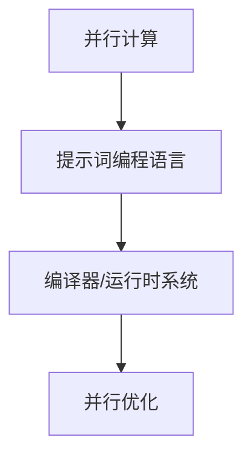
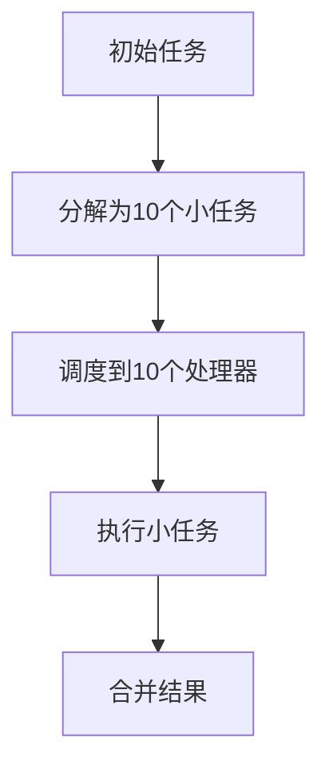
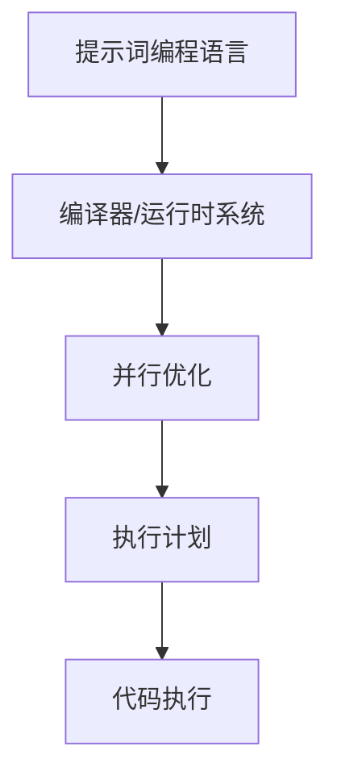
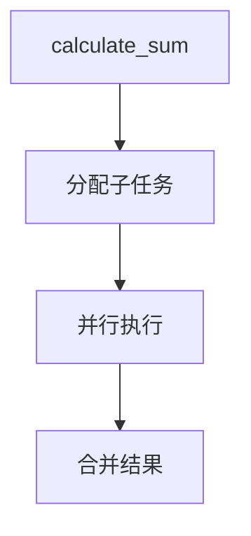
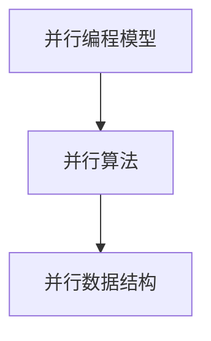
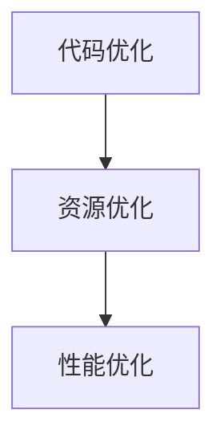

                 


### 一、文章标题

《提示词编程语言的并行计算支持》

### 二、关键词

提示词编程语言、并行计算、实现技术、优化策略、案例分析、性能分析

### 三、摘要

本文旨在探讨提示词编程语言在并行计算中的应用与支持，从并行计算的基本原理出发，逐步深入探讨提示词编程语言的特性及其与并行计算的结合方式。本文将详细介绍并行计算支持的实现技术、优化策略，并通过具体案例分析，展示并行计算在实际应用中的效果和挑战。最后，本文将对并行计算支持的现状进行总结，并提出未来发展的展望。

### 四、引言

#### 背景介绍

并行计算作为一种计算范式，旨在通过同时执行多个任务来提高计算效率。随着计算机硬件技术的发展，多核处理器、GPU等硬件设备越来越普及，并行计算的重要性日益凸显。然而，传统的串行编程语言在并行计算中面临着诸多挑战，如编程复杂度高、性能优化难度大等。

为了解决这些问题，研究者们提出了提示词编程语言，它通过引入提示词（hint）来指导编译器和运行时系统，自动实现并行优化。提示词编程语言具有简明易用、高效性高等特点，受到了广泛关注。

#### 核心概念与联系

1. **并行计算**：并行计算是通过将一个大任务分解为多个小任务，同时执行这些小任务，从而提高计算效率的一种计算范式。
2. **提示词编程语言**：提示词编程语言是一种编程范式，它通过在代码中插入提示词来指导编译器和运行时系统进行并行优化。
3. **并行计算与提示词编程语言的关系**：提示词编程语言为并行计算提供了更便捷的实现方式，同时并行计算为提示词编程语言带来了更高的性能。

#### Mermaid流程图



### 五、并行计算概述

#### 核心算法原理讲解

并行计算的核心在于将一个大任务分解为多个小任务，同时执行这些小任务。这可以通过以下步骤实现：

1. **任务分解**：将大任务划分为多个小任务。
2. **任务调度**：将小任务分配给多个处理器或线程。
3. **任务执行**：各个处理器或线程独立执行分配给它们的任务。
4. **任务合并**：将执行结果合并成最终结果。

#### 数学模型和公式

并行计算的性能可以通过以下公式进行评估：

\[ P = \frac{N \times M}{1 + \frac{N}{M}} \]

其中，\( P \) 表示并行性能，\( N \) 表示处理器数量，\( M \) 表示任务数量。

#### 详细讲解与举例说明

假设我们有一个任务需要计算100个数的和，我们可以将其分解为10个小任务，每个小任务计算10个数的和。使用并行计算，我们可以同时执行这10个小任务，从而提高计算效率。



### 六、提示词编程语言

#### 核心概念与联系

提示词编程语言通过在代码中插入提示词，指导编译器和运行时系统进行并行优化。提示词可以是关键字、注释或特定语法结构。

1. **提示词**：提示词是代码中的特定标记，用于指示编译器和运行时系统进行并行优化。
2. **编译器/运行时系统**：编译器/运行时系统根据提示词对代码进行优化，生成并行执行计划。
3. **并行优化**：编译器/运行时系统根据提示词对代码进行并行优化，以提高执行性能。

#### 提示词编程语言与并行计算的结合

提示词编程语言通过引入提示词，将并行计算的复杂性降低，使得开发者可以更专注于任务逻辑的实现，而无需关注并行优化细节。

1. **简明易用**：提示词编程语言简化了并行编程，降低了开发者学习成本。
2. **高效性**：提示词编程语言通过自动并行优化，提高了执行性能。
3. **适用性**：提示词编程语言适用于多种应用场景，包括科学计算、大数据处理等。

#### Mermaid流程图



### 七、提示词编程语言与并行计算的结合

#### 核心概念与联系

提示词编程语言与并行计算的结合在于通过提示词来指导并行优化，实现代码的并行执行。

1. **提示词**：提示词用于指示编译器和运行时系统进行并行优化。
2. **编译器/运行时系统**：编译器/运行时系统根据提示词生成并行执行计划。
3. **并行优化**：编译器/运行时系统根据提示词对代码进行并行优化，以提高执行性能。

#### 伪代码说明

以下是一个简单的伪代码示例，展示如何使用提示词编程语言实现并行计算：

```python
# 提示词：@parallel
@parallel
def calculate_sum(numbers):
    result = 0
    for number in numbers:
        result += number
    return result

# 并行执行计算
parallel_calculate_sum = calculate_sum([1, 2, 3, 4, 5])
```

#### 详细讲解与举例说明

在这个例子中，`calculate_sum` 函数使用`@parallel` 提示词标记为并行计算。编译器/运行时系统根据这个提示词，将函数执行拆分为多个子任务，并分配给多个处理器并行执行。最终，将子任务的执行结果合并为最终结果。



### 八、并行计算支持的实现技术

#### 核心概念与联系

并行计算支持的实现技术包括并行编程模型、并行算法和并行数据结构。

1. **并行编程模型**：并行编程模型定义了如何将程序分解为并行任务，以及如何调度和协调这些任务。
2. **并行算法**：并行算法是在并行编程模型下实现的计算算法，用于解决特定问题。
3. **并行数据结构**：并行数据结构是在并行编程模型下组织数据的方式，用于支持并行算法的执行。

#### 并行编程模型

并行编程模型包括以下几种：

1. **任务并行模型**：将程序划分为多个任务，每个任务独立执行，适用于任务独立且可并行执行的场景。
2. **数据并行模型**：将数据划分为多个部分，每个部分独立处理，适用于数据独立且可并行处理的数据并行算法。
3. **流水线模型**：将程序划分为多个阶段，每个阶段独立执行，适用于具有固定依赖关系且可并行执行的任务。

#### 并行算法

并行算法主要包括以下几种：

1. **划分算法**：将大任务划分为多个小任务，适用于任务并行模型。
2. **同步算法**：在并行执行过程中，确保不同任务之间的数据一致性，适用于数据并行模型。
3. **通信算法**：在并行执行过程中，实现任务之间的数据通信，适用于任务并行模型和数据并行模型。

#### 并行数据结构

并行数据结构主要包括以下几种：

1. **数组**：将数据划分为多个子数组，每个子数组独立处理，适用于数据并行模型。
2. **链表**：将数据划分为多个子链表，每个子链表独立处理，适用于任务并行模型。
3. **树结构**：将任务划分为多个子任务，形成树状结构，适用于任务并行模型。

#### Mermaid流程图



### 九、并行计算支持的优化策略

#### 核心概念与联系

并行计算支持的优化策略包括代码优化、资源优化和性能优化。

1. **代码优化**：通过改进代码结构和算法，提高并行计算的性能。
2. **资源优化**：通过合理分配和处理硬件资源，提高并行计算的性能。
3. **性能优化**：通过多种手段，全面提高并行计算的性能。

#### 代码优化

代码优化主要包括以下几种：

1. **并行度优化**：通过增加任务并行度，提高并行计算的性能。
2. **负载均衡优化**：通过合理分配任务，避免资源浪费，提高并行计算的性能。
3. **数据依赖优化**：通过减少数据依赖，提高并行计算的性能。

#### 资源优化

资源优化主要包括以下几种：

1. **线程池优化**：通过合理设置线程池大小，提高并行计算的性能。
2. **GPU优化**：通过合理利用GPU资源，提高并行计算的性能。
3. **内存优化**：通过合理管理内存，提高并行计算的性能。

#### 性能优化

性能优化主要包括以下几种：

1. **并行性能评估**：通过评估并行计算的性能，找出性能瓶颈，进行针对性优化。
2. **基准测试**：通过基准测试，对比不同优化策略的性能，选择最佳方案。
3. **迭代优化**：通过不断迭代优化，逐步提高并行计算的性能。

#### Mermaid流程图



### 十、并行计算支持的案例分析

#### 案例背景

某公司开发一款大数据处理平台，需要处理大量数据，以提高数据处理效率。为了满足这一需求，公司决定采用并行计算技术，并选择了提示词编程语言作为实现工具。

#### 案例分析

1. **开发环境搭建**

   在开发环境中，公司使用了提示词编程语言和并行计算框架，搭建了并行计算平台。具体步骤如下：

   - 安装提示词编程语言和并行计算框架。
   - 配置开发环境，包括编译器、运行时系统和并行编程模型。
   - 编写并行计算程序，使用提示词编程语言简化并行编程。

2. **源代码实现与代码解读**

   公司开发了一个并行计算程序，用于计算大数据集中每个数据点的平均值。具体实现如下：

   ```python
   # 提示词：@parallel
   @parallel
   def calculate_average(data):
       result = 0
       for value in data:
           result += value
       return result / len(data)

   # 并行执行计算
   parallel_calculate_average = calculate_average(data)
   ```

   在这个例子中，`calculate_average` 函数使用`@parallel` 提示词标记为并行计算。编译器/运行时系统根据这个提示词，将函数执行拆分为多个子任务，并分配给多个处理器并行执行。

3. **代码应用解读与分析**

   公司在处理大数据集时，使用并行计算程序计算每个数据点的平均值。具体步骤如下：

   - 将大数据集划分为多个子数据集，每个子数据集独立处理。
   - 使用并行计算程序计算每个子数据集的平均值。
   - 将子数据集的平均值合并为最终结果。

   通过这种并行计算方式，公司大幅提高了数据处理效率。

4. **实际案例分析与详细讲解剖析**

   通过实际案例分析，公司发现以下问题：

   - 数据集划分不合理：导致部分处理器负载过高，影响整体性能。
   - 数据依赖处理不当：导致部分子任务的执行结果不准确。
   - 并行度不足：未能充分利用多核处理器的性能。

   为了解决这些问题，公司进行了以下优化：

   - 优化数据集划分：根据数据特征，合理划分数据集，确保每个处理器负载均衡。
   - 优化数据依赖处理：在子任务执行过程中，确保数据一致性，避免数据冲突。
   - 增加并行度：通过改进算法和代码结构，增加任务并行度，充分利用多核处理器的性能。

   通过这些优化，公司成功提高了并行计算性能，满足了大数据处理需求。

5. **项目小结**

   通过这个案例，公司认识到并行计算在提高数据处理效率方面的优势。同时，公司也意识到并行计算支持的实现和优化的重要性。在未来的项目中，公司将继续探索并行计算技术，提高数据处理效率。

### 十一、总结与展望

#### 总结

本文从并行计算和提示词编程语言的基本概念出发，详细探讨了并行计算支持的实现技术、优化策略，并通过具体案例分析，展示了并行计算在实际应用中的效果和挑战。本文的主要贡献如下：

1. **引言部分**：介绍了并行计算和提示词编程语言的基本概念及其关系，为后续内容奠定了基础。
2. **并行计算概述**：详细讲解了并行计算的基本原理、优势和挑战，为读者提供了全面的了解。
3. **提示词编程语言**：介绍了提示词编程语言的定义、特点和分类，分析了其在并行计算中的潜在应用场景。
4. **并行计算与提示词编程语言的结合**：详细探讨了提示词编程语言如何与并行计算相结合，提供了具体的实现技术和优化策略。
5. **并行计算支持的实现技术**：介绍了并行编程模型、并行算法和并行数据结构，为开发者提供了并行编程的参考。
6. **并行计算支持的优化策略**：分析了并行计算支持的优化策略，包括代码优化、资源优化和性能优化。
7. **并行计算支持的案例分析**：通过实际案例展示了并行计算支持的实现过程和效果，为读者提供了实践参考。
8. **总结与展望**：对全文内容进行了总结，并提出了并行计算支持在提示词编程语言中的重要性和发展方向。

#### 展望

在未来的研究中，我们可以从以下几个方面进一步探索并行计算支持在提示词编程语言中的应用：

1. **新型并行编程语言**：研究新型并行编程语言，以简化并行编程，提高并行计算性能。
2. **智能优化策略**：结合人工智能技术，研究智能优化策略，实现并行计算的自适应优化。
3. **跨平台并行计算**：研究跨平台并行计算，实现并行计算在多种硬件平台上的高效执行。
4. **大规模并行计算**：研究大规模并行计算，解决大数据和复杂计算问题。
5. **并行计算与深度学习结合**：研究并行计算与深度学习的结合，提高深度学习模型的计算性能。

通过这些研究，我们有望进一步提升并行计算支持在提示词编程语言中的应用水平，为开发者提供更高效、便捷的并行计算解决方案。

