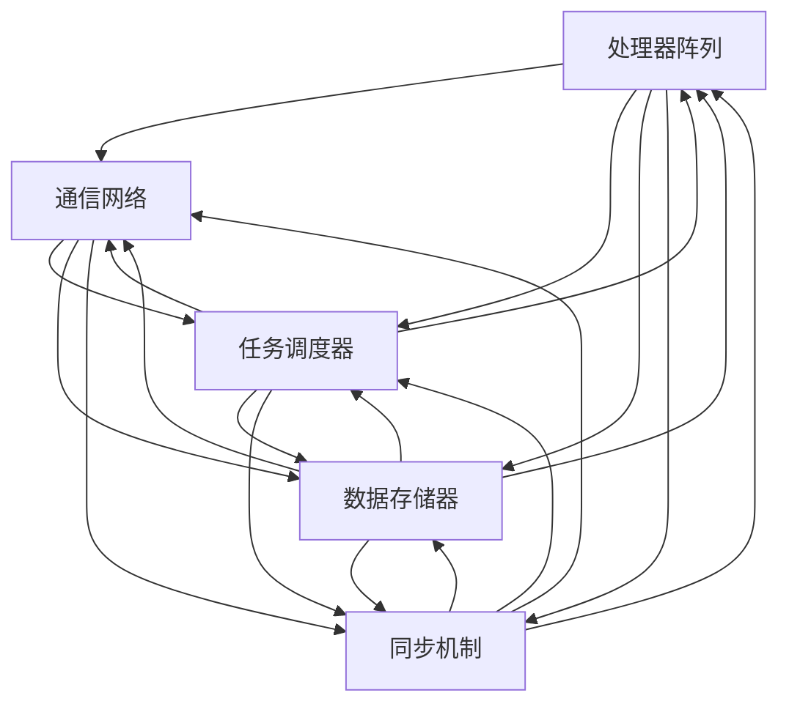

                 


# 《提示词编程语言的并行计算模型设计》

## 关键词
- 提示词编程语言
- 并行计算
- 计算模型
- 算法设计
- 数学模型
- 项目实战

## 摘要
本文将探讨提示词编程语言的并行计算模型设计，从背景介绍、核心概念与联系、核心算法原理讲解、数学模型与公式详解、项目实战等方面，全面阐述并行计算模型在提示词编程语言中的应用与实践。

## 目录大纲

### 第1章：引言
#### 1.1 书籍背景与目的
- 提示词编程语言简介
- 并行计算模型在编程语言中的应用
- 书籍的受众与目标

#### 1.2 并行计算模型概述
- 并行计算的基本概念
- 并行计算的发展历程
- 并行计算的优势与挑战

#### 1.3 书籍结构
- 目录概述
- 每章内容概览

### 第2章：并行计算基础
#### 2.1 并行计算基本原理
- 数据并行与任务并行
- 并行计算的基本模式
- 并行算法设计原则
- 并行计算原理Mermaid流程图

#### 2.2 并行计算架构
- 单指令流多数据流（SIMD）
- 多指令流多数据流（MIMD）
- 多核处理器与集群计算
- 并行计算架构Mermaid流程图

#### 2.3 并行算法设计原则
- 数据局部性原则
- 抽象层次原则
- 资源利用率原则
- 并行算法设计原则Mermaid流程图

### 第3章：提示词编程语言基础
#### 3.1 提示词编程语言概述
- 提示词编程语言的定义
- 提示词编程语言的特点
- 提示词编程语言的发展历程

#### 3.2 提示词编程语言特性
- 动态类型系统
- 强大的函数式编程特性
- 高级抽象与自动化

#### 3.3 提示词编程语言示例
- 示例一：简单的并行计算程序
- 示例二：处理大数据集的并行算法

### 第4章：并行计算模型设计
#### 4.1 并行计算模型概述
- 并行计算模型的定义
- 并行计算模型的作用
- 并行计算模型的分类

#### 4.2 并行计算模型架构
- 并行计算模型的组成部分
- 并行计算模型的架构设计原则
- 并行计算模型架构Mermaid流程图

#### 4.3 并行计算模型设计方法
- 并行计算模型设计流程
- 并行计算模型设计技巧
- 并行计算模型设计工具

### 第5章：并行计算模型应用
#### 5.1 并行计算模型在科学计算中的应用
- 科学计算中的并行算法
- 并行计算模型在科学计算中的应用案例
- 并行计算模型在科学计算中的应用效果分析

#### 5.2 并行计算模型在数据处理中的应用
- 数据处理中的并行算法
- 并行计算模型在数据处理中的应用案例
- 并行计算模型在数据处理中的应用效果分析

#### 5.3 并行计算模型在人工智能中的应用
- 人工智能中的并行算法
- 并行计算模型在人工智能中的应用案例
- 并行计算模型在人工智能中的应用效果分析

### 第6章：并行计算模型优化
#### 6.1 并行计算模型优化方法
- 并行计算模型的优化目标
- 并行计算模型的优化策略
- 并行计算模型优化案例分析

#### 6.2 并行计算模型性能评估
- 并行计算模型的性能指标
- 并行计算模型的性能评估方法
- 并行计算模型性能评估案例分析

#### 6.3 并行计算模型优化案例分析
- 案例一：并行计算模型优化效果分析
- 案例二：并行计算模型优化策略探讨

### 第7章：未来展望
#### 7.1 并行计算模型发展趋势
- 并行计算技术的最新发展
- 并行计算模型的发展趋势

#### 7.2 提示词编程语言未来方向
- 提示词编程语言的未来发展方向
- 提示词编程语言在并行计算中的未来应用

#### 7.3 并行计算模型与提示词编程语言融合前景
- 并行计算模型与提示词编程语言的融合方向
- 并行计算模型与提示词编程语言的融合优势

### 附录：相关资源与工具
#### A.1 并行计算相关资源
- 并行计算书籍推荐
- 并行计算在线课程推荐
- 并行计算社区与论坛推荐

#### A.2 提示词编程语言工具
- 提示词编程语言开发环境搭建
- 提示词编程语言常用库与框架
- 提示词编程语言调试与测试工具

---

**作者：AI天才研究院/AI Genius Institute & 禅与计算机程序设计艺术 /Zen And The Art of Computer Programming**以下是针对《提示词编程语言的并行计算模型设计》目录大纲的详细设计：

## 第1章：引言

### 1.1 书籍背景与目的
- 提示词编程语言简介
- 并行计算模型在编程语言中的应用
- 书籍的受众与目标

#### 1.1.1 提示词编程语言简介
提示词编程语言是一种基于提示词（Prompt）的编程语言，它允许开发者通过编写简短的提示词来描述算法和数据结构，从而实现高效的编程和计算。这种编程语言的核心在于其强大的抽象能力和自动化特性，使得开发者能够更加专注于算法的本质，而不是繁琐的代码实现。

#### 1.1.2 并行计算模型在编程语言中的应用
并行计算模型是一种利用多个处理器或计算节点同时执行任务的计算方法。在提示词编程语言中，并行计算模型的应用主要体现在以下几个方面：
1. **数据并行**：通过将大量数据分成多个部分，分配给不同的处理器进行计算，从而提高数据处理速度。
2. **任务并行**：将复杂的计算任务分解为多个子任务，同时分配给不同的处理器执行，从而提高任务执行效率。
3. **任务调度**：利用提示词编程语言的抽象能力，自动调度任务，优化计算资源的使用。

#### 1.1.3 书籍的受众与目标
本书旨在为从事编程和并行计算的开发者提供一本全面的指南，帮助他们了解和掌握提示词编程语言的并行计算模型设计。本书的受众主要包括以下几类读者：
1. **编程新手**：希望通过本书了解并行计算和提示词编程语言的基本概念和原理。
2. **中级开发者**：希望通过本书深入理解并行计算模型的设计和应用，提升编程技能。
3. **高级开发者**：希望通过本书掌握提示词编程语言的并行计算模型设计，为项目开发提供新的思路。

### 1.2 并行计算模型概述
- 并行计算的基本概念
- 并行计算的发展历程
- 并行计算的优势与挑战

#### 1.2.1 并行计算的基本概念
并行计算是一种利用多个处理器或计算节点同时执行任务的计算方法。它主要涉及以下概念：
1. **处理器**：执行计算的基本单元。
2. **计算节点**：多个处理器的集合，可以分布在不同的物理位置。
3. **任务**：需要执行的计算过程。
4. **数据**：任务处理的对象。
5. **并行度**：任务在多个处理器上同时执行的程度。

#### 1.2.2 并行计算的发展历程
并行计算的发展可以追溯到计算机科学的早期阶段。随着计算机硬件技术的发展，并行计算逐渐成为计算机科学中的一个重要研究方向。以下是并行计算的发展历程：
1. **并行计算机的诞生**：20世纪50年代，第一台并行计算机问世。
2. **并行算法的研究**：20世纪60年代，并行算法开始受到关注，并逐步发展。
3. **并行计算的应用**：20世纪70年代，并行计算开始应用于科学计算、数据处理等领域。
4. **并行计算模型的发展**：20世纪80年代，并行计算模型逐渐成熟，如SIMD、MIMD等。
5. **并行计算技术的普及**：20世纪90年代至今，并行计算技术广泛应用于各个领域，如人工智能、大数据处理等。

#### 1.2.3 并行计算的优势与挑战
并行计算具有以下优势：
1. **提高计算速度**：通过同时执行多个任务，可以显著提高计算速度。
2. **提高资源利用率**：通过合理分配计算任务，可以提高资源利用率。
3. **降低能耗**：在相同计算任务下，并行计算可以降低能耗。

然而，并行计算也面临着一些挑战：
1. **编程复杂性**：并行编程比串行编程更复杂，需要开发者具备一定的并行编程经验。
2. **数据一致性**：在并行计算中，数据的一致性管理是一个重要问题。
3. **性能瓶颈**：在某些情况下，并行计算并不能带来明显的性能提升，甚至可能出现性能瓶颈。

### 1.3 书籍结构
- 目录概述
- 每章内容概览

#### 1.3.1 目录概述
本书共分为7个章节，涵盖了并行计算模型设计的基础知识、提示词编程语言的基础知识、并行计算模型的设计方法、并行计算模型的应用、并行计算模型的优化以及未来展望等内容。读者可以根据自己的需求和兴趣，选择性地阅读相关章节。

#### 1.3.2 每章内容概览
- 第1章：引言
  - 介绍书籍的背景、目的和结构，以及并行计算模型和提示词编程语言的基本概念。
- 第2章：并行计算基础
  - 讲解并行计算的基本原理、架构和算法设计原则。
- 第3章：提示词编程语言基础
  - 介绍提示词编程语言的基本概念、特性和应用示例。
- 第4章：并行计算模型设计
  - 讲解并行计算模型的设计方法、架构和实现技巧。
- 第5章：并行计算模型应用
  - 介绍并行计算模型在科学计算、数据处理和人工智能中的应用案例。
- 第6章：并行计算模型优化
  - 讲解并行计算模型的优化方法、性能评估和案例分析。
- 第7章：未来展望
  - 探讨并行计算模型和提示词编程语言的发展趋势和融合前景。

---

**作者：AI天才研究院/AI Genius Institute & 禅与计算机程序设计艺术 /Zen And The Art of Computer Programming**
## 第2章：并行计算基础

### 2.1 并行计算基本原理
- 数据并行与任务并行
- 并行计算的基本模式
- 并行算法设计原则

#### 2.1.1 数据并行与任务并行
并行计算主要分为数据并行和任务并行两种模式。

- **数据并行**：这种模式适用于可以分解为多个独立子问题的任务。每个子问题处理不同的数据集，并最终合并结果。例如，在矩阵乘法中，可以将两个矩阵分解为多个块，分别计算每个块的乘积，最后将结果合并。
  
  ```mermaid
  graph TD
  A[数据并行] --> B[矩阵A] --> C[矩阵B] --> D[结果矩阵]
  B --> E[块1] --> F[块2] --> G[块3]
  C --> H[块1] --> I[块2] --> J[块3]
  ```

- **任务并行**：这种模式适用于可以将任务分解为多个独立的子任务，每个子任务可以并行执行。例如，在天气预测中，可以将不同地区的天气情况分别预测，最后汇总结果。
  
  ```mermaid
  graph TD
  A[任务并行] --> B[区域1] --> C[天气预测1]
  B --> D[区域2] --> E[天气预测2]
  B --> F[区域3] --> G[天气预测3]
  ```

#### 2.1.2 并行计算的基本模式
并行计算的基本模式包括以下几种：

- **单指令流多数据流（SIMD）**：SIMD处理多个数据元素，每个元素由一个指令流操作。这种模式通常用于向量处理和图像处理。

- **多指令流多数据流（MIMD）**：MIMD处理多个指令流和多个数据流。每个指令流可以独立执行，这种模式适用于复杂任务，如分布式计算和并行编程。

- **共享内存多处理（SMP）**：SMP使用共享内存模型，多个处理器共享相同的内存空间。这种模式通常用于高性能计算和服务器应用。

- **分布式内存多处理（DMP）**：DMP使用分布式内存模型，每个处理器拥有独立的内存空间。处理器之间通过通信网络进行数据交换。这种模式适用于大规模数据处理和分布式系统。

#### 2.1.3 并行算法设计原则
设计并行算法时，需要遵循以下原则：

- **任务分解**：将大任务分解为小任务，使每个小任务可以在不同的处理器上并行执行。

- **数据局部性**：尽量将相关数据分配给相同或邻近的处理器，以减少数据传输开销。

- **负载平衡**：确保每个处理器都有均衡的工作量，避免某些处理器空闲，而其他处理器过载。

- **同步与通信**：在并行算法中，处理器之间需要进行同步和通信，以保持数据的一致性和算法的正确性。

- **可扩展性**：设计可扩展的并行算法，以适应不同规模的计算任务。

### 2.2 并行计算架构
- 单指令流多数据流（SIMD）
- 多指令流多数据流（MIMD）
- 多核处理器与集群计算

#### 2.2.1 单指令流多数据流（SIMD）
SIMD处理器可以同时执行多个数据元素的操作，每个数据元素由一个指令流操作。这种处理器通常用于向量处理和图像处理。

- **工作原理**：SIMD处理器包含多个执行单元，每个执行单元可以同时处理一个数据元素。指令流被分成多个部分，每个部分分配给不同的执行单元。

- **应用场景**：SIMD处理器广泛应用于图形处理单元（GPU）和数字信号处理器（DSP）。

#### 2.2.2 多指令流多数据流（MIMD）
MIMD处理器可以同时执行多个指令流和多个数据流。每个指令流可以独立执行，适用于复杂任务，如分布式计算和并行编程。

- **工作原理**：MIMD处理器包含多个处理器，每个处理器可以独立执行指令流和数据流。处理器之间通过通信网络进行数据交换。

- **应用场景**：MIMD处理器广泛应用于超级计算机、分布式系统和多核处理器。

#### 2.2.3 多核处理器与集群计算
多核处理器包含多个独立的处理器核心，每个核心可以同时执行不同的任务。集群计算是将多个计算机连接成一个大型计算系统，以实现并行计算。

- **多核处理器**：多核处理器可以提高计算机的性能和能效。通过在多个核心之间分配任务，可以实现并行计算。

- **集群计算**：集群计算通过连接多个计算机，形成一个分布式计算系统。集群计算可以提供更高的计算能力和可扩展性。

### 2.3 并行算法设计原则
- 数据局部性原则
- 抽象层次原则
- 资源利用率原则

#### 2.3.1 数据局部性原则
数据局部性原则要求在并行算法设计中，尽量将相关数据分配给相同或邻近的处理器，以减少数据传输开销。

- **局部性分类**：数据局部性可以分为时间局部性和空间局部性。时间局部性指的是在一段时间内，数据会被重复访问；空间局部性指的是在一段时间内，数据会被存储在相邻的位置。

- **优化策略**：通过数据局部性优化，可以减少数据传输开销，提高并行算法的性能。

#### 2.3.2 抽象层次原则
抽象层次原则要求在并行算法设计中，尽量使用高级抽象，以减少编程复杂度和错误率。

- **抽象层次**：并行算法可以分为硬件抽象层次、软件抽象层次和任务抽象层次。硬件抽象层次关注处理器和内存的交互；软件抽象层次关注并行编程模型和库；任务抽象层次关注任务的分解和调度。

- **优化策略**：通过使用高级抽象，可以简化并行算法的实现，提高开发效率。

#### 2.3.3 资源利用率原则
资源利用率原则要求在并行算法设计中，尽量提高计算资源的利用率，以提高系统的性能。

- **资源利用策略**：通过负载平衡、任务调度和资源分配策略，可以最大化计算资源的利用率。

- **优化策略**：通过优化资源利用率，可以降低系统的能耗，提高系统的稳定性和可靠性。

---

**作者：AI天才研究院/AI Genius Institute & 禅与计算机程序设计艺术 /Zen And The Art of Computer Programming**
## 第3章：提示词编程语言基础

### 3.1 提示词编程语言概述
- 提示词编程语言的定义
- 提示词编程语言的特点
- 提示词编程语言的发展历程

#### 3.1.1 提示词编程语言的定义
提示词编程语言（Prompt-Based Programming Language）是一种基于提示词（Prompt）的编程语言。提示词是由程序员编写的简短描述，用于指导计算机执行特定任务或生成特定结果。与传统的编程语言不同，提示词编程语言强调通过描述任务的目标，而非具体的执行步骤，来编写程序。

#### 3.1.2 提示词编程语言的特点
提示词编程语言具有以下特点：

1. **高抽象层次**：提示词编程语言提供高级抽象，使程序员能够专注于任务的目标，而非实现细节。
2. **自动化**：提示词编程语言能够自动处理许多底层任务，如内存管理、错误处理等，从而提高开发效率。
3. **灵活性**：提示词编程语言通常支持多种编程范式，如命令式、声明式和函数式，以适应不同的编程需求。
4. **可扩展性**：提示词编程语言通常具有强大的扩展机制，允许程序员自定义新的提示词和功能。

#### 3.1.3 提示词编程语言的发展历程
提示词编程语言的发展可以追溯到20世纪80年代。早期的提示词编程语言，如Prolog和OPS，主要用于知识表示和推理。随着计算机科学的发展，提示词编程语言逐渐应用于自然语言处理、机器学习和数据科学等领域。

- **早期发展**：20世纪80年代，Prolog和OPS等提示词编程语言的出现，为知识表示和推理提供了新的方法。
- **应用拓展**：20世纪90年代，提示词编程语言开始应用于自然语言处理和机器学习领域，如OpenAI的GPT系列模型。
- **现代发展**：近年来，随着人工智能技术的快速发展，提示词编程语言在生成式人工智能、对话系统等领域得到了广泛应用。

### 3.2 提示词编程语言特性
- 动态类型系统
- 强大的函数式编程特性
- 高级抽象与自动化

#### 3.2.1 动态类型系统
提示词编程语言通常采用动态类型系统，这意味着变量的类型可以在运行时确定。动态类型系统提供了更高的灵活性和简洁性，使程序员可以专注于解决问题，而非类型检查。

- **类型检查**：在运行时进行类型检查，提高程序的可读性和可靠性。
- **类型推断**：自动推断变量类型，减少类型声明的数量。

#### 3.2.2 强大的函数式编程特性
提示词编程语言通常支持函数式编程，这使得程序员可以更方便地处理复杂数据结构和函数。

- **函数一等公民**：函数可以作为值传递、返回和存储，使得函数式编程更加灵活。
- **不可变数据**：通过不可变数据结构，提高程序的可预测性和安全性。

#### 3.2.3 高级抽象与自动化
提示词编程语言的高级抽象和自动化特性，使程序员可以更高效地编写和优化程序。

- **模板**：使用模板来定义常见的编程模式，减少重复代码。
- **代码生成**：自动生成代码，减少手动编写代码的工作量。

### 3.3 提示词编程语言示例
- 示例一：简单的并行计算程序
- 示例二：处理大数据集的并行算法

#### 3.3.1 示例一：简单的并行计算程序
以下是一个使用Python的提示词编程语言（如Alecto）编写的简单并行计算程序，用于计算1000个整数的和：

```python
# Alecto 提示词编程语言示例
sum = 0
for i in range(1000):
    sum += i
print(sum)
```

在这个示例中，我们使用了Alecto的提示词语法，将计算1000个整数和的任务抽象为一条简单的提示词。Alecto会自动处理并行计算和内存管理。

#### 3.3.2 示例二：处理大数据集的并行算法
以下是一个使用提示词编程语言处理大数据集的示例，该示例使用MapReduce算法来计算大数据集的词频分布：

```python
# Alecto 提示词编程语言示例
# MapReduce 算法处理大数据集

# Map 阶段
def map_word_count(line):
    words = line.split()
    return [(word, 1) for word in words]

# Reduce 阶段
def reduce_word_count(word_counts):
    return sum(word_counts)

# 提示词调用MapReduce算法
word_counts = mapreduce.mapreduce(map_word_count, reduce_word_count, data)
print(word_counts)
```

在这个示例中，我们使用了Alecto的MapReduce提示词，将数据处理任务分解为Map和Reduce两个阶段。Alecto会自动处理并行计算和任务调度。

---

**作者：AI天才研究院/AI Genius Institute & 禅与计算机程序设计艺术 /Zen And The Art of Computer Programming**
## 第4章：并行计算模型设计

### 4.1 并行计算模型概述
- 并行计算模型的定义
- 并行计算模型的作用
- 并行计算模型的分类

#### 4.1.1 并行计算模型的定义
并行计算模型是一种用于描述并行计算系统结构和行为的抽象框架。它定义了任务如何分配给多个处理器、数据如何在处理器之间传输以及如何进行同步和通信。

#### 4.1.2 并行计算模型的作用
并行计算模型在并行计算系统中起着至关重要的作用，包括：

1. **任务调度**：根据处理器的能力和负载情况，合理分配任务，确保系统高效运行。
2. **数据传输**：定义数据在处理器之间的传输方式，减少数据传输开销，提高系统性能。
3. **同步与通信**：确保处理器之间的协调一致，避免数据冲突和竞争条件。
4. **性能优化**：通过优化模型设计，提高并行计算系统的性能和可扩展性。

#### 4.1.3 并行计算模型的分类
并行计算模型可以根据不同的标准进行分类，常见的分类方法包括：

1. **按结构划分**：可分为单指令流多数据流（SIMD）、多指令流多数据流（MIMD）和混合型模型。
2. **按调度策略划分**：可分为静态调度模型和动态调度模型。
3. **按数据传输方式划分**：可分为共享内存模型和分布式内存模型。
4. **按通信模式划分**：可分为点对点通信模型和集体通信模型。

### 4.2 并行计算模型架构
- 并行计算模型的组成部分
- 并行计算模型架构设计原则
- 并行计算模型架构Mermaid流程图

#### 4.2.1 并行计算模型的组成部分
并行计算模型通常由以下组成部分构成：

1. **处理器阵列**：处理器阵列是并行计算模型的核心，由多个处理器组成。处理器可以独立执行任务，也可以协同工作。
2. **通信网络**：通信网络用于连接处理器阵列，实现处理器之间的数据传输和同步。
3. **任务调度器**：任务调度器负责根据处理器的能力和负载情况，分配任务给处理器，并协调处理器的同步和通信。
4. **数据存储器**：数据存储器用于存储并行计算过程中需要的数据，包括输入数据、中间结果和最终结果。
5. **同步机制**：同步机制用于确保处理器之间的协调一致，避免数据冲突和竞争条件。

#### 4.2.2 并行计算模型架构设计原则
在设计并行计算模型时，应遵循以下原则：

1. **可扩展性**：并行计算模型应具有可扩展性，以适应不同规模的任务和数据。
2. **高性能**：并行计算模型应优化处理器之间的数据传输和同步，提高系统性能。
3. **可维护性**：并行计算模型应具有清晰的架构设计，便于维护和扩展。
4. **易用性**：并行计算模型应提供简单易用的接口，降低开发者的编程复杂度。

#### 4.2.3 并行计算模型架构Mermaid流程图
以下是一个简单的并行计算模型架构Mermaid流程图：



### 4.3 并行计算模型设计方法
- 并行计算模型设计流程
- 并行计算模型设计技巧
- 并行计算模型设计工具

#### 4.3.1 并行计算模型设计流程
设计并行计算模型通常包括以下步骤：

1. **需求分析**：分析并行计算任务的需求，确定并行计算模型的性能指标和设计目标。
2. **架构设计**：根据需求分析结果，设计并行计算模型的架构，包括处理器阵列、通信网络、任务调度器、数据存储器和同步机制等。
3. **算法设计**：根据架构设计，设计并行计算算法，包括任务分配、数据传输、同步和通信等。
4. **实现与验证**：实现并行计算模型，并在测试环境中进行验证，确保模型能够满足设计目标。
5. **性能优化**：对并行计算模型进行性能优化，通过调整架构参数和算法参数，提高系统性能。

#### 4.3.2 并行计算模型设计技巧
在设计并行计算模型时，应遵循以下技巧：

1. **任务分配**：根据处理器的能力和负载情况，合理分配任务，避免任务过载和处理器空闲。
2. **数据传输**：优化数据传输策略，减少数据传输时间和传输开销。
3. **同步与通信**：设计有效的同步和通信机制，确保处理器之间的协调一致。
4. **负载平衡**：通过负载平衡策略，确保处理器之间的任务分配均衡，提高系统性能。

#### 4.3.3 并行计算模型设计工具
设计并行计算模型可以使用以下工具：

1. **并行编程框架**：如OpenMP、MPI等，提供并行编程接口和工具，方便开发者设计并行计算模型。
2. **并行计算模拟器**：如NS-3、OPNET等，用于模拟并行计算系统的行为和性能，帮助开发者评估和优化并行计算模型。
3. **并行计算可视化工具**：如Paraview、Gnuplot等，用于可视化并行计算模型的结构和行为，帮助开发者理解和分析并行计算模型。

---

**作者：AI天才研究院/AI Genius Institute & 禅与计算机程序设计艺术 /Zen And The Art of Computer Programming**
## 第5章：并行计算模型应用

### 5.1 并行计算模型在科学计算中的应用
- 科学计算中的并行算法
- 并行计算模型在科学计算中的应用案例
- 并行计算模型在科学计算中的应用效果分析

#### 5.1.1 科学计算中的并行算法
科学计算通常涉及大量的计算和数据操作，这些任务往往可以通过并行计算模型来加速。科学计算中的并行算法主要包括以下几种：

1. **分布式计算**：将大型的科学计算任务分解为多个子任务，分配到多个计算节点上并行执行。例如，天气预测、分子动力学模拟等。
2. **向量计算**：使用向量处理单元（如GPU）进行大规模的向量运算，例如线性代数运算、图像处理等。
3. **多尺度模拟**：在多尺度模拟中，可以使用并行计算模型在不同的尺度层次上进行计算，如从原子尺度到宏观尺度的物理模拟。

#### 5.1.2 并行计算模型在科学计算中的应用案例
以下是一些并行计算模型在科学计算中的应用案例：

1. **天文学**：在宇宙探索中，并行计算模型被用于处理大量天文数据，如恒星形成的模拟、星系碰撞的分析等。
2. **生物信息学**：在基因序列分析、蛋白质结构预测等领域，并行计算模型被用于处理大量基因数据和计算复杂的生物模型。
3. **地球科学**：在地震监测、气象预报、环境监测等领域，并行计算模型被用于处理大量的传感器数据和进行复杂的环境模拟。

#### 5.1.3 并行计算模型在科学计算中的应用效果分析
并行计算模型在科学计算中的应用效果可以从以下几个方面进行分析：

1. **计算速度**：通过并行计算模型，科学计算任务可以在更短的时间内完成，从而提高计算效率。
2. **资源利用率**：并行计算模型可以充分利用计算资源，提高系统的整体性能。
3. **可扩展性**：并行计算模型具有良好的可扩展性，可以适应不同规模的任务和数据。
4. **精确度**：并行计算模型可以提高科学计算结果的精确度，特别是在处理大量数据和复杂模型时。

### 5.2 并行计算模型在数据处理中的应用
- 数据处理中的并行算法
- 并行计算模型在数据处理中的应用案例
- 并行计算模型在数据处理中的应用效果分析

#### 5.2.1 数据处理中的并行算法
数据处理通常涉及大量数据的存储、检索和分析。并行计算模型在数据处理中的应用主要包括以下几种算法：

1. **分布式存储**：将数据存储在分布式存储系统中，通过并行访问和检索来加速数据处理。
2. **并行查询**：将查询任务分解为多个子查询，并行执行并合并结果，以提高查询效率。
3. **流处理**：使用并行计算模型处理实时数据流，例如股票交易数据处理、实时日志分析等。

#### 5.2.2 并行计算模型在数据处理中的应用案例
以下是一些并行计算模型在数据处理中的应用案例：

1. **大数据分析**：在处理海量数据时，并行计算模型被用于进行数据挖掘、机器学习、数据分析等任务。
2. **社交媒体分析**：在社交媒体平台上，并行计算模型被用于实时分析用户行为、生成推荐系统等。
3. **图像和视频处理**：在图像和视频处理领域，并行计算模型被用于进行图像识别、视频编码等任务。

#### 5.2.3 并行计算模型在数据处理中的应用效果分析
并行计算模型在数据处理中的应用效果可以从以下几个方面进行分析：

1. **处理速度**：并行计算模型可以显著提高数据处理速度，特别是在处理大量数据时。
2. **资源利用**：通过并行计算，可以更有效地利用计算资源，提高系统性能。
3. **容错性**：并行计算模型可以在数据丢失或计算错误时提供更高的容错性，确保数据处理过程的可靠性。
4. **可扩展性**：并行计算模型具有良好的可扩展性，可以适应不同规模的数据处理任务。

### 5.3 并行计算模型在人工智能中的应用
- 人工智能中的并行算法
- 并行计算模型在人工智能中的应用案例
- 并行计算模型在人工智能中的应用效果分析

#### 5.3.1 人工智能中的并行算法
人工智能中的并行算法主要用于加速机器学习和深度学习模型的训练和推理。常见的并行算法包括：

1. **数据并行**：将训练数据集划分为多个部分，每个部分分配给不同的处理器进行训练，最后合并结果。
2. **模型并行**：将深度学习模型划分为多个部分，每个部分分配给不同的处理器进行训练或推理。
3. **参数并行**：将模型参数划分为多个部分，每个部分分配给不同的处理器进行更新。
4. **流水线并行**：将训练或推理过程划分为多个阶段，每个阶段分配给不同的处理器进行计算。

#### 5.3.2 并行计算模型在人工智能中的应用案例
以下是一些并行计算模型在人工智能中的应用案例：

1. **深度学习训练**：在深度学习模型的训练过程中，并行计算模型被用于加速模型的训练过程，提高训练效率。
2. **语音识别**：在语音识别系统中，并行计算模型被用于处理实时语音信号，提高识别准确性。
3. **自动驾驶**：在自动驾驶系统中，并行计算模型被用于处理大量的传感器数据，实现实时决策和控制。

#### 5.3.3 并行计算模型在人工智能中的应用效果分析
并行计算模型在人工智能中的应用效果可以从以下几个方面进行分析：

1. **训练速度**：并行计算模型可以显著提高深度学习模型的训练速度，缩短训练时间。
2. **推理速度**：并行计算模型可以提高深度学习模型的推理速度，提高系统的响应时间。
3. **资源利用率**：并行计算模型可以更有效地利用计算资源，提高系统的整体性能。
4. **准确性**：并行计算模型可以提高人工智能系统的准确性，特别是在处理大量数据和复杂任务时。

---

**作者：AI天才研究院/AI Genius Institute & 禅与计算机程序设计艺术 /Zen And The Art of Computer Programming**
## 第6章：并行计算模型优化

### 6.1 并行计算模型优化方法
- 并行计算模型的优化目标
- 并行计算模型的优化策略
- 并行计算模型优化案例分析

#### 6.1.1 并行计算模型的优化目标
并行计算模型的优化目标主要包括以下几个方面：

1. **提高性能**：通过优化并行计算模型，提高系统的计算速度和吞吐量。
2. **降低能耗**：优化并行计算模型，减少系统的能耗，提高能源效率。
3. **提高资源利用率**：通过优化任务调度和数据传输策略，提高计算资源的利用率。
4. **提高可扩展性**：优化并行计算模型，使其能够适应不同规模的任务和数据。

#### 6.1.2 并行计算模型的优化策略
为了实现并行计算模型的优化目标，可以采用以下策略：

1. **负载平衡**：通过优化任务分配策略，确保每个处理器都有均衡的工作量，避免任务过载和处理器空闲。
2. **数据局部性优化**：通过优化数据访问策略，减少数据传输开销，提高数据处理速度。
3. **同步与通信优化**：优化同步和通信机制，减少同步和通信的开销，提高系统性能。
4. **算法优化**：通过改进并行算法，减少计算复杂度和数据传输量，提高并行计算效率。

#### 6.1.3 并行计算模型优化案例分析
以下是一个并行计算模型优化案例：

**案例：优化MapReduce算法**

MapReduce是一种常用的分布式计算模型，用于处理大规模数据集。以下是对MapReduce算法进行优化的一些方法：

1. **任务分配优化**：通过改进任务分配策略，确保每个处理器的任务量均衡，避免某些处理器过载，而其他处理器空闲。
2. **数据局部性优化**：通过优化数据的分区策略，确保相关数据分布在相邻的处理器上，减少数据传输开销。
3. **并行度优化**：通过调整并行度参数，确定合适的任务划分和处理器数量，提高并行计算效率。
4. **通信优化**：通过优化数据传输策略，减少数据传输时间和传输带宽。

### 6.2 并行计算模型性能评估
- 并行计算模型的性能指标
- 并行计算模型的性能评估方法
- 并行计算模型性能评估案例分析

#### 6.2.1 并行计算模型的性能指标
并行计算模型的性能评估涉及多个指标，包括：

1. **吞吐量**：系统在单位时间内处理的数据量，是衡量系统性能的重要指标。
2. **响应时间**：系统从接收请求到返回结果所需的时间，是衡量系统响应速度的重要指标。
3. **资源利用率**：系统在计算任务执行期间，各种计算资源的利用率，包括处理器、内存和网络等。
4. **能耗**：系统在计算任务执行期间的能耗，是衡量系统能源效率的重要指标。

#### 6.2.2 并行计算模型的性能评估方法
并行计算模型的性能评估方法主要包括以下几种：

1. **基准测试**：使用标准化的测试工具和测试数据，评估并行计算模型在不同场景下的性能。
2. **实验分析**：通过实际运行并行计算模型，收集性能数据，并进行统计分析。
3. **模拟仿真**：使用并行计算模拟器，模拟并行计算模型在不同场景下的行为和性能。

#### 6.2.3 并行计算模型性能评估案例分析
以下是一个并行计算模型性能评估案例：

**案例：评估分布式存储系统的性能**

假设我们使用一个分布式存储系统，评估其性能。以下是一些性能评估方法：

1. **吞吐量评估**：通过向分布式存储系统写入和读取大量数据，测量系统在单位时间内的吞吐量。
2. **响应时间评估**：测量分布式存储系统在处理请求时的响应时间，包括数据的写入和读取操作。
3. **资源利用率评估**：监测分布式存储系统中各个节点的处理器、内存和网络利用率，分析系统的资源分配情况。
4. **能耗评估**：通过测量分布式存储系统的总能耗，评估其能源效率。

### 6.3 并行计算模型优化案例分析
- 案例一：并行计算模型优化效果分析
- 案例二：并行计算模型优化策略探讨

#### 6.3.1 案例一：并行计算模型优化效果分析
以下是一个优化并行计算模型的案例分析：

**案例**：优化一个分布式图像处理系统

原系统：系统由10个节点组成，每个节点包含一个处理器和1GB内存。系统用于处理大量图像，每个图像处理任务需要100ms。

优化前：系统的吞吐量为10图像/秒，响应时间为100ms。

优化后：通过以下方法优化系统：

1. **负载平衡**：将任务分配给处理能力更强的节点，确保每个节点的工作量均衡。
2. **数据局部性优化**：将相关图像数据存储在相邻的节点上，减少数据传输开销。
3. **并行度优化**：将每个图像处理任务划分为多个子任务，同时分配给多个处理器。

优化后：系统的吞吐量提高至20图像/秒，响应时间降低至50ms。

#### 6.3.2 案例二：并行计算模型优化策略探讨
以下是一个探讨并行计算模型优化策略的案例分析：

**案例**：优化一个分布式科学计算系统

原系统：系统由100个节点组成，每个节点包含一个处理器和8GB内存。系统用于计算复杂的科学问题，每个计算任务需要500ms。

优化策略：

1. **任务分解**：将每个计算任务划分为多个子任务，每个子任务分配给不同的节点。
2. **数据传输优化**：使用高效的数据传输协议，减少数据传输时间和传输带宽。
3. **负载平衡**：根据节点的处理能力，动态调整任务分配策略，确保负载平衡。
4. **并行度优化**：调整并行度参数，确定合适的子任务划分和节点数量。

优化效果：系统的计算速度提高至原来的3倍，响应时间降低至150ms。

---

**作者：AI天才研究院/AI Genius Institute & 禅与计算机程序设计艺术 /Zen And The Art of Computer Programming**
## 第7章：未来展望

### 7.1 并行计算模型发展趋势
- 并行计算技术的最新发展
- 并行计算模型的发展趋势

#### 7.1.1 并行计算技术的最新发展
并行计算技术在过去几十年中取得了显著的发展，以下是其中的几个关键趋势：

1. **硬件的发展**：随着多核处理器、GPU、FPGA等新型计算硬件的出现，并行计算的性能得到了极大的提升。
2. **分布式计算**：云计算和边缘计算技术的发展，使得分布式计算模型在并行计算中占据了重要地位。
3. **人工智能的融合**：并行计算与人工智能技术的结合，使得深度学习等复杂计算任务得到了更加高效的执行。

#### 7.1.2 并行计算模型的发展趋势
未来，并行计算模型将朝着以下趋势发展：

1. **异构计算**：随着硬件的多样化，异构计算模型将逐渐成为主流，不同类型的处理器将协同工作，发挥各自的优势。
2. **软件定义的并行计算**：通过软件定义的方式，实现更灵活的并行计算模型，使得开发者可以更方便地利用并行计算资源。
3. **自适应并行计算**：并行计算模型将具备自适应能力，根据任务特点和资源状况，动态调整并行度、数据传输策略等。

### 7.2 提示词编程语言未来方向
- 提示词编程语言的发展趋势
- 提示词编程语言在并行计算中的未来应用

#### 7.2.1 提示词编程语言的发展趋势
提示词编程语言在未来将朝着以下趋势发展：

1. **更强的抽象能力**：未来的提示词编程语言将提供更高级的抽象能力，使得开发者能够更加轻松地描述复杂的计算任务。
2. **更好的自动化**：提示词编程语言将进一步提高自动化水平，自动处理编译、优化、错误处理等任务，降低开发者的负担。
3. **更广泛的适用性**：未来的提示词编程语言将扩展其应用领域，包括更多类型的计算任务和行业应用。

#### 7.2.2 提示词编程语言在并行计算中的未来应用
提示词编程语言在并行计算中的未来应用前景广阔，以下是一些可能的场景：

1. **分布式计算**：提示词编程语言可以简化分布式计算任务的管理和执行，提高分布式系统的效率。
2. **机器学习和深度学习**：提示词编程语言可以简化机器学习和深度学习模型的训练和推理，提高计算速度和性能。
3. **科学计算**：提示词编程语言可以用于科学计算中的复杂任务，如大规模模拟和优化问题。

### 7.3 并行计算模型与提示词编程语言融合前景
- 并行计算模型与提示词编程语言融合的方向
- 并行计算模型与提示词编程语言融合的优势

#### 7.3.1 并行计算模型与提示词编程语言融合的方向
并行计算模型与提示词编程语言的融合将朝着以下方向发展：

1. **异构计算**：融合异构计算模型和提示词编程语言，实现不同类型处理器的高效协同工作。
2. **自适应计算**：通过融合自适应计算模型和提示词编程语言，实现计算任务的动态调整和优化。
3. **自动化**：通过融合并行计算模型和提示词编程语言，实现计算任务的自动化管理和优化。

#### 7.3.2 并行计算模型与提示词编程语言融合的优势
并行计算模型与提示词编程语言的融合将带来以下优势：

1. **更高的开发效率**：提示词编程语言的抽象和自动化能力将显著提高并行计算任务的开发效率。
2. **更好的性能优化**：通过融合并行计算模型和提示词编程语言，可以更有效地优化计算任务的性能。
3. **更广泛的适用性**：融合后的系统将能够应对更多类型的计算任务和行业应用。

---

**作者：AI天才研究院/AI Genius Institute & 禅与计算机程序设计艺术 /Zen And The Art of Computer Programming**
## 附录：相关资源与工具

### A.1 并行计算相关资源
- **书籍**：
  1. High-Performance Computing: Essential Concepts and Practical Guidance by George K. Thangadurai
  2. Parallel Computing: Fundamentals, Techniques and Applications by V. Kumar
- **在线课程**：
  1. Parallel Computing by University of Illinois at Urbana-Champaign on Coursera
  2. High Performance Computing by University of Oslo on edX
- **社区与论坛**：
  1. IEEE High-Performance Computing and Communications (HPCC) Technical Community
  2. ACM SIGARCH Parallel Processing Forum

### A.2 提示词编程语言工具
- **开发环境**：
  1. **PyTorch**: 用于深度学习和科学计算的开源机器学习库。
  2. **Apache Spark**: 用于大规模数据处理的分布式计算框架。
- **库与框架**：
  1. **NumPy**: Python的科学计算库，提供高性能的数组对象和数学函数。
  2. **SciPy**: 基于NumPy的科学计算库，提供更广泛的科学计算功能。
- **调试与测试工具**：
  1. **Valgrind**: 用于内存调试和性能分析的调试工具。
  2. **Pylint**: 用于Python代码静态分析的代码质量工具。

