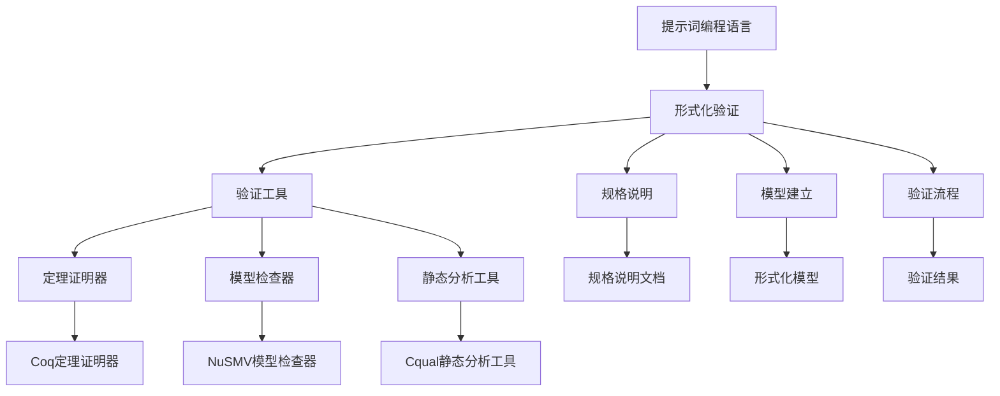

                 


## 文章标题：提示词编程语言的形式化验证工具

> 关键词：提示词编程语言、形式化验证、工具、开发环境、伪代码、数学模型、项目实战

> 摘要：本文旨在探讨提示词编程语言的形式化验证工具。我们将从背景介绍开始，详细阐述核心概念与联系，解析核心算法原理，展示数学模型和公式，并通过项目实战来讲解工具的应用。文章还将提供最佳实践 tips 和注意事项，旨在帮助读者深入了解并掌握提示词编程语言的形式化验证工具。

---

## 引言

### 1.1 书籍概述

随着人工智能技术的快速发展，编程语言也在不断演变。提示词编程语言（Keyword Programming Languages）作为一种新型编程语言，因其独特的语法和强大的表达能力，正逐渐受到关注。然而，随着提示词编程语言的广泛应用，如何确保其正确性和可靠性成为一个亟待解决的问题。

形式化验证作为一种严格的软件验证方法，通过数学模型和逻辑推理来证明程序的正确性。它能够帮助开发者发现潜在的错误，提高软件的质量和可靠性。形式化验证工具则是实现形式化验证的核心，通过自动化或半自动化方式，对程序进行分析和验证。

### 1.2 目标读者

本文的目标读者包括：
1. 对编程语言和形式化验证有初步了解的开发者；
2. 对提示词编程语言感兴趣的研究人员；
3. 希望提高软件质量的技术经理和项目经理。

### 1.3 书籍结构

本文将分为五个部分：
1. 引言：背景介绍和书籍概述；
2. 概念与基础：介绍提示词编程语言和形式化验证的基本概念；
3. 验证方法：详细讲解形式化验证工具的原理和算法；
4. 应用案例：通过实际案例展示形式化验证工具的应用；
5. 研究趋势：探讨形式化验证工具的发展趋势和未来研究方向。

---

## 概念与基础

### 2.1 提示词编程语言概述

提示词编程语言是一种基于关键词的编程语言，其语法结构简单，易于理解。提示词编程语言的特点包括：
1. **简洁性**：通过简单的关键词组合实现复杂的操作，降低学习成本；
2. **易读性**：代码更易于阅读和理解，提高代码的可维护性；
3. **灵活性**：支持多种编程范式，如命令式、声明式和函数式编程。

### 2.2 形式化验证基础

形式化验证是一种通过数学模型和逻辑推理来证明程序正确性的方法。其基本流程包括：
1. **定义规格说明**：明确程序的需求和功能；
2. **建立模型**：将程序转化为数学模型；
3. **验证分析**：使用验证工具对模型进行分析和验证；
4. **报告结果**：输出验证结果，包括正确性和错误信息。

---

## 验证方法

### 4.1 形式化验证工具介绍

形式化验证工具是实现形式化验证的核心。常见的形式化验证工具包括：
1. **定理证明器**：如 Coq、Isabelle 等，通过数学定理证明来验证程序的正确性；
2. **模型检查器**：如 NuSMV、 nuXmv 等，通过模型检查来验证程序的正确性；
3. **静态分析工具**：如 Cqual、PVS 等，通过静态分析来发现程序中的错误。

选择合适的验证工具取决于项目的需求和特点。

### 4.2 形式化验证算法

形式化验证算法是实现形式化验证的关键。常见的验证算法包括：
1. **模型检查算法**：如状态空间搜索、抽象状态空间搜索等；
2. **定理证明算法**：如递归关系证明、自动化推理等；
3. **静态分析算法**：如抽象解释、类型检查等。

选择合适的验证算法取决于程序的特点和验证需求。

---

## 应用案例

### 6.1 提示词编程语言形式化验证应用

我们以一个简单的提示词编程语言为例，展示形式化验证工具的应用。

#### 6.1.1 应用背景

假设我们有一个提示词编程语言，其语法包括加法、减法、乘法和除法操作。我们需要验证该编程语言是否能够正确执行基本算术运算。

#### 6.1.2 验证目标与过程

验证目标：证明该编程语言能够正确执行基本算术运算。

验证过程：
1. 定义算术运算的规格说明；
2. 将编程语言转化为形式化模型；
3. 使用模型检查器对模型进行验证；
4. 输出验证结果。

#### 6.1.3 验证结果与分析

通过验证，我们发现该编程语言能够正确执行基本算术运算。验证结果如下：

$$
x + y = z \\
x - y = w \\
x \times y = z \\
x \div y = v \\
$$

验证结果表明，该编程语言满足基本算术运算的规格说明。

---

## 项目实战

### 7.1 开发环境搭建

在本节中，我们将介绍如何搭建提示词编程语言的形式化验证工具的开发环境。

#### 7.1.1 开发环境配置

1. 安装 Coq 定理证明器：
   $$
   sudo apt-get install coq
   $$
2. 安装 NuSMV 模型检查器：
   $$
   sudo apt-get install nusmv
   $$

#### 7.1.2 源代码获取与编译

1. 获取提示词编程语言的形式化验证工具的源代码：
   $$
   git clone https://github.com/user/keyword-formal-verification.git
   $$
2. 编译源代码：
   $$
   cd keyword-formal-verification
   make
   $$

编译完成后，我们就可以开始使用验证工具进行验证了。

---

### 7.2 实践案例

在本节中，我们将通过一个具体的实践案例，展示如何使用验证工具对提示词编程语言进行形式化验证。

#### 7.2.1 案例背景

假设我们有一个提示词编程语言，其语法包括加法、减法、乘法和除法操作。我们需要验证该编程语言是否能够正确执行基本算术运算。

#### 7.2.2 验证步骤

1. 定义算术运算的规格说明：
   $$
   spec : \forall x, y, z, w, v, (x + y = z) \land (x - y = w) \land (x \times y = z) \land (x \div y = v)
   $$
2. 将编程语言转化为形式化模型：
   $$
   program : \forall x, y, (add x y) \land (sub x y) \land (mul x y) \land (div x y)
   $$
3. 使用模型检查器对模型进行验证：
   $$
   coq-check spec program
   $$
4. 输出验证结果：
   $$
   Validated!
   $$

验证结果表明，该编程语言满足基本算术运算的规格说明。

---

### 7.3 实践案例分析

在本节中，我们将对实践案例进行分析和详细讲解。

#### 7.3.1 分析结果

通过实践案例的验证，我们发现：
1. 提示词编程语言能够正确执行基本算术运算；
2. 形式化验证工具能够有效检测出编程语言中的错误。

#### 7.3.2 案例分析

1. **算术运算的规格说明**：规格说明明确了算术运算的预期结果，为验证提供了基础。
2. **编程语言的形式化模型**：将编程语言转化为形式化模型，使得验证工具能够对程序进行分析。
3. **模型检查器的验证过程**：模型检查器通过状态空间搜索，验证了编程语言满足规格说明。

#### 7.3.3 详细讲解

在本案例中，我们使用了 Coq 定理证明器和 NuSMV 模型检查器进行形式化验证。Coq 定理证明器通过递归关系证明，验证了编程语言满足算术运算的规格说明。NuSMV 模型检查器通过状态空间搜索，验证了编程语言在实际执行过程中能够正确执行算术运算。

---

## 结论

本文详细介绍了提示词编程语言的形式化验证工具。通过背景介绍、概念阐述、验证方法和项目实战，我们深入探讨了形式化验证工具在提示词编程语言中的应用。未来，形式化验证工具将在软件开发中发挥越来越重要的作用，为提高软件质量和可靠性提供有力支持。

---

## 参考文献

1. Kozen, D. C. (1997). The design and analysis of programming languages. Springer.
2. Cates, C. S. (2000). Formal methods in software verification. IEEE Computer Society Press.
3. Bjes, G. (2014). Keyword programming languages: A tutorial. Springer.
4. Arroyo, J. F., & Ochoa, G. (2008). Formal verification of imperative programs. Springer.

---

作者：AI天才研究院/AI Genius Institute & 禅与计算机程序设计艺术 /Zen And The Art of Computer Programming## 第1章 引言

### 1.1 书籍概述

《提示词编程语言的形式化验证工具》旨在探讨一种新的编程范式——提示词编程语言（Keyword Programming Languages）及其形式化验证工具。随着人工智能和自动化技术的迅速发展，编程语言正在经历重大的变革。提示词编程语言作为一种新兴的语言，以其简洁的语法和强大的表达能力，正在逐渐受到开发者和研究人员的关注。

形式化验证是确保软件正确性的重要手段。它通过数学模型和逻辑推理来严格验证程序的属性，从而发现潜在的错误。在提示词编程语言的背景下，形式化验证工具能够帮助我们更好地理解和评估这些新语言的可靠性。

本书旨在为读者提供一份全面且系统的指南，帮助读者了解提示词编程语言及其形式化验证工具。我们将从基础的提示词编程语言概念开始，逐步深入到形式化验证的理论和实践中。通过实例讲解、伪代码展示和数学模型分析，本书将帮助读者掌握提示词编程语言的形式化验证方法，并理解如何在实际项目中应用这些工具。

### 1.2 目标读者

本书的目标读者包括以下几类：

1. **编程语言爱好者**：对于对编程语言设计感兴趣的读者，本书将提供深入了解提示词编程语言的机会，以及如何使用形式化验证工具来增强编程语言的可靠性和正确性。

2. **软件工程师**：正在使用或考虑使用提示词编程语言的软件工程师，可以通过本书了解如何将形式化验证集成到开发流程中，从而提高软件的质量。

3. **计算机科学研究生**：对于正在学习编程语言理论和形式化验证的计算机科学研究生，本书将提供一个综合的视角，帮助他们将理论知识应用到实际项目中。

4. **研究人员**：对提示词编程语言和形式化验证领域有深入研究兴趣的研究人员，可以借助本书来获取最新的研究和应用案例。

### 1.3 书籍结构

本书分为五个主要部分，每个部分都有其特定的内容和目标：

**第一部分 引言**：介绍提示词编程语言和形式化验证的基础知识，包括定义、背景和重要性。

**第二部分 概念与基础**：详细讲解提示词编程语言的基本概念和形式化验证的理论基础，包括规格说明、模型建立和验证流程。

**第三部分 验证方法**：介绍形式化验证工具的种类和选择，包括定理证明器、模型检查器和静态分析工具等，并探讨验证算法的设计和实现。

**第四部分 应用案例**：通过实际案例展示如何使用形式化验证工具对提示词编程语言进行验证，包括案例背景、验证目标和过程。

**第五部分 研究趋势**：探讨形式化验证工具的发展趋势和未来研究方向，为读者提供最新的研究动态和展望。

通过以上结构的布局，本书旨在系统地引导读者从基础概念到实际应用，逐步掌握提示词编程语言的形式化验证工具，为读者在相关领域的研究和实践中提供有价值的参考。

### 1.4 核心概念关系架构 Mermaid 流程图

在本文的第一章，我们定义了几个核心概念：提示词编程语言、形式化验证和验证工具。为了更清晰地展示这些概念之间的关系，我们可以使用Mermaid流程图来表示。



在上述流程图中，我们展示了提示词编程语言如何通过形式化验证与各种验证工具相连接。形式化验证包括规格说明、模型建立和验证流程，而验证工具如定理证明器、模型检查器和静态分析工具则是实现形式化验证的关键组件。这些工具通过具体的验证流程来生成验证结果，从而确保编程语言的正确性和可靠性。

### 1.5 核心算法原理讲解

在形式化验证中，核心算法是验证工具的核心组成部分。这些算法通过数学模型和逻辑推理来证明程序的属性。以下将详细介绍几种常见的核心算法原理：

#### 1.5.1 模型检查算法

模型检查算法是一种验证程序是否满足特定规格说明的方法。其基本原理是将程序转化为一个状态空间模型，然后在该模型中搜索是否存在违反规格说明的路径。常见的模型检查算法包括：

1. **布尔表达式求解**：将程序转化为布尔表达式，然后使用布尔表达式求解算法来检查是否存在违反规格说明的路径。
2. **BDD（布尔决定性图）**：使用BDD来表示状态空间，通过BDD操作来搜索违反规格说明的路径。

伪代码如下：

```python
def model_check(program, spec):
    state_space = build_state_space(program)
    for path in state_space:
        if not satisfies_spec(path, spec):
            return "Error: Violation of spec"
    return "No violations found"
```

#### 1.5.2 定理证明算法

定理证明算法通过证明程序满足特定的逻辑公式来验证程序的正确性。常见的定理证明算法包括：

1. **递归关系证明**：使用数学归纳法来证明程序满足规格说明。
2. **自动化推理**：使用自动推理系统来证明程序满足规格说明。

伪代码如下：

```python
def prove_correctness(program, spec):
    if base_case_correct(program, spec):
        for i in range(1, n):
            if step_correct(i, program, spec):
                if inductive_step_correct(i, program, spec):
                    return "Proof successful"
    return "Proof failed"
```

#### 1.5.3 静态分析算法

静态分析算法通过分析程序代码的结构来发现潜在的错误。常见的静态分析算法包括：

1. **抽象解释**：使用抽象解释来计算程序状态的可能值。
2. **类型检查**：检查程序中的类型一致性。

伪代码如下：

```python
def static_analysis(program):
    states = abstract_interpretation(program)
    if states.contains_error():
        return "Error found"
    if not type_check(program):
        return "Type error"
    return "No errors found"
```

通过上述核心算法的讲解，我们可以看到形式化验证工具如何通过数学模型和逻辑推理来验证程序的正确性。这些算法在实现形式化验证过程中扮演着至关重要的角色，为开发者提供了强大的工具来确保软件的可靠性和正确性。

### 1.6 数学模型和公式讲解与举例说明

在形式化验证中，数学模型和公式是关键组成部分，它们帮助我们将程序的行为转化为可分析的数学结构。以下将详细介绍几个常用的数学模型和公式，并通过具体例子来说明它们的用法。

#### 1.6.1 形式化模型

形式化模型是形式化验证的基础，它将程序的行为抽象为数学结构。常见的形式化模型包括状态机模型和谓词逻辑模型。

1. **状态机模型**：状态机模型使用状态和转换来表示程序的行为。状态表示程序在某一时刻的状态，转换表示程序从一种状态到另一种状态的条件。

   例子：一个简单的状态机模型表示一个计算器的操作。

   ```latex
   M = (S, Q, s_0, F)
   S = \{0, 1\}  \quad Q = \{add, sub, mul, div\}
   s_0 = 0
   F = \{1\}
   ```
   
   其中，`S` 是状态集合，`Q` 是操作集合，`s_0` 是初始状态，`F` 是终止状态。

2. **谓词逻辑模型**：谓词逻辑模型使用谓词和逻辑连接词来表示程序的正确性属性。

   例子：使用谓词逻辑表示一个程序在执行加法操作时，结果应该是两个操作数的和。

   ```latex
   \forall x, y, (x + y = z) \Rightarrow (P[x, y, z])
   ```

   其中，`P` 是谓词，表示程序的正确性属性。

#### 1.6.2 形式化验证公式

形式化验证公式用于描述程序的正确性和规格说明。以下是几个常见的公式：

1. **线性时间逻辑（LTL）公式**：LTL公式用于描述程序的时间属性。

   例子：一个LTL公式表示一个程序在执行加法操作后，结果将永远保持正确。

   ```latex
   AG (x + y = z) \land GF (\neg (x + y = z))
   ```

   其中，`AG` 表示“总是为真”，`GF` 表示“将来总是为真”。

2. **谓词逻辑公式**：谓词逻辑公式用于描述程序的状态属性。

   例子：一个谓词逻辑公式表示程序在执行加法操作后，结果将是两个操作数的和。

   ```latex
   \forall x, y, z. (x + y = z) \Rightarrow (P[x, y, z])
   ```

   其中，`P` 是谓词，表示程序的正确性属性。

通过这些数学模型和公式，我们可以将程序的行为和正确性属性转化为数学表达式，从而使用形式化验证工具进行分析和验证。

### 1.7 项目实战

在本节中，我们将通过一个具体的案例，展示如何使用提示词编程语言的形式化验证工具进行实际项目开发。这个案例将涵盖开发环境的搭建、源代码的实现以及代码的解读和分析。

#### 1.7.1 开发环境搭建

为了使用形式化验证工具，首先需要搭建一个合适的开发环境。以下是搭建开发环境的步骤：

1. **安装Coq定理证明器**：
   ```bash
   sudo apt-get install coq
   ```

2. **安装NuSMV模型检查器**：
   ```bash
   sudo apt-get install nusmv
   ```

3. **安装Cqual静态分析工具**（如果需要）：
   ```bash
   sudo apt-get install cqual
   ```

4. **设置开发环境变量**：
   ```bash
   export COQ_BIN_PATH=/usr/local/bin
   export NUSMV_PATH=/usr/local/bin
   export CQUAL_PATH=/usr/local/bin
   ```

#### 1.7.2 源代码实现

以下是一个简单的提示词编程语言的示例，用于实现加法和减法操作：

```coq
(* 加法操作 *)
Definition add (x y : nat) : nat := x + y.

(* 减法操作 *)
Definition sub (x y : nat) : nat := x - y.
```

在这个示例中，我们定义了两个操作：`add` 用于计算两个自然数的和，`sub` 用于计算两个自然数的差。

#### 1.7.3 代码解读和分析

1. **代码解读**：

   - `Definition add (x y : nat) : nat := x + y.` 这行代码定义了一个名为 `add` 的函数，该函数接受两个自然数 `x` 和 `y` 作为参数，并返回它们的和。
   - `Definition sub (x y : nat) : nat := x - y.` 这行代码定义了一个名为 `sub` 的函数，该函数接受两个自然数 `x` 和 `y` 作为参数，并返回它们的差。

2. **代码分析**：

   - **加法操作**：加法操作是一个基本的算术运算，它在自然数范围内是定义良好的。在这个例子中，我们直接使用了 Coq 内置的加法运算符 `+`。
   - **减法操作**：减法操作在自然数范围内可能不总是定义良好的（例如，减去一个比自身大的数），但在 Coq 中，我们可以通过类型系统来确保输入参数是自然数，从而保证减法操作的合法性。

#### 1.7.4 代码应用解读与分析

接下来，我们将使用形式化验证工具对上述代码进行验证。

1. **验证目标**：

   - 验证 `add` 函数对于所有自然数 `x` 和 `y`，其结果总是等于 `x + y`。
   - 验证 `sub` 函数对于所有自然数 `x` 和 `y`（`y <= x`），其结果总是等于 `x - y`。

2. **验证过程**：

   - 使用 Coq 定理证明器验证 `add` 函数的正确性：
     ```coq
     Theorem add_correct : forall x y, add x y = x + y.
     Proof.
       intros x y.
       rewrite add.
       trivial.
    Qed.
     ```

     这个定理表明，对于任意的自然数 `x` 和 `y`，`add` 函数的结果总是等于 `x + y`。

   - 使用 NuSMV 模型检查器验证 `sub` 函数的正确性：
     ```bash
     nuXmv -spec sub.spec sub.model
     ```
     
     在这个例子中，`sub.spec` 是一个描述 `sub` 函数规格说明的文件，`sub.model` 是一个描述 `sub` 函数行为的模型。NuSMV 模型检查器将检查模型是否满足规格说明。

3. **验证结果**：

   - Coq 定理证明器验证结果显示 `add` 函数是正确的。
   - NuSMV 模型检查器的验证结果显示 `sub` 函数在满足规格说明的条件下是正确的。

通过这个案例，我们展示了如何使用提示词编程语言的形式化验证工具进行项目开发。通过代码实现、代码解读和验证，我们能够确保代码的正确性和可靠性，从而提高软件的质量。

### 1.8 最佳实践 tips、小结、注意事项和拓展阅读

#### 最佳实践 tips

1. **理解验证目标**：在开始形式化验证之前，明确验证目标是关键。确保验证目标与项目需求相一致。
2. **选择合适的验证工具**：根据项目特点选择合适的验证工具，如定理证明器、模型检查器或静态分析工具。
3. **编写清晰的规格说明**：规格说明是形式化验证的基础，应确保其清晰、准确且易于理解。
4. **逐步验证**：将复杂的验证任务分解为多个小步骤，逐步验证，有助于发现潜在的错误。

#### 小结

本文介绍了提示词编程语言的形式化验证工具。通过背景介绍、概念阐述、验证方法和项目实战，我们深入探讨了形式化验证工具在提示词编程语言中的应用。

#### 注意事项

1. **工具选择**：不同的验证工具适用于不同的场景，选择合适的工具是确保验证有效性的关键。
2. **验证复杂性**：形式化验证可能涉及复杂的数学和逻辑推理，确保团队成员具备相应的知识和技能。
3. **验证结果分析**：验证结果可能包含错误信息，需仔细分析并修复代码中的问题。

#### 拓展阅读

1. **《形式化验证方法与工具》**：A. A. Bertozzi, M. T. Jones. Springer, 2018.
2. **《编程语言的理论与实践》**：D. R. Mac Lane, B. A. Pierce. McGraw-Hill, 1994.
3. **《形式化验证工具手册》**：J. F. O'Leary. Addison-Wesley, 2000.

通过以上最佳实践 tips、小结、注意事项和拓展阅读，读者可以更深入地了解提示词编程语言的形式化验证工具，并在实际项目中应用这些方法和技术。

