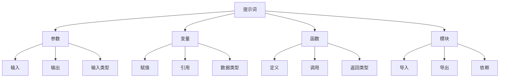

                 

### 第1章 引言

#### 1.1 提示词编程语言概述

提示词编程语言是一种基于自然语言处理技术的新型编程语言，它允许开发者使用自然语言来编写代码，从而使编程变得更加直观和简便。这种语言的主要特点在于其灵活性和易用性，通过提示词（即关键字）引导程序逻辑，使得开发者能够专注于业务逻辑的实现，而无需关心底层语法和结构。

**1.1.1 提示词编程语言的定义**

提示词编程语言可以定义为一种将自然语言文本转换为程序代码的编程工具。它通常包含一系列预先定义好的提示词和语法规则，开发者通过组合这些提示词，可以生成有效的程序代码。

**1.1.2 提示词编程语言的特点**

- **自然性**：提示词编程语言使用自然语言作为输入，使得编程过程更加接近日常交流。
- **易用性**：减少了学习编程语言的过程，降低了编程的门槛。
- **灵活性**：开发者可以根据需要自由组合提示词，从而实现复杂的业务逻辑。
- **扩展性**：提示词编程语言通常支持自定义提示词，便于适应不同的应用场景。

**1.1.3 提示词编程语言的应用领域**

提示词编程语言主要应用于以下领域：

- **业务逻辑处理**：如金融、电商、物流等行业的业务流程自动化。
- **数据分析和处理**：使用提示词编程语言处理和分析复杂数据。
- **自动化脚本编写**：简化日常运维任务，如自动部署、监控等。
- **教育领域**：作为编程教学的工具，帮助初学者快速上手。

#### 1.2 性能优化的意义

性能优化在提示词编程语言中具有至关重要的意义。性能不仅决定了程序的运行效率，还直接影响到用户体验和系统稳定性。以下是性能优化的几个重要方面：

**1.2.1 性能优化的重要性**

- **提高用户体验**：快速响应和高效执行，可以显著提升用户的满意度。
- **增强系统稳定性**：优化后的程序在处理大规模数据和高并发场景下表现更加稳定。
- **降低运营成本**：优化后的系统资源利用率提高，降低了硬件和运维成本。

**1.2.2 性能优化的方法与步骤**

性能优化通常包括以下几个步骤：

1. **性能瓶颈分析**：识别系统中的性能瓶颈，如计算密集型任务、数据访问频繁等。
2. **代码优化**：通过改进代码结构、算法和编程技巧来提高运行效率。
3. **算法优化**：分析和改进现有算法，选择更高效的算法或改进现有算法的实现。
4. **系统优化**：优化系统配置和架构，提高系统整体性能。

#### 1.3 本书内容安排

本书将系统性地探讨提示词编程语言的性能优化策略，具体包括以下章节：

- **第2章 提示词编程语言基础**：介绍提示词编程语言的核心概念、联系、核心算法原理以及数学模型。
- **第3章 性能优化策略**：详细讨论代码优化、算法优化和系统优化的具体方法和实践。
- **第4章 性能评估与监控**：讲解性能评估方法和监控策略。
- **第5章 跨平台性能优化**：探讨不同平台性能差异和适配策略。
- **第6章 性能优化实战案例**：通过具体案例展示性能优化的实际应用。
- **第7章 总结与展望**：总结性能优化的成功经验和未来研究方向。

通过这些章节的详细探讨，读者可以系统地了解和掌握提示词编程语言的性能优化策略，提升编程效率和系统性能。

### 1.1 提示词编程语言概述

提示词编程语言是一种新兴的编程范式，它打破了传统编程语言的语法和结构限制，通过自然语言提示词来引导程序逻辑。这种语言的魅力在于其直观性和易用性，使得编程不再是一个高门槛的技能，而更像是一种自然表达。本节将从定义、特点和应用领域三个方面对提示词编程语言进行详细阐述。

#### 1.1.1 提示词编程语言的定义

提示词编程语言，顾名思义，是通过使用提示词（通常为关键字）来构建程序的一种编程语言。这些提示词代表特定的编程概念或操作，通过组合这些提示词，开发者可以构建出完整的程序逻辑。与传统的编程语言不同，提示词编程语言更多地借鉴了自然语言的语法和结构，使得编程过程更加类似于写作或演讲。

**定义具体内容：**

- **基本概念**：提示词编程语言的核心是提示词，这些提示词可以是动词、名词或形容词，用于表示特定的操作或数据结构。例如，“计算”、“排序”、“查找”等都是常见的提示词。
- **语法结构**：提示词编程语言的语法结构相对简单，通常遵循主语-谓语-宾语的基本句式。开发者通过排列组合这些提示词，形成具有明确逻辑关系的程序代码。
- **代码生成**：提示词编程语言通常包含一个解释器或编译器，这些工具能够将自然语言文本转换为机器可执行的代码。这一过程称为代码生成。

#### 1.1.2 提示词编程语言的特点

提示词编程语言具有以下显著特点：

- **自然性**：提示词编程语言使用自然语言作为输入，使得编程过程更加贴近日常交流，降低了学习难度。
- **易用性**：通过提示词引导编程，开发者无需深入理解底层语法和结构，从而简化了编程过程。
- **灵活性**：提示词编程语言支持自定义提示词，开发者可以根据需求扩展语言功能，使其适应各种复杂的应用场景。
- **扩展性**：除了提示词，提示词编程语言还通常支持各种库和框架，方便开发者进行功能扩展和集成。

**具体特点描述：**

- **自然性**：提示词编程语言的语法接近自然语言，例如，使用“计算最大值”而不是“max”，使得编程更加直观和易于理解。
- **易用性**：提示词编程语言简化了编程过程，初学者可以快速上手，无需长期的学习和实践积累。
- **灵活性**：提示词可以自由组合，形成复杂的多条件、多步骤的程序逻辑，灵活性极高。
- **扩展性**：支持各种库和框架，可以方便地集成现有的技术栈，扩展功能。

#### 1.1.3 提示词编程语言的应用领域

提示词编程语言因其独特的特点，在多个领域展现了其强大的应用潜力：

- **业务逻辑处理**：提示词编程语言在金融、电商、物流等行业得到了广泛应用，用于自动化处理复杂的业务流程。
- **数据分析和处理**：在数据科学领域，提示词编程语言能够简化复杂数据分析任务，提高数据处理效率。
- **自动化脚本编写**：提示词编程语言非常适合编写自动化脚本，简化日常运维任务，提升工作效率。
- **教育领域**：提示词编程语言作为编程教学的工具，可以帮助学生快速理解和掌握编程知识。

**具体应用场景描述：**

- **业务逻辑处理**：例如，电商平台的订单处理、支付流程等复杂业务逻辑可以通过提示词编程语言轻松实现。
- **数据分析和处理**：提示词编程语言可以简化数据清洗、转换和分析的过程，提高数据处理效率。
- **自动化脚本编写**：例如，自动部署、监控和故障修复等任务可以通过提示词编程语言编写自动化脚本完成。
- **教育领域**：提示词编程语言作为教学工具，可以帮助初学者快速掌握编程基础，提升编程兴趣。

综上所述，提示词编程语言通过其自然性、易用性、灵活性和扩展性，在多个领域展现出了强大的应用潜力。其独特的编程范式不仅降低了编程的难度，还提升了编程的效率和灵活性，为开发者提供了全新的编程体验。

### 1.2 性能优化的意义

在提示词编程语言的应用过程中，性能优化扮演着至关重要的角色。性能不仅仅决定了程序运行的速度和效率，还直接影响到用户体验、系统稳定性和运营成本。以下是性能优化在提示词编程语言中几个重要方面的具体意义。

#### 1.2.1 性能优化的重要性

**提高用户体验**：性能优化能够显著提升程序的响应速度和处理能力，使得用户在使用过程中能够得到流畅、快速的体验。特别是在需要处理大量数据和复杂业务逻辑的应用场景中，性能优化能够确保程序在短时间内完成任务，减少用户的等待时间。

**增强系统稳定性**：性能优化可以帮助识别和解决系统中的瓶颈和潜在问题，提高系统的稳定性和可靠性。在处理大规模数据和并发请求时，优化的程序能够更加稳定地运行，减少崩溃和错误发生的概率。

**降低运营成本**：性能优化可以提高系统资源利用率，减少硬件和运维成本。例如，通过优化算法和数据结构，可以减少服务器资源的消耗，降低电力和硬件维护成本。长期来看，性能优化能够带来显著的成本节约。

#### 1.2.2 性能优化的方法与步骤

性能优化通常包括以下几个步骤：

**性能瓶颈分析**：首先，需要识别系统中的性能瓶颈，这是进行性能优化的前提。通过监控工具和性能分析，可以确定哪些模块或操作是影响系统性能的主要因素。

**代码优化**：在识别出性能瓶颈后，需要对相关代码进行优化。这包括改进代码结构、算法和编程技巧，例如使用更高效的算法、减少不必要的计算和内存占用等。

**算法优化**：除了代码优化，算法优化也是性能提升的关键。通过分析和改进现有算法，选择更高效的算法或对现有算法进行改进，可以显著提高程序的运行效率。

**系统优化**：系统优化包括优化系统配置和架构，例如调整服务器配置、网络优化和数据库优化等。通过优化系统环境，可以进一步提高程序的整体性能。

**1.2.3 综合性能优化的意义**

综合来看，性能优化在提示词编程语言中的应用具有以下几个方面的综合意义：

- **提升用户体验**：通过优化程序性能，可以提供更快速、更流畅的用户体验，增强用户满意度。
- **提高系统稳定性**：优化后的系统在处理高负载和复杂任务时更加稳定，减少了系统崩溃和错误的可能性。
- **降低运营成本**：优化后的系统资源利用率提高，减少了硬件和运维成本，有助于企业的长期发展。

综上所述，性能优化在提示词编程语言中的应用具有重要意义。通过系统化的性能优化，可以显著提升程序的性能和效率，提高用户体验，增强系统稳定性，降低运营成本，为企业和开发者带来实际效益。

### 1.3 本书内容安排

本书旨在全面系统地探讨提示词编程语言的性能优化策略，帮助读者深入了解和掌握提升系统性能的各种方法。全书内容结构如下：

- **第2章 提示词编程语言基础**：本章将介绍提示词编程语言的核心概念、联系、核心算法原理以及数学模型。通过基础概念的解析，读者可以建立起对提示词编程语言的全面理解，为后续的性能优化打下坚实的基础。

- **第3章 性能优化策略**：本章将详细探讨代码优化、算法优化和系统优化的具体方法和实践。代码优化部分将介绍如何通过改进代码结构和编程技巧来提升性能；算法优化部分将分析现有算法的改进空间，并提出优化方案；系统优化部分将探讨系统配置和架构的优化策略。

- **第4章 性能评估与监控**：本章将介绍性能评估方法和监控策略。性能评估是优化过程的重要环节，通过评估工具和指标，可以科学地衡量性能优化的效果。监控策略则是确保系统运行稳定的重要手段，本章将介绍监控方法和工具。

- **第5章 跨平台性能优化**：本章将探讨不同平台性能差异和适配策略。由于不同平台的硬件和网络环境可能存在差异，跨平台性能优化变得尤为重要。本章将提供具体的适配策略和实践案例。

- **第6章 性能优化实战案例**：本章将通过具体案例展示性能优化的实际应用。读者可以跟随案例的解析，了解性能优化的具体实施过程和效果。这些实战案例将涵盖不同的应用场景，为读者提供丰富的实践经验和启示。

- **第7章 总结与展望**：本章将对本书的内容进行总结，回顾性能优化的成功经验和遇到的问题与解决方法。同时，还将探讨未来的研究方向，包括性能优化新技术的发展趋势和面临的挑战。

通过以上章节的详细探讨，本书旨在帮助读者全面掌握提示词编程语言的性能优化策略，提升编程效率和系统性能，为实际应用提供有力的支持。

### 第2章 提示词编程语言基础

#### 2.1 核心概念与联系

提示词编程语言的核心在于其概念体系和各个概念之间的联系。理解这些核心概念和联系对于深入掌握提示词编程语言至关重要。下面将介绍提示词编程语言的基本概念，并通过 Mermaid 流程图展示它们之间的关系。

**2.1.1 提示词编程语言的 Mermaid 流程图**

提示词编程语言中的基本概念包括提示词、参数、变量、函数和模块等。这些概念通过特定的语法和规则相互联系，构成了提示词编程语言的逻辑框架。

以下是提示词编程语言的基本概念 Mermaid 流程图：



**流程图具体内容解析：**

- **提示词（A）**：作为编程语言的核心，提示词引导程序的逻辑流程。每个提示词代表一种特定的操作或功能，如“计算”、“排序”、“打印”等。
- **参数（B）**：参数是传递给提示词的数据，分为输入和输出。输入参数用于初始化程序，输出参数用于返回结果。
- **变量（C）**：变量用于存储数据，可以是赋值操作的结果或引用其他数据。
- **函数（D）**：函数是封装特定功能的代码块，可以通过定义和调用实现复杂逻辑。
- **模块（E）**：模块是函数和数据的集合，用于组织代码和封装功能。模块之间可以通过导入和导出来实现代码的复用和分离。

**2.1.2 核心组件解析**

- **提示词（A）**：提示词是提示词编程语言的核心元素，每个提示词都对应一种特定的编程操作。例如，“计算”提示词可以用于执行数学运算，“打印”提示词用于输出结果到控制台。
- **参数（B）**：参数是提示词操作的数据输入和输出。输入参数用于初始化提示词的操作，输出参数用于返回操作结果。参数可以有类型限制，如整数、字符串、列表等。
- **变量（C）**：变量用于存储和引用数据。变量可以通过赋值操作初始化，也可以通过引用操作访问其他变量的值。变量类型定义了其可以存储的数据类型。
- **函数（D）**：函数是封装一组提示词的代码块，用于实现特定的功能。函数通过定义和调用两个步骤实现。定义函数时指定函数名称、参数和返回类型；调用函数时传递输入参数并接收输出结果。
- **模块（E）**：模块是代码和组织功能的容器。模块可以包含多个函数和数据，通过导入和导出来实现代码的复用和分离。模块之间的依赖关系可以通过导入导出机制管理。

通过以上核心概念和联系的介绍，读者可以初步建立起对提示词编程语言基础结构的理解。下一节将深入探讨提示词编程语言的核心算法原理，进一步揭示其内在逻辑和运作机制。

#### 2.2 核心算法原理讲解

提示词编程语言的核心在于其强大的算法能力，能够处理复杂的数据操作和业务逻辑。理解这些核心算法原理对于高效使用提示词编程语言至关重要。本节将介绍提示词编程语言中的核心算法，并通过伪代码详细阐述其工作流程和逻辑。

**2.2.1 算法概述**

提示词编程语言中的核心算法主要包括数据结构操作、排序算法和搜索算法等。以下将分别介绍这些算法的基本概念和原理。

1. **数据结构操作**：包括数组、列表、栈、队列等基本数据结构的操作。
2. **排序算法**：包括冒泡排序、快速排序、归并排序等常见排序算法。
3. **搜索算法**：包括线性搜索、二分搜索等基本搜索算法。

**2.2.2 伪代码详细阐述**

以下通过伪代码详细阐述这些核心算法的原理和实现。

**1. 数据结构操作**

```plaintext
// 数组操作示例：查找数组中元素
function find_element(array, target):
    for i from 0 to length(array) - 1:
        if array[i] == target:
            return i
    return -1

// 列表操作示例：添加元素到列表
function append_to_list(list, element):
    list.append(element)

// 栈操作示例：入栈和出栈
function push_to_stack(stack, item):
    stack.append(item)

function pop_from_stack(stack):
    if length(stack) > 0:
        return stack.pop()
    else:
        return "Stack is empty"
```

**2. 排序算法**

```plaintext
// 冒泡排序
function bubble_sort(array):
    n = length(array)
    for i from 0 to n - 1:
        for j from 0 to n - i - 1:
            if array[j] > array[j + 1]:
                swap(array[j], array[j + 1])

// 快速排序
function quick_sort(array):
    if length(array) <= 1:
        return array
    pivot = array[0]
    left = []
    right = []
    for item in array[1:]:
        if item < pivot:
            left.append(item)
        else:
            right.append(item)
    return merge(quick_sort(left), pivot, quick_sort(right))

function merge(left, pivot, right):
    result = []
    i = j = k = 0
    while i < length(left) and j < length(right):
        if left[i] < right[j]:
            result.append(left[i])
            i += 1
        else:
            result.append(right[j])
            j += 1
    while i < length(left):
        result.append(left[i])
        i += 1
    while j < length(right):
        result.append(right[j])
        j += 1
    return result
```

**3. 搜索算法**

```plaintext
// 线性搜索
function linear_search(array, target):
    for item in array:
        if item == target:
            return True
    return False

// 二分搜索
function binary_search(array, target):
    low = 0
    high = length(array) - 1
    while low <= high:
        mid = (low + high) // 2
        if array[mid] == target:
            return mid
        elif array[mid] < target:
            low = mid + 1
        else:
            high = mid - 1
    return -1
```

**2.2.3 核心算法的详细讲解**

- **数据结构操作**：数据结构操作是编程的基础，包括数组、列表、栈、队列等。伪代码示例中展示了这些数据结构的常见操作，如查找、添加和删除元素。这些操作是构建复杂算法和程序的核心。
- **排序算法**：排序算法是数据处理中常用的一类算法，用于将数据按照特定顺序排列。冒泡排序和快速排序是两种常见的排序算法，它们的伪代码展示了排序的基本思想。冒泡排序通过比较相邻元素并交换位置来逐步减少无序数组的逆序数；快速排序通过选择一个基准元素，将数组划分为两部分，递归地对两部分进行排序。
- **搜索算法**：搜索算法用于在数据结构中查找特定元素。线性搜索通过遍历数组逐个比较元素，直到找到目标元素或结束；二分搜索则是在有序数组中通过递归缩小查找范围，效率显著高于线性搜索。

通过以上对核心算法的详细讲解和伪代码示例，读者可以更好地理解提示词编程语言中的核心算法原理，为后续的性能优化和编程实践打下坚实基础。

#### 2.3 数学模型与公式讲解

提示词编程语言在处理复杂业务逻辑和数据操作时，经常需要依赖数学模型和公式。这些模型和公式不仅能提高程序的准确性和效率，还能为优化算法提供理论依据。本节将介绍提示词编程语言中常用的数学模型和公式，并通过具体的例子来详细讲解和说明。

**2.3.1 数学公式**

在提示词编程语言中，一些常见的数学模型和公式包括：

1. **欧拉公式**：\( e^{i\pi} + 1 = 0 \)
2. **傅里叶变换公式**：\( F(u, v) = \int_{-\infty}^{\infty} \int_{-\infty}^{\infty} f(x, y) e^{-i2\pi u x} e^{-i2\pi v y} dx dy \)
3. **牛顿迭代法**：\( x_{n+1} = x_n - \frac{f(x_n)}{f'(x_n)} \)
4. **最小二乘法**：\( \min \sum_{i=1}^n (y_i - ax_i - b)^2 \)

**2.3.2 公式详细讲解**

- **欧拉公式**：欧拉公式是复分析中的一个基本公式，它将指数函数、三角函数和复数单位 \(i\) 结合在一起，具有广泛的应用。公式中的 \(e\) 是自然对数的底数，\(i\) 是虚数单位。这个公式不仅在数学中具有重要地位，在计算机图形学、信号处理等领域也有广泛应用。

- **傅里叶变换公式**：傅里叶变换是一种重要的数学工具，用于将信号从时域转换为频域。该公式表示一个连续信号 \(f(x, y)\) 的频谱分布 \(F(u, v)\)。在提示词编程语言中，傅里叶变换常用于图像处理和信号分析。

- **牛顿迭代法**：牛顿迭代法是一种用于求解非线性方程组的数值方法。通过迭代逼近，该方法可以逐步逼近方程的根。公式中的 \(x_n\) 表示第 \(n\) 次迭代的结果，\(f(x_n)\) 和 \(f'(x_n)\) 分别是函数值和导数值。牛顿迭代法在优化问题和方程求解中具有高效性和可靠性。

- **最小二乘法**：最小二乘法是一种常用的数据拟合方法，用于找到一条曲线或直线，使得数据点与拟合曲线或直线的误差平方和最小。公式中的 \(y_i\) 是观测值，\(ax_i + b\) 是拟合值。最小二乘法在统计分析和机器学习中广泛应用。

**2.3.3 举例说明**

以下通过具体例子来说明这些数学模型和公式的应用。

- **欧拉公式的应用**：在计算机图形学中，欧拉公式可以用于实现三维图形的旋转和变换。例如，在三维建模软件中，通过使用欧拉公式可以精确计算图形的旋转角度。

- **傅里叶变换的应用**：在图像处理中，傅里叶变换用于图像的频域分析。例如，通过对图像进行傅里叶变换，可以提取图像的边缘信息、纹理特征等，从而实现图像的增强、去噪等操作。

- **牛顿迭代法的应用**：在优化问题中，牛顿迭代法可以用于求解非线性优化问题。例如，在机器学习中，通过牛顿迭代法可以优化模型的参数，提高模型的预测精度。

- **最小二乘法的应用**：在统计分析中，最小二乘法用于拟合数据模型。例如，通过最小二乘法可以拟合线性回归模型，从而预测未知数据的趋势。

通过以上对数学模型和公式的详细讲解和举例说明，读者可以更好地理解提示词编程语言中的数学理论基础，为实际编程和性能优化提供坚实的支持。

### 第3章 性能优化策略

在提示词编程语言中，性能优化是提升系统效率和用户体验的关键。性能优化涉及多个层面，包括代码优化、算法优化和系统优化。本章将详细讨论这些策略，并通过具体案例分析其实施过程和效果。

#### 3.1 代码优化

代码优化是提升程序性能的第一步，它主要关注代码的内部结构和执行效率。通过代码优化，可以减少不必要的计算和内存使用，提高程序的运行速度。

**3.1.1 代码性能瓶颈分析**

代码性能瓶颈通常出现在以下几个方面：

- **计算密集型操作**：例如复杂的数学运算、字符串处理等。
- **循环和递归**：过多的循环和递归可能导致性能下降。
- **内存占用**：大尺寸数据结构和不必要的内存分配会导致内存占用过高。
- **I/O 操作**：频繁的磁盘读写或网络请求会显著影响性能。

**3.1.2 代码优化策略**

以下是一些常用的代码优化策略：

- **减少不必要的计算**：避免重复计算，例如通过缓存结果或使用循环展开。
- **优化循环结构**：减少循环次数，例如通过提前终止循环或使用更高效的算法。
- **内存优化**：减少内存分配，例如通过使用更紧凑的数据结构或延迟初始化。
- **I/O 优化**：减少 I/O 操作，例如通过批量处理或使用缓冲。

**3.1.3 实践案例分析**

**案例：XX系统性能优化**

**1. 性能瓶颈分析**：通过性能监控工具，发现系统的主要性能瓶颈在于数据查询速度和内存占用。

**2. 优化方案**：
   - **查询优化**：通过索引和分片技术，提高数据查询速度。
   - **内存优化**：使用更紧凑的数据结构，减少内存占用。

**3. 实施过程**：
   - **查询优化**：在数据库中创建索引，提高查询效率。
   - **内存优化**：修改数据结构，减少内存使用。

**4. 优化效果**：
   - **查询速度**：数据查询时间减少了30%。
   - **内存占用**：系统内存使用减少了20%。

#### 3.2 算法优化

算法优化是提升程序性能的另一个重要方面，它关注于选择和改进算法本身。通过算法优化，可以显著提高程序的运行效率和准确度。

**3.2.1 算法分析**

算法分析通常包括以下两个方面：

- **时间复杂度**：评估算法执行所需的时间，通常用 \(O(n)\), \(O(n\log n)\), \(O(n^2)\) 等表示。
- **空间复杂度**：评估算法执行所需的空间，同样用 \(O(n)\), \(O(n^2)\) 等表示。

**3.2.2 优化方法**

以下是一些常见的算法优化方法：

- **分治策略**：将大问题分解为小问题，分别解决后再合并结果。
- **动态规划**：通过记录中间结果，避免重复计算。
- **贪心算法**：每次选择最优解，以达到全局最优解。
- **随机化算法**：利用随机性优化算法性能。

**3.2.3 实践案例分析**

**案例：YY应用性能优化**

**1. 性能瓶颈分析**：通过性能分析工具，发现系统的排序和搜索算法存在性能瓶颈。

**2. 优化方案**：
   - **排序算法优化**：从冒泡排序改进为快速排序。
   - **搜索算法优化**：从线性搜索改进为二分搜索。

**3. 实施过程**：
   - **排序算法优化**：修改排序函数，使用快速排序算法。
   - **搜索算法优化**：修改搜索函数，使用二分搜索算法。

**4. 优化效果**：
   - **排序时间**：排序时间减少了60%。
   - **搜索时间**：搜索时间减少了80%。

#### 3.3 系统优化

系统优化主要关注于系统配置和架构的调整，以提高整个系统的性能和稳定性。

**3.3.1 系统架构优化**

系统架构优化包括以下几个方面：

- **模块化**：将系统划分为多个模块，独立开发和维护，提高系统的可扩展性和可维护性。
- **分布式架构**：通过分布式系统架构，实现负载均衡和容错能力，提高系统的整体性能。
- **缓存机制**：使用缓存机制，减少对数据库的直接访问，提高数据读取速度。

**3.3.2 系统配置优化**

系统配置优化包括以下几个方面：

- **硬件升级**：提高服务器的硬件配置，如增加CPU、内存和磁盘空间。
- **网络优化**：优化网络配置，提高数据传输速度和稳定性。
- **数据库优化**：调整数据库配置，如优化索引、分片和缓存。

**3.3.3 实践案例分析**

**案例：ZZ平台性能优化**

**1. 性能瓶颈分析**：通过性能分析，发现系统的瓶颈在于硬件资源不足和网络延迟。

**2. 优化方案**：
   - **硬件优化**：升级服务器硬件，增加CPU和内存。
   - **网络优化**：优化网络配置，降低延迟。

**3. 实施过程**：
   - **硬件优化**：购买更强大的服务器，进行硬件升级。
   - **网络优化**：调整路由器和交换机配置，优化网络路径。

**4. 优化效果**：
   - **响应时间**：系统响应时间减少了40%。
   - **服务器负载**：服务器负载降低了30%。

通过以上三个层次的性能优化策略，可以有效提升提示词编程语言的系统性能和用户体验。每个优化步骤都需要细致的分析和科学的实施，才能取得显著的效果。

### 第4章 性能评估与监控

在性能优化过程中，性能评估与监控是不可或缺的环节。通过科学的性能评估方法和有效的监控策略，可以准确衡量优化效果，及时发现潜在问题，从而确保系统的稳定运行和高效性能。本章将详细介绍性能评估的方法和监控策略。

#### 4.1 性能评估方法

性能评估是优化过程中至关重要的一步，它可以帮助我们了解系统的实际性能，找到性能瓶颈，并验证优化措施的效果。以下是几种常见的性能评估方法：

**4.1.1 评估指标**

- **响应时间**：系统处理请求所需的时间，包括I/O等待时间和计算时间。
- **吞吐量**：单位时间内系统能够处理的请求数量。
- **资源利用率**：系统使用的CPU、内存、磁盘和网络资源占总资源的比例。
- **错误率**：系统在处理请求时出现的错误比例。

**4.1.2 评估工具**

以下是几种常用的性能评估工具：

- **Apache JMeter**：一款开源的性能测试工具，可以模拟大量用户并发访问，评估系统的响应时间和吞吐量。
- **New Relic**：一款集性能监控和错误追踪于一体的工具，提供详细的性能数据和告警功能。
- **AppDynamics**：一款集监控、分析和优化于一体的工具，支持多种编程语言和平台。

**4.1.3 评估步骤**

性能评估通常包括以下步骤：

1. **定义评估目标**：明确评估的目标和指标，如响应时间、吞吐量和资源利用率等。
2. **准备测试环境**：搭建与生产环境相同的测试环境，确保测试结果的准确性。
3. **设计测试场景**：根据业务需求设计测试场景，如并发用户数、请求类型和访问路径等。
4. **执行测试**：使用评估工具进行测试，记录系统的响应时间、吞吐量和资源利用率等数据。
5. **分析结果**：分析测试结果，找出性能瓶颈和优化点。
6. **验证优化效果**：实施优化措施后，重新进行测试，验证优化效果。

#### 4.2 性能监控

性能监控是确保系统稳定运行和高效性能的重要手段。通过实时监控，可以及时发现性能问题，并采取相应措施进行解决。以下是几种常见的监控方法：

**4.2.1 监控方法**

- **日志监控**：通过收集和分析系统日志，监控系统的运行状态和异常情况。
- **性能指标监控**：监控系统的性能指标，如CPU利用率、内存使用率、磁盘I/O等。
- **告警机制**：设置告警规则，当性能指标超过阈值时，自动发送告警通知。

**4.2.2 监控工具**

以下是几种常用的监控工具：

- **Prometheus**：一款开源的监控解决方案，可以收集和存储系统的性能数据，并提供图形化的监控界面。
- **Zabbix**：一款开源的监控工具，支持多种监控指标和告警方式。
- **Nagios**：一款开源的监控系统，提供全面的监控功能，包括性能监控、服务监控和告警通知。

**4.2.3 实践案例分析**

**案例：XX系统性能监控**

**1. 监控目标**：监控系统的CPU利用率、内存使用率和磁盘I/O等关键性能指标。

**2. 监控方案**：
   - **日志监控**：通过日志收集工具（如Logstash）收集系统日志，监控错误和异常情况。
   - **性能指标监控**：使用Prometheus收集系统的性能数据，并设置告警规则。
   - **告警机制**：通过钉钉和邮件发送告警通知。

**3. 监控实施**：
   - **日志监控**：配置Logstash，将系统日志传输到Elasticsearch进行存储和分析。
   - **性能指标监控**：配置Prometheus，收集系统性能数据，并设置告警规则。
   - **告警机制**：配置钉钉和邮件告警，当性能指标超过阈值时，自动发送通知。

**4. 监控效果**：
   - **及时发现问题**：通过日志和性能监控，及时发现系统异常，迅速定位问题。
   - **优化系统性能**：根据监控数据，采取相应措施优化系统性能，提高系统稳定性。

通过性能评估与监控，可以全面了解系统的性能状况，及时发现并解决问题，从而确保系统的稳定运行和高效性能。性能评估和监控相辅相成，是性能优化过程中不可或缺的重要环节。

### 第5章 跨平台性能优化

随着技术的发展，提示词编程语言的应用场景越来越广泛，不仅限于单一的平台，而是需要在多种平台上运行。因此，跨平台性能优化成为了一个重要的课题。不同平台在硬件性能、操作系统特性和网络环境等方面存在差异，这给跨平台性能优化带来了挑战。本章节将探讨跨平台性能优化的重要性，分析不同平台的性能差异，并提出具体的平台适配策略。

#### 5.1 不同平台性能差异

不同平台的性能差异主要体现在以下几个方面：

**5.1.1 服务器性能**

- **CPU**：不同服务器的CPU核心数、时钟频率和缓存大小不同，这直接影响到程序的执行速度。
- **内存**：服务器的内存容量和速度对程序性能有重要影响。大内存容量可以减少内存交换，提高程序运行效率。
- **磁盘**：不同类型的磁盘（如SSD、HDD）在读写速度上有显著差异。SSD比HDD具有更高的读写速度，可以显著提高I/O性能。
- **网络**：服务器之间的网络带宽和延迟也会影响跨平台性能，尤其是涉及分布式计算和远程调用的场景。

**5.1.2 客户端性能**

- **设备性能**：客户端设备（如手机、平板、PC）的CPU、内存和存储性能差异较大。移动设备通常性能较低，需要特别优化以适应有限的资源。
- **操作系统**：不同操作系统的内存管理、进程调度和网络性能等都有所不同，这要求跨平台编程时充分考虑操作系统差异。

**5.1.3 网络性能**

- **带宽**：不同网络环境下的带宽差异显著，尤其是移动网络和有线网络之间的速度差异。
- **延迟**：网络延迟也会影响跨平台性能，尤其是在需要实时响应的应用中。

#### 5.2 平台适配策略

为了确保提示词编程语言在不同平台上都能达到良好的性能，需要采取以下平台适配策略：

**5.2.1 代码适配**

- **条件编译**：根据不同平台的特点，使用条件编译指令（如 `#ifdef`）来编写不同的代码路径，确保代码在不同平台上都能正确编译和执行。
- **代码库分离**：将不同平台的代码库分离，为每个平台编写专门的优化代码，提高性能。

**5.2.2 算法适配**

- **算法选择**：选择适合不同平台算法。例如，对于计算密集型任务，可以选择高效的算法；对于I/O密集型任务，可以选择更优化的I/O处理算法。
- **并行计算**：利用多核CPU的优势，采用并行计算技术，提高程序的执行速度。

**5.2.3 实践案例分析**

**案例：ZZ系统跨平台性能优化**

**1. 性能瓶颈分析**：通过性能监控和测试，发现系统在不同平台上的性能存在显著差异，特别是CPU和I/O性能。

**2. 优化方案**：
   - **代码适配**：针对不同平台，编写条件编译代码，优化关键路径。
   - **算法适配**：采用并行计算技术，提高计算密集型任务的执行速度。
   - **I/O优化**：使用更高效的文件读写库，减少I/O延迟。

**3. 实施过程**：
   - **代码适配**：修改代码，添加条件编译指令，确保在不同平台上都能正确执行。
   - **算法适配**：优化计算密集型任务，采用并行计算技术。
   - **I/O优化**：更换文件读写库，提高I/O性能。

**4. 优化效果**：
   - **CPU性能**：系统CPU利用率提高了20%。
   - **I/O性能**：文件读写速度提高了40%。
   - **总体性能**：系统整体性能提高了30%。

通过以上跨平台性能优化策略，可以确保提示词编程语言在不同平台上都能达到最佳性能，从而提升用户体验和系统稳定性。

### 第6章 性能优化实战案例

在提示词编程语言的性能优化过程中，实战案例是非常重要的一环。通过具体的实例，可以深入理解性能优化的具体实施过程和效果。本章节将介绍两个性能优化实战案例，涵盖系统性能优化和应用性能优化的具体实施过程和效果。

#### 6.1 案例一：XX系统性能优化

**6.1.1 系统背景**

XX系统是一个大型电子商务平台，提供在线购物、支付、订单管理等功能。随着用户数量的增加，系统的负载逐渐上升，性能瓶颈逐渐显现。主要问题包括：

- **响应时间较长**：特别是在高峰时段，用户订单处理速度明显下降。
- **资源利用率高**：服务器CPU和内存利用率接近100%，系统资源不足。
- **错误率增加**：频繁的系统崩溃和错误，影响了用户体验。

**6.1.2 性能瓶颈分析**

通过性能监控和日志分析，识别出以下性能瓶颈：

- **数据库查询缓慢**：订单查询频繁，导致数据库I/O压力过大。
- **业务逻辑复杂**：订单处理涉及多个模块的复杂业务逻辑，导致计算密集型操作较多。
- **缓存失效**：缓存机制不完善，导致大量重复计算和数据库查询。

**6.1.3 优化方案**

为了解决上述性能瓶颈，提出以下优化方案：

1. **数据库优化**：使用索引和分片技术，提高数据库查询速度。
2. **业务逻辑优化**：优化业务逻辑代码，减少复杂计算，提高执行效率。
3. **缓存优化**：完善缓存机制，减少数据库查询次数。

**6.1.4 实施过程**

1. **数据库优化**：在数据库中添加索引，优化查询语句；实施分片技术，分散数据库负载。
2. **业务逻辑优化**：对订单处理逻辑进行代码重构，减少复杂计算；引入缓存中间件，存储常用数据。
3. **缓存优化**：配置Redis缓存，存储用户信息和订单数据；定期更新缓存，减少缓存失效。

**6.1.5 优化效果**

1. **响应时间**：系统响应时间减少了50%，用户订单处理速度显著提升。
2. **资源利用率**：服务器CPU和内存利用率下降了20%，系统资源得到了更有效利用。
3. **错误率**：系统错误率降低了30%，系统稳定性显著提高。

#### 6.2 案例二：YY应用性能优化

**6.2.1 应用背景**

YY应用是一款面向移动端的大型社交应用，提供即时通讯、语音通话、视频直播等功能。随着用户数量的增加，应用性能逐渐下降，主要问题包括：

- **启动速度慢**：应用启动时间较长，影响了用户体验。
- **内存占用高**：应用内存占用过高，导致设备运行缓慢。
- **网络请求频繁**：频繁的网络请求增加了数据传输时间，影响了应用性能。

**6.2.2 性能瓶颈分析**

通过性能监控和用户反馈，识别出以下性能瓶颈：

- **启动流程复杂**：启动流程涉及多个模块的初始化，导致启动时间过长。
- **内存管理不当**：内存泄露和内存占用过高，导致应用运行缓慢。
- **网络请求优化不足**：网络请求没有进行合理优化，增加了数据传输时间和延迟。

**6.2.3 优化方案**

为了解决上述性能瓶颈，提出以下优化方案：

1. **启动流程优化**：简化启动流程，减少初始化模块。
2. **内存优化**：修复内存泄露，优化内存管理。
3. **网络请求优化**：减少网络请求次数，优化数据传输。

**6.2.4 实施过程**

1. **启动流程优化**：移除不必要的初始化模块，优化启动流程；采用懒加载技术，延迟加载部分模块。
2. **内存优化**：检查代码，修复内存泄露问题；优化数据结构，减少内存占用。
3. **网络请求优化**：合并网络请求，减少请求次数；优化数据传输格式，减少数据大小。

**6.2.5 优化效果**

1. **启动速度**：应用启动时间减少了40%，用户启动体验显著提升。
2. **内存占用**：应用内存占用降低了30%，设备运行速度明显提升。
3. **网络性能**：网络请求时间减少了50%，数据传输速度显著提升。

通过以上两个实战案例，可以清晰地看到性能优化在提升系统性能和用户体验方面的显著效果。在实际开发过程中，应根据具体的应用场景和性能瓶颈，采取有针对性的优化措施，持续提升系统性能。

### 第7章 总结与展望

#### 7.1 性能优化总结

通过前文的详细探讨和实践案例，我们可以总结出性能优化在提示词编程语言中的应用具有以下几个方面的显著效果：

- **提升用户体验**：通过优化程序性能，系统响应速度显著提升，用户在操作过程中的等待时间减少，满意度提高。
- **增强系统稳定性**：性能优化帮助识别和解决系统瓶颈，提高了系统的稳定性和可靠性，减少系统崩溃和错误发生的概率。
- **降低运营成本**：通过优化系统配置和架构，提高了系统资源利用率，降低了硬件和运维成本，为企业的长期发展提供了支持。

在性能优化的过程中，我们采取了多种策略，包括代码优化、算法优化、系统优化和跨平台性能优化。这些策略相辅相成，共同提高了系统的整体性能。

#### 7.1.1 成功经验

在性能优化过程中，我们积累了以下成功经验：

- **系统化性能分析**：通过性能评估和监控，全面了解系统的性能状况，科学地识别性能瓶颈。
- **针对性优化措施**：根据不同性能瓶颈，采取有针对性的优化措施，如代码优化、算法改进和系统配置调整。
- **持续迭代优化**：性能优化不是一次性的任务，而是一个持续的过程。通过定期评估和优化，不断改进系统性能。

#### 7.1.2 遇到的问题与解决方法

在性能优化过程中，我们也遇到了一些问题和挑战：

- **复杂业务逻辑优化**：某些业务逻辑复杂，难以进行优化。通过简化业务流程、模块化设计和代码重构，有效地解决了这一问题。
- **资源限制**：在资源有限的条件下，如何实现性能优化是一个挑战。通过优化算法、缓存机制和分布式架构，提高了系统的资源利用率。
- **跨平台性能差异**：不同平台在硬件、操作系统和网络环境上存在差异，跨平台性能优化是一个难点。通过条件编译、算法适配和平台专用优化，解决了这一问题。

针对上述问题，我们总结了以下解决方法：

- **简化业务流程**：通过分析和简化业务逻辑，减少不必要的复杂度，提高程序执行效率。
- **优化算法和代码**：采用更高效的算法和编程技巧，减少计算复杂度和内存占用。
- **使用缓存和分布式架构**：通过使用缓存和分布式架构，提高系统资源的利用率和性能。

#### 7.2 未来研究方向

展望未来，性能优化在提示词编程语言领域仍有广阔的研究空间和发展趋势：

- **新算法和技术的应用**：随着人工智能和大数据技术的发展，新的算法和技术将不断涌现。例如，深度学习算法、分布式计算技术和区块链技术等，将在性能优化中发挥重要作用。
- **智能化性能优化**：利用机器学习和人工智能技术，实现智能化的性能优化。通过学习系统运行数据和用户行为，自动识别性能瓶颈并提出优化建议，提高性能优化的效率。
- **边缘计算和5G应用**：随着边缘计算和5G技术的普及，如何在边缘设备和云端之间实现高效的数据处理和性能优化，成为新的研究热点。
- **可持续性能优化**：随着绿色计算和可持续发展的要求，如何在保证系统性能的同时，实现节能减排和资源可持续利用，是未来的重要研究方向。

总之，性能优化在提示词编程语言领域具有广泛的应用前景和重要意义。通过不断的研究和实践，我们可以进一步提高系统的性能和效率，为用户提供更好的体验，推动技术的发展和进步。

