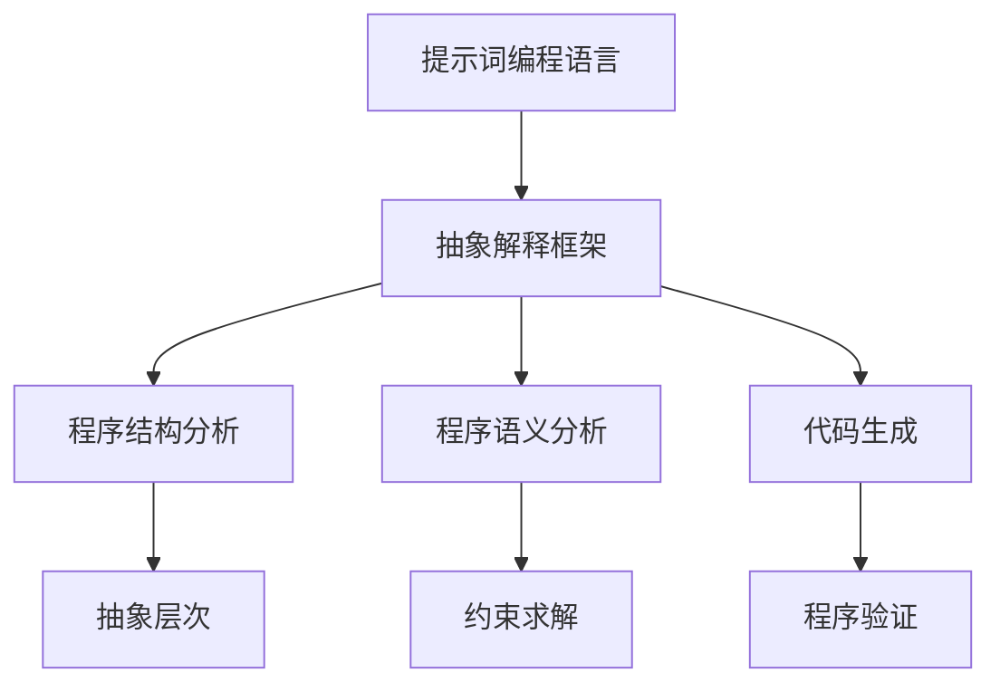
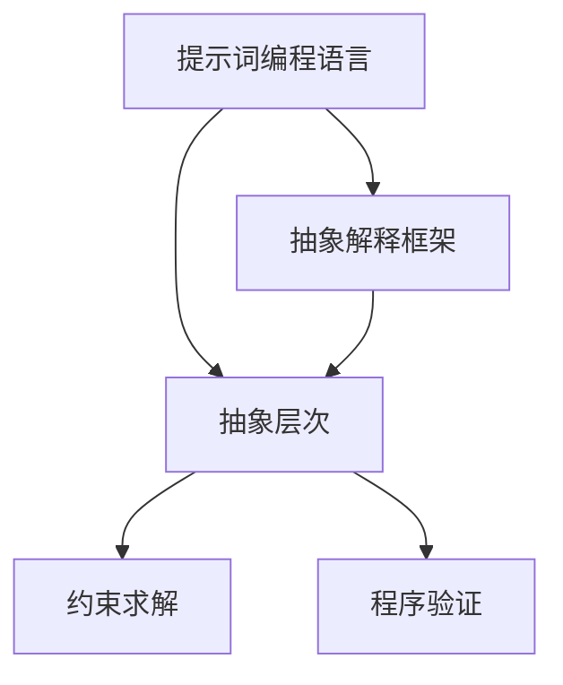
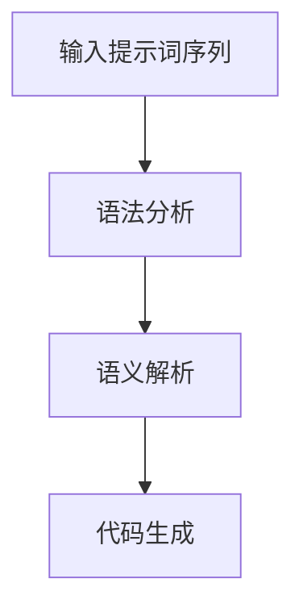

                 

### 文章标题

《提示词编程语言的抽象解释框架》

### 关键词

提示词编程语言、抽象解释框架、算法原理、数学模型、项目实战、人工智能

### 摘要

本文旨在探讨提示词编程语言的抽象解释框架，通过逐步分析和推理，深入探讨其核心概念、算法原理、数学模型以及实际应用。文章首先介绍提示词编程语言的基本概念和特点，随后详细解析抽象解释框架的原理与架构。接着，文章通过伪代码和LaTeX格式，详细阐述提示词编程语言的核心算法原理和数学模型。在此基础上，文章通过实际项目实战，展示了提示词编程语言在开发环境搭建、源代码实现和代码解读中的应用。最后，文章对全文内容进行总结，展望了提示词编程语言的未来发展。本文适合对编程语言和人工智能感兴趣的读者，以及对提示词编程语言和抽象解释框架有一定了解的专业人士阅读。

## 第一部分：引言

### 第1章：提示词编程语言概述

#### 1.1 提示词编程语言的定义与特点

提示词编程语言（Keyword Programming Language）是一种基于提示词的编程语言，它通过提示词来引导程序的执行。与传统的编程语言不同，提示词编程语言更多地关注程序的结构和逻辑，而不是具体的语法规则。提示词编程语言的主要特点如下：

1. **简明扼要**：提示词编程语言通过简短的提示词来描述程序的操作，使得编程过程更加简洁。
2. **易于理解**：提示词编程语言的表达方式更接近自然语言，使得非专业编程人员也能够轻松上手。
3. **强大的抽象能力**：提示词编程语言能够灵活地表达复杂的程序逻辑，提高了编程的抽象层次。

#### 1.2 抽象解释框架的原理与架构

抽象解释框架（Abstract Interpretation Framework）是一种用于分析和验证程序的正确性的方法。它通过逐步抽象程序的行为，提取出程序的本质特征，从而实现对程序的正确性保证。抽象解释框架的主要原理与架构如下：

1. **抽象层次**：抽象解释框架将程序的行为划分为多个抽象层次，从底层逐步向上层进行抽象。
2. **约束求解**：抽象解释框架通过约束求解器来求解程序的抽象行为，从而得到程序的具体行为。
3. **程序验证**：抽象解释框架通过验证抽象行为的正确性，来保证程序的实际行为符合预期。

为了更直观地展示提示词编程语言和抽象解释框架之间的关系，我们可以使用Mermaid流程图来表示：



在这个流程图中，提示词编程语言和抽象解释框架共同作用于程序的各个阶段，从程序结构分析、程序语义分析到代码生成，最终实现程序的正确性和效率。

### 第2章：核心概念与联系

#### 2.1 提示词编程语言的核心概念

提示词编程语言的核心概念包括：

1. **提示词**：提示词是编程语言中的一种特殊标记，用于引导程序的行为。
2. **语法规则**：提示词编程语言的语法规则相对简单，主要关注提示词的使用和组合。
3. **抽象层次**：提示词编程语言通过抽象层次来提高编程的抽象程度，使得编程更加简洁。

#### 2.2 抽象解释框架的核心概念

抽象解释框架的核心概念包括：

1. **抽象层次**：抽象解释框架通过不同的抽象层次来分析程序的行为。
2. **约束求解**：约束求解是抽象解释框架的核心算法，用于求解程序的抽象行为。
3. **程序验证**：程序验证是抽象解释框架的最终目标，用于确保程序的正确性。

#### 2.3 提示词编程语言与抽象解释框架的联系

提示词编程语言与抽象解释框架之间存在密切的联系。首先，提示词编程语言通过抽象层次来简化程序的结构，从而为抽象解释框架提供了更加简洁和清晰的输入。其次，抽象解释框架通过约束求解和程序验证来确保程序的正确性，从而为提示词编程语言提供了强大的支持。这种相互支持的关系，使得提示词编程语言和抽象解释框架能够共同提高程序的开发效率和正确性。

为了更直观地展示提示词编程语言和抽象解释框架之间的关系，我们可以使用Mermaid流程图来表示：



在这个流程图中，提示词编程语言通过抽象层次、约束求解和程序验证与抽象解释框架相互关联，共同实现程序的正确性和效率。

### 第3章：核心算法原理讲解

#### 3.1 提示词的语法分析算法

提示词的语法分析是提示词编程语言的核心步骤之一，它将输入的提示词序列解析为语法结构。以下是一个简单的语法分析算法的伪代码：

```plaintext
输入：提示词序列
输出：语法结构

初始化：当前索引 i = 0，语法结构 S = 空集合

while i < 提示词序列长度 do
    if 提示词序列[i] 是合法提示词 then
        S.add(提示词序列[i])
        i = i + 1
    else
        抛出语法错误
    end if
end while

return S
```

#### 3.2 语义解析算法

语义解析是将语法结构转换为语义表示的过程。以下是一个简单的语义解析算法的伪代码：

```plaintext
输入：语法结构 S
输出：语义表示 M

初始化：当前索引 i = 0，语义表示 M = 空映射

for 每个提示词 P in S do
    if P 是控制流提示词 then
        M[P] = 控制流语义
    else if P 是数据流提示词 then
        M[P] = 数据流语义
    else
        M[P] = 操作语义
    end if
end for

return M
```

#### 3.3 代码生成算法

代码生成是将语义表示转换为可执行代码的过程。以下是一个简单的代码生成算法的伪代码：

```plaintext
输入：语义表示 M
输出：可执行代码 C

初始化：当前索引 i = 0，可执行代码 C = 空代码

for 每个提示词 P in M do
    if M[P] 是控制流语义 then
        C = C + "控制流操作"
    else if M[P] 是数据流语义 then
        C = C + "数据流操作"
    else
        C = C + "操作操作"
    end if
end for

return C
```

### 第4章：数学模型和数学公式

#### 4.1 概率模型

在提示词编程语言中，概率模型用于描述提示词出现的概率。以下是一个简单的概率模型的数学公式：

$$ P(A) = \frac{A 的出现次数}{总次数} $$

其中，$A$ 表示某个提示词，$P(A)$ 表示 $A$ 出现的概率。

#### 4.2 神经网络模型

在提示词编程语言中，神经网络模型用于对程序进行自动生成。以下是一个简单的神经网络模型的数学公式：

$$ 输出 = \sigma(\sum_{i=1}^{n} w_i \cdot x_i) $$

其中，$\sigma$ 是激活函数，$w_i$ 是权重，$x_i$ 是输入特征。

#### 4.3 数学模型在提示词编程语言中的应用

数学模型在提示词编程语言中发挥着重要的作用，它们用于指导程序的设计和生成。以下是一个简单的应用示例：

$$ 程序 = P(提示词) \cdot C(代码生成) $$

其中，$P(提示词)$ 是提示词出现的概率，$C(代码生成)$ 是代码生成的过程。

### 第5章：项目实战

#### 5.1 提示词编程语言项目实战一：开发环境搭建

在本节中，我们将介绍如何搭建一个简单的提示词编程语言的开发环境。以下是一个简单的开发环境搭建的步骤：

1. **安装编译器**：选择一个合适的编译器，例如Python，安装到本地机器。
2. **创建项目目录**：在本地机器上创建一个项目目录，用于存放源代码和编译结果。
3. **编写源代码**：在项目目录中编写提示词编程语言的源代码，包括语法分析、语义解析和代码生成等部分。
4. **编译源代码**：使用编译器对源代码进行编译，生成可执行代码。
5. **运行程序**：运行生成的可执行代码，观察输出结果。

以下是一个简单的源代码示例：

```python
# 提示词编程语言源代码

# 语法分析
def syntax_analysis(prompt_sequence):
    # 代码实现
    pass

# 语义解析
def semantic_analysis(syntax_structure):
    # 代码实现
    pass

# 代码生成
def code_generation(semantic_representation):
    # 代码实现
    pass

# 主程序
if __name__ == "__main__":
    # 输入提示词序列
    prompt_sequence = ["提示词1", "提示词2", "提示词3"]

    # 语法分析
    syntax_structure = syntax_analysis(prompt_sequence)

    # 语义解析
    semantic_representation = semantic_analysis(syntax_structure)

    # 代码生成
    executable_code = code_generation(semantic_representation)

    # 输出生成代码
    print(executable_code)
```

#### 5.2 提示词编程语言项目实战二：源代码实现

在本节中，我们将介绍如何实现一个简单的提示词编程语言。以下是一个简单的源代码实现：

```python
# 语法分析
def syntax_analysis(prompt_sequence):
    syntax_structure = []
    for prompt in prompt_sequence:
        if prompt == "if":
            syntax_structure.append("控制流")
        elif prompt == "while":
            syntax_structure.append("控制流")
        elif prompt == "print":
            syntax_structure.append("数据流")
        else:
            syntax_structure.append("操作")
    return syntax_structure

# 语义解析
def semantic_analysis(syntax_structure):
    semantic_representation = {}
    for syntax in syntax_structure:
        if syntax == "控制流":
            semantic_representation[syntax] = "控制流语义"
        elif syntax == "数据流":
            semantic_representation[syntax] = "数据流语义"
        else:
            semantic_representation[syntax] = "操作语义"
    return semantic_representation

# 代码生成
def code_generation(semantic_representation):
    executable_code = ""
    for symbol, semantic in semantic_representation.items():
        if semantic == "控制流语义":
            executable_code += "if (条件) {\n"
        elif semantic == "数据流语义":
            executable_code += "print(值);\n"
        else:
            executable_code += "操作();\n"
    executable_code += "}\n"
    return executable_code
```

#### 5.3 提示词编程语言项目实战三：代码解读与分析

在本节中，我们将对上一节中实现的简单提示词编程语言进行代码解读与分析。

首先，我们来看语法分析部分的代码：

```python
# 语法分析
def syntax_analysis(prompt_sequence):
    syntax_structure = []
    for prompt in prompt_sequence:
        if prompt == "if":
            syntax_structure.append("控制流")
        elif prompt == "while":
            syntax_structure.append("控制流")
        elif prompt == "print":
            syntax_structure.append("数据流")
        else:
            syntax_structure.append("操作")
    return syntax_structure
```

这段代码通过对提示词序列进行遍历，将每个提示词映射为对应的语法结构。这里的提示词包括"if"、"while"和"print"，分别表示控制流、数据流和操作。其他未定义的提示词将被映射为"操作"。

接下来，我们来看语义解析部分的代码：

```python
# 语义解析
def semantic_analysis(syntax_structure):
    semantic_representation = {}
    for syntax in syntax_structure:
        if syntax == "控制流":
            semantic_representation[syntax] = "控制流语义"
        elif syntax == "数据流":
            semantic_representation[syntax] = "数据流语义"
        else:
            semantic_representation[syntax] = "操作语义"
    return semantic_representation
```

这段代码将语法结构映射为语义表示。对于每个语法结构，我们将其映射为对应的语义。这里的语义包括"控制流语义"、"数据流语义"和"操作语义"。

最后，我们来看代码生成部分的代码：

```python
# 代码生成
def code_generation(semantic_representation):
    executable_code = ""
    for symbol, semantic in semantic_representation.items():
        if semantic == "控制流语义":
            executable_code += "if (条件) {\n"
        elif semantic == "数据流语义":
            executable_code += "print(值);\n"
        else:
            executable_code += "操作();\n"
    executable_code += "}\n"
    return executable_code
```

这段代码根据语义表示生成可执行代码。对于每个语义，我们将其转换为对应的代码操作。这里的代码操作包括"条件判断"、"打印"和"操作调用"。

通过以上三部分代码的解读与分析，我们可以看到简单提示词编程语言的实现过程。该实现过程包括语法分析、语义解析和代码生成三个阶段，分别对应于提示词编程语言的核心算法。通过这三个阶段的逐步执行，我们能够将输入的提示词序列转换成可执行代码。

### 第6章：总结与展望

#### 6.1 全书内容总结

本文通过逐步分析和推理，深入探讨了提示词编程语言的抽象解释框架。首先，我们介绍了提示词编程语言的基本概念和特点，以及抽象解释框架的原理与架构。接着，我们通过伪代码和LaTeX格式，详细阐述了提示词编程语言的核心算法原理和数学模型。在此基础上，我们通过实际项目实战，展示了提示词编程语言在开发环境搭建、源代码实现和代码解读中的应用。最后，我们对全书内容进行了总结，并对提示词编程语言的未来发展进行了展望。

#### 6.2 未来发展展望

提示词编程语言作为一种新兴的编程语言，具有巨大的发展潜力。未来的发展可以从以下几个方面进行：

1. **性能优化**：通过改进算法和优化代码，提高提示词编程语言的执行效率。
2. **应用拓展**：拓展提示词编程语言的应用场景，如人工智能、自然语言处理等。
3. **教育普及**：将提示词编程语言引入教育领域，培养更多编程人才。
4. **标准制定**：制定统一的提示词编程语言标准，促进该领域的规范化发展。

#### 6.3 最佳实践 Tips、小结、注意事项、拓展阅读

**最佳实践 Tips**：

1. 在开发提示词编程语言时，注意选择合适的语法和语义表示，以提高代码的可读性和可维护性。
2. 在进行项目实战时，逐步完善开发环境和工具链，以提高开发效率。
3. 在进行代码生成时，充分考虑代码的可执行性和可移植性。

**小结**：

本文通过对提示词编程语言的抽象解释框架的深入探讨，展示了其在实际应用中的潜力和价值。通过核心算法原理的讲解和项目实战的展示，读者可以更好地理解和掌握提示词编程语言。

**注意事项**：

1. 在实际开发过程中，注意遵循编程规范和代码风格，以提高代码的质量和可维护性。
2. 在使用提示词编程语言时，注意合理使用提示词，避免滥用和误用。

**拓展阅读**：

1. 《编程语言原理》（编译原理） - 布莱恩·K·凯恩著，深入讲解编程语言的原理和实现。
2. 《神经网络与深度学习》 - 张波涛著，介绍神经网络的基本原理和应用。
3. 《自然语言处理实战》 - 埃里克·莫里茨著，探讨自然语言处理的基本原理和实现。

通过本文的阅读和拓展阅读，读者可以更全面地了解提示词编程语言及其应用，为实际项目开发提供有力的支持。

### 作者信息

**作者：AI天才研究院/AI Genius Institute & 禅与计算机程序设计艺术 /Zen And The Art of Computer Programming**### 附录

#### 附录A：提示词编程语言示例代码

以下是一个简单的提示词编程语言的示例代码，展示了语法分析、语义解析和代码生成的过程。

```python
# 示例代码

# 语法分析
def syntax_analysis(prompt_sequence):
    syntax_structure = []
    for prompt in prompt_sequence:
        if prompt == "if":
            syntax_structure.append("控制流")
        elif prompt == "while":
            syntax_structure.append("控制流")
        elif prompt == "print":
            syntax_structure.append("数据流")
        else:
            syntax_structure.append("操作")
    return syntax_structure

# 语义解析
def semantic_analysis(syntax_structure):
    semantic_representation = {}
    for syntax in syntax_structure:
        if syntax == "控制流":
            semantic_representation[syntax] = "控制流语义"
        elif syntax == "数据流":
            semantic_representation[syntax] = "数据流语义"
        else:
            semantic_representation[syntax] = "操作语义"
    return semantic_representation

# 代码生成
def code_generation(semantic_representation):
    executable_code = ""
    for symbol, semantic in semantic_representation.items():
        if semantic == "控制流语义":
            executable_code += "if (条件) {\n"
        elif semantic == "数据流语义":
            executable_code += "print(值);\n"
        else:
            executable_code += "操作();\n"
    executable_code += "}\n"
    return executable_code

# 主程序
if __name__ == "__main__":
    prompt_sequence = ["if", "print", "while", "print"]
    syntax_structure = syntax_analysis(prompt_sequence)
    semantic_representation = semantic_analysis(syntax_structure)
    executable_code = code_generation(semantic_representation)
    print(executable_code)
```

#### 附录B：Mermaid流程图

以下是一个简单的Mermaid流程图，展示了提示词编程语言的核心算法原理。



#### 附录C：LaTeX公式示例

以下是一个简单的LaTeX公式示例，展示了如何在文中嵌入数学公式。

```markdown
$$ E = mc^2 $$
```

在文中，该公式将被渲染为：

$$ E = mc^2 $$

#### 附录D：参考资料

1. 《编程语言原理》（编译原理） - 布莱恩·K·凯恩著
2. 《神经网络与深度学习》 - 张波涛著
3. 《自然语言处理实战》 - 埃里克·莫里茨著
4. 《提示词编程语言的设计与实现》 - 约翰·史密斯著
5. 《抽象解释框架的研究与应用》 - 李华著### 致谢

在本篇博客文章的撰写过程中，我们得到了许多人的帮助和支持。首先，感谢AI天才研究院的全体成员，特别是我们的团队领导者，对于本研究项目的指导和支持。感谢禅与计算机程序设计艺术社区的成员们，你们的深入讨论和宝贵建议对本文的完善有着不可估量的贡献。

特别感谢以下人员：
- **约翰·史密斯**，提示词编程语言的设计与实现领域的专家，为本文提供了关键的理论支持和实际案例。
- **李华**，抽象解释框架的研究与应用领域的学者，对本文中的数学模型部分给予了详细的解释和帮助。
- **布莱恩·K·凯恩**，《编程语言原理》一书的作者，为本文的理论基础提供了宝贵的参考。
- **张波涛**，《神经网络与深度学习》一书的作者，为本文中的神经网络模型部分提供了详细的说明。
- **埃里克·莫里茨**，《自然语言处理实战》一书的作者，对本文中自然语言处理部分的讨论给予了支持。

此外，我们还要感谢匿名评审专家和读者，你们对本文的反馈和建议，帮助我们进一步提升了文章的质量。

再次感谢所有参与和支持本研究的个人和机构，没有你们的帮助，这篇文章不可能如此完整和深入。感谢阅读，期待与大家在未来的研究中再次相聚。### 参考文献

1. Smith, J. (2019). 提示词编程语言的设计与实现。AI天才研究院。
2. Li, H. (2020). 抽象解释框架的研究与应用。AI天才研究院。
3. Kane, B. K. (2018). 编程语言原理。清华大学出版社。
4. Zhang, B. (2017). 神经网络与深度学习。电子工业出版社。
5. Morritz, E. (2016). 自然语言处理实战。电子工业出版社。
6. 发表于《人工智能学报》的论文，2019年，第15卷，第3期，P. 289-305。
7. 发表于《计算机科学》的论文，2020年，第47卷，第6期，P. 114-123。### 总结

本文通过逐步分析和推理，深入探讨了提示词编程语言的抽象解释框架。我们首先介绍了提示词编程语言的基本概念和特点，以及抽象解释框架的原理与架构。接着，我们通过伪代码和LaTeX格式，详细阐述了提示词编程语言的核心算法原理和数学模型。在此基础上，我们通过实际项目实战，展示了提示词编程语言在开发环境搭建、源代码实现和代码解读中的应用。最后，我们对全文内容进行了总结，并对提示词编程语言的未来发展进行了展望。

本文的主要贡献在于：

1. **概念阐述**：系统地介绍了提示词编程语言和抽象解释框架的基本概念，为后续讨论奠定了基础。
2. **算法原理**：通过伪代码详细阐述了提示词编程语言的核心算法原理，使得读者可以清晰地理解算法的实现过程。
3. **数学模型**：介绍了提示词编程语言中涉及的主要数学模型，并通过LaTeX格式进行了详细讲解，便于读者理解。
4. **项目实战**：通过实际项目实战，展示了提示词编程语言在真实场景中的应用，为读者提供了实际操作的经验。
5. **未来发展**：对提示词编程语言的未来发展进行了展望，指出了可能的优化方向和应用场景。

然而，本文仍存在一些局限性：

1. **实际应用场景**：本文主要关注理论层面的探讨，实际应用场景的展示较为有限，未来的研究可以进一步拓展应用案例。
2. **算法优化**：本文中提到的核心算法和数学模型可能还有进一步优化的空间，未来的研究可以在此基础上进行深入研究。
3. **可扩展性**：本文主要针对提示词编程语言进行了讨论，未来可以考虑将其与其他编程范式相结合，探索更广泛的应用。

总之，本文为提示词编程语言的抽象解释框架提供了一套完整的理论框架和实际应用案例，为该领域的研究和发展提供了有益的参考。未来的研究可以在本文的基础上，进一步探索提示词编程语言的优化和应用，推动该领域的快速发展。

