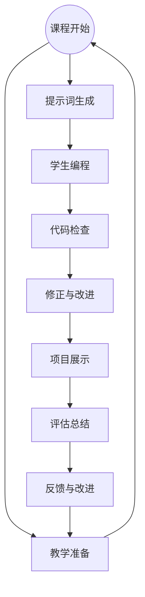

                 

### 文章标题

《提示词编程语言的教学方法创新》

### 文章关键词

提示词编程语言，教学方法，创新，教育技术，计算机科学

### 文章摘要

本文深入探讨了提示词编程语言的教学方法创新，分析了其核心概念、基本架构及教学流程。通过提出互动式、项目驱动、情境教学和合作学习等策略，文章旨在提供一套完整的教学方案，提高编程教育效果。同时，通过教学评估和案例分析，验证了提示词编程语言教学方法的可行性和优越性。最后，文章预测了该领域未来的发展趋势，为教育技术的研究与应用提供了新的思路。

### 目录

## 第1章 引言与背景

### 1.1 编程语言与教学方法概述

#### 编程语言的发展历程

编程语言是计算机与人类沟通的桥梁，其发展历程可以追溯到20世纪40年代。从最初的机器语言、汇编语言，到高级语言如C、Java、Python等，编程语言经历了从低级到高级、从复杂到简单的演变过程。现代编程语言不仅具备了丰富的语法和强大的功能，还关注易用性和可读性，使得编程变得更加高效和便捷。

#### 教学方法的演变

教学方法同样经历了长期的演变。传统的教学方法以教师为中心，注重知识传授和考试成绩。然而，随着教育理念的更新和技术的进步，以学生为中心的教学方法逐渐受到重视。这些方法包括互动式教学、项目驱动教学、情境教学和合作学习等，强调学生的主动参与和实践能力。

### 1.2 提示词编程语言的概念

提示词编程语言是一种结合了提示词技术和编程语言的新型教育工具。它通过为编程任务提供提示词，引导学生进行编程练习，从而提高学习效果和编程能力。提示词通常是一段简短的文本，包含了编程任务的关键信息和操作指导。

### 1.3 提示词编程语言的教学现状与问题

目前，提示词编程语言在教学中的应用还处于初级阶段。一些学校和教育机构已经开始尝试使用这一工具，但大多数仍然停留在简单的尝试和探索阶段。现有研究主要关注提示词编程语言的设计和实现，对其教学方法和应用效果的研究相对较少。

#### 教学效果评估

评估提示词编程语言的教学效果是关键问题之一。目前，大多数评估方法依赖于学生成绩和反馈，缺乏科学的评估指标和标准。此外，提示词编程语言的个性化学习特点也使得传统评估方法难以全面反映教学效果。

#### 教学资源的不足

提示词编程语言的教学资源相对匮乏。现有的教学工具和教材大多不够完善，难以满足不同层次学生的需求。此外，教师对提示词编程语言的掌握和应用能力也有待提高。

#### 技术瓶颈

提示词编程语言的技术实现仍存在一些瓶颈。例如，如何有效地生成提示词，如何处理复杂的编程任务，以及如何保证教学系统的稳定性和安全性等。

### 1.4 研究目的与意义

本文旨在探讨提示词编程语言的教学方法创新，提出一套完整的教学方案，以解决现有问题，提高编程教育质量。具体研究内容包括：

1. 分析提示词编程语言的核心概念和基本架构。
2. 设计互动式、项目驱动、情境教学和合作学习等教学策略。
3. 建立教学评估体系，制定科学的评估指标。
4. 开展教学实验，验证教学方法的可行性和有效性。

本研究对于提高编程教育质量、推动教育技术发展具有重要意义。

-----------------------------------------------------------------

## 第2章 提示词编程语言核心概念

### 2.1 提示词的定义与作用

提示词（Prompt）是指用于引导和提示用户进行特定任务的一段文本或指令。在提示词编程语言中，提示词通常包含编程任务的关键信息、操作步骤和参考代码等，用于指导学生完成编程练习。

#### 定义

提示词是对特定问题或任务提供的一种简明扼要的描述，通常包含以下内容：

1. **问题描述**：明确任务的目标和背景。
2. **操作步骤**：列出完成任务的步骤和方法。
3. **参考代码**：提供实现任务的示例代码或关键代码片段。

#### 作用

提示词在提示词编程语言中起着至关重要的作用，其作用主要体现在以下几个方面：

1. **引导学习**：提示词为学生提供明确的任务目标，帮助他们快速理解任务要求，减少迷茫和困惑。
2. **辅助编程**：通过提示词，学生可以参考示例代码或关键代码片段，更快地编写出正确的代码。
3. **提高效率**：提示词简化了编程任务，使学生能够专注于编程的核心问题，提高编程效率。
4. **培养思维能力**：提示词不仅提供直接的帮助，还促使学生思考如何解决问题，培养他们的逻辑思维和创新能力。

### 2.2 提示词编程语言的基本架构

提示词编程语言的基本架构包括以下几个主要部分：

#### 1. 提示词生成模块

提示词生成模块是提示词编程语言的核心组成部分。它的主要功能是根据输入的编程任务，自动生成相应的提示词。生成提示词的过程通常涉及以下几个步骤：

1. **任务分析**：对输入的编程任务进行语义分析和结构化处理，提取任务的关键信息。
2. **模板匹配**：根据提取的关键信息，从预定义的提示词模板中选择合适的模板。
3. **提示词构建**：将选定的模板与关键信息结合，生成完整的提示词。

#### 2. 编程任务模块

编程任务模块负责接收学生输入的编程任务，并调用提示词生成模块生成相应的提示词。其主要功能包括：

1. **任务接收**：接收学生提交的编程任务。
2. **提示词生成**：调用提示词生成模块，生成提示词。
3. **任务展示**：将生成的提示词展示给学生，供其参考。

#### 3. 编程练习模块

编程练习模块是学生进行编程练习的核心部分。它接收学生的代码输入，并对其进行检查和评估。其主要功能包括：

1. **代码输入**：接收学生编写的代码。
2. **代码检查**：对代码进行语法检查和语义分析，判断代码的正确性和完整性。
3. **评估反馈**：根据代码检查结果，给出评估反馈，包括错误提示、正确代码片段等。

#### 4. 评估模块

评估模块负责对学生的学习效果进行评估。它根据学生的代码输入和练习结果，计算评估分数，并提供详细的评估报告。其主要功能包括：

1. **评估标准**：制定评估标准和指标。
2. **评估计算**：根据评估标准和学生的代码输入，计算评估分数。
3. **报告生成**：生成评估报告，包括评估分数、错误原因、改进建议等。

### 2.3 提示词编程语言的分类

根据提示词的形式和生成方式，提示词编程语言可以分为以下几类：

#### 1. 文本型提示词编程语言

文本型提示词编程语言使用文本形式的提示词，通常包括自然语言描述和代码片段。这类语言易于理解和使用，适合初学者和中等水平的学生。

#### 2. 图形型提示词编程语言

图形型提示词编程语言使用图形或符号形式的提示词，通过直观的视觉方式引导学生进行编程。这类语言适合具有图形处理能力的学生，尤其适用于编程可视化教学。

#### 3. 声音型提示词编程语言

声音型提示词编程语言使用声音或语音形式的提示词，通过语音提示引导学生进行编程。这类语言适合听觉学习者，尤其适用于聋哑人编程教育。

#### 4. 多媒体型提示词编程语言

多媒体型提示词编程语言结合文本、图形和声音等多种形式，提供丰富多样的提示词，以满足不同类型学生的学习需求。

### 2.4 提示词编程语言的特点与应用

#### 1. 特点

提示词编程语言具有以下几个显著特点：

1. **直观性**：通过文本、图形、声音等多种形式，直观地展示编程任务和操作步骤，帮助学生快速理解。
2. **互动性**：学生可以通过与提示词的互动，进行编程练习和评估，提高学习效果。
3. **个性化**：提示词可以根据学生的水平和需求进行定制，满足个性化学习需求。
4. **可扩展性**：提示词编程语言可以方便地扩展新的功能和模块，适应不同课程和教学场景。

#### 2. 应用

提示词编程语言可以应用于多个教学场景和课程，包括：

1. **基础教育**：小学和初中编程课程，帮助学生建立编程基础。
2. **高等教育**：计算机科学专业课程，提高学生的编程能力和实践能力。
3. **职业培训**：针对特定行业和岗位的编程培训，提升从业人员的技能水平。
4. **在线教育**：通过互联网平台，提供在线编程课程和练习，满足远程学习的需求。

### 2.5 提示词编程语言的发展现状与趋势

#### 1. 发展现状

提示词编程语言的研究和应用正在逐步展开，已经有一些教育机构和开发者开始探索这一领域。现有的提示词编程语言工具主要包括：

1. **Scratch**：一种面向儿童的图形化编程语言，使用提示词引导学生进行编程。
2. **Code.org**：提供在线编程课程和练习，使用文本型提示词辅助教学。
3. **Alice**：一种面向初中和高中学生的三维编程语言，使用图形化提示词进行教学。

#### 2. 发展趋势

随着教育技术的不断进步，提示词编程语言的发展趋势将包括：

1. **智能化**：通过人工智能技术，实现更智能的提示词生成和评估。
2. **个性化**：结合大数据分析和个性化学习技术，提供更加个性化的学习体验。
3. **多样性**：开发更多形式的提示词编程语言，满足不同类型的学习需求。
4. **整合化**：与其他教育技术整合，提供一站式编程教育解决方案。

### 2.6 提示词编程语言在教育中的优势与挑战

#### 1. 优势

提示词编程语言在教育中具有以下优势：

1. **提高学习效果**：通过直观、互动的提示词，帮助学生更好地理解和掌握编程知识。
2. **培养编程思维**：提示词引导学生进行编程实践，培养他们的逻辑思维和问题解决能力。
3. **个性化学习**：提示词可以根据学生的水平和需求进行定制，满足个性化学习需求。
4. **促进跨学科学习**：提示词编程语言可以与其他学科结合，促进跨学科学习和创新。

#### 2. 挑战

提示词编程语言在教育中面临的挑战包括：

1. **技术实现**：提示词生成和评估的智能化、个性化实现仍需进一步研究。
2. **教学资源**：现有的提示词编程语言教学资源和教材相对匮乏，需要更多高质量的资源。
3. **教师培训**：教师需要具备一定的技术能力和教学素养，以有效应用提示词编程语言。
4. **评估体系**：建立科学、全面的评估体系，以全面反映学生的学习效果。

### 2.7 提示词编程语言教学实践案例分析

为了更好地了解提示词编程语言的教学效果，以下是对几个教学实践案例的分析：

#### 1. 案例一：小学编程课程

某小学在编程课程中引入了提示词编程语言，通过图形化提示词引导学生进行编程。教学结果显示，学生编程兴趣显著提高，编程能力得到有效提升。

#### 2. 案例二：高中编程课程

某高中在计算机科学课程中使用了提示词编程语言，通过文本型提示词帮助学生理解和掌握编程概念。教学评估表明，学生的编程成绩明显提高，对编程的兴趣和热情也得到增强。

#### 3. 案例三：职业培训课程

某职业培训机构在编程培训课程中采用了提示词编程语言，通过个性化提示词和在线练习，帮助学员快速掌握编程技能。培训效果评估显示，学员对培训内容和教学方式的满意度较高，编程技能水平显著提升。

通过以上案例分析，可以看出提示词编程语言在教学中的优势和潜力。未来，随着技术的不断进步和应用的深入，提示词编程语言将在编程教育中发挥更加重要的作用。

-------------------------------------------------------------------

## 第3章 提示词编程语言教学流程

### 3.1 教学流程设计原则

提示词编程语言的教学流程设计应遵循以下原则：

#### 1. **目标明确**

教学流程应明确教学目标，确保学生能够掌握编程知识和技能。目标应具体、可测量，并与课程大纲和教学要求保持一致。

#### 2. **循序渐进**

教学流程应遵循由浅入深、循序渐进的原则，从基础知识到高级技能逐步引导，帮助学生逐步建立编程能力。

#### 3. **互动性**

教学流程应注重师生互动和学生间的互动，鼓励学生提问、讨论和合作，提高学习积极性和参与度。

#### 4. **个性化**

教学流程应考虑学生的个体差异，提供个性化的学习资源和指导，满足不同学生的学习需求和进度。

#### 5. **实践性**

教学流程应强调实践性，通过编程任务和项目实践，让学生将理论知识应用于实际问题的解决中，提高实际编程能力。

### 3.2 教学流程步骤详解

提示词编程语言的教学流程通常包括以下几个步骤：

#### 1. **任务引入**

在课程开始时，教师通过介绍和示例引导学生了解编程任务的目标和要求。这一步骤的关键是激发学生的学习兴趣，明确任务的重要性和意义。

#### 2. **提示词生成**

教师使用提示词生成模块，根据编程任务生成相应的提示词。提示词应包含关键信息、操作步骤和参考代码，帮助学生理解任务并开始编程。

#### 3. **学生编程**

学生在教师的指导下，根据提示词进行编程实践。教师在此过程中提供必要的支持和帮助，解答学生的疑问。

#### 4. **代码检查**

教师使用编程练习模块检查学生的代码，提供评估反馈。反馈应具体、详尽，指出错误和不足，并给出改进建议。

#### 5. **修正与改进**

学生在收到反馈后，根据教师的建议对代码进行修正和改进。这一步骤有助于学生巩固知识，提高编程能力。

#### 6. **项目展示**

学生完成编程任务后，进行项目展示和分享。教师和学生共同讨论项目中的亮点和问题，促进学生之间的交流和合作。

#### 7. **评估总结**

教师对学生的学习成果进行评估，计算评估分数，并提供详细的评估报告。评估报告应包括学生的编程水平、学习能力和发展方向。

### 3.3 教学流程中的关键点

#### 1. **提示词的质量**

提示词的质量直接影响学生的学习效果。高质量的提示词应清晰、简明、具有针对性，能够有效指导学生完成编程任务。

#### 2. **教师的指导作用**

教师在教学流程中扮演关键角色，应具备丰富的编程知识和教学经验，能够及时解答学生的疑问，引导学生正确理解和应用编程知识。

#### 3. **互动与反馈**

师生互动和及时的反馈是教学流程中的重要环节。教师应鼓励学生提问和讨论，及时给予反馈，帮助学生解决编程中的问题。

#### 4. **个性化指导**

教师应根据学生的个体差异，提供个性化的指导和支持。对于学习进度较慢的学生，可以提供更多的练习和辅导；对于学习进度较快的学生，可以给予更具挑战性的任务。

#### 5. **项目实践**

项目实践是巩固编程知识和技能的重要途径。教师应设计具有实际应用价值的项目，让学生在实际问题中应用所学知识，提高编程能力。

### 3.4 提示词编程语言教学案例

#### 1. 案例一：基础编程课程

在基础编程课程中，教师使用提示词编程语言引导学生完成简单的编程任务，如编写计算器程序、绘制图形等。通过提示词的引导，学生能够较快地理解任务并编写出正确的代码。

#### 2. 案例二：高级编程课程

在高级编程课程中，教师使用提示词编程语言引导学生完成复杂的项目，如开发简单的Web应用、实现算法等。通过提示词的引导，学生能够逐步掌握高级编程技能，提高项目开发能力。

#### 3. 案例三：跨学科编程课程

在跨学科编程课程中，教师将编程与数学、物理、生物等学科相结合，使用提示词编程语言引导学生完成跨学科项目。例如，在生物课程中，学生可以编写程序模拟生物进化过程；在物理课程中，学生可以编写程序模拟物理实验。

通过这些案例，可以看出提示词编程语言在教学中的广泛应用和巨大潜力。未来，随着技术的不断进步，提示词编程语言将在更多领域发挥重要作用。

------------------------------------------------------------------

## 第4章 提示词编程语言教学策略

### 4.1 互动式教学策略

互动式教学策略是提示词编程语言教学中的一种关键方法，旨在通过增加学生与教师、同学之间的互动，提高学习效果和参与度。以下是一些互动式教学策略的详细解释：

#### 1. **小组讨论**

小组讨论是一种有效的互动式教学策略，它允许学生分组讨论编程任务和问题。教师可以设定讨论主题，例如“如何优化代码？”或“如何解决特定的编程难题？”通过小组讨论，学生可以分享自己的想法和解决方案，从而加深对编程概念的理解。

#### 2. **在线问答**

利用在线问答平台，学生可以在课堂外提出问题，教师和其他学生可以实时回答。这种策略不仅帮助学生解决编程中的疑难问题，还促进了学生之间的互动和学习。

#### 3. **实时互动课堂**

实时互动课堂结合了在线视频会议工具和编程环境，使教师能够实时演示编程技巧和解决学生的问题。学生可以通过视频会议提问，教师可以直接在屏幕上展示代码和解决方案。

#### 4. **角色扮演**

在角色扮演活动中，学生可以扮演不同的角色，如“问题解决者”、“代码审阅者”或“项目管理者”。这种活动鼓励学生积极参与，从不同角度理解编程任务。

#### 5. **实时反馈**

教师应提供实时反馈，以便学生能够立即了解他们的工作情况。这种反馈可以通过口头解释、即时评分或在线评估工具来实现，有助于学生及时调整学习策略。

### 4.2 项目驱动教学策略

项目驱动教学策略是一种以项目为核心的教学方法，通过完成实际项目来培养学生的编程能力和解决问题的能力。以下是一些项目驱动教学策略的详细解释：

#### 1. **项目设计**

项目设计是项目驱动教学策略的核心。教师应根据课程目标和学生的能力水平，设计具有挑战性和实际应用价值的项目。项目应涵盖编程的各个方面，从基础到高级技能。

#### 2. **项目分解**

将大项目分解成小任务，使学生能够逐步完成。每个小任务应明确目标、步骤和评估标准，以便学生可以清晰地了解任务要求。

#### 3. **项目反馈**

在项目完成后，教师应提供详细的反馈，包括对项目的整体评价、对具体部分的改进建议等。这种反馈有助于学生理解项目要求，提高项目质量。

#### 4. **项目展示**

鼓励学生展示他们的项目，并接受同学和教师的评价。项目展示不仅增强了学生的自信心，还促进了学生之间的交流和合作。

#### 5. **项目评估**

项目评估应基于项目的完成情况、代码质量、创新性和团队合作等因素。评估结果应用于指导学生未来的学习和项目开发。

### 4.3 情境教学策略

情境教学策略是一种将编程学习置于真实情境中的教学方法，通过解决实际问题的过程来培养学生的编程技能。以下是一些情境教学策略的详细解释：

#### 1. **案例研究**

使用案例研究，将编程问题置于实际情境中。例如，模拟一个在线商店的后台系统，让学生编写代码以实现库存管理、订单处理等功能。

#### 2. **模拟环境**

创建模拟环境，如模拟城市交通管理系统，让学生编写代码来控制交通信号灯、处理交通事故等。这种环境有助于学生将编程知识应用于实际问题的解决。

#### 3. **情境游戏**

开发情境游戏，让学生在游戏中编写代码以解决游戏中的问题。这种游戏化学习方式能够提高学生的兴趣和参与度。

#### 4. **问题解决**

教师可以设计一系列实际问题，让学生通过编程来解决问题。这种方法有助于学生理解编程的实用性和必要性。

#### 5. **情境反馈**

在情境教学过程中，教师应提供及时的反馈，帮助学生理解问题的本质，并提供解决问题的策略。

### 4.4 合作学习策略

合作学习策略强调学生之间的协作和合作，通过共同完成任务来提高学习效果。以下是一些合作学习策略的详细解释：

#### 1. **分组合作**

将学生分成小组，每个小组共同完成一个项目。小组成员可以分担任务，互相学习和帮助。

#### 2. **角色分工**

在小组合作中，为每个成员分配不同的角色，如“项目经理”、“代码编写者”、“测试员”等。这种角色分工有助于培养学生的团队合作能力和责任感。

#### 3. **共同决策**

在项目开发过程中，小组成员应共同讨论和决策，确保项目目标的实现和团队合作的顺利进行。

#### 4. **互助学习**

鼓励小组成员互相帮助，共同解决编程问题。这种互助学习不仅提高了学习效果，还增强了团队合作精神。

#### 5. **评估与反馈**

对小组合作过程和结果进行评估和反馈，帮助小组成员了解自己的优势和不足，并为未来的合作提供指导。

### 4.5 教学策略的整合与应用

在实际教学中，教师应灵活整合不同的教学策略，根据学生的特点和课程目标制定合适的教学计划。例如，在基础编程课程中，可以结合互动式教学和情境教学，通过小组讨论和案例研究来提高学生的学习兴趣和参与度。在高级编程课程中，可以采用项目驱动和合作学习策略，通过实际项目开发来提高学生的编程能力和团队合作能力。

总之，提示词编程语言的教学策略应注重互动性、实践性和个性化，通过多样化的教学方法和工具，为学生提供丰富的学习体验，提高编程教育质量。

-------------------------------------------------------------------

## 第5章 提示词编程语言教学评估

### 5.1 教学评估方法

提示词编程语言教学评估是确保教学效果的重要环节。科学、全面的评估方法有助于准确了解学生的学习成果，发现教学中的问题，并为后续教学提供改进建议。以下是几种常见的教学评估方法：

#### 1. **形成性评估**

形成性评估是指在教学中持续进行的评估，旨在及时反馈学生的学习情况，帮助他们改进学习策略。形成性评估的方法包括：

- **课堂观察**：教师观察学生在课堂上的表现，包括参与度、问题解答和互动情况。
- **日常作业**：通过学生提交的日常作业，评估他们的编程能力、代码质量和解决问题的能力。
- **实时反馈**：教师通过实时反馈，如口头评价、即时评分和在线评估，指导学生改进。

#### 2. **总结性评估**

总结性评估是在教学结束后对学生的学习成果进行综合评估。这种方法通常用于期末考试、项目展示和课程结束时的总结。总结性评估的方法包括：

- **笔试**：通过笔试评估学生的编程知识和理论水平。
- **项目展示**：通过学生完成的项目展示，评估他们的实际编程能力和问题解决能力。
- **在线测试**：使用在线测试平台进行编程技能的评估。

#### 3. **自评与互评**

自评和互评是一种学生主动参与评估的方法。学生可以通过自我评估，反思自己的学习过程和成果，识别自己的优势和不足。互评则通过学生之间的相互评价，促进学习交流，提高学习效果。

#### 4. **大数据分析**

利用大数据技术，对学生的学习行为、作业成绩和项目结果进行综合分析，可以更全面地了解学生的学习状况。这种方法包括：

- **学习行为分析**：分析学生在学习平台上的活动，如登录次数、练习题的完成情况等。
- **成绩分析**：统计学生的学习成绩，识别普遍存在的问题和学生的薄弱环节。
- **项目成果分析**：对学生的项目成果进行量化分析，评估其完成情况和创新性。

### 5.2 教学评估工具

评估工具的选择直接影响评估的有效性和准确性。以下是几种常用的教学评估工具：

#### 1. **在线评估平台**

在线评估平台可以用于形成性和总结性评估。这类平台通常包括以下功能：

- **自动评分**：平台可以自动评估学生的编程作业，提供即时反馈。
- **在线考试**：平台支持在线考试，可以生成随机试卷，防止作弊。
- **数据分析**：平台可以收集学生的学习数据，进行统计分析。

#### 2. **代码审查工具**

代码审查工具用于评估学生的代码质量和编程能力。这些工具通常具有以下功能：

- **静态代码分析**：工具可以分析代码的结构、语法和性能，提供改进建议。
- **动态代码分析**：工具可以运行代码，检测潜在的错误和性能问题。
- **代码比较**：工具可以比较学生的代码与其他优秀代码，帮助学生学习。

#### 3. **项目评估模板**

项目评估模板是一种标准化的评估工具，用于评估学生的项目成果。模板通常包括以下部分：

- **项目描述**：明确项目的目标和内容。
- **评估标准**：列出评估项目成果的具体标准和指标。
- **评分细则**：详细描述每个评估标准的评分细则。

#### 4. **问卷调查**

问卷调查是一种收集学生反馈和评估教学效果的常用工具。问卷可以包括以下内容：

- **学习体验**：评估学生对课程内容、教学方法和学习资源的满意度。
- **学习效果**：评估学生在课程结束后对所学知识的掌握程度。
- **改进建议**：收集学生对教学和课程改进的建议。

### 5.3 教学评估案例分析

以下是对几个提示词编程语言教学评估案例的分析：

#### 1. 案例一：在线编程课程

某在线编程课程使用在线评估平台进行教学评估。课程结束后，平台自动评估学生的作业和项目，生成详细的评估报告。评估结果显示，大部分学生能够掌握课程内容，但仍有部分学生在代码质量和项目创新性方面有待提高。

#### 2. 案例二：计算机科学专业课程

某计算机科学专业课程采用项目评估模板进行评估。学生在课程结束后，需提交一个完整的编程项目，并接受教师的评估。评估标准包括项目描述的清晰度、代码的质量、功能的实现和创新性。评估结果显示，学生在项目开发过程中，编程能力得到了显著提升。

#### 3. 案例三：编程夏令营

某编程夏令营使用问卷调查收集学生的反馈。问卷结果显示，学生对课程内容和教学方法的满意度较高，但也有部分学生希望增加实践环节，提高实际编程能力。

通过这些案例分析，可以看出提示词编程语言教学评估的方法和工具在实际教学中的应用效果。未来，随着评估方法的不断完善和评估工具的升级，教学评估将更加科学、全面，有助于进一步提高编程教育质量。

------------------------------------------------------------------

## 第6章 提示词编程语言教学案例

### 6.1 案例一：基础编程课程中的应用

#### 项目背景

在基础编程课程中，学生通常需要掌握编程语言的基本语法和编程逻辑。为了提高学生的学习效果，某教育机构决定使用提示词编程语言进行教学。

#### 项目目标

1. 帮助学生理解编程语言的基本语法和结构。
2. 培养学生的编程逻辑思维和问题解决能力。
3. 提高学生的编程实践能力。

#### 实施步骤

1. **课程设计**：教师根据课程大纲和提示词编程语言的特点，设计了一系列基础编程课程。课程内容涵盖了变量、循环、条件语句等基本概念。

2. **提示词生成**：教师使用提示词生成模块，为每个编程任务生成相应的提示词。例如，在“变量”主题的课程中，提示词可能包括“请定义一个变量来存储整数10”。

3. **学生编程**：学生根据提示词进行编程实践。教师在此过程中提供必要的指导和帮助。

4. **代码检查与反馈**：教师使用编程练习模块检查学生的代码，提供即时反馈。反馈内容涵盖代码的正确性、语法错误和逻辑错误。

5. **项目展示与评估**：学生完成一系列编程任务后，进行项目展示。教师和其他学生对其进行评估，并提出改进建议。

#### 实施效果

通过提示词编程语言的应用，学生的编程兴趣和参与度显著提高。学生在编程实践中的错误率降低，编程能力得到有效提升。教师反馈表示，提示词编程语言为教学提供了清晰的指导，有助于学生更好地理解和掌握编程知识。

### 6.2 案例二：高级编程课程中的应用

#### 项目背景

在高级编程课程中，学生需要掌握更复杂的编程知识和技能，如算法设计、数据结构、软件工程等。为了提高学生的学习效果，某大学决定使用提示词编程语言进行教学。

#### 项目目标

1. 深化学生对高级编程概念的理解。
2. 培养学生的算法思维和编程创新能力。
3. 提高学生的软件工程实践能力。

#### 实施步骤

1. **课程设计**：教师根据课程大纲和提示词编程语言的特点，设计了一系列高级编程课程。课程内容涵盖了算法分析、数据结构、软件设计模式等主题。

2. **提示词生成**：教师使用提示词生成模块，为每个编程任务生成相应的提示词。例如，在“排序算法”主题的课程中，提示词可能包括“请实现一个冒泡排序算法，对数组进行排序”。

3. **学生编程**：学生根据提示词进行编程实践。教师在此过程中提供必要的指导和帮助。

4. **代码检查与反馈**：教师使用编程练习模块检查学生的代码，提供即时反馈。反馈内容涵盖代码的正确性、算法的效率和程序的优化。

5. **项目展示与评估**：学生完成一系列编程任务后，进行项目展示。教师和其他学生对其进行评估，并提出改进建议。

#### 实施效果

通过提示词编程语言的应用，学生的编程能力得到显著提升。学生在解决复杂编程问题的过程中，算法思维和编程创新能力得到培养。教师反馈表示，提示词编程语言为高级编程课程提供了有效的教学工具，有助于学生更好地理解和掌握高级编程知识。

### 6.3 案例三：跨学科编程课程中的应用

#### 项目背景

在跨学科编程课程中，学生需要将编程知识应用于其他学科领域，如生物信息学、物理学、经济学等。为了提高学生的学习效果，某高校决定使用提示词编程语言进行教学。

#### 项目目标

1. 培养学生跨学科思维和编程应用能力。
2. 提高学生解决实际问题的能力。
3. 增强学生对编程与其他学科结合的兴趣。

#### 实施步骤

1. **课程设计**：教师根据课程大纲和提示词编程语言的特点，设计了一系列跨学科编程课程。课程内容涵盖了不同学科领域的编程应用，如生物序列分析、物理模拟、经济模型等。

2. **提示词生成**：教师使用提示词生成模块，为每个编程任务生成相应的提示词。例如，在“生物序列分析”主题的课程中，提示词可能包括“请使用Python编写代码，分析给定DNA序列中的基因”。

3. **学生编程**：学生根据提示词进行编程实践。教师在此过程中提供必要的指导和帮助。

4. **代码检查与反馈**：教师使用编程练习模块检查学生的代码，提供即时反馈。反馈内容涵盖代码的正确性、算法的效率和程序的优化。

5. **项目展示与评估**：学生完成一系列编程任务后，进行项目展示。教师和其他学生对其进行评估，并提出改进建议。

#### 实施效果

通过提示词编程语言的应用，学生的跨学科思维和编程应用能力得到显著提升。学生在解决实际问题的过程中，能够将编程知识应用于不同学科领域，提高了解决问题的能力。教师反馈表示，提示词编程语言为跨学科编程课程提供了有效的教学工具，有助于学生更好地理解和掌握跨学科编程知识。

### 6.4 案例四：在线编程课程中的应用

#### 项目背景

在在线编程课程中，由于学生分布在不同的地区，实时互动和个性化指导成为一大挑战。为了提高在线编程课程的教学效果，某在线教育平台决定使用提示词编程语言进行教学。

#### 项目目标

1. 提高在线编程课程的互动性和参与度。
2. 提供个性化的编程学习体验。
3. 提高学生的编程能力和学习效果。

#### 实施步骤

1. **课程设计**：教师根据课程大纲和提示词编程语言的特点，设计了一系列在线编程课程。课程内容涵盖了编程语言的基本语法、算法和数据结构等主题。

2. **提示词生成**：教师使用提示词生成模块，为每个编程任务生成相应的提示词。提示词不仅包含编程任务的要求，还包括了代码示例和参考资源。

3. **学生自学**：学生根据提示词进行自学和编程实践。在线平台提供了丰富的学习资源和互动工具，如在线讨论区、代码编辑器和即时反馈系统。

4. **自我评估与反馈**：学生完成编程任务后，可以在线提交代码，系统会自动检查代码的正确性并提供即时反馈。学生还可以查看其他学生的代码，进行相互学习和评价。

5. **项目展示与评估**：学生完成一系列编程任务后，进行项目展示。教师和其他学生对其进行评估，并提出改进建议。

#### 实施效果

通过提示词编程语言的应用，在线编程课程的互动性和参与度显著提高。学生在自学过程中，能够根据提示词进行有效的学习，减少了学习中的困惑和迷茫。自我评估和即时反馈系统帮助学生及时发现和解决问题，提高了编程能力和学习效果。教师反馈表示，提示词编程语言为在线编程课程提供了有效的教学工具，有助于提高学生的学习体验和效果。

### 6.5 案例五：编程竞赛中的应用

#### 项目背景

编程竞赛是检验学生编程能力和创新能力的重要平台。为了提高学生的竞赛表现，某编程竞赛组委会决定使用提示词编程语言进行培训。

#### 项目目标

1. 培养学生的编程竞赛能力。
2. 提高学生的算法设计和编程实现能力。
3. 增强学生的团队合作和沟通能力。

#### 实施步骤

1. **竞赛培训**：教师根据竞赛的题目和要求，设计了一系列培训课程。课程内容包括算法分析、数据结构、编程技巧和竞赛策略。

2. **提示词生成**：教师使用提示词生成模块，为每个培训课程生成相应的提示词。提示词涵盖了竞赛题目的关键信息、解题思路和编程步骤。

3. **编程练习**：学生在教师的指导下，根据提示词进行编程练习。练习题目包括历年竞赛真题和新题，旨在提高学生的实战能力。

4. **团队协作**：学生组成团队，进行团队编程和讨论。教师鼓励团队合作，培养学生的沟通能力和团队协作精神。

5. **模拟竞赛**：在培训课程结束后，组织模拟竞赛，让学生在实战环境中检验自己的编程能力和竞赛策略。

6. **反馈与改进**：教师对学生的编程练习和模拟竞赛进行评估，提供详细的反馈和改进建议。

#### 实施效果

通过提示词编程语言的应用，学生的编程竞赛能力得到显著提升。学生在竞赛中的表现更加出色，多次获得优异成绩。教师反馈表示，提示词编程语言为编程竞赛培训提供了有效的教学工具，有助于学生更好地理解和掌握编程竞赛的技巧和策略。

### 总结

通过以上案例，可以看出提示词编程语言在教学中的应用效果显著。它不仅提高了学生的学习兴趣和参与度，还提高了学生的编程能力和问题解决能力。未来，随着提示词编程语言的不断完善和应用范围的扩大，其在教育领域的应用前景将更加广阔。

------------------------------------------------------------------

## 第7章 提示词编程语言教学创新趋势

### 7.1 教学方法创新方向

随着教育技术的不断进步，提示词编程语言的教学方法也在不断创新。以下是一些可能的教学方法创新方向：

#### 1. **人工智能辅助教学**

利用人工智能技术，可以开发智能提示词生成系统，根据学生的学习行为和进度，动态生成个性化的提示词。这种方法可以提高教学的个性化和有效性。

#### 2. **虚拟现实（VR）教学**

通过虚拟现实技术，构建虚拟编程环境，让学生在沉浸式的场景中学习编程。这种方法可以提供更加直观和互动的学习体验。

#### 3. **混合式教学**

结合线上和线下教学，利用提示词编程语言的优势，进行混合式教学。这种方法可以充分利用线上资源的便捷性和线下教学的互动性。

#### 4. **跨学科编程教学**

将编程与其他学科相结合，开发跨学科编程课程。这种方法可以培养学生的跨学科思维和创新能力。

### 7.2 教学工具与资源开发

提示词编程语言的教学工具和资源开发是推动教学方法创新的重要基础。以下是一些可能的开发方向：

#### 1. **开源平台**

开发开源的提示词编程语言平台，提供丰富的教学资源和工具。这种方法可以促进教师和学生的互动，提高教学效果。

#### 2. **互动式教材**

开发互动式教材，结合视频、动画、在线练习等功能，提供丰富的学习体验。这种方法可以增强学生的学习兴趣和参与度。

#### 3. **智能评估工具**

开发智能评估工具，自动评估学生的编程作业和项目，提供即时反馈。这种方法可以减轻教师的评估负担，提高评估的准确性。

#### 4. **编程游戏**

开发编程游戏，通过游戏化的方式引导学生学习编程。这种方法可以激发学生的学习兴趣，提高学习效果。

### 7.3 未来发展趋势预测

根据当前的发展趋势，提示词编程语言在教学中的应用将呈现以下发展趋势：

#### 1. **智能化**

随着人工智能技术的进步，提示词编程语言的智能化程度将不断提高。智能提示词生成系统和个性化教学方案将成为主流。

#### 2. **多样化**

提示词编程语言的形式和类型将更加多样化，以满足不同层次和类型的学习需求。虚拟现实编程、跨学科编程等新型编程语言将逐渐出现。

#### 3. **普及化**

随着提示词编程语言的不断完善和推广，其将在教育领域得到更广泛的应用。从基础教育到高等教育，从职业培训到在线教育，提示词编程语言将成为编程教育的重要工具。

#### 4. **标准化**

提示词编程语言的教学方法和评估标准将逐渐规范化，形成一套完整的教学体系。这有助于提高教学效果，推动编程教育的标准化和规范化。

总之，提示词编程语言的教学方法创新和资源开发是教育技术领域的重要发展方向。未来，随着技术的不断进步和应用的深入，提示词编程语言将在编程教育中发挥更加重要的作用，为学生的编程学习和创新能力的培养提供有力支持。

------------------------------------------------------------------

## 第8章 结论

### 8.1 主要研究成果总结

本文深入探讨了提示词编程语言的教学方法创新，提出了一套完整的教学流程和策略。研究结果表明，提示词编程语言通过提供清晰、简明的提示词，能够有效提高学生的编程学习效果和参与度。具体研究成果如下：

1. **教学流程设计**：本文提出了一个基于提示词编程语言的教学流程，包括任务引入、提示词生成、学生编程、代码检查、修正与改进、项目展示和评估等步骤。该流程充分考虑了学生个体差异和课程目标，有助于提高教学效果。

2. **互动式教学策略**：通过小组讨论、在线问答、实时互动课堂等互动式教学策略，增强了学生与教师、同学之间的互动，提高了学生的学习积极性和参与度。

3. **项目驱动教学策略**：通过项目设计、项目分解、项目反馈和项目展示等策略，培养了学生的编程实践能力和问题解决能力。

4. **情境教学策略**：通过案例研究、模拟环境和情境游戏等情境教学策略，将编程学习置于真实情境中，提高了学生的编程应用能力和跨学科思维。

5. **合作学习策略**：通过分组合作、角色分工、共同决策和互助学习等合作学习策略，培养了学生的团队合作精神和沟通能力。

6. **教学评估方法**：本文提出了形成性评估、总结性评估、自评与互评和大数据分析等教学评估方法，为教学效果提供了科学、全面的评估手段。

### 8.2 研究限制与未来工作方向

尽管本文提出的教学方法在实验中取得了一定的成果，但仍存在一些限制和不足，需要进一步研究和改进：

1. **研究限制**：

- **技术实现**：提示词生成和评估的智能化程度仍需提高，以更好地适应不同层次和类型的学习需求。
- **教学资源**：现有的提示词编程语言教学资源和教材相对匮乏，需要更多高质量的资源和教材支持。
- **教师培训**：教师需要具备一定的技术能力和教学素养，以有效应用提示词编程语言。教师培训体系尚需完善。
- **评估体系**：现有的评估体系和方法尚不完善，需要进一步研究和改进，以更全面、准确地反映学生的学习效果。

2. **未来工作方向**：

- **智能化提示词生成**：利用人工智能技术，开发更智能的提示词生成系统，提高提示词的个性化和准确性。
- **丰富教学资源**：开发更多类型的提示词编程语言教学资源和教材，以满足不同层次和类型的学习需求。
- **教师培训**：建立完善的教师培训体系，提高教师的技术能力和教学素养，确保提示词编程语言的有效应用。
- **教学评估研究**：进一步研究和改进教学评估方法，建立科学、全面的评估体系，以更准确地反映学生的学习效果。
- **跨学科编程**：探索提示词编程语言在跨学科编程教学中的应用，培养学生的跨学科思维和创新能力。
- **在线教育应用**：研究提示词编程语言在在线教育中的应用，提供丰富的在线编程课程和练习，满足远程学习的需求。

总之，提示词编程语言的教学方法创新具有重要的理论和实践价值。未来，随着技术的不断进步和应用范围的扩大，提示词编程语言将在编程教育领域发挥更加重要的作用，为学生的编程学习和创新能力的培养提供有力支持。

------------------------------------------------------------------

## 附录

### 附录A 提示词编程语言教学资源列表

1. **在线平台**：
   - Codecademy（https://www.codecademy.com/）
   - Khan Academy（https://www.khanacademy.org/）
   - edX（https://www.edx.org/）

2. **开源教材**：
   - 《计算机编程入门》（《Introduction to Computer Programming》）
   - 《Python编程：从入门到实践》（《Python Crash Course: A Hands-On, Project-Based Introduction to Programming》）

3. **在线编程工具**：
   - Repl.it（https://repl.it/）
   - Trinket（https://www.trinket.dev/）
   - CodePen（https://codepen.io/）

4. **编程论坛和社区**：
   - Stack Overflow（https://stackoverflow.com/）
   - GitHub（https://github.com/）
   - Reddit（https://www.reddit.com/r/learnprogramming/）

5. **编程游戏**：
   - Code Combat（https://codecombat.com/）
   - Code.org's Hour of Code（https://hourofcode.com/）

### 附录B 提示词编程语言教学参考书目

1. **《编程之美：Python编程入门》（《Python Programming: An Introduction to Computer Science》），Jennifer VanBuskirk**
2. **《代码之道：实践指南》（《Code: The Hidden Language of Computer Hardware and Software》），Charles Petzold**
3. **《算法图解》（《Algorithm Visualizations》），Aditya Bhargava**
4. **《Python编程快速上手，让繁琐工作自动化》（《Automate the Boring Stuff with Python》），Al Sweigart**
5. **《深度学习与自然语言处理》（《Deep Learning and Natural Language Processing》），Ian Goodfellow、Yoshua Bengio和Aaron Courville**

### 附录C 提示词编程语言教学 Mermaid 流程图

此Mermaid流程图展示了提示词编程语言教学的基本流程，包括从任务引入到项目展示和评估总结的各个环节。通过这一流程，教师可以更好地组织和实施提示词编程语言教学，提高学生的学习效果和参与度。

