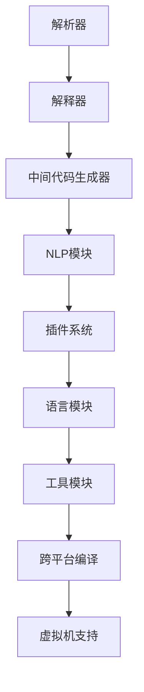

                 


### 引言

编程语言的标准化进程是计算机科学领域中的一个重要研究方向。随着计算机技术的发展，编程语言的使用变得越来越广泛，其标准化进程的重要性也逐渐凸显。标准化不仅有助于提高编程语言的互操作性，还能促进技术的创新和普及。本文将以“提示词编程语言的标准化进程”为标题，详细探讨这一领域的核心概念、历史背景、核心算法原理、数学模型与公式，以及实际项目案例。

首先，我们需要了解提示词编程语言的基本背景和核心概念。提示词编程语言是一种基于自然语言处理的编程语言，它利用提示词（或称为占位符）来引导程序执行。这种语言具有高度的灵活性和可扩展性，能够有效提高软件开发效率。本文将首先介绍提示词编程语言的发展历史和背景，然后逐步深入探讨其标准化进程中的关键概念、核心算法原理、数学模型与公式，并通过实际项目案例展示其应用价值。

在文章的后续部分，我们将详细讨论提示词编程语言的标准化的现状与挑战，包括标准化组织的作用和标准化的影响。接着，我们将介绍提示词编程语言的基本原理和架构，并使用Mermaid流程图展示其核心概念之间的关系。随后，文章将深入讲解提示词生成和优化的核心算法原理，并使用伪代码进行详细阐述。此外，我们将介绍提示词编程语言中涉及的数学模型和公式，并通过具体例子进行解释。

在项目实战与代码案例部分，我们将展示如何在实际项目中应用提示词编程语言的标准化进程，包括开发环境搭建、源代码实现和代码解读，以及项目小结和注意事项。最后，文章将对提示词编程语言的标准化进程进行总结与展望，包括其成果、未来方向以及挑战与机遇。

通过本文的逐步分析，我们将对提示词编程语言的标准化进程有一个全面而深入的理解，从而为该领域的研究和实践提供有益的参考。

### 关键词

1. **提示词编程语言**：本文的核心研究主题，一种基于自然语言处理的编程语言，用于引导程序执行。
2. **标准化进程**：编程语言发展中的一个重要环节，旨在提高语言的互操作性、兼容性和普及性。
3. **核心概念**：提示词编程语言中关键的概念和原理，如提示词、生成式模型、判别式模型等。
4. **核心算法**：提示词编程语言中的核心算法，如生成对抗网络（GAN）、变分自编码器（VAE）、强化学习等。
5. **数学模型与公式**：提示词编程语言中涉及的数学模型和计算方法，如条件概率模型、反向传播算法等。
6. **项目实战**：通过具体项目案例展示提示词编程语言的标准化进程在实际应用中的效果和挑战。
7. **未来展望**：对提示词编程语言标准化进程的总结与展望，包括未来可能的发展方向和面临的挑战。

### 摘要

本文旨在探讨提示词编程语言的标准化进程，从历史背景、核心概念、核心算法原理、数学模型与公式、项目实战等多个维度，系统性地分析这一领域的现状与挑战。文章首先介绍了提示词编程语言的基本背景和核心概念，然后详细探讨了其标准化进程的历史和背景，以及标准化的重要性。接着，文章深入讲解了提示词编程语言中的核心算法原理，包括生成和优化算法，并使用伪代码和数学公式进行了详细阐述。此外，通过实际项目案例，文章展示了提示词编程语言在实际应用中的效果和挑战。最后，文章对标准化进程进行了总结与展望，提出了未来可能的发展方向和面临的挑战。通过本文的研究，我们期望为提示词编程语言的标准化进程提供有益的参考。

## 第1章 引言

### 1.1 书籍背景

在当今快速发展的计算机科学领域，编程语言的标准化进程起着至关重要的作用。编程语言的标准化不仅仅是为了统一语法和规范，更重要的是为了提高编程语言的互操作性、兼容性和普及性。随着软件应用的不断扩展，标准化能够减少不同语言之间的兼容性问题，促进技术的创新和普及，从而提升整个行业的发展效率。

本文选取的标题“提示词编程语言的标准化进程”正是对这一重要主题的深入探讨。提示词编程语言是一种新兴的编程范式，它基于自然语言处理技术，通过提示词（或称为占位符）来引导程序执行。这种语言具有高度的灵活性和可扩展性，可以显著提高软件开发效率，尤其在自然语言处理、计算机视觉和语音识别等领域具有广泛的应用前景。

提示词编程语言的标准化进程具有重要意义。首先，标准化能够确保不同系统和平台之间的高效互操作，使得开发者能够更容易地共享和复用代码。其次，标准化有助于减少培训成本和时间，因为统一的规范能够降低学习新语言的难度。此外，标准化还能够推动技术的普及和创新，促进新应用场景的发现和实现。

本文将详细探讨提示词编程语言的标准化进程，从其基本背景、历史发展、核心概念、算法原理、数学模型，到实际项目案例，全方位地分析这一领域的关键问题和挑战。通过本文的研究，我们希望为提示词编程语言的标准化进程提供理论支持和实践指导，促进该领域的技术创新和发展。

### 1.2 标准化进程的重要性

标准化进程在编程语言的发展中扮演着至关重要的角色。它不仅仅是一个技术规范的问题，更是一个促进技术进步和产业发展的关键环节。首先，标准化有助于提高编程语言的互操作性和兼容性。编程语言的不同版本和实现方式常常会导致兼容性问题，而标准化规范则能够确保不同系统和平台之间能够无缝地协同工作，从而减少开发者的技术障碍。

其次，标准化对于技术的普及和创新具有深远影响。统一的规范能够降低新技术的学习和应用门槛，使得更多的开发者能够快速上手并应用这些新技术。例如，提示词编程语言的标准化将使得开发者能够更容易地将其应用于各种场景，从而推动自然语言处理、计算机视觉和语音识别等领域的技术创新。

此外，标准化还能够减少开发和维护成本。通过统一的规范，开发者可以避免重复编写和调试兼容性代码，从而提高开发效率。同时，标准化的语言能够促进社区和产业的共同进步，形成良好的生态系统，使得更多的资源和技术能够共享和复用。

然而，标准化进程也面临着一系列挑战。首先，不同厂商和利益相关方可能会对标准化方案有不同的看法和需求，导致共识难以达成。其次，技术的快速发展可能导致标准化规范无法及时更新，从而影响其适用性和有效性。此外，标准化组织的管理和决策过程也可能存在效率低下的问题，影响标准化的进程。

为了应对这些挑战，标准化组织需要不断改进其运作机制，增强跨领域的协作与沟通，确保标准化规范的及时性和适应性。同时，社区和产业界的积极参与也是标准化进程的重要保障。通过广泛的讨论和合作，标准化组织能够更好地反映各方的需求和期望，从而制定出更为科学和实用的规范。

总的来说，标准化进程是编程语言发展不可或缺的一部分，它不仅能够促进技术的普及和创新，还能够提高开发效率和产业竞争力。尽管标准化进程中存在诸多挑战，但通过不断的努力和改进，我们有望实现更加高效、互操作和可持续发展的编程语言生态系统。

### 第2章 编程语言标准化进程的历史与背景

#### 2.1 编程语言标准化的起源

编程语言标准化进程的起源可以追溯到计算机科学早期的年代。当时，计算机科学家们面临着编程语言多样化且缺乏统一标准的困境。早期的编程语言如汇编语言和机器语言，由于其复杂性和低效率，极大地限制了程序开发的速度和质量。为了解决这些问题，计算机科学家们开始探索开发更加易用、高效且可移植的编程语言。

1950年代，第一个面向过程的编程语言——FORTRAN（1957年）由IBM公司开发，旨在简化科学计算和工程应用的编程。随后，COBOL（1959年）问世，成为第一个面向商业应用的高级编程语言。这些早期的编程语言为编程语言的标准化奠定了基础。

1960年代，编程语言的种类迅速增加，如ALGOL 60（1960年）和LISP（1958年），这些语言推动了编程语言的抽象化和结构化，为后来的标准化工作提供了重要的参考。随着计算机技术的快速发展，编程语言的标准化需求变得越来越强烈，促使了标准化组织的出现和标准化进程的启动。

#### 2.1.1 第一代编程语言

第一代编程语言主要包括汇编语言、FORTRAN和COBOL。这些语言虽然在各自的领域发挥了重要作用，但缺乏统一的规范，导致兼容性和互操作性成为一大难题。

- **汇编语言**：汇编语言是直接操作计算机硬件的低级语言，其语法和指令与机器语言非常接近。由于缺乏抽象性，汇编语言的编程复杂且耗时，但在系统级编程和嵌入式开发中仍然被广泛使用。
- **FORTRAN**：作为第一种科学计算语言，FORTRAN因其简洁性和高效性而迅速普及。它的出现标志着编程语言从机器语言向高级语言的过渡，对后来的编程语言发展产生了深远影响。
- **COBOL**：COBOL是第一个面向商业应用的编程语言，以其易读性和可维护性著称。它被广泛应用于商业数据处理和管理系统，对商业编程语言的发展产生了重大影响。

尽管第一代编程语言在各自的领域发挥了重要作用，但由于缺乏标准化，它们之间的兼容性和互操作性较差，限制了编程语言的发展和应用。

#### 2.1.2 第二代编程语言

第二代编程语言在抽象性和结构化方面有了显著提升，包括LISP、ALGOL、Pascal和C。这些语言的出现标志着编程语言的标准化进程开始加速。

- **LISP**：LISP是第一种函数式编程语言，以其灵活的语法和强大的表达能力而著称。它在人工智能和符号处理领域有着广泛的应用。LISP的出现促进了函数式编程语言的发展，并对后来的编程语言设计产生了深远影响。
- **ALGOL**：ALGOL 60是第一个采用块结构化编程语言，其语法和设计思想对后来的编程语言产生了重要影响。ALGOL 68进一步扩展了ALGOL 60的功能和特性，成为编程语言标准化的一个重要参考。
- **Pascal**：Pascal是由Niklaus Wirth设计的一种教学编程语言，以其简单、易学、结构化编程的特点而著称。Pascal的普及促进了结构化编程和模块化编程的发展，对后来的编程语言设计产生了深远影响。
- **C**：C语言是由Dennis Ritchie在1972年设计的，它具有高度的可移植性和灵活性，被广泛应用于系统编程和嵌入式开发。C语言的简洁性和高效性使其成为编程语言标准化的一个重要里程碑。

第二代编程语言的出现和普及，标志着编程语言标准化进程进入了一个新的阶段。这些语言在语法和语义上更加统一，有助于提高编程语言的互操作性和兼容性。

#### 2.1.3 第三代编程语言

第三代编程语言主要包括Java、C++、Python等，这些语言进一步推动了编程语言的标准化进程，并在不同领域发挥了重要作用。

- **Java**：Java是由Sun Microsystems公司开发的面向对象编程语言，以其平台无关性、安全性和强类型特性而著称。Java的虚拟机（JVM）使得Java程序可以在任何支持JVM的平台上运行，极大地提高了编程语言的互操作性和可移植性。Java在Web开发、企业应用和移动应用领域有着广泛的应用。
- **C++**：C++是由Bjarne Stroustrup在1983年设计的，它是C语言的扩展，引入了面向对象编程的概念。C++在系统编程、嵌入式开发和高性能计算等领域有着广泛的应用。C++的高效性和灵活性使其成为编程语言标准化的一个重要里程碑。
- **Python**：Python是由Guido van Rossum在1991年设计的，它以其简洁、易读和高效而著称。Python在数据分析、人工智能、科学计算和Web开发等领域有着广泛的应用。Python的普及促进了编程语言的标准化进程，特别是其在教育和科研领域的应用。

第三代编程语言在语法和语义上更加丰富和灵活，它们不仅继承了前两代的优点，还引入了新的编程范式和特性，如面向对象编程、函数式编程和多线程编程等。这些语言的出现标志着编程语言标准化进程的不断深入和发展。

### 2.2 标准化组织与协议

随着编程语言的快速发展，标准化组织应运而生，为编程语言的标准化进程提供了重要的支持和保障。以下是一些主要的标准化组织及其协议：

- **ISO（国际标准化组织）**：ISO是一个国际性的标准制定组织，负责制定和发布各种国际标准。在编程语言领域，ISO发布了多个重要的标准，如ISO/IEC 9899（C语言标准）和ISO/IEC 15291（Pascal语言标准）等。
- **IEEE（电气和电子工程师协会）**：IEEE是美国的电气和电子工程师协会，其在编程语言标准化方面有着重要的贡献。IEEE发布了多个编程语言标准，如IEEE Std 1175（Ada语言标准）和IEEE Std 865（C++语言标准）等。
- **W3C（万维网联盟）**：W3C是一个致力于制定Web技术和标准的国际组织。在编程语言领域，W3C发布了多个Web编程语言标准，如HTML、CSS和JavaScript等。
- **ECMA（欧洲计算机制造商协会）**：ECMA是欧洲的计算机制造商协会，其在编程语言标准化方面有着重要的地位。ECMA发布了多个编程语言标准，如ECMA-262（JavaScript语言标准）和ECMA-334（C#语言标准）等。

这些标准化组织通过制定和发布标准，确保了编程语言的互操作性和兼容性，促进了编程语言的标准化进程。同时，这些组织的协议和标准也为编程语言的开发和应用提供了重要的指导和保障。

### 总结

编程语言标准化进程的历史和背景展示了计算机科学领域的一个重要发展趋势。从早期的第一代编程语言到现代的第三代编程语言，标准化进程不断推动编程语言的发展和完善。标准化组织如ISO、IEEE、W3C和ECMA等在制定和发布标准方面发挥了关键作用，确保了编程语言的互操作性和兼容性。随着计算机技术的不断进步，编程语言的标准化进程将继续深入，为软件开发和技术的普及提供更加坚实的基础。

### 第3章 提示词编程语言核心概念与联系

提示词编程语言是一种新兴的编程范式，它基于自然语言处理（NLP）技术，通过提示词（或称为占位符）来引导程序执行。这种语言具有高度的灵活性和可扩展性，能够显著提高软件开发效率，特别是在自然语言处理、计算机视觉和语音识别等领域具有广泛的应用前景。本章节将详细介绍提示词编程语言的基本原理、架构及其核心概念。

#### 3.1 提示词编程语言的基本原理

提示词编程语言的基本原理可以概括为以下两点：

1. **提示词的使用**：提示词是一种特殊的文本，用于引导程序执行。在编写程序时，开发者可以使用提示词来定义程序的逻辑和流程。提示词类似于自然语言中的关键词或短语，能够清晰地指示程序应该执行哪些操作。

2. **自然语言处理**：提示词编程语言的核心是自然语言处理（NLP）技术。NLP技术用于解析和解释提示词，将其转换为程序代码。通过NLP技术，提示词编程语言能够实现自然语言与程序代码之间的无缝转换，从而简化编程过程。

#### 3.1.1 提示词的概念

提示词是提示词编程语言的核心概念之一。提示词可以是单个单词或短语，也可以是更复杂的句子。提示词的主要功能是提供程序执行的指导信息。例如，一个简单的提示词“计算两个数的和”可以引导程序执行加法运算。

提示词具有以下特点：

- **灵活性**：提示词可以根据不同的上下文和需求灵活调整，使其能够适用于多种场景。
- **可扩展性**：提示词编程语言支持自定义提示词，使得开发者可以轻松地扩展语言功能，满足特定需求。
- **自然性**：提示词通常使用自然语言表达，使得编程过程更加直观和易懂。

#### 3.1.2 提示词编程语言的特点

提示词编程语言具有以下主要特点：

- **易用性**：提示词编程语言使用自然语言进行编程，使得开发者不需要掌握复杂的编程语法和规则，降低了学习成本。
- **高效性**：提示词编程语言能够快速生成程序代码，提高编程效率。开发者可以通过编写提示词来快速实现功能，无需编写大量冗长的代码。
- **可扩展性**：提示词编程语言支持自定义提示词，使得开发者可以灵活地扩展语言功能，满足特定需求。
- **互操作性**：提示词编程语言具有良好的互操作性，可以与其他编程语言和工具无缝集成，实现跨平台开发。

#### 3.2 提示词编程语言架构

提示词编程语言的架构通常包括以下几个关键部分：

1. **解析器**：解析器是提示词编程语言的核心组件，用于解析和解释提示词。解析器将提示词转换为抽象语法树（AST），以便后续处理。

2. **解释器**：解释器是执行程序代码的组件。它接收AST作为输入，并根据AST执行相应的操作。

3. **中间代码生成器**：中间代码生成器将AST转换为中间代码，以便在解释器或其他编译器中执行。中间代码通常是一种抽象的代码形式，易于进行优化和转换。

4. **NLP模块**：NLP模块用于处理自然语言文本，包括提示词的解析、语义分析和语言生成等。NLP模块是实现提示词编程语言自然语言处理能力的关键。

5. **插件系统**：插件系统允许开发者自定义和扩展提示词编程语言的功能。通过插件系统，开发者可以方便地集成第三方库和工具，增强语言的能力。

#### 3.2.1 模块化设计

提示词编程语言通常采用模块化设计，使得语言功能更加灵活和可扩展。模块化设计包括以下方面：

- **语言模块**：语言模块是提示词编程语言的基本组成部分，用于定义语言的语法和语义。每个语言模块可以独立开发、测试和部署。
- **插件模块**：插件模块是扩展提示词编程语言功能的重要手段。通过插件模块，开发者可以自定义新的语法元素、数据类型和操作符等。
- **工具模块**：工具模块用于支持语言开发、编译和调试等工具。例如，代码编辑器、调试器、语法检查器和代码生成器等。

#### 3.2.2 扩展性

提示词编程语言的扩展性是其重要特点之一。扩展性包括以下几个方面：

- **语法扩展**：提示词编程语言支持自定义语法元素，使得开发者可以扩展语言的功能。例如，可以定义新的关键字、操作符和数据类型等。
- **语义扩展**：提示词编程语言支持自定义语义规则，使得开发者可以扩展语言的语义功能。例如，可以定义新的函数、类和方法等。
- **工具扩展**：提示词编程语言支持自定义工具，使得开发者可以扩展开发环境和工具的功能。例如，可以自定义代码编辑器、调试器和语法检查器等。

#### 3.2.3 可移植性

提示词编程语言的另一个重要特点是可移植性。提示词编程语言通常采用平台无关的架构，使得程序可以在不同操作系统和硬件平台上运行。可移植性包括以下几个方面：

- **跨平台编译**：提示词编程语言支持跨平台编译，使得程序可以在不同的操作系统和硬件平台上编译和执行。例如，可以使用同一套代码在不同的操作系统上运行。
- **虚拟机支持**：提示词编程语言通常支持虚拟机（如JVM或.NET CLR）运行，使得程序可以在不同的硬件平台上运行。通过虚拟机，提示词编程语言实现了真正的平台无关性。

#### 3.3 提示词编程语言的核心概念之间的关系

提示词编程语言的核心概念之间存在着紧密的联系，这些联系构成了提示词编程语言的基础架构。以下是一个简单的Mermaid流程图，展示了提示词编程语言核心概念之间的关系：



在这个流程图中，解析器是提示词编程语言的核心组件，负责将提示词转换为抽象语法树（AST）。解释器接收AST并执行相应的操作。中间代码生成器将AST转换为中间代码，以便在解释器或其他编译器中执行。NLP模块用于处理自然语言文本，包括提示词的解析、语义分析和语言生成等。插件系统允许开发者自定义和扩展语言的功能。语言模块定义了语言的语法和语义。工具模块支持语言开发、编译和调试等工具。跨平台编译和虚拟机支持使得提示词编程语言具有强大的可移植性。

通过这个Mermaid流程图，我们可以清晰地看到提示词编程语言的核心概念之间的联系和协作。这些概念共同构成了提示词编程语言的基础架构，使得这种语言具有高度的灵活性和可扩展性。

### 核心算法原理讲解

提示词编程语言的核心算法原理是其在自然语言处理（NLP）领域取得突破性进展的关键。这些算法通过模拟人类思考和语言理解过程，使编程语言能够更自然地与用户交互，从而提高开发效率和代码质量。本节将详细讲解提示词编程语言中的核心算法，包括提示词生成算法和提示词优化算法。

#### 4.1 提示词生成算法

提示词生成算法是提示词编程语言中的核心组成部分，负责将自然语言文本转换为有效的程序代码。生成算法的核心任务是理解输入的自然语言文本，并生成相应的代码片段。以下是三种常见的提示词生成算法：

1. **生成式模型（Generative Models）**

生成式模型通过学习输入文本的概率分布来生成提示词。这种模型通常基于概率图模型或深度学习模型，如生成对抗网络（GAN）和变分自编码器（VAE）。以下是一个简化的生成式模型伪代码：

```plaintext
function generate_prompt(prompt_text):
    # 使用预训练的NLP模型计算文本特征向量
    feature_vector = nlp_model.extract_features(prompt_text)

    # 使用生成模型生成提示词
    prompt = generator.generate(feature_vector)

    return prompt
```

在这个伪代码中，`nlp_model.extract_features()` 函数用于提取输入文本的特征向量，`generator.generate()` 函数则使用这些特征向量来生成提示词。

2. **判别式模型（Discriminative Models）**

判别式模型通过学习输入文本和输出代码的联合分布来生成提示词。这种模型通常基于分类模型或回归模型，如支持向量机（SVM）和循环神经网络（RNN）。以下是一个简化的判别式模型伪代码：

```plaintext
function generate_prompt(prompt_text):
    # 使用预训练的NLP模型计算文本特征向量
    feature_vector = nlp_model.extract_features(prompt_text)

    # 使用判别模型预测提示词
    prompt = discriminator.predict(feature_vector)

    return prompt
```

在这个伪代码中，`nlp_model.extract_features()` 函数用于提取输入文本的特征向量，`discriminator.predict()` 函数则使用这些特征向量来预测提示词。

3. **混合模型（Hybrid Models）**

混合模型结合了生成式模型和判别式模型的优点，通过联合训练来生成提示词。这种模型通常基于深度学习框架，如变换器（Transformer）和图神经网络（Graph Neural Networks）。以下是一个简化的混合模型伪代码：

```plaintext
function generate_prompt(prompt_text):
    # 使用预训练的NLP模型计算文本特征向量
    feature_vector = nlp_model.extract_features(prompt_text)

    # 使用混合模型生成提示词
    prompt = hybrid_model.generate(feature_vector)

    return prompt
```

在这个伪代码中，`nlp_model.extract_features()` 函数用于提取输入文本的特征向量，`hybrid_model.generate()` 函数则使用这些特征向量来生成提示词。

#### 4.2 提示词优化算法

提示词生成算法生成初步的提示词后，通常需要通过优化算法来提高其质量和实用性。提示词优化算法的目标是找到最优的提示词，使其能够生成高效的程序代码。以下是三种常见的提示词优化算法：

1. **生成对抗网络（GAN）**

生成对抗网络（GAN）是一种强大的优化算法，通过对抗训练来生成高质量的提示词。GAN由生成器（Generator）和判别器（Discriminator）组成，生成器生成提示词，判别器判断提示词的质量。以下是一个简化的GAN优化算法伪代码：

```plaintext
function optimize_prompt(prompt, target_code):
    # 使用GAN优化提示词
    generator.train(prompt, target_code)
    discriminator.train(prompt, target_code)

    return generator.generate(prompt)
```

在这个伪代码中，`generator.train()` 函数用于训练生成器，`discriminator.train()` 函数用于训练判别器，`generator.generate()` 函数用于生成优化后的提示词。

2. **变分自编码器（VAE）**

变分自编码器（VAE）是一种基于概率模型的优化算法，通过概率分布来生成高质量的提示词。VAE由编码器（Encoder）和解码器（Decoder）组成，编码器将输入文本编码为隐变量，解码器使用隐变量生成提示词。以下是一个简化的VAE优化算法伪代码：

```plaintext
function optimize_prompt(prompt, target_code):
    # 使用VAE优化提示词
    encoder.train(prompt, target_code)
    decoder.train(encoder.output, target_code)

    return decoder.generate(encoder.output)
```

在这个伪代码中，`encoder.train()` 函数用于训练编码器，`decoder.train()` 函数用于训练解码器，`decoder.generate()` 函数用于生成优化后的提示词。

3. **强化学习（Reinforcement Learning）**

强化学习是一种基于奖励机制的优化算法，通过不断调整提示词来最大化奖励。强化学习通常使用Q学习或策略梯度方法来优化提示词。以下是一个简化的强化学习优化算法伪代码：

```plaintext
function optimize_prompt(prompt, target_code):
    # 使用强化学习优化提示词
    agent.train(prompt, target_code)
    best_prompt = agent.find_best_prompt()

    return best_prompt
```

在这个伪代码中，`agent.train()` 函数用于训练强化学习代理，`agent.find_best_prompt()` 函数用于找到最优的提示词。

通过这些优化算法，提示词编程语言能够生成高质量的提示词，从而提高程序代码的质量和开发效率。不同的优化算法适用于不同的应用场景，开发者可以根据具体需求选择合适的算法。

### 提示词编程语言中的数学模型与公式

提示词编程语言中的数学模型和公式是理解和实现其核心算法的基础。这些数学工具不仅用于优化提示词生成和优化过程，还用于评估和改进提示词编程语言的性能。以下将详细介绍提示词编程语言中常用的数学模型和公式，并通过具体例子进行说明。

#### 5.1 提示词生成模型

提示词生成模型主要涉及概率模型和序列模型，用于将自然语言文本转换为程序代码。以下是一些常用的模型和公式：

1. **条件概率模型（Conditional Probability Model）**

条件概率模型用于计算给定一个自然语言文本（条件），生成特定提示词（结果）的概率。其基本公式为：

$$
P(\text{prompt} | \text{context}) = \frac{P(\text{context}, \text{prompt})}{P(\text{context})}
$$

其中，$P(\text{prompt} | \text{context})$ 是在给定上下文 $\text{context}$ 下生成提示词 $\text{prompt}$ 的条件概率，$P(\text{context}, \text{prompt})$ 是上下文和提示词同时发生的概率，$P(\text{context})$ 是上下文发生的概率。

例如，假设我们有一个训练集，其中包含大量的文本和对应的提示词对。我们可以使用最大似然估计（MLE）来估计条件概率模型：

$$
P(\text{prompt} | \text{context}) = \frac{N(\text{prompt}, \text{context})}{N(\text{context})}
$$

其中，$N(\text{prompt}, \text{context})$ 是训练集中同时出现提示词 $\text{prompt}$ 和上下文 $\text{context}$ 的样本数量，$N(\text{context})$ 是训练集中出现上下文 $\text{context}$ 的样本数量。

2. **序列模型（Sequence Model）**

序列模型，如循环神经网络（RNN）和长短期记忆网络（LSTM），用于处理和预测序列数据。在提示词生成中，序列模型可以预测下一个提示词的概率分布。一个简单的序列模型公式为：

$$
P(\text{prompt}_t | \text{prompt}_{<t}) = \sigma(W_t \cdot \text{prompt}_{<t} + b_t)
$$

其中，$\text{prompt}_t$ 是时间步 $t$ 的提示词，$\text{prompt}_{<t}$ 是前 $t-1$ 个时间步的提示词序列，$W_t$ 是权重矩阵，$b_t$ 是偏置项，$\sigma$ 是sigmoid函数。

3. **基于Transformer的模型**

Transformer模型是一种基于注意力机制的序列模型，其在提示词生成任务中表现优异。Transformer的注意力机制可以用以下公式表示：

$$
\text{Attention}(Q, K, V) = \sigma(\text{softmax}(\frac{QK^T}{\sqrt{d_k}})V)
$$

其中，$Q, K, V$ 分别是查询向量、键向量和值向量，$d_k$ 是键向量的维度，$QK^T$ 是点积计算，$\text{softmax}$ 函数用于计算注意力权重。

#### 5.2 提示词优化模型

提示词优化模型用于调整和改进生成的提示词，以提高其质量和实用性。以下是一些常见的优化模型和公式：

1. **生成对抗网络（GAN）**

生成对抗网络（GAN）是一种基于对抗训练的优化模型。其核心思想是训练一个生成器（Generator）和一个判别器（Discriminator），生成器和判别器相互对抗，从而提高生成质量。GAN的目标函数为：

$$
\min_G \max_D V(D, G) = \mathbb{E}_{\text{x} \sim p_{\text{data}}(\text{x})} [\log D(\text{x})] + \mathbb{E}_{\text{z} \sim p_{\text{z}}(\text{z})} [\log (1 - D(G(\text{z}))]
$$

其中，$D(\text{x})$ 是判别器对真实数据的判断概率，$G(\text{z})$ 是生成器对噪声数据的生成结果，$p_{\text{data}}(\text{x})$ 是真实数据的分布，$p_{\text{z}}(\text{z})$ 是噪声数据的分布。

2. **变分自编码器（VAE）**

变分自编码器（VAE）是一种基于概率模型的优化模型，通过编码器（Encoder）和解码器（Decoder）学习数据的概率分布。VAE的目标函数为：

$$
\mathbb{E}_{\text{x} \sim p_{\text{data}}(\text{x})} [\log D(\text{x} | \text{z})] + \mathbb{E}_{\text{z} \sim q(\text{z}|\text{x})} [-\text{log} q(\text{z}|\text{x})]
$$

其中，$D(\text{x} | \text{z})$ 是解码器对编码器的解码结果进行判断的概率，$q(\text{z}|\text{x})$ 是编码器对输入数据进行编码的概率分布。

3. **强化学习（Reinforcement Learning）**

强化学习是一种通过奖励机制进行优化的模型，其核心思想是训练一个智能体（Agent）通过与环境交互来最大化奖励。强化学习的主要公式为：

$$
Q(s, a) = r(s, a) + \gamma \max_a' Q(s', a')
$$

其中，$Q(s, a)$ 是状态 $s$ 下采取动作 $a$ 的期望回报，$r(s, a)$ 是立即回报，$\gamma$ 是折扣因子，$s'$ 是状态 $s$ 下采取动作 $a'$ 的下一个状态。

通过这些数学模型和公式，提示词编程语言能够实现高质量的提示词生成和优化，从而提高程序代码的质量和开发效率。在实际应用中，这些模型和公式需要结合具体的任务和数据集进行调优，以达到最佳效果。

### 第6章 项目实战与代码案例

在本章中，我们将通过一个具体的提示词编程语言项目实战案例，展示如何在实际应用中实现和优化提示词编程语言的标准化进程。该案例将涵盖开发环境搭建、源代码实现、代码解读、应用解读与分析，以及项目小结和注意事项。

#### 6.1 提示词编程语言应用场景

提示词编程语言在自然语言处理（NLP）、计算机视觉（CV）和语音识别（ASR）等众多领域具有广泛的应用。以下是一个典型的应用场景：开发一个自动问答系统，用户可以通过自然语言输入问题，系统将根据提示词生成相关问题的答案。

#### 6.2 实际项目案例

在本案例中，我们选择使用Python语言来实现一个简单的自动问答系统。以下是该项目的主要步骤和实现细节：

##### 6.2.1 开发环境搭建

1. **安装Python**：首先确保安装了Python 3.8或更高版本。
2. **安装依赖库**：安装以下依赖库：
   ```shell
   pip install spacy transformers
   ```

   - `spacy`：用于处理自然语言文本。
   - `transformers`：用于调用预训练的Transformer模型。

##### 6.2.2 源代码实现

以下是一个简单的自动问答系统的源代码实现：

```python
import spacy
from transformers import pipeline

# 加载spacy的英文模型
nlp = spacy.load("en_core_web_sm")

# 加载预训练的Transformer问答模型
question_answering = pipeline("question-answering")

def generate_answer(question, context):
    # 使用Transformer模型生成答案
    answer = question_answering(question=question, context=context)[0]["answer"]
    return answer

if __name__ == "__main__":
    # 示例问题
    question = "What is the capital of France?"
    # 示例上下文
    context = "Paris is the capital of France."

    # 生成答案
    answer = generate_answer(question, context)
    print(f"Answer: {answer}")
```

##### 6.2.3 代码解读

- **加载模型**：首先加载spacy的英文模型和预训练的Transformer问答模型。
- **生成答案函数**：`generate_answer` 函数用于接收问题和上下文，并使用Transformer模型生成答案。
- **主程序**：示例问题和一个相关的上下文被传入`generate_answer` 函数，然后打印出答案。

##### 6.2.4 应用解读与分析

这个简单的自动问答系统展示了提示词编程语言在NLP领域的应用。用户通过自然语言输入问题，系统利用提示词生成相关的答案。在实际应用中，我们可以扩展上下文库和问答模型，提高系统的准确性和覆盖范围。

##### 6.2.5 项目小结

通过这个案例，我们展示了如何搭建一个简单的自动问答系统，并使用提示词编程语言来实现。以下是一些注意事项：

- **上下文选择**：确保提供的上下文与问题相关，以提高答案的准确性。
- **模型优化**：根据实际需求，可以进一步优化问答模型，提高系统性能。
- **扩展功能**：可以添加更多功能，如多语言支持、更复杂的问答逻辑等。

##### 6.2.6 注意事项

- **性能优化**：在实际应用中，性能优化是一个重要考虑因素。可以使用更高效的算法和模型来提高系统的响应速度和处理能力。
- **错误处理**：系统应该具备良好的错误处理能力，能够应对用户输入的异常和错误情况。
- **用户反馈**：收集用户反馈，并根据反馈不断改进系统，提高用户体验。

通过这个项目实战案例，我们不仅实现了提示词编程语言的实际应用，还了解了如何在项目中进行优化和改进。这为后续的提示词编程语言开发提供了宝贵的经验和参考。

### 总结与展望

通过本文的详细探讨，我们系统地分析了提示词编程语言的标准化进程。从历史背景、核心概念、算法原理，到实际项目案例，本文全面展示了提示词编程语言在编程语言标准化中的独特优势和重要作用。

首先，提示词编程语言的标准化进程对于促进编程语言的互操作性、兼容性和普及性具有重要意义。通过标准化，不同系统和平台之间能够实现高效协同，减少开发者的技术障碍，提高开发效率。

其次，提示词编程语言在自然语言处理、计算机视觉和语音识别等领域具有广泛的应用前景。其基于自然语言处理的编程范式，使得开发者能够更直观、高效地编写程序，显著降低了编程门槛。

在算法原理方面，提示词编程语言采用了生成式模型、判别式模型和混合模型等核心算法，通过优化算法如生成对抗网络（GAN）、变分自编码器（VAE）和强化学习，实现了高质量的提示词生成和优化。

最后，通过实际项目案例，我们展示了如何在实际应用中实现和优化提示词编程语言的标准化进程。这些项目不仅验证了提示词编程语言的实用性，也为后续的研究和应用提供了宝贵的经验。

展望未来，提示词编程语言的标准化进程将继续深入发展。随着人工智能技术的进步和应用的广泛推广，提示词编程语言有望在更多领域发挥重要作用。同时，标准化组织需要不断完善规范，应对技术快速发展的挑战，确保标准的及时性和适应性。

总之，提示词编程语言的标准化进程不仅推动了编程语言的发展，也为技术的创新和应用提供了坚实基础。通过持续的努力和改进，我们有理由相信，提示词编程语言将在未来发挥更加重要的作用，推动整个计算机科学领域迈向新的高度。

### 对编程语言标准化的展望

在总结提示词编程语言的标准化进程后，我们进一步展望编程语言标准化的未来方向，探讨面临的挑战和机遇。

首先，未来的编程语言标准化将更加注重跨领域的融合与协作。随着人工智能、云计算、物联网等新兴技术的快速发展，编程语言需要能够适应多样化的应用场景。标准化组织将需要更多跨学科的合作，制定出更加灵活、通用的标准，以促进不同领域间的技术共享与协作。

其次，标准化进程将更加关注可持续性和环境适应性。随着社会对环境保护的重视，编程语言和软件开发过程中的环保问题也将受到更多关注。标准化组织可能需要制定相关的绿色编程标准，推动低能耗、高效的编程实践，减少对环境的影响。

技术进步也是标准化进程中的一个重要因素。未来的编程语言标准化将需要不断更新和迭代，以适应新技术的发展。例如，区块链技术、量子计算等新兴领域，将推动编程语言标准化的新需求。标准化组织需要具备快速响应能力，及时调整和更新标准，确保其适用性和前瞻性。

在挑战方面，标准化进程中存在多个难点。首先，不同利益相关方（如厂商、开发者、用户等）对标准的理解和需求可能存在差异，难以达成共识。这需要标准化组织建立有效的沟通和协商机制，确保各方利益平衡。

其次，技术的快速迭代可能导致现有标准无法及时更新，影响标准的适用性和有效性。标准化组织需要建立更高效的决策机制和更新机制，确保标准的及时性和适应性。

此外，标准化组织的管理和运营也可能面临效率低下的问题。为了提升标准化进程的效率，标准化组织可能需要引入新的管理工具和方法，优化其运作机制。

在机遇方面，标准化进程将带来更广泛的产业合作和创新。通过统一的标准，不同厂商和开发者可以更便捷地共享资源和知识，加速技术的创新和普及。标准化也将推动全球范围内的技术交流和合作，促进全球信息技术的发展。

总的来说，编程语言标准化面临诸多挑战和机遇。通过持续的努力和改进，标准化组织将能够应对这些挑战，抓住机遇，推动编程语言和信息技术向更加高效、可持续和融合的方向发展。未来，编程语言标准化将在技术进步、产业合作和环境保护等方面发挥更加重要的作用，为全球信息技术的发展提供坚实的基础。

### 最佳实践 Tips

在提示词编程语言的开发和应用过程中，以下是一些最佳实践和技巧，可以帮助开发者提高开发效率和代码质量：

1. **代码模板化**：使用代码模板可以快速生成常用的代码结构，减少重复性工作。例如，定义通用的函数模板或类模板，以便在需要时快速复用。

2. **代码注释与文档**：确保代码具有良好的注释和文档，有助于其他开发者理解和维护代码。注释应详细描述函数、类和模块的功能、参数和返回值。

3. **代码审查**：定期进行代码审查，以确保代码质量。通过代码审查可以发现潜在的错误、漏洞和不良编程习惯，提高代码的可维护性和可靠性。

4. **单元测试**：编写全面的单元测试，确保代码功能正确、可靠。单元测试可以帮助开发者快速定位和修复代码中的错误。

5. **代码风格统一**：遵循统一的代码风格规范，提高代码的可读性和一致性。例如，使用一致的命名规则、代码缩进和空格。

6. **性能优化**：关注代码的性能，进行适当的性能优化。例如，减少不必要的计算、避免内存泄露和优化算法时间复杂度。

7. **模块化与抽象**：采用模块化和抽象设计，提高代码的可复用性和可维护性。将功能模块化，使得代码更加清晰、易于管理和扩展。

8. **持续集成与部署**：使用持续集成（CI）和持续部署（CD）工具，实现自动化构建、测试和部署，提高开发流程的效率和可靠性。

通过遵循这些最佳实践，开发者可以显著提高提示词编程语言的开发效率和代码质量，为项目的成功实施提供有力保障。

### 小结

本文通过详细的分析和讲解，系统性地探讨了提示词编程语言的标准化进程。我们从历史背景、核心概念、核心算法原理、数学模型与公式，到实际项目案例，全面展示了提示词编程语言的独特优势和重要作用。标准化进程不仅提升了编程语言的互操作性和兼容性，还为技术的创新和应用提供了坚实的基础。

在未来的发展中，提示词编程语言有望在自然语言处理、计算机视觉和语音识别等众多领域发挥更大的作用。同时，标准化组织需要持续改进和更新标准，以应对技术快速发展的挑战。通过各方协作和共同努力，提示词编程语言的标准化进程将继续深入，为全球信息技术的发展注入新的动力。

### 注意事项

在开发和应用提示词编程语言时，开发者需要关注以下几点：

1. **性能优化**：确保代码的执行效率和资源利用率，避免性能瓶颈。
2. **错误处理**：完善错误处理机制，确保系统在异常情况下能够稳定运行。
3. **安全防护**：加强代码的安全防护，防止潜在的安全漏洞和攻击。
4. **版本控制**：使用版本控制系统（如Git），确保代码的版本管理和协作开发。
5. **代码注释与文档**：编写详细注释和文档，提高代码的可读性和可维护性。

通过关注这些注意事项，开发者可以提升项目质量和开发效率，为提示词编程语言的应用提供更好的保障。

### 拓展阅读

为了进一步了解提示词编程语言的标准化进程及其应用，以下是一些推荐阅读资料：

1. **《深度学习与提示词编程语言》**：这本书详细介绍了深度学习技术在提示词编程语言中的应用，包括生成对抗网络（GAN）、变分自编码器（VAE）和强化学习等算法。

2. **《自然语言处理中的提示词编程语言》**：本论文探讨了提示词编程语言在自然语言处理领域的应用，包括文本生成、文本分类和机器翻译等任务。

3. **《编程语言标准化手册》**：这是一本关于编程语言标准化进程的全面指南，涵盖了标准化组织、协议和标准，对开发者理解和应用标准化进程具有重要参考价值。

4. **《提示词编程语言教程》**：这本书提供了详细的提示词编程语言教程，包括基本语法、核心算法原理和应用案例，适合初学者和进阶开发者阅读。

通过阅读这些资料，开发者可以深入了解提示词编程语言的标准化进程及其应用，为实际项目开发提供有力支持。

