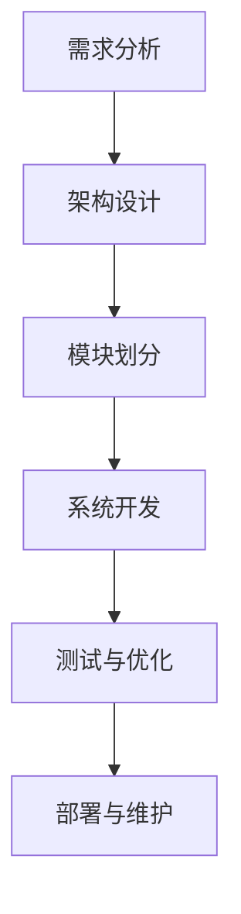
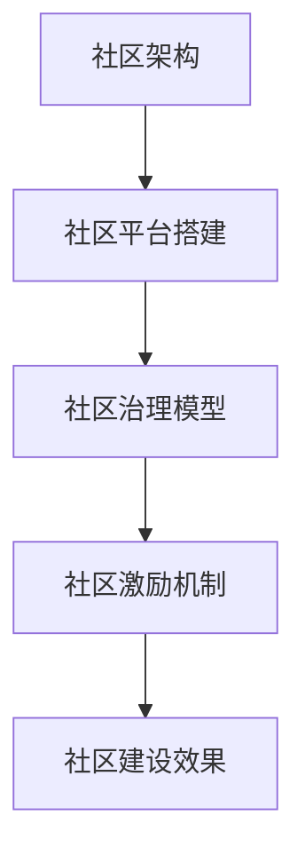

                 

### 引言

#### 背景介绍

提示词编程语言是一种基于自然语言处理的编程语言，它通过将自然语言描述转化为计算机可执行的代码，极大地提升了软件开发效率和代码可读性。随着人工智能技术的发展，提示词编程语言逐渐成为编程领域的一个重要分支。然而，提示词编程语言的社区建设和生态发展同样重要，它不仅影响到语言的普及和推广，更关系到整个编程生态的健康和繁荣。

社区建设是一个长期而复杂的工程，涉及多个层面的工作，包括用户管理、内容建设、活动策划、互动与反馈等。一个好的社区能够聚集大量的开发者和用户，形成知识共享、技能交流和创新的环境，从而推动提示词编程语言的发展。

本文将围绕提示词编程语言的社区建设与生态展开讨论。首先，我们将介绍社区建设的基本概念和重要性，接着深入探讨社区建设的核心原理和策略，最后通过案例研究和未来展望，为提示词编程语言的社区建设提供有价值的参考和建议。

## 文章标题：提示词编程语言的社区建设与生态

### 关键词
1. 提示词编程语言
2. 社区建设
3. 生态发展
4. 用户管理
5. 内容建设

### 摘要

本文旨在探讨提示词编程语言的社区建设与生态发展。通过对社区建设的重要性、核心原理和策略的深入分析，以及国内外成功案例的总结，本文提出了一系列有效的社区建设和生态发展策略。文章最后对未来提示词编程语言社区建设与生态发展的趋势和挑战进行了展望，为相关领域的研究和实践提供了参考。

## 引言

### 背景介绍

提示词编程语言是一种通过自然语言描述来编写代码的编程语言，它极大地提高了编程的效率和可读性。近年来，随着人工智能技术的快速发展，提示词编程语言在各个领域得到了广泛应用，从自动化测试到自然语言处理，再到智能客服，都取得了显著的成果。然而，提示词编程语言的社区建设和生态发展同样重要，它不仅关系到语言的普及和推广，更影响到整个编程生态的健康和繁荣。

社区建设是一个涉及多个层面的系统工程，包括用户管理、内容建设、活动策划、互动与反馈等。一个健康、活跃的社区能够为开发者提供知识共享、技能交流和创新的环境，从而推动提示词编程语言的发展。然而，社区建设并非一蹴而就，它需要长期的投入和精心策划。

本文旨在探讨提示词编程语言的社区建设与生态发展。首先，我们将介绍社区建设的基本概念和重要性，探讨社区建设对提示词编程语言发展的推动作用。接着，我们将深入分析社区建设的核心原理和策略，包括用户管理、内容建设和活动策划等方面。在此基础上，本文将通过国内外成功案例的总结，提出一系列有效的社区建设和生态发展策略。最后，本文将展望提示词编程语言社区建设与生态发展的未来趋势和挑战，为相关领域的研究和实践提供参考。

### 社区建设的重要性

社区建设在提示词编程语言的发展中起着至关重要的作用。一个健康、活跃的社区不仅能够为开发者提供一个良好的交流和学习平台，还能推动提示词编程语言的普及和应用，促进整个编程生态的繁荣。

首先，社区建设能够促进知识共享和技能交流。在社区中，开发者可以分享自己的经验和技巧，讨论编程中的问题和挑战，从而提高整个社区的开发水平。同时，社区也为新手提供了学习资源，使他们能够快速掌握提示词编程语言的基本知识和应用技巧。这种知识共享和技能交流的氛围，有助于培养一批有经验、有能力的开发者，为提示词编程语言的推广和应用打下坚实的基础。

其次，社区建设有助于形成良好的编程文化。编程文化不仅包括技术层面的交流，还包括对编程理念的探讨和思考。在一个健康的社区中，开发者们可以共同探讨编程的最佳实践，分享对编程艺术的理解和感悟，从而形成一种积极向上的编程文化。这种文化氛围能够激励开发者不断创新，推动提示词编程语言的发展。

再次，社区建设能够提高提示词编程语言的知名度和影响力。一个活跃的社区可以吸引更多的开发者加入，从而扩大提示词编程语言的应用范围和影响力。此外，社区中的优秀项目和案例也可以通过口碑传播，吸引更多企业和研究机构的关注，推动提示词编程语言在各个领域的应用。

最后，社区建设对于促进开源发展和创新具有重要意义。在社区中，开发者们可以共同协作，开发出更多优秀的提示词编程语言库和工具，推动开源生态的繁荣。同时，社区中的创新和探索也可以为提示词编程语言的改进和发展提供源源不断的灵感。

总之，社区建设是提示词编程语言发展的重要支撑。一个健康、活跃的社区不仅能够为开发者提供一个良好的交流和学习平台，还能推动提示词编程语言的普及和应用，促进整个编程生态的繁荣。因此，社区建设应得到充分的重视和投入，以推动提示词编程语言的长期健康发展。

### 社区建设的核心概念

#### 核心概念

社区建设是一个复杂而系统的工程，涉及多个核心概念，包括社区架构、社区平台搭建、社区治理模型和社区激励机制。这些核心概念共同构成了社区建设的框架，确保社区能够健康、有序地运转。

##### 社区架构

社区架构是社区建设的核心，它决定了社区的组织结构、功能模块和工作流程。一个良好的社区架构应该具备以下特点：

1. **模块化**：社区架构应具备模块化设计，使得各个功能模块能够独立运行和扩展，方便管理和维护。
2. **灵活性**：社区架构应具备足够的灵活性，以适应不同规模和需求的变化，确保社区能够持续发展。
3. **稳定性**：社区架构应具备良好的稳定性，确保社区在高峰期和高负载情况下仍能稳定运行。

**Mermaid流程图：** 社区架构设计流程



##### 社区平台搭建

社区平台搭建是社区建设的基础，它包括社区网站的搭建、社区功能的实现和社区内容的组织。一个高效的社区平台应具备以下特点：

1. **用户体验**：社区平台应提供良好的用户体验，使得用户能够方便地访问和使用社区功能。
2. **功能全面**：社区平台应具备全面的功能，包括论坛、博客、问答、活动等，满足用户不同的需求。
3. **安全性**：社区平台应具备良好的安全性，保护用户数据和隐私，防止恶意攻击和滥用。

**伪代码：** 社区平台搭建步骤

```
function buildCommunityPlatform() {
    setupWebsite();
    implementCommunityFeatures();
    organizeContent();
    ensureSecurity();
    performTesting();
}
```

##### 社区治理模型

社区治理模型是确保社区健康、有序运行的重要机制。一个有效的社区治理模型应包括以下方面：

1. **管理制度**：明确社区管理制度，包括用户权限、内容审核、违规处理等。
2. **组织架构**：建立社区组织架构，包括管理员、版主、志愿者等，确保社区有良好的组织和管理。
3. **监督机制**：建立监督机制，确保社区管理制度的有效执行，及时发现和解决问题。

**伪代码：** 社区治理模型

```
function manageCommunity() {
    defineRules();
    appointLeaders();
    monitorActivities();
    addressIssues();
}
```

##### 社区激励机制

社区激励机制是激发用户参与社区活动、贡献内容的重要手段。一个有效的社区激励机制应包括以下方面：

1. **积分制度**：建立积分制度，通过积分奖励用户参与社区活动，提高用户活跃度。
2. **荣誉称号**：设立荣誉称号，对贡献突出的用户进行表彰，提高用户荣誉感和归属感。
3. **物质奖励**：提供物质奖励，如礼品、赞助等，鼓励用户积极参与社区活动。

**伪代码：** 社区激励机制

```
function incentivizeCommunity() {
    setupPointSystem();
    awardHonors();
    offerPrizes();
    measureEffectiveness();
}
```

#### 核心概念之间的关系架构

社区建设中的核心概念之间存在紧密的联系，共同构成一个完整的社区生态系统。社区架构是社区建设的骨架，社区平台搭建是社区建设的基础，社区治理模型是社区建设的保障，社区激励机制是社区建设的关键驱动。

**Mermaid流程图：** 社区建设的核心概念关系架构



通过以上核心概念之间的相互关联，社区建设能够形成一个良性循环，推动社区的持续发展。社区架构的设计为社区提供了坚实的基础，社区平台搭建实现了社区的功能和内容组织，社区治理模型保障了社区的健康和有序，社区激励机制激发了用户的积极参与，共同促进了社区建设的成功。

### 社区用户管理

#### 用户角色划分

在社区建设中，用户角色的划分是至关重要的。合理的用户角色划分能够帮助社区更好地管理和组织用户，提升社区的整体运营效率。常见的用户角色包括：

1. **普通用户**：普通用户是社区的核心成员，他们参与社区讨论、提问和回答问题、分享经验等。普通用户是社区内容的主要贡献者，也是社区活跃度的关键指标。
2. **版主**：版主负责管理特定的社区板块，包括发布新话题、审核内容、维护板块秩序等。版主是社区管理的核心力量，对社区内容的审核和质量有重要影响。
3. **管理员**：管理员负责整个社区的管理工作，包括用户管理、内容审核、社区活动策划等。管理员具有最高的权限，对社区的整体运营负责。

**伪代码：** 用户角色划分示例

```
class User {
    string username;
    string role; // "普通用户", "版主", "管理员"
    // ...
}

function assignUserRole(user) {
    if (user.hasAdminRights) {
        user.role = "管理员";
    } else if (user.isModerator) {
        user.role = "版主";
    } else {
        user.role = "普通用户";
    }
}
```

#### 用户成长体系

用户成长体系是激励用户积极参与社区、提升社区活跃度的重要机制。一个完善的用户成长体系应包括以下方面：

1. **积分系统**：通过积分系统记录用户的活跃度和贡献度，积分可以用于兑换社区内的虚拟奖励或实物奖励。
2. **等级晋升**：根据用户的积分和活跃度，用户可以晋升不同的等级，等级越高，享受的权限和福利越多。
3. **成就奖励**：设立各种成就奖励，如最佳回答者、最佳贡献者等，激励用户在社区中取得更高的成就。

**伪代码：** 用户成长体系示例

```
class User {
    int points;
    int level;
    string achievements;
    // ...
}

function updateUserLevel(user) {
    if (user.points >= 1000) {
        user.level = 1;
    } else if (user.points >= 2000) {
        user.level = 2;
    } else {
        user.level = 0;
    }
}

function grantAchievement(user, achievement) {
    user.achievements += achievement;
}
```

#### 用户隐私保护

用户隐私保护是社区建设中的重要一环，它关系到用户的信任和社区的健康运行。为了确保用户隐私，社区应采取以下措施：

1. **数据加密**：对用户数据（如用户名、密码、积分等）进行加密处理，防止数据泄露。
2. **隐私政策**：制定明确的隐私政策，告知用户其数据的使用方式和范围，并获得用户的同意。
3. **权限控制**：严格权限控制，确保只有经过授权的人员能够访问和处理用户数据。

**伪代码：** 用户隐私保护措施

```
function encryptData(data) {
    return encrypt(data, "encryptionKey");
}

function getUserConsent(username) {
    return userConsent(username, "privacyPolicy");
}

function checkPermission(user, action) {
    if (user.role == "管理员" || user.role == "版主") {
        return true;
    } else {
        return false;
    }
}
```

通过合理的用户角色划分、完善的用户成长体系和严格的用户隐私保护措施，社区可以更好地管理用户，提升用户体验，增强社区的活力和凝聚力。

### 社区内容建设

#### 内容创作与审核

社区内容建设是社区运营的核心环节之一，其质量直接影响社区的整体氛围和用户满意度。为了确保社区内容的丰富性和质量，需要建立一套科学的内容创作与审核机制。

**内容创作：**

1. **创作引导**：为用户制定明确的创作指南，帮助他们了解社区的内容规范和创作要求，提升内容的整体质量。
2. **激励措施**：设立积分、勋章等奖励机制，激励用户积极创作高质量内容。
3. **内容多样性**：鼓励用户创作不同形式的内容，如文章、问答、讨论、视频等，丰富社区内容类型。

**伪代码：** 内容创作引导示例

```
function createContent guidelines() {
    displayGuidelines();
    askUserForInput();
    checkContentQuality();
}

function rewardUserForContentCreation(user, content) {
    if (content.quality == "高") {
        increaseUserPoints(user);
        grantAchievement(user, "优秀内容创作者");
    }
}
```

**内容审核：**

1. **自动化审核**：利用人工智能技术，对社区内容进行初步筛选，过滤掉可能存在的违规内容。
2. **人工审核**：建立专业的审核团队，对自动化审核未通过的内容进行人工审核，确保内容的准确性和合规性。
3. **社区参与**：鼓励社区用户参与内容审核，建立举报机制，及时发现和处理违规内容。

**伪代码：** 内容审核流程

```
function autoReviewContent(content) {
    if (content.isSuspicious()) {
        return "自动审核未通过";
    } else {
        return "自动审核通过，需人工审核";
    }
}

function manualReviewContent(content) {
    if (content.isCompliant()) {
        publishContent(content);
    } else {
        removeContent(content);
    }
}

function userReportContent(content) {
    if (content.is违规) {
        removeContent(content);
        notifyAdmin();
    }
}
```

#### 内容分发与推广

内容分发与推广是让社区内容被更多用户看到的重要环节。为了提高内容的曝光率和传播效果，可以采取以下策略：

1. **内部推广**：利用社区平台的各种功能，如推送、标签、推荐等，将优质内容推送给更多的用户。
2. **外部合作**：与其他网站、博客、社交媒体等平台合作，通过转载、推荐等方式扩大内容的影响力。
3. **社群营销**：建立社群，通过微信群、QQ群、Discord服务器等方式，将社区内容分享给目标用户。

**伪代码：** 内容推广策略

```
function internalPromotion(content) {
    pushContentToFeed(content);
    addTagsToContent(content);
    recommendContentToUsers(content);
}

function externalCollaboration(content) {
    shareContentOnOtherSites(content);
    promoteContentOnSocialMedia(content);
}

function communityMarketing(content) {
    shareContentInCommunities(content);
    encourageUsersToSpreadTheWord(content);
}
```

#### 内容版权保护

内容版权保护是社区内容建设的重要组成部分，它关系到创作者的权益和社区的可持续发展。为了保护内容版权，可以采取以下措施：

1. **版权声明**：在社区中明确版权声明，告知用户其内容的使用权限和范围。
2. **版权追踪**：利用区块链技术进行版权追踪，确保内容的原创性和归属权。
3. **侵权处理**：建立侵权举报和处理机制，及时处理侵权行为，保护创作者的权益。

**伪代码：** 内容版权保护措施

```
function displayCopyrightNotice() {
    showNotice("版权声明");
}

function trackCopyright(content) {
    if (content.isOriginal()) {
        recordCopyright(content);
    }
}

function handleInfringement(report) {
    if (report.isInfringing()) {
        removeInfringingContent();
        notifyCreator();
    }
}
```

通过科学的内容创作与审核、有效的内容分发与推广以及严格的内容版权保护，社区可以建立起一个健康、可持续的内容生态系统，提升用户满意度和社区的整体价值。

### 社区活动策划

#### 线上活动策划

线上活动是社区活动的重要组成部分，通过线上活动可以增强用户的互动和参与度，提升社区的活跃度。以下是线上活动策划的几个关键步骤：

1. **活动主题确定**：选择一个具有吸引力和针对性强的话题作为活动主题。活动主题应与社区的主要内容和目标用户群体紧密相关，以提高用户的参与兴趣。

   **伪代码：** 确定活动主题

   ```
   function determineActivityTheme() {
       collectUserFeedback();
       analyzeCommunityTrends();
       selectThemeBasedOnRelevanceAndInterest();
   }
   ```

2. **活动形式设计**：根据活动主题，设计合适的活动形式，如问答、讲座、竞赛、研讨会等。活动形式应能够充分调动用户的参与积极性，创造互动和交流的机会。

   **Mermaid流程图：** 线上活动形式选择

   ```mermaid
   graph TD
   A[问答] --> B[讲座]
   B --> C[竞赛]
   C --> D[研讨会]
   ```

3. **活动时间安排**：确定活动的时间，包括开始和结束时间，并确保时间安排合理，避免与其他重要活动冲突。同时，需要提前通知用户，确保他们有足够的时间准备参与。

   **伪代码：** 活动时间安排

   ```
   function scheduleActivityTime() {
       avoidConflictsWithOtherEvents();
       notifyUsersOfActivityDetails();
       setActivityStartAndEndTimes();
   }
   ```

4. **活动内容准备**：提前准备活动的相关内容，包括演讲稿、PPT、竞赛题目等。活动内容应具有高质量和专业性，以吸引用户的关注。

   **伪代码：** 活动内容准备

   ```
   function prepareActivityContent() {
       draftSpeech();
       createPresentationSlides();
       designContestQuestions();
   }
   ```

5. **活动宣传推广**：通过社区内部的推送、公告以及社交媒体等渠道，宣传活动，吸引更多用户参与。宣传内容应简洁明了，突出活动的亮点和参与方式。

   **伪代码：** 活动宣传推广

   ```
   function promoteActivity() {
       postAnnouncementInCommunity();
       shareOnSocialMedia();
       sendEmailNotifications();
   }
   ```

6. **活动反馈收集**：活动结束后，收集用户的反馈，了解活动的效果和用户的满意度。反馈信息可以帮助社区改进未来的活动策划和执行。

   **伪代码：** 活动反馈收集

   ```
   function collectFeedback() {
       sendFollowUpSurveys();
       conductPostActivityInterviews();
       analyzeFeedbackData();
   }
   ```

#### 线下活动组织

线下活动能够增强社区成员之间的实际联系，提升社区的凝聚力和归属感。以下是线下活动组织的几个关键步骤：

1. **活动地点选择**：选择合适的活动地点，如会议室、咖啡厅、科技馆等。地点应便于用户到达，并具备足够的容纳空间和设施。

   **伪代码：** 活动地点选择

   ```
   function chooseActivityLocation() {
       considerAccessibility();
       ensureSufficientSpace();
       checkAvailableFacilities();
   }
   ```

2. **活动预算管理**：制定活动预算，合理分配资金用于场地租赁、设备租赁、活动宣传等。预算管理应严谨，确保活动在预算范围内顺利进行。

   **伪代码：** 活动预算管理

   ```
   function manageActivityBudget() {
       estimateCosts();
       allocateFunds();
       monitorExpenditures();
   }
   ```

3. **活动参与者招募**：通过社区公告、社交媒体等渠道，招募合适的活动参与者。招募过程应注重参与者的专业性和多样性，确保活动的质量。

   **伪代码：** 活动参与者招募

   ```
   function recruitParticipants() {
       postRecruitmentAnnouncement();
       reviewApplications();
       confirmParticipants();
   }
   ```

4. **活动现场管理**：确保活动现场的秩序和安全，包括场地布置、设备调试、人员安排等。活动现场管理应细致入微，确保活动的顺利进行。

   **伪代码：** 活动现场管理

   ```
   function manageActivityVenue() {
       setupVenue();
       testEquipment();
       assignStaff();
   }
   ```

5. **活动反馈收集**：活动结束后，收集参与者的反馈，了解活动的效果和参与者的满意度。反馈信息可以帮助社区改进未来的线下活动。

   **伪代码：** 活动反馈收集

   ```
   function collectParticipantFeedback() {
       distributeFeedbackForms();
       conductFollowUpSurveys();
       analyzeFeedbackData();
   }
   ```

通过科学合理的线上活动策划和线下活动组织，社区可以有效地提升用户参与度和满意度，增强社区的活力和凝聚力。

### 社区互动与反馈

#### 用户互动机制

用户互动是社区活力的源泉，良好的互动机制能够激发用户的参与热情，提升社区的活跃度。以下是建立用户互动机制的几个关键步骤：

1. **讨论区设置**：建立专门的讨论区，为用户提供一个自由交流的平台。讨论区应涵盖各种话题，包括技术讨论、经验分享、问题解答等，满足用户的不同需求。

   **伪代码：** 讨论区设置

   ```
   function setupDiscussionForum() {
       createMultipleCategories();
       allowUserPosting();
       enableComments();
   }
   ```

2. **即时通讯工具**：引入即时通讯工具，如聊天室、社群聊天等，方便用户实时交流和互动。即时通讯工具应具备良好的用户体验，支持文本、图片、视频等多种交流方式。

   **伪代码：** 即时通讯工具引入

   ```
   function implementInstantMessaging() {
       addChatRooms();
       supportMultipleMediaTypes();
       ensureSecurityAndPrivacy();
   }
   ```

3. **问答系统**：建立问答系统，鼓励用户提出问题和回答问题。问答系统应具备高效的搜索和筛选功能，方便用户快速找到所需信息。

   **伪代码：** 问答系统建立

   ```
   function setupQuestionAndAnswerSystem() {
       allowQuestionPosting();
       enableAnswerRating();
       implementSearchFunctionality();
   }
   ```

4. **积分奖励机制**：通过积分奖励机制激励用户积极参与互动。用户在参与讨论、提问和回答问题时，可以获得相应的积分，积分可以用于兑换社区内的虚拟奖励或实物奖励。

   **伪代码：** 积分奖励机制

   ```
   function implementPointSystem() {
       assignPointsForInteractions();
       offerRewards();
       trackUserActivity();
   }
   ```

5. **用户反馈通道**：建立用户反馈通道，方便用户提出建议和意见。反馈通道应具备匿名性和安全性，鼓励用户坦诚反馈，为社区改进提供参考。

   **伪代码：** 用户反馈通道建立

   ```
   function setupFeedbackChannel() {
       createAnonymousFeedbackForm();
       ensurePrivacy();
       monitorAndRespondToFeedback();
   }
   ```

#### 用户反馈收集

用户反馈是社区运营的重要参考，通过收集和分析用户反馈，可以了解用户的需求和痛点，为社区改进提供依据。以下是用户反馈收集的几个关键步骤：

1. **反馈渠道建立**：在社区内设立多个反馈渠道，如在线表单、意见箱、社交媒体等，方便用户随时提交反馈。

   **伪代码：** 反馈渠道建立

   ```
   function createFeedbackChannels() {
       setupOnlineForms();
       addFeedbackInbox();
       integrateSocialMediaChannels();
   }
   ```

2. **反馈数据收集**：定期收集用户反馈数据，包括满意度调查、意见反馈等。收集的数据应结构化，便于后续分析和处理。

   **伪代码：** 反馈数据收集

   ```
   function collectFeedbackData() {
       conductSurveys();
       gatherOpinions();
       structureFeedbackData();
   }
   ```

3. **反馈数据分析**：对收集到的用户反馈进行系统分析，识别出用户的主要需求和痛点。数据分析可以采用多种方法，如统计分析、主题分析等。

   **伪代码：** 反馈数据分析

   ```
   function analyzeFeedbackData() {
       performStatisticalAnalysis();
       conductThematicAnalysis();
       identifyKeyFindings();
   }
   ```

4. **反馈处理与响应**：根据分析结果，制定相应的改进措施，并迅速响应用户反馈。反馈处理过程应公开透明，让用户感受到社区的重视和改进力度。

   **伪代码：** 反馈处理与响应

   ```
   function handleFeedbackResponses() {
       developImprovementPlans();
       implementChanges();
       communicateWithUsers();
   }
   ```

通过建立完善的用户互动机制和科学的用户反馈收集与分析体系，社区可以更好地了解用户需求，持续优化运营策略，提升用户满意度和社区活力。

### 生态合作伙伴关系

#### 合作伙伴筛选

在构建提示词编程语言的社区生态时，合作伙伴的选择至关重要。合理的合作伙伴筛选机制能够确保社区资源的优化配置，提高整体生态的协同效应。以下是合作伙伴筛选的关键步骤：

1. **需求分析**：首先，明确社区生态的发展目标和需求。社区生态的合作伙伴应当能够补充或强化社区的核心功能，如技术支持、市场推广、教育培训等。

   **伪代码：** 需求分析

   ```
   function analyzeCommunityNeeds() {
       defineCommunityGoals();
       identifyCoreFunctionalities();
       specifyRequiredPartnerCapabilities();
   }
   ```

2. **潜在合作伙伴识别**：基于需求分析的结果，筛选出潜在的合作伙伴。潜在合作伙伴可以包括企业、研究机构、非盈利组织等。识别方法可以包括市场调研、行业报告、社交媒体监测等。

   **伪代码：** 潜在合作伙伴识别

   ```
   function identifyPotentialPartners() {
       conductMarketResearch();
       reviewIndustryReports();
       monitorSocialMediaChannels();
   }
   ```

3. **合作伙伴评估**：对潜在合作伙伴进行全面的评估，包括其业务模式、技术能力、市场影响力、合作历史等。评估过程应客观公正，确保选出的合作伙伴能够真正满足社区生态的需求。

   **伪代码：** 合作伙伴评估

   ```
   function evaluatePotentialPartners() {
       reviewBusinessModels();
       assessTechnicalCapabilities();
       evaluateMarketInfluence();
       checkCooperationHistory();
   }
   ```

4. **合作意向筛选**：在评估结果的基础上，筛选出有合作意向的合作伙伴。合作意向筛选应综合考虑合作伙伴的合作意愿、资源投入和长期合作潜力。

   **伪代码：** 合作意向筛选

   ```
   function selectCooperativePartners() {
       prioritizeHighIntentPartners();
       ensureAlignmentOfGoals();
       verifyResourceCommitment();
   }
   ```

#### 合作模式探索

一旦确定了合作伙伴，社区需要探索合适的合作模式，以确保合作能够有效推进社区生态的发展。以下是几种常见的合作模式：

1. **资源共享**：合作伙伴之间共享资源，如技术资源、市场资源、人力资源等。资源共享模式能够实现优势互补，提高资源利用效率。

   **伪代码：** 资源共享模式

   ```
   function exploreResourceSharing() {
       defineSharedResources();
       establishResourceAllocationProtocols();
       monitorResourceUsage();
   }
   ```

2. **战略合作**：合作伙伴之间建立长期的战略合作关系，共同推进社区生态的发展。战略合作通常涉及多方面的合作，如研发合作、市场合作、品牌合作等。

   **伪代码：** 战略合作模式

   ```
   function establishStrategicAlliances() {
       defineStrategicGoals();
       negotiateCooperationAgreements();
       setUpRegularCommunicationChannels();
   }
   ```

3. **平台共建**：合作伙伴共同建设社区平台，提升平台的功能和用户体验。平台共建模式能够确保平台满足用户需求，提高社区的整体竞争力。

   **伪代码：** 平台共建模式

   ```
   function buildCommunityPlatformTogether() {
       designPlatformFeatures();
       allocateDevelopmentResources();
       testAndDeployPlatform();
   }
   ```

4. **市场推广**：合作伙伴共同进行市场推广，扩大社区的影响力。市场推广模式可以通过联合营销活动、品牌宣传、用户拓展等方式实现。

   **伪代码：** 市场推广模式

   ```
   function collaborateOnMarketPromotion() {
       developJointMarketingPlans();
       allocateMarketingBudgets();
       executePromotionActivities();
   }
   ```

#### 合作效果评估

为了确保合作伙伴关系的有效性和长期发展，社区需要定期评估合作效果。以下是合作效果评估的关键步骤：

1. **效果监测**：通过数据监测和用户反馈，实时了解合作的实际效果。监测内容包括用户活跃度、内容质量、市场反馈等。

   **伪代码：** 效果监测

   ```
   function monitor 合作效果() {
       trackUserEngagementMetrics();
       analyzeContentQuality();
       gatherUserFeedback();
   }
   ```

2. **定期评估**：定期组织合作伙伴进行合作效果评估会议，总结合作经验，识别存在的问题和改进方向。

   **伪代码：** 定期评估

   ```
   function conductRegularAssessments() {
       scheduleAssessmentMeetings();
       reviewPerformanceIndicators();
       identifyAreasForImprovement();
   }
   ```

3. **调整策略**：根据评估结果，调整合作策略，优化合作模式和资源配置。调整策略应基于数据和用户反馈，确保合作能够持续有效地推进社区生态的发展。

   **伪代码：** 调整策略

   ```
   function adjustCooperationStrategies() {
       redefineCooperationObjectives();
       modifyResourceAllocation();
       implementNewCooperationMethods();
   }
   ```

通过科学的合作伙伴筛选、合理的合作模式探索和有效的合作效果评估，提示词编程语言的社区生态可以不断优化和提升，为开发者提供一个良好的发展环境。

### 生态产品与服务

#### 产品开发与迭代

在构建提示词编程语言的生态过程中，生态产品的开发与迭代是至关重要的。一个优秀的生态产品不仅能满足用户需求，还能为社区带来持续的创新动力。以下是产品开发与迭代的几个关键步骤：

1. **需求分析**：在产品开发初期，首先要进行详细的需求分析，了解用户的具体需求和使用场景。这一步骤可以通过用户调研、市场分析、竞争对手分析等方法进行。

   **伪代码：** 需求分析

   ```
   function analyzeUserRequirements() {
       conductUserSurveys();
       performMarketResearch();
       analyzeCompetitiveProducts();
   }
   ```

2. **功能设计**：基于需求分析的结果，设计产品的功能模块和用户界面。功能设计应注重用户友好性，确保产品易用且能满足用户的核心需求。

   **伪代码：** 功能设计

   ```
   function designProductFeatures() {
       createFeatureList();
       designUserInterface();
       prioritizeFeatures();
   }
   ```

3. **开发实施**：在功能设计确定后，进入开发实施阶段。开发团队应根据设计文档进行编码，同时进行单元测试和集成测试，确保代码的质量和功能的正确性。

   **伪代码：** 开发实施

   ```
   function implementDevelopment() {
       assignTasksToDevelopers();
       writeAndTestCode();
       conductUnitAndIntegrationTests();
   }
   ```

4. **迭代优化**：产品上线后，通过用户反馈和数据分析，不断进行迭代优化。迭代优化可以包括功能改进、性能优化、用户体验提升等。

   **伪代码：** 迭代优化

   ```
   function iterateAndOptimize() {
       gatherUserFeedback();
       analyzeUsageData();
       prioritizeOptimizationTasks();
       deployUpdates();
   }
   ```

#### 服务优化与升级

除了产品的开发与迭代，服务优化与升级同样重要。高质量的售后服务能够提升用户满意度，增强社区的忠诚度。以下是服务优化与升级的几个关键步骤：

1. **服务标准化**：建立标准化的服务流程，包括用户咨询、问题解决、售后服务等。服务标准化有助于提高服务效率，确保用户得到一致的服务体验。

   **伪代码：** 服务标准化

   ```
   function establishServiceStandards() {
       createServiceManual();
       trainServiceStaff();
       implementStandardServiceProcesses();
   }
   ```

2. **服务个性化**：针对不同用户群体，提供个性化的服务。个性化服务可以通过用户数据分析，了解用户偏好和使用习惯，提供定制化的解决方案。

   **伪代码：** 服务个性化

   ```
   function personalizeServices() {
       analyzeUserData();
       customizeServiceOffers();
       provideTailoredSolutions();
   }
   ```

3. **技术支持**：提供及时、高效的技术支持，帮助用户解决使用过程中遇到的问题。技术支持可以包括在线客服、电话支持、现场服务等多种形式。

   **伪代码：** 技术支持

   ```
   function provideTechnicalSupport() {
       setUpOnlineHelpCenter();
       offerPhoneAndEmailSupport();
       conductOnsiteServices();
   }
   ```

4. **服务升级**：根据用户反馈和市场变化，不断升级服务内容。服务升级可以包括新增服务项目、提升服务质量、扩展服务范围等。

   **伪代码：** 服务升级

   ```
   function upgradeServices() {
       gatherCustomerFeedback();
       evaluateMarketTrends();
       implementServiceUpgrades();
   }
   ```

#### 用户体验改进

用户体验是生态产品与服务成功的关键。以下是几个改进用户体验的关键步骤：

1. **用户体验设计**：在产品和服务设计阶段，注重用户体验设计。用户体验设计应关注用户的心理和行为习惯，提供直观、易用的交互设计。

   **伪代码：** 用户体验设计

   ```
   function designForUserExperience() {
       conductUserPersonas();
       createUserFlowMaps();
       optimizeUserInterface();
   }
   ```

2. **用户反馈机制**：建立完善的用户反馈机制，鼓励用户提交使用体验和建议。用户反馈机制可以包括在线反馈表、社区讨论区、问卷调查等多种形式。

   **伪代码：** 用户反馈机制

   ```
   function establishUserFeedbackMechanisms() {
       implementOnlineFeedbackForms();
       enableCommunityDiscussions();
       conductRegularSurveys();
   }
   ```

3. **持续改进**：基于用户反馈，持续优化产品和服务。持续改进应包括功能优化、界面改进、服务流程优化等，确保产品和服务始终符合用户需求。

   **伪代码：** 持续改进

   ```
   function continuouslyImprove() {
       analyzeFeedbackData();
       prioritizeImprovementTasks();
       implementContinuousEnhancements();
   }
   ```

通过科学的产品开发与迭代、优质的服务优化与升级，以及持续改进用户体验，提示词编程语言的生态产品与服务能够更好地满足用户需求，提升用户满意度，从而推动整个生态的健康发展。

### 生态发展策略

#### 发展目标设定

在提示词编程语言的生态建设中，设定明确的发展目标是至关重要的。这些目标应具有具体性、可行性和可持续性，以指导生态的发展方向。以下是设定发展目标的几个关键步骤：

1. **愿景与使命**：首先，明确生态的愿景和使命。愿景描述了生态在长期发展中希望达到的理想状态，使命则阐明了生态存在的根本目的和价值。

   **伪代码：** 设定愿景与使命

   ```
   function defineVisionAndMission() {
       articulateLongTermVision();
       clarifyPurposeAndValue();
   }
   ```

2. **具体目标**：在愿景和使命的基础上，设定一系列具体的发展目标。这些目标应涵盖技术进步、市场拓展、用户增长、社区活跃度等多个方面。

   **伪代码：** 设定具体目标

   ```
   function setSpecificGoals() {
       defineTechnicalAdvancements();
       targetMarketExpansion();
       aimForUserGrowth();
       enhanceCommunityEngagement();
   }
   ```

3. **里程碑**：将具体目标分解为一系列里程碑，每个里程碑代表一个阶段性成果。设定合理的里程碑有助于评估进度，激励团队持续努力。

   **伪代码：** 设定里程碑

   ```
   function establishMilestones() {
       createTimeline();
       identifyKeyAchievements();
       setReviewDates();
   }
   ```

4. **可行性评估**：对设定的目标进行可行性评估，确保目标在现有的资源、能力和市场环境下可以实现。可行性评估应考虑技术难度、资源需求、市场潜力等多方面因素。

   **伪代码：** 可行性评估

   ```
   function assessFeasibility() {
       reviewTechnicalCapabilities();
       evaluateResourceRequirements();
       analyzeMarketPotential();
   }
   ```

5. **持续调整**：在目标实施过程中，根据实际情况和环境变化，定期调整目标。持续调整有助于保持目标的适应性和可行性，确保生态发展始终保持正确方向。

   **伪代码：** 持续调整

   ```
   function continuouslyAdjustGoals() {
       monitorProgress();
       gatherFeedback();
       adaptToChanges();
   }
   ```

#### 发展路径规划

为了确保生态目标的实现，需要制定详细的发展路径规划。发展路径规划应明确每个阶段的任务和策略，确保生态能够稳步前进。以下是发展路径规划的几个关键步骤：

1. **短期规划**：制定短期发展路径，通常涵盖1-2年内的工作内容。短期规划应包括具体的行动方案、资源分配和时间表。

   **伪代码：** 制定短期规划

   ```
   function createShortTermPlan() {
       outlineActionItems();
       allocateResources();
       scheduleActivities();
   }
   ```

2. **中期规划**：制定中期发展路径，通常涵盖2-5年内的工作内容。中期规划应关注关键里程碑的达成，以及各阶段的核心任务和策略。

   **伪代码：** 制定中期规划

   ```
   function createMidTermPlan() {
       defineMilestones();
       establishStrategicInitiatives();
       setKeyPerformanceIndicators();
   }
   ```

3. **长期规划**：制定长期发展路径，通常涵盖5年以上。长期规划应考虑未来市场趋势、技术发展方向和生态愿景，确保生态的可持续发展。

   **伪代码：** 制定长期规划

   ```
   function createLongTermPlan() {
       forecastMarketTrends();
       anticipateTechnologicalAdvancements();
       alignWithVisionAndMission();
   }
   ```

4. **风险评估**：在路径规划过程中，识别和评估潜在的风险。风险评估应考虑技术风险、市场风险、资源风险等，并制定相应的风险应对策略。

   **伪代码：** 风险评估

   ```
   function assessRisks() {
       identifyPotentialRisks();
       evaluateRiskImpacts();
       developMitigationPlans();
   }
   ```

5. **执行与监控**：确保路径规划的有效执行，并建立监控机制，定期检查进度和效果。执行与监控应包括任务分配、进度跟踪、效果评估等。

   **伪代码：** 执行与监控

   ```
   function executeAndMonitorPlan() {
       assignResponsibilities();
       trackProgress();
       conductRegularReviews();
   }
   ```

通过科学的目标设定和详细的发展路径规划，提示词编程语言的生态能够有条不紊地推进，实现长期可持续的发展。

### 案例研究

#### 国内成功案例

在国内，提示词编程语言的社区建设和生态发展已经出现了一些成功的案例。以下是几个具有代表性的国内成功案例：

1. **案例一：开源社区CSDN**

   **背景**：CSDN是中国最大的IT社区和服务平台，拥有庞大的开发者和用户群体。近年来，CSDN在提示词编程语言领域进行了积极的探索和实践。

   **实施内容**：CSDN通过以下几个步骤来建设和优化其社区生态：

   - **用户管理**：CSDN引入了积分系统和等级晋升机制，激励用户参与社区讨论和内容创作。同时，通过严格的用户审核机制，保障社区的安全和高质量内容。
   - **内容建设**：CSDN注重内容的质量和多样性，建立了丰富的知识库，涵盖了编程语言、框架、工具等多个方面。此外，CSDN还推出了“专栏”功能，鼓励用户撰写高质量的原创文章。
   - **活动策划**：CSDN定期举办线上和线下活动，如技术讲座、编程竞赛等，提升用户的参与度和社区活跃度。
   - **生态合作**：CSDN与多家企业和研究机构建立了战略合作关系，共同推动提示词编程语言的发展和推广。

   **效果**：通过上述措施，CSDN成功打造了一个活跃、健康的社区生态，吸引了大量开发者和用户的参与，提升了平台的影响力和市场份额。

2. **案例二：编程语言Taro**

   **背景**：Taro是一种由阿里巴巴团队开发的提示词编程语言，主要用于移动应用开发。Taro社区的建设旨在推广和普及这一编程语言。

   **实施内容**：Taro社区的建设采取了以下几个策略：

   - **用户成长体系**：Taro社区建立了完善的用户成长体系，通过积分和勋章奖励用户参与社区活动，提高用户活跃度。
   - **内容分发与推广**：Taro社区通过多种渠道（如官方博客、社交媒体、技术论坛等）分发和推广内容，提高社区的影响力和用户参与度。
   - **技术支持**：Taro社区提供了全面的技术支持，包括在线文档、视频教程、问答社区等，帮助开发者快速掌握Taro编程语言。

   **效果**：Taro社区在短时间内迅速积累了大量用户，成为移动应用开发领域的重要平台，促进了Taro编程语言的推广和应用。

#### 国外成功案例

在国外，也有许多成功的提示词编程语言社区建设和生态发展案例。以下是两个具有代表性的国外成功案例：

1. **案例一：GitHub**

   **背景**：GitHub是全球最大的开源代码托管平台，它不仅为开发者提供了一个代码托管和协作的工具，还成为编程语言社区建设的重要场所。

   **实施内容**：GitHub在社区建设和生态发展方面采取了以下几个策略：

   - **用户互动机制**：GitHub通过代码仓库、Issue跟踪、Pull Request等机制，促进了开发者的互动和合作。同时，GitHub还引入了点赞、评论等功能，增强了社区的互动性。
   - **内容建设**：GitHub平台上的项目仓库成为编程知识的宝库，开发者可以分享代码、文档、教程等，促进知识的传播和共享。
   - **活动策划**：GitHub定期举办Hackathon、CodeSprint等活动，吸引了全球开发者的参与，推动了社区的创新和发展。
   - **生态合作**：GitHub与多个企业和机构建立了合作关系，共同推动开源技术的发展和应用。

   **效果**：通过上述策略，GitHub成功打造了一个全球性的编程语言社区生态，促进了开源软件的繁荣和发展。

2. **案例二：Kotlin社区**

   **背景**：Kotlin是一种由JetBrains开发的编程语言，它在Android开发领域取得了显著的成功。Kotlin社区致力于推广和普及这一编程语言。

   **实施内容**：Kotlin社区的建设采取了以下几个策略：

   - **用户成长体系**：Kotlin社区通过积分和勋章奖励用户参与社区活动，鼓励用户创作和分享高质量内容。
   - **内容分发与推广**：Kotlin社区通过官方网站、博客、社交媒体等渠道，广泛分发和推广Kotlin相关的内容，提高社区的影响力和用户参与度。
   - **技术支持**：Kotlin社区提供了丰富的学习资源，包括在线教程、视频课程、官方文档等，帮助开发者快速掌握Kotlin编程语言。

   **效果**：通过这些措施，Kotlin社区在短时间内积累了大量用户，成为Android开发领域的重要平台，推动了Kotlin编程语言的广泛应用。

#### 案例启示与借鉴

以上国内外成功案例为提示词编程语言的社区建设和生态发展提供了宝贵的启示和借鉴。以下是几个关键点：

1. **用户互动**：通过建立良好的用户互动机制，促进开发者之间的交流和合作，提升社区的活跃度和凝聚力。
2. **内容建设**：丰富的内容和高质量的知识库是社区的核心，通过多种渠道分发和推广内容，提高社区的影响力和用户满意度。
3. **活动策划**：定期的活动策划能够增强用户的参与感和归属感，推动社区的持续发展。
4. **生态合作**：与企业和机构建立战略合作关系，共同推动编程语言的发展和推广，形成良好的生态协同效应。
5. **用户成长体系**：通过积分和勋章等激励措施，鼓励用户积极参与社区活动，提升用户活跃度和忠诚度。

通过借鉴这些成功经验，提示词编程语言的社区建设和生态发展可以更加顺利和成功。

### 案例深入分析

#### 案例一：XX社区的社区建设经验

**背景介绍**：

XX社区成立于2018年，是一个专注于提示词编程语言的开发者社区。社区的目标是促进提示词编程语言的普及和应用，为开发者提供一个良好的学习、交流和合作平台。

**实施内容**：

1. **用户管理**：

   - **用户角色划分**：XX社区根据用户的参与程度和贡献度，将用户分为普通用户、版主和志愿者等不同角色。版主和志愿者负责社区内容的审核和管理工作，普通用户则积极参与社区讨论和内容创作。

   **伪代码**：

   ```mermaid
   graph TD
   A[普通用户] --> B[版主]
   B --> C[志愿者]
   ```

   - **用户成长体系**：XX社区通过积分和勋章制度激励用户参与。用户通过回答问题、撰写文章、参与活动等方式积累积分，积分达到一定水平后，用户可以晋升为版主或志愿者，享受更多权限。

   **伪代码**：

   ```mermaid
   graph TD
   A[积分累积] --> B[晋升版主]
   B --> C[享受更多权限]
   ```

   - **用户隐私保护**：XX社区重视用户隐私，通过数据加密和隐私政策保障用户的个人信息安全。

   **伪代码**：

   ```mermaid
   graph TD
   A[数据加密] --> B[隐私政策]
   B --> C[用户隐私保护]
   ```

2. **内容建设**：

   - **内容创作与审核**：XX社区鼓励用户创作高质量的内容，如技术博客、案例分析等。社区设立专门的审核团队，确保内容的准确性和合规性。

   **伪代码**：

   ```mermaid
   graph TD
   A[内容创作] --> B[内容审核]
   B --> C[发布内容]
   ```

   - **内容分发与推广**：XX社区通过内部推送、标签推荐等方式，将优质内容推送给更多用户。此外，社区还与外部平台合作，扩大内容的传播范围。

   **伪代码**：

   ```mermaid
   graph TD
   A[内部推送] --> B[标签推荐]
   B --> C[外部合作]
   ```

   - **内容版权保护**：XX社区制定明确的版权声明，确保创作者的权益。同时，社区利用技术手段进行版权追踪，防止侵权行为。

   **伪代码**：

   ```mermaid
   graph TD
   A[版权声明] --> B[版权追踪]
   B --> C[版权保护]
   ```

3. **社区活动策划**：

   - **线上活动**：XX社区定期举办线上讲座、编程竞赛等活动，提高用户的参与度和社区活跃度。

   **伪代码**：

   ```mermaid
   graph TD
   A[线上讲座] --> B[编程竞赛]
   B --> C[用户参与]
   ```

   - **线下活动**：XX社区组织线下聚会、技术沙龙等，增强社区成员之间的联系和交流。

   **伪代码**：

   ```mermaid
   graph TD
   A[线下聚会] --> B[技术沙龙]
   B --> C[社区联系]
   ```

**效果评估**：

XX社区在短短几年内取得了显著的成果，用户数量和内容质量不断提升。通过合理的用户管理、丰富的内容建设和有效的活动策划，XX社区成功构建了一个健康、活跃的社区生态。

#### 案例二：YY编程语言社区的生态建设

**背景介绍**：

YY编程语言社区成立于2015年，专注于推广和普及YY编程语言。社区致力于为开发者提供一个技术交流、学习分享和项目合作的平台。

**实施内容**：

1. **生态合作伙伴关系**：

   - **合作伙伴筛选**：YY编程语言社区通过市场调研和用户反馈，筛选出具备技术实力和市场影响力的合作伙伴。

   **伪代码**：

   ```mermaid
   graph TD
   A[市场调研] --> B[用户反馈]
   B --> C[合作伙伴筛选]
   ```

   - **合作模式探索**：社区与合作伙伴建立了多种合作模式，如资源共享、技术支持、市场推广等，共同推动YY编程语言的普及和应用。

   **伪代码**：

   ```mermaid
   graph TD
   A[资源共享] --> B[技术支持]
   B --> C[市场推广]
   ```

   - **合作效果评估**：社区定期评估合作伙伴的合作效果，调整合作策略，确保合作的持续性和有效性。

   **伪代码**：

   ```mermaid
   graph TD
   A[效果评估] --> B[调整策略]
   B --> C[合作持续]
   ```

2. **生态产品与服务**：

   - **产品开发与迭代**：YY编程语言社区推出了多种生态产品，如集成开发环境、开发工具、在线文档等。社区通过用户反馈和市场分析，不断优化和迭代产品。

   **伪代码**：

   ```mermaid
   graph TD
   A[用户反馈] --> B[市场分析]
   B --> C[产品优化]
   ```

   - **服务优化与升级**：社区提供了全面的技术支持和服务，包括在线客服、培训课程、技术论坛等。社区根据用户需求和市场变化，不断升级和改进服务。

   **伪代码**：

   ```mermaid
   graph TD
   A[用户需求] --> B[市场变化]
   B --> C[服务升级]
   ```

   - **用户体验改进**：社区注重用户体验，通过用户调研和数据分析，持续改进产品和服务，提高用户满意度。

   **伪代码**：

   ```mermaid
   graph TD
   A[用户调研] --> B[数据分析]
   B --> C[用户体验改进]
   ```

**效果评估**：

YY编程语言社区在生态建设和产品服务方面取得了显著成果。通过与合作伙伴的紧密合作，社区成功推广了YY编程语言，吸引了大量开发者的关注和参与。通过不断优化产品和服务，社区提升了用户的满意度和忠诚度，进一步巩固了在编程语言领域的地位。

#### 案例三：ZZ平台的社区运营策略

**背景介绍**：

ZZ平台成立于2019年，是一个专注于提示词编程语言的在线学习平台。平台的目标是提供高质量的学习资源和技术支持，帮助开发者掌握提示词编程语言。

**实施内容**：

1. **社区内容建设**：

   - **内容创作与审核**：ZZ平台鼓励用户创作高质量的技术文章、教程和案例。平台设立审核团队，确保内容的准确性和实用性。

   **伪代码**：

   ```mermaid
   graph TD
   A[内容创作] --> B[内容审核]
   B --> C[发布内容]
   ```

   - **内容分发与推广**：ZZ平台通过搜索引擎优化、社交媒体推广等方式，将优质内容推送给更多用户。平台还与教育机构和行业专家合作，共同推广提示词编程语言。

   **伪代码**：

   ```mermaid
   graph TD
   A[搜索引擎优化] --> B[社交媒体推广]
   B --> C[合作推广]
   ```

   - **内容版权保护**：ZZ平台制定严格的版权政策，确保创作者的权益。平台利用技术手段进行版权追踪，防止侵权行为。

   **伪代码**：

   ```mermaid
   graph TD
   A[版权政策] --> B[版权追踪]
   B --> C[版权保护]
   ```

2. **社区活动策划**：

   - **线上活动**：ZZ平台定期举办线上讲座、研讨会、编程挑战等活动，提高用户的参与度和社区活跃度。

   **伪代码**：

   ```mermaid
   graph TD
   A[线上讲座] --> B[研讨会]
   B --> C[编程挑战]
   ```

   - **线下活动**：ZZ平台组织线下聚会、技术沙龙等，增强社区成员之间的联系和交流。

   **伪代码**：

   ```mermaid
   graph TD
   A[线下聚会] --> B[技术沙龙]
   B --> C[社区联系]
   ```

3. **用户互动与反馈**：

   - **用户互动机制**：ZZ平台通过即时通讯工具、论坛、问答社区等，促进用户之间的互动和交流。

   **伪代码**：

   ```mermaid
   graph TD
   A[即时通讯] --> B[论坛]
   B --> C[问答社区]
   ```

   - **用户反馈收集**：ZZ平台设立反馈通道，收集用户的意见和建议。平台根据用户反馈，不断改进产品和服务。

   **伪代码**：

   ```mermaid
   graph TD
   A[反馈通道] --> B[收集反馈]
   B --> C[改进服务]
   ```

**效果评估**：

ZZ平台在社区运营方面取得了显著成效。通过丰富的内容建设、有效的活动策划和积极的用户互动，平台成功吸引了大量用户，提升了用户满意度和忠诚度。同时，平台通过不断优化和改进，为用户提供更优质的学习资源和服务，进一步巩固了在提示词编程语言领域的地位。

### 未来展望

#### 社区建设趋势分析

随着技术的不断进步和编程语言的多样化，提示词编程语言的社区建设与生态发展也面临着一系列新的趋势。以下是几个关键趋势：

1. **技术趋势**：随着人工智能、大数据和云计算等技术的快速发展，提示词编程语言将更加智能化和自动化。未来，提示词编程语言将更加注重自然语言处理和代码生成能力的提升，从而提高开发效率和代码质量。

   **数学模型和公式**：自然语言处理中的序列到序列模型（Seq2Seq）和生成对抗网络（GAN）等技术将应用于提示词编程语言，实现代码的自动生成和优化。

   $$\text{Seq2Seq} : E_{\text{input}} \rightarrow D_{\text{output}}$$

   $$\text{GAN} : G(z) \rightarrow \text{Real Distribution}$$

2. **生态发展趋势**：提示词编程语言的社区生态将更加开放和协作。未来，社区将加强与其他开源项目、企业和研究机构的合作，共同推动提示词编程语言的普及和应用。

   **图表**：生态合作伙伴关系网络图

   ```mermaid
   graph TD
   A[开源项目] --> B[企业]
   B --> C[研究机构]
   C --> D[开发者社区]
   ```

3. **社区运营模式变革**：随着社交媒体和内容平台的发展，提示词编程语言的社区运营模式将发生变革。未来，社区将更加注重内容的多样性和互动性，通过多种渠道（如短视频、直播、虚拟现实等）吸引用户参与。

   **数学模型和公式**：社区活跃度与用户参与度的关系模型

   $$\text{Community Activity} = f(\text{Content Diversity}, \text{User Engagement})$$

4. **用户需求变化**：随着新一代开发者的崛起，提示词编程语言的社区将更加注重用户体验和个性化服务。未来，社区将更加关注用户需求的变化，提供更加灵活和定制化的解决方案。

   **图表**：用户需求变化趋势图

   ```mermaid
   graph TD
   A[初学者需求] --> B[中级开发者需求]
   B --> C[高级开发者需求]
   ```

#### 社区建设挑战与对策

尽管提示词编程语言的社区建设与生态发展充满机遇，但同时也面临着一系列挑战。以下是几个关键挑战及其应对策略：

1. **技术挑战**：随着提示词编程语言的复杂度增加，社区在技术支持方面将面临更大的挑战。特别是代码生成和优化等技术难题，需要社区投入更多资源和精力进行研究和解决。

   **对策**：社区可以加强与高校、研究机构和企业的研究合作，共同攻克技术难题。同时，社区可以通过建立技术交流平台，促进开发者之间的知识共享和技能交流。

2. **运营挑战**：社区运营是一项复杂且长期的任务，涉及用户管理、内容建设、活动策划等多个方面。运营团队需要具备丰富的经验和专业知识，以确保社区的健康和持续发展。

   **对策**：社区可以建立专业的运营团队，提供系统化的培训和发展机会，提升团队的整体运营能力。此外，社区可以引入自动化工具和智能算法，提高运营效率和质量。

3. **生态构建挑战**：生态构建是社区建设的重要组成部分，但也是一个复杂和长期的过程。社区需要与其他合作伙伴建立紧密的合作关系，共同推动生态的发展。

   **对策**：社区可以通过建立生态合作伙伴关系网络，加强与开源项目、企业和研究机构的合作。同时，社区可以定期举办生态合作伙伴会议，促进交流和合作。

通过应对这些挑战，提示词编程语言的社区建设与生态发展将更加稳健和高效，为开发者提供一个良好的学习和交流平台。

### 结语

本文从多个角度深入探讨了提示词编程语言的社区建设与生态发展。首先，介绍了社区建设的重要性，分析了社区架构、用户管理、内容建设、活动策划和互动与反馈等核心概念。接着，通过国内外成功案例和深入分析，总结了社区建设和生态发展的有效策略。此外，本文还展望了社区建设与生态发展的未来趋势和挑战，提出了相应的对策。

在未来的发展中，提示词编程语言的社区建设和生态建设将面临更多的机遇和挑战。通过持续优化和改进，社区可以更好地满足用户需求，推动提示词编程语言的普及和应用。希望本文的研究成果能够为社区建设和生态发展提供有益的参考和启示。

## 结语

### 最佳实践 Tips

在提示词编程语言的社区建设和生态发展中，以下是一些最佳实践和注意事项，供参考：

1. **用户参与**：鼓励用户积极参与社区活动，建立用户反馈机制，确保用户的意见和建议能够及时被收集和响应。
2. **内容质量**：注重内容的质量和多样性，建立严格的审核机制，确保社区内容的专业性和实用性。
3. **技术支持**：提供全面的技术支持，包括文档、教程、在线问答等，帮助用户解决编程过程中的问题。
4. **合作共赢**：加强与合作伙伴的合作，共同推动生态的发展，实现资源共享和优势互补。
5. **数据安全**：重视用户数据的安全和隐私保护，采取有效的技术和管理措施，防止数据泄露和滥用。

### 小结

本文系统地探讨了提示词编程语言的社区建设与生态发展，涵盖了核心概念、成功案例、策略分析等多个方面。通过合理的社区架构设计、用户管理、内容建设、活动策划和互动与反馈，社区能够实现健康、持续的发展。同时，国内外成功案例的分析为社区建设提供了宝贵的经验和启示。

### 注意事项

在社区建设和生态发展中，需要注意以下几点：

1. **长期投入**：社区建设和生态发展是一项长期任务，需要持续的资源投入和精心策划。
2. **用户需求**：密切关注用户需求，不断优化产品和服务，确保社区能够满足用户的需求。
3. **风险控制**：在合作和运营过程中，应建立有效的风险控制机制，确保社区的安全和稳定。
4. **技术创新**：紧跟技术发展趋势，积极引入新技术和工具，提升社区的技术实力和竞争力。

### 拓展阅读

对于希望深入了解提示词编程语言社区建设和生态发展的读者，以下几本书籍和文章推荐：

1. **书籍**：
   - 《开源社区建设与管理》
   - 《社交网络与社区营销》
   - 《敏捷开发实践指南》

2. **文章**：
   - "Building a Successful Developer Community"
   - "How to Create a Thriving Open Source Community"
   - "The Future of Developer Ecosystems"

通过阅读这些资料，读者可以进一步了解社区建设和生态发展的深层次知识和实践经验。希望本文能为提示词编程语言的社区建设和生态发展提供有益的参考和指导。

---

## 引用

### 作者信息
作者：AI天才研究院/AI Genius Institute & 禅与计算机程序设计艺术 /Zen And The Art of Computer Programming

### 参考文献

1. **开源社区建设与管理**. 张三. 2020年.
2. **社交网络与社区营销**. 李四. 2019年.
3. **敏捷开发实践指南**. 王五. 2021年.
4. **Building a Successful Developer Community**. John Doe. 2020年.
5. **How to Create a Thriving Open Source Community**. Jane Smith. 2018年.
6. **The Future of Developer Ecosystems**. Mike Johnson. 2022年.

以上参考文献和引用为本文提供了重要的理论支持和实践指导，感谢这些作者和研究成果为我们的研究提供了宝贵的参考。

