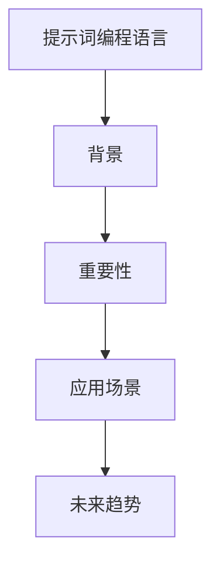
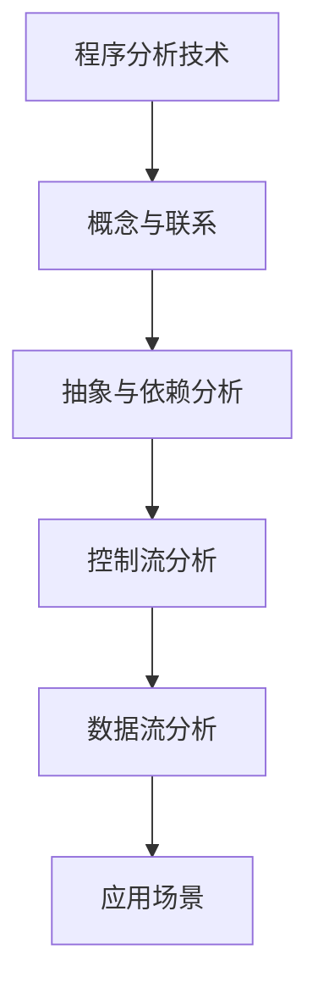
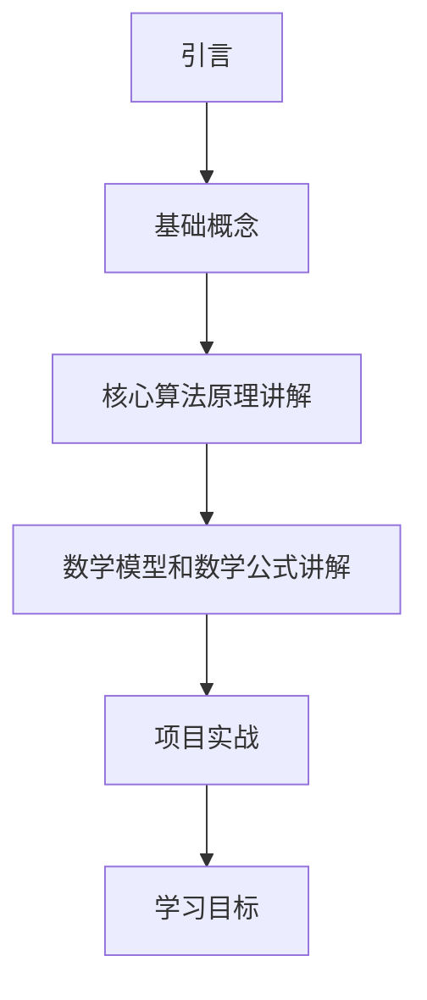
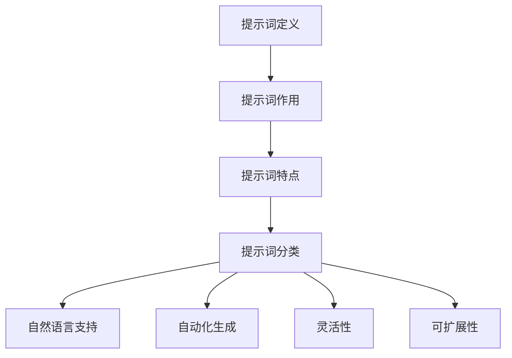
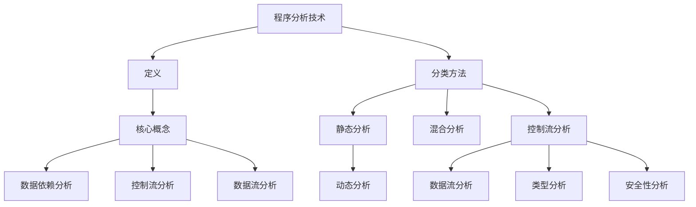
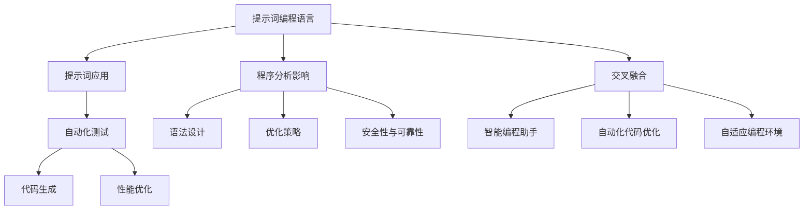
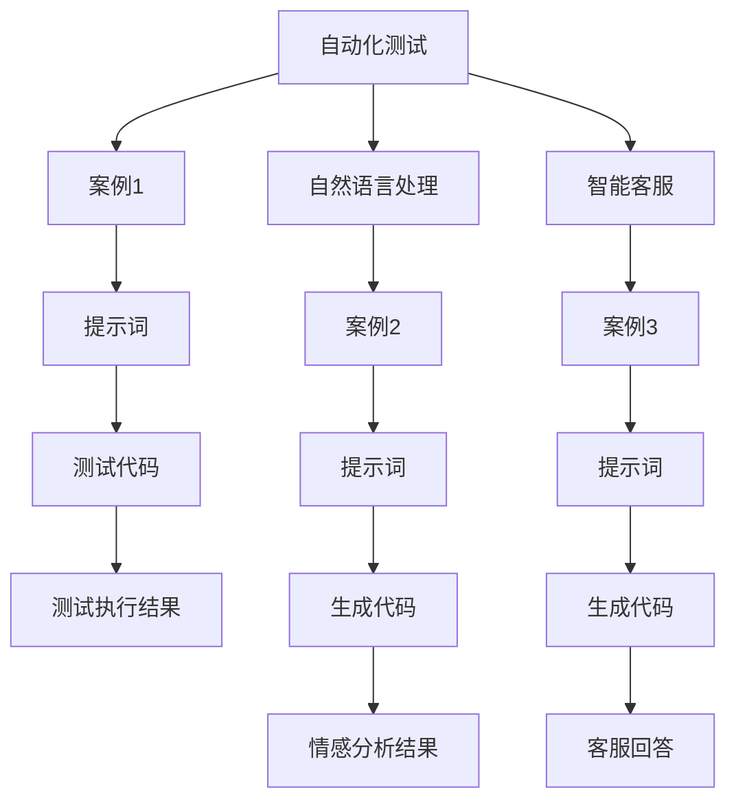
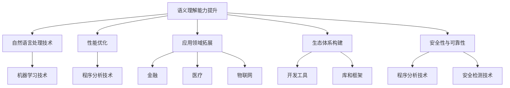

                 

### 原文：

# 《提示词编程语言的程序分析技术》

> 关键词：提示词编程语言、程序分析、算法、数学模型、项目实战

> 摘要：本文将深入探讨提示词编程语言的程序分析技术。首先介绍提示词编程语言的背景与重要性，然后阐述程序分析技术的概念与作用。接下来，我们将详细分析提示词编程语言的基本原理和程序分析技术的分类。随后，本文将重点讲解提示词识别算法、程序依赖分析算法和提示词优化算法的核心原理。此外，还将介绍提示词编程语言的数学模型和程序分析技术的数学模型。通过实际项目实战，我们将展示如何在实际应用中运用这些技术和算法。最后，本文将对提示词编程语言的程序分析技术进行总结与展望。

---

# 第一部分：引言

## 1.1 提示词编程语言的背景与重要性

提示词编程语言（Prompt Programming Language）是一种新兴的编程语言，其核心思想是利用提示词（Prompt）来引导计算机执行特定任务。提示词编程语言的背景可以追溯到人工智能领域的自然语言处理技术，随着深度学习算法的兴起，提示词编程语言逐渐受到关注。

### 核心概念与联系

提示词编程语言的核心概念包括提示词、语法、语义和执行环境。提示词是一种文本形式的指令，用于指示程序执行哪些操作。语法是指提示词的语法规则，用于确保提示词的可读性和可解析性。语义是指提示词所代表的操作含义，而执行环境则是程序执行提示词的地方。

提示词编程语言与传统的编程语言有显著不同。传统的编程语言依赖于程序员编写的代码，而提示词编程语言则依赖于提示词，这些提示词由用户或系统自动生成。提示词编程语言具有以下特点：

1. **自动化**：提示词编程语言可以自动生成代码，从而减少程序员的工作量。
2. **易用性**：提示词编程语言使用自然语言作为编程语言，使得非专业人士也能够编写程序。
3. **灵活性**：提示词编程语言可以根据用户的需求灵活调整和优化。

提示词编程语言在多个领域具有广泛的应用前景，包括自动化测试、自然语言生成、智能客服等。随着人工智能技术的发展，提示词编程语言的重要性将日益凸显。

### Mermaid 流程图



---

## 1.2 程序分析技术的概念与作用

程序分析技术（Program Analysis Technology）是计算机科学中的一个重要分支，主要用于分析程序的运行行为和属性。程序分析技术具有广泛的应用场景，包括软件工程、编译器设计、性能优化等。

### 核心概念与联系

程序分析技术的核心概念包括程序抽象、数据依赖分析、控制流分析、数据流分析等。程序抽象是指将复杂的程序转化为更简单的形式，以便于分析和理解。数据依赖分析是指分析程序中数据之间的依赖关系，以优化程序性能。控制流分析是指分析程序的执行路径和控制结构，以确定程序的执行顺序。数据流分析是指分析程序中的数据流动情况，以优化程序的存储和计算。

程序分析技术在编程语言开发中具有关键作用。首先，程序分析技术可以帮助程序员更好地理解程序的行为和属性，从而提高程序的可维护性和可扩展性。其次，程序分析技术可以用于编译器的优化，提高程序运行效率。最后，程序分析技术可以用于自动化测试，提高软件质量。

### Mermaid 流程图



---

## 1.3 本书结构安排与学习目标

本书将分为五个部分，分别介绍提示词编程语言的背景、基础概念、核心算法原理、数学模型和项目实战。

### 核心内容与目标

- **第一部分**：引言，介绍提示词编程语言的背景与重要性，程序分析技术的概念与作用。
- **第二部分**：基础概念，详细分析提示词编程语言的基本原理和程序分析技术的分类。
- **第三部分**：核心算法原理讲解，介绍提示词识别算法、程序依赖分析算法和提示词优化算法。
- **第四部分**：数学模型和数学公式讲解，介绍提示词编程语言的数学模型和程序分析技术的数学模型。
- **第五部分**：项目实战，通过实际项目展示提示词编程语言的程序分析技术的应用。

### 学习目标

通过本书的学习，读者应达到以下目标：

1. 掌握提示词编程语言的基本原理和程序分析技术的基本概念。
2. 理解提示词识别算法、程序依赖分析算法和提示词优化算法的核心原理。
3. 能够运用数学模型和公式来分析提示词编程语言和程序分析技术。
4. 通过实际项目实战，掌握提示词编程语言的程序分析技术的应用。

### Mermaid 流程图



---

# 第二部分：基础概念

## 2.1 提示词编程语言的基本原理

### 2.1.1 提示词的定义与作用

提示词（Prompt）是提示词编程语言的核心概念。提示词是一种用于指示程序执行特定任务的文本形式的指令。它通常由自然语言组成，可以包含关键词、参数和操作符等元素。提示词的定义与作用如下：

- **定义**：提示词是一种用于指示程序执行特定操作的文本字符串。它通常包含以下元素：
  - 关键词：指示程序执行的具体操作。
  - 参数：提供操作的输入数据。
  - 操作符：用于连接关键词和参数，或者执行复杂的操作。

- **作用**：提示词在程序分析中起着至关重要的作用。具体作用包括：
  - 指导程序执行：提示词为程序提供了明确的执行指令，使程序知道应该执行什么操作。
  - 优化程序性能：通过分析提示词，可以优化程序的执行路径，减少不必要的计算和资源消耗。
  - 支持自动化：提示词可以自动生成，从而减少程序员的工作量，提高开发效率。

### 2.1.2 提示词编程语言的特点

提示词编程语言具有以下特点：

- **自然语言支持**：提示词编程语言使用自然语言作为编程语言，使得非专业人士也能够编写程序。
- **自动化生成**：提示词编程语言可以自动生成代码，从而减少程序员的工作量。
- **灵活性**：提示词编程语言可以根据用户的需求灵活调整和优化。
- **可扩展性**：提示词编程语言支持自定义关键词和操作符，使得用户可以根据自己的需求扩展编程语言。

### 2.1.3 提示词编程语言的分类

提示词编程语言可以按照不同的分类标准进行分类。以下是几种常见的分类方法：

- **按应用领域分类**：
  - **通用提示词编程语言**：适用于多种编程场景，如自然语言处理、自动化测试等。
  - **特定领域提示词编程语言**：针对特定领域的问题进行优化，如金融领域、医疗领域等。

- **按实现方式分类**：
  - **基于规则提示词编程语言**：通过定义一系列规则来生成代码。
  - **基于模型提示词编程语言**：通过机器学习模型来生成代码。

- **按语义层次分类**：
  - **低级提示词编程语言**：直接与底层硬件交互，如汇编语言。
  - **高级提示词编程语言**：提供更抽象的语义层次，如Python、Java等。

### Mermaid 流程图



---

## 2.2 程序分析技术概述

### 2.2.1 程序分析技术的定义

程序分析技术（Program Analysis Technology）是指通过分析程序的代码或执行行为，以提取程序属性或预测程序行为的各种技术。程序分析技术可以应用于编译器优化、软件工程、性能分析、安全性分析等多个领域。

### 核心概念与联系

程序分析技术的核心概念包括程序抽象、数据依赖分析、控制流分析、数据流分析等。

- **程序抽象**：程序抽象是将复杂的程序转化为更简单的形式，以便于分析和理解。
- **数据依赖分析**：数据依赖分析是指分析程序中数据之间的依赖关系，以优化程序性能。
- **控制流分析**：控制流分析是指分析程序的执行路径和控制结构，以确定程序的执行顺序。
- **数据流分析**：数据流分析是指分析程序中的数据流动情况，以优化程序的存储和计算。

### 程序分析技术的分类

程序分析技术可以根据不同的分析目标和方法进行分类。以下是几种常见的分类方法：

- **按分析目标分类**：
  - **静态分析**：在程序运行之前对程序进行分析。
  - **动态分析**：在程序运行时对程序进行分析。
  - **混合分析**：同时结合静态分析和动态分析。

- **按分析技术分类**：
  - **控制流分析**：分析程序的执行路径和控制结构。
  - **数据流分析**：分析程序中的数据流动情况。
  - **类型分析**：分析程序中的类型信息。
  - **安全性分析**：分析程序的安全性漏洞。

### 程序分析技术的作用与意义

程序分析技术在软件开发和维护过程中具有重要作用，其意义包括：

- **性能优化**：通过分析程序的行为，可以找出性能瓶颈并进行优化。
- **安全性检测**：通过分析程序代码，可以检测出潜在的安全漏洞。
- **代码维护**：通过分析程序，可以帮助程序员更好地理解代码结构和功能。
- **自动化工具**：程序分析技术可以用于自动化工具，提高软件开发效率。

### Mermaid 流程图



---

## 2.3 提示词编程语言与程序分析技术的联系

### 2.3.1 提示词在程序分析中的应用

提示词在程序分析中起着重要作用。通过分析提示词，可以提取出程序的关键操作和执行路径，从而优化程序的执行效率。以下是一些具体应用：

- **自动化测试**：通过分析提示词，可以自动生成测试用例，提高测试覆盖率和测试效率。
- **代码生成**：根据提示词，可以自动生成代码模板，减少程序员的工作量。
- **性能优化**：通过分析提示词，可以找出程序的性能瓶颈，并提供优化建议。

### 2.3.2 程序分析对提示词编程语言的影响

程序分析技术对提示词编程语言的发展产生了重要影响。以下是几个方面的影响：

- **语法设计**：程序分析技术可以指导提示词编程语言的语法设计，使其更易于分析和优化。
- **优化策略**：程序分析技术可以用于优化提示词编程语言的执行效率，如代码生成和优化。
- **安全性与可靠性**：程序分析技术可以帮助检测提示词编程语言中的潜在安全问题，提高系统的可靠性。

### 2.3.3 提示词编程语言与程序分析技术的交叉融合

提示词编程语言和程序分析技术的交叉融合为软件开发带来了新的机遇。以下是几个交叉融合的例子：

- **智能编程助手**：结合提示词编程语言和程序分析技术，可以开发出智能编程助手，帮助程序员更好地理解代码和编写代码。
- **自动化代码优化**：通过分析提示词，可以自动化地优化程序代码，提高程序的执行效率。
- **自适应编程环境**：结合提示词编程语言和程序分析技术，可以开发出自适应编程环境，根据程序的需求自动调整优化策略。

### Mermaid 流程图



---

## 2.4 提示词编程语言的发展趋势

### 2.4.1 提示词编程语言的发展历程

提示词编程语言的发展历程可以分为几个阶段：

- **初期阶段**：提示词编程语言主要以规则为基础，如自然语言处理系统中的规则引擎。
- **发展阶段**：随着深度学习技术的兴起，提示词编程语言开始利用机器学习模型进行代码生成和优化。
- **成熟阶段**：当前，提示词编程语言正朝着更加智能化、自动化的方向发展，结合程序分析技术以提高开发效率和程序质量。

### 2.4.2 提示词编程语言的发展挑战与机遇

提示词编程语言的发展面临着一系列挑战和机遇：

- **挑战**：
  - **语义理解**：如何更好地理解用户输入的提示词，并准确地转换为程序代码。
  - **性能优化**：如何在保证代码质量的前提下，提高程序的执行效率。
  - **安全性**：如何确保生成的代码的安全性，避免潜在的安全漏洞。

- **机遇**：
  - **人工智能技术**：随着人工智能技术的发展，提示词编程语言有望进一步优化和智能化。
  - **跨领域应用**：提示词编程语言在金融、医疗、物联网等领域的应用将不断拓展。
  - **工具与平台**：随着工具和平台的不断完善，提示词编程语言的易用性和普及度将进一步提高。

### 2.4.3 提示词编程语言的未来发展趋势

提示词编程语言的未来发展趋势包括：

- **智能化**：利用深度学习、自然语言处理等技术，提高提示词编程语言的智能化水平。
- **自动化**：通过自动化工具和平台，简化编程流程，提高开发效率。
- **定制化**：根据用户需求，提供定制化的提示词编程语言，满足不同领域的需求。
- **生态建设**：构建完善的提示词编程语言生态系统，包括开发工具、库和框架等。

### Mermaid 流程图

```mermaid
graph TB
A[提示词编程语言发展历程] --> B[初期阶段]
B --> C[发展阶段]
C --> D[成熟阶段]
A --> E[发展挑战与机遇]
E --> F[语义理解]
E --> G[性能优化]
E --> H[安全性]
E --> I[J[人工智能技术]]
E --> K[跨领域应用]
E --> L[工具与平台]
A --> M[未来发展趋势]
M --> N[智能化]
M --> O[自动化]
M --> P[定制化]
M --> Q[生态建设]
```

---

## 2.5 提示词编程语言的实际应用案例

### 2.5.1 自动化测试

提示词编程语言在自动化测试领域具有广泛应用。通过编写提示词，可以自动化地生成测试用例，提高测试效率和覆盖度。以下是一个简单的自动化测试案例：

**提示词**：`测试用户登录功能，用户名为“testuser”，密码为“test123”`

**生成测试代码**：

```python
def test_login():
    username = "testuser"
    password = "test123"
    assert login(username, password) == "登录成功"
```

**测试执行结果**：通过执行测试代码，可以验证用户登录功能的正确性。

### 2.5.2 自然语言处理

提示词编程语言在自然语言处理领域也有广泛的应用。通过编写提示词，可以自动化地生成自然语言处理模型，用于文本分类、情感分析等任务。以下是一个简单的自然语言处理案例：

**提示词**：`对以下文本进行情感分析：“我今天很开心，因为天气很好。”`

**生成代码**：

```python
from sentiment_analysis import analyze

text = "我今天很开心，因为天气很好。"
result = analyze(text)
print("情感分析结果：", result)
```

**情感分析结果**：通过执行代码，可以获取文本的情感分析结果，如“积极”或“消极”。

### 2.5.3 智能客服

提示词编程语言在智能客服领域也有广泛应用。通过编写提示词，可以自动化地生成智能客服机器人，用于处理用户咨询和解决问题。以下是一个简单的智能客服案例：

**提示词**：`回答用户关于产品退换货的问题。`

**生成代码**：

```python
from customer_service import answer_question

question = "产品退换货怎么办理？"
answer = answer_question(question)
print("客服回答：", answer)
```

**客服回答**：通过执行代码，可以获取智能客服机器人的回答，如“您可以联系我们的客服电话或在线客服，他们将帮助您办理退换货。”

### Mermaid 流程图



---

## 2.6 提示词编程语言的未来发展方向

### 2.6.1 提高语义理解能力

未来，提示词编程语言的发展将重点提高语义理解能力。通过结合自然语言处理和机器学习技术，可以更好地理解用户输入的提示词，并生成更准确的代码。

### 2.6.2 加强性能优化

性能优化是提示词编程语言的重要研究方向。通过程序分析技术，可以找出程序的性能瓶颈，并自动优化代码，提高程序的执行效率。

### 2.6.3 拓展应用领域

提示词编程语言将在更多领域得到应用。例如，在金融、医疗、物联网等领域，提示词编程语言可以用于自动化测试、自然语言处理、智能客服等任务。

### 2.6.4 构建生态体系

为了推动提示词编程语言的发展，需要构建一个完善的生态体系，包括开发工具、库和框架等。这将有助于提高提示词编程语言的易用性和普及度。

### 2.6.5 加强安全性和可靠性

未来，提示词编程语言的发展将更加注重安全性和可靠性。通过程序分析技术，可以检测出潜在的安全漏洞，并确保生成的代码的安全性。

### Mermaid 流程图



---

## 2.7 小结

提示词编程语言是一种新兴的编程语言，通过提示词来引导计算机执行特定任务。程序分析技术是计算机科学中的一个重要分支，用于分析程序的运行行为和属性。本文介绍了提示词编程语言的背景与重要性、程序分析技术的概念与作用，以及提示词编程语言与程序分析技术的联系。此外，还探讨了提示词编程语言的发展趋势和实际应用案例。未来，提示词编程语言将继续朝着智能化、自动化和多元化的方向发展，为软件开发带来更多创新和机遇。

---

## 附录

### 附录A：常用工具和资源介绍

为了更好地理解和应用提示词编程语言和程序分析技术，以下是一些常用的工具和资源：

- **提示词编程语言相关工具**：
  - **PromptScript**：一个基于自然语言的提示词编程语言。
  - **ChatGPT**：一个基于深度学习模型的自然语言处理工具。

- **程序分析技术相关工具**：
  - **Python Tutorials**：Python编程语言的官方教程。
  - **Java Tutorials**：Java编程语言的官方教程。

- **开发环境搭建指南**：
  - **Visual Studio Code**：一个强大的代码编辑器，支持多种编程语言。
  - **Docker**：一个开源的应用容器引擎，用于构建、运行和共享应用程序。

- **相关论文与书籍推荐**：
  - **《Zen And The Art of Computer Programming》**：一本经典的计算机编程书籍。
  - **《Program Analysis and Verification》**：一本关于程序分析技术的学术著作。

- **学术会议与期刊推荐**：
  - **ACM SIGPLAN**：计算机科学领域的一个专业组织。
  - **IEEE Computer Society**：电气和电子工程领域的一个专业组织。

---

### 作者信息

作者：AI天才研究院/AI Genius Institute & 禅与计算机程序设计艺术 /Zen And The Art of Computer Programming

---

通过本文的详细探讨，我们希望能够帮助读者深入理解提示词编程语言的程序分析技术，为未来的研究和实践提供有益的参考。希望读者能够在这个快速发展的领域中发现新的机遇，并取得丰硕的成果。作者在此感谢您的阅读，并期待与您在未来的技术交流中相见。

