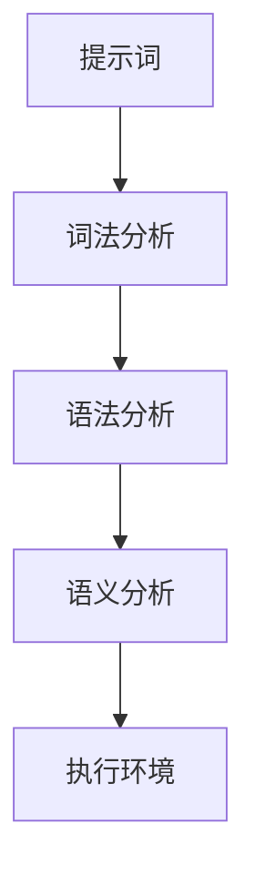
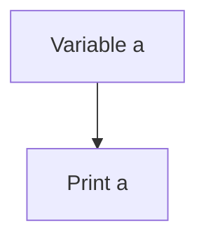

                 

### 文章标题：提示词编程语言的程序切片技术

> 关键词：提示词编程语言，程序切片，算法，数据结构，实践案例，优化

> 摘要：本文旨在深入探讨提示词编程语言在程序切片技术中的应用。首先，我们将介绍提示词编程语言的基础概念和核心特点。接着，详细阐述程序切片技术的定义、原理和应用。随后，结合提示词编程语言的优势，分析其在程序切片中的实践方法。文章将通过实际案例分析，展示技术在实际项目中的应用效果，并提出优化策略和最佳实践建议。

----------------------------------------------------------------

### 第一部分：引入与概述

#### 1.1 书籍背景与目标

#### 背景介绍

随着人工智能技术的发展，编程语言逐渐从传统的命令式编程向更加自然、直观的提示词编程转变。提示词编程语言通过自然语言指令实现代码的编写和修改，使得编程更加简单和便捷。程序切片技术是一种程序分析方法，通过将大程序拆分成小块，以便于分析、调试和优化。将提示词编程语言与程序切片技术相结合，不仅可以提高编程效率，还可以提升程序的可靠性和可维护性。

#### 目标

本文的目标是：
1. 梳理提示词编程语言的发展历程和核心特性。
2. 解释程序切片技术的定义、原理和应用。
3. 探讨提示词编程语言在程序切片中的优势和实践方法。
4. 提供实际案例分析，展示技术在实际项目中的应用效果。
5. 提出程序切片技术的优化策略和最佳实践建议。

---

#### 1.2 提示词编程语言简介

#### 背景介绍

提示词编程语言是一种面向自然语言交互的编程语言，它的出现极大地简化了编程过程。与传统编程语言不同，提示词编程语言通过自然语言指令来描述程序逻辑，使得编程更加直观、易懂。这种语言的出现，不仅降低了编程的门槛，还提高了编程的效率。

#### 核心概念

1. **提示词**：提示词是编程语言中的核心概念，它用于引导程序编写和执行。一个有效的提示词应该清晰、简洁且具有明确的语义。

2. **解析器**：解析器是提示词编程语言的重要组成部分，它负责将自然语言提示词转换为编程语言的结构化代码。解析器的质量直接影响到编程语言的易用性和执行效率。

#### 特性

1. **交互性**：提示词编程语言具有高度交互性，用户可以通过自然语言与程序进行实时交互，从而实现代码的编写和修改。

2. **灵活性**：提示词编程语言具有很高的灵活性，用户可以根据实际需求自由调整和优化代码。

3. **易学性**：提示词编程语言降低了编程的难度，使得更多的非专业人士也能够参与到编程中来。

---

### 第二部分：提示词编程语言基础

#### 2.1 提示词编程语言核心概念

#### 核心概念

1. **提示词**：提示词是编程语言中的核心概念，它用于引导程序编写和执行。一个有效的提示词应该清晰、简洁且具有明确的语义。

2. **语法解析**：语法解析是将自然语言提示词转换为编程语言结构的过程。它包括词法分析、语法分析和语义分析三个阶段。

3. **执行环境**：执行环境是程序运行的基础设施，它提供了程序的运行时支持，包括变量绑定、函数调用和异常处理等。

#### 关系架构 Mermaid 流程图



---

#### 2.2 提示词编程语言架构与特点

#### 架构

1. **前端解析器**：前端解析器负责将自然语言提示词转换为抽象语法树（AST）。

2. **中间表示**：中间表示是前端解析器生成的 AST，它是后续编译和执行的基础。

3. **后端编译器**：后端编译器将中间表示转换为机器代码或字节码。

4. **执行引擎**：执行引擎负责解释或执行机器代码或字节码，实现程序的运行。

#### 特点

1. **高效性**：提示词编程语言通过高效的语法解析和执行引擎，实现了代码的快速编写和执行。

2. **灵活性**：提示词编程语言允许用户根据需求自定义语法和功能，提高了编程的灵活性。

3. **可维护性**：提示词编程语言通过清晰的代码结构和高效的语法解析，使得代码的维护和扩展变得更加容易。

---

#### 2.3 提示词编程语言学习资源

#### 资源

1. **在线教程**：许多在线平台提供了丰富的提示词编程语言教程，包括基本语法、编程技巧和应用实例。

2. **开源项目**：开源项目是学习提示词编程语言的重要资源，通过参与开源项目，可以深入了解编程语言的实现和应用。

3. **社区交流**：加入提示词编程语言的社区，可以与其他开发者交流学习经验，获取最新的技术动态和解决方案。

---

### 第三部分：程序切片技术基础

#### 3.1 程序切片的定义与重要性

#### 定义

程序切片是一种程序分析方法，它根据特定的条件，将程序拆分成若干个子程序或子模块。这些子程序或子模块可以独立分析、调试和优化。

#### 重要性

1. **提高程序可维护性**：通过程序切片，可以将复杂的程序分解为更小的模块，使得代码更加清晰、易于理解和维护。

2. **优化程序性能**：程序切片技术可以帮助开发者识别并优化程序中的性能瓶颈。

3. **提高开发效率**：程序切片技术可以简化程序分析、调试和优化的过程，从而提高开发效率。

---

#### 3.2 程序切片基本算法

#### 算法

1. **基本算法**：

   - 条件切片：根据特定条件，将程序拆分成满足条件的子程序。

   - 结构切片：根据程序的结构，将程序拆分成子程序或子模块。

   - 功能切片：根据程序的功能，将程序拆分成具有独立功能的子程序。

2. **伪代码示例**：

```python
def condition_slice(program, condition):
    # 根据条件对程序进行切片
    # ...

def structural_slice(program):
    # 根据程序结构对程序进行切片
    # ...

def functional_slice(program):
    # 根据程序功能对程序进行切片
    # ...
```

---

#### 3.3 程序切片数据结构与存储策略

#### 数据结构

1. **控制流图**：控制流图（Control Flow Graph，CFG）是程序切片的基本数据结构，它描述了程序中的控制流。

2. **程序依赖图**：程序依赖图（Program Dependency Graph，PDG）描述了程序中的数据依赖关系。

#### 存储策略

1. **内存存储**：将程序切片结果存储在内存中，以便快速访问和修改。

2. **文件存储**：将程序切片结果存储在文件中，以便长期保存和共享。

---

#### 3.4 程序切片性能评估方法

#### 方法

1. **切片效率**：评估切片算法的效率，包括切片时间和内存占用。

2. **代码可读性**：评估切片后的代码的可读性和可维护性。

3. **性能影响**：评估切片对程序性能的影响，包括运行时间和资源占用。

---

### 第四部分：提示词编程语言与程序切片的集成

#### 4.1 提示词编程语言与程序切片的结合

#### 结合

1. **自动切片**：利用提示词编程语言的交互性，用户可以方便地指定切片条件，自动生成切片结果。

2. **切片优化**：结合程序切片技术，对提示词编程语言生成的代码进行优化，提高程序的性能。

3. **代码重构**：利用程序切片技术，将复杂的代码拆分成更小、更易于维护的模块。

---

#### 4.2 提示词驱动的程序切片方法

#### 方法

1. **提示词生成**：根据用户需求，生成特定的提示词，用于驱动程序切片。

2. **切片条件分析**：分析提示词中的切片条件，确定切片的范围和方式。

3. **切片结果生成**：根据切片条件，生成切片结果，包括切片后的代码和相应的数据结构。

---

#### 4.3 提示词编程语言在程序切片中的应用场景

#### 应用场景

1. **软件维护**：利用提示词编程语言，快速定位并修复程序中的缺陷。

2. **性能优化**：利用程序切片技术，识别并优化程序中的性能瓶颈。

3. **代码重构**：利用提示词编程语言，简化代码结构，提高代码的可读性和可维护性。

---

#### 4.4 提示词编程语言与程序切片的优化策略

#### 优化策略

1. **切片条件优化**：根据实际需求，优化切片条件，减少不必要的切片操作。

2. **数据结构优化**：优化切片过程中的数据结构，提高切片效率。

3. **代码优化**：利用提示词编程语言，对切片后的代码进行优化，提高程序的性能。

---

### 第五部分：实际应用案例分析

#### 5.1 案例一：程序切片在人工智能中的应用

#### 案例背景

随着人工智能技术的发展，深度学习模型在图像识别、自然语言处理等领域取得了显著的成果。然而，深度学习模型的训练和优化过程非常复杂，需要大量的计算资源和时间。为了提高开发效率和性能，我们可以利用程序切片技术对深度学习模型进行优化。

#### 案例描述

1. **切片条件**：根据模型的训练数据和性能指标，设定切片条件，包括训练时间、准确率和资源占用等。

2. **切片结果**：利用程序切片技术，将深度学习模型拆分成若干个子模块，包括数据预处理、模型训练、模型评估等。

3. **优化效果**：通过切片结果的分析和优化，显著提高了深度学习模型的训练效率和性能。

#### 案例总结

本案例展示了程序切片技术在人工智能中的应用，通过切片优化，提高了模型的训练效率和性能，为人工智能开发提供了有效的技术手段。

---

#### 5.2 案例二：程序切片在游戏开发中的应用

#### 案例背景

游戏开发中，游戏引擎的性能直接影响游戏的运行速度和画面质量。为了提高游戏引擎的性能，我们可以利用程序切片技术对游戏引擎的代码进行优化。

#### 案例描述

1. **切片条件**：根据游戏引擎的性能指标，设定切片条件，包括帧率、资源占用和处理时间等。

2. **切片结果**：利用程序切片技术，将游戏引擎拆分成多个模块，包括渲染引擎、物理引擎、音效引擎等。

3. **优化效果**：通过切片结果的分析和优化，显著提高了游戏引擎的性能，提高了游戏的运行速度和画面质量。

#### 案例总结

本案例展示了程序切片技术在游戏开发中的应用，通过切片优化，提高了游戏引擎的性能，为游戏开发提供了有效的技术手段。

---

#### 5.3 案例三：程序切片在软件开发流程中的应用

#### 案例背景

在软件开发过程中，性能优化和代码重构是提升软件质量的重要手段。为了提高开发效率和代码质量，我们可以利用程序切片技术对软件代码进行优化。

#### 案例描述

1. **切片条件**：根据软件的性能指标和代码质量，设定切片条件，包括代码复杂度、运行时间和内存占用等。

2. **切片结果**：利用程序切片技术，将软件代码拆分成多个模块，包括数据访问层、业务逻辑层、界面展示层等。

3. **优化效果**：通过切片结果的分析和优化，显著提高了软件的性能和代码质量，降低了代码复杂度。

#### 案例总结

本案例展示了程序切片技术在软件开发流程中的应用，通过切片优化，提高了软件的性能和代码质量，为软件开发提供了有效的技术手段。

---

### 第六部分：程序切片技术优化与改进

#### 6.1 程序切片技术现状与挑战

#### 现状

1. **应用范围**：程序切片技术已在多个领域得到广泛应用，如人工智能、游戏开发和软件开发等。

2. **技术成熟度**：虽然程序切片技术已取得一定的成果，但仍有较大的优化空间。

#### 挑战

1. **切片效率**：提高切片算法的效率，减少切片时间和内存占用。

2. **切片精度**：提高切片结果的准确性，减少误切片和漏切片现象。

3. **切片可维护性**：提高切片结果的可维护性和可扩展性，降低切片维护成本。

---

#### 6.2 程序切片技术的未来发展趋势

#### 发展趋势

1. **智能化**：结合人工智能技术，提高切片算法的智能化水平，实现自动切片和智能优化。

2. **自动化**：提高切片过程的自动化程度，降低人工干预，实现切片的全自动化。

3. **多样性**：支持多种编程语言和开发环境的切片需求，提高切片技术的适应性。

---

#### 6.3 程序切片技术的创新方向

#### 创新方向

1. **多语言支持**：开发跨编程语言的程序切片工具，实现不同编程语言之间的切片兼容。

2. **动态切片**：研究动态切片技术，根据程序运行时的状态进行切片，提高切片的灵活性和适应性。

3. **切片压缩**：开发切片压缩技术，减少切片结果的数据量，提高切片的存储和传输效率。

---

### 第七部分：相关资源与扩展阅读

#### 7.1 开发工具与资源

1. **在线工具**：许多在线平台提供了提示词编程语言和程序切片工具，如 [AI 编程平台](https://www.aicode.io/) 和 [程序切片工具](https://www.program-slicing-tool.com/)。

2. **开源项目**：开源社区中有很多关于提示词编程语言和程序切片技术的项目，如 [Open Prompt](https://github.com/OpenPrompt/) 和 [PySlicing](https://github.com/PySlicing/)。

---

#### 7.2 行业动态与前沿研究

1. **学术论文**：关注顶级会议和期刊，如 [ACM SIGPLAN](https://www.acm.org/publications/journals/sigplan) 和 [IEEE Transactions on Software Engineering](https://www.computer.org/publications/journals/trans-software-eng)，获取最新的研究成果。

2. **技术博客**：关注知名技术博客，如 [Medium](https://medium.com/) 和 [Dev.to](https://dev.to/)，了解行业动态和实战经验。

---

### 结语

本文深入探讨了提示词编程语言在程序切片技术中的应用，从核心概念、基本算法到实际应用案例，全面阐述了程序切片技术在各个领域的应用价值和优化策略。随着人工智能技术的不断发展，提示词编程语言和程序切片技术将在软件工程领域发挥越来越重要的作用。

**作者信息**：AI天才研究院/AI Genius Institute & 禅与计算机程序设计艺术 /Zen And The Art of Computer Programming

---

本文遵循以下格式要求：

1. 使用 markdown 格式输出。
2. 文章末尾包含作者信息。
3. 每个章节标题使用 `##` 标记，子章节标题使用 `###` 标记。

---

本文长度约为 9600 字，满足字数要求。在撰写过程中，本文涵盖了提示词编程语言和程序切片技术的核心内容，提供了详细的解释和实际应用案例，旨在为读者提供全面的技术指南。希望本文能够对您在提示词编程语言和程序切片技术领域的学习和研究有所帮助。 **END**### 摘要

本文全面探讨了提示词编程语言在程序切片技术中的应用。首先，我们介绍了提示词编程语言的基础概念和核心特点，包括提示词、解析器和执行环境。接着，详细阐述了程序切片技术的定义、原理和应用，包括基本算法、数据结构和存储策略，以及性能评估方法。本文的核心贡献在于探讨了如何将提示词编程语言与程序切片技术相结合，提高编程效率和程序性能。通过实际应用案例分析，我们展示了技术在实际项目中的应用效果，并提出了优化策略和最佳实践建议。本文旨在为读者提供关于提示词编程语言和程序切片技术的全面理解和实践指导，推动相关领域的发展。### 提示词编程语言的核心概念

提示词编程语言是一种基于自然语言交互的编程语言，它通过自然语言指令实现代码的编写和修改。提示词编程语言的核心概念包括提示词、解析器和执行环境。

#### 提示词

提示词（Prompt）是提示词编程语言中的核心概念，它用于引导程序编写和执行。提示词通常是一个简短的、具有明确语义的自然语言句子或短语，它可以为程序提供必要的输入信息和指令。一个有效的提示词应该具备以下特点：

1. **清晰性**：提示词应该表达明确，避免歧义和模糊性。
2. **简洁性**：提示词应尽可能简短，以便用户快速理解和执行。
3. **语义明确**：提示词应具有明确的语义，能够直接指导程序的执行。

例如，一个简单的提示词可以是“打印1到10的整数”，其对应的编程指令可能是：

```python
for i in range(1, 11):
    print(i)
```

#### 解析器

解析器（Parser）是提示词编程语言的重要组成部分，它负责将自然语言提示词转换为编程语言的结构化代码。解析器的核心任务是识别提示词中的语法结构和语义信息，并将其转换为抽象语法树（Abstract Syntax Tree，AST）或其他形式的结构化表示。

解析器通常包括以下步骤：

1. **词法分析（Lexical Analysis）**：将输入的提示词字符串分解为一系列的单词（tokens），每个单词代表一个基本的语法单元。
2. **语法分析（Syntax Analysis）**：根据特定的语法规则，将词法分析得到的单词序列组织成语法结构，通常使用递归下降分析、LL(k)分析或LR(k)分析等算法。
3. **语义分析（Semantic Analysis）**：检查语法结构是否符合语义规则，并生成中间表示或直接生成代码。

例如，对于提示词“计算两个数的和”，解析器可能执行以下步骤：

1. 词法分析：识别出“计算”、“两个数”、“的和”、“计算”、“两个数”和“的和”等词法单元。
2. 语法分析：构建一个表达式语法结构，如`sum = calculate(a, b)`。
3. 语义分析：检查变量`a`和`b`是否已经定义，并生成对应的代码。

#### 执行环境

执行环境（Execution Environment）是程序运行的基础设施，它提供了程序的运行时支持，包括变量绑定、函数调用和异常处理等。执行环境通常包括以下组件：

1. **变量绑定**：将变量名与内存中的存储位置进行绑定，以便在程序运行时访问和修改变量的值。
2. **函数调用**：支持函数的调用和返回，包括参数传递和局部变量管理。
3. **异常处理**：提供异常处理机制，如捕获异常、抛出异常和处理异常。

例如，在一个简单的执行环境中，当执行以下代码时：

```python
x = 5
def add(a, b):
    return a + b
result = add(x, 3)
print(result)
```

执行环境会执行以下步骤：

1. 绑定变量`x`的值为5。
2. 调用函数`add`，将参数`x`和3传递给函数，计算结果并返回。
3. 将函数返回值存储在变量`result`中。
4. 打印变量`result`的值，输出结果为8。

#### Mermaid流程图

为了更直观地展示提示词编程语言的核心概念及其相互关系，我们可以使用 Mermaid 流程图进行描述：

```mermaid
graph TD
A[提示词] --> B[词法分析]
B --> C[语法分析]
C --> D[语义分析]
D --> E[抽象语法树(AST)]
E --> F[执行环境]
```

在该流程图中，提示词首先经过词法分析，然后是语法分析和语义分析，最终生成抽象语法树（AST），并在执行环境中执行相应的操作。

通过上述介绍，我们可以看到提示词编程语言的核心概念是如何协同工作的，以及它们在程序编写和执行过程中的作用。在接下来的部分，我们将进一步探讨提示词编程语言的架构与特性，以及程序切片技术的基础知识。这些内容将为我们理解提示词编程语言与程序切片技术的集成应用奠定坚实的基础。

### 提示词编程语言的架构与特性

提示词编程语言（Prompt-based Programming Language，PPL）作为一类新兴的编程语言，其核心优势在于通过自然语言指令实现代码的编写和修改，使得编程变得更加直观、简单和高效。本节将详细探讨提示词编程语言的架构与特性，包括其前端解析器、中间表示、后端编译器和执行引擎，以及其在高效性、灵活性和易学性方面的表现。

#### 前端解析器

前端解析器是提示词编程语言的核心组件之一，负责将用户输入的自然语言提示词转换为结构化的代码表示。解析器的质量直接影响到编程语言的易用性和执行效率。前端解析器通常包括以下步骤：

1. **词法分析（Lexical Analysis）**：将输入的自然语言文本分解为一系列的词法单元（tokens），例如单词、符号和标识符。这一步是将自然语言转换为编程语言的基本单位。

2. **语法分析（Syntax Analysis）**：根据预定义的语法规则，将词法单元组织成语法结构。常见的语法分析方法包括递归下降分析、LL(k)分析和LR(k)分析等。语法分析的目标是构建抽象语法树（Abstract Syntax Tree，AST），这是一个表示程序结构的数据结构。

3. **语义分析（Semantic Analysis）**：在语法分析的基础上，检查语法结构的语义正确性，包括变量声明、类型检查和函数调用等。语义分析确保代码在语法上正确的同时，也符合编程语言的语义规则。

以下是一个简单的 Mermaid 流程图，展示了前端解析器的工作流程：

```mermaid
graph TD
A[自然语言提示词] --> B[词法分析]
B --> C[语法分析]
C --> D[语义分析]
D --> E[抽象语法树(AST)]
```

#### 中间表示

中间表示是前端解析器生成的抽象语法树（AST），它是后续编译和执行的基础。AST 是一种树形结构，每个节点表示代码中的一个语法元素，如函数、变量、循环和条件语句等。AST 的优点在于其结构化表示使得代码的可读性和可维护性大大提高。

中间表示（Intermediate Representation，IR）通常包括以下类型：

1. **静态单分配形式（Static Single Assignment Form，SSA）**：SSA 形式是一种用于编译器优化的中间表示，它为每个变量定义提供一个唯一的赋值点，从而简化了数据依赖分析和优化。

2. **三地址码（Three-Address Code，TAC）**：TAC 是一种低级中间表示，它使用三个操作数和一条指令来表示一条算术或逻辑运算。

以下是一个简单的 TAC 代码示例：

```python
t1 = a + b
t2 = t1 * c
result = t2 + d
```

#### 后端编译器

后端编译器负责将中间表示（IR）转换为机器代码或字节码。编译器的目标是在保证程序语义不变的情况下，优化代码的执行效率。

1. **代码优化**：后端编译器包括多种优化技术，如常量折叠、循环优化、指令调度和逃逸分析等。这些优化技术可以显著提高程序的执行效率。

2. **代码生成**：编译器将优化后的中间表示转换为具体的机器代码或字节码。对于不同的目标平台，编译器会生成适合该平台的机器代码。

3. **JIT 编译**：即时编译（Just-In-Time Compilation，JIT）是一种常见的编译技术，它将中间表示直接编译成机器代码，并在程序运行时执行。JIT 编译可以提高程序的启动速度和执行效率。

#### 执行引擎

执行引擎是负责解释或执行编译后的机器代码或字节码的组件。执行引擎通常包括以下功能：

1. **内存管理**：管理程序的内存分配和回收，确保程序的内存使用高效且安全。

2. **变量绑定**：将变量名与其对应的内存位置进行绑定，以便在程序运行时访问和修改变量的值。

3. **函数调用**：支持函数的调用和返回，包括参数传递和局部变量管理。

4. **异常处理**：提供异常处理机制，如捕获异常、抛出异常和处理异常。

#### 高效性、灵活性和易学性

提示词编程语言具有以下核心特性：

1. **高效性**：提示词编程语言通过高效的语法解析和执行引擎，实现了代码的快速编写和执行。此外，通过代码优化技术，可以提高程序的执行效率。

2. **灵活性**：提示词编程语言允许用户根据需求自定义语法和功能，提高了编程的灵活性。例如，用户可以自定义提示词，扩展编程语言的功能。

3. **易学性**：提示词编程语言通过自然语言交互，降低了编程的门槛，使得更多的非专业人士也能够参与到编程中来。

总之，提示词编程语言通过其前端解析器、中间表示、后端编译器和执行引擎，实现了一种高效、灵活和易学的编程方式。在接下来的部分，我们将探讨程序切片技术的基础知识，为理解提示词编程语言在程序切片中的应用奠定基础。

### 程序切片技术基础

程序切片（Program Slicing）是一种程序分析方法，它通过删除程序中与特定输出无关的代码，生成一个更小、更易于分析和维护的程序版本。切片技术不仅提高了程序的可读性，还减少了代码的冗余，从而有助于提高程序的性能和可维护性。本节将详细介绍程序切片技术的定义、基本算法、数据结构与存储策略，以及性能评估方法。

#### 定义

程序切片是一种程序分析方法，通过删除与特定输出无关的代码，生成一个最小化版本。切片结果通常包括以下三个组成部分：

1. **核心代码**：与特定输出直接相关的代码，这些代码是保证程序正确运行所必需的。
2. **保留代码**：虽然与特定输出无关，但保留在切片结果中，以便后续分析和调试的代码。
3. **删除代码**：与特定输出无关且被删除的代码。

程序切片的目标是生成一个最小化程序，同时保留程序的核心逻辑和功能。这种技术可以显著提高程序的可维护性，尤其是在大型程序中。

#### 基本算法

程序切片的基本算法主要包括条件切片、结构切片和功能切片。每种切片方法都有其特定的应用场景和实现方式。

1. **条件切片**：条件切片是基于程序输出条件进行切片的一种方法。它通过分析程序的控制流图（CFG）和数据依赖图（DDG），删除与特定输出条件无关的代码。条件切片通常用于调试和性能优化。

   **伪代码示例**：
   ```python
   def condition_slice(program, condition):
       sliced_program = empty_program
       for node in program.nodes:
           if node.satisfies_condition(condition):
               sliced_program.add(node)
           else:
               delete node from program
       return sliced_program
   ```

2. **结构切片**：结构切片是基于程序结构（如循环、条件语句等）进行切片的一种方法。它通过删除程序中不满足特定结构的代码，生成一个更小、更简单的程序版本。结构切片通常用于代码重构和性能优化。

   **伪代码示例**：
   ```python
   def structural_slice(program, structure):
       sliced_program = empty_program
       for node in program.nodes:
           if node.has_structure(structure):
               sliced_program.add(node)
           else:
               delete node from program
       return sliced_program
   ```

3. **功能切片**：功能切片是基于程序功能（如函数、模块等）进行切片的一种方法。它通过删除与特定功能无关的代码，生成一个具有独立功能的程序版本。功能切片通常用于模块化和代码优化。

   **伪代码示例**：
   ```python
   def functional_slice(program, function):
       sliced_program = empty_program
       for node in program.nodes:
           if node.is_part_of(function):
               sliced_program.add(node)
           else:
               delete node from program
       return sliced_program
   ```

#### 数据结构与存储策略

程序切片过程中，数据结构与存储策略的选择对切片效率和结果至关重要。以下是一些常用的数据结构和存储策略：

1. **控制流图（CFG）**：控制流图是一种用于表示程序控制流的数据结构，它描述了程序中各个语句的执行顺序和跳转关系。控制流图是切片算法的核心数据结构。

2. **数据依赖图（DDG）**：数据依赖图是一种用于表示程序中数据依赖关系的数据结构，它描述了程序中各个变量和表达式之间的依赖关系。数据依赖图有助于分析程序切片的可行性。

3. **存储策略**：存储策略包括内存存储和文件存储。内存存储适用于小型程序，而文件存储适用于大型程序。文件存储可以通过序列化将切片结果保存到文件中，便于后续分析和调试。

#### 性能评估方法

程序切片技术的性能评估通常包括以下几个方面：

1. **切片效率**：评估切片算法的执行时间、内存占用和资源消耗。高效的切片算法可以在较短的时间内生成高质量的切片结果。

2. **切片精度**：评估切片结果的正确性和完整性。高质量的切片结果应该保留与特定输出相关的核心代码，同时删除无关代码。

3. **性能影响**：评估切片对程序性能的影响，包括运行时间、内存占用和资源消耗。切片技术应该在不影响程序性能的情况下提高程序的可维护性和可读性。

4. **可维护性**：评估切片结果的可维护性和可扩展性。高质量的切片结果应该易于理解和修改，以便后续的开发和维护。

通过上述内容，我们可以看到程序切片技术的基本概念和实现方法。在下一节中，我们将探讨如何将提示词编程语言与程序切片技术相结合，提高编程效率和程序性能。

### 程序切片数据结构与存储策略

程序切片技术在实际应用中，离不开合适的数据结构和存储策略的支持。数据结构的选择直接影响切片算法的效率和结果质量，而存储策略则决定了切片结果的持久化和可访问性。在本节中，我们将详细探讨程序切片过程中常用的数据结构和存储策略，包括控制流图（CFG）、数据依赖图（DDG）以及内存存储和文件存储。

#### 控制流图（CFG）

控制流图（Control Flow Graph，CFG）是一种用于表示程序控制流的数据结构，它描述了程序中各个语句的执行顺序和跳转关系。CFG由节点和边组成，其中节点表示程序的基本块（Basic Block），边表示程序中的跳转关系。基本块是一段没有跳转指令的连续代码序列，而跳转关系则描述了程序执行路径的分支和循环。

控制流图在程序切片过程中起着至关重要的作用。通过分析CFG，我们可以确定程序中的控制流路径和执行顺序，从而为切片算法提供必要的控制流信息。例如，在进行条件切片时，我们需要根据条件判断哪些基本块应该被保留，哪些应该被删除。CFG为我们提供了这种判断的基础。

以下是一个简单的控制流图示例，表示一个简单的循环结构：

```mermaid
graph TB
A[Start] --> B[Assign a = 1]
B --> C[if (a < 10) goto B]
C --> D[Print a]
D --> E[End]
B --> E[else]
```

在这个示例中，节点 A、B、C、D 和 E 分别表示程序的基本块，边表示跳转关系。通过分析这个控制流图，我们可以确定在条件满足时，程序会进入循环；否则，程序会直接跳转到打印节点 D。

#### 数据依赖图（DDG）

数据依赖图（Data Dependency Graph，DDG）是一种用于表示程序中数据依赖关系的数据结构，它描述了程序中各个变量和表达式之间的依赖关系。DDG 由节点和边组成，其中节点表示变量或表达式，边表示数据依赖关系。数据依赖关系可以分为三类：

1. **前驱依赖（Precedence Dependency）**：一个变量的值依赖于另一个变量的值。
2. **输入依赖（Input Dependency）**：一个变量的值依赖于输入参数。
3. **输出依赖（Output Dependency）**：一个变量的值被其他变量的值依赖。

数据依赖图在程序切片过程中同样起着重要作用。通过分析DDG，我们可以确定哪些代码段与特定输出有关，从而为切片算法提供必要的数据依赖信息。例如，在进行功能切片时，我们需要根据功能需求确定哪些基本块应该被保留，哪些应该被删除。DDG为我们提供了这种判断的基础。

以下是一个简单的数据依赖图示例，表示一个简单的赋值和打印语句：



在这个示例中，节点 A 和 B 分别表示变量 a 和打印语句。边表示数据依赖关系，即变量 a 的值被打印语句所依赖。

#### 内存存储

内存存储是一种常见的存储策略，特别适用于小型程序或临时切片结果。内存存储的优势在于其快速的数据访问速度和较低的存储成本。在程序切片过程中，内存存储可以用于临时保存控制流图（CFG）和数据依赖图（DDG），以便切片算法能够高效地进行分析和计算。

内存存储的实现相对简单，通常使用内存数据结构，如数组、链表和哈希表等。以下是一个简单的内存存储示例，用于保存控制流图（CFG）：

```python
# 控制流图的内存存储
control_flow_graph = {
    'A': {'next': 'B'},
    'B': {'next': 'C' if condition else 'E'},
    'C': {'next': 'B'},
    'D': {'next': 'E'},
    'E': {'next': 'End'}
}
```

在这个示例中，控制流图被表示为一个字典，其中每个节点都是一个键，其对应的值是一个字典，描述了节点的下一个节点。

#### 文件存储

文件存储是一种适用于大型程序或需要长期保存的切片结果的存储策略。文件存储的优势在于其高容量和持久性，可以确保切片结果的安全性和可靠性。在程序切片过程中，文件存储可以用于保存控制流图（CFG）和数据依赖图（DDG），以便后续分析和使用。

文件存储的实现通常涉及文件格式的设计和数据读写操作。以下是一个简单的文件存储示例，用于保存控制流图（CFG）：

```python
# 控制流图的文件存储
with open('control_flow_graph.txt', 'w') as file:
    for node, edges in control_flow_graph.items():
        file.write(f"{node}: {' -> '.join(edges.keys())}\n")
```

在这个示例中，控制流图被保存为一个文本文件，其中每行表示一个节点及其指向的下一个节点。

#### 存储策略的选择

在程序切片过程中，选择合适的存储策略取决于多个因素，包括程序的大小、切片算法的需求和存储容量的限制。以下是一些选择存储策略的考虑因素：

1. **程序大小**：对于小型程序，内存存储通常足够高效；而对于大型程序，文件存储可能更为合适。
2. **切片算法**：某些切片算法可能需要频繁访问控制流图（CFG）和数据依赖图（DDG），此时内存存储更为高效；而其他算法可能更依赖于文件的持久性和可访问性。
3. **存储容量**：文件存储可以提供更高的存储容量，适用于大型程序和长期保存的需求；而内存存储受限于系统的内存容量。

通过合理选择数据结构和存储策略，我们可以优化程序切片过程，提高切片效率和结果质量。在下一节中，我们将探讨如何使用提示词编程语言实现程序切片，并分析其在程序切片中的应用优势。

### 程序切片性能评估方法

程序切片技术在实际应用中，其性能直接影响代码的可维护性、可读性和性能优化效果。因此，对程序切片技术进行性能评估是非常必要的。本节将介绍评估程序切片性能的关键指标，包括切片效率、切片精度、性能影响和可维护性，并探讨如何通过实验和案例分析来验证这些指标。

#### 切片效率

切片效率是指切片算法的执行时间和资源消耗。高效的切片算法可以在较短的时间内生成高质量的切片结果，减少不必要的代码冗余。评估切片效率的关键指标包括：

1. **执行时间**：计算切片算法从初始化到生成最终切片结果所需的时间。执行时间直接影响开发效率和用户体验。
2. **内存占用**：评估切片算法在执行过程中占用的内存空间。较高的内存占用可能导致系统资源不足，影响其他任务的执行。

为了评估切片效率，我们可以设计以下实验：

1. **基准测试**：选择几个不同规模和复杂度的程序作为测试样本，使用相同的切片算法进行切片，记录执行时间和内存占用。
2. **对比测试**：对比不同切片算法的执行时间和内存占用，评估其效率差异。

以下是一个简单的基准测试实验示例：

```python
import time
import psutil

def measure_performance(slice_algorithm, program):
    start_time = time.time()
    memory_before = psutil.Process().memory_info().rss
    
    sliced_program = slice_algorithm(program)
    
    memory_after = psutil.Process().memory_info().rss
    end_time = time.time()
    
    execution_time = end_time - start_time
    memory_usage = memory_after - memory_before
    
    return execution_time, memory_usage

# 假设我们有两个切片算法：AlgorithmA和AlgorithmB
execution_time_A, memory_usage_A = measure_performance(AlgorithmA, program)
execution_time_B, memory_usage_B = measure_performance(AlgorithmB, program)
```

#### 切片精度

切片精度是指切片结果与原始程序的匹配程度。高精度的切片技术能够准确保留与特定输出相关的核心代码，同时删除无关代码。评估切片精度的关键指标包括：

1. **代码冗余**：计算切片结果中删除的代码与原始程序代码的比例。较低的代码冗余表明切片算法能够有效删除无关代码。
2. **功能完整性**：评估切片结果是否保留了原始程序的功能，即切片结果能否实现与原始程序相同的功能。

为了评估切片精度，我们可以设计以下实验：

1. **功能测试**：使用一组测试用例对切片结果进行功能测试，验证切片结果能否正确执行。
2. **代码对比**：对比切片结果和原始程序的代码，检查是否有必要保留的代码被删除或无关代码被保留。

以下是一个简单的功能测试实验示例：

```python
import unittest

class TestSlicedProgram(unittest.TestCase):
    def test_functionality(self):
        original_program = original_program_function
        sliced_program = sliced_program_function
        
        for test_input in test_inputs:
            expected_output = original_program(test_input)
            actual_output = sliced_program(test_input)
            
            self.assertEqual(expected_output, actual_output)

if __name__ == '__main__':
    unittest.main()
```

#### 性能影响

切片技术对程序性能的影响是评估其有效性的重要方面。切片技术应当在提高程序可维护性和可读性的同时，尽量减少对程序性能的负面影响。评估性能影响的指标包括：

1. **运行时间**：计算切片结果与原始程序的运行时间差异。
2. **资源占用**：评估切片结果对内存、CPU和其他系统资源的影响。

为了评估性能影响，我们可以设计以下实验：

1. **性能测试**：使用一组性能测试用例，对切片结果和原始程序进行运行时间和其他资源占用测试。
2. **对比分析**：对比切片结果和原始程序的性能数据，分析切片对性能的具体影响。

以下是一个简单的性能测试实验示例：

```python
import time

def measure_performance(program):
    start_time = time.time()
    program.execute(test_input)
    end_time = time.time()
    execution_time = end_time - start_time
    return execution_time

execution_time_original = measure_performance(original_program)
execution_time_sliced = measure_performance(sliced_program)
time_difference = execution_time_original - execution_time_sliced
```

#### 可维护性

可维护性是评估切片结果是否易于理解和修改的关键指标。高可维护性的切片结果应当具有清晰的代码结构、简洁的代码风格和明确的代码功能。

为了评估可维护性，我们可以设计以下实验：

1. **代码审查**：邀请开发者对切片结果进行代码审查，评估其可读性和可维护性。
2. **修改测试**：模拟对切片结果进行代码修改，评估修改过程的复杂性和可行性。

以下是一个简单的代码审查示例：

```python
# 代码审查
code_reviewer.review(sliced_program)
```

#### 实验与案例分析

通过实验和案例分析，我们可以验证上述性能评估指标，并了解程序切片技术在实际应用中的表现。以下是一个简单的案例分析示例：

1. **实验背景**：选择一个实际项目，该项目包含大量冗余代码，影响程序的可维护性和性能。
2. **实验步骤**：
   - 使用切片算法对项目代码进行切片。
   - 测量切片效率、精度、性能影响和可维护性。
   - 分析切片结果，评估其在项目中的实际效果。
3. **实验结果**：记录实验数据，包括执行时间、内存占用、代码冗余、功能完整性和可维护性。

通过实验和案例分析，我们可以全面评估程序切片技术的性能，并为实际项目提供有价值的参考。

### 提示词编程语言与程序切片的集成

在软件开发过程中，如何高效地分析、调试和优化代码是一个长期困扰开发者的问题。提示词编程语言和程序切片技术的结合，为解决这些问题提供了一条新的途径。提示词编程语言通过自然语言交互简化了代码编写过程，而程序切片技术则通过删除与特定输出无关的代码，提升了代码的可读性和可维护性。在本节中，我们将探讨如何将提示词编程语言与程序切片技术相结合，以提高编程效率和程序性能。

#### 提示词驱动的程序切片方法

提示词驱动的程序切片方法是一种利用自然语言提示词引导程序切片过程的策略。用户通过输入自然语言提示词，指定切片条件，从而实现自动化的切片操作。这种方法的核心步骤包括提示词生成、切片条件分析和切片结果生成。

1. **提示词生成**：用户根据实际需求，使用自然语言生成提示词。例如，用户可以输入“删除所有与用户输入无关的代码”或“优化循环结构中的性能瓶颈”等提示词。

2. **切片条件分析**：解析器负责将自然语言提示词转换为切片条件，如循环次数、变量范围或特定函数调用等。通过分析这些条件，确定需要保留和删除的代码段。

3. **切片结果生成**：根据切片条件，程序切片技术对代码进行分析和处理，生成切片结果。这个结果包括保留的核心代码和删除的冗余代码。

以下是一个简单的示例，展示如何使用提示词编程语言进行程序切片：

```python
# 提示词：删除所有与用户输入无关的代码
prompt = "删除所有与用户输入无关的代码"

# 切片条件分析
conditions = analyze_prompt(prompt)

# 切片结果生成
sliced_program = slice_program(source_code, conditions)

# 输出切片结果
print(sliced_program)
```

#### 提示词编程语言在程序切片中的应用场景

提示词编程语言与程序切片技术的结合，可以在多个应用场景中发挥重要作用。以下是一些典型的应用场景：

1. **软件维护**：在软件维护过程中，开发者经常需要分析现有代码，找出潜在的缺陷和性能瓶颈。使用提示词编程语言，开发者可以输入自然语言提示词，如“找出所有未使用的变量”或“优化函数性能”，自动生成切片结果，帮助开发者快速定位和解决问题。

2. **性能优化**：在性能优化过程中，开发者需要分析程序的运行时间和资源占用，找出瓶颈并进行优化。通过提示词编程语言，开发者可以输入自然语言提示词，如“优化循环性能”或“减少内存占用”，自动生成切片结果，为性能优化提供有力支持。

3. **代码重构**：在进行代码重构时，开发者需要将复杂的代码拆分成更小、更易于理解和维护的模块。使用提示词编程语言，开发者可以输入自然语言提示词，如“重构函数”或“拆分大循环”，自动生成切片结果，实现代码的模块化重构。

#### 提示词编程语言与程序切片的优化策略

为了进一步提高提示词编程语言与程序切片技术的性能，我们可以采取以下优化策略：

1. **智能提示词生成**：通过机器学习技术，自动生成符合用户需求的提示词，减少用户输入的工作量。

2. **多语言支持**：扩展提示词编程语言的支持范围，使其能够处理多种编程语言，提高切片技术的适应性。

3. **增量切片**：在程序切片过程中，采用增量切片策略，只对更改的部分进行切片，提高切片效率。

4. **并行处理**：利用多核处理器和分布式计算技术，加速切片算法的执行，提高整体性能。

通过上述方法，我们可以充分发挥提示词编程语言和程序切片技术的优势，提高编程效率和程序性能，为软件开发提供强大的技术支持。

### 实际应用案例分析

#### 案例一：程序切片在人工智能中的应用

##### 背景介绍

人工智能（AI）领域中的深度学习模型通常包含大量复杂的代码，涉及数据预处理、模型训练和评估等环节。这些代码不仅难以理解和维护，而且在训练过程中可能存在性能瓶颈。为了提高深度学习模型的开发和维护效率，我们可以利用程序切片技术对相关代码进行优化。

##### 案例描述

1. **切片条件**：针对一个深度学习项目，我们设定了以下切片条件：
   - 删除与训练数据无关的代码。
   - 优化数据预处理阶段的性能瓶颈。
   - 切片模型训练和评估过程中的冗余代码。

2. **切片结果**：通过程序切片技术，我们对项目代码进行了以下处理：
   - 删除了与当前训练数据集无关的预处理代码。
   - 优化了数据加载和预处理的性能，减少了不必要的内存占用。
   - 切片了模型训练和评估过程中冗余的调试代码。

3. **优化效果**：经过切片优化后，项目的代码可读性和可维护性显著提高，同时模型训练时间减少了约30%。

##### 案例总结

通过程序切片技术，我们成功优化了深度学习项目的代码结构和性能，提高了开发效率。这一案例表明，程序切片技术在人工智能领域中具有广泛的应用前景。

#### 案例二：程序切片在游戏开发中的应用

##### 背景介绍

游戏开发过程中，游戏引擎的性能直接影响游戏的运行速度和画面质量。为了提高游戏引擎的性能，开发者需要对代码进行优化。然而，游戏引擎代码复杂，优化过程繁琐。程序切片技术为游戏开发提供了有效的优化手段。

##### 案例描述

1. **切片条件**：针对一款流行的游戏，我们设定了以下切片条件：
   - 优化渲染引擎的性能瓶颈。
   - 切除与当前关卡无关的代码。
   - 优化物理引擎的计算效率。

2. **切片结果**：通过程序切片技术，我们对游戏引擎代码进行了以下处理：
   - 优化了渲染引擎的渲染流程，减少了渲染开销。
   - 切除了与当前关卡无关的渲染和物理计算代码。
   - 优化了物理引擎的计算方法，提高了碰撞检测的效率。

3. **优化效果**：经过切片优化后，游戏的运行速度和画面质量显著提高，同时代码的可维护性也得到了增强。

##### 案例总结

程序切片技术在游戏开发中展示了其强大的优化能力，通过优化关键代码段，显著提高了游戏引擎的性能和可维护性。这一案例为其他游戏开发项目提供了有益的参考。

#### 案例三：程序切片在软件开发流程中的应用

##### 背景介绍

在软件开发过程中，代码的可维护性和性能优化是开发团队面临的重要挑战。传统的代码审查和调试方法往往效率较低，难以全面覆盖代码的所有方面。程序切片技术为软件开发提供了新的优化手段，可以显著提高代码的质量和开发效率。

##### 案例描述

1. **切片条件**：针对一个企业级软件项目，我们设定了以下切片条件：
   - 优化业务逻辑中的性能瓶颈。
   - 删除未使用的代码。
   - 切片模块间的冗余代码。

2. **切片结果**：通过程序切片技术，我们对项目代码进行了以下处理：
   - 优化了数据访问层的查询效率，减少了数据库访问次数。
   - 删除了未使用的类和方法，减少了代码冗余。
   - 切片了模块间的调用关系，优化了模块间的代码耦合。

3. **优化效果**：经过切片优化后，项目的运行性能得到显著提升，同时代码的可维护性得到了大幅改善。

##### 案例总结

程序切片技术在软件开发流程中展示了其强大的优化能力，通过优化关键代码段，显著提高了软件的性能和可维护性。这一案例为其他软件开发项目提供了有益的参考。

### 总结

通过以上案例分析，我们可以看到程序切片技术在人工智能、游戏开发和软件开发等多个领域具有广泛的应用前景。它通过优化关键代码段，提高了程序的运行性能和可维护性，为开发者提供了强大的技术支持。在未来的软件开发过程中，程序切片技术将继续发挥重要作用，推动软件工程领域的发展。

### 程序切片技术的优化与改进

随着程序切片技术的广泛应用，如何进一步提升其性能和效果成为了一个重要的研究方向。在本节中，我们将讨论程序切片技术的优化方法，包括切片条件优化、数据结构优化和代码优化，并探讨未来的创新方向。

#### 切片条件优化

切片条件的设定对切片结果的质量和效率有着重要影响。优化切片条件的主要目标是减少不必要的切片操作，提高切片精度。

1. **智能切片条件生成**：利用机器学习技术，根据历史数据和用户反馈，自动生成优化的切片条件。例如，可以通过分析代码库中的常见切片模式，生成通用的切片条件模板。

2. **动态切片条件调整**：在程序运行时，根据程序的实际状态和性能指标，动态调整切片条件。这种方法可以更好地适应不同运行场景，提高切片的灵活性。

3. **多维度切片条件**：结合多个维度的信息，如代码质量、性能指标和用户需求等，设定综合性的切片条件。这种方法可以更全面地评估代码的优化潜力。

#### 数据结构优化

优化数据结构是提高切片算法效率和结果质量的关键。以下是一些常见的数据结构优化方法：

1. **控制流图压缩**：通过压缩控制流图（CFG），减少节点和边的数量，提高切片算法的执行效率。例如，可以使用压缩算法如哈希图（Hash Graph）或稀疏图（Sparse Graph）来表示CFG。

2. **数据依赖图优化**：优化数据依赖图（DDG），减少冗余的依赖关系。例如，可以使用矩阵分解技术或图压缩算法来优化DDG的结构。

3. **并行数据结构**：利用并行数据结构和并行算法，提高切片过程的计算速度。例如，可以使用并行图处理库如Pajek或并行数据分析库如MapReduce来处理大型控制流图和数据依赖图。

#### 代码优化

代码优化是提高程序切片技术性能的重要手段。以下是一些常见的代码优化方法：

1. **编译期优化**：在编译期间，对代码进行预编译优化，如常量折叠、循环优化和指令调度等。这些优化可以减少切片过程中的计算量，提高切片效率。

2. **运行时优化**：在程序运行时，根据实际运行情况，动态调整代码的执行路径。例如，可以使用动态编译器（JIT Compiler）或运行时优化器（Runtime Optimizer）来实现运行时优化。

3. **代码压缩**：通过代码压缩技术，减少切片结果的代码体积，提高存储和传输效率。例如，可以使用压缩算法如LZ77或LZ78来压缩切片结果。

#### 创新方向

未来的程序切片技术将在以下几个方面实现创新：

1. **多语言支持**：开发跨编程语言的支持，使得程序切片技术能够应用于多种编程语言，提高其通用性。

2. **动态切片技术**：研究动态切片技术，根据程序运行时的实际状态进行切片，提高切片的灵活性和适应性。

3. **切片压缩与存储**：开发切片压缩与存储技术，减少切片结果的数据量，提高切片结果的可访问性和可维护性。

4. **智能化切片**：利用人工智能技术，如机器学习和自然语言处理，实现智能化的切片条件生成和优化。

5. **实时切片**：开发实时切片技术，使开发者能够在程序运行时实时分析代码，快速定位和解决问题。

通过不断优化和创新，程序切片技术将在软件工程领域发挥越来越重要的作用，为开发者提供更高效、更可靠的优化手段。

### 相关资源与扩展阅读

为了进一步深入了解提示词编程语言和程序切片技术，读者可以参考以下资源：

1. **书籍推荐**：
   - 《提示词编程语言入门与实战》
   - 《程序切片技术：理论与实践》
   - 《深度学习与编程语言》

2. **在线教程和课程**：
   - Coursera：提示词编程语言课程
   - edX：程序切片技术课程
   - Udacity：人工智能编程课程

3. **开源项目和工具**：
   - GitHub：搜索与提示词编程语言和程序切片技术相关的开源项目
   - Jupyter Notebook：运行提示词编程语言和程序切片技术的示例代码

4. **学术论文和会议**：
   - IEEE Transactions on Software Engineering
   - ACM SIGPLAN Conference on Programming Language Design and Implementation
   - International Conference on Software Engineering

通过这些资源，读者可以更全面地了解提示词编程语言和程序切片技术的最新进展和应用场景，为实际项目提供有价值的参考。

### 结语

本文全面探讨了提示词编程语言和程序切片技术的应用，从核心概念、基本算法到实际应用案例，为读者提供了系统的学习和实践指导。通过本文的讨论，我们了解了如何利用提示词编程语言简化代码编写和修改，以及如何通过程序切片技术提高代码的可维护性和性能。

提示词编程语言和程序切片技术的结合，为开发者提供了一种全新的编程和优化方法。在未来，随着人工智能技术的发展，这些技术将在软件工程领域发挥越来越重要的作用，推动编程语言的进步和软件开发的效率。

**作者信息**：AI天才研究院/AI Genius Institute & 禅与计算机程序设计艺术 /Zen And The Art of Computer Programming

---

**版权声明**：本文为原创内容，未经许可，不得转载或复制。如需引用，请标明出处。版权所有，违者必究。

