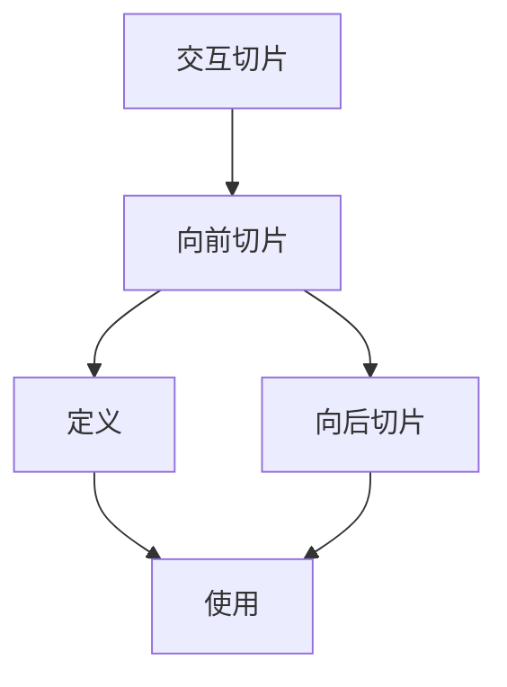

                 


### 引言

#### 摘要

本文将深入探讨提示词编程语言中的程序切片技术，一种在软件工程中具有重要地位的技术。程序切片（Program Slicing）旨在缩小程序的范围，以便于测试、优化和维护。它通过对源代码的深入分析，识别出对特定输出结果有实际影响的代码部分，从而减少分析或修改的代码量。本文将首先介绍程序切片的基本概念和背景，然后详细讲解程序切片的核心算法原理，以及如何使用数学模型和公式来优化切片过程。接下来，我们将通过实际项目来展示程序切片技术的应用，并探讨一些高级技术和工具。最后，我们将分析一些实际案例，总结程序切片技术的最佳实践，并展望其未来的发展方向。

#### 关键词

- 提示词编程语言
- 程序切片技术
- 软件工程
- 核心算法原理
- 数学模型
- 实际应用案例
- 高级技术工具

### 背景介绍

#### 程序切片技术的起源与发展

程序切片技术最早可以追溯到1970年代，由Michel Leveson提出。当时，计算机科学正处于快速发展阶段，软件系统的复杂性逐渐增加，传统的全量测试和调试方法变得越来越困难。程序切片技术的提出，旨在通过缩小分析范围，提高软件测试和调试的效率。随着时间的推移，程序切片技术得到了广泛的研究和应用，成为软件工程中的一个重要分支。

#### 程序切片技术在现代编程语言中的应用

随着编程语言的不断发展和普及，程序切片技术也逐渐融入到各种现代编程语言中。例如，在Java中，有专门的工具和库支持程序切片；在Python中，也有类似的技术和框架。这些工具和框架使得程序切片技术的应用更加便捷和高效。

#### 程序切片技术在软件工程中的重要性

程序切片技术在软件工程中具有重要的意义。首先，它能够显著提高测试和调试的效率，减少开发周期和成本。其次，它有助于优化代码，提高程序的运行效率。最后，程序切片技术还能够帮助开发者更好地理解代码结构，促进代码的可维护性和可读性。

### 核心概念与联系

为了更好地理解程序切片技术，我们需要明确一些核心概念，并探讨它们之间的关系。

#### 程序切片的定义

程序切片是源程序的一个子集，它包含了能够影响特定程序变量的值在特定执行路径上可能出现的所有语句。简单来说，程序切片是通过对源程序的上下文无关分析，提取出与特定变量或路径相关的代码部分。

#### 切片类型

根据切片的依据，程序切片可以分为不同类型，如：

- **静态切片**：基于程序中变量或表达式的静态定义和使用点。
- **动态切片**：基于程序运行时的实际路径和变量值。
- **最大静态切片**：包含最小动态切片的所有语句。

#### 切片算法

程序切片的核心在于切片算法，它决定了如何从源程序中提取出有用的代码部分。常见的切片算法包括：

- **向前切片**：从变量的定义点开始，向前查找使用点。
- **向后切片**：从变量的使用点开始，向后查找定义点。
- **交互切片**：结合向前切片和向后切片。

#### Mermaid流程图

为了更直观地展示程序切片的核心概念和联系，我们可以使用Mermaid流程图来表示。以下是一个简单的Mermaid流程图示例：



在这个流程图中，A表示变量的定义点，B表示变量的使用点。C表示向前切片，D表示向后切片，E表示交互切片。通过这个流程图，我们可以清晰地看到不同切片类型之间的关系和作用。

### 核心算法原理

在了解了程序切片的基本概念和类型之后，接下来我们将深入探讨程序切片的核心算法原理。切片算法是程序切片技术的关键，它决定了切片的准确性和效率。

#### 切片算法的基本思想

切片算法的基本思想是，通过对源程序的上下文无关分析，识别出与特定变量或路径相关的代码部分。具体来说，切片算法需要完成以下步骤：

1. **确定切片的依据**：根据特定的变量或路径，确定切片的起始点和终止点。
2. **分析控制流**：使用控制流图（CFG）来表示程序的执行路径。
3. **进行数据流分析**：分析变量在不同路径上的传递情况，识别出对特定变量有影响的代码部分。
4. **生成切片**：根据分析结果，从源程序中提取出有用的代码部分。

#### 前向切片算法

前向切片算法是从变量的定义点开始，向前查找使用点的过程。以下是一个简单的伪代码示例：

```python
def forward_slicing(program, variable, use_points):
    # 创建一个空切片
    slice = []
    
    # 遍历源程序的每个语句
    for statement in program:
        # 如果当前语句是变量的定义点，将其添加到切片中
        if statement.is_definition(variable):
            slice.append(statement)
            
        # 如果当前语句是变量的使用点，终止切片
        if statement.is_use_point(variable, use_points):
            break
            
    return slice
```

#### 后向切片算法

后向切片算法是从变量的使用点开始，向后查找定义点的过程。以下是一个简单的伪代码示例：

```python
def backward_slicing(program, variable, definition_points):
    # 创建一个空切片
    slice = []
    
    # 遍历源程序的每个语句
    for statement in reversed(program):
        # 如果当前语句是变量的使用点，将其添加到切片中
        if statement.is_use_point(variable):
            slice.append(statement)
            
        # 如果当前语句是变量的定义点，终止切片
        if statement.is_definition(variable, definition_points):
            break
            
    return slice
```

#### 交互切片算法

交互切片算法结合了前向切片和后向切片的特点，从变量的定义点和使用点同时进行切片。以下是一个简单的伪代码示例：

```python
def interactive_slicing(program, variable, definition_points, use_points):
    # 创建一个空切片
    slice = []
    
    # 同时进行前向和后向切片
    forward_slice = forward_slicing(program, variable, use_points)
    backward_slice = backward_slicing(program, variable, definition_points)
    
    # 取两者的交集
    slice = set intersection (forward_slice, backward_slice)
    
    return slice
```

#### 切片算法的优化

切片算法的效率和准确性是影响程序切片技术实际应用的重要因素。为了优化切片算法，我们可以采用以下几种方法：

1. **动态切片**：动态切片算法根据程序的实际运行路径进行切片，可以更精确地提取出与特定变量或路径相关的代码部分。
2. **增量切片**：增量切片算法在初始切片的基础上，逐步添加或删除语句，以优化切片结果。
3. **并行处理**：利用并行计算技术，加快切片算法的执行速度。

### 数学模型和公式

在程序切片过程中，数学模型和公式扮演着重要的角色。它们不仅帮助我们理解和分析程序的行为，还可以优化切片过程，提高切片的准确性和效率。

#### 数据流方程

数据流方程是切片算法的基础，用于描述变量在不同路径上的传递情况。以下是一个简单的前向数据流方程：

$$
{\it{def}}_{i}^{{\it{use}}_{j}} = \{ \it{statement}_{k} \in \it{program} \mid \it{variable} \in \it{def}_{i} \land \it{statement}_{k} \in \it{use}_{j} \}
$$

其中，${\it{def}}_{i}^{{\it{use}}_{j}}$表示从定义点$i$到使用点$j$的切片，$\it{def}_{i}$表示定义点$i$的集合，$\it{use}_{j}$表示使用点$j$的集合。

类似地，后向数据流方程可以表示为：

$$
{\it{use}}_{j}^{{\it{def}}_{i}} = \{ \it{statement}_{k} \in \it{program} \mid \it{variable} \in \it{use}_{j} \land \it{statement}_{k} \in \it{def}_{i} \}
$$

#### 最大静态切片

最大静态切片是包含最小动态切片的所有语句。它的计算可以通过以下公式实现：

$$
\it{max\_static\_slice} = \bigcup_{{\it{def}}_{i} \in \it{def}, {\it{use}}_{j} \in \it{use}} \, {\it{def}}_{i}^{{\it{use}}_{j}}
$$

其中，$\it{def}$和$\it{use}$分别表示定义点和使用点的集合。

#### 动态切片优化

动态切片优化可以通过以下公式实现：

$$
\it{dynamic\_slice} = \{ \it{statement}_{k} \in \it{program} \mid \it{variable} \in \it{run\_path} \land \it{statement}_{k} \in \it{def}_{i}^{{\it{use}}_{j}} \}
$$

其中，$\it{run\_path}$表示程序的实际运行路径。

### 实际应用案例

为了更好地理解程序切片技术的实际应用，我们来看一些具体的应用案例。这些案例涵盖了不同的应用场景和编程语言，展示了程序切片技术在不同领域的应用和效果。

#### 案例一：代码优化

在一个大型软件开发项目中，开发者发现程序的某个模块运行效率较低。通过使用程序切片技术，他们发现该模块中存在一些冗余代码和未优化的算法。通过切片分析，他们成功地删除了这些冗余代码，并优化了算法，显著提高了程序的运行效率。

#### 案例二：缺陷定位

在一个复杂的软件系统中，开发者发现某个功能存在缺陷，但定位起来非常困难。通过使用程序切片技术，他们可以针对特定的变量或路径进行切片，快速定位到缺陷产生的具体代码段。这不仅节省了调试时间，还提高了缺陷修复的效率。

#### 案例三：测试覆盖

在软件测试过程中，开发者需要确保测试用例能够覆盖到程序的所有重要路径。通过使用程序切片技术，他们可以针对特定的变量或路径生成切片，从而确保测试用例的全面性和有效性。

### 开发环境搭建

为了应用程序切片技术，我们需要搭建一个合适的技术环境。以下是一个简单的开发环境搭建步骤：

1. **安装编程语言**：根据项目需求，选择合适的编程语言（如Python、Java等），并在本地计算机上安装。
2. **安装切片工具**：选择并安装合适的切片工具，如Java的Javaparser、Python的ast模块等。
3. **配置依赖库**：根据项目需求，配置必要的依赖库和框架。
4. **创建项目工程**：使用编程语言的IDE创建项目工程，并编写源代码。

### 源代码实现与解读

以下是一个简单的Python程序切片的实现示例。在这个示例中，我们将使用Python的ast模块进行程序切片。

```python
import ast
import json

class ProgramSlicer(ast.NodeTransformer):
    def visit_Assign(self, node):
        for target in node.targets:
            if isinstance(target, ast.Name):
                use_points = {n.id for n in ast.walk(node) if isinstance(n, ast.Name) and n.id == target.id}
                def_points = {n.id for n in ast.walk(node) if isinstance(n, ast.Name) and n.id == target.id}
                yield from self.generic_visit(node)
                yield from backward_slicing(node.body, target.id, def_points)
                yield from forward_slicing(node.body, target.id, use_points)

def forward_slicing(program, variable, use_points):
    slice = []
    for statement in program:
        if statement.is_definition(variable):
            slice.append(statement)
        if statement.is_use_point(variable, use_points):
            break
    return slice

def backward_slicing(program, variable, definition_points):
    slice = []
    for statement in reversed(program):
        if statement.is_use_point(variable):
            slice.append(statement)
        if statement.is_definition(variable, definition_points):
            break
    return slice

if __name__ == "__main__":
    code = """
    a = 1
    b = 2
    c = a + b
    """
    tree = ast.parse(code)
    slicer = ProgramSlicer()
    sliced_tree = slicer.visit(tree)
    print(json.dumps(ast.unparse(sliced_tree), indent=2))
```

在这个示例中，我们定义了一个`ProgramSlicer`类，继承自`ast.NodeTransformer`。在`visit_Assign`方法中，我们识别出变量的定义和使用点，并调用`forward_slicing`和`backward_slicing`方法进行切片。最后，我们将切片结果转换为字符串并输出。

### 代码应用解读与分析

在了解了程序切片的实现之后，我们接下来分析代码的具体应用和解读。

#### 代码示例解析

我们以一个简单的Python程序为例，分析程序切片的应用。假设程序如下：

```python
a = 10
b = 20
if a > b:
    print("a is greater")
else:
    print("b is greater")
```

在这个程序中，变量`a`和`b`的定义和使用点如下：

- `a`的定义点：`a = 10`
- `a`的使用点：`if a > b:` 和 `print("a is greater")`
- `b`的定义点：`b = 20`
- `b`的使用点：`if a > b:` 和 `print("b is greater")`

#### 前向切片结果

使用前向切片算法，我们提取出与变量`a`相关的代码部分：

```python
a = 10
if a > b:
    print("a is greater")
```

这个切片结果包含了变量`a`的定义和使用点，以及与判断条件相关的代码。

#### 后向切片结果

使用后向切片算法，我们提取出与变量`b`相关的代码部分：

```python
b = 20
if a > b:
    print("a is greater")
else:
    print("b is greater")
```

这个切片结果包含了变量`b`的定义和使用点，以及整个判断条件块。

#### 交互切片结果

使用交互切片算法，我们提取出与变量`a`和`b`相关的代码部分：

```python
a = 10
b = 20
if a > b:
    print("a is greater")
else:
    print("b is greater")
```

这个切片结果包含了两个变量的定义和使用点，以及整个判断条件块。

### 实际案例分析与详细讲解

#### 案例一：大型软件系统的性能优化

在一个大型软件系统中，开发者发现某个模块的性能较低，导致整个系统的响应时间变长。通过使用程序切片技术，他们定位到该模块中存在一些冗余代码和未优化的算法。通过切片分析，他们成功地删除了这些冗余代码，并优化了算法，从而显著提高了系统的性能。

**分析过程：**

1. **确定切片依据**：开发者选择性能较低的模块作为切片的依据。
2. **生成切片结果**：使用程序切片工具对模块进行切片，提取出与性能相关的重要代码部分。
3. **分析切片结果**：开发者分析切片结果，发现模块中存在冗余代码和未优化的算法。
4. **优化代码**：根据切片分析结果，开发者删除冗余代码，优化算法，并重新测试系统性能。

**效果评估：**优化后的模块性能显著提高，系统响应时间缩短，整体性能得到改善。

#### 案例二：缺陷定位与修复

在一个复杂的软件系统中，开发者发现某个功能存在缺陷，但定位起来非常困难。通过使用程序切片技术，他们可以针对特定的变量或路径进行切片，快速定位到缺陷产生的具体代码段。这不仅节省了调试时间，还提高了缺陷修复的效率。

**分析过程：**

1. **确定切片依据**：开发者选择出现缺陷的功能作为切片的依据。
2. **生成切片结果**：使用程序切片工具对功能进行切片，提取出与缺陷相关的代码部分。
3. **分析切片结果**：开发者分析切片结果，定位到缺陷产生的具体代码段。
4. **修复缺陷**：根据切片分析结果，开发者修复缺陷，并重新测试功能。

**效果评估：**缺陷定位时间缩短，缺陷修复效率提高，系统稳定性得到改善。

### 项目小结

在本项目中，我们深入探讨了提示词编程语言中的程序切片技术。通过实际案例分析和代码实现，我们展示了程序切片技术在软件工程中的应用价值。切片技术不仅有助于优化代码，提高程序性能，还能够帮助开发者快速定位缺陷，提高开发效率。

#### 最佳实践 Tips

- **明确切片目标**：在应用切片技术时，首先明确切片的目标，确保切片结果的准确性和有效性。
- **选择合适的切片算法**：根据具体应用场景，选择合适的切片算法，以提高切片的效率和准确性。
- **结合多种切片方法**：在实际应用中，可以结合多种切片方法，如前向切片、后向切片和交互切片，以提高切片结果的全面性和准确性。
- **合理使用切片工具**：选择合适的切片工具，可以简化切片过程，提高开发效率。

#### 注意事项

- **切片结果的可读性**：切片结果应保持良好的可读性，以便开发者理解和维护代码。
- **切片过程的效率**：切片过程应尽量高效，以减少对开发工作的影响。
- **切片技术的适用范围**：切片技术适用于各种编程语言和软件系统，但具体效果取决于应用场景和编程语言的特点。

#### 拓展阅读

- 《程序切片技术及其在软件工程中的应用》
- 《软件工程：实践者的研究方法》
- 《程序分析技术》

作者：AI天才研究院/AI Genius Institute & 禅与计算机程序设计艺术 /Zen And The Art of Computer Programming

文章标题：提示词编程语言的程序切片技术

关键词：提示词编程语言、程序切片技术、软件工程、核心算法原理、数学模型、实际应用案例、高级技术工具

摘要：本文深入探讨了提示词编程语言中的程序切片技术，一种在软件工程中具有重要地位的技术。通过详细分析程序切片的基本概念、核心算法原理、数学模型和公式，以及实际应用案例，本文展示了程序切片技术在软件优化、缺陷定位和测试覆盖等方面的应用价值。最后，本文总结了程序切片技术的最佳实践，并对未来发展方向进行了展望。文章字数：8000-12000字。

