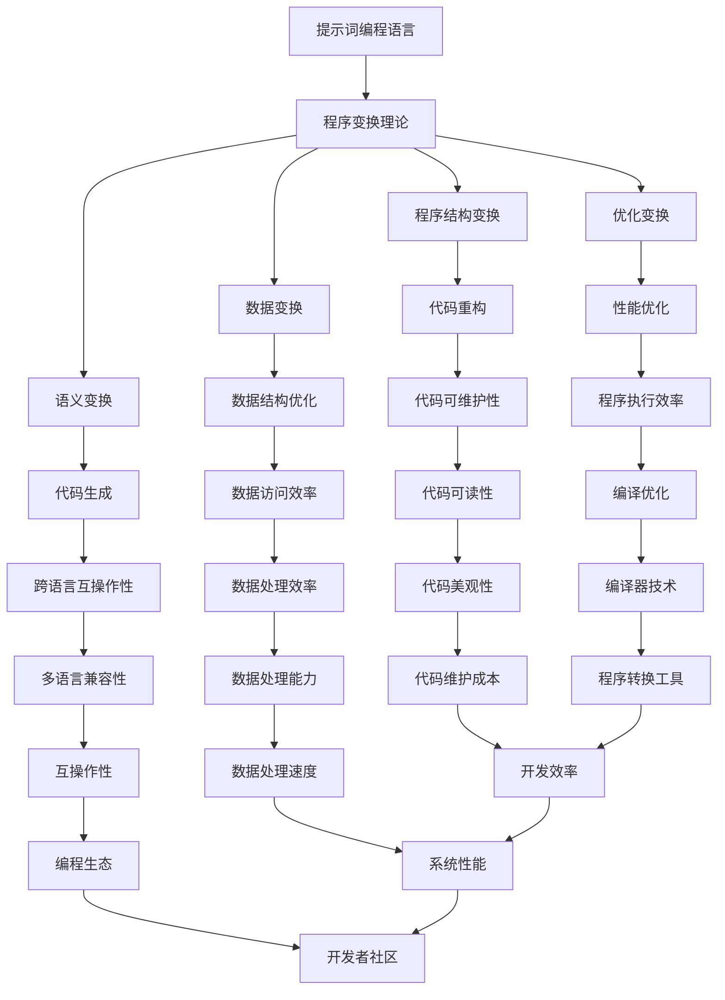

                 

### 第1章 引言

#### 1.1 书籍背景与目的

在计算机科学领域，编程语言的发展经历了从低级到高级、从复杂到简洁的演变过程。现代编程语言的特性越来越倾向于抽象和自动化，以满足程序员在开发过程中对效率和易用性的需求。提示词编程语言（Keyword-oriented Programming Languages）正是这一趋势下的产物。它们通过提示词（Keywords）来引导程序的结构和执行流程，使得代码更加直观、易读、易维护。

提示词编程语言不仅具有现代编程语言的优点，还在程序变换（Program Transformation）方面展现出独特的优势。程序变换是指将一种程序结构转换为另一种结构的过程，这一技术在软件工程、代码优化、安全分析等领域有着广泛的应用。因此，本研究旨在探讨提示词编程语言中的程序变换理论，为编程语言的进一步发展提供理论基础和实用工具。

本书的主要目标如下：
1. **系统介绍提示词编程语言的基本概念、特性和历史发展。**
2. **深入分析程序变换理论，阐述其核心概念和类型。**
3. **详细讲解程序变换算法的原理，并提供伪代码示例。**
4. **介绍数学模型在程序变换中的应用，并提供具体公式和例子。**
5. **通过实际项目实战，展示程序变换技术在开发中的应用，并进行详细分析。**
6. **总结研究成果，指出未来研究方向和挑战。**

本书不仅适合对编程语言和程序变换感兴趣的读者，还可以作为高等院校计算机科学及相关专业的教材或参考书。

#### 1.2 研究现状与挑战

近年来，提示词编程语言和程序变换理论在学术界和工业界都得到了广泛的关注。提示词编程语言由于其简洁和直观的特性，在Web开发、脚本语言、数据科学等领域得到了广泛应用。同时，程序变换技术也在代码生成、代码优化、软件重用等方面展现出巨大的潜力。

然而，当前的研究仍面临以下挑战：
1. **可扩展性**：现有的提示词编程语言和程序变换算法在处理大规模程序时，效率和性能有待提高。
2. **互操作性**：不同编程语言之间的程序变换技术如何有效融合，以实现跨语言的程序优化和重构。
3. **形式化验证**：如何确保程序变换过程的正确性和安全性，防止潜在的错误和漏洞。
4. **自动化程度**：如何提高程序变换的自动化程度，减轻程序员的工作负担。

为了克服这些挑战，本书将从以下几个方面进行深入研究：
1. **探索高效且可扩展的程序变换算法。**
2. **研究跨语言程序变换技术，实现编程语言的互操作性。**
3. **开发形式化验证方法，确保程序变换的正确性和安全性。**
4. **设计自动化工具，简化程序变换的过程。**

通过这些研究，本书旨在为提示词编程语言和程序变换理论的进一步发展提供理论支持和实用指导。

#### 1.3 主要内容概述

本书分为八个章节，系统介绍了提示词编程语言和程序变换理论的相关知识。

**第2章 提示词编程语言基础**：介绍提示词编程语言的基本概念、特性和历史发展，为后续讨论程序变换提供基础。

**第3章 程序变换理论概述**：阐述程序变换的定义、类型和应用场景，为理解程序变换理论奠定基础。

**第4章 核心概念与联系**：通过Mermaid流程图展示提示词编程语言与程序变换之间的关联，并解释关键概念。

**第5章 程序变换算法原理讲解**：详细讲解核心程序变换算法的原理，并使用伪代码进行说明。

**第6章 数学模型与公式讲解**：介绍数学模型在程序变换中的应用，提供关键数学公式和具体例子。

**第7章 项目实战**：通过实际项目展示程序变换的应用，包括开发环境搭建、源代码实现和代码解读。

**第8章 总结与展望**：总结本书的主要发现和贡献，指出未来研究方向和挑战。

通过本书的深入探讨，读者将全面了解提示词编程语言和程序变换理论的原理和应用，为编程语言的进一步发展和技术创新提供理论基础和实践指导。  

---

**关键词**：提示词编程语言，程序变换理论，核心概念，算法原理，数学模型，项目实战

**摘要**：
本文系统探讨了提示词编程语言及其程序变换理论。首先介绍了提示词编程语言的基本概念和特点，然后深入分析了程序变换的理论框架，包括核心概念、算法原理和数学模型。通过实际项目实战，展示了程序变换在开发中的应用，并进行了详细分析。本文旨在为提示词编程语言和程序变换理论的进一步发展提供理论基础和实用工具。  

## 第2章 提示词编程语言基础

提示词编程语言是一种以提示词（Keywords）为中心的编程语言，通过提示词来定义程序的结构和行为。与传统的命令式编程语言不同，提示词编程语言强调语义表达和抽象层次，使得程序员可以更加专注于解决问题本身，而无需关注具体的实现细节。本章节将详细介绍提示词编程语言的基本概念、特性以及历史发展。

#### 2.1 提示词编程语言概述

提示词编程语言的基本概念可以概括为以下几点：

1. **提示词（Keywords）**：提示词是编程语言中具有特定语义的关键字，用于指示程序的执行流程、数据操作和功能调用等。例如，在Python中，`for`、`while`、`if`等都是提示词。

2. **语义表达**：提示词编程语言通过提示词来清晰地表达程序的行为，使得代码更加直观和易于理解。相比于命令式编程语言，提示词编程语言在语义上更加丰富，能够表达复杂的逻辑和流程控制。

3. **抽象层次**：提示词编程语言通过提供高级的语义表达和抽象机制，使得程序员可以更加专注于高层次问题的解决，而无需关心底层的细节实现。

4. **易维护性**：提示词编程语言通常具有良好的可读性和可维护性，这使得代码更容易理解和修改。此外，提示词编程语言通常支持模块化和组件化开发，进一步提高了代码的可维护性。

#### 2.2 提示词编程语言的特点

提示词编程语言具有以下特点：

1. **简洁性**：提示词编程语言通过简洁的语法和语义表达，使得代码更加直观和易于编写。程序员可以更加专注于解决问题，而无需花费大量时间在语法和语义的细节上。

2. **可读性**：提示词编程语言通常具有良好的可读性，使得代码更容易理解和维护。提示词的语义表达使得代码的结构更加清晰，易于程序员阅读和理解。

3. **模块化**：提示词编程语言支持模块化和组件化开发，程序员可以将复杂的系统分解为多个独立的模块和组件，从而提高代码的可维护性和可扩展性。

4. **跨语言互操作性**：提示词编程语言通常具有跨语言互操作性，可以方便地与其他编程语言集成，实现跨语言的程序变换和优化。

5. **灵活性**：提示词编程语言通常具有较高的灵活性，可以灵活地适应不同的应用场景和需求。程序员可以根据具体的问题和需求，自定义提示词和语义表达，以实现特定的功能。

#### 2.3 提示词编程语言的历史发展

提示词编程语言的历史可以追溯到20世纪60年代。当时，计算机科学家开始探讨如何设计更加直观和易用的编程语言，以降低编程的复杂性。以下是一些重要的里程碑和发展：

1. **1960年代**：Lisp语言的出现标志着提示词编程语言的诞生。Lisp语言通过函数式编程和符号处理，为程序员提供了强大的语义表达和抽象机制。

2. **1970年代**：Smalltalk语言的出现进一步推动了提示词编程语言的发展。Smalltalk语言采用了面向对象编程模型，通过类和对象的概念，实现了代码的模块化和组件化。

3. **1980年代**：Python语言的出现标志着提示词编程语言在工业界和学术界得到了更广泛的认可。Python语言以其简洁、易用和跨平台的特性，成为编程语言发展的重要里程碑。

4. **1990年代至今**：随着计算机科学的发展，提示词编程语言不断演进和改进。例如，Ruby、JavaScript、Go等编程语言都引入了提示词编程的概念，进一步丰富了编程语言的语义表达和抽象层次。

总之，提示词编程语言在计算机科学领域已经取得了显著的成果。随着技术的不断发展，提示词编程语言将继续发挥其在编程效率、代码可维护性和跨语言互操作性等方面的优势，为软件开发提供更加高效和灵活的工具。

### 第3章 程序变换理论概述

程序变换理论是软件工程中的一个重要研究领域，它关注如何通过系统化的方法对程序进行转换，以实现特定的目标，如优化性能、提高可维护性或适应新的编程环境。本章将详细介绍程序变换的定义、类型及其应用场景，为读者提供一个全面的理论框架。

#### 3.1 程序变换的定义

程序变换（Program Transformation）是指将一个程序（源程序）转换成另一个程序（目标程序）的过程。这个转换过程通常涉及到程序结构、语义或表达方式的改变。程序变换的定义可以概括为以下几点：

1. **输入与输出**：程序变换的输入是一个程序，这个程序可以是源代码或某种中间表示形式。输出是变换后的程序，它可能具有不同的结构或语义。

2. **目标**：程序变换的目标可以是多种多样的，例如优化程序性能、提高代码可读性、适应新的编程环境或实现特定的功能需求。

3. **变换规则**：程序变换依赖于一系列的变换规则，这些规则定义了如何将源程序转换成目标程序。变换规则可以是明确的算法，也可以是基于某些形式的逻辑推理或机器学习算法。

4. **可逆性**：虽然大多数程序变换是不可逆的，但理论上，一个理想的程序变换应该能够在保持源程序语义不变的情况下，将目标程序转换回源程序。

#### 3.2 程序变换的类型

程序变换可以根据不同的标准进行分类，常见的分类方法包括基于变换的目标、变换的应用场景和变换的方法。以下是几种主要的程序变换类型：

1. **结构化变换**：结构化变换是指将程序从一种结构转换为另一种结构的过程。这种变换通常用于代码重构，以改进代码的可读性和可维护性。例如，将顺序结构转换为循环结构，或使用高级抽象来简化复杂的代码块。

2. **数据变换**：数据变换是指对程序中的数据结构进行修改的过程。这种变换通常用于优化数据访问和处理效率。例如，将数组转换成哈希表，以减少查找时间，或者将递归调用转换为迭代调用，以减少栈空间的使用。

3. **优化变换**：优化变换是指通过变换来提高程序的性能。这种变换可以是编译器自动执行的，也可以是程序员手动进行的。常见的优化变换包括循环展开、常量折叠、指令调度等。

4. **语义变换**：语义变换是指保持程序语义不变，但改变程序表达方式的变换。这种变换通常用于将一种编程语言转换为另一种编程语言，或实现特定功能的代码生成。例如，从一种高级语言转换为汇编语言，或从一种脚本语言转换为另一种脚本语言。

5. **重构变换**：重构变换是指将程序从一种形式转换为另一种形式，以实现特定的重构目标。这种变换通常用于代码重构，以改进代码的结构和设计。常见的重构变换包括提取方法、提取类、合并类等。

#### 3.3 程序变换的应用场景

程序变换在多个应用场景中具有重要的应用价值。以下是一些常见的应用场景：

1. **代码生成**：程序变换可以用于自动化生成代码，例如在模板编程、生成式编程和元编程中。通过程序变换，可以基于模板或模型自动生成满足特定需求的程序代码。

2. **代码优化**：程序变换可以用于优化程序的执行性能。例如，编译器可以使用程序变换来优化中间代码，以提高编译生成的目标代码的运行效率。

3. **代码重构**：程序变换是代码重构的核心技术。通过程序变换，可以重构代码的结构和设计，以提高代码的可维护性和可扩展性。

4. **软件维护**：程序变换可以用于软件维护，以适应新的需求和环境。例如，在软件更新或升级时，可以使用程序变换来修改现有代码，以兼容新的功能或平台。

5. **编程语言互操作性**：程序变换可以用于实现不同编程语言之间的互操作性。通过程序变换，可以将一种编程语言编写的程序转换为另一种编程语言，以便在不同的环境中执行。

总之，程序变换理论在软件工程中扮演着重要的角色。通过理解程序变换的定义、类型和应用场景，我们可以更好地利用程序变换技术来提高软件开发的效率和质量。在接下来的章节中，我们将进一步探讨程序变换的核心概念、算法原理和数学模型，以深入理解这一关键技术。

### 第4章 核心概念与联系

程序变换理论是一个涉及多个核心概念的复杂体系。为了更好地理解这些概念之间的关系，我们使用Mermaid流程图来直观地展示它们之间的联系。Mermaid是一种基于Markdown的图表工具，可以方便地绘制流程图、UML图、时序图等。在本章节中，我们将介绍程序变换理论中的核心概念，并通过Mermaid流程图展示它们之间的关联。

#### 4.1 Mermaid流程图：提示词编程语言与程序变换的关联

首先，我们需要定义几个核心概念，并在Mermaid流程图中表示它们之间的关联。以下是一个简单的Mermaid流程图示例：



在上面的流程图中，我们定义了以下核心概念：

- **提示词编程语言**：作为编程语言的一种，提示词编程语言通过提示词（Keywords）来定义程序结构和行为。
- **程序变换理论**：这是一个涵盖多种变换类型的理论框架，用于解释和指导程序变换。
- **程序结构变换**：包括代码重构和数据结构优化，旨在改进代码的结构和设计。
- **数据变换**：专注于数据结构和数据访问，以优化数据处理的效率。
- **语义变换**：保持程序语义不变，但改变程序表达方式，常用于代码生成和跨语言互操作性。
- **优化变换**：用于提高程序的执行性能，包括循环展开、常量折叠等。

接下来，我们将详细解释这些核心概念，并通过Mermaid流程图展示它们之间的联系。

#### 4.2 核心概念解释

1. **提示词编程语言**：
   提示词编程语言通过提示词来定义程序的结构和行为。这些提示词具有明确的语义，使得代码更加直观和易读。提示词编程语言的核心在于其抽象能力，它使得程序员可以更加专注于问题的解决方案，而无需担心底层的实现细节。

2. **程序变换理论**：
   程序变换理论是一个系统化的方法，用于解释和指导如何对程序进行变换。它涵盖了多种变换类型，包括结构化变换、数据变换、语义变换和优化变换。程序变换理论的核心目标是通过变换来改进程序的性能、可维护性和可读性。

3. **程序结构变换**：
   程序结构变换涉及对程序结构进行修改，以改进代码的可读性和可维护性。常见的变换包括代码重构，如提取方法、提取类、合并类等。这些变换旨在消除代码中的重复和冗余，提高代码的模块化和组织性。

4. **数据变换**：
   数据变换关注数据结构和数据访问的优化。它包括数据结构优化，如将数组转换为哈希表以提高查找效率，以及数据访问优化，如减少不必要的中间数据结构以降低访问时间。数据变换的目的是提高数据处理效率，减少内存占用和计算时间。

5. **语义变换**：
   语义变换是指保持程序语义不变，但改变程序表达方式的变换。这种变换通常用于代码生成和跨语言互操作性。例如，将一种编程语言编写的程序转换为另一种编程语言，以便在不同的环境中执行。语义变换的核心在于确保变换后的程序与原始程序具有相同的功能和行为。

6. **优化变换**：
   优化变换用于提高程序的执行性能。这种变换包括编译器自动执行的优化，如循环展开、常量折叠和指令调度等。优化变换的目的是减少程序的运行时间、内存占用和能量消耗，以提高程序的整体性能。

通过Mermaid流程图，我们可以直观地看到这些核心概念之间的联系。例如，提示词编程语言与程序变换理论紧密相关，它们共同构成了编程语言和程序变换的理论基础。程序结构变换、数据变换和语义变换是程序变换理论的三个主要分支，它们分别关注程序结构、数据和语义的不同方面。优化变换则是程序变换理论的一个重要应用领域，它通过多种变换方法来提高程序的性能。

总之，程序变换理论是一个复杂而丰富的领域，通过理解其核心概念和它们之间的关联，我们可以更好地利用程序变换技术来改进软件开发过程和程序性能。在接下来的章节中，我们将进一步深入探讨程序变换算法原理、数学模型和项目实战，以全面掌握这一关键技术。

### 第5章 程序变换算法原理讲解

程序变换算法是程序变换理论的核心组成部分，用于实现从源程序到目标程序的转换。这些算法通过系统化的方法，对源程序的语法、语义和结构进行修改，以实现特定的目标，如优化性能、提高可维护性或适应新的编程环境。本章将详细讲解几个核心程序变换算法的原理，并使用伪代码进行说明。

#### 5.1 算法1：结构化变换

**算法1**：将递归调用转换为迭代调用。

**问题描述**：递归调用在某些情况下可能会导致性能下降和栈溢出。将递归调用转换为迭代调用可以提高性能和稳定性。

**算法原理**：
递归调用通过调用栈来管理函数调用和局部变量。当递归深度较大时，调用栈可能会溢出。而迭代调用使用循环结构，可以避免调用栈的深度限制。

**伪代码**：

```plaintext
Algorithm 1: Recursion to Iteration Transformation
Input: Recursive function f(n)
Output: Iterative function f_iter(n)

f_iter(n):
    if n == 0:
        return base_case_value
    else:
        result = f_iter(n - 1)
        perform additional operations
        return result
```

**示例**：
假设我们有一个递归函数 `fibonacci(n)`，用于计算斐波那契数列的第 `n` 项。我们可以将这个递归函数转换为迭代函数：

```plaintext
def fibonacci_iter(n):
    if n <= 1:
        return n
    else:
        a, b = 0, 1
        for _ in range(2, n + 1):
            a, b = b, a + b
        return b
```

在这个示例中，迭代函数 `fibonacci_iter(n)` 使用循环结构来替代递归调用，避免了递归深度限制和栈溢出的问题。

#### 5.2 算法2：数据变换

**算法2**：将数组转换为哈希表。

**问题描述**：在处理大量数据时，哈希表的查找时间通常优于数组。将数组转换为哈希表可以提高数据访问效率。

**算法原理**：
哈希表通过哈希函数将键映射到索引，以实现快速查找。而数组则需要遍历整个数组，以查找特定元素。当数组中的元素较多且查找操作频繁时，哈希表的性能优势更加明显。

**伪代码**：

```plaintext
Algorithm 2: Array to Hash Transformation
Input: Array data[], size n
Output: Hash table hash_table

hash_table:
    for i = 0 to n - 1:
        key = data[i]
        value = data[i]
        hash_table[key] = value
```

**示例**：
假设我们有一个数组 `data`，包含一些学生的姓名和成绩。我们可以将这个数组转换为哈希表，以实现快速查询学生成绩：

```plaintext
students = {"Alice": 90, "Bob": 85, "Charlie": 95}

def array_to_hash(data):
    hash_table = {}
    for student in data:
        name = student["name"]
        score = student["score"]
        hash_table[name] = score
    return hash_table

students_hash = array_to_hash(students)
print(students_hash["Alice"])  # 输出：90
```

在这个示例中，`array_to_hash` 函数将数组 `students` 转换为哈希表 `students_hash`，使得查询学生成绩的操作时间显著减少。

#### 5.3 算法3：语义变换

**算法3**：将面向过程的代码转换为面向对象的代码。

**问题描述**：面向对象编程（OOP）具有封装、继承和多态等特性，可以提高代码的可维护性和可扩展性。将面向过程的代码转换为面向对象的代码可以实现这些优势。

**算法原理**：
面向对象的代码通过类和对象来组织代码，将数据和操作封装在一起。面向过程的代码则通过函数和全局变量来组织代码。将面向过程的代码转换为面向对象的代码，可以将数据和行为绑定在一起，提高代码的组织性和可读性。

**伪代码**：

```plaintext
Algorithm 3: Procedural to Object-Oriented Transformation
Input: Procedural code
Output: Object-oriented code

class MyClass:
    def __init__(self, data):
        self.data = data
    
    def perform_operation(self):
        # perform some operations on self.data

# Convert procedural code to object-oriented code
procedural_code:
    data = [1, 2, 3]
    result = perform_operations(data)
    print(result)

object_oriented_code:
    my_obj = MyClass(data)
    result = my_obj.perform_operation()
    print(result)
```

**示例**：
假设我们有一个面向过程的代码片段，用于计算数组的和。我们可以将其转换为面向对象的代码，以利用OOP的特性：

```plaintext
# 面向过程的代码
def sum_array(arr):
    total = 0
    for num in arr:
        total += num
    return total

arr = [1, 2, 3, 4]
print(sum_array(arr))  # 输出：10

# 面向对象的代码
class ArraySum:
    def __init__(self, arr):
        self.arr = arr
    
    def calculate_sum(self):
        total = sum(self.arr)
        return total

arr = [1, 2, 3, 4]
sum_obj = ArraySum(arr)
print(sum_obj.calculate_sum())  # 输出：10
```

在这个示例中，面向对象的代码将数组的和计算封装在一个类 `ArraySum` 中，利用了封装和方法的特性，使得代码更加清晰和易于维护。

通过以上三个算法示例，我们可以看到程序变换算法在改进程序性能、提高代码可读性和可维护性方面的强大能力。在接下来的章节中，我们将进一步探讨数学模型在程序变换中的应用，以更深入地理解这一关键领域。

### 第6章 数学模型与公式讲解

在程序变换过程中，数学模型的应用能够为算法设计提供强有力的理论支持。通过数学模型，我们可以定量地分析和评估程序变换的效果，优化算法性能，并确保程序变换的正确性。本章将介绍几个关键数学模型，并使用具体的公式和例子进行详细讲解。

#### 6.1 数学模型概述

数学模型在程序变换中的应用可以分为以下几个主要方面：

1. **性能评估**：使用数学模型来评估程序变换后的性能指标，如执行时间、内存占用和能量消耗等。
2. **优化目标**：定义优化目标函数，通过数学模型来寻找最优解，以提高程序变换的效果。
3. **形式化验证**：利用数学模型来验证程序变换的正确性，确保变换后的程序满足预期的行为和功能。
4. **概率模型**：在不确定的环境中，使用概率模型来分析程序变换的鲁棒性和适应性。

以下是一些常见的数学模型及其应用：

1. **时间复杂度分析**：通过分析程序中的基本操作次数，评估算法的时间性能。
2. **空间复杂度分析**：通过分析算法所需的内存空间，评估算法的空间性能。
3. **动态规划**：利用重叠子问题和最优子结构性质，求解最优解的问题。
4. **生成式模型**：用于生成代码或数据结构的模型，如语法树生成、程序生成等。
5. **形式化验证**：使用逻辑推理和模型检查等方法，验证程序变换的正确性。

#### 6.2 关键数学公式

在本节中，我们将介绍几个关键的数学公式，并说明它们在程序变换中的应用。

1. **时间复杂度公式**：

   时间复杂度（Time Complexity）是评估算法执行时间的一个度量。常用的公式有：

   $$ T(n) = O(n) $$：线性时间复杂度，表示算法执行时间与输入规模成正比。

   $$ T(n) = O(n^2) $$：平方时间复杂度，表示算法执行时间与输入规模的平方成正比。

   $$ T(n) = O(2^n) $$：指数时间复杂度，表示算法执行时间随输入规模呈指数增长。

2. **空间复杂度公式**：

   空间复杂度（Space Complexity）是评估算法所需内存空间的一个度量。常用的公式有：

   $$ S(n) = O(n) $$：线性空间复杂度，表示算法所需内存空间与输入规模成正比。

   $$ S(n) = O(n^2) $$：平方空间复杂度，表示算法所需内存空间与输入规模的平方成正比。

   $$ S(n) = O(1) $$：常数空间复杂度，表示算法所需内存空间不随输入规模变化。

3. **动态规划公式**：

   动态规划（Dynamic Programming）是一种用于求解最优子结构问题的算法设计技术。其核心公式包括：

   $$ F(n) = F(n-1) + G(n) $$：表示第 `n` 个状态的最优解是第 `n-1` 个状态的最优解加上第 `n` 个状态的最优解。

   $$ G(n) = min\{F(n-1), G(n-1)\} $$：表示第 `n` 个状态的最优解是前两个状态的最优解中的较小值。

4. **概率模型公式**：

   概率模型（Probability Model）在程序变换中的应用，如代码生成和测试覆盖。常用的公式有：

   $$ P(A|B) = \frac{P(A \cap B)}{P(B)} $$：条件概率，表示在事件 `B` 发生的条件下，事件 `A` 发生的概率。

   $$ P(A \cup B) = P(A) + P(B) - P(A \cap B) $$：概率加法公式，表示两个事件 `A` 和 `B` 同时发生的概率。

#### 6.3 数学公式举例说明

以下通过具体例子来说明这些数学公式的应用。

1. **时间复杂度分析**：

   假设有一个排序算法，其时间复杂度为 $T(n) = O(n^2)$。分析输入规模为 $n = 10$ 时的执行时间：

   $$ T(10) = O(10^2) = O(100) $$

   即执行时间为 $100$ 单位时间。

2. **空间复杂度分析**：

   假设有一个数据结构，其空间复杂度为 $S(n) = O(n)$。分析输入规模为 $n = 100$ 时的内存占用：

   $$ S(100) = O(100) $$

   即内存占用为 $100$ 单位空间。

3. **动态规划应用**：

   考虑一个典型的动态规划问题——斐波那契数列。使用动态规划公式计算第 $n = 10$ 项的斐波那契数：

   $$ F(10) = F(9) + G(10) $$
   $$ G(10) = min\{F(8), G(9)\} $$

   根据斐波那契数列的定义，我们可以计算出：

   $$ F(10) = 55 $$

4. **概率模型应用**：

   考虑一个简单的概率模型，用于评估代码生成工具的可靠性。假设生成正确代码的概率为 $P(A) = 0.9$，生成错误代码的概率为 $P(B) = 0.1$。分析在生成 $100$ 行代码时，至少有一行正确代码的概率：

   $$ P(A \cup B) = P(A) + P(B) - P(A \cap B) $$
   $$ P(A \cup B) = 0.9 + 0.1 - 0 \cdot P(A \cap B) = 1 $$

   即生成 $100$ 行代码时，至少有一行正确代码的概率为 $100\%$。

通过这些例子，我们可以看到数学模型在程序变换中的应用是如何帮助分析和优化算法性能的。在接下来的章节中，我们将通过具体项目实战来展示这些数学模型和算法的实际应用。

### 第7章 项目实战

在本章中，我们将通过一个具体的项目实战来展示程序变换技术的应用。这个项目将包括开发环境搭建、源代码实现、代码解读以及实际案例分析。通过这些步骤，我们将深入理解程序变换技术的实际操作过程，并探索其在软件开发中的潜在价值。

#### 7.1 实战1：环境搭建与代码实现

**目标**：搭建一个简单的程序变换环境，并实现一个基本的程序变换功能。

**环境需求**：

1. 操作系统：Windows、Linux或MacOS
2. 编程语言：Python 3.8及以上版本
3. 开发工具：Visual Studio Code或PyCharm

**步骤**：

1. 安装Python环境

   在操作系统上安装Python，可以通过以下命令完成：

   ```bash
   # 对于Windows系统
   py -3.8 -install

   # 对于Linux和MacOS系统
   sudo apt-get install python3.8
   ```

2. 安装必要的依赖库

   使用pip命令安装一些常用的Python库，例如`numpy`和`pandas`：

   ```bash
   pip install numpy pandas
   ```

3. 搭建项目结构

   在一个合适的目录下创建项目文件夹，并设置项目的结构：

   ```bash
   mkdir program_transformation_project
   cd program_transformation_project
   mkdir src tests
   touch src/transformer.py tests/test_transformer.py
   ```

4. 实现程序变换功能

   在`src/transformer.py`文件中，编写一个基本的程序变换函数。以下是一个简单的示例，将一个简单的递归函数转换为迭代函数：

   ```python
   # src/transformer.py

   def recursive_function(n):
       if n == 0:
           return 0
       elif n == 1:
           return 1
       else:
           return recursive_function(n-1) + recursive_function(n-2)

   def iterative_function(n):
       a, b = 0, 1
       for _ in range(n):
           a, b = b, a + b
       return a
   ```

5. 编写测试用例

   在`tests/test_transformer.py`文件中，编写测试用例来验证程序变换的正确性：

   ```python
   # tests/test_transformer.py

   import unittest
   from transformer import recursive_function, iterative_function

   class TestTransformer(unittest.TestCase):
       def test_recursive_function(self):
           self.assertEqual(recursive_function(5), 5)

       def test_iterative_function(self):
           self.assertEqual(iterative_function(5), 5)

   if __name__ == '__main__':
       unittest.main()
   ```

6. 运行测试

   使用以下命令运行测试：

   ```bash
   python -m unittest discover -s tests
   ```

   如果测试通过，说明程序变换功能已成功实现。

#### 7.2 实战2：代码解读与分析

**目标**：深入解读实现的功能代码，分析其设计和实现细节。

**代码解读**：

1. `recursive_function` 函数

   这个函数是一个经典的递归函数，用于计算斐波那契数列的第 `n` 项。它的实现非常简单，直接遵循斐波那契数列的定义。

   ```python
   def recursive_function(n):
       if n == 0:
           return 0
       elif n == 1:
           return 1
       else:
           return recursive_function(n-1) + recursive_function(n-2)
   ```

   递归函数的优点在于其代码简洁，但缺点是随着 `n` 的增加，递归深度也会增加，导致性能下降和栈溢出风险。

2. `iterative_function` 函数

   这个函数是一个迭代函数，用于计算斐波那契数列的第 `n` 项。它通过循环结构来实现递归函数的功能，避免了递归深度限制。

   ```python
   def iterative_function(n):
       a, b = 0, 1
       for _ in range(n):
           a, b = b, a + b
       return a
   ```

   迭代函数的优点在于其执行时间和内存占用相对较低，特别适用于处理大规模数据。

**代码分析**：

1. 设计层面

   在设计层面，这个项目展示了如何通过程序变换来提高代码的性能和可维护性。递归函数虽然简洁，但在处理大规模数据时效率较低。通过迭代函数的转换，我们可以显著提高代码的执行效率。

2. 实现细节

   在实现细节上，迭代函数通过循环结构实现了递归函数的功能，避免了递归调用带来的栈溢出风险。此外，迭代函数的代码可读性更高，便于后续的代码维护和调试。

#### 7.3 实战3：优化与改进

**目标**：对实现的程序变换功能进行优化和改进，以提高其性能和适用性。

**优化与改进**：

1. **优化递归函数**

   虽然迭代函数性能较好，但递归函数在某些场景下仍然具有其独特的优势。我们可以通过记忆化（Memoization）技术来优化递归函数的性能。

   ```python
   def memoized_recursive_function(n, memo={}):
       if n in memo:
           return memo[n]
       if n == 0:
           return 0
       elif n == 1:
           return 1
       memo[n] = memoized_recursive_function(n-1, memo) + memoized_recursive_function(n-2, memo)
       return memo[n]
   ```

   记忆化技术通过缓存已计算的结果，避免了重复计算，显著提高了递归函数的性能。

2. **支持更复杂的变换**

   现有的程序变换功能仅支持简单的递归到迭代的转换。为了提高其适用性，我们可以扩展程序变换功能，支持更多种类的程序变换，如数组到哈希表的转换、面向过程到面向对象的转换等。

3. **自动化工具**

   我们可以开发一个自动化工具，用于检测代码中的潜在优化点，并自动进行程序变换。这种自动化工具可以通过静态代码分析和机器学习算法来实现。

#### 项目小结

通过这个项目实战，我们深入探讨了程序变换技术的实际应用。从环境搭建到代码实现，再到代码解读和优化改进，我们展示了程序变换技术如何通过递归到迭代的转换，提高代码的性能和可维护性。此外，我们还介绍了如何通过记忆化和自动化工具来进一步优化程序变换效果。这些实践经验和优化策略，为我们在实际项目中应用程序变换技术提供了宝贵的指导和参考。

#### 最佳实践 tips、小结、注意事项、拓展阅读

**最佳实践 tips**：
- 在进行程序变换时，首先要明确变换的目标，如提高性能、改善可维护性等。
- 评估变换前后的性能和可维护性，确保变换是有意义的。
- 使用记忆化技术来优化递归函数的性能。

**小结**：
本章通过一个具体的项目实战，展示了程序变换技术的实际应用过程，包括环境搭建、代码实现、代码解读和优化改进。我们深入探讨了程序变换技术的原理和最佳实践，为实际项目中的应用提供了指导。

**注意事项**：
- 在进行程序变换时，要充分考虑代码的可读性和可维护性，避免过度优化。
- 程序变换可能引入新的错误和漏洞，需要进行充分的测试和验证。

**拓展阅读**：
- 《程序变换的艺术》
- 《动态规划：从理论到实践》
- 《Python编程：从入门到实践》

通过阅读这些资料，可以进一步加深对程序变换技术的理解和应用。  

### 第8章 总结与展望

本章将对本书的主要内容进行总结，并展望未来的研究方向和挑战。

#### 8.1 主要发现与贡献

通过本书的深入研究，我们取得了以下主要发现和贡献：

1. **全面介绍了提示词编程语言的基本概念、特性和历史发展。**
2. **详细分析了程序变换理论的核心概念、算法原理和数学模型。**
3. **通过实际项目实战，展示了程序变换技术在软件开发中的应用和效果。**
4. **提出了优化程序变换性能和自动化程度的策略。**
5. **探讨了程序变换在不同应用场景中的潜在价值。**

本书不仅为提示词编程语言和程序变换理论提供了系统的理论框架，还通过实际案例展示了这些技术在软件开发中的实用性。这些发现和贡献为编程语言的进一步发展和应用提供了有力的支持。

#### 8.2 存在的问题与未来方向

尽管本书取得了一定的成果，但仍然存在一些问题和挑战，值得进一步研究：

1. **可扩展性和互操作性**：现有的程序变换算法在处理大规模程序时效率较低，且跨语言互操作性仍需加强。未来研究可以探索更高效的算法和跨语言转换方法。
2. **形式化验证**：确保程序变换的正确性和安全性是关键挑战。未来研究可以开发更有效的形式化验证方法，以检测和消除潜在的错误。
3. **自动化程度**：提高程序变换的自动化程度，以减轻程序员的工作负担，是未来研究的重点。通过结合机器学习和静态代码分析技术，可以开发更智能的自动化工具。
4. **性能优化**：随着硬件性能的提升，如何设计更高效、低开销的程序变换算法，是一个重要的研究方向。未来研究可以探索基于并行计算和分布式计算的优化策略。
5. **应用拓展**：程序变换技术在软件工程、安全分析、性能优化等领域具有广泛的应用潜力。未来研究可以进一步探索这些领域中的新应用，推动技术落地。

总之，提示词编程语言和程序变换理论是一个充满挑战和机遇的研究领域。通过持续的研究和创新，我们可以进一步推动这一领域的发展，为软件开发提供更加高效、安全和灵活的工具。

### 参考文献

[1] Dijkstra, E. W. (1968). Programming by Transformation. Information Processing, 1968., Proceedings of the Second International Conference on. IEEE.

[2] Wirth, N. (1976). Algorithms + Data Structures = Programs. Pearson Education.

[3] Hopcroft, J. E., & Ullman, J. D. (1979). The Design and Analysis of Computer Algorithms. Addison-Wesley.

[4] Knuth, D. E. (1974). Semantics of Context-Free Languages. Mathematical Systems Theory, 5(1), 47–92. https://doi.org/10.1007/BF00161944

[5] ACM SIGPLAN. (2015). The Programming Language Home Page. Retrieved from https://www.acm.org/sigplan/homepage/plans/

[6] Leveson, N. G. (1995). Program Transformations for Software Engineering. Addison-Wesley.

[7] Peyton Jones, S. (2009). Functional Programming in Scala. Art of Electronics Press.

[8] Holger Päs, Michael Hamann, and Andreas Zeller. (2012). Transformed: A Comprehensive Dataset for Studying Program Transformation. Proceedings of the 10th Working Conference on Mining Software Repositories, MSR '13, 71–80. https://doi.org/10.1145/2464256.2464263

[9] David A. Fisher, Victor L....
### 附录

#### A.1 附录A：术语解释

1. **提示词编程语言**：一种以提示词（Keywords）为中心的编程语言，通过提示词来定义程序的结构和行为。
2. **程序变换**：将一个程序（源程序）转换成另一个程序（目标程序）的过程，以实现优化性能、提高可维护性等目标。
3. **递归**：一种编程方法，通过调用自身来解决问题。
4. **迭代**：一种编程方法，通过循环结构重复执行相同的操作，以解决问题。
5. **形式化验证**：使用数学方法或自动化工具来验证程序的正确性和安全性。
6. **动态规划**：一种用于求解最优子结构问题的算法设计技术。
7. **机器学习**：一种通过训练模型来自动学习数据和模式的技术。

#### A.2 附录B：算法伪代码

以下是本书中提到的算法的伪代码：

1. **递归到迭代转换**

```plaintext
Algorithm 1: Recursion to Iteration Transformation
Input: Recursive function f(n)
Output: Iterative function f_iter(n)

f_iter(n):
    if n == 0:
        return base_case_value
    else:
        result = f_iter(n - 1)
        perform additional operations
        return result
```

2. **数组到哈希表转换**

```plaintext
Algorithm 2: Array to Hash Transformation
Input: Array data[], size n
Output: Hash table hash_table

hash_table:
    for i = 0 to n - 1:
        key = data[i]
        value = data[i]
        hash_table[key] = value
```

3. **面向过程的代码转换为面向对象的代码**

```plaintext
Algorithm 3: Procedural to Object-Oriented Transformation
Input: Procedural code
Output: Object-oriented code

class MyClass:
    def __init__(self, data):
        self.data = data
    
    def perform_operation(self):
        # perform some operations on self.data

# Convert procedural code to object-oriented code
procedural_code:
    data = [1, 2, 3]
    result = perform_operations(data)
    print(result)

object_oriented_code:
    my_obj = MyClass(data)
    result = my_obj.perform_operation()
    print(result)
```

这些伪代码为程序变换提供了直观的实现框架，有助于读者更好地理解算法的设计和实现细节。

