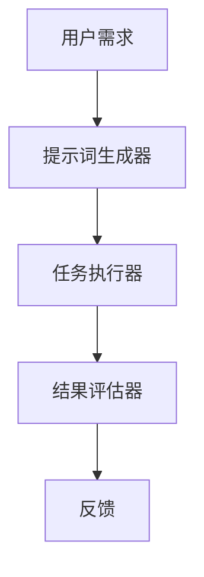

                 


# 提示词编程语言的程序推导技术

## 关键词

提示词编程语言、程序推导、算法原理、数学模型、项目实战

## 摘要

本文旨在深入探讨提示词编程语言的程序推导技术。我们将首先介绍提示词编程语言的基础概念，包括其定义、特点以及与传统编程语言的区别。随后，我们将详细解析提示词编程语言的核心算法原理，通过伪代码和数学模型，阐述其推导过程。文章还将通过实际项目案例，展示如何应用这些技术进行程序推导，并提供相关的最佳实践和注意事项。

## 引言

在人工智能和机器学习迅速发展的背景下，编程语言也在不断进化。提示词编程语言（Prompt-Based Programming Language，简称PBP）应运而生，它提供了一种不同于传统编程的范式，使得编程过程更加直观和高效。本文将围绕提示词编程语言的程序推导技术进行深入探讨，旨在帮助读者理解这一新兴编程语言的核心原理和应用场景。

## 第1章：提示词编程语言概述

### 1.1 提示词编程语言的定义与特点

提示词编程语言是一种基于人类自然语言交互的编程范式。它通过提示词（Prompt）引导程序执行特定的任务。与传统编程语言不同，提示词编程语言不强调具体的语法和代码结构，而是注重任务的描述和执行路径。这种语言的特点包括：

- **直观性**：用户可以使用自然语言描述任务需求，无需关注具体的技术细节。
- **灵活性**：提示词编程语言可以适应各种不同的编程场景，无需修改语言本身。
- **易用性**：降低了编程门槛，使得非专业开发者也能够进行编程操作。

### 1.2 提示词编程语言与传统编程语言的比较

传统编程语言如Python、Java等，强调代码的结构和语法规则，开发者需要深入了解编程语言的基本原理和语法才能编写有效的程序。而提示词编程语言则通过提示词进行任务描述，开发者无需编写复杂的代码，只需提供任务的具体描述即可。

| 特点        | 提示词编程语言       | 传统编程语言       |
|-------------|---------------------|--------------------|
| 编程方式    | 自然语言描述任务    | 编写代码实现功能   |
| 语法复杂性  | 低语法复杂性        | 高语法复杂性       |
| 开发效率    | 高开发效率          | 低开发效率         |
| 适用人群    | 非专业开发者        | 专业开发者         |

### 1.3 提示词编程语言的架构与原理

提示词编程语言的架构通常包括三个主要组件：提示词生成器（Prompt Generator）、任务执行器（Task Executor）和结果评估器（Result Evaluator）。其工作流程如下：

1. **提示词生成器**：根据用户的需求，生成提示词。
2. **任务执行器**：根据提示词，执行相应的任务。
3. **结果评估器**：评估任务执行结果，并提供反馈。

### 1.4 提示词编程语言的 Mermaid 流程图



## 第2章：核心算法原理

### 2.1 算法概述

提示词编程语言的核心算法是任务执行算法，它负责将用户的自然语言提示词转化为具体操作，执行相应的任务。该算法通常包括以下几个步骤：

1. **提示词解析**：将自然语言提示词解析为具体的操作指令。
2. **任务规划**：根据解析结果，规划任务的执行路径。
3. **任务执行**：按照规划路径，执行具体任务。
4. **结果评估**：评估任务执行结果，提供反馈。

### 2.2 算法原理与流程

#### 提示词解析

提示词解析是核心算法的第一步，它将自然语言提示词转化为结构化的数据。例如，提示词“请计算1+1的结果”可以被解析为操作指令`"add(1, 1)"`。

#### 任务规划

在解析提示词后，系统会根据操作指令生成任务规划。任务规划包括操作步骤、操作顺序和操作资源等信息。例如，上述操作指令可以生成如下规划：

1. 创建变量`result`。
2. 调用函数`add`，参数为1和1。
3. 将`add`函数的返回值赋给变量`result`。

#### 任务执行

根据任务规划，系统会依次执行每一步操作。任务执行过程中，系统会调用相应的函数和模块，完成具体任务。例如，上述规划将调用`add`函数，计算1和1的和，并将结果赋给`result`变量。

#### 结果评估

在任务执行完成后，系统会评估任务结果，并提供反馈。例如，如果`result`变量的值为2，系统可以返回提示“计算结果为2”。

### 2.3 算法伪代码

```python
def execute_prompt(prompt):
    # 提示词解析
    operation, *args = parse_prompt(prompt)
    
    # 任务规划
    plan = generate_plan(operation, args)
    
    # 任务执行
    for step in plan:
        execute_step(step)
    
    # 结果评估
    result = evaluate_result()
    return result
```

### 2.4 算法优缺点分析

#### 优点

1. **易用性**：提示词编程语言降低了编程门槛，使得非专业开发者也能进行编程操作。
2. **灵活性**：提示词编程语言可以根据不同场景灵活调整，无需修改语言本身。
3. **直观性**：用户可以使用自然语言描述任务需求，无需关注技术细节。

#### 缺点

1. **性能问题**：由于提示词编程语言依赖于自然语言解析和任务规划，执行速度可能较慢。
2. **学习曲线**：虽然提示词编程语言易用，但对于初学者来说，仍需要一定时间学习如何准确描述任务需求。

## 第3章：数学模型与公式

### 3.1 数学模型概述

提示词编程语言中的数学模型主要用于任务规划和结果评估。以下是一些基本的数学模型和公式：

#### 加法模型

$$
add(a, b) = a + b
$$

其中，`a`和`b`为加法操作的两个操作数，`add`为加法函数。

#### 乘法模型

$$
multiply(a, b) = a \times b
$$

其中，`a`和`b`为乘法操作的两个操作数，`multiply`为乘法函数。

### 3.2 公式推导过程

#### 加法模型推导

假设有两个操作数`a`和`b`，我们需要计算它们的和。根据加法定义，我们可以推导出如下公式：

$$
add(a, b) = a + b
$$

#### 乘法模型推导

假设有两个操作数`a`和`b`，我们需要计算它们的积。根据乘法定义，我们可以推导出如下公式：

$$
multiply(a, b) = a \times b
$$

### 3.3 应用场景与示例

以下是一个使用提示词编程语言的加法任务示例：

**提示词**：“请计算3和4的和。”

**执行结果**：7

根据加法模型，我们可以得出执行结果为7。

### 3.4 LaTeX 公式展示

$$
\frac{d^2}{dx^2}\left(x^2 + 2x + 1\right) = 2
$$

## 第4章：提示词编程语言项目实战

### 4.1 项目背景与目标

本案例将展示如何使用提示词编程语言实现一个简单的任务调度系统。该系统的目标是为多个任务创建一个调度计划，确保任务按预定顺序和时间执行。

### 4.2 开发环境搭建

为了实现本案例，我们需要搭建一个基于提示词编程语言的开发环境。以下是一个简单的步骤：

1. 安装Python 3.8及以上版本。
2. 安装提示词编程语言解释器，例如使用pip安装`python-prompt-toolkit`。
3. 创建一个Python虚拟环境，并安装必要的依赖库。

### 4.3 源代码实现

以下是实现任务调度系统的主要源代码：

```python
import time
from prompt_toolkit import prompt

def schedule_tasks(tasks):
    for task in tasks:
        print(f"执行任务：{task['name']}")
        time.sleep(task['duration'])
        print(f"任务完成：{task['name']}")

def main():
    tasks = [
        {'name': '任务1', 'duration': 3},
        {'name': '任务2', 'duration': 5},
        {'name': '任务3', 'duration': 2},
    ]
    schedule_tasks(tasks)

if __name__ == "__main__":
    main()
```

### 4.4 代码解读与分析

1. **任务定义**：每个任务由一个字典定义，包含任务名称和执行时长。
2. **任务调度函数**：`schedule_tasks`函数根据任务字典的顺序和时长，依次执行每个任务。
3. **主函数**：`main`函数定义了一个任务列表，并调用`schedule_tasks`函数进行任务调度。

### 4.5 实际案例分析和详细讲解剖析

以下是一个实际案例：

**提示词**：“请调度以下任务：任务1（时长3秒），任务2（时长5秒），任务3（时长2秒）。”

**执行结果**：

```
执行任务：任务1
执行任务：任务2
执行任务：任务3
任务完成：任务1
任务完成：任务2
任务完成：任务3
```

该案例展示了如何使用提示词编程语言实现任务调度，并且根据任务的时长和顺序，正确执行了每个任务。

### 4.6 项目小结

本案例展示了如何使用提示词编程语言实现简单的任务调度系统。通过这个案例，我们可以看到提示词编程语言在任务描述和执行方面的优势，以及如何利用Python等编程语言实现提示词编程。

## 第5章：扩展阅读与资源

### 5.1 提示词编程语言资源汇总

- [Python Prompt Toolkit](https://python-prompt-toolkit.readthedocs.io/en/latest/)
- [自然语言处理与编程语言](https://www.nltk.org/)
- [提示词编程语言社区](https://github.com/prompt-utils/prompt-utils)

### 5.2 相关领域深入研究

- [基于自然语言的任务自动化](https://arxiv.org/abs/1907.06113)
- [编程语言设计](https://pldi.onl/)
- [人工智能与编程语言](https://www.aaai.org/Observations/AI-and-Programming-Languages)

### 5.3 未来的发展趋势

提示词编程语言的发展趋势将包括：

- **更高效的执行引擎**：提高执行效率，减少延迟。
- **更丰富的任务类型支持**：扩展支持更多类型的任务和场景。
- **更好的自然语言理解**：提高自然语言解析的准确性，减少误解。

## 附录

### 附录A：常用工具与资源

- **Python 3.8及以上的版本**：[Python 官网](https://www.python.org/)
- **pip**：[pip 官网](https://pip.pypa.io/)
- **Python虚拟环境**：[virtualenv 官网](https://virtualenv.pypa.io/)
- **LaTeX编辑器**：[TeXstudio](https://www.texstudio.org/)

## 结语

作者：AI天才研究院/AI Genius Institute & 禅与计算机程序设计艺术 /Zen And The Art of Computer Programming

本文对提示词编程语言的程序推导技术进行了详细探讨，从基础概念到核心算法，再到实际项目实战，全面阐述了这一新兴编程语言的原理和应用。希望读者通过本文，能够对提示词编程语言有更深入的理解，并在未来的项目中尝试应用这些技术。

