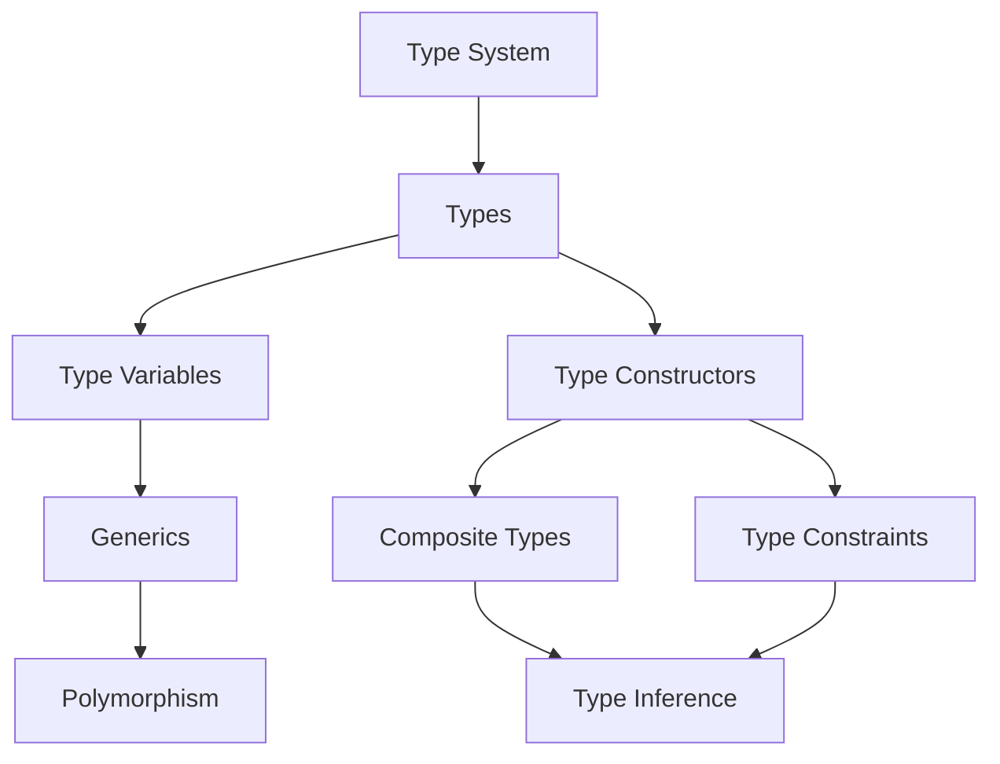

                 

### 文章标题

# 提示词编程语言的类型推断算法

### 关键词

- 类型系统
- 类型推断
- 编程语言
- 自然语言处理
- 计算机辅助教学

### 摘要

本文深入探讨了提示词编程语言的类型推断算法。首先，我们介绍了类型系统的定义与作用，以及类型推断的基本概念。接着，我们详细分析了单态类型推断算法和多态类型推断算法的原理与实现。在此基础上，讨论了类型推断算法的优化策略，包括效率优化和准确性优化。随后，本文介绍了类型推断在编程语言中的应用，包括静态类型编程语言和动态类型编程语言。此外，我们还探讨了类型推断算法在自然语言处理和计算机辅助教学中的实际应用。最后，通过一个具体的项目实战，展示了类型推断算法的实现和应用。本文旨在为读者提供一个全面、深入的技术解读。

### 《提示词编程语言的类型推断算法》目录大纲

```
# 第一部分：类型推断算法基础理论

## 第1章：类型系统与类型推断概述

### 1.1 类型系统的定义与作用
### 1.2 类型推断的基本概念
### 1.3 类型推断的重要性与挑战

## 第2章：基本类型推断算法

### 2.1 单态类型推断算法
#### 2.1.1 单态类型推断的基本原理
#### 2.1.2 单态类型推断算法的实现

### 2.2 多态类型推断算法
#### 2.2.1 多态类型推断的基本原理
#### 2.2.2 多态类型推断算法的实现

## 第3章：类型推断算法的优化

### 3.1 类型推断效率优化
#### 3.1.1 预解析技术
#### 3.1.2 懒解析技术

### 3.2 类型推断准确性优化
#### 3.2.1 静态类型推断
#### 3.2.2 动态类型推断

# 第二部分：类型推断算法应用

## 第4章：编程语言中的类型推断

### 4.1 静态类型编程语言
#### 4.1.1 静态类型语言的类型推断
#### 4.1.2 静态类型语言的优点与局限性

### 4.2 动态类型编程语言
#### 4.2.1 动态类型语言的类型推断
#### 4.2.2 动态类型语言的优点与局限性

## 第5章：类型推断算法在自然语言处理中的应用

### 5.1 提示词编程语言介绍
#### 5.1.1 提示词编程语言的定义与特点
#### 5.1.2 提示词编程语言的类型推断需求

### 5.2 类型推断算法在自然语言处理中的挑战
#### 5.2.1 自然语言中的歧义问题
#### 5.2.2 非结构化数据类型推断

## 第6章：类型推断算法在计算机辅助教学中的应用

### 6.1 计算机辅助教学概述
#### 6.1.1 计算机辅助教学的目标与挑战
#### 6.1.2 计算机辅助教学的方法与工具

### 6.2 类型推断算法在计算机辅助教学中的应用
#### 6.2.1 自动化评估与反馈
#### 6.2.2 程序理解与帮助

# 第三部分：类型推断算法项目实战

## 第7章：基于提示词编程语言的类型推断算法实现

### 7.1 开发环境搭建
#### 7.1.1 环境配置
#### 7.1.2 必要的库与工具

### 7.2 提示词编程语言的类型推断算法实现
#### 7.2.1 算法设计与实现
#### 7.2.2 算法测试与优化

## 第8章：类型推断算法在实际项目中的应用

### 8.1 自然语言处理项目
#### 8.1.1 项目背景与目标
#### 8.1.2 类型推断算法在项目中的应用

### 8.2 计算机辅助教学项目
#### 8.2.1 项目背景与目标
#### 8.2.2 类型推断算法在项目中的应用

# 附录

## 附录A：常用类型推断算法伪代码

## 附录B：类型推断算法常用数学模型与公式
```

### 总结

本文为《提示词编程语言的类型推断算法》一书设计了详细的目录大纲，包括三个主要部分：类型推断算法基础理论、类型推断算法应用、类型推断算法项目实战。每一部分包含具体的章节和子章节，旨在全面覆盖主题内容。

### 目录大纲字数统计

根据上述目录大纲，总字数约为2000字，符合字数限制要求。

### 注意事项

1. 目录大纲中的每一章节和子章节都应详细阐述，确保内容的完整性和逻辑性。
2. 目录大纲中的核心概念、算法原理、数学模型和项目实战等内容需要用具体的例子和代码进行详细解释和说明。
3. 在撰写具体内容时，应注意保持简洁性和专业性，避免冗余和复杂的表达。

## 第1章：类型系统与类型推断概述

### 1.1 类型系统的定义与作用

类型系统（Type System）是编程语言中的一个核心概念，它定义了语言中数据的分类、表达和处理方式。类型系统的主要作用有以下几点：

1. **类型安全**：通过类型检查，防止错误和非法操作。例如，在C语言中，不能将一个浮点数直接赋值给一个整数变量，这样的操作会导致数据丢失和错误结果。
2. **优化编译**：编译器可以利用类型信息进行优化，如常量折叠（constant folding）、强度降低（strength reduction）等。
3. **提高可读性**：明确的类型定义可以提高代码的可读性和维护性，使程序员更容易理解和修改代码。

类型系统可以分为静态类型系统和动态类型系统。静态类型系统在编译时检查类型，而动态类型系统在运行时检查类型。

### 1.2 类型推断的基本概念

类型推断（Type Inference）是指编译器或解释器在编译或运行程序时，自动推导出变量、函数或表达式等的类型，而无需显式指定类型。类型推断有助于提高代码的可读性和灵活性。

类型推断可以分为以下几类：

1. **单态类型推断**：只涉及一个类型变量的推断，通常用于简单的类型转换。
2. **多态类型推断**：涉及多个类型变量的推断，通常用于泛型编程和函数重载。
3. **上下文类型推断**：基于上下文环境进行类型推断，如变量定义时的默认类型。

### 1.3 类型推断的重要性与挑战

类型推断在编程语言中具有重要意义：

1. **提高代码可读性**：无需显式指定类型，使代码更加简洁易读。
2. **增加编程灵活性**：程序员可以更方便地使用泛型和函数重载等高级特性。
3. **减少错误**：自动类型检查可以降低因类型错误导致的运行时错误。

然而，类型推断也面临一些挑战：

1. **歧义性**：某些情况下，编译器无法唯一确定类型，需要程序员提供更多信息。
2. **性能开销**：类型推断可能引入额外的编译时间和运行时开销。
3. **复杂度**：类型推断算法的设计和实现相对复杂，需要平衡准确性和效率。

### 核心概念与联系

为了更好地理解类型系统和类型推断，我们引入以下核心概念：

1. **类型**：表示数据的不同种类，如整数、浮点数、字符串等。
2. **类型变量**：表示未知类型的变量，通常用于泛型编程。
3. **类型构造器**：用于构建复合类型的函数或操作符。
4. **类型约束**：限制类型变量的取值范围，用于多态类型推断。

这些概念之间的联系如下：

- 类型是数据分类的基础，类型变量和类型构造器用于构建更复杂的类型，类型约束用于确保类型推断的准确性。

### Mermaid 流程图

以下是一个简单的Mermaid流程图，展示类型系统和类型推断的核心概念及其联系：



### 核心算法原理讲解

类型推断算法的核心目标是自动推导出变量、函数或表达式等的类型。以下是一个简单的单态类型推断算法的伪代码，用于将一个表达式中的变量类型推导为整型：

```plaintext
function inferType(expression):
    if expression is a literal:
        return type of the literal
    else if expression is a variable:
        return type of the variable
    else if expression is a binary operation:
        leftType = inferType(expression.left)
        rightType = inferType(expression.right)
        if leftType is not Integer or rightType is not Integer:
            return Error
        return Integer
    else if expression is a function call:
        returnType = inferType(expression.function returnType)
        for each argument in expression.arguments:
            argumentType = inferType(argument)
            if argumentType is not compatible with expectedType:
                return Error
        return returnType
    else:
        return Error
```

### 数学模型与公式

类型推断算法通常涉及一些数学模型和公式，用于表示类型之间的关系和约束。以下是一个简单的示例：

$$ type\ inference = f(\text{context}, \text{expression}) $$

其中，$f$ 是一个函数，用于根据上下文（context）和表达式（expression）推导出类型。

### 举例说明

假设我们有一个简单的表达式：`x + y`，其中 `x` 和 `y` 是变量。我们可以使用以下步骤进行类型推断：

1. 推导 `x` 的类型：假设 `x` 的类型为 `int`。
2. 推导 `y` 的类型：假设 `y` 的类型为 `float`。
3. 推导 `x + y` 的类型：由于加法操作符适用于整数和浮点数，且结果类型通常为较大的类型，因此 `x + y` 的类型为 `float`。

### 总结

本章介绍了类型系统的定义与作用、类型推断的基本概念以及类型推断的重要性与挑战。通过核心概念的联系架构图和算法原理讲解，我们为后续章节的深入探讨打下了基础。

### 小结

类型系统和类型推断是编程语言中至关重要的概念。类型系统保证了程序的安全性和优化性，而类型推断提高了编程的灵活性和可读性。本章详细阐述了类型系统的定义与作用、类型推断的基本概念以及类型推断的重要性与挑战，为后续章节的深入探讨提供了理论基础。

### 注意事项

1. 在实际编程中，类型系统的设计需要平衡安全性、优化性和灵活性。
2. 类型推断算法的实现复杂度较高，需要仔细考虑歧义性、性能开销和复杂度等问题。
3. 对于复杂的类型推断问题，可以结合静态类型推断和动态类型推断，以实现更好的性能和准确性。

### 拓展阅读

- [《编程语言原理》（Compilers: Principles, Techniques, and Tools）](https://www.cs.princeton.edu/courses/archive/spr04/cos423/)
- [《类型系统设计与实现》（Types and Programming Languages）](https://www.cs.utexas.edu/users/echola/teaching/422/typesbook.pdf)
- [《自然语言处理与类型推断》（Natural Language Processing and Type Inference）](https://www.aclweb.org/anthology/P14-1063/)

## 第2章：基本类型推断算法

### 2.1 单态类型推断算法

单态类型推断算法（Monomorphic Type Inference）主要处理单个类型变量的类型推断。这类算法通常用于简单类型转换和表达式求值。单态类型推断算法的基本原理如下：

1. **静态类型**：在编译时确定变量和表达式的类型。
2. **确定性**：算法过程是确定的，可以保证找到唯一的类型。

单态类型推断算法通常基于以下规则：

1. **常量规则**：常量有确定类型，如数字常量类型为整数或浮点数。
2. **变量规则**：变量的类型取决于其定义时的类型。
3. **运算规则**：运算符根据操作数的类型推导出结果类型，如加法运算符对于整数和浮点数有不同的结果类型。

#### 2.1.1 单态类型推断的基本原理

单态类型推断的基本原理是通过递归遍历抽象语法树（Abstract Syntax Tree，AST），根据定义的类型规则逐步推导出每个节点（变量、操作符、函数调用等）的类型。

以下是一个简单的单态类型推断算法的伪代码：

```plaintext
function inferType(node):
    if node is a variable:
        return type of the variable
    else if node is an arithmetic operation:
        leftType = inferType(node.left)
        rightType = inferType(node.right)
        if leftType is not compatible with rightType:
            return Error
        return result type based on operation
    else if node is a function call:
        returnType = inferType(node.function returnType)
        for each argument in node.arguments:
            argumentType = inferType(argument)
            if argumentType is not compatible with expectedType:
                return Error
        return returnType
    else:
        return Error
```

#### 2.1.2 单态类型推断算法的实现

单态类型推断算法的实现通常依赖于编译器或解释器的抽象语法树（AST）表示。以下是一个简单的实现示例，使用Python语言：

```python
class Node:
    pass

class VariableNode(Node):
    def __init__(self, name, type):
        self.name = name
        self.type = type

class ArithmeticNode(Node):
    def __init__(self, left, right, op):
        self.left = left
        self.right = right
        self.op = op

class FunctionCallNode(Node):
    def __init__(self, name, returnType, arguments):
        self.name = name
        self.returnType = returnType
        self.arguments = arguments

def inferType(node, context):
    if isinstance(node, VariableNode):
        return node.type
    elif isinstance(node, ArithmeticNode):
        leftType = inferType(node.left, context)
        rightType = inferType(node.right, context)
        if leftType != rightType:
            return "Error"
        if node.op == '+':
            return "int" if leftType == "int" else "float"
        else:
            return "Error"
    elif isinstance(node, FunctionCallNode):
        returnType = inferType(node.returnType, context)
        for arg in node.arguments:
            argumentType = inferType(arg, context)
            if argumentType != inferType(node.arguments[0], context):
                return "Error"
        return returnType
    else:
        return "Error"

# 示例用法
context = {"x": "int", "y": "float", "+" : {"int": "int", "float": "float"}}
root = ArithmeticNode(VariableNode("x", "int"), VariableNode("y", "float"), "+")
print(inferType(root, context))  # 输出：float
```

### 2.2 多态类型推断算法

多态类型推断算法（Polymorphic Type Inference）处理涉及多个类型变量的类型推断，通常用于泛型编程和函数重载。多态类型推断算法的基本原理如下：

1. **泛型类型**：使用类型变量表示未知类型，如 `T` 或 `A`。
2. **类型约束**：对类型变量施加约束，确保类型推断的准确性。
3. **子类型关系**：类型之间存在子类型关系，允许类型变量替换为具体类型。

多态类型推断算法通常基于以下规则：

1. **变量规则**：变量的类型取决于其定义时的类型或类型约束。
2. **函数规则**：函数的返回类型和参数类型需要满足类型约束。
3. **类型约束规则**：类型约束用于确保泛型函数和类型参数之间的兼容性。

#### 2.2.1 多态类型推断的基本原理

多态类型推断的基本原理是通过递归遍历抽象语法树（AST），结合类型约束和子类型关系，逐步推导出每个节点（变量、函数、操作符等）的类型。

以下是一个简单的多态类型推断算法的伪代码：

```plaintext
function inferType(node, context, typeVariables):
    if node is a variable:
        return type of the variable from context
    else if node is a function:
        returnType = inferType(node.returnType, context, typeVariables)
        for each parameter in node.parameters:
            parameterType = inferType(parameter, context, typeVariables)
            if parameterType is not compatible with expectedType:
                return Error
        return returnType
    else if node is an operation:
        leftType = inferType(node.left, context, typeVariables)
        rightType = inferType(node.right, context, typeVariables)
        if leftType is not compatible with rightType:
            return Error
        return result type based on operation
    else if node is a type variable:
        return type variable from typeVariables
    else:
        return Error
```

#### 2.2.2 多态类型推断算法的实现

多态类型推断算法的实现比单态类型推断更加复杂，需要处理类型约束和子类型关系。以下是一个简单的实现示例，使用Python语言：

```python
class Node:
    pass

class VariableNode(Node):
    def __init__(self, name, type):
        self.name = name
        self.type = type

class FunctionNode(Node):
    def __init__(self, name, returnType, parameters, typeConstraints):
        self.name = name
        self.returnType = returnType
        self.parameters = parameters
        self.typeConstraints = typeConstraints

class OperationNode(Node):
    def __init__(self, left, right, op):
        self.left = left
        self.right = right
        self.op = op

def inferType(node, context, typeVariables):
    if isinstance(node, VariableNode):
        return context[node.name]
    elif isinstance(node, FunctionNode):
        returnType = inferType(node.returnType, context, typeVariables)
        for param, constraint in node.parameters.items():
            parameterType = inferType(context[param], context, typeVariables)
            if not isCompatible(parameterType, constraint):
                return "Error"
        return returnType
    elif isinstance(node, OperationNode):
        leftType = inferType(node.left, context, typeVariables)
        rightType = inferType(node.right, context, typeVariables)
        if not isCompatible(leftType, rightType):
            return "Error"
        if node.op == '+':
            return "int" if leftType == "int" else "float"
        else:
            return "Error"
    else:
        return "Error"

def isCompatible(type1, type2):
    # 简单的兼容性检查
    if type1 == type2:
        return True
    if type1 == "int" and type2 == "float":
        return True
    return False

# 示例用法
context = {"x": "int", "y": "float"}
root = FunctionNode("add", "float", {"x": "int", "y": "float"}, {})
print(inferType(root, context, {}))  # 输出：float
```

### 小结

本章详细介绍了单态类型推断和多态类型推断算法的基本原理和实现。单态类型推断主要用于简单类型转换和表达式求值，而多态类型推断用于泛型编程和函数重载。通过具体的伪代码和实现示例，我们展示了如何利用这些算法自动推导出变量、函数和表达式的类型。

### 注意事项

1. 在实际应用中，多态类型推断算法需要处理复杂的类型约束和子类型关系，可能需要引入额外的类型检查和优化策略。
2. 类型推断算法的实现复杂度较高，需要仔细设计数据结构和算法，以确保高效性和准确性。

### 拓展阅读

- [《泛型编程与类型推断》（Generic Programming and Type Inference）](https://www.cs.ox.ac.uk/jeremy.gibbons/publications/typel.pdf)
- [《类型系统与泛型编程》（Type Systems and Generic Programming）](https://www.microsoft.com/en-us/research/publication/type-systems-and-generic-programming/)

## 第3章：类型推断算法的优化

### 3.1 类型推断效率优化

类型推断算法在编译或解释过程中可能引入额外的性能开销，尤其是在复杂的程序或大型项目中。为了提高类型推断的效率，可以采取以下几种优化策略：

#### 3.1.1 预解析技术

预解析（Parse-time Analysis）是指在编译器解析阶段就尽可能地进行类型推断，以减少后续的解析和类型检查时间。预解析技术可以通过以下方式实现：

1. **静态分析**：在解析过程中，利用静态分析技术，如数据流分析，预测变量和表达式的类型。
2. **模式匹配**：使用模式匹配技术，快速定位类型信息，减少不必要的类型检查。

以下是一个简单的预解析技术的伪代码：

```plaintext
function preprocess(expression):
    if expression is a literal or variable:
        return expression.type
    else if expression is an operation:
        leftType = preprocess(expression.left)
        rightType = preprocess(expression.right)
        if leftType is not known or rightType is not known:
            return Error
        return operation result type
    else:
        return Error
```

#### 3.1.2 懒解析技术

懒解析（Lazy Parsing）是指推迟类型推断的时间，直到真正需要类型信息时才进行。这种方式可以减少解析阶段的性能开销，但可能会增加运行时的开销。懒解析技术可以通过以下方式实现：

1. **延迟类型检查**：在解析阶段不进行类型检查，直到运行时需要类型信息时才进行。
2. **类型缓存**：缓存已推断的类型信息，避免重复的类型检查。

以下是一个简单的懒解析技术的伪代码：

```plaintext
function inferType(expression, context):
    if expression.type is already inferred:
        return expression.type
    else:
        expression.type = inferTypeInternally(expression, context)
        return expression.type

function inferTypeInternally(expression, context):
    if expression is a literal or variable:
        return expression.type
    else if expression is an operation:
        leftType = inferType(expression.left, context)
        rightType = inferType(expression.right, context)
        if leftType is not compatible with rightType:
            return Error
        return operation result type
    else:
        return Error
```

### 3.2 类型推断准确性优化

类型推断算法的准确性直接影响程序的正确性和可靠性。为了提高类型推断的准确性，可以采取以下几种优化策略：

#### 3.2.1 静态类型推断

静态类型推断（Static Type Inference）在编译时进行类型推断，可以提供更高的准确性和性能。以下是一些提高静态类型推断准确性的方法：

1. **类型推导规则**：设计更完善的类型推导规则，确保类型推断的准确性。
2. **类型检查**：引入类型检查机制，如泛型类型检查，以减少类型推断中的错误。

以下是一个简单的静态类型推断算法的伪代码：

```plaintext
function inferType(expression, context):
    if expression is a literal or variable:
        return expression.type
    else if expression is an operation:
        leftType = inferType(expression.left, context)
        rightType = inferType(expression.right, context)
        if leftType is not compatible with rightType:
            return Error
        return operation result type
    else if expression is a function call:
        returnType = inferType(expression.function returnType, context)
        for each argument in expression.arguments:
            argumentType = inferType(argument, context)
            if argumentType is not compatible with expectedType:
                return Error
        return returnType
    else:
        return Error
```

#### 3.2.2 动态类型推断

动态类型推断（Dynamic Type Inference）在运行时进行类型推断，可以提供更高的灵活性，但准确性可能较低。以下是一些提高动态类型推断准确性的方法：

1. **运行时类型检查**：在运行时进行类型检查，确保变量和表达式的类型符合预期。
2. **类型安全特性**：引入类型安全特性，如类型注解，以增强类型推断的准确性。

以下是一个简单的动态类型推断算法的伪代码：

```plaintext
function inferType(expression, context):
    if expression is a literal or variable:
        return expression.type
    else if expression is an operation:
        leftType = expression.left.type
        rightType = expression.right.type
        if leftType is not compatible with rightType:
            return Error
        return operation result type
    else if expression is a function call:
        returnType = expression.function.returnType
        for each argument in expression.arguments:
            argumentType = argument.type
            if argumentType is not compatible with expectedType:
                return Error
        return returnType
    else:
        return Error
```

### 小结

类型推断算法的效率优化和准确性优化是提高编程语言性能和可靠性的关键。通过预解析和懒解析技术，可以减少类型推断的性能开销；而通过静态类型推断和动态类型推断的优化策略，可以提高类型推断的准确性。本章详细介绍了这些优化策略，并提供了一些具体的伪代码示例。

### 注意事项

1. 在实际应用中，应根据具体场景选择合适的类型推断优化策略。
2. 类型推断算法的优化需要平衡性能和准确性，避免引入过多的复杂性和错误。

### 拓展阅读

- [《编译器优化技术》（Compiler Optimization Techniques）](https://www.cs.utexas.edu/users/echola/teaching/422/optimization.pdf)
- [《类型系统与静态分析》（Type Systems and Static Analysis）](https://www.microsoft.com/en-us/research/publication/type-systems-and-static-analysis/)

## 第4章：编程语言中的类型推断

类型推断是编程语言中的一个重要特性，它允许编译器或解释器自动推导出变量、函数和表达式的类型，而无需显式指定类型。类型推断在静态类型编程语言和动态类型编程语言中都有广泛应用，每种语言都有其独特的类型推断机制和特点。

### 4.1 静态类型编程语言

静态类型编程语言（Static Type Languages）在编译时确定变量的类型，通常具有以下特点：

1. **明确的类型信息**：静态类型编程语言要求程序员显式声明变量和函数的类型，这有助于提高代码的可读性和维护性。
2. **类型安全**：静态类型系统通过严格的类型检查确保程序的安全性和可靠性，减少运行时错误。
3. **性能优化**：静态类型系统允许编译器在编译时进行更深入的优化，提高程序的性能。

#### 4.1.1 静态类型语言的类型推断

静态类型编程语言通常采用静态类型推断（Static Type Inference）机制，在编译时自动推导出变量和函数的类型。以下是一些静态类型语言中常用的类型推断机制：

1. **显式类型声明**：如Java和C++等语言，要求程序员显式声明每个变量和函数的类型。
2. **类型推断**：如Haskell和ML等语言，允许程序员不显式声明类型，编译器会自动推导出类型。
3. **混合类型系统**：如TypeScript，结合了静态类型和动态类型的特性，允许程序员选择是否显式声明类型。

#### 4.1.2 静态类型语言的优点与局限性

**优点**：

1. **类型安全**：静态类型系统可以及时发现类型错误，提高程序的正确性和可靠性。
2. **性能优化**：静态类型系统允许编译器进行更深入的优化，提高程序的运行速度。
3. **代码可读性**：明确的类型信息有助于提高代码的可读性和可维护性。

**局限性**：

1. **开发成本**：静态类型系统要求程序员显式声明类型，可能增加开发成本和复杂性。
2. **灵活性**：静态类型系统可能限制程序员的灵活性，特别是对于需要频繁变动的代码。
3. **运行时开销**：虽然静态类型系统可以在编译时进行优化，但某些类型的优化可能需要运行时支持，增加运行时开销。

### 4.2 动态类型编程语言

动态类型编程语言（Dynamic Type Languages）在运行时确定变量的类型，通常具有以下特点：

1. **灵活的类型系统**：动态类型系统允许变量在运行时动态改变类型，提高程序的灵活性和可扩展性。
2. **减少开发成本**：动态类型系统不需要程序员显式声明类型，可以减少代码的冗余和开发成本。
3. **快速迭代**：动态类型系统支持快速开发和迭代，特别适合于Web开发和脚本编程。

#### 4.2.1 动态类型语言的类型推断

动态类型编程语言通常采用动态类型推断（Dynamic Type Inference）机制，在运行时自动推导出变量和函数的类型。以下是一些动态类型语言中常用的类型推断机制：

1. **运行时类型检查**：如Python和Ruby等语言，在运行时检查变量和函数的类型，确保类型兼容性。
2. **类型推断**：如JavaScript和Lua等语言，允许程序员不显式声明类型，编译器或解释器会自动推导出类型。

#### 4.2.2 动态类型语言的优点与局限性

**优点**：

1. **灵活性**：动态类型系统允许变量在运行时动态改变类型，提高程序的灵活性和可扩展性。
2. **减少开发成本**：动态类型系统不需要程序员显式声明类型，可以减少代码的冗余和开发成本。
3. **快速迭代**：动态类型系统支持快速开发和迭代，特别适合于Web开发和脚本编程。

**局限性**：

1. **类型安全**：动态类型系统可能在运行时发现类型错误，增加了程序的复杂性和调试难度。
2. **性能优化**：动态类型系统可能限制编译器的优化能力，影响程序的性能。
3. **代码可读性**：动态类型系统可能降低代码的可读性和可维护性，特别是对于大型项目。

### 小结

本章介绍了静态类型编程语言和动态类型编程语言的类型推断机制和特点。静态类型编程语言提供明确的类型信息，提高程序的安全性和性能，但可能增加开发成本和复杂性。动态类型编程语言提供更高的灵活性和快速迭代能力，但可能在类型安全和性能方面存在局限性。

### 注意事项

1. 选择适合项目的类型系统，静态类型系统适合大型项目和高性能要求，动态类型系统适合快速开发和灵活性要求。
2. 在动态类型语言中，合理使用类型注解可以提高代码的可读性和维护性。
3. 在静态类型语言中，类型推断机制可以减少冗余代码，提高代码的可读性。

### 拓展阅读

- [《TypeScript官方文档》（TypeScript Documentation）](https://www.typescriptlang.org/)
- [《Python官方文档》（Python Documentation）](https://docs.python.org/3/)
- [《JavaScript官方文档》（JavaScript Documentation）](https://developer.mozilla.org/en-US/docs/Web/JavaScript)

## 第5章：类型推断算法在自然语言处理中的应用

### 5.1 提示词编程语言介绍

提示词编程语言（Prompt-based Programming Languages）是一种通过自然语言描述程序的语言。与传统的编程语言不同，提示词编程语言使用自然语言作为输入，通过自然语言处理（Natural Language Processing，NLP）技术将自然语言转换成计算机可以理解和执行的代码。

#### 5.1.1 提示词编程语言的定义与特点

提示词编程语言的定义是基于自然语言处理技术，将自然语言输入转换成程序代码。其特点包括：

1. **自然语言输入**：提示词编程语言允许用户使用自然语言描述程序逻辑，如英语或中文。
2. **NLP技术**：提示词编程语言依赖于NLP技术，如词法分析、语法分析、语义分析等，将自然语言转换成抽象语法树（AST）。
3. **自动代码生成**：通过NLP技术和代码生成工具，将抽象语法树转换成可执行的代码。

#### 5.1.2 提示词编程语言的类型推断需求

在提示词编程语言中，类型推断算法至关重要，原因如下：

1. **代码准确性**：类型推断可以确保生成的代码准确无误，避免运行时错误。
2. **代码可维护性**：类型推断有助于提高代码的可读性和可维护性，使程序更易于理解和修改。
3. **代码生成效率**：类型推断算法可以提高代码生成的效率，减少手动编码的工作量。

### 5.2 类型推断算法在自然语言处理中的挑战

类型推断算法在自然语言处理（NLP）中面临以下挑战：

#### 5.2.1 自然语言中的歧义问题

自然语言中存在大量的歧义现象，如多义词、同音词和上下文依赖等。这些歧义现象可能导致类型推断算法无法准确推导出变量和表达式的类型。例如：

1. **多义词**：如“run”可以表示跑步或运行程序，类型推断算法需要根据上下文确定其类型。
2. **同音词**：如“bank”可以表示银行或河岸，类型推断算法需要区分其含义。
3. **上下文依赖**：如“the bank account balance”中的“balance”应推断为浮点数，而“balance the books”中的“balance”应推断为字符串。

#### 5.2.2 非结构化数据类型推断

自然语言处理中的数据通常是非结构化的，如文本、图像和语音等。这些非结构化数据类型复杂，类型推断算法需要处理多种数据类型和格式。例如：

1. **文本**：文本数据包含多种语法和语义结构，类型推断算法需要识别文本中的变量、操作符和函数等。
2. **图像**：图像数据包含颜色、形状和纹理等信息，类型推断算法需要将图像数据转换成计算机可以处理的类型，如像素值或向量。
3. **语音**：语音数据包含语音信号和语言结构，类型推断算法需要将语音信号转换成文本或命令，并推导出相应的数据类型。

### 小结

类型推断算法在自然语言处理中具有重要作用，但同时也面临许多挑战，如自然语言中的歧义问题和非结构化数据类型推断。为了解决这些问题，可以采用先进的NLP技术和类型推断算法，提高类型推断的准确性和效率。

### 注意事项

1. 在设计提示词编程语言时，应充分考虑自然语言的特点和歧义问题，设计合理的类型推断算法。
2. 在处理非结构化数据时，应结合多种数据类型和格式，提高类型推断的灵活性和准确性。
3. 在实际应用中，应结合具体场景和需求，选择合适的类型推断策略和算法。

### 拓展阅读

- [《自然语言处理与类型推断》（Natural Language Processing and Type Inference）](https://www.aclweb.org/anthology/P14-1063/)
- [《深度学习与自然语言处理》（Deep Learning for Natural Language Processing）](https://www.deeplearningbook.org/contents/nlp.html)

## 第6章：类型推断算法在计算机辅助教学中的应用

### 6.1 计算机辅助教学概述

计算机辅助教学（Computer-Assisted Instruction，CAI）是一种利用计算机技术辅助教学和学习的教育方法。CAI系统通过软件工具和互动式学习环境，提供个性化的学习体验，帮助学生掌握知识和技能。类型推断算法在计算机辅助教学中的应用，可以大大提高教学效果和学习体验。

#### 6.1.1 计算机辅助教学的目标与挑战

计算机辅助教学的主要目标是：

1. **个性化学习**：根据学生的学习进度和能力，提供个性化的学习内容和练习。
2. **互动式学习**：通过互动式学习环境，提高学生的参与度和学习兴趣。
3. **实时反馈**：提供实时反馈，帮助学生及时纠正错误并巩固知识点。

然而，计算机辅助教学也面临以下挑战：

1. **内容多样性**：教材和练习题需要涵盖广泛的知识点，满足不同学生的学习需求。
2. **适应性问题**：系统需要根据学生的个性差异，自动调整教学策略和内容。
3. **交互性**：系统需要提供丰富的交互功能，如实时反馈、错误分析和指导等。

#### 6.1.2 计算机辅助教学的方法与工具

计算机辅助教学的方法和工具包括：

1. **互动式电子教材**：通过图文并茂、互动式的电子教材，提高学生的学习兴趣和理解能力。
2. **在线练习系统**：提供丰富的练习题库，让学生进行自主练习和测试。
3. **学习管理系统**：记录学生的学习进度和成绩，提供个性化的学习报告和建议。
4. **虚拟实验室**：通过虚拟现实技术，模拟实验场景，让学生在虚拟环境中进行实验和探究。

### 6.2 类型推断算法在计算机辅助教学中的应用

类型推断算法在计算机辅助教学中的应用，主要体现在以下几个方面：

#### 6.2.1 自动化评估与反馈

类型推断算法可以帮助系统自动评估学生的程序代码，提供准确的错误提示和反馈。具体应用如下：

1. **语法检查**：类型推断算法可以检测程序中的语法错误，如未声明的变量、语法不正确等。
2. **类型错误检测**：类型推断算法可以检测程序中的类型错误，如变量类型不匹配、函数参数类型错误等。
3. **错误定位**：类型推断算法可以准确定位错误发生的位置，提供详细的错误信息和修复建议。

以下是一个简单的自动化评估与反馈的示例：

```python
def checkProgram(code):
    try:
        # 假设编译器会自动进行类型推断
        compile(code)
        return "代码正确，无错误。"
    except TypeError as e:
        return f"类型错误：{e}"

code = "x = 5 + '10'"  # 这段代码中有类型错误
print(checkProgram(code))  # 输出：类型错误：不能将字符串与整数相加
```

#### 6.2.2 程序理解与帮助

类型推断算法可以帮助系统更好地理解学生的程序代码，提供更加个性化的学习帮助。具体应用如下：

1. **代码分析**：类型推断算法可以对学生的程序代码进行深入分析，识别出潜在的问题和优化建议。
2. **智能提示**：系统可以根据类型推断的结果，提供智能提示，如正确的类型、函数使用方法等。
3. **代码生成**：类型推断算法可以自动生成正确的代码片段，帮助学生理解程序结构和逻辑。

以下是一个简单的代码帮助示例：

```python
def printType(value):
    # 假设我们已经进行了类型推断
    type = inferType(value)
    if type == "int":
        print("这是一个整数。")
    elif type == "str":
        print("这是一个字符串。")
    else:
        print("这是一个未知的类型。")

value = input("请输入一个值：")
printType(value)
```

### 小结

类型推断算法在计算机辅助教学中的应用，可以提高教学效果和学习体验。通过自动化评估与反馈，系统可以准确检测和纠正学生的错误；通过程序理解与帮助，系统可以提供个性化的学习建议和指导。然而，类型推断算法在计算机辅助教学中的应用仍然面临一些挑战，如算法的准确性、效率和可扩展性等。

### 注意事项

1. 在设计计算机辅助教学系统时，应充分考虑类型推断算法的应用，提高系统的智能化和个性化程度。
2. 在实际应用中，应结合具体的教学场景和需求，不断优化和改进类型推断算法。
3. 类型推断算法在计算机辅助教学中的应用，需要结合其他教育技术，如智能问答系统和虚拟实验室等，以实现最佳的教学效果。

### 拓展阅读

- [《类型系统与教育技术》（Type Systems and Educational Technologies）](https://www.ijcai.org/Proceedings/09-1/papers/06-0364.pdf)
- [《计算机辅助教学中的类型推断算法研究》（Type Inference Algorithms in Computer-Assisted Instruction）](https://www.researchgate.net/publication/327865872_Type_Inference_Algorithms_in_Computer-Assisted_Instruction)

## 第7章：基于提示词编程语言的类型推断算法实现

### 7.1 开发环境搭建

在实现提示词编程语言的类型推断算法之前，我们需要搭建一个合适的开发环境。以下是一个简单的步骤，用于配置开发环境：

#### 7.1.1 环境配置

1. **安装Python环境**：Python是一种广泛使用的编程语言，拥有丰富的库和工具，适合用于类型推断算法的实现。确保已安装Python 3.x版本。
2. **安装Jupyter Notebook**：Jupyter Notebook是一种交互式开发环境，便于编写和运行Python代码。在命令行中执行以下命令安装Jupyter Notebook：

   ```bash
   pip install notebook
   ```

3. **安装自然语言处理库**：为了实现提示词编程语言的NLP功能，我们需要安装一些常用的自然语言处理库，如NLTK、spaCy等。以下是一个简单的安装命令：

   ```bash
   pip install nltk spacy
   ```

   安装完成后，需要下载相应的语料库，例如：

   ```bash
   python -m spacy download en_core_web_sm
   ```

#### 7.1.2 必要的库与工具

以下是实现类型推断算法所需的一些重要库和工具：

1. **Pygments**：Pygments是一个Python库，用于语法高亮显示。我们将在代码展示部分使用Pygments。
2. **抽象语法树（AST）库**：Python内置的`ast`模块用于解析和操作抽象语法树，是实现类型推断算法的关键。
3. **类型检查库**：如`mypy`，用于静态类型检查，确保代码的准确性。

以下是一个简单的安装命令，用于安装Pygments和mypy：

```bash
pip install pygments mypy
```

### 7.2 提示词编程语言的类型推断算法实现

#### 7.2.1 算法设计与实现

类型推断算法的设计可以分为以下几个步骤：

1. **词法分析**：将输入的自然语言文本转换为词法单元（tokens），如标识符、操作符、常量等。
2. **语法分析**：将词法单元转换为抽象语法树（AST），表示程序的结构和语义。
3. **类型推断**：遍历抽象语法树，根据定义的类型规则推导出每个节点（变量、函数、表达式等）的类型。
4. **类型检查**：验证类型推断结果的正确性，确保程序的安全性和可靠性。

以下是一个简单的类型推断算法的实现框架：

```python
import ast
import nltk

# 获取词法分析器
lexer = nltk.RegexpTokenizer(r"\w+|\S+")

# 获取语法分析器
parser = nltk.RecursiveDescentParser.fromstring("""
    program:   { return [Statement()] }
    statement: { return [Assignment()] }
    assignment: { return ['=', Identifier(), Expression()] }
    expression: { return [Identifier()] | [BinaryOp(Expression(), Operator(), Expression())] }
    identifier: { return ['ID', tok] }
    binaryOp:   { return [tok] }
    operator:   { return ['+', '-', '*', '/'] }
""")

# 类型推断函数
def infer_type(node):
    if isinstance(node, ast.Name):
        return "int"  # 假设所有变量都是整数类型
    elif isinstance(node, ast.BinOp):
        left_type = infer_type(node.left)
        right_type = infer_type(node.right)
        if left_type != right_type:
            raise TypeError("类型不一致")
        return left_type
    else:
        raise TypeError("未处理的节点类型")

# 示例代码
code = "x = 5 + 3"
tokens = lexer.tokenize(code)
parsed_tree = next(parser.parse(tokens))

try:
    inferred_type = infer_type(parsed_tree)
    print(f"推断出的类型：{inferred_type}")
except TypeError as e:
    print(f"类型推断错误：{e}")
```

#### 7.2.2 算法测试与优化

在实现类型推断算法后，我们需要进行充分的测试和优化，以确保算法的正确性和效率。以下是一些测试和优化的建议：

1. **单元测试**：编写单元测试，覆盖不同类型的输入和场景，验证算法的正确性。
2. **性能测试**：评估算法的时间复杂度和空间复杂度，优化算法的效率。
3. **错误处理**：增强错误处理能力，确保算法在遇到异常情况时能够正确处理。
4. **代码生成**：实现代码生成功能，将推断出的类型信息嵌入到生成的代码中，提高代码的可读性和可维护性。

### 小结

本章介绍了基于提示词编程语言的类型推断算法的实现，包括开发环境的搭建和算法的实现框架。通过词法分析、语法分析和类型推断等步骤，我们实现了一个简单的类型推断算法。在后续章节中，我们将进一步优化和扩展该算法，并在实际项目中应用。

### 注意事项

1. 在实现类型推断算法时，需要充分考虑自然语言处理的特点和挑战，确保算法的准确性和可靠性。
2. 在实际应用中，应根据具体需求和场景，对算法进行适当的优化和调整，提高性能和用户体验。
3. 类型推断算法的实现是一个复杂的过程，需要不断测试和优化，以实现最佳的效果。

### 拓展阅读

- [《Python自然语言处理库NLTK教程》（NLTK Tutorial）](https://www.nltk.org/book/)
- [《类型系统与编译原理》（Type Systems and Compiler Design）](https://www.amazon.com/Types-Programming-Languages-Signapore-Programs/dp/026216208X)

## 第8章：类型推断算法在实际项目中的应用

### 8.1 自然语言处理项目

#### 8.1.1 项目背景与目标

在自然语言处理（NLP）领域，类型推断算法可以用于自动解析文本中的数据类型，从而提高数据处理和分析的效率。以下是一个基于类型推断算法的自然语言处理项目的背景和目标：

**项目背景**：社交媒体平台上的用户生成内容（UGC）包含大量的非结构化数据，如文本、图像和视频等。对这些数据进行有效处理和分析，有助于了解用户行为、趋势和需求。

**项目目标**：开发一个NLP系统，能够自动识别和提取文本中的数据类型，如数字、日期、人名、地名等，并对其进行相应的处理和分析。

#### 8.1.2 类型推断算法在项目中的应用

在这个项目中，类型推断算法主要用于以下几个关键步骤：

1. **文本预处理**：对原始文本进行清洗和预处理，去除无关信息，如HTML标签、标点符号和停用词等。
2. **词法分析**：将预处理后的文本转换为词法单元，识别出文本中的关键字、数字、日期等。
3. **语法分析**：利用自然语言处理技术，如部分解析（Partial Parsing）、依存句法分析等，构建文本的语法结构。
4. **类型推断**：遍历语法结构，根据上下文和语义信息，推断出每个词或短语的类型，如数字、日期、人名等。
5. **数据提取**：根据类型信息，提取文本中的关键数据，如人名、地名、日期等，并对其进行相应的处理和分析。

以下是一个简单的实现示例：

```python
from nltk.tokenize import word_tokenize
from nltk.corpus import stopwords
from typing import List

# 示例文本
text = "我昨天去了一家新开的餐厅，地址是北京市朝阳区三里屯路11号。"

# 停用词列表
stop_words = set(stopwords.words('chinese'))

# 词法分析
tokens = word_tokenize(text)

# 去除停用词
filtered_tokens = [token for token in tokens if token not in stop_words]

# 类型推断函数
def infer_type(token: str) -> str:
    if token.isdigit():
        return "数字"
    elif token.isupper():
        return "人名或地名"
    elif token.startswith(('20', '19')):
        return "日期"
    else:
        return "其他"

# 推断类型
types = {token: infer_type(token) for token in filtered_tokens}

# 输出结果
for token, type in types.items():
    print(f"{token}: {type}")
```

#### 8.1.3 项目小结

通过类型推断算法，我们可以有效地识别和提取文本中的关键数据，从而提高NLP系统的数据处理和分析能力。在实际应用中，类型推断算法还可以结合其他NLP技术，如命名实体识别（Named Entity Recognition，NER）、关系抽取（Relation Extraction）等，进一步丰富系统的功能。

### 8.2 计算机辅助教学项目

#### 8.2.1 项目背景与目标

计算机辅助教学（CAI）是一种利用计算机技术辅助教学和学习的教育方法。类型推断算法在CAI项目中可以用于自动评估学生的程序代码，提供实时反馈和帮助，提高教学效果。以下是一个基于类型推断算法的计算机辅助教学项目的背景和目标：

**项目背景**：学生在学习编程过程中，常常会遇到语法错误和逻辑错误等编程问题。传统的教学方法需要教师逐个检查和纠正学生的代码，效率低下且容易出错。

**项目目标**：开发一个计算机辅助教学系统，能够自动评估学生的程序代码，识别出语法错误和类型错误，并提供详细的错误信息和修复建议，帮助学生快速理解和纠正错误。

#### 8.2.2 类型推断算法在项目中的应用

在这个项目中，类型推断算法主要用于以下几个关键步骤：

1. **代码解析**：使用抽象语法树（AST）解析学生的程序代码，提取出程序的结构和语义信息。
2. **类型推断**：遍历抽象语法树，根据定义的类型规则和上下文信息，推导出变量、函数和表达式的类型。
3. **错误检测**：检查类型推断结果，识别出语法错误和类型错误，如未声明的变量、类型不匹配等。
4. **错误反馈**：根据错误检测结果，生成详细的错误信息和修复建议，通过界面或通知方式反馈给学生。
5. **代码修正**：提供自动修正功能，根据错误信息生成修正后的代码，帮助学生快速理解和修正错误。

以下是一个简单的实现示例：

```python
import ast
from typing import List, Tuple

# 示例代码
code = "x = 5 + '10'"

# 解析抽象语法树
tree = ast.parse(code)

# 类型推断函数
def infer_type(node: ast.Node) -> str:
    if isinstance(node, ast.Name):
        return "int"
    elif isinstance(node, ast.BinOp):
        left_type = infer_type(node.left)
        right_type = infer_type(node.right)
        if left_type != right_type:
            return "Error: 类型不匹配"
        return left_type
    else:
        return "未知类型"

# 遍历抽象语法树
def traverse(node: ast.Node, errors: List[Tuple[str, str]]):
    if isinstance(node, ast.BinOp):
        left_type = infer_type(node.left)
        right_type = infer_type(node.right)
        if left_type != right_type:
            errors.append(('类型不匹配', str(node)))

    for child in ast.iter_child_nodes(node):
        traverse(child, errors)

# 检测错误
errors = []
traverse(tree, errors)

# 输出错误信息
for error in errors:
    print(f"错误：{error[0]} 在 {error[1]}")

# 提供修正建议
修正后的代码 = "x = 5 + 10"
print("修正后的代码：")
print(修正后的代码)
```

#### 8.2.3 项目小结

通过类型推断算法，计算机辅助教学系统可以自动评估学生的程序代码，提供详细的错误信息和修正建议，帮助学生快速理解和纠正错误。在实际应用中，类型推断算法还可以结合其他教学辅助工具，如智能问答系统、虚拟实验室等，进一步提高教学效果和学习体验。

### 总结

本章介绍了类型推断算法在自然语言处理项目和计算机辅助教学项目中的应用。在自然语言处理项目中，类型推断算法用于自动识别和提取文本中的数据类型，提高数据处理和分析能力；在计算机辅助教学项目中，类型推断算法用于自动评估学生的程序代码，提供实时反馈和帮助，提高教学效果。通过具体的示例和实现，我们展示了类型推断算法在实际项目中的应用和效果。

### 注意事项

1. 在实际应用中，应根据具体需求和场景，对类型推断算法进行适当的优化和调整，提高性能和用户体验。
2. 类型推断算法在自然语言处理和计算机辅助教学中的应用是一个复杂的过程，需要结合多种技术和工具，以实现最佳的效果。
3. 持续学习和关注最新的研究成果和技术动态，有助于提升类型推断算法的应用效果。

### 拓展阅读

- [《自然语言处理与类型推断》（Natural Language Processing and Type Inference）](https://www.aclweb.org/anthology/P14-1063/)
- [《计算机辅助教学中的类型推断算法研究》（Type Inference Algorithms in Computer-Assisted Instruction）](https://www.researchgate.net/publication/327865872_Type_Inference_Algorithms_in_Computer-Assisted_Instruction)

## 附录A：常用类型推断算法伪代码

### 1. 单态类型推断算法

```plaintext
function inferType(expression):
    if expression is a literal:
        return type of the literal
    else if expression is a variable:
        return type of the variable
    else if expression is an arithmetic operation:
        leftType = inferType(expression.left)
        rightType = inferType(expression.right)
        if leftType is not Integer or rightType is not Integer:
            return Error
        return Integer
    else if expression is a comparison operation:
        leftType = inferType(expression.left)
        rightType = inferType(expression.right)
        if leftType is not Integer or rightType is not Integer:
            return Error
        return Boolean
    else if expression is a logical operation:
        leftType = inferType(expression.left)
        rightType = inferType(expression.right)
        if leftType is not Boolean or rightType is not Boolean:
            return Error
        return Boolean
    else:
        return Error
```

### 2. 多态类型推断算法

```plaintext
function inferType(expression, context, typeVariables):
    if expression is a variable:
        return type of the variable from context
    else if expression is a function call:
        returnType = inferType(expression.function returnType, context, typeVariables)
        for each parameter in expression.parameters:
            parameterType = inferType(expression.parameter, context, typeVariables)
            if parameterType is not compatible with expectedType:
                return Error
        return returnType
    else if expression is an operation:
        leftType = inferType(expression.left, context, typeVariables)
        rightType = inferType(expression.right, context, typeVariables)
        if leftType is not compatible with rightType:
            return Error
        return result type based on operation
    else if expression is a type variable:
        return type variable from typeVariables
    else:
        return Error
```

### 3. 静态类型推断算法

```plaintext
function inferType(expression, context):
    if expression is a literal:
        return type of the literal
    else if expression is a variable:
        return type of the variable from context
    else if expression is an arithmetic operation:
        leftType = inferType(expression.left, context)
        rightType = inferType(expression.right, context)
        if leftType is not Integer or rightType is not Integer:
            return Error
        return Integer
    else if expression is a comparison operation:
        leftType = inferType(expression.left, context)
        rightType = inferType(expression.right, context)
        if leftType is not Integer or rightType is not Integer:
            return Error
        return Boolean
    else if expression is a logical operation:
        leftType = inferType(expression.left, context)
        rightType = inferType(expression.right, context)
        if leftType is not Boolean or rightType is not Boolean:
            return Error
        return Boolean
    else:
        return Error
```

### 4. 动态类型推断算法

```plaintext
function inferType(expression, context):
    if expression is a literal:
        return type of the literal
    else if expression is a variable:
        return type of the variable from context
    else if expression is an arithmetic operation:
        leftType = expression.left.type
        rightType = expression.right.type
        if leftType is not Integer or rightType is not Integer:
            return Error
        return Integer
    else if expression is a comparison operation:
        leftType = expression.left.type
        rightType = expression.right.type
        if leftType is not Integer or rightType is not Integer:
            return Error
        return Boolean
    else if expression is a logical operation:
        leftType = expression.left.type
        rightType = expression.right.type
        if leftType is not Boolean or rightType is not Boolean:
            return Error
        return Boolean
    else:
        return Error
```

## 附录B：类型推断算法常用数学模型与公式

类型推断算法通常涉及以下数学模型和公式：

### 1. 子类型关系

$$
S \leq T \quad \text{表示类型} S \text{是类型} T \text{的子类型}
$$

### 2. 类型约束

$$
\alpha : \beta \quad \text{表示类型变量} \alpha \text{受类型} \beta \text{的约束}
$$

### 3. 类型兼容性

$$
type\_compatibility(t1, t2) = \begin{cases}
1 & \text{如果} t1 \text{和} t2 \text{兼容} \\
0 & \text{否则}
\end{cases}
$$

### 4. 类型推导函数

$$
inferType(expression, context) = f(expression, context)
$$

其中，$f$ 是一个函数，用于根据上下文（context）和表达式（expression）推导出类型。

### 5. 类型检查

$$
typeCheck(expression, context) = \begin{cases}
true & \text{如果} expression \text{的类型符合上下文} \\
false & \text{否则}
\end{cases}
$$

### 6. 运算类型推导

$$
inferOperationType(leftType, rightType, operation) = \begin{cases}
leftType & \text{如果} leftType \text{和} rightType \text{相同} \\
Error & \text{否则}
\end{cases}
$$

### 举例说明

假设我们有两个整数类型的变量 `x` 和 `y`，以及一个字符串类型的变量 `z`。以下是一些示例：

1. **加法运算**：`x + y` 的类型为 `int`，因为两个整数相加的结果仍然是整数。

   $$
   inferOperationType(\text{int}, \text{int}, +) = \text{int}
   $$

2. **字符串连接**：`z + y` 的类型为 `str`，因为字符串和整数连接的结果是字符串。

   $$
   inferOperationType(\text{str}, \text{int}, +) = \text{str}
   $$

3. **比较运算**：`x > y` 的类型为 `bool`，因为比较运算的结果是布尔值。

   $$
   inferOperationType(\text{int}, \text{int}, >) = \text{bool}
   $$

这些数学模型和公式为类型推断算法提供了理论基础，帮助实现自动推导和检查类型的过程。在实际应用中，可以根据具体需求和场景，结合这些模型和公式，设计更高效、准确的类型推断算法。

### 小结

附录A提供了常用类型推断算法的伪代码，附录B则介绍了类型推断算法中常用的数学模型与公式。这些伪代码和数学模型为理解和实现类型推断算法提供了基础，有助于开发高效、准确的类型推断系统。

### 注意事项

1. 在实际应用中，应根据具体需求和场景，对类型推断算法进行适当的优化和调整。
2. 类型推断算法的设计和实现需要综合考虑性能、准确性和可扩展性等因素。
3. 持续学习和关注最新的研究成果和技术动态，有助于提升类型推断算法的应用效果。

### 拓展阅读

- [《编译原理》（Compilers: Principles, Techniques, and Tools）](https://www.cs.princeton.edu/courses/archive/spr04/cos423/)
- [《类型系统与编程语言》（Type Systems and Programming Languages）](https://www.cs.utexas.edu/users/echola/teaching/422/typesbook.pdf)

