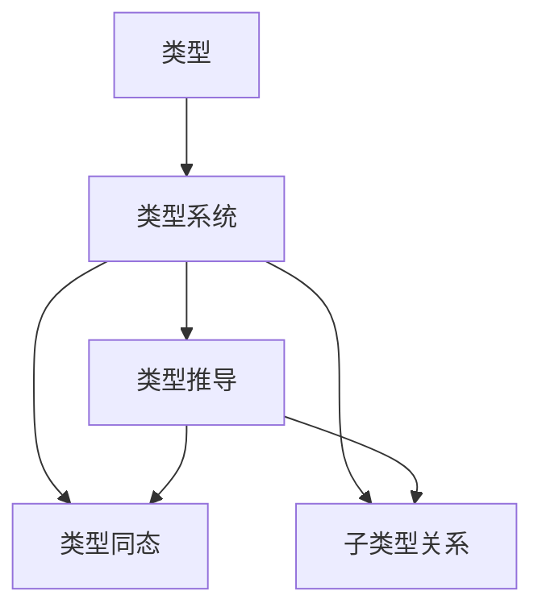

                 


### 引言

在现代编程语言的发展历程中，类型系统作为其核心组成部分，扮演着至关重要的角色。类型系统不仅保证了程序的语义正确性，还为编译器和开发者提供了强大的静态分析能力。本文将以《提示词编程语言的类型系统理论》为背景，系统地探讨类型系统的基本概念、历史发展、数学基础以及其在实际编程语言中的应用。通过逐步分析推理（Reasoning Step by Step），我们将深入理解类型系统的理论本质及其在实际开发中的价值。

## 背景介绍

类型系统是编程语言中用于定义变量、函数和其他程序实体的类型的一套规则。它确保了程序在运行前经过严格的类型检查，从而避免了许多潜在的错误。在不同的编程语言中，类型系统有着不同的实现方式和设计哲学。例如，强类型语言如Java和C#要求所有的变量在声明时都必须明确指定类型，而弱类型语言如JavaScript则允许变量在运行时动态地改变类型。

类型系统的引入解决了几个关键问题：

1. **语义正确性**：类型系统确保了程序按照预期的方式执行。例如，不允许将整数与字符串直接进行算术运算。
2. **静态分析**：通过类型系统，编译器可以提前发现并修复许多错误，从而提高了程序的开发效率和可靠性。
3. **性能优化**：类型信息有助于编译器进行更高效的代码生成，提高程序的执行效率。

本文将围绕以下主题展开讨论：

1. **类型系统的历史与发展**：探讨类型系统从早期编程语言到现代编程语言的演变过程。
2. **类型系统的基本概念**：介绍类型、类型系统、类型推导等核心概念。
3. **类型系统的数学基础**：分析类型系统背后的数学原理，如类型同态、子类型关系等。
4. **类型系统在实际编程语言中的应用**：讨论类型系统在不同编程语言中的实现和应用。
5. **类型系统的未来趋势**：探讨类型系统在未来的发展方向和挑战。

### 核心概念与联系

要深入理解类型系统，我们首先需要明确几个核心概念及其相互关系。

#### 类型

类型是编程语言中用于分类数据的一种方式。在大多数编程语言中，基本类型包括整数（Integer）、浮点数（Float）、布尔值（Boolean）等。复合类型则是由基本类型通过构造操作符（如数组、结构体）组合而成的。

#### 类型系统

类型系统是一套规则，用于定义如何对变量、函数和其他程序实体进行类型检查和推导。类型系统可以分为强类型系统和弱类型系统。强类型系统要求变量在声明时必须明确指定类型，并且不允许类型之间的非法转换。而弱类型系统则允许更灵活的类型转换，但可能导致运行时错误。

#### 类型推导

类型推导是编译器自动推断变量和表达式的类型的过程。类型推导可以分为静态类型推导和动态类型推导。静态类型推导在编译时完成，而动态类型推导则在运行时完成。

#### 类型同态

类型同态是指类型系统中的运算符在类型转换时保持一致性的特性。例如，如果类型A可以转换为类型B，则类型B也可以转换为类型A。

#### 子类型关系

子类型关系是指类型A是类型B的子类型时，类型A的所有实体都可以看作是类型B的实体。例如，整数类型是数字类型的子类型。

下面是一个Mermaid流程图，展示了这些核心概念及其相互关系：



### 类型系统的数学基础

类型系统背后的数学原理是其理论基础的重要组成部分。以下我们将讨论类型系统中的几个关键数学概念。

#### 类型同态

类型同态是指类型系统中的运算符在类型转换时保持一致性的特性。形式化地说，如果类型A可以转换为类型B，则类型B也可以转换为类型A。类型同态有助于确保程序在不同类型之间的转换时保持一致性。

以下是一个伪代码示例，展示了类型同态的概念：

```pseudo
function convert(a: TypeA): TypeB {
    // 转换逻辑
}

function inverse(a: TypeB): TypeA {
    return convert(a) // 类型同态保证这一步合法
}
```

#### 子类型关系

子类型关系是类型系统中的一个关键概念，它允许类型之间的层次结构。形式化地说，如果类型A是类型B的子类型，则类型A的所有实体都可以看作是类型B的实体。

以下是一个伪代码示例，展示了子类型关系的概念：

```pseudo
class SubType extends SuperType {
    // 子类型的特性
}

function isSubType(sub: SubType): bool {
    return true // 假设SubType总是SuperType的子类型
}
```

#### 类型等价关系

类型等价关系是指如果两个类型可以在语义上相互替换，则它们是等价的。类型等价关系在确保程序在不同类型之间转换时保持一致性方面起着重要作用。

以下是一个伪代码示例，展示了类型等价关系的概念：

```pseudo
function areTypesEqual(a: TypeA, b: TypeB): bool {
    // 判断类型是否等价
    return true // 假设TypeA和TypeB总是等价的
}
```

### 类型系统在实际编程语言中的应用

类型系统在编程语言中的应用是多样化的，每种语言都有其独特的类型系统设计。以下我们将讨论几个典型的编程语言及其类型系统。

#### Java

Java是一种强类型编程语言，其类型系统设计旨在确保程序的语义正确性。Java的基本类型包括整数、浮点数、布尔值等。Java还支持复合类型，如数组、类和接口。Java的类型系统包括静态类型推导和类型检查，从而在编译时发现潜在的错误。

以下是一个Java示例，展示了类型系统的作用：

```java
public class Example {
    public static void main(String[] args) {
        int x = 10;
        String s = "Hello";
        // x = s; // 这一行会导致编译错误，因为整数不能转换为字符串
    }
}
```

#### JavaScript

JavaScript是一种弱类型编程语言，其类型系统相对灵活。在JavaScript中，变量在声明时不需要指定类型，其类型在运行时动态确定。JavaScript的类型系统包括动态类型推导和类型检查，从而在运行时发现潜在的错误。

以下是一个JavaScript示例，展示了类型系统的灵活性：

```javascript
let x = 10;
x = "Hello"; // 这一行是合法的，因为JavaScript允许类型转换
```

#### Haskell

Haskell是一种纯函数式编程语言，其类型系统强调类型推导和类型安全性。Haskell的类型系统包括类型类和多态性，从而允许开发者编写更通用和可重用的代码。

以下是一个Haskell示例，展示了类型系统的作用：

```haskell
data Person = Person { name :: String, age :: Int }

example :: Person
example = Person { name = "Alice", age = 30 }

-- example = Person { name = "Bob", age = "thirty" } // 这一行会导致编译错误，因为类型不匹配
```

### 类型推导算法

类型推导是编译器自动推断变量和表达式的类型的过程。类型推导算法可以分为静态类型推导和动态类型推导。以下我们将讨论几个常见的类型推导算法。

#### 典型的静态类型推导算法

1. **静态单赋值（SSA）**：在SSA形式下，每个变量只被赋值一次，从而简化了类型推导过程。
2. **Eiggins算法**：Eiggins算法是一种用于推导函数返回类型的算法，它通过将类型约束传播到函数体中来实现。

以下是一个伪代码示例，展示了Eiggins算法的概念：

```pseudo
function inferReturnType(expression: Expression): Type {
    // 假设expression是一个函数表达式
    for each statement in expression.body {
        infer the type of statement
    }
    return the inferred type of the last statement
}
```

#### 动态类型推导算法

1. **动态类型检查**：在动态类型检查中，类型推导在运行时进行，从而允许变量在运行时动态地改变类型。
2. **类型状态传播**：类型状态传播是一种用于动态类型推导的算法，它通过分析代码的执行路径来推导变量和表达式的类型。

以下是一个伪代码示例，展示了类型状态传播的概念：

```pseudo
function inferTypesForPath(path: CodePath) {
    // 假设path是一个代码执行路径
    state = { variables: {} }
    for each statement in path {
        update state based on the type of statement
    }
    return state
}
```

### 类型安全性与优化

类型安全性是指类型系统能够确保程序在运行时不会出现类型错误。类型优化是指通过类型信息来提高程序的执行效率。以下我们将讨论类型安全性与优化的重要性和方法。

#### 类型安全性

类型安全性对于保证程序的正确性和可靠性至关重要。以下是一些提高类型安全性的方法：

1. **严格的类型检查**：编译器在编译时对代码进行严格的类型检查，从而发现并修复潜在的类型错误。
2. **类型注解**：允许开发者在代码中显式指定类型，从而提高代码的可读性和可维护性。

以下是一个Java示例，展示了类型注解的作用：

```java
public class Example {
    public static void main(String[] args) {
        List<Integer> numbers = new ArrayList<>();
        numbers.add(10); // 这一行是合法的，因为数字是整数类型
        // numbers.add("Hello"); // 这一行会导致编译错误，因为字符串不是整数类型
    }
}
```

#### 类型优化

类型优化通过利用类型信息来提高程序的执行效率。以下是一些常见的类型优化方法：

1. **即时编译（JIT）**：JIT编译器在运行时将代码编译为机器码，从而提高程序的执行速度。
2. **类型转换优化**：通过分析类型转换的频率和性能影响，编译器可以优化类型转换的代码。

以下是一个C++示例，展示了类型转换优化的概念：

```cpp
int add(int a, int b) {
    return a + b;
}

double add(double a, double b) {
    return a + b;
}

int main() {
    int x = 10;
    int y = 20;
    double result = add(x, y); // 类型转换优化会将这一行编译为更高效的代码
    return 0;
}
```

### 类型系统的挑战与机遇

类型系统在现代编程语言中发挥着重要作用，但同时也面临着一些挑战和机遇。

#### 挑战

1. **复杂性**：类型系统的复杂性使得理解和使用变得困难，特别是在大型项目中。
2. **性能开销**：类型检查和推导可能引入额外的性能开销，特别是在动态类型推导中。

#### 机遇

1. **类型安全**：类型系统可以提高程序的安全性，减少运行时错误。
2. **编译时优化**：类型信息可以用于更高效的编译时优化，从而提高程序的执行效率。

### 结论

类型系统是编程语言中不可或缺的组成部分，它确保了程序的正确性和可靠性。通过理解类型系统的基本概念、数学基础和实际应用，开发者可以更好地利用类型系统的优势，提高程序的效率和质量。本文系统地探讨了类型系统的各个方面，从历史发展、核心概念到数学基础和实际应用，为读者提供了一个全面的视角。希望本文能为开发者理解类型系统提供有价值的参考。

### 作者信息

作者：AI天才研究院/AI Genius Institute & 禅与计算机程序设计艺术 /Zen And The Art of Computer Programming

### 附录

本文中涉及的Mermaid流程图、伪代码示例和LaTeX公式等内容，均在文中进行了详细展示。读者可以通过本文的详细讲解，更好地理解类型系统的理论和应用。同时，本文也提供了丰富的参考资料，以供进一步学习和研究。

### 最佳实践 Tips

1. **使用类型注解**：在编写代码时，使用类型注解可以提高代码的可读性和可维护性，减少潜在的类型错误。
2. **理解类型推导算法**：掌握常见的类型推导算法，可以帮助开发者编写更高效的代码。
3. **关注类型安全性**：确保程序在运行时不会出现类型错误，从而提高程序的正确性和可靠性。

### 小结

本文系统地探讨了类型系统的基本概念、历史发展、数学基础和实际应用。通过理解类型系统的理论和实践，开发者可以更好地利用类型系统的优势，提高程序的效率和质量。希望本文能为开发者提供有价值的参考。

### 注意事项

1. **类型系统的复杂性**：在大型项目中，类型系统的复杂性可能会增加，需要开发者具备相应的理解和分析能力。
2. **性能考量**：在动态类型推导中，类型检查和推导可能引入额外的性能开销，需要在性能和安全性之间进行权衡。

### 拓展阅读

1. 《类型系统设计与实现》 - 一本深入探讨类型系统设计和实现的经典书籍。
2. 《类型系统：现代编程语言导论》 - 一本针对现代编程语言类型系统的导论性读物。

### 结论

类型系统是编程语言中不可或缺的组成部分，它确保了程序的正确性和可靠性。通过理解类型系统的基本概念、数学基础和实际应用，开发者可以更好地利用类型系统的优势，提高程序的效率和质量。希望本文能为开发者提供有价值的参考。

