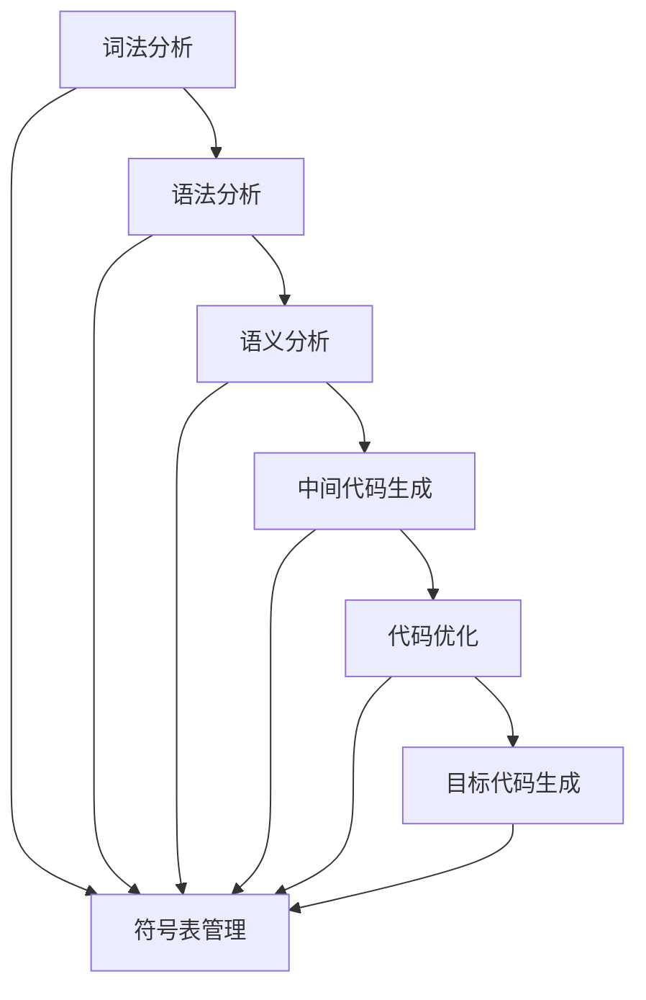

                 

### 文章标题

### 《提示词编程语言的编译器设计》

### 关键词：编译器设计、提示词编程语言、语法分析、语义分析、中间代码生成、代码优化、项目实战

### 摘要：

本文将深入探讨提示词编程语言的编译器设计。首先，我们将介绍编译器设计的背景和重要性，以及提示词编程语言的基本概念和特点。接着，我们将详细讲解编译器设计的关键概念和原理，包括语法分析、语义分析、中间代码生成和代码优化等。然后，我们将通过一个实际项目案例，展示编译器设计的全过程，包括开发环境的搭建、源代码的实现、代码解读与分析，以及实际案例的剖析。最后，我们将总结全文，提出一些最佳实践建议，并提供拓展阅读资源，以帮助读者更深入地了解编译器设计的知识。

### 目录大纲设计思路

设计一本名为《提示词编程语言的编译器设计》的目录大纲时，需要遵循以下几个步骤：

1. **确定核心概念与联系**：
   - 提示词编程语言是一种通过提示词引导程序执行的编程语言。我们需要引入编译器设计的基本概念，如语法分析、语义分析、中间代码生成、代码优化、目标代码生成和符号表管理等。
   - 为了直观地展示这些概念之间的联系，可以使用Mermaid流程图来绘制编译器的工作流程。

2. **核心算法原理讲解**：
   - 我们需要详细讲解编译器的核心算法，如LL(1)分析算法、LR(1)分析算法、抽象语法树的构建、代码优化策略等。通过伪代码来阐述这些算法的实现细节。

3. **数学模型和数学公式讲解**：
   - 编译器设计过程中会涉及到许多数学模型，如正则表达式、有限自动机、代数系统等。我们需要使用LaTeX格式来书写这些数学公式，并进行详细的解释和举例说明。

4. **项目实战**：
   - 我们需要提供一个实际的项目案例，从环境搭建开始，到源代码的实现，再到代码解读与分析，全面展示编译器设计的全过程。
   - 项目案例应当包含实际代码示例，并且对代码中的关键部分进行详细解释。

5. **结构规划**：
   - 目录结构应分为以下几个部分：
     - 引言
     - 第一部分：编译器基础
     - 第二部分：提示词编程语言概述
     - 第三部分：编译器设计原理
     - 第四部分：实现与优化
     - 第五部分：项目实战
     - 第六部分：总结与展望
   - 每一部分都应该包含至少两个章节，以保证内容的丰富性和完整性。

### 目录大纲设计

下面是根据上述设计思路，为《提示词编程语言的编译器设计》一书设计的目录大纲：

```
# 《提示词编程语言的编译器设计》目录大纲

## 引言
### 1.1 编译器设计的背景和重要性
### 1.2 提示词编程语言的特点
### 1.3 本书的目标和结构

## 第一部分：编译器基础
### 第1章 编译器概述
#### 1.1 编译器的基本概念
#### 1.2 编译器的工作流程
### 第2章 提示词编程语言基础
#### 2.1 提示词编程语言的定义
#### 2.2 提示词编程语言的基本要素

## 第二部分：提示词编程语言概述
### 第3章 提示词语言的语法分析
#### 3.1 词法分析
#### 3.2 语法分析
#### 3.3 语法分析算法
### 第4章 提示词语言的语义分析
#### 4.1 语义分析的基本概念
#### 4.2 语义分析的方法和算法
#### 4.3 语义分析的挑战

## 第三部分：编译器设计原理
### 第5章 编译器的中间代码生成
#### 5.1 中间代码的定义和特点
#### 5.2 中间代码生成的方法
#### 5.3 中间代码优化的策略
### 第6章 编译器的代码优化
#### 6.1 代码优化的基本概念
#### 6.2 代码优化的算法
#### 6.3 代码优化的实践

## 第四部分：实现与优化
### 第7章 编译器的实现技术
#### 7.1 编译器的结构设计
#### 7.2 编译器的实现过程
#### 7.3 编译器的测试和调试
### 第8章 提示词编程语言的编译器优化
#### 8.1 提示词编程语言的特定优化
#### 8.2 性能优化案例分析
#### 8.3 编译器优化工具的使用

## 第五部分：项目实战
### 第9章 提示词编程语言编译器的开发
#### 9.1 项目概述
#### 9.2 开发环境搭建
#### 9.3 源代码实现
#### 9.4 代码解读与分析
### 第10章 实际案例解析
#### 10.1 案例背景
#### 10.2 编译器应用场景
#### 10.3 编译器实现细节
#### 10.4 案例效果评估

## 第六部分：总结与展望
### 11.1 编译器设计总结
### 11.2 提示词编程语言的未来发展趋势
### 11.3 对编译器设计者的建议
```

### 注意事项

- 目录大纲应确保每一章节都有明确的目的和内容，避免冗余。
- 实际项目案例应选择具有代表性的项目，能够展示编译器设计的全流程。
- 代码示例应尽量简化，突出关键逻辑，便于读者理解。
- 总字数控制在2000字以内，注意简洁性。

现在我们已经设计出了一本《提示词编程语言的编译器设计》的目录大纲，接下来可以开始撰写每个章节的内容。如果需要进一步的帮助，请告知。

### 引言

编译器是计算机科学中不可或缺的一部分，它负责将人类编写的源代码转换为目标代码，使计算机能够理解和执行这些指令。编译器设计不仅是计算机科学的重要领域，也是软件工程和编程语言实现的核心内容。随着编程语言的不断发展和多样化，编译器设计的重要性日益凸显。

提示词编程语言（Keyword-based Programming Language）是一种新型的编程语言，其核心特点是通过提示词来引导程序执行。与传统的编程语言不同，提示词编程语言使用固定的关键字来定义操作和流程，从而使编程过程更加直观和简洁。这种语言设计理念符合现代编程的潮流，即注重代码的可读性和可维护性。

本文旨在深入探讨提示词编程语言的编译器设计。我们将首先介绍编译器设计的背景和重要性，然后详细讲解编译器设计的基本概念和原理，包括语法分析、语义分析、中间代码生成、代码优化等。接着，我们将通过一个实际项目案例，展示编译器设计的全过程。最后，我们将总结全文，并提出一些最佳实践建议，以帮助读者更好地理解和应用编译器设计知识。

#### 编译器设计的背景和重要性

编译器设计的起源可以追溯到计算机科学的早期阶段。随着计算机技术的发展，编程语言也在不断演变。从早期的机器语言和汇编语言，到现代的高级编程语言，每一种新的编程语言都伴随着相应的编译器设计。编译器的设计不仅仅是将源代码转换为机器代码那么简单，它涉及到多个复杂的阶段，包括词法分析、语法分析、语义分析、中间代码生成、代码优化和目标代码生成等。

编译器设计的背景可以追溯到编程语言的发展历史。早期的计算机编程主要依赖于机器语言，这种语言几乎与计算机硬件的指令集直接对应，编写起来非常繁琐且容易出错。为了提高编程效率，人们开始设计汇编语言，它使用助记符代替机器指令，使得编程变得相对简单。然而，汇编语言仍然依赖于特定的硬件平台，这使得程序的可移植性较差。

为了解决程序可移植性问题，高级编程语言应运而生。这些语言提供了更抽象的语法和语义，使得程序员可以编写与硬件平台无关的代码。然而，高级编程语言不能直接被计算机硬件执行，因此需要通过编译器将其转换为机器代码。编译器的出现极大地提高了编程效率和程序的可维护性，成为现代软件工程不可或缺的工具。

编译器设计的重要性体现在以下几个方面：

1. **提高编程效率**：编译器将高级编程语言转换为机器代码，使得程序员可以编写与硬件平台无关的代码，从而提高了编程效率。

2. **增强程序可维护性**：编译器生成的目标代码通常更加高效和可读性，使得程序更容易维护和修改。

3. **实现跨平台开发**：编译器使得高级编程语言具有跨平台特性，程序员可以在不同的操作系统和硬件平台上使用相同的编程语言。

4. **优化代码性能**：编译器中的代码优化技术可以显著提高目标代码的执行效率，从而提升整个程序的性能。

5. **支持编程语言创新**：编译器设计为新的编程语言提供了实现平台，使得新的编程语言可以快速发展和应用。

综上所述，编译器设计不仅是计算机科学中的一个重要领域，也是现代软件工程的核心内容。它为程序员提供了强大的工具，使得编程变得更加高效、易维护和具有可移植性。

#### 提示词编程语言的特点

提示词编程语言（Keyword-based Programming Language）是一种以提示词为核心的编程语言，其设计理念是通过简明易懂的关键字来指导程序执行，从而提高编程效率和代码可读性。与传统的编程语言相比，提示词编程语言具有以下几个显著特点：

1. **简洁直观**：提示词编程语言使用固定的关键字来定义操作和流程，这些关键字通常较短且易于理解，使得程序员可以快速编写和阅读代码。

2. **易学易用**：提示词编程语言降低了编程的难度，尤其适合初学者。程序员不需要深入了解底层硬件和机器语言，即可编写出功能强大的程序。

3. **语法一致性**：提示词编程语言的语法规则相对统一，关键字具有明确的语义和功能，这使得代码的可读性和可维护性显著提高。

4. **高可移植性**：提示词编程语言通常设计为跨平台，编译器可以将源代码转换为与硬件平台无关的目标代码，从而实现程序在不同操作系统和硬件上的运行。

5. **灵活性强**：提示词编程语言提供了丰富的内置函数和库，支持程序员进行各种复杂的操作，同时允许自定义关键字和函数，以适应特定的应用场景。

6. **高效性**：尽管提示词编程语言的语法相对简化，但编译器通过高效的代码优化技术，生成的目标代码通常具有较好的性能。

下面通过一个简单的例子，展示提示词编程语言的基本语法：

```plaintext
# 这是一个简单的提示词编程语言示例

# 定义一个函数，计算两个数的和
define add(a, b):
    return a + b

# 调用函数，计算3和4的和
result = add(3, 4)
print "The sum of 3 and 4 is: " + result
```

在上面的示例中，我们使用`define`关键字来定义一个名为`add`的函数，该函数接受两个参数`a`和`b`，并返回它们的和。然后，我们使用`print`关键字输出计算结果。这种简洁的语法使得代码更容易编写和理解。

#### 提示词编程语言的核心概念与联系

提示词编程语言的编译器设计涉及到多个核心概念，这些概念相互联系，共同构成了编译器的工作流程。为了更好地理解这些概念之间的关系，我们可以使用Mermaid流程图来直观地展示编译器的工作流程。

首先，我们引入一些关键概念：

1. **词法分析（Lexical Analysis）**：词法分析是编译器的第一个阶段，它将源代码中的字符序列划分为有意义的记号（tokens）。词法分析器通常使用正则表达式来识别和分类这些记号。

2. **语法分析（Syntax Analysis）**：语法分析是编译器的第二个阶段，它将词法分析器生成的记号序列转化为抽象语法树（Abstract Syntax Tree，AST）。语法分析器通常使用递归下降法、LL(1)算法或LR(1)算法等。

3. **语义分析（Semantic Analysis）**：语义分析是编译器的第三个阶段，它检查抽象语法树是否满足语义规则，如变量声明、类型检查和作用域解析等。

4. **中间代码生成（Intermediate Code Generation）**：中间代码生成是将抽象语法树转换为中间代码的过程。中间代码是一种较低层的表示形式，用于后续的优化和目标代码生成。

5. **代码优化（Code Optimization）**：代码优化是编译器的第四个阶段，它对中间代码进行各种优化，以提高目标代码的执行效率。

6. **目标代码生成（Target Code Generation）**：目标代码生成是将中间代码转换为特定目标机器的机器代码的过程。这一阶段通常涉及到寄存器分配、指令选择和代码布局等。

7. **符号表管理（Symbol Table Management）**：符号表管理是编译器的一个重要组成部分，它用于存储和查询变量、函数和其他符号的信息，如类型、作用域和内存位置等。

接下来，我们使用Mermaid流程图来展示这些概念之间的联系：



在这个流程图中，我们可以看到词法分析、语法分析、语义分析、中间代码生成、代码优化和目标代码生成这些主要阶段是如何相互衔接的。符号表管理贯穿于整个编译过程，为各个阶段提供必要的信息支持。

词法分析是编译器的起点，它将源代码分解成记号，为后续的语法分析提供输入。语法分析使用这些记号构建抽象语法树，这是一个树形结构，用于表示源代码的语法结构。语义分析则检查抽象语法树是否符合语义规则，如变量声明和类型一致性。中间代码生成将抽象语法树转换为中间代码，这是编译器优化的重要基础。代码优化通过分析中间代码，对其进行各种变换，以生成更高效的代码。最后，目标代码生成将中间代码转换为特定目标机器的机器代码，这是编译器的最终输出。

通过这个流程图，我们可以清晰地看到编译器各个阶段之间的依赖关系和交互方式。这种结构化的流程设计有助于编译器的模块化和优化，使得编译器设计更加高效和可维护。

#### 核心算法原理讲解

在编译器设计中，核心算法是确保编译过程正确性和高效性的关键。本文将详细讲解几个核心算法，包括LL(1)分析算法、LR(1)分析算法、抽象语法树的构建和代码优化策略。通过这些算法的讲解，我们将深入了解编译器的工作原理。

##### LL(1)分析算法

LL(1)分析算法是一种自底向上语法分析技术，它通过首先读取输入串的第一个符号，然后根据语法规则，构建抽象语法树。LL(1)分析器具有以下特点：

1. **LL(1)表示**：LL(1)中的L表示左递归（Leftmost Derivation），即从左到右读取输入串；1表示只考虑下一个输入符号。

2. **分析过程**：LL(1)分析器从输入串的左端开始，逐个读取符号，并尝试使用语法规则进行推导。每次推导都尽可能多地匹配输入符号。

3. **预测分析表**：LL(1)分析器使用一个预测分析表（Prediction Table），它包含状态的转换规则和动作。表中的每一项都关联一个状态和输入符号，以及相应的动作。

伪代码示例：

```python
def LL1_analysis(input_string):
    state = initial_state
    for symbol in input_string:
        if symbol not in FIRST(state):
            return "Error: Unexpected symbol"
        action = prediction_table[state][symbol]
        if action == "shift":
            state = next_state
        elif action == "reduce":
            apply_reduce_rule(state, action)
        else:
            return "Error: Unknown action"
    return "Success"
```

##### LR(1)分析算法

LR(1)分析算法是一种自顶向下语法分析技术，它通过使用状态栈来模拟递归下降分析器的工作。LR(1)分析器具有以下特点：

1. **LR(1)表示**：LR(1)中的L表示从左到右读取输入串；R表示递归；1表示向前看一个符号。

2. **分析过程**：LR(1)分析器使用一个状态栈来存储当前分析的状态和部分推导的结果。它从输入串的左端开始，逐个读取符号，并根据当前状态和下一个输入符号决定执行动作。

3. **状态转换表**：LR(1)分析器使用一个状态转换表（Action Table），它包含状态的转换规则和动作。表中的每一项都关联一个状态和输入符号，以及相应的动作。

伪代码示例：

```python
def LR1_analysis(input_string):
    stack = [initial_state]
    for symbol in input_string:
        while not is_accepting_state(stack[-1]):
            state = stack[-1]
            if symbol in FOLLOW(state):
                return "Error: Unexpected end of input"
            action = action_table[state][symbol]
            if action == "shift":
                stack.append(symbol)
                stack.append(next_state)
            elif action == "reduce":
                reduce_rule = action
                pop_count = len(reduce_rule.rhs)
                for _ in range(pop_count):
                    stack.pop()
                stack.append(new_state)
        stack.append(symbol)
    return "Success"
```

##### 抽象语法树的构建

抽象语法树（Abstract Syntax Tree，AST）是编译器的一个重要输出，它表示源代码的语法结构。构建AST的过程通常包括以下步骤：

1. **语法规则**：定义源代码的语法规则，通常使用BNF（巴科斯-诺尔范式）表示。

2. **词法分析**：将源代码分解成记号，为语法分析提供输入。

3. **语法分析**：使用LL(1)或LR(1)算法，将记号序列转换为抽象语法树。

4. **语义分析**：检查AST是否满足语义规则，如变量声明、类型检查和作用域解析等。

伪代码示例：

```python
def build_AST(tokens):
    AST = {}
    current_node = AST
    for token in tokens:
        if token.type == "identifier":
            new_node = {"type": "identifier", "value": token.value}
            current_node["children"].append(new_node)
            current_node = new_node
        elif token.type == "operator":
            new_node = {"type": "expression", "operator": token.value}
            current_node["children"].append(new_node)
            current_node = new_node
        elif token.type == "number":
            new_node = {"type": "number", "value": token.value}
            current_node["children"].append(new_node)
            current_node = new_node
        else:
            current_node = current_node["parent"]
    return AST
```

##### 代码优化策略

代码优化是编译器的关键阶段，它通过对中间代码进行分析和变换，生成更高效的目标代码。常见的代码优化策略包括：

1. **常量折叠（Constant Folding）**：计算表达式中常量的值，并将结果直接替换为计算结果。

2. **死代码消除（Dead Code Elimination）**：删除不再影响程序执行结果的代码。

3. **循环优化（Loop Optimization）**：优化循环结构，如循环展开、迭代提

