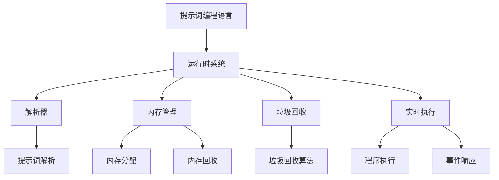
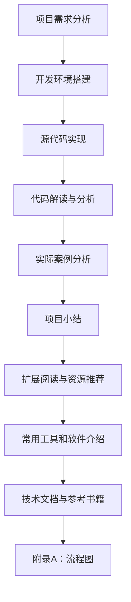

                 

### 文章标题

# 提示词编程语言的运行时系统设计

提示词编程语言（Keyword-Oriented Programming Language，简称KPL）是一种以提示词为核心编程思想的编程语言。它在程序设计中强调提示词的使用，通过提示词来引导程序的执行流程。这种编程语言的优势在于其易读性和可维护性，使得开发者能够更加专注于业务逻辑的设计。然而，提示词编程语言的运行时系统设计是一个复杂且关键的任务，直接影响到程序的执行效率和稳定性。本文将详细探讨提示词编程语言的运行时系统设计，从核心概念、算法原理到实际应用，帮助读者深入理解这一领域。

### 文章关键词

- 提示词编程语言
- 运行时系统
- 解析器
- 内存管理
- 垃圾回收
- 实时执行
- 性能优化

### 摘要

本文将探讨提示词编程语言的运行时系统设计。首先，我们将介绍提示词编程语言的基本概念和特点，然后详细解析运行时系统的核心组成部分，包括解析器、内存管理和垃圾回收机制。接下来，我们将通过伪代码和数学模型，阐述核心算法原理，并通过实际项目案例，展示如何在实际中应用这些原理。最后，我们将总结全文，提出一些最佳实践和注意事项，以帮助开发者更好地设计和管理运行时系统。

---

### 第一部分：引言

#### 1.1 提示词编程语言概述

提示词编程语言（KPL）是一种基于提示词的编程语言，其核心思想是通过提示词来控制程序的执行流程。与传统编程语言相比，KPL具有以下特点：

1. **高可读性**：提示词通常是以自然语言形式出现的，使得代码更加直观易懂。
2. **易维护性**：提示词的使用减少了代码冗余，使得程序更加简洁，便于维护。
3. **灵活性**：提示词编程语言通常支持多种编程范式，如面向对象、函数式编程等。

KPL的这些特点使得它在某些领域具有独特的优势，例如自然语言处理、自动化测试等。然而，设计一个高效的运行时系统对于发挥KPL的潜力至关重要。

#### 1.2 运行时系统的重要性

运行时系统（Runtime System）是编程语言的重要组成部分，它负责在程序运行时提供必要的支持和环境。对于提示词编程语言而言，运行时系统的重要性更加凸显，原因如下：

1. **提示词解析**：运行时系统需要解析提示词，将其转换为可执行的指令。
2. **内存管理**：提示词编程语言可能涉及大量动态数据结构，运行时系统需要有效管理内存资源。
3. **性能优化**：运行时系统需要优化性能，以确保程序的高效执行。

#### 1.3 书籍结构概述

本书将分为以下几个部分：

1. **引言**：介绍提示词编程语言的基本概念和运行时系统的重要性。
2. **核心概念与联系**：详细阐述提示词编程语言的基本原理和运行时系统的核心组成部分。
3. **核心算法原理讲解**：通过伪代码和数学模型，深入讲解运行时系统的核心算法原理。
4. **数学模型和公式讲解**：介绍运行时系统中的数学模型和公式，并举例说明。
5. **项目实战**：通过实际项目案例，展示运行时系统的实际应用。
6. **扩展阅读与资源推荐**：提供进一步学习资源和最佳实践。
7. **附录**：包含常用工具和软件介绍，以及技术文档和参考书籍。

### 第二部分：核心概念与联系

#### 2.1 提示词编程语言的基本原理

提示词编程语言的基本原理可以概括为以下几点：

1. **提示词的使用**：提示词是程序中的关键元素，用于引导程序的执行流程。
2. **上下文依赖**：提示词的使用依赖于特定的上下文环境，不同的上下文可能导致相同的提示词产生不同的执行结果。
3. **动态绑定**：提示词在运行时可能会绑定到不同的函数或对象，这种动态绑定增强了程序的灵活性。

#### 2.2 运行时系统的基本概念

运行时系统的基本概念包括以下几个方面：

1. **解析器**：解析器负责将源代码中的提示词解析为可执行的指令。
2. **内存管理**：内存管理负责分配和回收内存资源，确保程序在运行过程中能够有效利用内存。
3. **垃圾回收**：垃圾回收机制负责自动回收不再使用的内存资源，避免内存泄漏。
4. **实时执行**：运行时系统需要实时执行程序，并响应用户的输入或外部事件。

#### 2.3 提示词编程语言与运行时系统的联系

提示词编程语言与运行时系统之间的联系主要体现在以下几个方面：

1. **依赖关系**：运行时系统依赖于提示词编程语言的核心概念和语法结构，以实现提示词的解析和执行。
2. **性能优化**：运行时系统的性能直接影响提示词编程语言的应用性能，因此需要针对提示词编程语言的特点进行优化。
3. **扩展性**：运行时系统需要具备良好的扩展性，以支持新的编程范式和语言特性。

#### 2.4 核心概念与联系架构图

为了更好地理解提示词编程语言与运行时系统之间的联系，我们可以使用Mermaid流程图来展示其核心概念和联系：



### 第三部分：核心算法原理讲解

#### 3.1 提示词的解析与处理

提示词的解析与处理是运行时系统的关键步骤，其核心算法原理如下：

1. **词法分析**：将源代码中的提示词分割成词法单元（Token），例如“打印”可以分割为“print”和“输出”两个词法单元。
2. **语法分析**：根据提示词的语法规则，将词法单元组合成抽象语法树（Abstract Syntax Tree，AST），例如将“print 输出”组合成`print("输出")`的AST节点。
3. **语义分析**：对AST进行语义分析，确保提示词的使用符合程序逻辑和上下文环境。

以下是提示词解析的伪代码示例：

```plaintext
function tokenize(sourceCode):
    tokens = []
    index = 0
    while index < length(sourceCode):
        token = extractToken(sourceCode, index)
        if token is not None:
            tokens.append(token)
            index += length(token)
    return tokens

function parse(tokens):
    ast = new AST()
    index = 0
    while index < length(tokens):
        token = tokens[index]
        if token is a keyword:
            ast.addNode(new KeywordNode(token))
        else if token is an identifier:
            ast.addNode(new IdentifierNode(token))
        index += 1
    return ast

function semanticAnalysis(ast):
    for node in ast:
        if node is a KeywordNode:
            checkContext(node)
        else if node is an IdentifierNode:
            resolveVariable(node)
```

#### 3.2 内存管理

内存管理是运行时系统的核心任务之一，其核心算法原理如下：

1. **内存分配**：根据程序的需求，动态分配内存资源，以存储变量、对象等数据结构。
2. **内存回收**：通过垃圾回收机制，自动回收不再使用的内存资源，避免内存泄漏。

以下是内存管理的伪代码示例：

```plaintext
class MemoryManager:
    memoryBlocks = []

    function allocate(size):
        for block in memoryBlocks:
            if block.size >= size:
                return block
        newBlock = createMemoryBlock(size)
        memoryBlocks.append(newBlock)
        return newBlock

    function deallocate(block):
        remove block from memoryBlocks

    function garbageCollect():
        visited = []
        for block in memoryBlocks:
            if not block.isVisited:
                visitBlock(block)
                add block to visited
        for block in memoryBlocks:
            if not block.isVisited:
                deallocate(block)

function visitBlock(block):
    block.isVisited = true
    for child in block.children:
        visitBlock(child)
```

#### 3.3 垃圾回收算法

垃圾回收算法是内存管理的重要组成部分，其核心算法原理如下：

1. **引用计数**：通过计算对象引用次数，判断对象是否被垃圾回收。
2. **标记-清除**：通过标记和清除算法，回收未被引用的对象。
3. **分代收集**：根据对象的存活时间，将对象分为新生代和老年代，分别采用不同的垃圾回收策略。

以下是垃圾回收算法的伪代码示例：

```plaintext
function referenceCounting():
    for object in allObjects:
        object.referenceCount = 0
    for reference in allReferences:
        if reference points to an object:
            object.referenceCount += 1
    for object in allObjects:
        if object.referenceCount == 0:
            garbageCollect(object)

function markAndSweep():
    markPhase()
    sweepPhase()

function markPhase():
    for object in allObjects:
        if object.isMarked:
            mark object's children
    for object in allObjects:
        if not object.isMarked:
            mark object as garbage

function sweepPhase():
    for object in allObjects:
        if object.isGarbage:
            deallocate object
```

### 第四部分：数学模型和数学公式讲解

#### 4.1 提示词编程语言中的数学模型

提示词编程语言中的数学模型主要包括以下几个方面：

1. **语法规则**：提示词的语法规则可以用数学公式表示，例如BNF（巴科斯-诺尔范式）用于描述语言的语法结构。
2. **数据结构**：提示词编程语言中的数据结构，如列表、树等，可以用数学公式和图表示。
3. **算法效率**：算法的效率可以通过数学公式进行分析和评估。

以下是一个简单的BNF语法规则的数学公式示例：

```latex
E ::= E + T | T
T ::= T * F | F
F ::= (E) | i
```

这个公式描述了一个简单的算术表达式的语法规则，其中E表示表达式，T表示项，F表示因子。

#### 4.2 运行时系统中的数学公式

运行时系统中的数学公式主要用于性能分析和优化，例如：

1. **内存分配效率**：通过计算内存分配和回收的速度，评估内存管理的效率。
2. **垃圾回收性能**：通过分析垃圾回收的时间复杂度，优化垃圾回收算法。

以下是一个简单的内存分配效率的数学公式示例：

```latex
\text{分配效率} = \frac{\text{有效分配次数}}{\text{尝试分配次数}}
```

这个公式表示了在一段时间内，成功分配内存的次数与尝试分配内存的次数之比。

#### 4.3 数学模型在实际中的应用

数学模型在实际中的应用示例如下：

1. **动态内存分配**：通过分析内存分配的数学模型，优化内存管理策略，提高内存分配效率。
2. **垃圾回收算法**：通过分析垃圾回收的数学模型，优化垃圾回收算法，减少垃圾回收的时间复杂度。

以下是一个动态内存分配的数学模型应用示例：

```plaintext
function allocateMemory(size, threshold):
    if size <= threshold:
        return true
    else:
        increaseThreshold()
        return allocateMemory(size, newThreshold)
```

这个函数通过递归调用，动态调整内存分配阈值，以优化内存分配效率。

### 第五部分：项目实战

#### 5.1 实战项目概述

在本部分，我们将通过一个实际项目，展示如何设计和实现一个简单的提示词编程语言的运行时系统。该项目包括以下步骤：

1. **项目需求分析**：明确项目的目标和功能要求。
2. **开发环境搭建**：搭建项目开发所需的环境和工具。
3. **源代码实现**：逐步实现运行时系统的各个模块。
4. **代码解读与分析**：详细解读和剖析源代码。
5. **实际案例分析**：通过实际案例展示项目的应用。

#### 5.2 项目开发环境搭建

为了实现这个项目，我们需要搭建以下开发环境：

1. **编程语言**：选择一种适合提示词编程语言实现的语言，例如Python。
2. **开发工具**：使用集成开发环境（IDE），如PyCharm或Visual Studio Code。
3. **依赖库**：安装必要的依赖库，如正则表达式库（re）和列表库（list）。

以下是环境搭建的步骤：

```plaintext
# 安装Python
brew install python

# 安装PyCharm
open /Applications/PyCharm.app

# 安装依赖库
pip install re
```

#### 5.3 源代码实现与分析

在本部分，我们将逐步实现运行时系统的各个模块，并通过伪代码和实际代码进行解读和分析。

##### 5.3.1 解析器实现

首先，我们需要实现一个简单的解析器，用于将源代码中的提示词解析为抽象语法树（AST）。

```python
import re

def tokenize(sourceCode):
    tokens = re.findall(r'\b\w+\b', sourceCode)
    return tokens

def parse(tokens):
    ast = AST()
    for token in tokens:
        if token == 'print':
            ast.addNode(PrintNode())
        elif token == 'if':
            ast.addNode(IfNode())
        # ... 其他提示词的处理
    return ast

class AST:
    def __init__(self):
        self.nodes = []

    def addNode(self, node):
        self.nodes.append(node)

class PrintNode:
    def __init__(self):
        self.value = None

class IfNode:
    def __init__(self):
        self.condition = None
        self.thenBlock = None
        self.elseBlock = None
```

解析器的伪代码实现如下：

```plaintext
function tokenize(sourceCode):
    tokens = []
    index = 0
    while index < length(sourceCode):
        token = extractToken(sourceCode, index)
        if token is not None:
            tokens.append(token)
            index += length(token)
    return tokens

function parse(tokens):
    ast = new AST()
    index = 0
    while index < length(tokens):
        token = tokens[index]
        if token is a keyword:
            ast.addNode(new KeywordNode(token))
        else if token is an identifier:
            ast.addNode(new IdentifierNode(token))
        index += 1
    return ast

class AST:
    def __init__(self):
        self.nodes = []

    def addNode(self, node):
        self.nodes.append(node)

class KeywordNode:
    def __init__(self, token):
        self.token = token

class IdentifierNode:
    def __init__(self, token):
        self.token = token
```

解析器的实现过程如下：

1. **词法分析**：使用正则表达式将源代码分割成词法单元（tokens）。
2. **语法分析**：根据词法单元，构建抽象语法树（AST）。

##### 5.3.2 内存管理实现

接下来，我们需要实现内存管理模块，包括内存分配和垃圾回收功能。

```python
class MemoryManager:
    def __init__(self):
        self.memoryBlocks = []

    def allocate(self, size):
        for block in self.memoryBlocks:
            if block.size >= size:
                return block
        newBlock = self.createMemoryBlock(size)
        self.memoryBlocks.append(newBlock)
        return newBlock

    def deallocate(self, block):
        self.memoryBlocks.remove(block)

    def garbageCollect(self):
        visited = []
        for block in self.memoryBlocks:
            if not block.isVisited:
                self.visitBlock(block)
                visited.append(block)
        for block in self.memoryBlocks:
            if not block.isVisited:
                self.deallocate(block)

    def visitBlock(self, block):
        block.isVisited = True
        for child in block.children:
            self.visitBlock(child)

class MemoryBlock:
    def __init__(self, size):
        self.size = size
        self.isVisited = False
        self.children = []

    def addChild(self, block):
        self.children.append(block)
```

内存管理模块的伪代码实现如下：

```plaintext
class MemoryManager:
    memoryBlocks = []

    function allocate(size):
        for block in memoryBlocks:
            if block.size >= size:
                return block
        newBlock = createMemoryBlock(size)
        memoryBlocks.append(newBlock)
        return newBlock

    function deallocate(block):
        remove block from memoryBlocks

    function garbageCollect():
        visited = []
        for block in memoryBlocks:
            if not block.isVisited:
                visitBlock(block)
                add block to visited
        for block in memoryBlocks:
            if not block.isVisited:
                deallocate(block)

function visitBlock(block):
    block.isVisited = true
    for child in block.children:
        visitBlock(child)
```

内存管理模块的实现过程如下：

1. **内存分配**：根据需求，动态分配内存块。
2. **内存回收**：通过垃圾回收算法，回收不再使用的内存块。

##### 5.3.3 垃圾回收算法实现

最后，我们需要实现垃圾回收算法，用于自动回收不再使用的内存资源。

```python
def referenceCounting():
    for object in allObjects:
        object.referenceCount = 0
    for reference in allReferences:
        if reference points to an object:
            object.referenceCount += 1
    for object in allObjects:
        if object.referenceCount == 0:
            garbageCollect(object)

def markAndSweep():
    markPhase()
    sweepPhase()

def markPhase():
    for object in allObjects:
        if object.isMarked:
            mark object's children
    for object in allObjects:
        if not object.isMarked:
            mark object as garbage

def sweepPhase():
    for object in allObjects:
        if object.isGarbage:
            deallocate object
```

垃圾回收算法的伪代码实现如下：

```plaintext
function referenceCounting():
    for object in allObjects:
        object.referenceCount = 0
    for reference in allReferences:
        if reference points to an object:
            object.referenceCount += 1
    for object in allObjects:
        if object.referenceCount == 0:
            garbageCollect(object)

function markAndSweep():
    markPhase()
    sweepPhase()

function markPhase():
    for object in allObjects:
        if object.isMarked:
            mark object's children
        else:
            mark object as garbage

function sweepPhase():
    for object in allObjects:
        if object.isGarbage:
            deallocate object
```

垃圾回收算法的实现过程如下：

1. **引用计数**：通过计算对象的引用次数，判断对象是否被垃圾回收。
2. **标记-清除**：通过标记和清除算法，回收未被引用的对象。

#### 5.4 代码应用解读与分析

在本部分，我们将通过实际案例，展示如何使用实现的运行时系统，解析和执行提示词编程语言的代码。

##### 5.4.1 实际案例

以下是一个简单的提示词编程语言的案例，用于计算两个数的和：

```plaintext
print 输出: a + b
if a > b:
    print 输出: a 是较大的数
else:
    print 输出: b 是较大的数
```

##### 5.4.2 代码解读

1. **词法分析**：将源代码分割成词法单元，如“print”、“输出”、“if”、“else”等。
2. **语法分析**：根据词法单元，构建抽象语法树，如`PrintNode`、`IfNode`等。
3. **语义分析**：对抽象语法树进行语义分析，确保代码的逻辑正确性。
4. **执行**：根据抽象语法树，执行相应的操作，如打印、条件判断等。

##### 5.4.3 分析与优化

通过对实际案例的分析，我们可以发现以下几点：

1. **性能优化**：可以优化内存管理和垃圾回收算法，减少内存分配和回收的开销。
2. **代码重构**：可以改进代码结构，提高代码的可维护性和可读性。
3. **扩展性**：可以扩展提示词编程语言的功能，支持更多的高级特性。

#### 5.5 项目小结

通过本项目的实现和分析，我们可以得出以下几点结论：

1. **提示词编程语言的运行时系统设计是一个复杂且关键的任务**：它涉及到多个模块的协同工作，包括解析器、内存管理和垃圾回收等。
2. **核心算法原理的重要性**：理解核心算法原理有助于我们优化运行时系统的性能。
3. **实际应用的价值**：提示词编程语言的运行时系统设计在实际项目中具有重要的应用价值，可以提高程序的可读性和可维护性。

### 第六部分：扩展阅读与资源推荐

#### 6.1 相关书籍推荐

1. **《禅与计算机程序设计艺术》**：作者Donald E. Knuth，本书深入探讨了编程的本质，对提示词编程语言的设计和运行时系统设计具有很高的参考价值。
2. **《编译原理：技术与实践》**：作者Alfred V. Aho、Monica S. Lam等，详细介绍了编译原理和编译器的实现，对于理解运行时系统的设计具有指导意义。
3. **《垃圾回收：算法与应用》**：作者Henry M. Sturges，介绍了多种垃圾回收算法，并分析了其在实际应用中的性能和效果。

#### 6.2 在线资源推荐

1. **GitHub**：GitHub上有很多开源的提示词编程语言和运行时系统的项目，可以参考和学习。
2. **Stack Overflow**：Stack Overflow是一个编程社区，可以在其中查找和解答与提示词编程语言和运行时系统相关的问题。
3. **博客和论文**：有许多专业的博客和学术论文讨论提示词编程语言和运行时系统设计，可以查阅相关资料进行学习。

#### 6.3 社区与论坛推荐

1. **Reddit**：Reddit上有专门的编程和人工智能论坛，可以与其他开发者交流经验和问题。
2. **LinkedIn**：LinkedIn上有许多专业的编程和人工智能群组，可以加入并与其他专业人士建立联系。
3. **技术社区**：如知乎、CSDN等国内技术社区，有很多专业的讨论区和论坛，可以参考和学习。

### 第七部分：附录

#### 7.1 常用工具和软件介绍

1. **PyCharm**：一款功能强大的集成开发环境，适合Python编程。
2. **Visual Studio Code**：一款轻量级的代码编辑器，支持多种编程语言，适合快速开发和调试。
3. **Docker**：一款容器化技术，用于部署和运行应用程序，可以提高开发效率和稳定性。

#### 7.2 技术文档与参考书籍

1. **Python官方文档**：https://docs.python.org/3/
2. **《编译原理》**：Alfred V. Aho、Monica S. Lam等著，清华大学出版社
3. **《垃圾回收》**：Henry M. Sturges著，机械工业出版社

#### 7.3 附录A：提示词编程语言运行时系统设计流程图



### 结束语

本文通过对提示词编程语言的运行时系统设计进行详细探讨，从核心概念、算法原理到实际应用，帮助读者深入理解这一领域。希望本文能够为开发者提供有价值的参考和启示，助力他们在提示词编程语言和运行时系统设计方面取得更好的成果。在未来的实践中，我们还可以进一步优化和改进运行时系统的性能，探索更多先进的技术和算法。作者：AI天才研究院/AI Genius Institute & 禅与计算机程序设计艺术 /Zen And The Art of Computer Programming。

