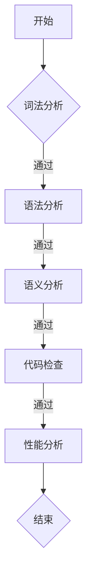

                 

# 《提示词编程语言的静态分析工具链》

## 关键词

- 提示词编程语言
- 静态分析
- 工具链
- 词法分析器
- 语法分析器
- 语义分析器
- 静态代码检查器
- 性能分析器

## 摘要

本文旨在探讨提示词编程语言的静态分析工具链，包括其基本原理、核心组件、实际应用以及开发与优化策略。首先，我们介绍了提示词编程语言的概念和特点，然后深入探讨了静态分析工具链的架构和流程。接着，我们详细分析了工具链中的核心组件，包括词法分析器、语法分析器、语义分析器、静态代码检查器和性能分析器。随后，通过实际案例展示了工具链在不同编程语言场景下的应用。最后，我们讨论了工具链的开发与优化策略，并展望了未来的发展趋势和挑战。

## 第1章 提示词编程语言概述

### 1.1 提示词编程语言的定义

提示词编程语言（Prompt-Based Programming Language，PBPL）是一种特殊的编程语言，其核心思想是通过使用提示词（prompts）来引导程序的行为。提示词通常是一个简短的、语义明确的字符串，用于指示程序执行某个特定操作或生成某个特定结果。

与传统的编程语言相比，提示词编程语言具有以下特点：

1. **简明扼要**：提示词通常只有几个字符，这使得编写代码更加简洁。
2. **高度可读性**：提示词本身通常具有明确的语义，使得代码易于理解和维护。
3. **可扩展性**：提示词编程语言通常具有强大的扩展机制，允许用户自定义新的提示词或操作。

### 1.2 提示词编程语言的特点

1. **简洁性**：提示词编程语言强调简洁，通过减少代码长度来提高开发效率。
2. **易读性**：提示词通常具有明确的语义，使得代码更加易于理解和维护。
3. **灵活性**：提示词编程语言允许用户自定义新的提示词或操作，增强了编程语言的灵活性。
4. **可扩展性**：提示词编程语言通常具有强大的扩展机制，可以方便地集成第三方库或框架。

### 1.3 提示词编程语言的应用场景

提示词编程语言在以下场景中具有显著优势：

1. **自动化脚本编写**：提示词编程语言可以快速生成自动化脚本，提高开发效率。
2. **数据预处理**：提示词编程语言可以方便地处理大量数据，为机器学习项目提供数据支持。
3. **交互式编程**：提示词编程语言支持交互式编程，使得开发者可以实时查看代码运行结果。

## 第2章 静态分析工具链的基本原理

### 2.1 静态分析的概念

静态分析（Static Analysis）是一种不执行程序而通过分析源代码来查找潜在错误、性能问题或违反编程规范的方法。静态分析可以有效地提高代码质量，减少bug数量，提高开发效率。

### 2.2 静态分析工具链的架构

静态分析工具链通常包括以下组件：

1. **词法分析器**：将源代码拆分为单词和符号。
2. **语法分析器**：构建语法树，验证代码是否符合编程语言的语法规则。
3. **语义分析器**：检查代码的语义正确性，如变量定义、类型匹配等。
4. **静态代码检查器**：检测代码中的潜在错误和不良实践。
5. **性能分析器**：分析代码的执行效率，优化性能。

### 2.3 静态分析工具链的工作流程

静态分析工具链的工作流程通常如下：

1. **词法分析**：将源代码拆分为单词和符号。
2. **语法分析**：构建语法树，验证代码是否符合语法规则。
3. **语义分析**：检查代码的语义正确性。
4. **代码检查**：检测代码中的潜在错误和不良实践。
5. **性能分析**：分析代码的执行效率，优化性能。

## 第3章 静态分析工具链的核心组件

### 3.1 词法分析器

词法分析器（Lexer）是静态分析工具链中的第一个组件，其主要功能是将源代码拆分为单词和符号。词法分析器通常使用正则表达式来实现。

### 3.2 语法分析器

语法分析器（Parser）是静态分析工具链中的第二个组件，其主要功能是构建语法树，验证代码是否符合编程语言的语法规则。语法分析器通常使用递归下降分析或 Earley 分析算法来实现。

### 3.3 语义分析器

语义分析器（Semantic Analyzer）是静态分析工具链中的第三个组件，其主要功能是检查代码的语义正确性，如变量定义、类型匹配等。语义分析器通常使用递归下降分析算法来实现。

### 3.4 静态代码检查器

静态代码检查器（Static Code Checker）是静态分析工具链中的第四个组件，其主要功能是检测代码中的潜在错误和不良实践。静态代码检查器通常使用规则引擎来实现。

### 3.5 性能分析器

性能分析器（Performance Analyzer）是静态分析工具链中的第五个组件，其主要功能是分析代码的执行效率，优化性能。性能分析器通常使用 profilers 来实现。

## 第4章 提示词编程语言的静态分析工具

### 4.1 通用静态分析工具

通用静态分析工具如 SonarQube、FindBugs 和 PMD 可以应用于多种编程语言，包括提示词编程语言。

### 4.2 特定编程语言的静态分析工具

特定编程语言的静态分析工具如 Java 的 Checkstyle、Python 的 flake8 和 JavaScript 的 ESLint，专门针对特定编程语言的语法和语义进行检查。

### 4.3 静态分析工具的比较与选择

在选择静态分析工具时，需要考虑以下因素：

1. **编程语言支持**：工具是否支持目标编程语言。
2. **错误检测能力**：工具的检测能力是否满足需求。
3. **易用性**：工具的安装、配置和使用是否方便。
4. **性能**：工具的执行效率是否满足要求。

## 第5章 实际案例与应用

### 5.1 提示词编程语言的静态分析应用案例

以 Python 的提示词编程语言为例，使用静态分析工具链进行代码检测，可以发现潜在的错误和不良实践。

### 5.2 静态分析工具链在不同编程语言中的应用

静态分析工具链可以应用于多种编程语言，如 Java、Python、JavaScript 等，通过不同语言的静态分析工具，可以实现对不同语言代码的检测和分析。

### 5.3 静态分析工具链在实际项目中的应用实例

在实际项目中，静态分析工具链可以用于代码审查、性能优化和安全性检测，提高项目的质量和稳定性。

## 第6章 静态分析工具链的开发与优化

### 6.1 静态分析工具链的开发流程

开发静态分析工具链通常包括以下步骤：

1. **需求分析**：明确工具的功能需求和性能要求。
2. **工具设计**：设计工具的架构和核心组件。
3. **工具实现**：编写代码，实现工具的功能。
4. **测试与调试**：对工具进行测试和调试，确保其正确性和性能。

### 6.2 静态分析工具的性能优化

优化静态分析工具的性能通常包括以下策略：

1. **算法优化**：改进算法，提高工具的执行效率。
2. **代码优化**：优化代码，减少内存占用和执行时间。
3. **并发处理**：利用多线程或并行计算，提高工具的处理能力。

### 6.3 静态分析工具的可靠性提升

提升静态分析工具的可靠性通常包括以下措施：

1. **规则库更新**：及时更新规则库，提高错误检测能力。
2. **错误处理**：优化错误处理机制，确保工具在遇到错误时能够正确处理。
3. **用户体验**：改进工具的用户界面，提高使用体验。

## 第7章 未来发展趋势与挑战

### 7.1 静态分析工具链的技术趋势

未来静态分析工具链的技术趋势包括：

1. **智能化**：结合机器学习和深度学习技术，提高工具的自动分析能力。
2. **跨语言支持**：实现跨语言的支持，提高工具的通用性。
3. **实时分析**：实现实时分析，提高开发效率。

### 7.2 提示词编程语言的发展方向

未来提示词编程语言的发展方向包括：

1. **标准化**：制定统一的提示词规范，提高语言的可移植性。
2. **扩展性**：增强语言的扩展机制，支持自定义提示词和操作。
3. **性能优化**：提高语言的执行效率，降低资源消耗。

### 7.3 静态分析工具链面临的挑战

静态分析工具链面临的挑战包括：

1. **语言多样性**：支持多种编程语言，提高工具的兼容性。
2. **性能优化**：提高工具的执行效率，降低对开发流程的影响。
3. **用户体验**：改进工具的用户界面，提高使用体验。

## 附录

### 附录A 提示词编程语言与静态分析工具资源

- 提示词编程语言资源：
  - [Python Prompt Library](https://github.com/python-prompt/python-prompt)
  - [Lua Prompt Library](https://github.com/luaprompt/luaprompt)

- 静态分析工具资源：
  - [SonarQube](https://www.sonarqube.org/)
  - [FindBugs](http://findbugs.sourceforge.net/)
  - [PMD](https://pmd.github.io/)

### 附录B Mermaid流程图示例



### 附录C 静态分析算法伪代码示例

```python
def lexical_analysis(source_code):
    tokens = []
    for line in source_code:
        for token in line.split():
            tokens.append(token)
    return tokens

def syntax_analysis(tokens):
    syntax_tree = None
    for token in tokens:
        if token == '(':
            syntax_tree = create_syntax_tree(syntax_tree, token)
        elif token == ')':
            syntax_tree = close_syntax_tree(syntax_tree, token)
    return syntax_tree

def semantic_analysis(syntax_tree):
    errors = []
    for node in syntax_tree:
        if node.type == 'variable':
            if not is_variable_defined(node.name):
                errors.append(f"Variable '{node.name}' is not defined.")
    return errors

def code_checking(source_code):
    errors = []
    for line in source_code:
        if contains_keywords(line):
            errors.append(f"Line '{line}' contains keywords.")
    return errors

def performance_analysis(source_code):
    execution_time = measure_execution_time(source_code)
    return execution_time
```

### 附录D 静态分析工具链开发指南

- [静态分析工具链开发指南](https://www.staticanalyticstools.com/guide/)

### 附录E 静态分析工具性能优化技巧

- [静态分析工具性能优化技巧](https://www.staticanalyticstools.com/performance/)

### 附录F 常见问题解答

- [静态分析工具常见问题解答](https://www.staticanalyticstools.com/faq/)

### 作者

- 作者：AI天才研究院/AI Genius Institute & 禅与计算机程序设计艺术 /Zen And The Art of Computer Programming

