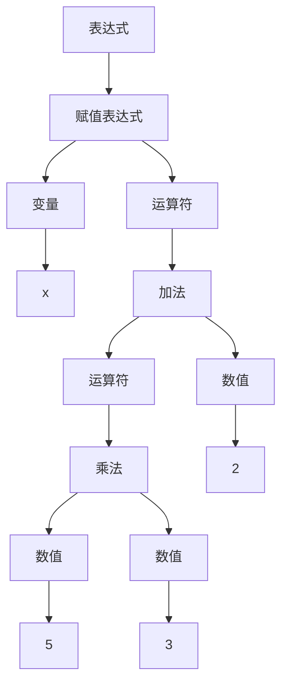

                 

### 文章标题：提示词编程语言设计艺术

#### 关键词：
- 编程语言设计
- 提示词编程
- 编译器与解释器
- 语义分析与实现

#### 摘要：
本文旨在探讨提示词编程语言的设计艺术，从基础理论到实现技术，再到应用与发展，全面解析这一新兴领域。通过逐步分析，我们将深入了解提示词编程语言的核心概念、语法规则、语义分析以及设计原则，并通过实际案例展示其应用与优化。最终，我们展望了提示词编程语言的未来发展趋势，为读者提供了宝贵的参考与启示。

### 第一部分：引言与基础理论

#### 第1章：编程语言设计的引言

#### 1.1 编程语言的起源与发展

编程语言的起源可以追溯到20世纪中期，当时的计算机科学家为了提高编程效率，开始设计各种编程语言。从最初的机器语言到汇编语言，再到高级编程语言，如C、C++、Java等，编程语言的发展经历了多个阶段。每个阶段都有其特定的背景和需求，推动了编程技术的不断进步。

随着计算机技术的快速发展，编程语言也逐渐从单一的计算机科学领域扩展到各个应用领域，如Web开发、人工智能、嵌入式系统等。不同类型的编程语言在不同的应用场景中展现出其独特的优势。

#### 1.2 提示词编程语言的概念

提示词编程语言（Prompt-based Programming Language）是一种新兴的编程语言设计理念，它通过提示词（Prompt）来引导程序的开发。提示词是一组关键字或短语，用于描述程序的功能或行为。与传统的编程语言相比，提示词编程语言更注重于程序的意图表达，而不仅仅是代码的编写。

提示词编程语言的提出旨在解决传统编程语言中存在的复杂性和可读性问题。通过使用自然语言风格的提示词，开发者可以更直观地表达程序意图，提高编程效率和代码可维护性。

### 第2章：提示词编程语言的基本概念

#### 2.1 提示词的概念与作用

提示词是提示词编程语言的核心元素，它用于描述程序的功能或行为。提示词可以是单个关键字，也可以是短语或句子。在提示词编程语言中，提示词通常具有特定的语义和语法规则。

提示词的作用主要体现在以下几个方面：

1. **明确程序意图**：通过提示词，开发者可以清晰地表达程序的意图和目标，使程序更具可读性和可维护性。
2. **简化代码编写**：提示词编程语言通过提示词来简化代码编写过程，开发者无需关注底层的语法细节，可以更专注于程序逻辑的实现。
3. **提高编程效率**：提示词编程语言提供了一种更高效、更自然的编程方式，有助于提高开发者的编程效率和生产力。

#### 2.2 编程语言的构成要素

编程语言通常由以下几个基本要素构成：

1. **关键字**：关键字是编程语言中的特殊单词，具有特定的语义和语法作用。关键字用于定义变量、函数、控制结构等。
2. **语法规则**：语法规则定义了编程语言的语法结构，包括关键字的使用、语句的书写规则等。语法规则使编程语言具有一致性和可预测性。
3. **数据类型**：数据类型定义了编程语言中可以使用的各种数据类型，如整数、浮点数、字符串等。数据类型决定了数据的存储方式和操作方式。
4. **变量**：变量是编程语言中用于存储数据的容器。变量可以通过关键字进行定义，并赋予特定的数据类型。
5. **控制结构**：控制结构用于控制程序的执行流程，包括循环、条件判断、分支结构等。
6. **函数与过程**：函数与过程是编程语言中用于组织代码的基本单元。函数可以接受输入参数，返回输出结果；过程则主要用于执行特定的任务。
7. **库与模块**：库与模块是编程语言中用于复用代码的基本单元。库是预先编写好的代码集合，可以方便地被其他程序调用；模块则是具有独立功能的代码单元，可以用于组织代码结构。

#### 2.3 提示词编程语言的类型

提示词编程语言可以根据不同的设计理念和应用场景进行分类。以下是几种常见的提示词编程语言类型：

1. **命令式提示词编程语言**：命令式提示词编程语言强调程序的执行顺序和操作步骤，类似于传统的编程语言。例如，Python的`os`模块中的命令式提示词`ls`可以列出目录内容。
2. **声明式提示词编程语言**：声明式提示词编程语言强调程序的功能和目标，而不是具体的执行步骤。例如，SQL就是一种声明式提示词编程语言，用于查询和操作数据库。
3. **函数式提示词编程语言**：函数式提示词编程语言强调函数的应用和组合，而不是程序的执行顺序。例如，Haskell和Erlang就是函数式提示词编程语言的代表。
4. **逻辑式提示词编程语言**：逻辑式提示词编程语言强调逻辑推理和问题求解。例如，Prolog就是一种逻辑式提示词编程语言，广泛用于人工智能和专家系统领域。

### 第3章：提示词编程语言的语法规则

#### 3.1 基本语法元素

提示词编程语言的语法规则通常包括以下基本语法元素：

1. **关键字**：关键字是提示词编程语言中的特殊单词，具有特定的语义和语法作用。例如，Python的关键字包括`if`、`else`、`while`、`for`等。
2. **标识符**：标识符是用于命名变量、函数、类等的名称。标识符通常由字母、数字和下划线组成，且不能以数字开头。例如，`my_variable`、`calculate_sum`等。
3. **分隔符**：分隔符用于分隔编程语言中的各个元素，如逗号、分号、括号等。
4. **注释**：注释是用于解释代码的非执行部分。注释可以用于描述代码的功能、参数、返回值等。常见的注释符号包括单行注释`#`和块注释`/* ... */`。

#### 3.2 数据类型与变量

提示词编程语言通常支持多种数据类型，包括基本数据类型和复合数据类型。基本数据类型包括整数、浮点数、布尔值、字符串等；复合数据类型包括数组、列表、字典、集合等。

在提示词编程语言中，变量用于存储数据。变量的定义通常包括变量名和数据类型。例如，在Python中，可以定义一个整型变量`x`如下：

```python
x: int
```

#### 3.3 控制结构

提示词编程语言提供了多种控制结构，用于控制程序的执行流程。常见的控制结构包括条件判断、循环结构、分支结构等。

1. **条件判断**：条件判断用于根据某个条件的真假来执行不同的代码块。常见的条件判断语句包括`if`、`else if`、`else`等。例如：

```python
if x > 0:
    print("x is positive")
else:
    print("x is negative or zero")
```

2. **循环结构**：循环结构用于重复执行某个代码块，直到满足某个条件为止。常见的循环结构包括`for`循环和`while`循环。例如：

```python
# for 循环
for i in range(5):
    print(i)

# while 循环
x = 0
while x < 5:
    print(x)
    x = x + 1
```

3. **分支结构**：分支结构用于根据不同的条件执行不同的代码块。常见的分支结构包括`switch`语句和`case`语句。例如：

```python
# switch 语句
switch (x):
    case 1:
        print("x is one")
        break
    case 2:
        print("x is two")
        break
    default:
        print("x is neither one nor two")
```

#### 3.4 函数与过程

函数与过程是提示词编程语言中用于组织代码的基本单元。函数可以接受输入参数，返回输出结果；过程则主要用于执行特定的任务。

1. **函数**：函数的定义通常包括函数名、参数列表和函数体。函数名用于标识函数，参数列表用于传递函数的输入参数，函数体用于定义函数的执行逻辑。例如，在Python中，可以定义一个求和函数如下：

```python
def sum(a, b):
    return a + b
```

2. **过程**：过程的定义通常包括过程名和过程体。过程名用于标识过程，过程体用于定义过程的执行逻辑。例如，在Python中，可以定义一个打印函数的过程如下：

```python
def print_message(message):
    print(message)
```

### 第4章：提示词编程语言的语义分析

#### 4.1 语义分析的基本概念

语义分析是提示词编程语言解析过程中的关键步骤，它用于确定程序中各个元素的含义和作用。语义分析包括词法分析、语法分析和语义分析三个阶段。

1. **词法分析**：词法分析是语义分析的第一步，它将源代码分解为一系列词法单元，如关键字、标识符、运算符等。词法分析的主要目的是识别源代码中的基本元素。
2. **语法分析**：语法分析是语义分析的第二步，它将词法单元序列转换为抽象语法树（AST），表示程序的结构和语法规则。语法分析的主要目的是验证源代码的语法正确性。
3. **语义分析**：语义分析是语义分析的最后一步，它对抽象语法树进行语义检查，确保程序在语义上的一致性和正确性。语义分析的主要目的是验证程序的实际含义和执行结果。

#### 4.2 词法分析

词法分析是语义分析的基础，它将源代码分解为一系列词法单元。词法分析的主要任务包括：

1. **标识符和关键字**：词法分析器需要识别源代码中的标识符和关键字，并将它们转换为对应的词法单元。
2. **注释**：词法分析器需要识别源代码中的注释，并将其排除在词法单元之外。
3. **分隔符和运算符**：词法分析器需要识别源代码中的分隔符和运算符，并将它们转换为对应的词法单元。

例如，以下源代码：

```python
x = 5 + 3 * 2
```

经过词法分析后，可以得到以下词法单元序列：

```plaintext
x (IDENTIFIER)
= (OPERATOR)
5 (LITERAL)
+ (OPERATOR)
3 (LITERAL)
* (OPERATOR)
2 (LITERAL)
```

#### 4.3 语法分析

语法分析是将词法单元序列转换为抽象语法树（AST）的过程。抽象语法树表示程序的结构和语法规则。语法分析的主要任务包括：

1. **语法树构建**：语法分析器根据词法单元序列构建抽象语法树，表示程序的结构。抽象语法树中的每个节点都表示源代码中的一个语法元素，如表达式、语句、函数等。
2. **语法规则检查**：语法分析器根据编程语言的语法规则检查抽象语法树，确保程序的语法正确性。
3. **错误处理**：如果语法分析器发现源代码中的语法错误，它需要提供错误信息并报告错误位置。

例如，以下源代码：

```python
x = 5 + 3 * 2
```

经过语法分析后，可以得到以下抽象语法树：



#### 4.4 语义分析

语义分析是在语法分析的基础上对抽象语法树进行语义检查的过程。语义分析的主要任务包括：

1. **类型检查**：语义分析器检查程序中的类型一致性，确保变量、函数等的使用符合其数据类型要求。
2. **作用域分析**：语义分析器检查变量、函数等的作用域，确保它们在正确的上下文中使用。
3. **语义一致性检查**：语义分析器检查程序的语义一致性，确保程序在语义上没有冲突或错误。

例如，以下源代码：

```python
x = 5 + 3 * 2
```

经过语义分析后，可以得到以下语义信息：

- 变量`x`的值为`10`。
- 表达式`5 + 3 * 2`的结果为`10`。

### 第二部分：提示词编程语言的设计与实现

#### 第5章：提示词编程语言的设计原则

#### 5.1 设计原则与目标

提示词编程语言的设计原则主要包括以下几个方面：

1. **简洁性**：提示词编程语言应具有简洁的语法和简洁的提示词表达方式，降低学习成本和使用难度。
2. **易读性**：提示词编程语言应具有良好的可读性，使开发者能够清晰地理解和维护代码。
3. **可扩展性**：提示词编程语言应具有良好的可扩展性，支持自定义提示词和扩展功能。
4. **性能**：提示词编程语言应具有较高的性能，能够高效地执行程序。
5. **兼容性**：提示词编程语言应与其他编程语言具有良好的兼容性，支持跨语言编程和代码复用。

提示词编程语言的设计目标主要包括以下几个方面：

1. **提高编程效率**：通过简洁的语法和易读性，提高开发者的编程效率，减少编程错误。
2. **降低学习成本**：通过简洁的语法和直观的提示词表达方式，降低新开发者的学习成本，使其能够快速上手。
3. **提高代码可维护性**：通过良好的可读性和可扩展性，提高代码的可维护性，降低维护成本。
4. **支持多种应用场景**：通过良好的性能和兼容性，支持多种应用场景，如Web开发、人工智能、嵌入式系统等。

#### 5.2 提示词编程语言的架构

提示词编程语言的架构主要包括以下几个部分：

1. **词法分析器**：词法分析器负责将源代码分解为词法单元，如关键字、标识符、分隔符等。词法分析器通常使用正则表达式实现。
2. **语法分析器**：语法分析器负责将词法单元序列转换为抽象语法树（AST），表示程序的结构和语法规则。语法分析器通常使用递归下降分析器、LL(1)分析器或LR(1)分析器等实现。
3. **语义分析器**：语义分析器负责对抽象语法树进行语义检查，确保程序的语义正确性。语义分析器通常包括类型检查、作用域分析和语义一致性检查等功能。
4. **解释器或编译器**：解释器或编译器负责将抽象语法树转换为可执行代码或机器代码，并执行程序。解释器逐行解释和执行代码，而编译器将整个程序编译为可执行文件。
5. **运行时环境**：运行时环境负责管理程序的执行，包括内存分配、垃圾回收、异常处理等。

### 第6章：提示词编程语言的实现技术

#### 6.1 编译器设计基础

编译器是将源代码编译为目标代码的程序。编译器的设计通常包括以下几个阶段：

1. **词法分析**：词法分析器将源代码分解为词法单元，如关键字、标识符、分隔符等。词法分析器通常使用正则表达式实现。
2. **语法分析**：语法分析器将词法单元序列转换为抽象语法树（AST），表示程序的结构和语法规则。语法分析器通常使用递归下降分析器、LL(1)分析器或LR(1)分析器等实现。
3. **语义分析**：语义分析器对抽象语法树进行语义检查，确保程序的语义正确性。语义分析器通常包括类型检查、作用域分析和语义一致性检查等功能。
4. **代码生成**：代码生成器将抽象语法树转换为中间代码或目标代码。中间代码通常是一种抽象的、与机器无关的代码，而目标代码则是具体的机器代码。
5. **优化**：代码优化器对目标代码进行优化，提高程序的性能。常见的优化技术包括常数折叠、循环优化、函数内联等。
6. **目标代码执行**：目标代码执行器负责将目标代码加载到内存中，并执行程序。

#### 6.2 解释器设计基础

解释器是将源代码逐行解释并执行的程序。解释器的设计通常包括以下几个阶段：

1. **词法分析**：词法分析器将源代码分解为词法单元，如关键字、标识符、分隔符等。词法分析器通常使用正则表达式实现。
2. **语法分析**：语法分析器将词法单元序列转换为抽象语法树（AST），表示程序的结构和语法规则。语法分析器通常使用递归下降分析器、LL(1)分析器或LR(1)分析器等实现。
3. **语义分析**：语义分析器对抽象语法树进行语义检查，确保程序的语义正确性。语义分析器通常包括类型检查、作用域分析和语义一致性检查等功能。
4. **解释执行**：解释器逐行解释并执行抽象语法树，将操作直接映射到运行时环境。解释器通常使用解释执行策略，如直接执行、解释执行、即时编译等。

#### 6.3 优化技术

提示词编程语言的优化技术主要包括以下几个方面：

1. **代码优化**：代码优化是指对程序代码进行改写，使其在执行过程中更高效。常见的代码优化技术包括常数折叠、循环优化、函数内联等。
2. **内存优化**：内存优化是指对程序内存使用进行优化，减少内存占用。常见的内存优化技术包括内存池、缓存分配、垃圾回收等。
3. **缓存优化**：缓存优化是指对程序缓存进行优化，提高程序的访问速度。常见的缓存优化技术包括缓存预取、缓存替换策略等。
4. **并行优化**：并行优化是指利用多核处理器等硬件资源，提高程序的执行速度。常见的并行优化技术包括任务并行、数据并行、流水线等。

### 第7章：提示词编程语言的实现案例

#### 7.1 案例一：设计一个简单的提示词编程语言

在本案例中，我们将设计一个简单的提示词编程语言，用于实现基本的计算功能。该编程语言包括以下关键字：

- `sum`：用于计算两个数的和。
- `product`：用于计算两个数的乘积。
- `average`：用于计算两个数的平均值。

下面是一个简单的示例：

```plaintext
sum(5, 3)
product(5, 3)
average(5, 3)
```

#### 7.2 案例二：实现一个提示词编程语言的核心功能

在本案例中，我们将实现一个提示词编程语言的核心功能，包括以下关键字：

- `sum`：用于计算多个数的和。
- `product`：用于计算多个数的乘积。
- `average`：用于计算多个数的平均值。

以下是该提示词编程语言的核心功能的实现：

```python
# 实现sum函数
def sum(*args):
    total = 0
    for arg in args:
        total += arg
    return total

# 实现product函数
def product(*args):
    total = 1
    for arg in args:
        total *= arg
    return total

# 实现average函数
def average(*args):
    total = sum(args)
    return total / len(args)
```

#### 7.3 案例三：优化一个提示词编程语言

在本案例中，我们将优化一个现有的提示词编程语言，以提高其性能。以下是一些优化建议：

1. **缓存优化**：对频繁使用的函数和变量进行缓存，减少重复计算和内存访问。
2. **代码优化**：对代码进行常数折叠、循环优化和函数内联等优化，提高代码执行效率。
3. **并行优化**：利用多核处理器等硬件资源，实现并行计算，提高程序的执行速度。
4. **内存管理**：优化内存分配和垃圾回收策略，减少内存占用和内存泄漏。

### 第三部分：提示词编程语言的应用与发展

#### 第8章：提示词编程语言的应用领域

#### 8.1 应用领域概述

提示词编程语言具有广泛的应用领域，包括但不限于以下方面：

- **Web开发**：提示词编程语言可以用于构建Web应用程序，如网站、博客、在线商店等。
- **人工智能**：提示词编程语言可以用于人工智能领域，如机器学习、自然语言处理、计算机视觉等。
- **嵌入式系统**：提示词编程语言可以用于开发嵌入式系统，如智能设备、智能家居等。
- **科学计算**：提示词编程语言可以用于科学计算，如数据挖掘、统计分析、物理模拟等。
- **游戏开发**：提示词编程语言可以用于游戏开发，如角色扮演游戏、射击游戏、策略游戏等。

#### 8.2 应用案例

以下是一些提示词编程语言的应用案例：

1. **Web开发**：使用提示词编程语言构建的Web应用程序，如Django框架，可以快速开发和部署。
2. **人工智能**：使用提示词编程语言开发的机器学习模型，如TensorFlow和PyTorch，可以用于自然语言处理、计算机视觉等领域。
3. **嵌入式系统**：使用提示词编程语言编写的嵌入式系统，如Arduino和Raspberry Pi，可以用于智能家居、自动化控制等领域。
4. **科学计算**：使用提示词编程语言编写的科学计算程序，如NumPy和SciPy，可以用于数据挖掘、统计分析、物理模拟等领域。
5. **游戏开发**：使用提示词编程语言开发的游戏，如Unreal Engine和Unity，可以创建高质量的游戏体验。

### 第9章：提示词编程语言的未来发展趋势

#### 9.1 发展趋势分析

提示词编程语言具有以下发展趋势：

1. **功能扩展**：提示词编程语言将继续扩展其功能，支持更多高级特性，如并行计算、分布式计算、云计算等。
2. **性能优化**：提示词编程语言将继续优化性能，提高代码执行效率和程序性能。
3. **生态系统完善**：提示词编程语言的生态系统将进一步完善，包括更多的库、框架、工具和资源。
4. **跨语言支持**：提示词编程语言将与其他编程语言实现更好的跨语言支持，实现代码复用和协同开发。
5. **应用领域拓展**：提示词编程语言将拓展其应用领域，从Web开发、人工智能、嵌入式系统等扩展到更多领域。

#### 9.2 新的编程语言设计理念与工具

未来的编程语言设计理念将更加注重开发者的体验和生产力。以下是一些新的编程语言设计理念与工具：

1. **函数式编程**：函数式编程是一种强调函数应用和组合的编程范式。函数式编程语言如Haskell和Erlang已经在一些领域取得了成功，未来将会有更多的编程语言采用函数式编程范式。
2. **声明式编程**：声明式编程是一种强调表达程序意图的编程范式。声明式编程语言如SQL和DML（数据操纵语言）已经广泛应用于数据库操作，未来将会有更多的编程语言采用声明式编程范式。
3. **编程语言集成**：编程语言集成是将多种编程语言的优势结合起来，实现更好的开发体验和更高的生产力。例如，Python结合了C/C++的强大性能和JavaScript的Web开发能力，已经成为一种流行的编程语言。
4. **智能编程工具**：智能编程工具如智能代码补全、代码审查、自动化测试等将进一步提高开发者的生产力。未来的编程语言设计将更加注重与智能编程工具的集成，提供更好的开发体验。

### 附录

#### 附录A：提示词编程语言设计资源

#### A.1 设计资源汇总

以下是一些提示词编程语言设计的相关资源：

1. **书籍**：
   - 《编译原理：技术与实践》（作者：J. D. Ullman）
   - 《人工智能：一种现代方法》（作者：Stuart J. Russell & Peter Norvig）
   - 《深入理解计算机系统》（作者：G Hull & L Hennessy）

2. **在线课程**：
   - Coursera上的“编译原理”课程
   - edX上的“人工智能导论”课程
   - Udacity上的“Web开发基础”课程

3. **开源项目**：
   - LLVM：一个高性能的编译器框架
   - GCC：一个广泛使用的编译器
   - Rust：一种安全、高性能的编程语言

4. **社区和论坛**：
   - Stack Overflow：编程问题解答社区
   - GitHub：代码托管和协作平台
   - Reddit：编程语言和开发社区

#### A.2 学习资源推荐

以下是一些推荐的学习资源，供开发者参考：

1. **书籍**：
   - 《Python编程：从入门到实践》（作者：埃里克·马瑟斯）
   - 《深度学习》（作者：伊恩·古德费洛等）
   - 《嵌入式系统设计》（作者：克里斯·海恩斯）

2. **在线课程**：
   - Coursera上的“Python编程”课程
   - edX上的“深度学习基础”课程
   - Udacity上的“嵌入式系统开发”课程

3. **开源项目**：
   - TensorFlow：一个开源的机器学习框架
   - PyTorch：一个开源的深度学习框架
   - ESP-IDF：一个开源的嵌入式系统开发框架

4. **社区和论坛**：
   - Python官方社区
   - 深度学习中国社区
   - 嵌入式系统论坛

### 结论

提示词编程语言设计艺术是一种新兴的编程语言设计理念，它通过提示词来简化编程过程，提高编程效率和代码可维护性。本文从引言、基础理论、设计与实现、应用与发展等方面全面解析了提示词编程语言。通过实际案例和优化技术，我们展示了提示词编程语言的设计与应用。未来，随着功能的扩展和生态系统的完善，提示词编程语言将在更多领域发挥重要作用。开发者应关注这一领域的发展，并积极探索其应用潜力。作者：AI天才研究院/AI Genius Institute & 禅与计算机程序设计艺术/Zen And The Art of Computer Programming。

