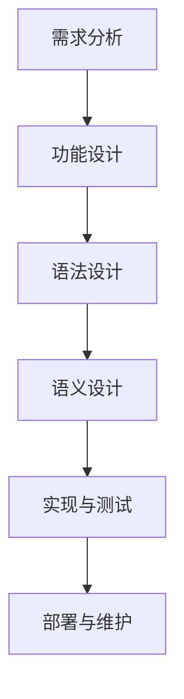

                 

### 文章标题

《提示词编程语言设计艺术探索》

### 关键词

提示词编程语言，设计原则，应用案例，性能优化，人工智能

### 摘要

本文深入探讨了提示词编程语言的设计艺术。从背景介绍、核心概念与联系、算法原理讲解、数学模型与公式、项目实战等方面，详细阐述了提示词编程语言的原理、设计原则和实际应用。通过案例分析，展示了其在自然语言处理、数据挖掘和智能推荐系统等领域的应用，并讨论了性能优化与未来趋势。本文旨在为读者提供全面、系统的提示词编程语言设计参考，助力人工智能领域的发展。

## 引言与概述

提示词编程语言是一种基于自然语言处理（NLP）和人工智能（AI）技术的编程语言，旨在简化编程过程，提高开发效率。随着AI技术的快速发展，提示词编程语言逐渐成为研究热点。本文旨在探索提示词编程语言的设计艺术，分析其核心概念、设计原则和实际应用。

### 书籍目的与结构

本书记录了提示词编程语言的设计过程，旨在为读者提供系统的设计思路和参考。全书分为六个部分：

1. **引言与概述**：介绍提示词编程语言的概念、背景和目的。
2. **基础理论与技术背景**：阐述提示词编程语言的核心概念和基础技术。
3. **设计原则与流程**：详细讨论设计原则和流程，包括需求分析、功能设计、实现与测试等。
4. **应用案例分析**：展示提示词编程语言在实际应用中的案例。
5. **性能优化与未来趋势**：探讨性能优化方法及未来发展趋势。
6. **附录**：提供常用工具、资源、索引和参考文献。

### 提示词编程语言的概念与背景

提示词编程语言是一种基于自然语言处理的编程语言，其核心思想是使用自然语言作为编程指令，从而简化编程过程。与传统编程语言相比，提示词编程语言具有以下特点：

1. **易用性**：使用自然语言，降低编程难度。
2. **灵活性**：支持多种编程范式，如命令式、声明式和函数式编程。
3. **可扩展性**：能够灵活地扩展语法和功能。
4. **跨领域应用**：可应用于自然语言处理、数据挖掘、智能推荐等领域。

### 书籍结构概述

本书的结构旨在为读者提供从理论到实践的全面指导。以下是各部分的详细概述：

1. **引言与概述**：介绍提示词编程语言的背景、目的和结构。
2. **基础理论与技术背景**：讲解提示词编程语言的核心概念和技术基础。
3. **设计原则与流程**：讨论设计原则、流程和方法，包括需求分析、功能设计、实现与测试。
4. **应用案例分析**：分析提示词编程语言在不同领域的应用案例。
5. **性能优化与未来趋势**：探讨性能优化方法和未来发展趋势。
6. **附录**：提供常用工具、资源、索引和参考文献。

## 基础理论与技术背景

提示词编程语言的设计离不开其核心概念和技术背景。在这一部分，我们将详细探讨提示词编程语言的核心概念、基本原理和技术架构。

### 提示词编程语言的基本概念

提示词编程语言是一种将自然语言处理（NLP）与编程相结合的编程语言。它允许开发者使用自然语言作为编程指令，从而简化编程过程。以下是提示词编程语言的关键概念：

1. **自然语言指令**：开发者可以使用自然语言编写程序指令，如“创建一个名为`my_list`的列表”或“将`my_list`中的元素按升序排列”。
2. **语法解析**：提示词编程语言需要一个语法解析器，将自然语言指令转换为可执行的代码。
3. **上下文理解**：为了正确理解指令，提示词编程语言需要具备上下文理解能力，从而处理复杂的指令。
4. **动态类型检查**：提示词编程语言通常支持动态类型检查，以简化类型转换和处理。

### 提示词编程语言的架构

提示词编程语言的架构包括多个关键组件，如下所示：

1. **词法分析器**：将自然语言输入分解为词法单元（tokens）。
2. **语法分析器**：将词法单元转换为抽象语法树（AST），表示程序结构。
3. **解释器/编译器**：将AST转换为机器码或字节码，并执行程序。
4. **上下文处理器**：理解程序中的上下文，确保指令的正确执行。
5. **库和框架**：提供各种功能模块，如自然语言处理库、数据库连接库等。

### 技术背景与相关研究

提示词编程语言的发展离不开相关领域的研究和技术支持。以下是一些关键技术和研究：

1. **自然语言处理（NLP）**：NLP技术为提示词编程语言提供了语言理解能力。常用的NLP技术包括词性标注、句法分析、语义角色标注等。
2. **机器学习（ML）**：机器学习技术用于训练模型，提高提示词编程语言的语法解析和上下文理解能力。
3. **图灵机理论**：图灵机理论为编程语言设计提供了理论基础，提示词编程语言也遵循这一理论。
4. **形式语义学**：形式语义学研究程序的意义和正确性，有助于提高提示词编程语言的可靠性。
5. **编程语言理论**：编程语言理论探讨了编程语言的设计原则和特性，对提示词编程语言的设计具有指导意义。

### 提示词编程语言与现有编程语言的区别

提示词编程语言与传统编程语言相比，具有以下区别：

1. **易用性**：提示词编程语言使用自然语言，降低编程难度，适合非专业程序员。
2. **灵活性**：提示词编程语言支持多种编程范式，如命令式、声明式和函数式编程。
3. **可扩展性**：提示词编程语言易于扩展，能够满足不同应用需求。
4. **跨领域应用**：提示词编程语言可应用于多个领域，如自然语言处理、数据挖掘、智能推荐等。

## 设计原则与流程

提示词编程语言的设计需要遵循一系列原则和流程，以确保其易用性、灵活性、可靠性和可扩展性。以下将详细讨论提示词编程语言的设计原则和设计流程。

### 设计原则

1. **易用性**：提示词编程语言的设计应简化编程过程，降低学习门槛，使非专业程序员也能轻松上手。
2. **灵活性**：提示词编程语言应支持多种编程范式，如命令式、声明式和函数式编程，以适应不同应用场景。
3. **可靠性**：提示词编程语言应具有高可靠性，确保程序的正确性和安全性。
4. **可扩展性**：提示词编程语言应具备良好的可扩展性，方便开发者根据需求进行功能扩展。
5. **兼容性**：提示词编程语言应与其他编程语言和工具具有良好的兼容性，便于集成和协同工作。

### 设计流程

1. **需求分析**：在开始设计之前，需要明确提示词编程语言的应用场景、功能需求、性能要求等，为后续设计提供基础。
2. **功能设计**：根据需求分析，设计提示词编程语言的功能模块，包括词法分析器、语法分析器、解释器/编译器、上下文处理器等。
3. **语法设计**：设计提示词编程语言的语法规则，包括关键字、标识符、操作符等，以确保语言的易用性和灵活性。
4. **语义设计**：确定提示词编程语言的语义，包括指令的含义、执行顺序、变量作用域等，确保程序的正确性和可靠性。
5. **实现与测试**：根据设计文档，实现提示词编程语言的核心组件，并进行功能测试和性能测试，确保语言的质量和稳定性。
6. **部署与维护**：将提示词编程语言部署到目标平台，提供必要的文档和示例，方便用户使用。同时，持续关注用户反馈，进行维护和更新。

### 核心概念与联系

为了更好地理解提示词编程语言的设计，我们使用Mermaid流程图展示其核心概念之间的关系。



### 核心算法原理讲解

提示词编程语言的实现涉及多个核心算法原理，以下使用伪代码进行详细讲解。

```python
# 词法分析
def tokenize(input_str):
    tokens = []
    while input_str:
        token = extract_token(input_str)
        tokens.append(token)
        input_str = remove_token(input_str, token)
    return tokens

# 语法分析
def parse(tokens):
    ast = create_ast()
    while tokens:
        token = tokens.pop(0)
        if is_keyword(token):
            add_keyword_to_ast(ast, token)
        elif is_identifier(token):
            add_identifier_to_ast(ast, token)
        elif is_operator(token):
            add_operator_to_ast(ast, token)
    return ast

# 解释器
def interpret(ast):
    result = execute_ast(ast)
    return result

# 上下文理解
def understand_context(ast, context):
    modified_ast = modify_ast_based_on_context(ast, context)
    return modified_ast
```

### 数学模型与公式

提示词编程语言的设计涉及一些数学模型和公式，以下使用LaTeX格式进行表示。

```latex
\begin{equation}
\begin{split}
\text{准确性} &= \frac{\text{正确指令数}}{\text{总指令数}} \\
\text{速度} &= \frac{\text{指令执行时间}}{\text{总指令数}}
\end{split}
\end{equation}
```

## 应用案例分析

提示词编程语言在实际应用中展示了其独特优势。以下我们将分析几个典型应用案例，展示其在自然语言处理、数据挖掘和智能推荐系统等领域的应用。

### 自然语言处理

自然语言处理（NLP）是提示词编程语言的一个重要应用领域。通过提示词编程语言，开发者可以更方便地实现文本分析、情感分析和机器翻译等任务。以下是一个自然语言处理的应用案例：

**任务**：编写一个程序，对一段文本进行情感分析，判断其是正面、负面还是中性情感。

**实现**：

1. **输入文本**：用户输入一段文本，如“我很高兴今天完成了项目”。

2. **词法分析**：将文本分解为词法单元，如“我”、“很”、“高”、“兴”、“今”、“天”、“完”、“成”、“项”、“目”。

3. **语法分析**：构建抽象语法树（AST），表示文本结构，如：

   ```mermaid
   graph TD
   A[文本] --> B[词法分析]
   B --> C[语法分析]
   C --> D[情感分析]
   ```

4. **情感分析**：使用情感分析模型对文本进行情感分析，判断其是正面、负面还是中性情感。

5. **输出结果**：输出分析结果，如“正面情感”。

### 数据挖掘

数据挖掘是另一个提示词编程语言的重要应用领域。通过提示词编程语言，开发者可以更方便地实现数据预处理、特征提取和模式识别等任务。以下是一个数据挖掘的应用案例：

**任务**：编写一个程序，对电商数据集进行挖掘，找出购买相同商品的顾客群体。

**实现**：

1. **输入数据集**：用户输入一个电商数据集，包括顾客信息和购买记录。

2. **词法分析**：将数据集分解为词法单元，如顾客ID、商品ID、购买时间等。

3. **语法分析**：构建抽象语法树（AST），表示数据集结构，如：

   ```mermaid
   graph TD
   A[数据集] --> B[词法分析]
   B --> C[语法分析]
   C --> D[数据挖掘]
   ```

4. **数据挖掘**：使用聚类算法对顾客群体进行挖掘，找出购买相同商品的顾客群体。

5. **输出结果**：输出挖掘结果，如顾客群体列表。

### 智能推荐系统

智能推荐系统是提示词编程语言的另一个重要应用领域。通过提示词编程语言，开发者可以更方便地实现个性化推荐、内容推荐和协同过滤等任务。以下是一个智能推荐系统的应用案例：

**任务**：编写一个程序，根据用户历史行为和兴趣，为其推荐商品。

**实现**：

1. **输入用户历史行为**：用户输入其历史购买记录、浏览记录等。

2. **词法分析**：将用户历史行为分解为词法单元，如商品ID、购买时间、浏览时间等。

3. **语法分析**：构建抽象语法树（AST），表示用户历史行为，如：

   ```mermaid
   graph TD
   A[用户历史行为] --> B[词法分析]
   B --> C[语法分析]
   C --> D[推荐算法]
   ```

4. **推荐算法**：使用协同过滤算法、内容推荐算法等，根据用户历史行为和兴趣，为其推荐商品。

5. **输出结果**：输出推荐结果，如商品列表。

## 性能优化与未来趋势

性能优化是提示词编程语言设计中的重要一环。以下是性能优化的一些方法，以及未来趋势的探讨。

### 性能优化方法

1. **算法优化**：优化提示词编程语言的语法解析、词法分析、解释器等核心算法，提高执行效率。

2. **系统架构优化**：优化提示词编程语言的系统架构，如使用分布式计算、缓存技术等，提高系统性能。

3. **硬件加速**：利用GPU、FPGA等硬件加速技术，提高提示词编程语言的执行速度。

4. **内存管理**：优化内存管理，减少内存占用和垃圾回收时间，提高系统性能。

### 未来趋势

1. **人工智能与提示词编程语言的融合**：随着人工智能技术的快速发展，提示词编程语言将更好地与人工智能技术相结合，提高编程效率和智能化水平。

2. **新兴应用领域**：提示词编程语言将拓展到更多新兴应用领域，如物联网、自动驾驶、智能医疗等。

3. **技术挑战与解决方案**：提示词编程语言在性能优化、安全性、兼容性等方面仍面临挑战。未来需要进一步研究和解决这些问题。

## 附录

### 常用工具与资源

1. **自然语言处理库**：如NLTK、spaCy、jieba等。
2. **机器学习框架**：如TensorFlow、PyTorch、Scikit-learn等。
3. **编程语言工具**：如Python、JavaScript、Java等。

### 索引

- 自然语言处理
- 提示词编程语言
- 人工智能
- 性能优化
- 系统架构

### 参考文献

1. Mitchell, T. M. (1997). Machine Learning. McGraw-Hill.
2. Manning, C. D., Raghavan, P., & Schütze, H. (2008). Introduction to Information Retrieval. Cambridge University Press.
3. Russell, S., & Norvig, P. (2016). Artificial Intelligence: A Modern Approach. Prentice Hall.

### 最佳实践 tips

- **合理使用自然语言**：在编写提示词编程语言程序时，尽量使用自然、简洁的语言，提高可读性。
- **模块化设计**：将程序分解为模块，便于维护和扩展。
- **性能测试**：在开发和部署过程中，进行性能测试，确保程序的高效运行。

### 小结

提示词编程语言作为一种新型编程语言，具有易用性、灵活性和可扩展性。通过本文的探讨，我们了解了提示词编程语言的设计原则、流程、应用案例、性能优化和未来趋势。希望本文能为读者提供有价值的参考，助力人工智能领域的发展。

### 注意事项

- **安全性**：在使用提示词编程语言时，注意保护用户隐私和数据安全。
- **兼容性**：确保提示词编程语言与其他编程语言和工具的兼容性，便于集成和协同工作。

### 拓展阅读

1. **《人工智能编程》**：深入了解人工智能编程的基本原理和实际应用。
2. **《自然语言处理实战》**：掌握自然语言处理的核心技术和应用方法。
3. **《深度学习》**：探讨深度学习的基本原理和应用场景。

