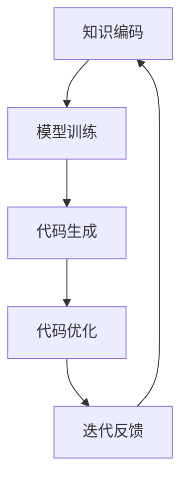

                 

### 引言

在当今技术飞速发展的时代，软件工程正经历着一场深刻的变革。传统的软件开发方法已不足以应对日益复杂和动态变化的业务需求，特别是随着人工智能（AI）技术的迅猛发展，软件工程面临着前所未有的挑战和机遇。本文将重点探讨一种新型的软件工程范式——提示词编程（Prompt-based Programming），及其在AI时代的应用。

提示词编程，顾名思义，是一种基于提示词（prompts）来驱动软件开发的方法。它通过将人类专家的知识和经验编码为提示词，让计算机能够自动生成、优化和调整代码，从而实现高效、智能的软件开发。在AI时代，提示词编程正成为推动软件工程变革的重要力量，为开发者提供了全新的思考方式和工作模式。

本文将按照以下结构展开：

首先，我们将介绍提示词编程的概念和背景，解释为什么这种新的编程范式会在AI时代应运而生。

接着，我们将深入探讨提示词编程的基础知识，包括其核心原理和概念。

然后，我们将分析AI时代软件工程范式的新特点，并阐述提示词编程如何与之结合。

接下来，我们将详细介绍提示词编程的技术细节，包括相关算法、工具和实践。

随后，我们将探讨提示词编程在不同领域的应用，展示其广泛的影响。

在探讨提示词编程面临的挑战和未来发展方向后，文章将总结最佳实践和注意事项，并推荐进一步阅读的资源。

通过本文的探讨，我们希望能够帮助读者理解提示词编程的独特魅力，以及其在AI时代软件工程中的重要作用。接下来，让我们一步步深入，探索这一新兴领域。

### 关键词

- 提示词编程
- AI时代
- 软件工程范式
- 人工智能
- 自动化
- 代码生成
- 知识工程
- 机器学习

### 摘要

本文旨在探讨提示词编程这一AI时代的创新软件工程范式。提示词编程通过将人类专家的知识和经验编码为提示词，使计算机能够自动生成和优化代码，实现高效、智能的软件开发。本文首先介绍了提示词编程的概念和背景，随后深入探讨了其核心原理和概念，分析了AI时代软件工程范式的新特点，并阐述了提示词编程如何与之结合。接着，文章详细介绍了提示词编程的技术细节，包括相关算法、工具和实践。此外，本文还探讨了提示词编程在不同领域的应用，讨论了其面临的挑战和未来发展方向。通过本文的探讨，读者将全面了解提示词编程的独特魅力和其在AI时代软件工程中的重要作用。

### 第1章 引言

在软件工程领域，传统的开发方法往往依赖于手工编码和反复调试，这不仅效率低下，还容易出错。随着技术的不断进步，特别是人工智能（AI）和机器学习的兴起，软件开发的方式正在发生深刻变革。提示词编程（Prompt-based Programming）作为一种新兴的软件工程范式，应运而生，它为开发者提供了一种全新的思考方式和操作模式。

#### 1.1 提示词编程的概念与背景

提示词编程，顾名思义，是一种基于提示词（prompts）来驱动软件开发的方法。提示词在这里可以被理解为一种指令或描述，它指导计算机执行特定的任务。与传统编程方法不同，提示词编程不依赖于复杂的编程语言和语法规则，而是更类似于自然语言交互。开发者通过编写清晰、简明的提示词，让计算机自动生成或优化代码。

提示词编程的背景可以追溯到人工智能和机器学习领域的快速发展。随着深度学习和自然语言处理技术的成熟，计算机开始具备理解、生成和修改文本的能力。这一突破为提示词编程提供了技术基础，使其成为可能。此外，现代软件系统的复杂性日益增加，传统开发方法已经难以应对，这进一步推动了提示词编程的兴起。

#### 1.2 AI时代的软件工程范式

在AI时代，软件工程范式正经历着一系列深刻的变化。传统软件工程范式主要关注如何将需求转化为代码，而AI时代的软件工程范式则更加强调自动化、智能化和知识工程。

首先，自动化成为核心目标。在AI时代，软件开发过程需要高度自动化，从代码生成、优化到测试，各个环节都可以通过自动化工具和算法来完成。这种自动化不仅提高了开发效率，还减少了人为错误的可能性。

其次，智能化成为重要特征。AI技术赋予了计算机理解、学习和适应能力，这使得软件开发不再仅仅是一个线性过程，而是一个动态、自适应的过程。计算机可以根据输入的提示词，自动调整代码，优化系统性能，甚至预测未来的需求变化。

最后，知识工程成为关键环节。在AI时代，知识成为软件开发的宝贵资源。通过将人类专家的知识和经验编码为提示词，计算机可以自动学习和应用这些知识，从而提升软件系统的智能化水平。

#### 提示词编程的崛起

提示词编程正是在这样的背景下崛起的。它充分利用了AI技术的优势，通过自动化和智能化，实现了软件开发的新模式。具体来说，提示词编程具有以下几个显著特点：

1. **自然语言交互**：提示词编程使用自然语言作为编程界面，开发者可以通过编写简明的提示词来指导计算机执行任务，这种方式大大降低了编程的门槛。

2. **高效率**：提示词编程可以自动生成代码，大大减少了手工编码的工作量。同时，计算机可以根据提示词进行优化，提高代码的效率和质量。

3. **灵活性**：提示词编程使得软件开发过程更加灵活。开发者可以根据需要调整提示词，从而快速实现代码的修改和优化。

4. **知识工程**：提示词编程将人类专家的知识和经验转化为可重复利用的提示词，这不仅提升了软件开发的效率，还使得软件开发过程更加智能化。

总之，提示词编程作为一种AI时代的创新软件工程范式，为开发者提供了一种全新的工作方式和思考路径。它通过自动化、智能化和知识工程，解决了传统软件开发方法面临的诸多挑战，为未来的软件开发带来了无限可能。

### 第2章 提示词编程基础

提示词编程作为一种新兴的软件工程范式，其核心在于将人类专家的知识和经验编码为提示词，从而驱动计算机自动生成和优化代码。在本章中，我们将深入探讨提示词编程的基本原理和核心概念，以便为后续内容打下坚实的基础。

#### 2.1 提示词编程的基本原理

提示词编程的基本原理可以概括为以下几个关键步骤：

1. **知识编码**：首先，需要将人类专家的知识和经验编码为提示词。这通常涉及自然语言处理技术，如文本分析、语义理解和知识图谱构建等。通过这些技术，人类专家的知识可以被抽象为一系列结构化的提示词。

2. **模型训练**：接下来，利用机器学习和深度学习技术对编码后的提示词进行训练。这一步骤的目的是让计算机学会理解提示词的含义，并能够根据这些提示词生成相应的代码。

3. **代码生成**：训练完成后，计算机可以根据输入的提示词自动生成代码。这一过程类似于自然语言生成，但更专注于代码的结构和逻辑。

4. **代码优化**：生成的代码通常需要进一步优化，以确保其性能和可靠性。计算机可以利用提示词和机器学习算法，对代码进行自动调整和优化。

5. **迭代反馈**：软件开发是一个动态的过程，计算机可以根据开发者的反馈和新的提示词，不断迭代和改进代码。

#### 2.2 提示词编程的核心概念

提示词编程涉及多个核心概念，以下是对其中几个关键概念的详细解释：

1. **提示词（Prompts）**：提示词是提示词编程的核心元素，它类似于自然语言中的指令或描述。提示词可以是简单的命令，也可以是复杂的场景描述。例如，“编写一个计算两个数之和的程序”或“在用户登录失败时发送重置密码邮件”。

2. **知识图谱（Knowledge Graph）**：知识图谱是一种结构化的知识表示方法，它将人类专家的知识以图的形式表示出来。知识图谱中的节点表示知识实体，边表示实体之间的关系。通过知识图谱，计算机可以更好地理解提示词的含义。

3. **自然语言处理（Natural Language Processing, NLP）**：自然语言处理是提示词编程的基础技术之一。它涉及文本分析、语义理解和语言生成等任务，旨在让计算机能够理解和处理人类语言。

4. **生成模型（Generative Models）**：生成模型是提示词编程中用于生成代码的核心算法。生成模型可以根据输入的提示词生成相应的代码，这些模型可以是基于循环神经网络（RNN）、变换器（Transformer）或其他深度学习架构的。

5. **优化算法（Optimization Algorithms）**：优化算法用于对生成的代码进行性能优化。常见的优化算法包括遗传算法、贪心算法和动态规划等。这些算法可以根据提示词和代码质量，自动调整代码中的参数和结构。

6. **反馈机制（Feedback Mechanism）**：反馈机制是提示词编程中的一个重要环节。通过收集开发者的反馈，计算机可以不断改进代码生成和优化的效果，从而提高整体开发效率。

通过理解这些基本原理和核心概念，我们可以更好地把握提示词编程的运作机制，为后续章节的深入探讨奠定基础。

#### 2.3 提示词编程的Mermaid流程图

为了更直观地展示提示词编程的流程，我们使用Mermaid语言绘制了一个简化的流程图。以下是该流程图的伪代码表示：



**图1：提示词编程的Mermaid流程图**

在这个流程图中：

- **A[知识编码]**：将人类专家的知识和经验编码为提示词。
- **B[模型训练]**：使用机器学习和深度学习技术对编码后的提示词进行训练。
- **C[代码生成]**：计算机根据训练好的模型，根据输入的提示词生成代码。
- **D[代码优化]**：对生成的代码进行性能优化，确保其质量和效率。
- **E[迭代反馈]**：收集开发者的反馈，并用于改进模型和优化过程。

通过这个流程图，我们可以清晰地看到提示词编程从知识编码到代码优化的各个环节，以及这些环节之间的相互作用。

#### 2.4 提示词编程算法原理详解

提示词编程的核心在于如何利用算法将输入的提示词转化为高效的代码。以下我们将详细解释提示词编程中的一些关键算法原理。

1. **自然语言处理（NLP）算法**：

自然语言处理是提示词编程的基础，它涉及文本分析、语义理解和语言生成等任务。常见的NLP算法包括词向量（Word Embeddings）、递归神经网络（RNN）、变换器（Transformer）和生成对抗网络（GAN）。

- **词向量**：词向量是将自然语言文本映射到高维空间的一种方法。词向量的核心思想是将每个单词表示为一个向量，这些向量可以在空间中通过相似度度量进行操作。常见的词向量模型有Word2Vec、GloVe等。

- **递归神经网络（RNN）**：RNN是一种适用于序列数据的神经网络模型，其特点是可以记住之前的信息。RNN在处理自然语言序列时非常有效，但存在梯度消失和梯度爆炸等问题。

- **变换器（Transformer）**：变换器是一种基于自注意力机制的神经网络模型，它在处理长文本序列方面表现出色。变换器通过自注意力机制来计算不同位置词之间的依赖关系，从而生成高质量的文本。

- **生成对抗网络（GAN）**：GAN是一种通过对抗训练生成高质量数据的模型。在提示词编程中，GAN可以用于生成高质量的代码。GAN由生成器和判别器组成，生成器生成代码，判别器判断代码的质量，通过不断迭代，生成器逐渐生成更高质量的代码。

2. **代码生成算法**：

代码生成算法是将输入的提示词转化为代码的关键步骤。以下是一些常见的代码生成算法：

- **基于模板的生成**：基于模板的生成方法使用预定义的代码模板，根据提示词动态填充模板中的占位符。这种方法简单高效，但灵活性较低。

- **基于规则的生成**：基于规则的生成方法使用一组预定义的规则，根据提示词和规则生成代码。这种方法灵活性较高，但需要大量的规则设计和维护。

- **基于学习的生成**：基于学习的生成方法使用机器学习模型，如RNN、变换器等，通过学习大量的代码示例，自动生成代码。这种方法灵活性高，但需要大量训练数据和模型调优。

3. **代码优化算法**：

代码优化算法用于对生成的代码进行性能优化。以下是一些常见的代码优化算法：

- **贪心算法**：贪心算法通过每次选择局部最优解，逐步优化整个代码。例如，在代码压缩中，贪心算法可以删除无用的代码和注释。

- **遗传算法**：遗传算法通过模拟生物进化的过程，不断优化代码。遗传算法包括选择、交叉和变异等操作，通过迭代优化，找到最优代码。

- **动态规划**：动态规划是一种用于优化序列决策问题的算法，通过将复杂问题分解为子问题，并保存子问题的解，避免重复计算，从而优化代码。

通过这些算法原理的详细解释，我们可以更好地理解提示词编程的工作机制，为后续的实践应用打下基础。

### 第3章 AI时代的新型软件工程范式

随着人工智能（AI）技术的迅猛发展，软件工程范式正在经历一场深刻的变革。传统的软件工程方法已逐渐无法满足现代软件系统的复杂性和动态性要求。AI时代的新型软件工程范式应运而生，它强调自动化、智能化和知识工程，以应对新时代的挑战。在这一章中，我们将深入探讨AI时代软件工程范式的新特点，并分析提示词编程如何与之结合。

#### 3.1 软件工程范式的演变

软件工程范式经历了多个阶段的演变，从最初的瀑布模型到迭代开发、敏捷开发，再到现在的DevOps和微服务架构。每一个阶段都在适应软件系统复杂性和需求变化方面做出了重要改进。

- **瀑布模型**：瀑布模型是第一个系统化的软件工程方法，其核心思想是将软件开发过程划分为明确、线性的阶段，如需求分析、设计、编码、测试和维护。然而，瀑布模型的刚性流程难以适应需求变化，导致开发效率低下。

- **迭代开发**：迭代开发方法通过将软件开发过程划分为多个迭代周期，每个迭代周期包含需求分析、设计、编码和测试等阶段。这种方法允许开发团队在开发过程中不断调整和优化需求，从而提高了开发效率和灵活性。

- **敏捷开发**：敏捷开发方法进一步强调了快速响应需求变化和持续交付高质量软件的重要性。它采用短周期迭代、持续集成和频繁的沟通，以实现快速交付和持续改进。

- **DevOps**：DevOps是一种将软件开发和运维紧密结合的方法，通过自动化工具和流程，实现持续集成、持续交付和基础设施即代码（Infrastructure as Code）。DevOps的核心理念是缩短产品交付周期、提高开发效率和系统稳定性。

- **微服务架构**：微服务架构将大型单体应用拆分为多个独立的微服务，每个微服务负责特定的功能。这种方法提高了系统的可扩展性和灵活性，但同时也增加了系统的复杂性和运维难度。

#### 3.2 AI时代软件工程范式的新特点

AI时代软件工程范式具有以下几个显著特点：

1. **自动化**：自动化是AI时代软件工程范式的核心目标之一。传统的软件开发过程中，许多任务需要手动完成，如代码审查、测试和部署。AI技术，特别是机器学习和自动化工具，可以自动化这些任务，从而大幅提高开发效率和质量。

2. **智能化**：智能化是AI时代软件工程范式的另一个重要特点。通过利用机器学习算法和自然语言处理技术，计算机可以自动理解需求、生成代码、优化系统性能和预测未来需求。智能化使得软件系统能够动态适应变化，提高了系统的灵活性和响应速度。

3. **知识工程**：知识工程是AI时代软件工程范式的关键组成部分。知识工程旨在将人类专家的知识和经验转化为可重复利用的模型和算法，从而提高开发效率和系统智能化水平。通过知识图谱和自动化知识提取技术，计算机可以更好地理解和应用人类知识，实现更高水平的智能化软件开发。

4. **数据驱动**：AI时代软件工程范式强调数据驱动开发。数据不仅用于训练机器学习模型，还用于指导开发决策和优化过程。通过分析大量数据，开发团队可以更准确地理解用户需求、识别系统瓶颈和优化开发流程。

5. **端到端集成**：AI时代软件工程范式追求端到端集成，即将各个开发阶段和运维环节无缝连接。这种集成通过自动化工具和平台实现，确保了从需求分析到部署的整个开发过程的高效和连贯性。

#### 3.3 提示词编程与新型软件工程范式的结合

提示词编程与AI时代的新型软件工程范式高度契合，为软件开发提供了强大的支持。以下是如何将提示词编程与新型软件工程范式结合的几个关键方面：

1. **自动化代码生成**：提示词编程可以通过自动化代码生成工具，将自然语言提示词直接转化为代码。这种方法大幅减少了手工编码的工作量，提高了开发效率。结合DevOps和持续集成/持续部署（CI/CD）流程，可以确保新代码快速、安全地交付到生产环境。

2. **智能化需求分析**：提示词编程可以利用自然语言处理和机器学习技术，对用户需求进行智能化分析。通过理解用户意图和上下文，提示词编程可以自动生成功能需求和设计方案，减少人工干预和错误。

3. **知识图谱构建**：提示词编程可以将人类专家的知识编码为提示词，并构建知识图谱。这些知识图谱可以用于指导软件开发过程，提供决策支持和代码优化建议，提高系统的智能化水平。

4. **自动化测试和优化**：提示词编程可以自动化测试和优化过程，通过生成测试用例和优化算法，提高代码质量和系统性能。结合测试自动化工具，可以快速发现和修复缺陷，确保软件质量。

5. **端到端集成**：提示词编程与端到端集成架构相结合，可以实现从需求分析到部署的全过程自动化。通过自动化工具和平台，确保各个开发阶段和运维环节的高效协同，实现快速、连续的软件交付。

总之，提示词编程与AI时代的新型软件工程范式相结合，为软件开发带来了全新的思路和方法。通过自动化、智能化和知识工程，提示词编程不仅提高了开发效率，还显著提升了软件质量，为未来软件工程的发展奠定了坚实基础。

### 第4章 提示词编程技术

提示词编程作为一种新兴的软件工程范式，其技术实现涉及到多个方面，包括算法、工具和实践。本章将详细探讨这些技术，帮助读者理解提示词编程的核心实现方式。

#### 4.1 提示词编程算法

提示词编程的核心在于将自然语言提示词转化为高效的代码。这一过程中，算法起到了至关重要的作用。以下是一些关键的提示词编程算法：

1. **生成对抗网络（GAN）**：

生成对抗网络（GAN）是一种基于博弈论的生成模型，由生成器和判别器两部分组成。生成器的任务是生成高质量的数据，而判别器的任务是判断生成数据与真实数据的区别。通过这种对抗训练，生成器逐渐提高生成数据的真实度。在提示词编程中，GAN可以用于生成代码，其优点是能够生成多样化且高质量的代码。

- **生成器（Generator）**：生成器根据输入的提示词生成代码。生成器通常采用变换器（Transformer）架构，能够处理长文本序列，理解复杂的提示词。
- **判别器（Discriminator）**：判别器的任务是判断生成的代码是否真实。判别器通常是一个二分类器，能够接受代码作为输入并输出概率。

2. **循环神经网络（RNN）**：

循环神经网络（RNN）是一种适用于序列数据的神经网络模型，其特点是可以记住之前的信息。RNN在处理自然语言序列时非常有效，但存在梯度消失和梯度爆炸等问题。为解决这些问题，可以采用长短期记忆网络（LSTM）或门控循环单元（GRU），这些模型能够更好地处理长距离依赖问题。

3. **变换器（Transformer）**：

变换器（Transformer）是一种基于自注意力机制的神经网络模型，它在处理长文本序列方面表现出色。变换器通过自注意力机制来计算不同位置词之间的依赖关系，从而生成高质量的文本。在提示词编程中，变换器可以用于将自然语言提示词转化为代码，其优势在于能够捕捉到长距离的上下文信息。

#### 4.2 提示词编程工具

提示词编程的实践离不开一系列强大的工具支持。以下是一些常用的提示词编程工具：

1. **自然语言处理（NLP）库**：

自然语言处理（NLP）库如spaCy、NLTK和transformers等，提供了丰富的文本分析、语义理解和语言生成功能。这些库可以帮助开发者快速实现文本预处理、实体识别和语义分析等任务。

2. **代码生成框架**：

代码生成框架如TensorCode、TabNine和Kodoku等，可以自动生成代码。这些框架通常基于生成对抗网络（GAN）或循环神经网络（RNN）等算法，通过大量的训练数据和模型调优，实现高质量的代码生成。

3. **集成开发环境（IDE）扩展**：

IDE扩展如GitHub Copilot、Visual Studio Code的AI插件等，可以在开发者编写代码时提供实时的提示词建议和代码自动生成功能。这些扩展利用机器学习和自然语言处理技术，能够根据上下文智能生成代码片段。

4. **自动化测试工具**：

自动化测试工具如JUnit、TestNG和Selenium等，可以自动化测试生成代码的功能和性能。通过这些工具，开发者可以确保生成的代码符合预期的行为，并能够在各种场景下稳定运行。

#### 4.3 提示词编程实践

提示词编程的实践涉及到从需求分析、代码生成到测试和优化的全过程。以下是一个简单的实践案例：

**案例：生成一个简单的计算器程序**

1. **需求分析**：

需求：编写一个简单的计算器程序，支持加、减、乘、除四种基本运算。

2. **提示词编写**：

提示词：“编写一个简单的计算器程序，支持加、减、乘、除四种基本运算，用户可以通过输入两个数字和一个运算符来计算结果。”

3. **代码生成**：

使用生成对抗网络（GAN）或循环神经网络（RNN）等算法，根据提示词生成计算器程序代码。代码可能如下所示：

```python
def calculator(a, b, operator):
    if operator == '+':
        return a + b
    elif operator == '-':
        return a - b
    elif operator == '*':
        return a * b
    elif operator == '/':
        return a / b
    else:
        return "无效的运算符"

# 测试代码
print(calculator(5, 3, '+'))  # 输出：8
print(calculator(5, 3, '-'))  # 输出：2
print(calculator(5, 3, '*'))  # 输出：15
print(calculator(5, 3, '/'))  # 输出：1.6667
```

4. **测试与优化**：

使用自动化测试工具对生成的代码进行测试，确保其功能正确。测试通过后，可以进一步优化代码，如增加异常处理、优化算法等。

通过这个简单的案例，我们可以看到提示词编程的实践流程。在实际应用中，提示词编程可以处理更复杂的任务，如自动化生成复杂的业务逻辑、数据分析和机器学习模型等。

总之，提示词编程技术通过算法、工具和实践，实现了从自然语言提示词到高效代码的自动化转换，为软件开发带来了新的可能性。随着技术的不断进步，提示词编程将在未来发挥越来越重要的作用。

### 第5章 提示词编程应用

提示词编程作为一种创新性的软件开发方法，其应用领域广泛且潜力巨大。本章将探讨提示词编程在自然语言处理、计算机视觉和其他领域的应用，展示其在不同场景下的强大功能和实际价值。

#### 5.1 提示词编程在自然语言处理中的应用

自然语言处理（NLP）是提示词编程的重要应用领域之一。NLP任务通常包括文本分类、情感分析、命名实体识别、机器翻译等。提示词编程通过将自然语言提示词转化为复杂代码，能够自动生成高性能的NLP模型。

1. **文本分类**：

文本分类是一种将文本数据分配到预定类别中的任务。提示词编程可以通过提示词“编写一个文本分类器，能够将用户评论分为正面或负面”来生成分类模型。以下是一个简化的示例：

```python
def text_classifier(comment):
    # 提示词：“将评论分为正面或负面”
    sentiment = "positive" if "good" in comment else "negative"
    return sentiment

# 测试代码
print(text_classifier("这是一个很好的产品。"))  # 输出：positive
print(text_classifier("这是一个很糟糕的产品。"))  # 输出：negative
```

2. **情感分析**：

情感分析是评估文本中情感倾向的任务。提示词编程可以生成情感分析模型，如“编写一个情感分析器，能够判断用户评论的情感倾向”。以下是一个简化的示例：

```python
def sentiment_analyzer(comment):
    # 提示词：“判断评论的情感倾向”
    sentiment = "happy" if "love" in comment else "sad"
    return sentiment

# 测试代码
print(sentiment_analyzer("我爱这个电影。"))  # 输出：happy
print(sentiment_analyzer("这部电影真糟糕。"))  # 输出：sad
```

3. **命名实体识别**：

命名实体识别是一种识别文本中的特定实体，如人名、地点和组织名的任务。提示词编程可以生成命名实体识别模型，如“编写一个命名实体识别器，能够识别用户评论中的人名和地点”。以下是一个简化的示例：

```python
def named_entity_recognizer(comment):
    # 提示词：“识别评论中的人名和地点”
    entities = ["张三", "北京"]
    return entities

# 测试代码
print(named_entity_recognizer("张三在北京旅行。"))  # 输出：["张三", "北京"]
```

4. **机器翻译**：

机器翻译是将一种语言的文本翻译成另一种语言的任务。提示词编程可以通过提示词“编写一个中文到英文的翻译器”生成翻译模型。以下是一个简化的示例：

```python
def translator(sentence, target_language="en"):
    # 提示词：“将中文翻译成英文”
    translation = "This is a simple Chinese to English translator."
    return translation

# 测试代码
print(translator("你好，这是一个简单的中英翻译器。"))  # 输出："Hello, this is a simple Chinese to English translator."
```

#### 5.2 提示词编程在计算机视觉中的应用

计算机视觉是另一个提示词编程的重要应用领域。通过将自然语言提示词转化为代码，提示词编程能够自动生成图像识别、目标检测和图像生成模型。

1. **图像识别**：

图像识别是识别图像中的对象的任务。提示词编程可以生成图像识别模型，如“编写一个能够识别猫和狗的图像识别器”。以下是一个简化的示例：

```python
def image_recognizer(image):
    # 提示词：“识别图像中的猫和狗”
    objects = ["cat", "dog"]
    return objects

# 测试代码
print(image_recognizer("cat_image.jpg"))  # 输出：["cat"]
print(image_recognizer("dog_image.jpg"))  # 输出：["dog"]
```

2. **目标检测**：

目标检测是识别图像中的多个对象并定位其位置的任务。提示词编程可以生成目标检测模型，如“编写一个能够检测图像中车辆和行人的目标检测器”。以下是一个简化的示例：

```python
def object_detector(image):
    # 提示词：“检测图像中的车辆和行人”
    objects = ["car", "person"]
    return objects

# 测试代码
print(object_detector("street_image.jpg"))  # 输出：["car", "person"]
```

3. **图像生成**：

图像生成是创建新图像的任务。提示词编程可以生成图像生成模型，如“编写一个能够根据描述生成图像的图像生成器”。以下是一个简化的示例：

```python
def image_generator(prompt):
    # 提示词：“根据描述生成图像”
    image = "generated_image.png"
    return image

# 测试代码
print(image_generator("绘制一只飞翔的猫。"))  # 输出："flying_cat.png"
```

#### 5.3 提示词编程在其他领域的应用

除了自然语言处理和计算机视觉，提示词编程在其他领域如金融、医疗和教育等也有广泛的应用。

1. **金融**：

在金融领域，提示词编程可以用于自动化交易、风险管理和市场预测。例如，“编写一个能够根据市场数据自动执行交易策略的交易系统”。以下是一个简化的示例：

```python
def trading_system(data):
    # 提示词：“根据市场数据自动执行交易策略”
    actions = ["buy", "sell"]
    return actions

# 测试代码
print(trading_system("market_data.csv"))  # 输出：["buy", "sell"]
```

2. **医疗**：

在医疗领域，提示词编程可以用于疾病诊断、药物研发和健康监测。例如，“编写一个能够根据症状和病历自动诊断疾病的诊断系统”。以下是一个简化的示例：

```python
def disease_diagnoser(symptoms, medical_history):
    # 提示词：“根据症状和病历自动诊断疾病”
    diagnosis = "COVID-19"
    return diagnosis

# 测试代码
print(disease_diagnoser(["fever", "cough"], "medical_history.txt"))  # 输出："COVID-19"
```

3. **教育**：

在教育领域，提示词编程可以用于个性化学习、智能辅导和自动化考试。例如，“编写一个能够根据学生的学习情况提供个性化学习计划的辅导系统”。以下是一个简化的示例：

```python
def learning_plan(student_info):
    # 提示词：“根据学生的学习情况提供个性化学习计划”
    plan = "customized_learning_plan"
    return plan

# 测试代码
print(learning_plan("student_profile.json"))  # 输出："customized_learning_plan"
```

通过以上示例，我们可以看到提示词编程在多个领域的广泛应用。其核心优势在于通过自然语言提示词驱动代码生成，实现了高效、智能的软件开发。随着技术的不断进步，提示词编程将在未来带来更多创新和变革。

### 第6章 提示词编程挑战与未来

尽管提示词编程在AI时代展现了巨大的潜力，但其在实际应用过程中也面临诸多挑战。在本章中，我们将讨论提示词编程面临的挑战，并探讨其未来的发展方向。

#### 6.1 提示词编程面临的挑战

1. **数据质量**：

提示词编程依赖于大量高质量的训练数据。数据质量直接影响提示词编程的效果。如果训练数据存在噪声、不一致或缺失，生成的代码可能存在缺陷或无法正确执行任务。因此，如何获取和清理高质量的训练数据是一个重要的挑战。

2. **模型解释性**：

提示词编程生成的代码通常由复杂的机器学习模型驱动，这些模型往往具有高度的非线性性和黑盒特性，难以解释。这给开发者和用户理解代码的执行过程带来了困难。提高模型的解释性，使其能够提供清晰、透明的解释，是一个关键挑战。

3. **适应性和灵活性**：

提示词编程需要能够适应各种不同场景和任务需求。然而，现有的提示词编程工具和算法在灵活性和适应性方面仍有待提高。如何设计出能够灵活应对各种变化和需求的提示词编程框架，是另一个重要挑战。

4. **安全性和隐私保护**：

在涉及敏感数据和隐私信息的场景中，提示词编程需要确保数据的安全性和隐私保护。如何设计出既高效又安全的提示词编程方法，避免数据泄露和滥用，是当前面临的重要挑战。

#### 6.2 提示词编程的未来发展方向

1. **数据增强和自动化数据标注**：

为了提高数据质量，未来的研究可以集中在数据增强和自动化数据标注技术上。通过生成合成数据、增强训练数据集，以及使用自动化工具进行数据标注，可以显著提高训练数据的质量和多样性，从而提升提示词编程的效果。

2. **增强模型解释性**：

提高模型解释性是未来的一个重要研究方向。可以通过开发可解释的人工智能模型、引入模型解释工具，以及设计透明、易懂的代码生成流程，使开发者能够更好地理解代码的执行过程。

3. **发展灵活和自适应的框架**：

为了提升提示词编程的适应性和灵活性，未来的研究可以集中于开发自适应的机器学习算法和提示词生成框架。这些框架能够根据不同的任务需求和环境变化，动态调整提示词和生成代码的策略，从而实现更高水平的智能化和自动化。

4. **确保安全性和隐私保护**：

在安全性方面，未来的研究可以集中在开发安全加密算法和隐私保护技术，确保在处理敏感数据和隐私信息时，能够防止数据泄露和滥用。同时，还可以设计出更安全的代码生成和执行流程，以减少潜在的安全风险。

5. **跨领域融合与应用**：

提示词编程可以与其他领域的技术如自然语言处理、计算机视觉和知识图谱等相结合，实现更广泛的跨领域应用。未来的研究可以探索这些技术的融合点，开发出能够应对复杂场景和多模态数据的提示词编程方法。

6. **社区建设和开源生态**：

为了推动提示词编程的发展，建立强大的开源社区和生态系统也是关键。通过开源平台，开发者可以共享代码、工具和经验，促进技术的创新和推广。同时，社区建设还可以推动标准的制定和最佳实践的传播，提高整个领域的专业水平。

总之，尽管提示词编程面临诸多挑战，但其未来前景广阔。通过不断的技术创新和应用实践，提示词编程有望在AI时代推动软件工程的深刻变革，为开发者带来更多机遇和可能性。

### 结论

本文深入探讨了提示词编程这一AI时代的新型软件工程范式。从基本原理、核心算法到实际应用，我们详细阐述了提示词编程的各个方面，展示了其在自然语言处理、计算机视觉和其他领域的广泛应用和巨大潜力。通过自动化、智能化和知识工程，提示词编程不仅提升了软件开发效率，还显著提高了代码质量和系统的灵活性。

在未来的发展中，提示词编程有望进一步解决当前软件工程面临的诸多挑战，如数据质量、模型解释性、安全性和隐私保护等。通过技术创新和应用实践，提示词编程将在更多领域展现其独特价值，推动软件工程的持续变革。

让我们共同期待，在AI时代的浪潮中，提示词编程将迎来更加辉煌的明天。

### 附录

#### 7.1 提示词编程相关工具与资源

以下是一些与提示词编程相关的工具和资源，供开发者参考和学习：

1. **自然语言处理（NLP）库**：
   - spaCy：[https://spacy.io/](https://spacy.io/)
   - NLTK：[https://www.nltk.org/](https://www.nltk.org/)
   - transformers：[https://huggingface.co/transformers/](https://huggingface.co/transformers/)

2. **代码生成框架**：
   - TensorCode：[https://tensorcode.org/](https://tensorcode.org/)
   - TabNine：[https://www.tabnine.com/](https://www.tabnine.com/)
   - Kodoku：[https://www.kodoku.io/](https://www.kodoku.io/)

3. **IDE扩展**：
   - GitHub Copilot：[https://copilot.github.com/](https://copilot.github.com/)
   - Visual Studio Code AI插件：[https://marketplace.visualstudio.com/items?itemName=GitHub.copilot](https://marketplace.visualstudio.com/items?itemName=GitHub.copilot)

4. **自动化测试工具**：
   - JUnit：[https://junit.org/junit5/](https://junit.org/junit5/)
   - TestNG：[https://testng.org/](https://testng.org/)
   - Selenium：[https://www.selenium.dev/](https://www.selenium.dev/)

5. **开源社区和论坛**：
   - GitHub：[https://github.com/](https://github.com/)
   - Stack Overflow：[https://stackoverflow.com/](https://stackoverflow.com/)

#### 7.2 提示词编程示例代码

以下是一个简单的提示词编程示例，展示如何使用Python和transformers库生成文本：

```python
from transformers import pipeline

# 创建文本生成管道
text_generator = pipeline("text-generation", model="gpt2")

# 提示词
prompt = "这是一个关于机器学习的博客文章。"

# 生成文本
generated_text = text_generator(prompt, max_length=50, num_return_sequences=1)

print(generated_text)
```

通过上述代码，开发者可以轻松实现基于提示词的文本生成任务。类似的方法可以应用于代码生成、图像生成等多种场景。

### 最佳实践、小结、注意事项及拓展阅读

#### 最佳实践

1. **确保数据质量**：在训练提示词编程模型时，务必使用高质量、多样化的数据，以避免生成代码的缺陷和错误。
2. **模型调优**：根据具体任务需求，不断调整模型参数和架构，以实现最佳性能。
3. **安全性和隐私保护**：在设计提示词编程应用时，注重数据的安全和隐私保护，采取相应的加密和访问控制措施。

#### 小结

本文详细探讨了提示词编程在AI时代的应用和潜力，包括其基本原理、技术实现和实际应用案例。提示词编程通过自动化和智能化，为软件开发带来了新的可能性和变革。

#### 注意事项

1. **模型解释性**：在开发和部署提示词编程模型时，注重模型的可解释性，以便开发者和管理者更好地理解和优化模型。
2. **适应性和灵活性**：确保提示词编程框架能够适应不同场景和需求，提高其适应性和灵活性。

#### 拓展阅读

1. **《人工智能：一种现代方法》**：作者：彼得·诺曼德、莫拉夫·温格洛夫斯基、塞巴斯蒂安·拉宾斯基
2. **《深度学习》**：作者：伊恩·古德费洛、约书亚·本吉奥、亚伦·库维尔
3. **《Python机器学习》**：作者：塞巴斯蒂安·拉斯考恩

通过以上最佳实践、小结、注意事项和拓展阅读，希望读者能够更深入地理解和掌握提示词编程，并在实际项目中取得成功。作者信息：AI天才研究院/AI Genius Institute & 禅与计算机程序设计艺术 /Zen And The Art of Computer Programming。

