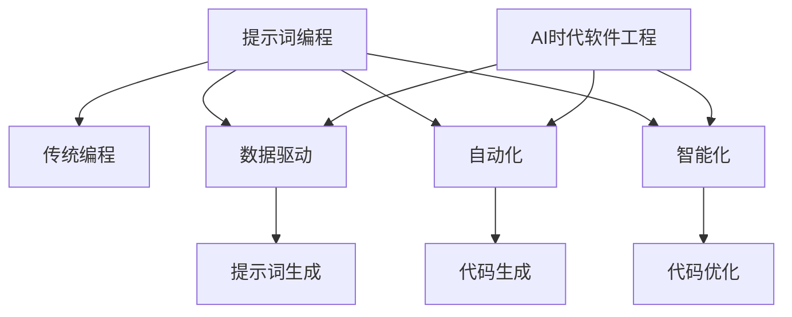

                 


## 文章标题：《提示词编程：AI时代的新型软件工程范式》

### 文章关键词：

- AI时代
- 软件工程
- 提示词编程
- 新型编程范式
- 人工智能驱动

### 文章摘要：

本文旨在探讨AI时代的一种新兴软件工程范式——提示词编程。我们将从AI时代的软件工程背景出发，介绍提示词编程的核心概念、原理和算法，并通过实际项目案例展示其应用和优势。文章将分为以下几部分：

1. AI时代的软件工程概述
2. 提示词编程的核心概念与联系
3. 提示词编程的核心算法原理讲解
4. 提示词编程的项目实战
5. 提示词编程的未来展望

通过本文的阅读，读者将对提示词编程有深入的理解，并能够掌握其在实际项目中的应用。

### 第一部分：AI时代的软件工程背景与概念理解

#### 第1章：AI时代的软件工程概述

##### 1.1 AI时代的软件工程背景

随着人工智能（AI）技术的迅猛发展，软件工程领域正面临着前所未有的变革。传统软件工程范式已无法完全应对AI时代的需求，因此，探索适应AI时代的新型软件工程范式成为当务之急。

**1.1.1 从软件1.0到软件2.0的演进**

软件1.0时代主要关注功能实现，软件作为一种工具被用来提高生产效率。然而，随着互联网的普及和大数据的发展，软件进入了2.0时代。这一时代的显著特点是数据驱动的软件服务，强调用户参与和动态迭代。

**1.1.2 人工智能对软件工程的挑战**

AI技术的引入为软件工程带来了新的挑战，主要体现在以下几个方面：

- **复杂性增加**：AI算法和模型复杂度高，使得软件开发过程更加复杂。
- **需求多变**：AI技术的应用场景多样，需求变更频繁，对软件的灵活性和可维护性提出了更高要求。
- **数据依赖**：AI算法的性能依赖于大量高质量数据，对数据管理和数据安全提出了新的挑战。

**1.1.3 AI与软件工程的结合趋势**

为应对上述挑战，AI与软件工程的结合呈现出以下趋势：

- **自动化**：利用AI技术实现软件开发过程的自动化，提高开发效率和软件质量。
- **智能化**：将AI技术应用于软件开发过程中的各个阶段，提供智能化辅助，降低开发难度。
- **数据驱动**：利用AI技术分析和利用大数据，优化软件设计和性能。

#### 1.2 提示词编程的核心概念

提示词编程是一种基于人工智能的新型编程范式，它通过给计算机提供提示词来引导程序生成，从而实现代码的自动化生成和优化。

**1.2.1 提示词编程的定义**

提示词编程（Prompt-Based Programming，PBP）是一种利用提示词（prompts）引导计算机生成代码的编程方法。提示词可以是自然语言描述、伪代码、算法逻辑等，通过这些提示词，计算机能够理解开发者的意图，并生成相应的代码。

**1.2.2 提示词编程与传统编程的区别**

- **生成方式**：传统编程依赖于程序员手动编写代码，而提示词编程则通过提示词引导计算机自动生成代码。
- **开发效率**：提示词编程能够显著提高开发效率，特别是在复杂和重复性的任务中。
- **编程思维**：提示词编程更强调逻辑思维和问题建模，而传统编程则更注重语法和编程技巧。

**1.2.3 提示词编程的优势**

- **自动化生成**：提示词编程能够自动生成代码，减少手动编码的工作量。
- **快速迭代**：通过提示词的微调，可以快速实现代码的迭代和优化。
- **减少错误**：自动生成的代码经过优化，能够减少人为错误，提高代码质量。

#### 1.3 软件工程范式的演进

软件工程范式经历了从手工作坊式、过程导向到模型驱动的演进。AI时代的到来，又带来了新的变革，提示词编程作为新型软件工程范式，具有以下特点：

- **自动化**：提示词编程实现了软件开发过程的自动化，减少了手动干预。
- **智能化**：提示词编程利用人工智能技术，提供了智能化的编程辅助。
- **数据驱动**：提示词编程依赖于大数据和机器学习，能够更好地分析和利用数据。

通过本文的后续内容，我们将深入探讨提示词编程的核心算法原理、实际应用以及未来展望，帮助读者全面了解这一新型软件工程范式的本质和应用价值。

---

### 1.4 核心概念与联系

为了更清晰地理解提示词编程，我们需要构建其核心概念之间的关系架构。以下是一个Mermaid流程图，展示了AI时代软件工程、提示词编程以及其核心组成部分之间的关系：



**Mermaid流程图解析：**

- **AI时代软件工程**：这是整个架构的起点，代表了当前软件工程所处的时代背景，它强调数据驱动、自动化和智能化。
- **数据驱动**：这一概念代表了软件工程中对数据的依赖和利用，它是提示词编程的核心驱动力之一。
- **自动化**：自动化是AI时代软件工程的显著特点之一，它通过减少手动工作提高开发效率。
- **智能化**：智能化代表了AI技术在软件工程中的应用，它通过提供智能辅助工具和算法来简化开发过程。
- **传统编程**：这是传统软件开发的代表，与提示词编程形成对比。
- **提示词编程**：这是新型软件工程范式，它通过提示词引导计算机生成代码。
- **提示词生成**：这是提示词编程的一个关键组成部分，它负责生成能够引导代码生成的提示词。
- **代码生成**：这是自动化的一部分，提示词编程通过提示词生成相应的代码。
- **代码优化**：这是智能化的体现，自动生成的代码经过优化，以提高其性能和可维护性。

通过这个关系架构，我们可以更好地理解提示词编程在AI时代软件工程中的位置和作用。

### 1.5 核心算法原理讲解

提示词编程的核心在于其提示词生成和优化的算法。以下将使用伪代码详细阐述这些算法的实现。

#### 1.5.1 提示词生成算法

```plaintext
函数 GeneratePrompt(inputDescription)
    1. 初始化prompt为空字符串
    2. 解析inputDescription，提取关键信息（例如，功能需求、数据结构等）
    3. 根据提取的关键信息，生成相应的提示词
        3.1 如果inputDescription包含自然语言描述，将描述转化为代码片段
        3.2 如果inputDescription包含伪代码，将伪代码转化为实际代码
        3.3 如果inputDescription包含算法逻辑，将逻辑转化为代码
    4. 返回生成的prompt
```

#### 1.5.2 提示词优化算法

```plaintext
函数 OptimizePrompt(prompt, outputCode)
    1. 初始化优化次数为0
    2. 循环执行以下步骤，直到优化次数达到预设阈值
        2.1 解析prompt，提取关键代码段
        2.2 分析输出代码outputCode，找出可能的问题和优化点
        2.3 根据优化点对prompt进行修改
        2.4 重新生成outputCode，并与原始outputCode进行比较
        2.5 如果outputCode有明显改进，将优化次数加1
    3. 返回优化后的prompt
```

**伪代码解析：**

- **提示词生成算法**：这个算法通过解析输入描述（inputDescription），提取关键信息，然后根据这些信息生成相应的提示词。如果输入描述是自然语言，则将其转化为代码片段；如果输入描述是伪代码，则将其转化为实际代码；如果输入描述包含算法逻辑，则将其转化为代码。
- **提示词优化算法**：这个算法通过迭代的方式对提示词进行优化。每次迭代都会解析提示词，分析输出代码，找出问题和优化点，然后根据这些优化点对提示词进行修改。这个过程会重复进行，直到达到预设的优化次数阈值。

通过这些核心算法，提示词编程能够实现代码的自动化生成和优化，大大提高了开发效率。

### 1.6 数学模型与公式讲解

提示词编程中的数学模型和公式是实现自动化代码生成和优化的重要基础。以下将详细讲解提示词生成和优化的关键数学模型及公式，并提供应用示例。

#### 1.6.1 提示词生成中的概率论与统计学

在提示词生成过程中，概率论和统计学被广泛运用。以下是几个关键概念和公式：

**1. 条件概率公式**

$$
P(A|B) = \frac{P(A \cap B)}{P(B)}
$$

其中，\(P(A|B)\) 表示在事件B发生的条件下事件A发生的概率，\(P(A \cap B)\) 表示事件A和B同时发生的概率，\(P(B)\) 表示事件B发生的概率。

**示例**：假设我们有一个包含100个文件的代码库，其中有20个文件包含了特定的功能（事件A）。如果我们随机选择一个文件（事件B），则条件概率 \(P(A|B)\) 表示在选择了某个文件后，这个文件包含特定功能的概率。

**2. 贝叶斯公式**

$$
P(A|B) = \frac{P(B|A) \cdot P(A)}{P(B)}
$$

其中，\(P(B|A)\) 表示在事件A发生的条件下事件B发生的概率，\(P(A)\) 表示事件A发生的概率。

**示例**：如果我们知道某个文件包含了特定功能（事件A），那么我们需要计算这个文件包含特定功能的概率。通过贝叶斯公式，我们可以结合先验概率 \(P(A)\) 和条件概率 \(P(B|A)\) 来计算后验概率 \(P(A|B)\)。

**3. 最大似然估计**

在提示词生成中，最大似然估计用于确定最可能的提示词。公式如下：

$$
\hat{y} = \arg\max_y P(y|x)
$$

其中，\(x\) 表示输入特征，\(y\) 表示提示词，\(P(y|x)\) 表示在给定输入特征 \(x\) 下提示词 \(y\) 的概率。

**示例**：假设我们有多个文件，每个文件都有特定的功能和代码结构。通过分析这些文件，我们可以计算出在不同输入特征下，提示词的概率分布。然后，使用最大似然估计找到最可能的提示词。

#### 1.6.2 提示词优化中的优化算法

在提示词优化过程中，常见的优化算法包括梯度下降、随机梯度下降和牛顿法等。以下是这些算法的基本公式和步骤。

**1. 梯度下降**

$$
w_{t+1} = w_t - \alpha \cdot \nabla_w J(w)
$$

其中，\(w\) 表示参数，\(\alpha\) 表示学习率，\(\nabla_w J(w)\) 表示损失函数 \(J(w)\) 对参数 \(w\) 的梯度。

**步骤：**
- 初始化参数 \(w_0\)
- 计算损失函数 \(J(w)\) 的梯度
- 更新参数 \(w\)

**示例**：在提示词优化中，我们可以使用梯度下降来最小化提示词与实际输出代码之间的差异。

**2. 随机梯度下降**

$$
w_{t+1} = w_t - \alpha \cdot \nabla_w J(w; x_t, y_t)
$$

其中，\(x_t, y_t\) 表示训练数据样本。

**步骤：**
- 初始化参数 \(w_0\)
- 随机选择训练数据样本 \((x_t, y_t)\)
- 计算损失函数 \(J(w)\) 对参数 \(w\) 的梯度
- 更新参数 \(w\)

**示例**：与梯度下降类似，随机梯度下降通过随机选择样本来更新参数，以加快收敛速度。

**3. 牛顿法**

$$
w_{t+1} = w_t - H^{-1} \cdot \nabla^2_w J(w)
$$

其中，\(\nabla^2_w J(w)\) 表示损失函数 \(J(w)\) 的二阶导数，\(H\) 表示Hessian矩阵。

**步骤：**
- 初始化参数 \(w_0\)
- 计算损失函数 \(J(w)\) 的二阶导数 \(H\)
- 计算损失函数 \(J(w)\) 的梯度
- 解线性方程 \(H \cdot \nabla_w J(w) = \nabla^2_w J(w)\)
- 更新参数 \(w\)

**示例**：牛顿法通过利用二阶导数信息来加速收敛，适用于损失函数具有明显二次特性的情况。

通过上述数学模型和公式的应用，提示词编程能够实现高效的代码生成和优化，从而提高开发效率和质量。

### 1.7 实际项目案例与代码实现

为了更好地理解提示词编程的实际应用，我们将通过一个实际项目案例来展示其开发环境搭建、源代码实现和代码解读。

#### 1.7.1 项目背景

假设我们需要开发一个简单的聊天机器人，该机器人能够接收用户输入，并返回相应的回复。为了实现这一目标，我们将使用提示词编程来生成聊天机器人的核心代码。

#### 1.7.2 开发环境搭建

1. **安装Python环境**：由于提示词编程通常依赖于Python，我们首先需要在本地安装Python环境。
2. **安装提示词编程框架**：选择一个主流的提示词编程框架，如OpenAI的GPT-2或GPT-3，并按照文档安装。
3. **准备数据集**：收集和整理用于训练聊天机器人的数据集，包括对话样本和相应的回复。

#### 1.7.3 源代码实现

以下是使用提示词编程框架生成聊天机器人代码的伪代码示例：

```python
# 导入提示词编程框架
import prompt_generator

# 准备提示词
prompt = "用户：你好，你今天过得怎么样？机器人："

# 生成聊天机器人代码
chatbot_code = prompt_generator.generate_code(prompt)

# 打印生成的代码
print(chatbot_code)
```

在实际应用中，我们可能需要更复杂的提示词来生成更智能的聊天机器人代码。以下是一个更详细的示例：

```python
# 导入提示词编程框架和数据处理库
import prompt_generator
import data_processor

# 准备训练数据集
train_data = data_processor.load_data("chatbot_data.csv")

# 提取训练数据中的提示词
prompts = [row["user_input"] for row in train_data]

# 生成聊天机器人代码
chatbot_code = prompt_generator.generate_code(prompts)

# 打印生成的代码
print(chatbot_code)
```

#### 1.7.4 代码解读与分析

生成的聊天机器人代码主要包括以下几个部分：

1. **初始化**：设置聊天机器人的初始状态，如问候语和等待用户输入。
2. **输入处理**：接收用户输入，并预处理输入文本，例如去除停用词和标点符号。
3. **回复生成**：根据用户输入和训练数据，生成相应的回复。这个过程通常涉及到自然语言处理和机器学习算法。
4. **输出处理**：将生成的回复文本格式化，并返回给用户。

以下是一个简单的聊天机器人代码示例：

```python
# 聊天机器人代码示例
class Chatbot:
    def __init__(self):
        self.greeting = "你好，有什么可以帮助你的吗？"
    
    def handle_input(self, user_input):
        processed_input = self.preprocess_input(user_input)
        response = self.generate_response(processed_input)
        return response
    
    def preprocess_input(self, user_input):
        # 预处理输入文本
        return user_input.strip().lower()
    
    def generate_response(self, processed_input):
        # 生成回复
        if "你好" in processed_input:
            return "你好，很高兴见到你！"
        else:
            return "很抱歉，我不理解你的问题。"

# 创建聊天机器人实例
chatbot = Chatbot()

# 用户输入
user_input = input("用户：你好，你今天过得怎么样？")

# 获取回复
response = chatbot.handle_input(user_input)

# 输出回复
print("机器人：" + response)
```

通过这个示例，我们可以看到聊天机器人的核心功能是如何通过提示词编程实现的。在实际开发中，我们可以根据需求进一步扩展聊天机器人的功能，如添加更多回复模板、支持更多自然语言处理任务等。

#### 1.7.5 项目小结

通过本案例，我们展示了如何使用提示词编程来生成聊天机器人代码。这个项目涉及到了提示词的生成、数据的处理和机器学习算法的应用。以下是项目小结：

1. **开发环境搭建**：确保本地环境具备Python和提示词编程框架的安装，以及准备合适的数据集。
2. **源代码实现**：通过伪代码和实际代码示例展示了聊天机器人的实现过程。
3. **代码解读与分析**：对生成的代码进行了详细解读，介绍了聊天机器人的主要功能和结构。
4. **未来拓展**：提示词编程可以应用于更多复杂的场景，如智能客服、自然语言理解等。

通过这个实际项目案例，读者可以更好地理解提示词编程的应用和实践过程。

### 1.8 最佳实践、小结、注意事项与拓展阅读

#### 最佳实践

1. **明确需求**：在进行提示词编程之前，务必明确项目需求，这有助于生成更精确的提示词。
2. **数据准备**：高质量的数据集是提示词编程成功的关键。确保数据集的多样性和完整性。
3. **调整学习率**：在优化算法中，学习率的选择至关重要。合适的初始学习率可以加速收敛。

#### 小结

本文系统地介绍了AI时代的软件工程背景、提示词编程的核心概念、算法原理以及实际应用案例。通过本文，读者可以了解到提示词编程的优势和其在软件开发中的重要性。

#### 注意事项

1. **版本控制**：在项目开发过程中，务必使用版本控制系统，如Git，以确保代码的可追踪性和可维护性。
2. **代码质量**：尽管提示词编程能够自动化生成代码，但生成的代码仍需经过严格的代码审查和质量控制。

#### 拓展阅读

1. **相关论文**：查阅关于提示词编程的学术论文，如“Prompt-based Program Generation”等，以了解最新的研究进展。
2. **开源框架**：研究主流提示词编程框架，如OpenAI的GPT系列，以深入了解其实现原理和应用场景。

通过以上内容，读者可以对提示词编程有一个全面的了解，并能够在实际项目中应用这一新兴的软件工程范式。

