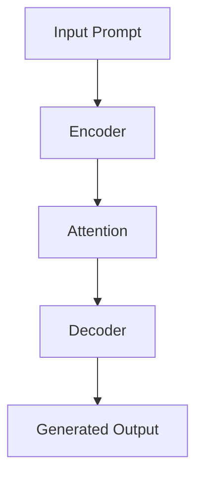

                 

# 提示词编程：AI时代软件开发的新范式

## 关键词
- 提示词编程
- AI时代
- 软件开发
- 机器学习
- 算法
- 模型
- 实践应用

## 摘要
本文将探讨提示词编程这一新兴的软件开发范式，在AI时代背景下的重要性和应用价值。我们将从提示词编程的基本概念入手，逐步深入分析其核心原理、模型架构、算法实现和数学模型，最终通过实际应用案例展示其强大功能和广泛前景。

## 引言
### 1.1 提示词编程的概念与起源
提示词编程（Prompt Programming）是一种利用预训练语言模型来辅助软件开发的新范式。与传统的命令式编程不同，提示词编程强调的是通过自然语言与模型进行交互，以实现软件功能的设计与开发。这种编程范式起源于人工智能领域，特别是在预训练语言模型技术取得突破性进展之后。

提示词编程的出现，标志着软件开发的转折点。传统的编程方法往往需要开发者手动编写大量的代码，而提示词编程则通过自然语言与预训练模型交互，大大简化了开发流程。开发者只需提供简单的提示词，模型就能生成相应的代码或执行特定的任务。

### 1.2 AI时代的背景与影响
我们正处于一个AI时代，人工智能正在各个领域掀起革命性的变革。从自动驾驶汽车到智能助手，从医疗诊断到金融分析，AI的应用场景越来越广泛。AI时代对软件开发提出了新的要求，不仅要求软件具备更高的智能性和适应性，还要求开发流程更加高效和灵活。

AI技术的快速发展，特别是深度学习和自然语言处理技术的突破，为提示词编程提供了坚实的技术基础。预训练语言模型如GPT、BERT等，通过大量的数据训练，已经具备了强大的语言理解和生成能力，使得提示词编程成为可能。

### 1.3 从传统编程到提示词编程的过渡
传统编程方法依赖于明确的指令和代码结构，而提示词编程则通过自然语言与模型交互，实现软件功能的自动化设计。这种过渡不仅改变了软件开发的方式，也改变了开发者与软件的关系。

传统编程强调开发者对代码的精确控制，而提示词编程则强调开发者对模型的理解和指导。开发者需要从代码编写者转变为模型引导者，通过设计合适的提示词，引导模型生成所需的代码或执行任务。

## 核心概念与原理
### 2.1 提示词的定义与分类
提示词（Prompt）是提示词编程的核心概念之一。它是指开发者提供的用于引导模型生成代码或执行任务的文字信息。提示词可以分为以下几种类型：

1. **功能提示**：用于指导模型实现特定功能，如“编写一个函数，用于计算两个数的和”。
2. **上下文提示**：提供背景信息，帮助模型更好地理解任务，如“在Python中编写一个函数，用于计算两个整数的和，并考虑输入范围”。
3. **代码片段提示**：提供部分代码，作为模型生成完整代码的起点，如“以下是一个计算两个整数和的Python函数的起始代码，请完成它”。

### 2.2 提示词编程的基本原理
提示词编程的基本原理是利用预训练语言模型来生成代码或执行任务。模型通过学习大量的文本数据，已经具备了强大的语言理解和生成能力。开发者只需提供简单的提示词，模型就能根据提示生成相应的代码或执行任务。

这个过程可以分为以下几个步骤：

1. **输入提示词**：开发者提供提示词，模型接收到提示词后开始工作。
2. **模型理解**：模型对提示词进行理解，识别出任务目标和相关背景信息。
3. **代码生成**：模型根据理解的结果生成相应的代码。
4. **代码执行**：生成的代码被执行，实现所需的功能。

### 2.3 提示词编程与机器学习的关系
提示词编程与机器学习紧密相关。预训练语言模型是通过机器学习技术训练得到的。这些模型通过学习大量的文本数据，已经具备了强大的语言理解和生成能力。提示词编程利用这些预训练模型，通过简单的提示词就能生成复杂的代码或执行任务。

机器学习在提示词编程中的应用主要体现在以下几个方面：

1. **预训练语言模型**：预训练语言模型是提示词编程的核心，通过大量的数据训练，模型已经具备了强大的语言理解能力。
2. **提示优化**：开发者可以通过调整提示词的表述，优化模型的生成结果。
3. **模型微调**：在特定任务中，可以对预训练模型进行微调，以进一步提高模型的性能。

## 提示词编程模型架构
### 3.1 提示词编程模型的基本架构
提示词编程模型通常由以下几个主要组件构成：

1. **预训练语言模型**：如GPT、BERT等，负责对输入的提示词进行理解。
2. **编码器（Encoder）**：将输入的文本编码为向量。
3. **解码器（Decoder）**：将编码后的向量解码为生成的文本或代码。
4. **注意力机制（Attention Mechanism）**：帮助模型更好地关注输入文本中的重要信息。
5. **损失函数（Loss Function）**：用于评估模型生成的文本或代码的质量。

### 3.2 提示词编程模型的Mermaid流程图
以下是一个简单的提示词编程模型的Mermaid流程图：



### 3.3 模型组件的详细解释
1. **预训练语言模型**：预训练语言模型是整个模型的基石。它通过学习大量的文本数据，已经具备了强大的语言理解能力。预训练语言模型通常由多层神经网络组成，如Transformer模型。
2. **编码器（Encoder）**：编码器负责将输入的文本编码为向量。这个过程通常涉及到词嵌入（Word Embedding）和编码器网络（Encoder Network）。词嵌入将每个单词映射为一个固定大小的向量，编码器网络则将这些向量组合成一个固定大小的向量。
3. **注意力机制（Attention Mechanism）**：注意力机制是一种机制，用于帮助模型更好地关注输入文本中的重要信息。它通过计算每个单词对生成的文本的贡献度，使得模型能够更好地理解输入文本。
4. **解码器（Decoder）**：解码器负责将编码后的向量解码为生成的文本或代码。解码器通常由多个解码器层组成，每个解码器层都会对输入的向量进行处理，并生成部分输出。最终的输出是解码器的最后一个层生成的文本或代码。
5. **损失函数（Loss Function）**：损失函数用于评估模型生成的文本或代码的质量。常用的损失函数包括交叉熵损失（Cross-Entropy Loss）和均方误差损失（Mean Squared Error Loss）。

## 核心算法与实现
### 4.1 核心算法介绍
提示词编程的核心算法主要包括预训练语言模型、编码器-解码器模型和生成模型等。这些算法通过学习大量的文本数据，能够生成高质量的文本或代码。

### 4.2 编码器-解码器模型
编码器-解码器模型（Encoder-Decoder Model）是一种常用的生成模型，特别适用于提示词编程。以下是一个简单的编码器-解码器模型的伪代码：

```python
# 编码器部分
def encoder(input_sequence):
    # 使用预训练语言模型对输入序列进行编码
    encoded_sequence = pre-trained_language_model(input_sequence)
    return encoded_sequence

# 解码器部分
def decoder(encoded_sequence):
    # 使用预训练语言模型对编码后的序列进行解码
    decoded_sequence = pre-trained_language_model(encoded_sequence, is_decoder=True)
    return decoded_sequence
```

### 4.3 生成模型
生成模型（Generative Model）是另一种核心算法，常用于生成高质量的文本或代码。以下是一个简单的生成模型的伪代码：

```python
# 生成模型部分
def generator(input_sequence, context):
    # 使用预训练语言模型生成文本或代码
    generated_sequence = pre-trained_language_model(input_sequence, context)
    return generated_sequence
```

## 数学模型与公式
### 5.1 数学模型的基本概念
提示词编程中的数学模型主要包括词嵌入、编码器网络、解码器网络和损失函数等。这些模型通过数学公式来描述和处理文本数据。

### 5.2 关键数学公式
以下是一些关键数学公式：

1. **词嵌入**：
   $$ \text{word\_embedding}(w) = \sigma(W \cdot w) $$
   其中，$w$ 是单词的one-hot编码，$W$ 是词嵌入矩阵，$\sigma$ 是sigmoid函数。

2. **编码器网络**：
   $$ \text{encoded\_sequence} = \text{Encoder}(\text{word\_embedding}(w_1), \text{word\_embedding}(w_2), ..., \text{word\_embedding}(w_n)) $$
   其中，$w_1, w_2, ..., w_n$ 是输入序列中的单词。

3. **解码器网络**：
   $$ \text{decoded\_sequence} = \text{Decoder}(\text{encoded\_sequence}) $$
   其中，$\text{encoded\_sequence}$ 是编码器生成的序列。

4. **损失函数**：
   $$ \text{loss} = \text{CrossEntropyLoss}(\text{decoded\_sequence}, \text{target\_sequence}) $$
   其中，$\text{decoded\_sequence}$ 是解码器生成的序列，$\text{target\_sequence}$ 是目标序列。

### 5.3 数学公式的详细解释
1. **词嵌入**：词嵌入是将单词映射为一个固定大小的向量。通过词嵌入，模型能够捕捉单词之间的相似性和相关性。
2. **编码器网络**：编码器网络将输入的词嵌入向量进行处理，生成编码后的序列。编码后的序列能够更好地表示输入序列的含义。
3. **解码器网络**：解码器网络将编码后的序列进行处理，生成解码后的序列。解码后的序列即为生成的文本或代码。
4. **损失函数**：损失函数用于评估模型生成的文本或代码的质量。交叉熵损失函数是一种常用的损失函数，用于衡量生成的序列与目标序列之间的差异。

## 实践应用
### 6.1 提示词编程的应用场景
提示词编程在多个领域都有广泛的应用，以下是一些典型应用场景：

1. **代码生成**：提示词编程能够自动生成代码，减少开发者的手动编写工作。例如，在软件开发中，通过提供功能提示和上下文信息，模型能够生成相应的函数和类。
2. **自然语言处理**：提示词编程能够生成高质量的文本，应用于自然语言处理任务，如文本摘要、机器翻译和文本生成等。
3. **数据科学**：提示词编程能够自动生成数据预处理脚本、机器学习模型的实现代码等，提高数据科学项目的开发效率。

### 6.2 实际应用案例
以下是一个实际应用案例，展示如何使用提示词编程自动生成Python代码：

**任务**：编写一个Python函数，用于计算两个数的和。

**提示词**：“编写一个Python函数，接收两个整数作为参数，并返回它们的和。”

**生成代码**：

```python
def add_two_numbers(num1, num2):
    return num1 + num2
```

**代码解读**：

- 函数定义：`def add_two_numbers(num1, num2):` 定义了一个名为`add_two_numbers`的函数，接收两个整数参数`num1`和`num2`。
- 返回值：`return num1 + num2` 返回两个参数的和。

通过简单的提示词，模型能够生成完整的函数代码，实现了计算两个数和的功能。

### 6.3 开发环境搭建与代码实现
要实现提示词编程，首先需要搭建开发环境。以下是搭建提示词编程开发环境的基本步骤：

1. 安装Python：下载并安装Python 3.8及以上版本。
2. 安装预训练语言模型：使用`transformers`库安装预训练语言模型，如GPT-2或BERT。
3. 安装依赖库：安装其他必要的依赖库，如TensorFlow或PyTorch。

以下是一个简单的提示词编程实现代码示例，使用PyTorch实现：

```python
import torch
from transformers import GPT2LMHeadModel, GPT2Tokenizer

# 1. 加载预训练语言模型和分词器
tokenizer = GPT2Tokenizer.from_pretrained('gpt2')
model = GPT2LMHeadModel.from_pretrained('gpt2')

# 2. 准备提示词
prompt = "编写一个Python函数，接收两个整数作为参数，并返回它们的和。"

# 3. 将提示词编码为Tensor
inputs = tokenizer.encode(prompt, return_tensors='pt')

# 4. 生成代码
outputs = model.generate(inputs, max_length=50, num_return_sequences=1)

# 5. 解码生成的代码
generated_text = tokenizer.decode(outputs[0], skip_special_tokens=True)

print(generated_text)
```

### 6.4 代码应用解读与分析
通过上述代码示例，我们可以看到如何使用提示词编程生成Python代码。以下是代码的解读与分析：

1. **加载预训练语言模型和分词器**：首先，我们加载了GPT-2预训练语言模型和相应的分词器。这些组件是提示词编程的核心。
2. **准备提示词**：我们将任务提示词“编写一个Python函数，接收两个整数作为参数，并返回它们的和。”编码为Tensor。
3. **生成代码**：使用`model.generate()`方法生成代码。我们设置`max_length`为50，表示生成的代码长度不超过50个单词，`num_return_sequences`为1，表示只生成一个结果。
4. **解码生成的代码**：将生成的Tensor解码为文本，得到生成的代码。

通过这个简单的示例，我们可以看到提示词编程的强大能力。只需提供简单的提示词，模型就能生成高质量的代码，大大简化了开发流程。

### 6.5 项目小结
本部分通过一个实际应用案例，展示了如何使用提示词编程自动生成Python代码。项目分为以下几个步骤：

1. 搭建开发环境
2. 加载预训练语言模型和分词器
3. 准备提示词并编码
4. 使用模型生成代码
5. 解码生成的代码

通过这个项目，我们不仅了解了提示词编程的基本原理和实现方法，还实际体验了其在代码生成中的应用。提示词编程在提高开发效率、简化开发流程方面具有显著优势，是未来软件开发的重要方向。

## 最佳实践与注意事项
### 7.1 最佳实践
1. **优化提示词**：合理的提示词能够提高模型的生成质量。在编写提示词时，应尽量明确任务目标，提供足够的背景信息，并避免歧义。
2. **模型微调**：在特定任务中，可以对预训练模型进行微调，以提高模型在特定领域的性能。微调过程通常涉及重新训练模型的一部分参数，以适应新任务。
3. **数据准备**：高质量的数据是训练有效模型的基石。在选择数据集时，应确保数据的质量和多样性，以避免模型过拟合。

### 7.2 注意事项
1. **模型复杂度**：预训练语言模型通常具有很高的复杂度，训练和推理过程可能需要大量计算资源。在部署模型时，应考虑硬件设备和计算资源的限制。
2. **数据隐私**：在使用提示词编程时，应确保数据的安全和隐私。避免在训练或推理过程中泄露敏感信息。

## 拓展阅读
- **《深度学习》**：Goodfellow, I., Bengio, Y., & Courville, A. (2016). 《深度学习》（Deep Learning）。
- **《自然语言处理综述》**：Lopyrev, K., & Hovy, E. (2019). 《自然语言处理综述》（A Brief History of NLP: From Humie to Transformer）。
- **《机器学习实战》**：Russell, S., & Norvig, P. (2016). 《机器学习实战》（Machine Learning: A Probabilistic Perspective）。

## 结论
### 8.1 提示词编程的重要性
提示词编程是一种革命性的软件开发范式，它在AI时代具有重要意义。通过提示词编程，开发者能够更高效地完成软件开发任务，实现代码的自动化生成。这种编程范式不仅简化了开发流程，还提高了软件开发的灵活性和智能性。

### 8.2 未来发展方向
随着AI技术的不断发展，提示词编程有望在更多领域得到应用。未来，我们可以期待以下发展方向：

1. **更高效的模型**：研究更高效的预训练语言模型，以减少计算资源和时间成本。
2. **跨模态交互**：探索跨模态交互技术，使得提示词编程能够处理更丰富的输入信息，如图像、音频等。
3. **自动化调试**：结合自动化调试技术，提高提示词编程的可靠性和稳定性。

### 8.3 结论
提示词编程是AI时代软件开发的重要趋势。它通过自然语言与预训练语言模型交互，实现了代码的自动化生成。未来，随着AI技术的不断发展，提示词编程有望在更多领域发挥重要作用。

### 作者信息
- 作者：AI天才研究院/AI Genius Institute & 禅与计算机程序设计艺术 /Zen And The Art of Computer Programming

