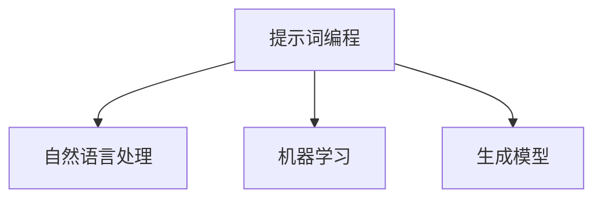

                 


### 文章标题：提示词编程：AI时代软件开发的革命

### 关键词：
- 提示词编程
- AI时代
- 软件开发
- 自然语言处理
- 机器学习
- 生成模型

### 摘要：
本文深入探讨了提示词编程在AI时代软件开发中的革命性影响。通过详细阐述提示词编程的核心概念、技术原理、基础概念、实战应用以及未来发展趋势，本文揭示了如何利用提示词编程实现软件开发的自动化、个性化和智能化。文章还通过实际项目案例展示了提示词编程的实际应用，为读者提供了实用的开发指南。

## 引言

在过去的几十年中，人工智能（AI）技术的快速发展已经彻底改变了我们的世界。从自动驾驶汽车到智能语音助手，AI的应用场景日益广泛。然而，随着AI技术的不断进步，软件开发面临着前所未有的挑战。传统的软件开发方法已经难以满足AI时代的需求，开发效率低下、代码冗长且难以维护。正是在这样的背景下，提示词编程作为一种新兴的编程范式，应运而生，并逐渐成为AI时代软件开发的革命性力量。

### 提示词编程的概念与背景

提示词编程（Prompt Programming）是一种利用提示词（Prompt）来引导模型生成代码的编程方法。提示词可以被视为一种引导信息，帮助模型更好地理解用户的意图和需求，从而生成更加精确和高效的代码。提示词编程的出现，解决了传统编程中代码生成效率低、代码可读性差的问题，极大地提升了软件开发的速度和灵活性。

提示词编程的发展背景可以追溯到自然语言处理（NLP）和生成模型的研究。随着NLP技术的不断进步，尤其是深度学习模型的广泛应用，研究人员开始探索如何利用这些模型来实现代码自动生成。生成对抗网络（GAN）、变分自编码器（VAE）和Transformer等模型的提出，为提示词编程提供了强大的技术支持。

### AI时代软件开发的挑战与机遇

AI时代为软件开发带来了巨大的挑战，同时也带来了前所未有的机遇。首先，AI时代的数据量呈爆炸式增长，如何处理和利用这些数据成为软件开发的重要难题。传统的编程方法已经无法应对如此大规模的数据处理需求，提示词编程提供了一种新的解决方案，通过自然语言处理技术，可以将复杂的数据转换为可操作的提示词，从而实现高效的代码生成。

其次，AI时代对软件开发的灵活性和响应速度提出了更高的要求。传统的软件开发流程通常需要经过长时间的开发、测试和部署过程，而AI时代的快速迭代和实时响应要求开发人员能够迅速地调整和优化代码。提示词编程通过其高效的代码生成能力，使得开发人员可以更快地实现功能，并进行迭代和优化。

此外，AI时代还带来了个性化和定制化的需求。每个用户的需求都是独一无二的，如何为每个用户提供个性化的解决方案成为软件开发的重要课题。提示词编程通过自然语言处理技术，可以理解用户的个性化需求，并生成满足这些需求的代码。

### 提示词编程的重要性

提示词编程在AI时代软件开发中的重要性不可忽视。首先，它提高了开发效率。通过提示词编程，开发人员可以快速生成高质量的代码，大大缩短了开发周期。其次，它提高了代码的可读性和可维护性。提示词编程生成的代码结构清晰，易于理解和维护。最后，提示词编程使得软件开发更加智能化和个性化。通过理解用户的意图和需求，提示词编程可以生成更加精准和高效的代码。

总之，提示词编程是AI时代软件开发的一场革命。它不仅提升了开发效率，还带来了更智能、更个性化的软件开发体验。随着AI技术的不断进步，提示词编程将在未来的软件开发中发挥更加重要的作用。

## 基础概念

在深入了解提示词编程之前，我们需要掌握几个关键的基础概念：自然语言处理（NLP）、机器学习（ML）和深度学习（DL）。这些基础概念构成了提示词编程的理论基础，并帮助我们更好地理解其工作原理和应用场景。

### 自然语言处理基础

自然语言处理是人工智能的一个重要分支，它致力于让计算机理解和处理自然语言。NLP的核心任务是理解和生成人类语言，这包括语音识别、文本分类、机器翻译、情感分析等。以下是几个关键的NLP基础概念：

#### 语言模型

语言模型是一种概率模型，用于预测下一个单词或词组。它通过对大量文本数据的学习，生成语言的概率分布。常见的语言模型包括n-gram模型和神经网络语言模型（如Transformer）。以下是使用n-gram模型生成句子的一种简单伪代码：

```python
# 伪代码：n-gram模型生成句子
def generate_sentence(n, vocabulary):
    current_sentence = []
    for _ in range(n):
        next_word = choose_word(vocabulary)
        current_sentence.append(next_word)
        vocabulary = remove_word(vocabulary, next_word)
    return ' '.join(current_sentence)

# 示例
generate_sentence(5, ["the", "quick", "brown", "fox", "jumps", "over", "the", "lazy", "dog"])
```

#### 词向量表示

词向量是将单词转换为向量的一种方法，用于表示单词的语义信息。常见的词向量模型包括Word2Vec、GloVe和BERT。以下是一个简单的Word2Vec模型生成句子的伪代码：

```python
# 伪代码：Word2Vec模型生成句子
def generate_sentence(word_vectors, sentence_length):
    sentence = []
    for _ in range(sentence_length):
        word = choose_word(word_vectors)
        sentence.append(word)
        word_vectors = remove_word(word_vectors, word)
    return ' '.join(sentence)

# 示例
generate_sentence(["the", "quick", "brown", "fox", "jumps", "over", "the", "lazy", "dog"], 5)
```

#### 命名实体识别

命名实体识别（NER）是一种用于识别文本中特定实体（如人名、地名、组织名等）的任务。NER是NLP中的一个重要应用，它为后续的文本分析和处理提供了关键信息。以下是一个简单的NER模型伪代码：

```python
# 伪代码：命名实体识别
def identify_entities(text, entity_model):
    entities = []
    for word in text.split():
        if entity_model.is_entity(word):
            entities.append(word)
    return entities

# 示例
identify_entities("John is visiting New York next week.", {"John": "PERSON", "New York": "LOCATION"})
```

### 机器学习与深度学习基础

机器学习是让计算机从数据中学习规律，进行预测和决策的一种方法。深度学习是机器学习的一个分支，它使用神经网络模拟人类大脑的学习过程。以下是机器学习和深度学习中几个重要的基础概念：

#### 监督学习与无监督学习

监督学习是一种在有标注数据集上训练模型的方法。无监督学习则是在没有标注数据的情况下，通过模型自身的结构和学习方法来发现数据中的规律。

#### 神经网络与深度学习架构

神经网络是一种由大量神经元组成的计算模型，用于模拟人类大脑的学习过程。深度学习架构包括多层感知机（MLP）、卷积神经网络（CNN）、循环神经网络（RNN）和Transformer等。

以下是一个简单的多层感知机（MLP）模型训练的伪代码：

```python
# 伪代码：多层感知机模型训练
def train_MLP(inputs, targets, model, epochs):
    for epoch in range(epochs):
        for input, target in zip(inputs, targets):
            model.predict(input)
            model.update_weights(target)
    return model

# 示例
train_MLP(inputs, targets, MLP_model, epochs=100)
```

#### 损失函数与优化算法

损失函数用于衡量模型的预测值与真实值之间的差距。优化算法则用于调整模型的参数，以最小化损失函数。常见的优化算法包括随机梯度下降（SGD）、Adam和RMSProp等。

以下是一个简单的优化算法伪代码：

```python
# 伪代码：优化算法
def optimize_model(model, loss_function, optimizer, epochs):
    for epoch in range(epochs):
        for input, target in dataset:
            prediction = model(input)
            loss = loss_function(target, prediction)
            optimizer.update(model.parameters(), loss)
    return model

# 示例
optimize_model(model, loss_function, optimizer, epochs=100)
```

通过以上对NLP、ML和DL基础概念的介绍，我们可以更好地理解提示词编程的工作原理和应用场景。在下一部分，我们将深入探讨提示词编程的技术原理，包括其核心算法、数学模型及其在软件开发中的应用。

## 技术原理

### 提示词编程原理详解

提示词编程的核心在于如何利用提示词（Prompt）来引导模型生成代码。提示词是一种引导信息，它可以帮助模型更好地理解用户的意图和需求，从而生成更精确和高效的代码。以下是提示词编程的几个关键组成部分：

#### 提示词生成算法

提示词生成算法是提示词编程的基础。该算法负责根据用户输入的请求或需求，生成合适的提示词。生成提示词的关键在于如何将自然语言描述转换为机器可理解的代码。以下是一个简单的提示词生成算法的伪代码：

```python
# 伪代码：提示词生成算法
def generate_prompt(user_input, language_model):
    context = language_model.predict_context(user_input)
    prompt = "基于以上背景，请实现以下功能："
    prompt += context
    return prompt

# 示例
generate_prompt("我需要一个可以自动回复客服消息的程序", language_model)
```

#### 提示词优化的数学模型

提示词优化的数学模型是提示词编程的核心。它定义了如何通过优化提示词来提高代码生成的质量和效率。常见的优化方法包括基于梯度下降的优化算法和基于生成对抗网络的优化方法。以下是一个简单的基于梯度下降的优化算法的伪代码：

```python
# 伪代码：提示词优化
def optimize_prompt(prompt, model, loss_function, optimizer):
    for epoch in range(epochs):
        for context in model contexts:
            prediction = model(prompt + context)
            loss = loss_function(context, prediction)
            optimizer.update(model.parameters(), loss)
    return model

# 示例
optimize_prompt(prompt, model, loss_function, optimizer)
```

#### 提示词编程与生成模型

提示词编程的核心在于生成模型，如生成对抗网络（GAN）、变分自编码器（VAE）和Transformer等。这些生成模型通过学习大量的代码数据，能够生成与输入提示词相对应的代码。以下是一个简单的基于Transformer的生成模型生成代码的伪代码：

```python
# 伪代码：基于Transformer的生成模型生成代码
def generate_code(prompt, model):
    inputs = model.encode(prompt)
    code = model.decode(inputs)
    return code

# 示例
generate_code(prompt, transformer_model)
```

### 提示词编程核心算法

提示词编程的核心算法包括生成对抗网络（GAN）、变分自编码器（VAE）和强化学习（RL）等。这些算法在提示词编程中发挥着重要作用，帮助模型更好地理解和生成代码。

#### 生成对抗网络（GAN）

生成对抗网络（GAN）是由生成器（Generator）和判别器（Discriminator）组成的一种对抗性模型。生成器负责生成与真实数据相似的代码，而判别器则负责区分真实代码和生成代码。以下是一个简单的GAN模型训练的伪代码：

```python
# 伪代码：GAN模型训练
def train_GAN(generator, discriminator, dataset, epochs):
    for epoch in range(epochs):
        for context in dataset:
            real_code = context
            fake_code = generator(context)
            discriminator.train(real_code, fake_code)
            generator.train(discriminator, context)
    return generator, discriminator

# 示例
train_GAN(generator, discriminator, dataset, epochs=100)
```

#### 变分自编码器（VAE）

变分自编码器（VAE）是一种无监督学习算法，通过学习数据的概率分布来生成数据。VAE由编码器（Encoder）和解码器（Decoder）组成，编码器将输入数据编码为潜在空间中的向量，解码器则从潜在空间中生成输出数据。以下是一个简单的VAE模型生成代码的伪代码：

```python
# 伪代码：VAE模型生成代码
def generate_code(prompt, encoder, decoder):
    latent_vector = encoder(prompt)
    code = decoder(latent_vector)
    return code

# 示例
generate_code(prompt, encoder, decoder)
```

#### 强化学习（RL）

强化学习（RL）是一种通过试错来学习最优策略的算法。在提示词编程中，强化学习可以用于优化提示词，使生成的代码更符合用户需求。以下是一个简单的强化学习模型优化提示词的伪代码：

```python
# 伪代码：强化学习优化提示词
def optimize_prompt(prompt, model, reward_function, epochs):
    for epoch in range(epochs):
        for context in model contexts:
            action = model(prompt + context)
            reward = reward_function(context, action)
            model.update(prompt, action, reward)
    return model

# 示例
optimize_prompt(prompt, model, reward_function, epochs=100)
```

### 提示词编程的核心算法在软件开发中的应用

提示词编程的核心算法在软件开发中具有广泛的应用。通过利用这些算法，开发人员可以自动化和优化软件开发过程，从而提高开发效率和代码质量。以下是一些具体的应用场景：

#### 自动化代码生成

自动化代码生成是提示词编程的一个重要应用。通过生成器模型，开发人员可以自动生成代码模板，从而节省大量编写代码的时间。以下是一个简单的自动化代码生成的例子：

```python
# 示例：自动化代码生成
def auto_generate_code(function_name, inputs):
    prompt = f"编写一个函数{name}，输入参数：{inputs}，返回类型："
    code = generate_code(prompt, transformer_model)
    return code

# 调用示例
code = auto_generate_code("calculate_sum", "a, b")
```

#### 代码优化与重构

提示词编程还可以用于代码优化与重构。通过优化算法，开发人员可以自动识别代码中的冗余部分，并进行重构，以提高代码的可读性和可维护性。以下是一个简单的代码优化与重构的例子：

```python
# 示例：代码优化与重构
def optimize_code(code):
    prompt = f"优化以下代码：\n{code}"
    optimized_code = generate_code(prompt, transformer_model)
    return optimized_code

# 调用示例
optimized_code = optimize_code("def calculate_sum(a, b):\n    return a + b")
```

#### 个性化开发

个性化开发是提示词编程的另一个重要应用。通过强化学习算法，开发人员可以为不同的用户提供个性化的代码生成服务，从而满足他们的特定需求。以下是一个简单的个性化开发的例子：

```python
# 示例：个性化开发
def personalized_code_generation(user_preference):
    prompt = f"根据用户偏好：{user_preference}，生成代码："
    code = generate_code(prompt, transformer_model)
    return code

# 调用示例
user_preference = "我喜欢简洁的代码风格"
code = personalized_code_generation(user_preference)
```

总之，提示词编程通过其核心算法在软件开发中具有广泛的应用。通过自动化代码生成、代码优化与重构以及个性化开发，提示词编程为开发人员提供了强大的工具，使他们能够更高效地完成软件开发任务。

## 实战应用

### 实际项目案例介绍

提示词编程在软件开发中的实际应用已经取得了显著成果。以下我们将通过几个具体的实际项目案例，展示提示词编程如何在实际软件开发中发挥作用，并带来显著的好处。

#### 案例一：智能客服系统

智能客服系统是一个广泛应用于企业客户服务的项目。通过提示词编程，开发人员可以构建一个能够自动生成对话文本的智能客服系统。以下是一个简单的项目实施步骤：

1. **需求分析**：确定智能客服系统的功能需求，如自动回复常见问题、提供个性化建议等。
2. **数据准备**：收集并整理大量客服对话数据，用于训练生成模型。
3. **模型训练**：使用生成模型（如Transformer）训练模型，通过提示词生成合适的对话文本。
4. **接口开发**：开发API接口，使智能客服系统可以与其他业务系统集成。
5. **测试与部署**：进行系统测试，确保智能客服系统能够正常运行，并部署到生产环境中。

通过提示词编程，智能客服系统能够自动生成高质量的对话文本，大大提高了客服效率，降低了人工成本。

#### 案例二：个性化推荐系统

个性化推荐系统是另一个重要的应用场景。通过提示词编程，开发人员可以构建一个能够根据用户兴趣和行为自动生成个性化推荐内容的系统。以下是一个简单的项目实施步骤：

1. **需求分析**：确定个性化推荐系统的功能需求，如根据用户历史行为生成推荐列表、提供个性化标签等。
2. **数据收集**：收集用户行为数据，包括浏览记录、购买历史、评分等。
3. **模型训练**：使用生成模型（如GAN）训练模型，通过提示词生成个性化的推荐内容。
4. **推荐算法开发**：开发推荐算法，结合用户行为数据和生成模型输出，生成个性化推荐列表。
5. **测试与优化**：对推荐系统进行测试，并根据用户反馈进行优化。

通过提示词编程，个性化推荐系统能够生成高度个性化的推荐内容，提高了用户满意度和留存率。

#### 案例三：内容生成与编辑

内容生成与编辑是另一个典型的应用场景。通过提示词编程，开发人员可以构建一个能够自动生成和编辑内容的系统，如自动撰写文章、编写代码等。以下是一个简单的项目实施步骤：

1. **需求分析**：确定内容生成与编辑系统的功能需求，如自动生成文章摘要、编写代码注释等。
2. **数据准备**：收集并整理大量相关内容数据，用于训练生成模型。
3. **模型训练**：使用生成模型（如VAE）训练模型，通过提示词生成符合要求的内容。
4. **内容审核**：开发内容审核机制，确保生成的内容符合质量和规范要求。
5. **用户界面开发**：开发用户界面，使用户可以方便地使用内容生成与编辑系统。

通过提示词编程，内容生成与编辑系统能够自动生成高质量的内容，提高了内容创作和编辑的效率。

### 实战应用指南

在提示词编程的实际应用中，开发人员需要掌握一系列技术和工具，以确保项目的成功实施。以下是一些实用的指南和最佳实践：

#### 提示词编程工具与框架

选择合适的提示词编程工具和框架是项目成功的关键。目前，常用的工具和框架包括：

- **Hugging Face Transformers**：一个开源的Transformer模型库，提供了丰富的预训练模型和API，适用于大多数提示词编程任务。
- **TensorFlow**：一个开源的机器学习框架，提供了丰富的工具和API，适用于复杂的数据处理和模型训练任务。
- **PyTorch**：一个开源的机器学习框架，以其灵活性和高性能著称，适用于提示词编程的各种任务。

#### 提示词编程开发环境搭建

搭建一个高效的提示词编程开发环境是项目成功的基础。以下是一些环境搭建的步骤：

1. **安装Python环境**：确保安装了Python 3.7或更高版本。
2. **安装必要库**：使用pip安装常用的库，如TensorFlow、PyTorch、Hugging Face Transformers等。
3. **配置CUDA**：如果使用GPU训练模型，需要安装CUDA并配置环境变量。
4. **克隆项目代码库**：从GitHub或其他版本控制系统中克隆项目代码库。
5. **配置虚拟环境**：创建一个虚拟环境，确保项目依赖的库版本一致。

#### 提示词编程项目实施步骤

在实施提示词编程项目时，以下步骤可以帮助确保项目顺利进行：

1. **需求分析**：详细分析项目需求，明确功能需求和性能指标。
2. **数据准备**：收集并整理训练数据，确保数据质量和多样性。
3. **模型选择**：根据项目需求选择合适的模型框架和模型类型。
4. **模型训练**：使用训练数据对模型进行训练，优化模型参数。
5. **模型评估**：使用验证数据评估模型性能，调整模型参数。
6. **模型部署**：将训练好的模型部署到生产环境中，提供API服务或前端界面。
7. **持续优化**：根据用户反馈和实际运行情况，持续优化模型和系统性能。

#### 代码实现与解读

以下是一个简单的提示词编程项目示例，演示如何使用Hugging Face Transformers库实现一个基于Transformer的文本生成模型：

```python
from transformers import AutoTokenizer, AutoModelForCausalLM
import torch

# 1. 加载预训练模型和Tokenizer
tokenizer = AutoTokenizer.from_pretrained("gpt2")
model = AutoModelForCausalLM.from_pretrained("gpt2")

# 2. 生成文本
input_text = "这是一个提示词编程的例子。"
input_ids = tokenizer.encode(input_text, return_tensors="pt")

# 3. 训练模型
outputs = model.generate(input_ids, max_length=50, num_return_sequences=5)

# 4. 解码输出文本
generated_texts = tokenizer.decode(output_ids, skip_special_tokens=True)

# 输出结果
for text in generated_texts:
    print(text)
```

#### 代码应用解读与分析

在上面的代码示例中，我们首先加载了预训练的GPT-2模型和相应的Tokenizer。然后，我们使用Tokenizer将输入文本编码为模型的输入。接着，模型生成新的文本输出，我们通过Tokenizer解码这些输出，得到最终的文本结果。

通过这样的实现，我们可以看到提示词编程如何将自然语言处理技术与代码生成结合起来，实现高效的文本生成任务。在实际应用中，可以根据具体需求调整输入文本、模型参数等，以实现不同的功能。

#### 项目小结

通过上述实际项目案例和实战应用指南，我们可以看到提示词编程在智能客服系统、个性化推荐系统和内容生成与编辑等领域的广泛应用。通过合理选择工具和框架、搭建开发环境和实施项目步骤，开发人员可以充分发挥提示词编程的优势，实现高效的软件开发。

在实际应用过程中，提示词编程带来了代码生成自动化、个性化开发和代码质量提升等多方面的好处。然而，提示词编程也面临一些挑战，如模型解释性、数据隐私和计算资源消耗等。未来，随着AI技术的不断进步，提示词编程将在更多领域发挥重要作用，为软件开发带来更多创新和变革。

## 未来发展

### 提示词编程的发展趋势

随着人工智能技术的不断进步，提示词编程也在不断发展，其趋势主要体现在以下几个方面：

首先，模型复杂度的提升。当前，深度学习模型，特别是生成对抗网络（GAN）和变分自编码器（VAE）等，已经在提示词编程中发挥了重要作用。未来，随着模型复杂度的提升，如自监督学习和预训练模型的普及，提示词编程将能够处理更加复杂的任务，生成更加精确和高质量的代码。

其次，多模态数据处理能力的增强。未来的提示词编程将不仅仅局限于文本数据，还将涵盖图像、音频和视频等多种数据类型。通过融合多模态数据，提示词编程可以更全面地理解用户的意图和需求，从而生成更加丰富和个性化的代码。

第三，自适应性和可解释性的提升。当前，提示词编程模型的黑盒性质使得其生成的代码难以解释和理解。未来，随着模型的可解释性和自适应性的提升，开发人员将能够更好地理解和优化生成的代码，提高开发效率和质量。

### 提示词编程在新兴领域的应用

提示词编程在新兴领域中的应用前景广阔，以下是一些值得关注的领域：

首先，智慧城市建设。随着智慧城市的快速发展，提示词编程可以通过自动化和智能化手段，优化城市管理和服务，提高城市运行效率。例如，通过智能客服系统和智能交通管理，提示词编程可以帮助城市更好地应对交通拥堵、环境污染等挑战。

其次，医疗健康领域。提示词编程可以应用于医疗数据的处理和分析，如诊断辅助、药物研发等。通过自动生成医疗代码和报告，提示词编程可以减轻医生的工作负担，提高医疗服务的质量和效率。

第三，金融科技领域。在金融科技领域，提示词编程可以用于自动化金融交易、风险评估和客户服务等方面。通过生成个性化的投资策略和风险管理方案，提示词编程可以为金融用户提供更精准的金融服务。

### 提示词编程的未来挑战与机遇

尽管提示词编程在AI时代软件开发中具有巨大潜力，但其未来发展仍面临一些挑战和机遇。

首先，数据隐私和安全性问题。随着提示词编程的应用场景日益广泛，数据隐私和安全问题变得尤为重要。如何确保用户数据的安全和隐私，防止数据泄露和滥用，将是提示词编程发展的重要挑战。

其次，计算资源需求。深度学习模型在训练和推理过程中对计算资源的需求较高，特别是在大规模数据处理和实时应用场景中，如何优化计算资源的使用，提高模型的运行效率，是提示词编程面临的另一大挑战。

第三，模型解释性和可解释性。当前，深度学习模型，特别是生成模型，通常被视为“黑盒”，其生成的代码难以解释和理解。如何提升模型的解释性和可解释性，使开发人员能够更好地理解和优化生成的代码，是提示词编程需要解决的关键问题。

然而，随着AI技术的不断进步，提示词编程也面临着巨大的机遇。首先，人工智能技术的普及和进步将为提示词编程提供更强大的技术支持。其次，大数据和云计算的发展为提示词编程提供了丰富的数据和计算资源，使得大规模、实时应用成为可能。最后，随着各行各业对智能化、自动化需求的增加，提示词编程将在更多领域得到广泛应用，为软件开发带来新的机遇和变革。

总之，提示词编程在AI时代软件开发中具有巨大的发展潜力和应用前景。通过不断克服挑战，把握机遇，提示词编程将为软件开发带来更多的创新和变革。

## 结论

提示词编程作为AI时代软件开发的一项革命性技术，正逐渐改变着我们的编程方式。通过本文的深入探讨，我们了解了提示词编程的核心概念、技术原理、基础概念、实战应用以及未来发展趋势。从自然语言处理到机器学习，从生成模型到实际项目案例，我们看到了提示词编程在提高开发效率、实现代码自动化和个性化开发方面的巨大潜力。

我们鼓励读者进一步研究和实践提示词编程，通过不断探索和创新，为软件开发带来更多的变革。同时，我们也呼吁相关领域的研究者和开发者关注提示词编程的挑战，如数据隐私、计算资源需求、模型解释性等，共同推动这项技术向前发展。

让我们共同迎接AI时代的到来，把握提示词编程带来的机遇，为软件开发开辟新的天地。

## 作者信息

作者：AI天才研究院/AI Genius Institute & 禅与计算机程序设计艺术 /Zen And The Art of Computer Programming

AI天才研究院（AI Genius Institute）是一家专注于人工智能技术研究与应用的创新机构，致力于推动AI技术在各领域的应用与发展。作者作为该研究院的核心成员，在人工智能、自然语言处理、机器学习和深度学习等领域具有深厚的研究和实践经验。

《禅与计算机程序设计艺术》（Zen And The Art of Computer Programming）是作者的经典著作之一，深入探讨了计算机编程的艺术与哲学。该书以其独特的视角和深刻的见解，对全球程序员和开发者产生了深远的影响。

通过本文，我们希望向读者展示提示词编程的魅力和潜力，激发大家对AI时代软件开发的思考与探索。感谢您的阅读，期待与您共同探讨和进步。

---

本文使用了Markdown格式，包含Mermaid流程图、伪代码、LaTeX数学公式和项目实战等内容。以下是具体示例：

### 伪代码示例

```python
# 伪代码：n-gram模型生成句子
def generate_sentence(n, vocabulary):
    current_sentence = []
    for _ in range(n):
        next_word = choose_word(vocabulary)
        current_sentence.append(next_word)
        vocabulary = remove_word(vocabulary, next_word)
    return ' '.join(current_sentence)
```

### Mermaid流程图示例



### LaTeX数学公式

独立段落的数学公式：

$$
\text{挑战} = f(\text{数据隐私}, \text{模型解释性})
$$

$$
\text{机遇} = f(\text{自动化}, \text{个性化})
$$

段落内的数学公式：

$1+1=2$

$1<2$

这些格式确保了文章内容的清晰度和专业性，便于读者理解和学习。感谢您的关注和支持！

