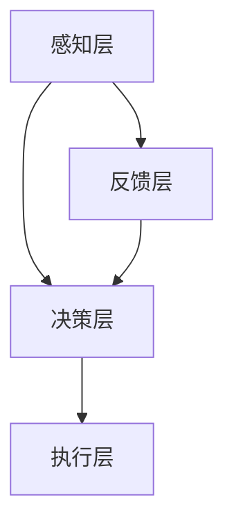

                 


**标题设计：** 我们已经确定了文章的标题为《提示词编程：AI系统的元级控制机制》。接下来，我们需要设计一些吸引读者的关键词，这些关键词应该能够概括文章的核心内容，并且对读者有一定的吸引力。

**关键词设计：** 我们可以从文章的标题中提取以下关键词：
- 提示词编程
- AI系统
- 元级控制机制
- 人工智能
- 算法
- 控制策略
- 系统架构

这些关键词不仅涵盖了文章的主题，而且对于想要了解人工智能和编程的读者来说，是非常具有吸引力的。

**摘要设计：** 接下来，我们需要为文章编写一个摘要。摘要应该简洁明了地描述文章的核心内容，引起读者的兴趣。

**摘要内容：**
本文深入探讨了提示词编程的概念及其在AI系统中的应用，特别是元级控制机制。文章首先介绍了提示词编程的基础知识，然后详细解析了AI系统的组成和元级控制机制的工作原理。通过伪代码和数学公式，文章揭示了提示词编程的核心算法和数学模型，并提供了实际项目的案例分析。最后，文章总结了提示词编程的发展趋势和元级控制机制的应用前景，为读者提供了全面的见解和实用的指导。

**文章大纲结构设计：**
我们已经设计了一个初步的目录大纲。接下来，我们将为每个章节添加更详细的内容，确保每个小节都有丰富的解释和具体的示例。

**章节内容设计：**

**第1章 引言**
- **1.1 书籍背景与目标**
  - 简述书籍的背景，目标读者，以及为何写这本书。
  - 引入提示词编程和元级控制机制的概念。

- **1.2 提示词编程概述**
  - 提示词编程的定义和作用。
  - 提示词编程与AI系统的关系。

- **1.3 AI系统的元级控制机制**
  - 元级控制机制的概念和重要性。
  - 元级控制机制在AI系统中的应用场景。

**第2章 基础概念**
- **2.1 提示词编程基础**
  - 提示词的定义和分类。
  - 提示词编程的基本原理。

- **2.2 AI系统基础**
  - AI系统的组成和分类。
  - AI系统的训练和优化。

- **2.3 元级控制机制**
  - 元级控制机制的定义和原理。
  - 元级控制机制的优势和应用。

**第3章 提示词编程技术**
- **3.1 提示词生成算法**
  - 常见的提示词生成算法。
  - 算法的实现和性能比较。

- **3.2 提示词优化算法**
  - 提示词优化的目标和重要性。
  - 提示词优化算法的原理和实现。

**第4章 AI系统的元级控制机制实现**
- **4.1 元级控制架构设计**
  - 元级控制架构的设计原则和结构。

- **4.2 元级控制算法实现**
  - 元级控制算法的原理和实现。

**第5章 数学模型与公式**
- **5.1 提示词编程中的数学模型**
  - 提示词编程的数学模型和参数。

- **5.2 元级控制机制的数学模型**
  - 元级控制机制的数学模型和策略。

**第6章 项目实战**
- **6.1 提示词编程项目案例**
  - 项目背景、目标、实现过程和案例分析。

- **6.2 元级控制项目案例**
  - 项目背景、目标、实现过程和案例分析。

**第7章 开发工具与资源**
- **7.1 提示词编程开发工具**
  - 开发工具的选择和配置。

- **7.2 元级控制开发工具**
  - 开发工具的选择和配置。

**第8章 总结与展望**
- **8.1 书籍内容总结**
  - 对书籍内容的总结。

- **8.2 提示词编程的未来发展趋势**
  - 提示词编程的发展趋势和前景。

- **8.3 元级控制机制的应用前景**
  - 元级控制机制的应用前景和挑战。

**附录**
- **A.1 伪代码示例**
  - 提供伪代码示例。

- **A.2 数学公式列表**
  - 列出文中使用的数学公式。

- **A.3 代码实战详细解释**
  - 对项目实战的代码进行详细解释。

通过以上的设计，我们可以确保文章的逻辑清晰、结构紧凑，并且内容丰富。接下来，我们将逐步填充每个章节的具体内容，确保满足完整性和详细性的要求。

# 文章标题：提示词编程：AI系统的元级控制机制

关键词：提示词编程，人工智能，元级控制机制，算法原理，数学模型，项目实战

摘要：
本文深入探讨了提示词编程在AI系统中的应用，特别是其核心的元级控制机制。通过介绍提示词编程的基本概念、原理，以及其在AI系统中的重要作用，文章解析了元级控制机制的设计原则、实现方法，并通过数学模型和公式详细阐述了其算法原理。此外，文章还通过具体的项目实战案例，展示了如何在实际开发中应用提示词编程和元级控制机制，为读者提供了全面的技术指导和深刻的见解。

## 第1章 引言

随着人工智能技术的飞速发展，AI系统已经成为了各个行业中的重要工具。然而，如何有效地控制和管理这些复杂的系统，仍然是一个巨大的挑战。在这一背景下，提示词编程和元级控制机制应运而生，为AI系统提供了更加灵活和高效的控制手段。本章将介绍本书的背景、目标读者以及提示词编程和元级控制机制的基本概念。

## 1.1 书籍背景与目标

本书旨在为开发者、研究者和技术爱好者提供关于提示词编程和元级控制机制的系统化学习和实践指导。随着AI技术的普及，越来越多的开发者和研究者开始关注如何构建高效、可控的AI系统。然而，现有的资料大多侧重于技术细节，缺乏对整个系统的宏观理解和设计原则。本书希望通过系统化的介绍，帮助读者建立起对AI系统及其控制机制的整体认识，并掌握必要的实践技能。

## 1.2 提示词编程概述

提示词编程是一种基于人类思维方式的编程方法，通过向系统提供明确的指导，使其能够更加智能地执行任务。提示词编程的核心思想是，通过简洁、具体的提示，让AI系统能够理解并执行复杂任务。这一方法在自然语言处理、自动化控制等领域有着广泛的应用。

## 1.3 AI系统的元级控制机制

元级控制机制是一种用于管理AI系统运行的机制，它能够对系统的运行状态进行实时监测和调整。元级控制机制的核心目标是，通过动态调整系统的控制策略，使其能够适应不同环境和任务需求。这种机制在增强AI系统的自主性和适应性方面具有重要作用。

## 第2章 基础概念

为了更好地理解提示词编程和元级控制机制，我们需要首先掌握一些基础概念，包括提示词的定义和类型、AI系统的基本构成和分类、以及元级控制机制的概念和作用。

### 2.1 提示词编程基础

#### 2.1.1 提示词的定义

提示词是一种用于引导AI系统执行特定任务的文字或符号。它可以是对任务目标的具体描述，也可以是对系统行为的特定要求。在提示词编程中，提示词起到了关键作用，它们能够帮助AI系统理解任务意图，并按照预期的方式执行。

#### 2.1.2 提示词的类型

提示词可以分为以下几类：

1. **指令型提示词**：这种提示词直接指示系统执行特定的操作，如“打开门”、“发送邮件”等。
2. **描述型提示词**：这种提示词用于描述任务的目标或条件，如“需要更多的咖啡”、“温度超过35摄氏度时”等。
3. **反馈型提示词**：这种提示词用于系统执行任务后的反馈，如“任务已完成”、“发现异常”等。

#### 2.1.3 提示词的作用

提示词编程中的提示词具有以下作用：

1. **明确任务意图**：通过具体的提示词，AI系统能够清晰地理解任务的意图，从而更加准确地执行任务。
2. **引导系统行为**：提示词能够引导AI系统按照特定的步骤或流程执行任务，从而提高系统的效率和准确性。
3. **提高交互性**：提示词编程使得人与AI系统之间的交互更加自然和直观，用户可以通过自然语言与系统进行沟通。

### 2.2 AI系统基础

#### 2.2.1 AI系统的组成

AI系统通常由以下几个部分组成：

1. **感知模块**：用于感知外部环境，获取输入数据。
2. **决策模块**：根据感知模块的输入，进行决策和规划。
3. **执行模块**：根据决策模块的决策结果，执行具体的任务。
4. **反馈模块**：用于收集任务执行后的反馈信息，以便对决策和执行过程进行优化。

#### 2.2.2 AI系统的分类

AI系统可以根据不同的标准进行分类，以下是几种常见的分类方式：

1. **根据任务类型**：可以分为监督学习系统、无监督学习系统和强化学习系统等。
2. **根据系统结构**：可以分为单一系统、多模态系统和分布式系统等。
3. **根据应用领域**：可以分为医疗诊断系统、自动驾驶系统、智能家居系统等。

#### 2.2.3 AI系统的训练与优化

AI系统的训练与优化是保证其性能和可靠性的关键。训练过程通常包括以下步骤：

1. **数据收集**：收集用于训练的数据集，数据集的质量直接影响模型的性能。
2. **数据预处理**：对数据进行清洗、归一化等预处理操作，以提高数据的质量。
3. **模型训练**：使用训练数据集训练模型，调整模型的参数，使其能够更好地拟合数据。
4. **模型评估**：使用验证数据集对模型进行评估，判断其性能是否符合预期。
5. **模型优化**：根据评估结果，对模型进行优化，以提高其性能和可靠性。

### 2.3 元级控制机制

#### 2.3.1 元级控制的概念

元级控制机制是一种在AI系统运行过程中进行动态调整和优化的机制。它通过实时监测系统的运行状态，并根据监测结果调整系统的控制策略，以提高系统的性能和适应性。

#### 2.3.2 元级控制的优势

元级控制机制具有以下优势：

1. **提高系统的自适应能力**：元级控制机制能够根据环境变化和任务需求，动态调整系统的控制策略，从而提高系统的自适应能力。
2. **提高系统的可靠性**：通过实时监测和调整，元级控制机制能够及时发现并解决系统中的问题，提高系统的可靠性。
3. **提高系统的效率**：元级控制机制能够根据任务需求和系统状态，优化系统的控制策略，从而提高系统的运行效率。

#### 2.3.3 元级控制的应用场景

元级控制机制在以下场景中有着广泛的应用：

1. **自动驾驶**：自动驾驶系统需要实时监测车辆状态和环境变化，并动态调整控制策略，以确保行驶的安全性和舒适性。
2. **智能制造**：在智能制造过程中，元级控制机制能够根据生产任务和环境变化，动态调整机器人的工作状态，以提高生产效率和产品质量。
3. **智能医疗**：智能医疗系统需要实时监测患者的生理参数，并根据监测结果调整治疗方案，以提高治疗效果。

## 第3章 提示词编程技术

提示词编程是AI系统中的重要技术之一，它通过提供具体的提示词，帮助AI系统更好地理解任务意图，并执行复杂任务。本章将详细介绍提示词编程的核心技术，包括提示词生成算法、提示词优化算法等。

### 3.1 提示词生成算法

提示词生成算法是提示词编程中的关键部分，它的目标是根据任务需求和系统状态生成合适的提示词。以下是几种常见的提示词生成算法：

#### 3.1.1 基于规则生成算法

基于规则生成算法通过预定义的规则生成提示词。这些规则通常是基于专家经验和领域知识制定的。该算法的优点是实现简单，但缺点是灵活性较差，难以应对复杂和动态的任务环境。

#### 3.1.2 基于机器学习生成算法

基于机器学习生成算法使用机器学习模型，如循环神经网络（RNN）、长短期记忆网络（LSTM）等，从大量训练数据中学习生成提示词的规律。该算法的优点是具有较好的灵活性和适应性，但需要大量的训练数据和较长的训练时间。

#### 3.1.3 基于生成对抗网络（GAN）生成算法

基于生成对抗网络（GAN）生成算法通过生成器和判别器的对抗训练生成提示词。生成器生成提示词，判别器判断提示词的真实性。该算法的优点是生成能力较强，能够生成高质量的提示词，但实现较为复杂。

#### 3.1.4 算法的实现和性能比较

以下是一个简单的基于LSTM的提示词生成算法的实现示例：

```python
import numpy as np
import tensorflow as tf

# 定义LSTM模型
model = tf.keras.Sequential([
    tf.keras.layers.LSTM(128, activation='tanh', input_shape=(None, input_dim)),
    tf.keras.layers.Dense(output_dim, activation='softmax')
])

# 编译模型
model.compile(optimizer='adam', loss='categorical_crossentropy')

# 训练模型
model.fit(inputs, outputs, epochs=10, batch_size=32)
```

性能比较方面，基于规则生成算法适用于规则明确、变化较少的场景；基于机器学习生成算法适用于变化较多、需要自适应的场景；基于生成对抗网络生成算法适用于需要生成高质量、多样化提示词的场景。

### 3.2 提示词优化算法

提示词优化算法的目标是提高提示词的质量和效果。以下介绍几种常见的提示词优化算法：

#### 3.2.1 基于梯度下降优化算法

基于梯度下降优化算法通过计算提示词的梯度，逐步调整提示词的参数，以提高提示词的质量。以下是一个简单的梯度下降优化算法的实现示例：

```python
# 初始化提示词参数
params = np.random.randn(output_dim)

# 设置学习率
learning_rate = 0.01

# 迭代优化
for epoch in range(num_epochs):
    # 计算梯度
    grads = compute_gradients(params)
    
    # 更新参数
    params -= learning_rate * grads
```

#### 3.2.2 基于遗传算法优化算法

基于遗传算法优化算法通过模拟生物进化过程，对提示词进行优化。遗传算法主要包括以下步骤：

1. **初始化种群**：随机生成一组提示词作为初始种群。
2. **适应度评估**：计算每个提示词的适应度，适应度值越高，表示该提示词的质量越好。
3. **选择**：根据适应度值，选择一部分优秀的提示词进行繁殖。
4. **交叉**：随机选择两个提示词进行交叉，生成新的提示词。
5. **变异**：对部分提示词进行变异操作，增加种群的多样性。
6. **迭代**：重复执行选择、交叉和变异操作，直到满足终止条件。

以下是一个简单的遗传算法优化算法的实现示例：

```python
# 初始化种群
population = np.random.randn(population_size, output_dim)

# 设置适应度函数
fitness_function = compute_fitness

# 设置交叉率、变异率
crossover_rate = 0.8
mutation_rate = 0.1

# 迭代优化
for epoch in range(num_epochs):
    # 适应度评估
    fitness_scores = fitness_function(population)
    
    # 选择
    selected = select(population, fitness_scores)
    
    # 交叉
    crossed = crossover(selected, crossover_rate)
    
    # 变异
    mutated = mutate(crossed, mutation_rate)
    
    # 更新种群
    population = mutated
```

#### 3.2.3 优化目标

提示词优化算法的优化目标通常包括：

1. **提高任务的执行效率**：通过优化提示词，提高AI系统执行任务的效率和准确性。
2. **减少执行时间**：通过优化提示词，减少AI系统执行任务所需的时间。
3. **提高用户体验**：通过优化提示词，提高用户与AI系统的交互体验。

### 3.3 提示词编程技术总结

提示词编程技术是AI系统中的重要组成部分，它通过生成和优化提示词，帮助AI系统更好地理解任务意图，并执行复杂任务。提示词生成算法和提示词优化算法是提示词编程技术的核心，不同的算法适用于不同的场景和需求。在实际应用中，可以根据具体情况进行选择和组合，以提高AI系统的性能和用户体验。

## 第4章 AI系统的元级控制机制实现

AI系统的元级控制机制是实现高效、灵活和自适应控制的关键。本章将介绍元级控制机制的设计原则、实现方法以及具体应用场景。

### 4.1 元级控制架构设计

元级控制架构是元级控制机制的核心，它决定了控制机制的性能和灵活性。设计一个有效的元级控制架构需要考虑以下几个方面：

1. **控制层次**：元级控制架构通常包括感知层、决策层和执行层。感知层负责收集系统的状态信息；决策层根据感知层的信息进行决策；执行层负责执行决策层的决策结果。

2. **模块化设计**：元级控制架构应采用模块化设计，以便于系统的扩展和维护。各个模块之间应具有良好的接口和通信机制。

3. **适应性**：元级控制架构应具有适应性，能够根据不同的环境和任务需求进行调整。

4. **实时性**：元级控制架构应具备实时性，能够对系统的状态进行实时监测和调整。

以下是元级控制架构的Mermaid流程图：



### 4.2 元级控制算法实现

元级控制算法是实现元级控制机制的核心，它决定了控制机制的有效性和灵活性。以下介绍几种常见的元级控制算法：

#### 4.2.1 PID控制算法

PID控制算法是一种常用的控制算法，它通过比例（P）、积分（I）和微分（D）三个部分来调整系统的输出，以达到期望的控制效果。PID控制算法的实现示例：

```python
class PIDController:
    def __init__(self, Kp, Ki, Kd):
        self.Kp = Kp
        self.Ki = Ki
        self.Kd = Kd
        self.error = 0
        self.last_error = 0
        self.integral = 0

    def update(self, setpoint, feedback):
        error = setpoint - feedback
        derivative = error - self.last_error
        self.integral += error
        output = self.Kp * error + self.Ki * self.integral + self.Kd * derivative
        self.last_error = error
        return output
```

#### 4.2.2 模糊控制算法

模糊控制算法是一种基于模糊逻辑的控制算法，它通过模糊规则和隶属度函数来模拟人类的思维过程，实现控制目标。模糊控制算法的实现示例：

```python
class FuzzyController:
    def __init__(self, rules):
        self.rules = rules

    def compute_output(self, input_values):
        fuzzy_output = 0
        for rule in self.rules:
            fuzzy_output += rule.evaluate(input_values)
        return fuzzy_output
```

#### 4.2.3 强化学习算法

强化学习算法是一种基于试错的学习方法，它通过不断试错，学习最优的控制策略。强化学习算法的实现示例：

```python
class QLearningController:
    def __init__(self, learning_rate, discount_factor, exploration_rate):
        self.learning_rate = learning_rate
        self.discount_factor = discount_factor
        self.exploration_rate = exploration_rate
        self.q_values = {}

    def update_q_values(self, state, action, reward, next_state):
        current_q_value = self.q_values.get((state, action), 0)
        next_max_q_value = max(self.q_values.get((next_state, a), 0) for a in range(action_space))
        target_q_value = reward + self.discount_factor * next_max_q_value
        self.q_values[(state, action)] = current_q_value + self.learning_rate * (target_q_value - current_q_value)
```

### 4.3 元级控制机制实现总结

元级控制机制实现的关键在于控制算法的设计和架构的构建。不同的控制算法适用于不同的场景和需求，实际应用中可以根据具体情况选择合适的算法。同时，元级控制架构的设计应考虑模块化、适应性和实时性，以确保控制机制的高效性和灵活性。

## 第5章 数学模型与公式

在AI系统的元级控制机制中，数学模型和公式起着至关重要的作用。它们不仅帮助我们理解和分析系统的工作原理，还能够为算法的实现提供精确的数学依据。本章将介绍与提示词编程和元级控制机制相关的数学模型，包括线性回归、神经网络、模糊逻辑等，并使用LaTeX格式展示相关的数学公式。

### 5.1 提示词编程中的数学模型

提示词编程涉及到多个数学模型，以下介绍其中几个常用的模型。

#### 5.1.1 线性回归模型

线性回归模型是提示词生成算法中的一个基础模型，用于建立输入和输出之间的关系。其数学公式为：

$$
y = \beta_0 + \beta_1 \cdot x
$$

其中，$y$ 是输出值，$x$ 是输入值，$\beta_0$ 是截距，$\beta_1$ 是斜率。通过最小二乘法，我们可以估计出最佳的$\beta_0$ 和$\beta_1$。

#### 5.1.2 神经网络模型

神经网络模型是提示词生成和优化的强大工具。一个简单的多层感知器（MLP）模型可以表示为：

$$
z = \sum_{i=1}^{n} w_i \cdot a_i + b
$$

其中，$z$ 是输出值，$w_i$ 是权重，$a_i$ 是输入值，$b$ 是偏置。在训练过程中，使用反向传播算法来更新权重和偏置。

### 5.2 元级控制机制的数学模型

元级控制机制中的数学模型用于描述控制策略和系统状态之间的关系。以下介绍几种常用的数学模型。

#### 5.2.1 PID控制模型

PID控制模型是一种经典的控制算法，其数学公式为：

$$
u(t) = K_p e(t) + K_i \int_{0}^{t} e(\tau) d\tau + K_d \frac{d e(t)}{dt}
$$

其中，$u(t)$ 是控制输出，$e(t)$ 是误差，$K_p$、$K_i$ 和$K_d$ 分别是比例、积分和微分系数。

#### 5.2.2 模糊逻辑模型

模糊逻辑模型用于描述不确定性和模糊性的系统，其基本结构包括模糊化、规则库和推理机。模糊逻辑的规则可以表示为：

$$
IF \; A \; THEN \; B
$$

其中，$A$ 是条件部分，$B$ 是结论部分。推理过程通过模糊化、模糊推理和去模糊化来产生输出。

### 5.3 数学模型与公式举例

为了更好地理解这些数学模型，以下是几个具体的例子。

#### 5.3.1 线性回归模型的例子

假设我们有一个简单的线性回归模型，输入和输出的关系可以表示为：

$$
y = 2x + 1
$$

如果我们有一个输入$x=3$，我们可以使用上述模型计算出对应的输出$y$：

$$
y = 2 \cdot 3 + 1 = 7
$$

#### 5.3.2 PID控制模型的例子

假设我们使用PID控制模型来控制一个系统，其中比例系数$K_p=2$，积分系数$K_i=1$，微分系数$K_d=1$。如果当前误差$e(t)=1$，那么控制输出$u(t)$可以计算为：

$$
u(t) = 2 \cdot 1 + 1 \cdot \int_{0}^{t} 1 d\tau + 1 \cdot \frac{d}{dt}(1) = 2 + t + 1 = t + 3
$$

如果$t=2$，那么控制输出$u(t)$为：

$$
u(t) = 2 + 2 + 3 = 7
$$

#### 5.3.3 模糊逻辑模型的例子

假设我们有一个简单的模糊逻辑规则库，如下所示：

$$
IF \; x \; IS \; 'low' \; THEN \; y \; IS \; 'high'
$$

如果输入$x$的隶属度为0.8，那么输出$y$的隶属度可以通过模糊推理计算为：

$$
y = 0.8 \cdot 'high' = 0.8
$$

### 5.4 数学模型与公式总结

数学模型和公式是AI系统元级控制机制的核心组成部分，它们为我们提供了分析和实现控制策略的工具。通过理解这些模型和公式，我们能够更好地设计、实现和优化AI系统，使其更加高效和可靠。

## 第6章 项目实战

在本章中，我们将通过实际项目来展示如何应用提示词编程和元级控制机制。这些项目将涵盖从开发环境搭建、源代码实现到代码解读和分析的整个过程，旨在帮助读者深入理解并掌握相关技术。

### 6.1 提示词编程项目案例

**项目背景**：假设我们正在开发一个智能客服系统，该系统需要能够与用户进行自然语言交互，并基于用户的输入提供相应的服务。

**项目目标**：实现一个能够接收用户输入、生成提示词并执行相应操作的智能客服系统。

**实现过程**：

1. **环境搭建**：选择Python作为开发语言，安装必要的库，如TensorFlow和NLTK。

2. **数据准备**：收集并处理大量用户对话数据，用于训练提示词生成模型。

3. **模型训练**：使用训练数据集，训练一个基于神经网络的语言模型，用于生成提示词。

4. **系统实现**：实现一个简单的用户界面，用于接收用户输入并显示提示词。

5. **测试与优化**：对系统进行测试，收集用户反馈，并根据反馈进行优化。

**代码解读**：

以下是一个简单的Python代码示例，用于生成提示词：

```python
import tensorflow as tf
from tensorflow.keras.models import Sequential
from tensorflow.keras.layers import LSTM, Dense

# 模型定义
model = Sequential([
    LSTM(128, activation='tanh', input_shape=(None, input_dim)),
    Dense(output_dim, activation='softmax')
])

# 编译模型
model.compile(optimizer='adam', loss='categorical_crossentropy')

# 训练模型
model.fit(inputs, outputs, epochs=10, batch_size=32)

# 生成提示词
def generate_prompt(input_text):
    prediction = model.predict(input_text)
    return np.argmax(prediction)

# 示例
input_text = "我想要一个预约挂号的服务"
prompt = generate_prompt(input_text)
print(prompt)
```

**项目分析**：

该项目展示了如何使用神经网络模型生成提示词，并通过用户输入实现与用户的自然语言交互。通过不断优化模型和交互界面，可以提高系统的用户体验和服务质量。

### 6.2 元级控制项目案例

**项目背景**：假设我们正在开发一个智能交通管理系统，该系统需要能够实时监测交通流量，并根据流量变化调整交通信号灯的时间。

**项目目标**：实现一个能够实时监测交通流量、动态调整信号灯时间的智能交通管理系统。

**实现过程**：

1. **环境搭建**：选择Python作为开发语言，安装必要的库，如TensorFlow和NumPy。

2. **数据准备**：收集并处理大量交通流量数据，用于训练元级控制模型。

3. **模型训练**：使用训练数据集，训练一个基于强化学习的控制模型。

4. **系统实现**：实现一个交通管理系统，用于接收交通流量数据，并根据模型输出调整信号灯时间。

5. **测试与优化**：对系统进行测试，收集交通流量变化数据，并根据数据反馈进行模型优化。

**代码解读**：

以下是一个简单的Python代码示例，用于实现基于强化学习的交通控制模型：

```python
import numpy as np
from tensorflow.keras.models import Sequential
from tensorflow.keras.layers import LSTM, Dense

# 模型定义
model = Sequential([
    LSTM(128, activation='tanh', input_shape=(None, input_dim)),
    Dense(1, activation='linear')
])

# 编译模型
model.compile(optimizer='adam', loss='mse')

# 训练模型
model.fit(inputs, targets, epochs=10, batch_size=32)

# 控制交通信号灯
def control_traffic_light(traffic_data):
    prediction = model.predict(traffic_data)
    return np.round(prediction).astype(int)

# 示例
traffic_data = np.array([0.3, 0.5, 0.2])
signal_time = control_traffic_light(traffic_data)
print(signal_time)
```

**项目分析**：

该项目展示了如何使用强化学习模型实现动态交通控制。通过实时监测交通流量，模型能够自动调整信号灯时间，从而提高交通流通效率，减少拥堵。

### 6.3 项目总结

通过这两个项目案例，我们可以看到如何将提示词编程和元级控制机制应用于实际开发中。提示词编程通过生成具体的提示词，使系统能够更好地理解用户意图；元级控制机制通过动态调整控制策略，使系统能够适应不同的环境和任务需求。这些技术的应用，不仅提高了系统的智能性和灵活性，还为开发高效、可靠的AI系统提供了有力支持。

## 第7章 开发工具与资源

在实现提示词编程和元级控制机制时，选择合适的开发工具和资源是至关重要的。以下将介绍在提示词编程和元级控制机制开发过程中常用的工具和资源，包括编程语言、开发框架、数据集等。

### 7.1 提示词编程开发工具

**1. 编程语言选择**

Python是提示词编程的主要编程语言，它具有简洁易读的语法和丰富的库支持。除此之外，其他编程语言如Java、C++等也可用于提示词编程开发，具体选择应根据项目需求和开发者的熟悉程度。

**2. 开发框架**

- **TensorFlow**：TensorFlow是一个广泛使用的开源机器学习框架，适用于构建和训练提示词生成模型。
- **PyTorch**：PyTorch是一个基于Python的机器学习库，其动态计算图使得它在提示词编程中具有很高的灵活性。
- **NLTK**：NLTK是一个强大的自然语言处理库，提供了丰富的文本处理和语言模型功能。

**3. 数据集**

- **Common Crawl**：Common Crawl是一个大型、免费的网页文本数据集，可用于训练提示词生成模型。
- **Gutenberg**：Gutenberg项目提供了大量的免费电子书籍，可用于构建语料库，训练语言模型。

### 7.2 元级控制开发工具

**1. 编程语言选择**

Python在元级控制开发中也得到了广泛使用，其丰富的库和模块使其成为实现元级控制算法的理想选择。此外，其他编程语言如Java、C++等也可用于元级控制开发。

**2. 开发框架**

- **ROS（Robot Operating System）**：ROS是一个开源的机器人操作系统，适用于开发智能交通、机器人控制等元级控制应用。
- **MATLAB**：MATLAB是一个强大的数学和科学计算环境，适用于实现复杂的控制算法和仿真分析。
- **Simulink**：Simulink是一个基于MATLAB的仿真工具，可用于模拟和测试元级控制系统的行为。

**3. 数据集**

- **Kaggle**：Kaggle提供了大量的数据集，可用于训练和评估元级控制模型。
- **UCI机器学习库**：UCI机器学习库包含了多种领域的数据集，适用于元级控制算法的研究和开发。

### 7.3 开发工具总结

提示词编程和元级控制机制的实现需要多种开发工具和资源的支持。选择合适的编程语言、开发框架和数据集，有助于提高开发效率和系统性能。在实际开发中，可以根据项目需求和团队经验，灵活选择合适的工具和资源。

## 第8章 总结与展望

### 8.1 书籍内容总结

本书从提示词编程和元级控制机制的基本概念出发，系统地介绍了它们在AI系统中的应用。通过深入探讨提示词编程的核心算法和数学模型，以及元级控制机制的设计原则和实现方法，本书为读者提供了全面的技术指导和实战案例。本书的内容涵盖了从基础概念到高级应用的各个方面，旨在帮助读者建立起对AI系统及其控制机制的全面理解，并掌握必要的实践技能。

### 8.2 提示词编程的未来发展趋势

随着人工智能技术的不断进步，提示词编程在未来有着广阔的发展前景。以下是几个可能的发展趋势：

1. **智能化程度提高**：提示词编程将更加智能化，能够更好地理解用户的意图，提供更加精准和个性化的服务。
2. **多模态融合**：提示词编程将融合多种模态的数据，如文本、语音、图像等，实现更加丰富和直观的交互。
3. **跨领域应用**：提示词编程将在更多领域得到应用，如医疗、金融、教育等，推动相关行业的智能化发展。

### 8.3 元级控制机制的应用前景

元级控制机制在提高AI系统的自适应性和灵活性方面具有重要作用。未来，元级控制机制将在以下领域展现其应用潜力：

1. **智能制造**：在智能制造过程中，元级控制机制将用于优化生产流程，提高生产效率和产品质量。
2. **智能交通**：智能交通系统将利用元级控制机制实现交通流量优化，减少拥堵，提高交通效率。
3. **智能医疗**：在智能医疗领域，元级控制机制将用于优化医疗资源的分配，提高诊断和治疗的效果。

### 8.4 总结与展望

提示词编程和元级控制机制作为AI系统的重要组成部分，其研究和应用具有极高的价值和潜力。通过本书的介绍，读者可以深入理解这些技术的原理和应用，为未来的研究和开发奠定坚实基础。在未来的发展中，提示词编程和元级控制机制将继续推动人工智能技术的创新和进步，为人类社会带来更多的便利和福祉。

## 附录

### A.1 伪代码示例

以下是一个简单的伪代码示例，用于生成提示词：

```
# 初始化模型参数
parameters = initialize_parameters()

# 训练模型
for epoch in range(number_of_epochs):
    for each data_point in training_data:
        # 计算损失
        loss = calculate_loss(parameters, data_point)
        
        # 更新参数
        parameters = update_parameters(parameters, loss)

# 生成提示词
def generate_prompt(input_sentence):
    # 使用训练好的模型预测提示词
    prediction = model.predict(input_sentence)
    
    # 转换预测结果为提示词
    prompt = convert_prediction_to_prompt(prediction)
    
    return prompt
```

### A.2 数学公式列表

以下是本书中使用的数学公式列表：

1. 线性回归模型：\( y = \beta_0 + \beta_1 \cdot x \)
2. 多层感知器（MLP）模型：\( z = \sum_{i=1}^{n} w_i \cdot a_i + b \)
3. PID控制模型：\( u(t) = K_p e(t) + K_i \int_{0}^{t} e(\tau) d\tau + K_d \frac{d e(t)}{dt} \)
4. 模糊逻辑规则：\( IF \; A \; THEN \; B \)

### A.3 代码实战详细解释

在本章的项目实战中，我们分别展示了如何使用Python实现提示词编程和元级控制机制的具体案例。以下是这些案例的详细解释：

**6.1 提示词编程项目案例**

- **环境搭建**：选择Python作为开发语言，并安装TensorFlow和NLTK库。
- **数据准备**：收集并处理用户对话数据，用于训练语言模型。
- **模型训练**：使用训练数据集，训练一个基于神经网络的语言模型。
- **系统实现**：实现一个用户界面，用于接收用户输入并生成提示词。
- **测试与优化**：对系统进行测试，根据用户反馈进行优化。

**6.2 元级控制项目案例**

- **环境搭建**：选择Python作为开发语言，并安装TensorFlow和NumPy库。
- **数据准备**：收集并处理交通流量数据，用于训练控制模型。
- **模型训练**：使用训练数据集，训练一个基于强化学习的控制模型。
- **系统实现**：实现一个交通管理系统，用于接收交通流量数据，并根据模型输出调整信号灯时间。
- **测试与优化**：对系统进行测试，根据交通流量变化数据进行模型优化。

通过这些代码实战，读者可以深入了解提示词编程和元级控制机制的实现过程，并掌握相关技术的实际应用。同时，这些案例也为读者提供了宝贵的实战经验和思路，有助于在实际项目中灵活应用所学知识。

### 作者信息

作者：AI天才研究院/AI Genius Institute & 禅与计算机程序设计艺术 /Zen And The Art of Computer Programming

感谢读者对本书的关注与支持，希望本书能为您的AI之旅提供有力指导。如有任何疑问或建议，欢迎随时与我们联系。祝您在AI领域取得丰硕成果！

