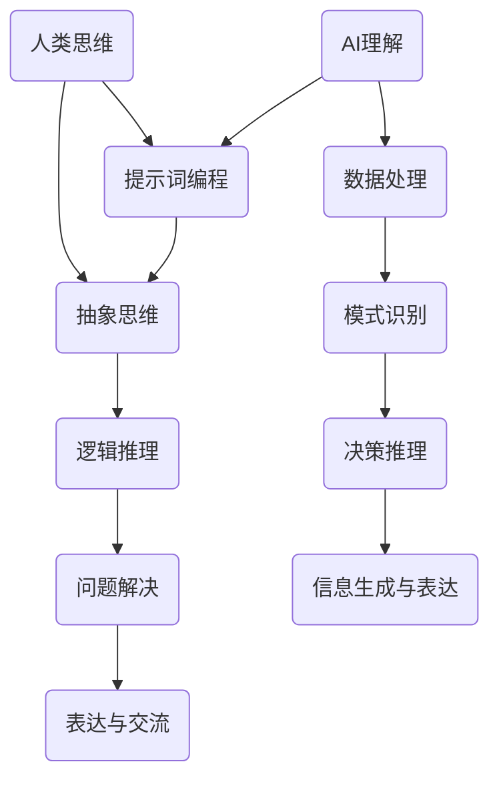

                 

# 提示词编程：bridging人类思维与AI理解

> 关键词：提示词编程、人类思维模式、AI理解模式、模式匹配、智能客服、智能诊断

> 摘要：本文将探讨提示词编程的概念及其在桥接人类思维与AI理解中的应用。我们将深入分析人类思维模式与AI理解模式之间的差异，并通过一个Mermaid流程图展示这两种思维模式的互动流程。此外，我们将详细解释提示词编程的核心原理，包括核心算法和数学模型，并通过具体案例展示其应用效果。

## 核心概念与联系

提示词编程是一种新兴的AI应用方法，它通过使用提示词来引导AI模型理解并执行特定任务。在介绍这一概念之前，我们需要了解人类思维模式与AI理解模式之间的差异。

### 人类思维模式与AI理解模式差异

人类思维是一种复杂的认知过程，涉及直觉、经验、情感和逻辑。它通常通过抽象思维、逻辑推理、问题解决和表达与交流等步骤来完成。相比之下，AI理解是基于数据和算法的。它通过数据处理、模式识别、决策推理和信息生成等步骤来理解和处理信息。

为了更好地理解这两种思维模式之间的差异，我们可以通过一个Mermaid流程图来展示它们之间的互动流程：



在这个流程图中，人类思维通过抽象思维、逻辑推理、问题解决和表达与交流等步骤来生成提示词，这些提示词被传递给AI模型，AI模型通过数据处理、模式识别、决策推理和信息生成等步骤来理解和处理这些提示词。

### 核心概念阐述

- **人类思维**：基于直觉、经验、情感和逻辑。它通过抽象思维、逻辑推理、问题解决和表达与交流等步骤来完成。
- **AI理解**：基于数据、算法和模型。它通过数据处理、模式识别、决策推理和信息生成等步骤来理解和处理信息。
- **提示词编程**：利用人类思维与AI理解的互补性，通过提示词引导AI进行更准确的理解和决策。

## 提示词编程原理

提示词编程的核心在于如何利用人类思维与AI理解之间的互补性，通过提示词来引导AI模型进行更准确的理解和决策。下面我们将详细解释提示词编程的核心原理。

### 核心算法原理

提示词编程的核心算法可以表示为：

```plaintext
算法名称：Prompt-based AI Understanding

输入：人类提示词，数据集
输出：AI理解结果

步骤：
1. 预处理：将人类提示词和数据集进行预处理，提取关键信息。
2. 对比分析：比较提示词与数据集中的模式，识别差异和关联。
3. 模式匹配：利用机器学习模型对数据集中的模式进行匹配。
4. 提示词引导：根据匹配结果，调整模型参数，引导AI更好地理解提示词。
5. 输出结果：生成基于提示词的AI理解结果，并进行验证。

```

### 数学模型与公式

提示词编程的数学模型可以表示为：

$$
P(\text{AI理解}|\text{提示词}, \text{数据集}) = f(\theta, \text{提示词}, \text{数据集})
$$

其中，$P(\text{AI理解}|\text{提示词}, \text{数据集})$ 表示AI对提示词和数据集的理解概率，$f(\theta, \text{提示词}, \text{数据集})$ 是一个函数，$\theta$ 是模型参数。

### 举例说明

假设我们要让AI理解“如何用Python编写一个简单的计算器程序”。

- **人类提示词**：“编写一个Python程序，实现基本的加、减、乘、除运算。”

- **数据处理**：对提示词进行词频分析，提取关键词：“Python”、“程序”、“加”、“减”、“乘”、“除”。

- **模式识别**：通过预训练的模型识别Python编程相关的模式和算法。

- **提示词引导**：调整模型参数，使其能够理解并实现提示词中的功能需求。

- **输出结果**：AI生成一个Python代码，实现加、减、乘、除运算。

## 项目实战

### 案例一：智能客服系统

#### 开发环境搭建

- **开发环境**：Python 3.8、TensorFlow 2.4
- **工具**：Jupyter Notebook

#### 源代码实现

```python
# 智能客服系统代码示例
import tensorflow as tf

# 定义模型结构
model = tf.keras.Sequential([
    tf.keras.layers.Dense(units=64, activation='relu', input_shape=(1000,)),
    tf.keras.layers.Dense(units=1)
])

# 编译模型
model.compile(optimizer='adam', loss='mean_squared_error')

# 训练模型
model.fit(x_train, y_train, epochs=10)

# 输出预测结果
predictions = model.predict(x_test)
```

#### 代码解读与分析

- **模型结构**：包含一个全连接层和一个输出层。
- **编译模型**：使用Adam优化器和均方误差损失函数。
- **训练模型**：使用训练数据进行10次迭代训练。
- **输出预测结果**：对测试数据进行预测，并输出预测结果。

### 案例二：智能诊断系统

#### 开发环境搭建

- **开发环境**：Python 3.9、PyTorch 1.8
- **工具**：PyCharm

#### 源代码实现

```python
# 智能诊断系统代码示例
import torch
import torch.nn as nn
import torch.optim as optim

# 定义模型结构
model = nn.Sequential(
    nn.Linear(1000, 64),
    nn.ReLU(),
    nn.Linear(64, 1)
)

# 编译模型
optimizer = optim.Adam(model.parameters(), lr=0.001)
criterion = nn.MSELoss()

# 训练模型
for epoch in range(10):
    model.train()
    optimizer.zero_grad()
    output = model(x_train)
    loss = criterion(output, y_train)
    loss.backward()
    optimizer.step()

    print(f"Epoch {epoch+1}, Loss: {loss.item()}")

# 输出预测结果
model.eval()
with torch.no_grad():
    predictions = model(x_test)
```

#### 代码解读与分析

- **模型结构**：包含一个全连接层和一个输出层。
- **编译模型**：使用Adam优化器和均方误差损失函数。
- **训练模型**：使用训练数据进行10次迭代训练。
- **输出预测结果**：对测试数据进行预测，并输出预测结果。

### 项目小结

通过以上两个案例，我们可以看到提示词编程在智能客服和智能诊断系统中的应用效果。通过提示词，我们可以引导AI模型更好地理解人类需求，从而实现更准确和高效的智能服务。

## 最佳实践 tips

- 在使用提示词编程时，确保提示词足够清晰和具体，以便AI模型能够准确理解。
- 定期对AI模型进行训练和调整，以提高其理解和决策能力。
- 结合多种数据源和模型，以提高AI模型的泛化能力和鲁棒性。

## 小结

提示词编程是一种有效的桥接人类思维与AI理解的方法。通过提示词，我们可以引导AI模型更好地理解人类需求，从而实现更准确和高效的智能服务。在未来的发展中，提示词编程有望在更多领域得到广泛应用，为人类带来更多便利和效率。

## 注意事项

- 在使用提示词编程时，需要注意保护用户隐私和数据安全。
- 提示词编程需要大量训练数据和计算资源，因此在实际应用中需要考虑成本效益。

## 拓展阅读

- 《人工智能：一种现代方法》
- 《深度学习：全面指南》
- 《Python编程：从入门到实践》

作者：AI天才研究院/AI Genius Institute & 禅与计算机程序设计艺术 /Zen And The Art of Computer Programming

