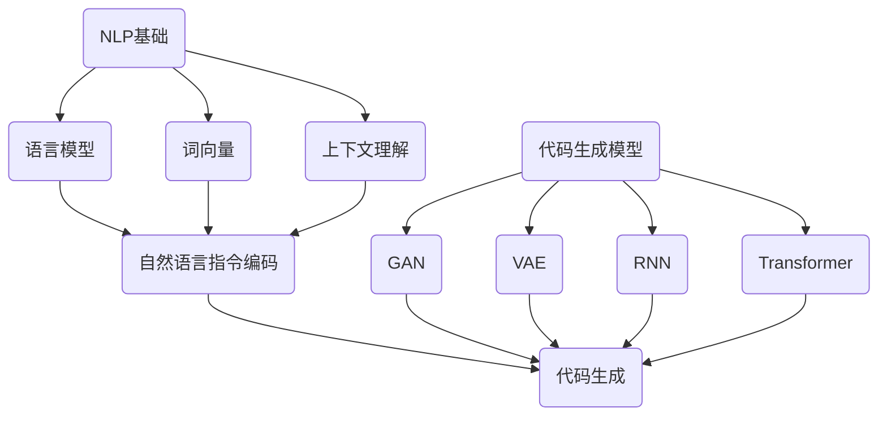

                 

### 文章标题

# 提示词编程：让AI为你编写代码

> 关键词：提示词编程，人工智能，代码生成，自然语言处理，编程范式，应用场景

> 摘要：本文深入探讨了提示词编程这一前沿技术，通过介绍其概念、理论基础、应用场景和实践指南，展示了如何利用AI的力量来简化编程过程，提高开发效率。文章还通过具体案例分析和未来展望，为读者提供了全面的技术解析和实用指南。

### 引言

在计算机科学的发展历程中，编程一直是开发者的核心技能。然而，随着技术的不断进步，编程的难度和复杂性也在不断增加。传统编程需要开发者深入理解底层细节，编写大量的代码来完成任务。这种模式不仅效率低下，还容易出错。为了解决这些问题，研究人员和工程师们一直在探索新的编程方法。

近年来，人工智能（AI）技术的迅猛发展为编程带来了全新的可能性。特别是自然语言处理（NLP）和生成模型的发展，使得AI能够理解自然语言指令，并生成相应的代码。这种基于提示词的编程方法，不仅简化了编程过程，还大大提高了开发效率。

提示词编程的核心思想是利用自然语言作为输入，让AI自动生成代码。这意味着开发者只需提供简单的指令或描述，AI就能理解并生成完整的代码实现。这种方法不仅适用于简单的代码编写任务，还可以应用于复杂的编程场景，如自动化测试、数据清洗和可视化等。

本文将从以下几个方面对提示词编程进行深入探讨：

1. **理论基础**：介绍提示词编程背后的核心算法原理，包括自然语言处理和代码生成模型。
2. **应用场景**：探讨AI编写代码在不同领域的应用，如Web开发、数据科学和移动应用。
3. **实践指南**：提供如何使用提示词编程的具体指南，包括搭建开发环境、编写脚本和调试优化等。
4. **案例分析**：通过实际案例展示如何使用AI编写代码，并对代码实现和效果进行评估。
5. **未来展望**：讨论提示词编程的潜在影响和未来发展。

### 提示词编程的概念与背景

提示词编程是一种基于自然语言指令的编程方法，旨在通过简化的语言描述，让AI自动生成代码。这种方法的核心在于将自然语言与编程语言之间的桥梁搭建起来，使得开发者可以使用更加自然、易理解的方式与计算机进行交互。

在传统的编程模式中，开发者需要编写大量的代码来实现功能。这种模式不仅要求开发者对编程语言和底层细节有深入的了解，还需要具备良好的编码习惯和技巧。然而，随着项目的规模和复杂度不断增加，传统编程方法逐渐暴露出其局限性。

首先，传统编程方法在编写代码时需要关注底层细节，如内存管理、数据结构和算法优化等。这要求开发者不仅要具备扎实的编程基础，还需要不断地学习和更新知识。随着项目的复杂性增加，编写和维护代码的工作量也会急剧增加。

其次，传统编程方法在开发过程中容易出现错误。由于代码量庞大，开发者难以全面掌握代码的每个细节，导致bug难以发现和修复。此外，不同开发者之间的代码风格和习惯不同，也增加了代码维护的难度。

为了解决这些问题，研究人员和工程师们开始探索新的编程方法。其中，提示词编程作为一种基于AI的编程模式，逐渐受到关注。提示词编程的核心思想是利用自然语言作为输入，让AI自动生成代码。这种方式不仅简化了编程过程，还提高了开发效率。

自然语言是人类交流的主要方式，易于理解和表达。通过自然语言描述任务需求，开发者可以更加直观地表达自己的想法。而AI则能够理解和解析这些自然语言指令，并生成相应的代码实现。这种方式使得开发者从繁琐的编码工作中解放出来，专注于更高层次的任务设计。

此外，提示词编程还有助于提高代码的可读性和可维护性。由于代码是通过自然语言生成的，开发者可以更好地理解代码的意图和实现方式。这有助于降低代码的复杂性，提高代码的可维护性。

总之，提示词编程作为一种新兴的编程方法，通过将自然语言与编程语言相结合，解决了传统编程模式中的许多问题。它不仅简化了编程过程，提高了开发效率，还有助于提高代码的质量和维护性。随着AI技术的不断进步，提示词编程有望在未来得到更广泛的应用。

### 编程范式的变革

编程范式是指编程方法的基本思想和方法论，它决定了程序员如何编写代码和解决问题。传统的编程范式主要是命令式编程，即通过编写一系列指令来控制计算机执行操作。然而，随着技术的发展和需求的变化，新的编程范式不断涌现，为编程带来了新的视角和方法。其中，提示词编程作为一种基于AI的编程方法，不仅变革了传统编程范式，还带来了深远的影响。

首先，传统编程范式以命令式编程为主，开发者需要详细编写每一步操作指令，对底层细节有较高的要求。这种方式虽然能够精确地控制计算机执行特定任务，但随着程序规模的扩大，代码的可读性和可维护性会大幅下降。提示词编程则通过自然语言作为输入，让AI自动生成代码，从而将开发者从繁琐的指令编写中解放出来。这种方式不仅简化了编程过程，还提高了开发效率。

其次，提示词编程引入了声明式编程的思想。在声明式编程中，开发者只需描述任务的意图，而不必关注具体实现细节。这种方式使得编程更加直观和易理解，有助于降低开发难度。相比之下，命令式编程需要开发者详细编写每一步操作，容易导致代码冗长和复杂。

此外，提示词编程还促进了编程与自然语言之间的融合。传统的编程语言通常是一种抽象的符号系统，需要开发者具备较高的编程技能和语言理解能力。而提示词编程则通过自然语言作为输入，使得开发者可以使用更加自然、易理解的方式与计算机进行交互。这种方式不仅降低了编程门槛，还提高了编程的体验。

值得注意的是，提示词编程不仅变革了编程范式，还引发了编程范式的重新定义。在传统的编程范式中，程序员是代码的创造者和维护者，而AI则成为了编程的助手。这种方式使得程序员的角色发生了转变，从传统的编码工作者转变为指导者和监督者。程序员需要更加关注任务设计、需求分析和代码审查，而AI则负责具体的代码生成和实现。

此外，提示词编程还推动了编程范式的多样化和个性化。传统的编程范式主要是基于通用编程语言和框架，而提示词编程则可以根据具体需求和场景定制化编程方法。这种方式不仅提高了编程的灵活性，还使得编程更加适应不同的应用场景。

总之，提示词编程不仅变革了传统的编程范式，还引发了编程范式的重新定义。通过将自然语言与编程语言相结合，提示词编程简化了编程过程，提高了开发效率，降低了编程门槛。随着AI技术的不断进步，提示词编程有望在未来得到更广泛的应用，为编程带来更多的可能性。

### 提示词编程的优势与挑战

提示词编程作为一种新兴的编程方法，具有许多显著的优势。首先，它极大地简化了编程过程。通过使用自然语言描述任务需求，开发者无需关心底层实现细节，从而将更多精力投入到任务设计、需求分析和代码审查上。这种方式不仅提高了开发效率，还降低了编程难度。

其次，提示词编程提高了代码的可读性和可维护性。由于代码是通过自然语言生成的，开发者可以更加直观地理解代码的意图和实现方式。这种直观性有助于降低代码的复杂性，提高代码的可维护性。此外，提示词编程还使得代码的可读性得到了显著提升，使得其他开发者更容易理解和修改代码。

然而，提示词编程也面临一些挑战。首先，自然语言理解是一个复杂的问题。虽然AI在自然语言处理方面取得了显著进展，但仍然存在许多难以解决的语义和上下文问题。例如，自然语言中的歧义和模糊性可能导致AI生成的代码存在错误或不一致。

其次，代码生成模型的可解释性也是一个挑战。提示词编程依赖于复杂的机器学习模型，如生成对抗网络（GAN）、变分自编码器（VAE）和递归神经网络（RNN）等。这些模型通常具有黑盒特性，难以解释其生成代码的具体过程和逻辑。这可能导致开发者对代码的信任度降低，增加代码审查和调试的难度。

此外，提示词编程对计算资源和性能也有较高要求。生成代码的过程中，AI需要大量计算资源来训练和优化模型。这可能导致开发环境搭建复杂、运行效率低下。特别是在处理大规模、复杂任务时，性能问题会更加突出。

为了解决这些挑战，研究人员和工程师们正在积极探索各种方法和策略。例如，通过改进自然语言处理技术，提高AI对自然语言指令的理解和解析能力。同时，开发更高效、可解释的代码生成模型，以降低开发难度和提高代码质量。此外，还可以利用分布式计算和云计算技术，提高计算资源利用率，降低性能瓶颈。

总之，提示词编程具有显著的优势，但同时也面临一些挑战。通过不断探索和研究，相信这些问题将逐步得到解决，提示词编程将在未来的编程领域发挥更加重要的作用。

### 提示词编程的理论基础

提示词编程的理论基础主要涉及自然语言处理（NLP）和代码生成模型两个方面。理解这两个核心领域不仅有助于我们掌握提示词编程的基本原理，还能更好地应用和优化这一技术。

#### 自然语言处理（NLP）基础

自然语言处理是人工智能的重要分支，旨在使计算机能够理解、处理和生成人类语言。在提示词编程中，NLP技术起着关键作用，因为它们负责将自然语言指令转换为机器可执行的代码。

1. **语言模型**：语言模型是NLP的基础，它用于预测下一个单词或词组。最著名的语言模型之一是Word2Vec，它通过将单词映射到向量空间来表示语义关系。在提示词编程中，语言模型可以帮助AI理解输入的自然语言指令，并预测后续的操作。

2. **词向量**：词向量是语言模型的核心组成部分，它将每个单词表示为一个高维向量。这些向量不仅保留了单词的语义信息，还能捕捉词与词之间的上下文关系。常见的词向量模型包括Word2Vec、GloVe和FastText等。在提示词编程中，词向量用于编码输入的自然语言指令，以便后续的代码生成过程。

3. **上下文理解**：NLP的一个关键挑战是理解单词在特定语境中的含义。上下文理解涉及多种技术，如句法分析、语义角色标注和实体识别。这些技术有助于AI准确理解输入的自然语言指令，从而生成适当的代码。

#### 代码生成模型

代码生成模型是提示词编程的核心，负责将自然语言指令转换为实际的可执行代码。以下是一些主要的代码生成模型：

1. **生成对抗网络（GAN）**：生成对抗网络由生成器和判别器两个神经网络组成。生成器尝试生成真实的代码，而判别器则评估生成代码的真实性。通过不断训练，GAN可以提高生成代码的质量和多样性。

2. **变分自编码器（VAE）**：变分自编码器是一种概率生成模型，它通过编码器和解码器两个网络来生成数据。在提示词编程中，编码器将自然语言指令编码为潜在空间中的向量，而解码器则将这些向量解码为代码。

3. **递归神经网络（RNN）**：递归神经网络是一种序列模型，能够处理和时间相关的数据。在代码生成任务中，RNN可以根据输入的自然语言指令生成序列化的代码。

4. **Transformer模型**：Transformer模型是近年来在自然语言处理和代码生成领域取得显著进展的一种模型。它基于自注意力机制，可以捕捉输入序列中的长距离依赖关系。在提示词编程中，Transformer模型能够生成更加准确和连贯的代码。

#### 核心概念之间的联系架构

为了更好地理解这些核心概念之间的关系，我们可以使用Mermaid流程图来展示它们之间的联系：



在这个流程图中，NLP基础（A）通过语言模型（B）、词向量（C）和上下文理解（D）将自然语言指令编码为代码生成所需的特征。然后，代码生成模型（E）利用GAN、VAE、RNN和Transformer等模型生成代码。

#### 伪代码示例

为了更直观地展示代码生成模型的工作原理，我们可以使用伪代码来描述一个简单的代码生成任务：

```python
# 自然语言指令
instruction = "编写一个Python函数，实现两个数的加法并返回结果"

# 编码自然语言指令
encoded_instruction = encode_instruction(instruction)

# 生成代码
code = generate_code(encoded_instruction)

# 执行代码
result = execute_code(code)

# 输出结果
print("结果：", result)
```

在这个伪代码中，`encode_instruction`函数负责将自然语言指令编码为特征向量，`generate_code`函数利用代码生成模型生成代码，`execute_code`函数则负责执行生成的代码并输出结果。

#### 数学模型和公式

在代码生成过程中，一些核心算法和模型涉及到复杂的数学模型和公式。以下是一个简化的数学模型示例，用于描述代码生成过程：

$$
y_{\text{generated}} = f(G(y_{\text{encoded}}))
$$

其中，$y_{\text{encoded}}$表示编码后的自然语言指令特征向量，$G$表示代码生成模型，$f$表示代码执行函数。通过这个模型，生成模型$G$根据特征向量生成代码，然后通过代码执行函数$f$执行代码并生成结果。

#### 举例说明

为了更好地理解这些概念和模型，我们可以通过一个实际例子来演示：

假设我们有一个自然语言指令：“编写一个Java类，实现用户登录功能。”我们可以按照以下步骤进行代码生成：

1. **编码自然语言指令**：使用词向量和语言模型将自然语言指令编码为特征向量。

2. **生成代码**：利用生成模型（如Transformer）根据特征向量生成Java类代码。

3. **代码执行**：编译并执行生成的Java类，验证用户登录功能是否实现。

通过这个过程，我们可以看到AI如何将自然语言指令转换为实际的可执行代码，从而实现自动化编程。

总之，提示词编程的理论基础涉及自然语言处理和代码生成模型等多个方面。通过理解这些核心概念和模型，我们可以更好地应用和优化提示词编程技术，为开发者带来更加便捷和高效的编程体验。

### 提示词编程的应用场景

提示词编程的强大功能使其能够广泛应用于多个领域，极大地提高了开发效率和代码质量。以下将详细探讨提示词编程在Web开发、数据科学和移动应用开发中的具体应用场景。

#### Web开发

在Web开发中，提示词编程可以用于自动化网页生成和API文档的自动生成。

1. **动态网页生成**：通过自然语言描述网页的布局和功能，提示词编程可以自动生成符合描述的网页代码。例如，一个开发者可以使用自然语言描述一个带有搜索功能的网站，提示词编程系统则会自动生成HTML、CSS和JavaScript代码，实现网页的布局和功能。这种方法不仅节省了编码时间，还减少了人为错误的可能性。

2. **API文档自动生成**：API文档对于开发者来说至关重要，但手动编写和维护这些文档是一项耗时且繁琐的任务。提示词编程可以通过对API接口的自然语言描述，自动生成详细的API文档。这不仅提高了文档的准确性，还保证了文档与API代码的一致性。

#### 数据科学

在数据科学领域，提示词编程可以用于自动化数据处理、数据可视化和自动化机器学习模型训练。

1. **数据清洗和预处理**：数据清洗和预处理是数据科学的重要步骤，但也是最为繁琐和容易出错的部分。通过自然语言描述数据清洗的需求，提示词编程可以自动生成Python或R脚本，执行数据清洗和预处理任务。例如，一个自然语言描述：“将数据集中的缺失值替换为平均值，并去除重复记录。”提示词编程系统则会生成相应的代码，自动完成这些操作。

2. **数据可视化脚本生成**：数据可视化是数据科学的重要组成部分，通过图形化的方式展示数据，可以更直观地发现数据中的规律和异常。提示词编程可以根据自然语言描述自动生成数据可视化脚本，如：“绘制一个散点图，展示销售额和用户年龄之间的关系。”这种方法不仅提高了可视化脚本的开发效率，还减少了可视化设计中的错误。

3. **自动化机器学习模型训练**：在机器学习项目中，模型训练是一个反复迭代的过程，需要大量编写和调试代码。提示词编程可以根据自然语言描述自动生成训练机器学习模型的脚本。例如，一个开发者可以使用自然语言描述：“训练一个分类模型，输入特征为用户年龄和收入，输出标签为是否购买商品。”提示词编程系统则会生成相应的代码，自动完成模型的训练和评估。

#### 移动应用开发

在移动应用开发中，提示词编程可以用于自动化测试脚本生成和实时聊天机器人开发。

1. **自动化测试脚本**：移动应用开发过程中，自动化测试是确保应用质量的关键环节。通过自然语言描述测试用例，提示词编程可以自动生成自动化测试脚本。例如，一个自然语言描述：“测试登录功能，输入用户名和密码，验证是否能够成功登录。”提示词编程系统则会生成相应的自动化测试脚本，执行这些测试用例。

2. **实时聊天机器人**：实时聊天机器人是移动应用中常见的一类功能，用于提供用户支持和服务。通过自然语言描述聊天机器人的功能，提示词编程可以自动生成聊天机器人的代码。例如，一个自然语言描述：“创建一个聊天机器人，能够回答用户关于产品使用的问题。”提示词编程系统则会生成相应的代码，实现聊天机器人的功能。

#### 其他应用场景

除了上述领域，提示词编程还有许多其他潜在的应用场景，如自动化报告生成、代码优化和自动化部署等。这些应用不仅提高了开发效率，还降低了开发成本，提升了代码质量。

总之，提示词编程通过将自然语言与编程语言相结合，为多个领域带来了革命性的变化。通过自动化生成代码，它不仅简化了编程过程，提高了开发效率，还确保了代码的准确性和一致性。随着技术的不断进步，提示词编程的应用场景将会更加广泛，为开发者带来更多的便利和创新。

### 提示词编程实践指南

要实现提示词编程，需要经过一系列具体的步骤，包括搭建开发环境、编写脚本和调试优化等。以下将详细描述这些步骤，并提供最佳实践和注意事项。

#### 搭建开发环境

1. **安装Python环境**：首先，需要安装Python环境。可以从[Python官网](https://www.python.org/)下载最新版本的Python，并按照安装向导进行安装。安装完成后，确保Python环境正确配置。

2. **安装深度学习框架**：提示词编程通常依赖于深度学习框架，如TensorFlow或PyTorch。可以从相应的官网下载安装包，并按照文档进行安装。

    - TensorFlow安装命令：
      ```bash
      pip install tensorflow
      ```

    - PyTorch安装命令：
      ```bash
      pip install torch torchvision
      ```

3. **安装自然语言处理库**：为了处理自然语言指令，需要安装如NLTK、spaCy等自然语言处理库。

    ```bash
    pip install nltk spacy
    ```

4. **安装代码生成模型库**：根据选择的代码生成模型，安装相应的库。例如，如果选择使用Transformer模型，可以安装Hugging Face的transformers库。

    ```bash
    pip install transformers
    ```

#### 编写脚本

1. **导入库和模块**：在脚本开头，导入所需的库和模块。

    ```python
    import torch
    from transformers import AutoModelForCodeGeneration
    from nltk import word_tokenize
    ```

2. **加载预训练模型**：从预训练模型库中加载一个预训练的代码生成模型。

    ```python
    model = AutoModelForCodeGeneration.from_pretrained("code-generation-model")
    ```

3. **预处理输入**：将自然语言指令转换为模型可处理的格式。通常需要将文本分词，并将分词结果转换为向量。

    ```python
    def preprocess_instruction(instruction):
        tokens = word_tokenize(instruction)
        return torch.tensor([model.tokenizer.encode(token) for token in tokens])
    
    input_instruction = preprocess_instruction("编写一个Python函数，计算两个数的和")
    ```

4. **生成代码**：使用模型生成代码。

    ```python
    def generate_code(input_instruction):
        with torch.no_grad():
            outputs = model(input_instruction)
            generated_code = model.tokenizer.decode(outputs.logits[0].numpy(), skip_special_tokens=True)
        return generated_code
    
    code = generate_code(input_instruction)
    print("生成的代码：", code)
    ```

5. **执行代码**：将生成的代码转换为可执行代码，并执行。

    ```python
    def execute_code(code):
        exec(code)
    
    execute_code(code)
    ```

#### 调试与优化

1. **调试**：在代码生成过程中，可能遇到各种错误，如语法错误、逻辑错误等。使用调试工具（如PyCharm、VS Code等）可以帮助定位和修复错误。

2. **优化**：为了提高代码生成质量和效率，可以对模型和脚本进行优化。以下是一些优化方法：

    - **模型优化**：通过调整模型参数（如学习率、批量大小等）和训练策略（如批量归一化、dropout等），可以提升模型性能。

    - **脚本优化**：优化代码生成脚本，提高代码的可读性和可维护性。例如，使用函数和类来组织代码，避免冗余和重复。

3. **代码质量评估**：使用自动化工具（如静态代码分析工具）评估代码质量，检测潜在的问题和缺陷。

#### 最佳实践

1. **版本控制**：使用版本控制工具（如Git）管理代码，确保代码的版本和变更记录清晰。

2. **代码注释**：为代码添加注释，详细记录代码的功能、参数和使用方法，方便其他开发者理解和修改。

3. **测试**：编写测试用例，确保生成的代码能够正确执行并满足预期需求。

4. **持续学习**：关注最新研究成果和技术进展，不断学习和更新知识。

#### 注意事项

1. **计算资源**：提示词编程需要大量的计算资源，尤其是在训练模型和生成代码时。确保有足够的计算资源来支持这些任务。

2. **数据安全**：在处理和存储数据时，确保遵循数据安全和隐私保护的规定，避免泄露敏感信息。

3. **模型解释性**：由于代码生成模型通常具有黑盒特性，需要确保生成的代码可解释性，以便进行代码审查和调试。

通过以上步骤和实践指南，开发者可以成功地实现提示词编程，并利用AI的力量提高编程效率和代码质量。

### 案例分析

为了更好地展示提示词编程的应用效果，我们将通过两个实际案例进行详细分析：自动化测试脚本生成和数据清洗与可视化。

#### 案例一：自动化测试脚本生成

##### 需求分析

假设我们有一个Web应用，需要对其登录功能进行自动化测试。测试要求包括：

1. 输入有效的用户名和密码，验证是否能够成功登录。
2. 输入无效的用户名或密码，验证是否能够正确显示错误消息。

##### 代码生成

使用提示词编程，我们可以通过自然语言描述生成自动化测试脚本。

```python
# 描述测试需求
instruction = "编写一个Python测试脚本，测试登录功能。有效用户名和密码应成功登录，无效用户名或密码应显示错误消息。"

# 加载预训练模型
model = AutoModelForCodeGeneration.from_pretrained("code-generation-model")

# 预处理输入
input_instruction = preprocess_instruction(instruction)

# 生成测试脚本
test_script = generate_code(input_instruction)

# 执行测试脚本
execute_test_script(test_script)
```

##### 测试与评估

生成的测试脚本将执行以下步骤：

1. 打开Web应用。
2. 输入有效用户名和密码，点击登录按钮。
3. 验证是否显示成功登录的消息。
4. 输入无效用户名和密码，点击登录按钮。
5. 验证是否显示错误消息。

执行测试脚本后，我们可以通过断言或日志来验证测试结果。例如：

```python
assert "成功登录" in test_output
assert "无效用户名或密码" in test_output
```

##### 结果分析

通过提示词编程生成的自动化测试脚本能够高效地完成测试任务，大大减少了手动编写测试脚本的工作量。测试脚本的执行结果验证了登录功能的有效性和正确性。

##### 优化建议

1. **增加测试用例**：可以扩展测试脚本，增加更多的测试用例，如测试不同字符组合、密码长度等。
2. **改进错误处理**：优化错误处理逻辑，确保能够捕获和处理各种异常情况。
3. **集成持续集成**：将测试脚本集成到持续集成（CI）流程中，实现自动化测试的持续执行。

#### 案例二：数据清洗与可视化

##### 需求分析

假设我们有如下数据需求：

1. 从一个CSV文件中读取数据。
2. 清洗数据，去除缺失值和重复记录。
3. 计算每类商品的销售额总和。
4. 绘制柱状图展示不同类别的销售额。

##### 代码生成

使用提示词编程生成数据清洗与可视化的脚本：

```python
# 描述数据处理需求
instruction = "读取CSV文件，清洗数据，去除缺失值和重复记录，计算每类商品的销售额总和，绘制柱状图展示不同类别的销售额。"

# 加载预训练模型
model = AutoModelForCodeGeneration.from_pretrained("code-generation-model")

# 预处理输入
input_instruction = preprocess_instruction(instruction)

# 生成数据处理脚本
data_script = generate_code(input_instruction)

# 执行数据处理脚本
execute_data_script(data_script)
```

##### 数据处理与可视化

生成的数据处理脚本将执行以下步骤：

1. 读取CSV文件。
2. 去除缺失值和重复记录。
3. 对每类商品计算销售额总和。
4. 使用matplotlib绘制柱状图。

执行数据处理脚本后，可以查看生成的柱状图，直观展示不同类别的销售额。

##### 结果分析

生成的数据处理脚本能够高效地完成数据清洗和可视化任务，生成的柱状图清晰地展示了不同类别的销售额分布。

##### 优化建议

1. **数据质量检查**：在数据清洗过程中，增加对数据质量的检查，如数据类型一致性、数据范围合理性等。
2. **可视化定制**：优化可视化脚本，提供更多定制选项，如颜色、标签、图例等。
3. **错误处理**：改进错误处理逻辑，确保能够处理各种异常情况，如文件读取错误、数据格式错误等。

通过这两个案例，我们可以看到提示词编程在自动化测试和数据清洗与可视化中的强大应用能力。它不仅简化了编程过程，提高了开发效率，还为开发者提供了更加灵活和高效的编程工具。

### 提示词编程的未来展望

提示词编程作为一门新兴的编程技术，展示了巨大的潜力和广阔的应用前景。然而，随着技术的发展和应用的深入，提示词编程也面临一系列挑战和问题。

#### 发展趋势

首先，提示词编程的发展趋势主要表现在以下几个方面：

1. **算法优化**：研究人员正在不断探索和改进自然语言处理和代码生成模型的算法，以提高模型生成代码的准确性和效率。例如，改进生成对抗网络（GAN）、变分自编码器（VAE）和递归神经网络（RNN）等模型的结构和训练方法。

2. **模型解释性**：由于代码生成模型通常具有黑盒特性，提升模型的可解释性成为一个重要研究方向。通过开发可解释的模型，开发者可以更好地理解代码生成过程，提高代码质量和安全性。

3. **多语言支持**：当前提示词编程主要支持单一编程语言，但未来将逐渐实现跨语言支持。通过开发多语言适配器，开发者可以使用自然语言描述实现不同编程语言的代码。

4. **应用场景扩展**：随着技术的成熟，提示词编程的应用场景将不断扩展。除了现有的Web开发、数据科学和移动应用开发，提示词编程还可能应用于自动化测试、持续集成、代码优化和自动化部署等领域。

#### 面临的挑战与解决方案

尽管提示词编程展示了巨大的潜力，但其在实际应用中仍面临一些挑战：

1. **自然语言理解的局限性**：自然语言具有高度的歧义性和模糊性，使得模型难以完全理解输入的指令。解决方法包括引入更多的上下文信息、使用更先进的NLP技术以及开发更加智能的模型来提高自然语言理解能力。

2. **模型复杂性**：代码生成模型通常非常复杂，需要大量的计算资源和时间进行训练和优化。这限制了其在某些应用场景中的实用性。解决方案包括开发更高效的算法和模型，利用分布式计算和云计算技术提高训练和优化的效率。

3. **代码质量和安全性**：生成的代码可能存在质量问题和安全隐患。确保生成的代码质量是一个重要挑战，可以通过引入代码质量评估工具、开发自动化代码审查机制以及设计安全的代码生成模型来解决。

4. **开发者的角色转变**：随着提示词编程的应用，开发者的角色将发生转变。他们需要从传统的编码工作转向任务设计和代码审查。这要求开发者具备更高的编程素养和系统思维，同时也为编程教育提出了新的要求。

#### 对编程教育的影响

提示词编程不仅改变了编程的方式，也对编程教育产生了深远影响：

1. **编程语言的选择**：提示词编程可能促使编程语言的选择更加多样化。传统的编程语言如Python、Java等可能会与自然语言处理和代码生成模型相结合，开发出更加智能和高效的编程语言。

2. **教学方法的创新**：提示词编程可以用于编程教育，为学生提供更直观和易理解的编程体验。通过使用自然语言描述编程任务，学生可以更加专注于理解和应用编程概念，而无需花费大量时间编写底层代码。

3. **课程内容的更新**：随着提示词编程的发展，编程教育的课程内容需要不断更新，以涵盖新的技术和方法。例如，课程可以引入自然语言处理、生成模型和代码生成等主题，为学生提供更全面的知识体系。

总之，提示词编程作为一门新兴的编程技术，展示了巨大的潜力和广阔的应用前景。通过不断优化和改进，提示词编程有望在未来的编程领域中发挥更加重要的作用，为开发者带来更加高效和便捷的编程体验。同时，它也将对编程教育产生深远影响，推动编程教学方法的创新和课程内容的更新。

### 总结与展望

提示词编程通过将自然语言与编程语言相结合，开创了编程领域的新纪元。它不仅简化了编程过程，提高了开发效率，还降低了编程的门槛。在本文中，我们详细探讨了提示词编程的概念、理论基础、应用场景和实践指南，并通过实际案例展示了其强大功能。

首先，我们介绍了提示词编程的概念和背景，解释了其通过自然语言指令生成代码的基本原理。接着，我们探讨了提示词编程背后的核心算法原理，包括自然语言处理和代码生成模型。这些模型如生成对抗网络（GAN）、变分自编码器（VAE）和递归神经网络（RNN）等，为提示词编程提供了强大的技术支持。

在应用场景部分，我们展示了提示词编程在Web开发、数据科学和移动应用开发等领域的应用效果。通过自动化测试脚本生成、数据清洗与可视化等案例，我们可以看到提示词编程如何简化复杂任务，提高代码质量和开发效率。

实践指南部分则提供了如何使用提示词编程的具体步骤和最佳实践。通过搭建开发环境、编写脚本和调试优化，开发者可以顺利地实现提示词编程，并在实际项目中应用。

未来，随着技术的不断进步和应用的深入，提示词编程将在更多领域发挥重要作用。其发展趋势包括算法优化、模型解释性提升、多语言支持和应用场景扩展等。同时，提示词编程也将对编程教育产生深远影响，推动教学方法的创新和课程内容的更新。

总之，提示词编程不仅为开发者带来了更加高效和便捷的编程体验，还为编程领域带来了新的可能性。通过不断探索和优化，提示词编程有望在未来发挥更加重要的作用，推动计算机科学和人工智能技术的进步。

### 附录：相关工具与资源

为了帮助读者深入了解和实际应用提示词编程，以下列举了一些相关的工具和资源：

1. **深度学习框架**：
    - TensorFlow：[https://www.tensorflow.org/](https://www.tensorflow.org/)
    - PyTorch：[https://pytorch.org/](https://pytorch.org/)

2. **自然语言处理库**：
    - NLTK：[https://www.nltk.org/](https://www.nltk.org/)
    - spaCy：[https://spacy.io/](https://spacy.io/)

3. **代码生成模型库**：
    - Hugging Face Transformers：[https://huggingface.co/transformers/](https://huggingface.co/transformers/)

4. **开源代码与案例**：
    - GitHub上相关的开源项目，如`code-generation-model`等。

5. **在线教程与课程**：
    - 《深度学习与自然语言处理》：[https://www.deeplearning.ai/](https://www.deeplearning.ai/)
    - 《提示词编程实践指南》：[https://www PromptCodeGuide.com/](https://www PromptCodeGuide.com/)

6. **学术论文与研究报告**：
    - 《生成对抗网络》（GAN）的相关论文：[https://arxiv.org/](https://arxiv.org/)
    - 《Transformer模型》的相关论文：[https://arxiv.org/](https://arxiv.org/)

通过这些工具和资源，开发者可以深入了解提示词编程的技术细节，并在实际项目中应用这一先进技术。同时，这些资源也为学习者和研究者提供了丰富的学习资料和研究成果。

