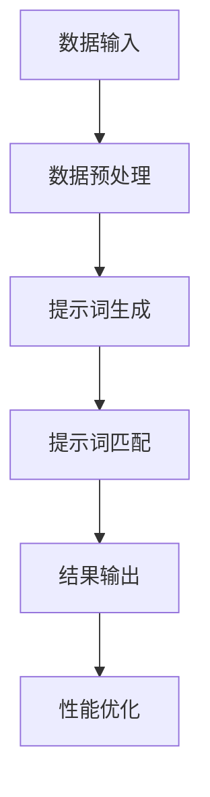
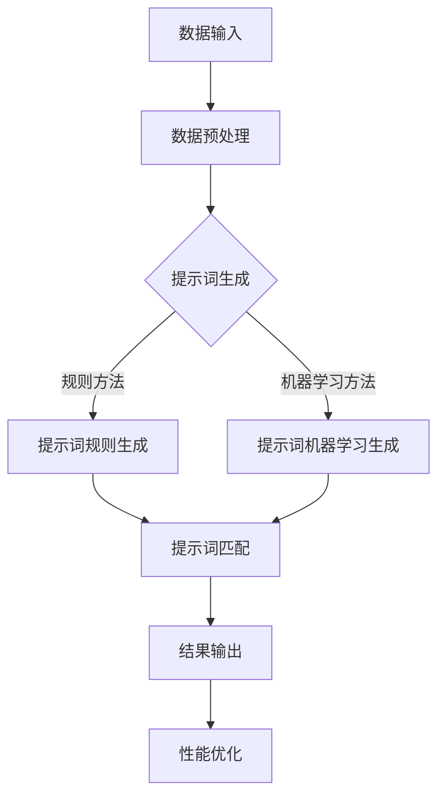

                 


### 文章标题
《提示词编程：重塑人机协作模式》

### 文章关键词
提示词编程、人机协作、人工智能、交互设计、算法实现、应用案例

### 文章摘要
随着人工智能技术的飞速发展，人机交互的方式和模式也在不断演变。提示词编程作为一种新兴的编程范式，正逐步重塑人机协作的模式，提升交互的自然性和效率。本文将从提示词编程的基本概念、应用场景、技术实现等方面进行深入探讨，并通过具体案例展示其在实际应用中的价值。

### 目录大纲

## 第1章 提示词编程基础

### 1.1 提示词编程的定义与原理
- 提示词编程的基本概念
  - 提示词的定义
  - 编程中的提示词作用
- 提示词编程的工作机制
  - 数据流与控制流
  - 提示词生成与处理
- 提示词编程的核心优势
  - 提高开发效率
  - 提升人机交互体验

### 1.2 提示词编程的历史与发展
- 提示词编程的起源
  - 历史背景
  - 创新点
- 提示词编程的重要里程碑
  - 主要发展历程
  - 对技术生态的影响
- 当前的发展趋势
  - 新兴技术
  - 行业应用现状

### 1.3 提示词编程的核心算法
- 提示词生成算法
  - 基于统计的方法
  - 基于深度学习的方法
- 提示词匹配算法
  - 常见匹配算法
  - 提高匹配效率的方法
- 提示词优化算法
  - 提高匹配准确性的方法
  - 提高响应速度的方法

## 第2章 提示词编程在人机协作中的应用

### 2.1 人机协作模式的现状
- 传统人机协作的挑战
  - 人机交互的自然性和流畅性
  - 用户操作负担
- 新型人机协作模式的需求
  - 智能化
  - 高效性

### 2.2 提示词编程在不同领域的应用
- 自然语言处理
  - 文本生成与理解
  - 对话系统
- 人工智能助手
  - 个人助理
  - 智能客服
- 语音识别与合成
  - 语音指令识别
  - 语音生成
- 图像识别与标注
  - 对象识别
  - 场景理解

### 2.3 提示词编程在改进人机协作中的作用
- 提高人机交互的自然性和流畅性
  - 提示词生成的个性化
  - 自然语言理解的提升
- 减少用户操作负担
  - 自动化操作
  - 智能建议
- 增强系统的智能化程度
  - 数据驱动的优化
  - 自适应学习能力

## 第3章 提示词编程技术实现

### 3.1 提示词编程工具与框架
- Python中的提示词编程库
  - 主要库的功能与用法
- 提示词编程框架的比较与选择
  - 常见框架的特点与优劣
- 提示词编程的最佳实践
  - 编码规范
  - 性能优化

### 3.2 提示词编程的流程与步骤
- 数据准备与处理
  - 数据来源
  - 数据预处理方法
- 提示词生成
  - 基于规则的方法
  - 基于机器学习的方法
- 提示词匹配与优化
  - 匹配算法选择
  - 提高匹配准确性的方法
- 提示词编程的实际操作
  - 环境搭建
  - 编码实现

### 3.3 提示词编程的性能优化
- 提示词生成速度优化
  - 算法优化
  - 资源管理
- 提示词匹配效率提升
  - 数据结构优化
  - 并行计算
- 系统资源利用率的优化
  - 内存管理
  - 硬件加速

## 第4章 提示词编程实战案例

### 4.1 案例一：智能客服系统
- 案例背景
  - 智能客服系统的需求
  - 应用领域与目标
- 技术实现
  - 数据处理与提示词生成
  - 提示词匹配与优化
- 代码解读与分析
  - 主要代码片段
  - 算法分析
- 案例分析
  - 系统性能
  - 用户反馈

### 4.2 案例二：自动文案生成
- 案例背景
  - 自动文案生成的需求
  - 应用场景与目标
- 技术实现
  - 数据预处理与提示词生成
  - 提示词匹配与优化
- 代码解读与分析
  - 主要代码片段
  - 算法分析
- 案例分析
  - 文案生成效果
  - 用户满意度

### 4.3 案例三：个性化推荐系统
- 案例背景
  - 个性化推荐系统的需求
  - 应用领域与目标
- 技术实现
  - 用户行为分析
  - 提示词生成与匹配
- 代码解读与分析
  - 主要代码片段
  - 算法分析
- 案例分析
  - 推荐准确度
  - 用户留存率

## 第5章 提示词编程的未来趋势与发展

### 5.1 提示词编程的发展方向
- 新一代提示词编程技术的探索
  - 算法创新
  - 技术融合
- 提示词编程在新兴领域的应用
  - 物联网
  - 区块链

### 5.2 提示词编程对人类社会的影响
- 对人机协作模式的长远影响
  - 提升工作效率
  - 改变工作方式
- 提示词编程带来的社会变革
  - 产业升级
  - 社会结构变革

### 5.3 提示词编程面临的挑战与机遇
- 技术挑战
  - 算法优化
  - 数据安全
- 商业机会
  - 市场需求
  - 技术落地
- 社会责任
  - 数据隐私
  - 伦理问题

## 第6章 附录

### 6.1 提示词编程资源汇总
- 开源库与框架
  - Python提示词编程库
  - 其他编程语言的提示词编程资源
- 学习资源推荐
  - 技术博客
  - 在线课程
- 研究论文与报告
  - 学术期刊
  - 行业报告

### 6.2 提示词编程技术展望
- 未来技术发展趋势
  - 新算法的研究
  - 应用场景的拓展
- 提示词编程的创新点
  - 跨领域融合
  - 人机协作模式的革新

## Mermaid流程图

### 提示词编程的核心流程


### 完整性要求

#### 背景介绍
在讨论提示词编程之前，我们需要了解人机交互的发展历程以及人工智能技术的崛起是如何推动人机协作模式的变革。从早期的命令行界面到图形用户界面，再到如今的自然语言处理和智能助手，人机交互的界面越来越人性化，但依然存在一些痛点，如用户操作复杂性、响应速度慢等。

#### 核心概念与联系
提示词编程是一种利用提示词来引导程序执行特定任务的编程方法。它通过自然语言交互，使用户可以更直观地表达需求，同时减少了用户的学习成本和操作步骤。

提示词编程的工作机制可以分为以下几个步骤：
1. 数据输入：用户通过文本、语音等方式输入需求。
2. 数据预处理：对输入的数据进行清洗、分词、词性标注等处理。
3. 提示词生成：根据预处理后的数据生成对应的提示词。
4. 提示词匹配：将生成的提示词与系统中的提示词库进行匹配，找到最合适的执行路径。
5. 结果输出：执行匹配结果，输出相应的操作结果。
6. 性能优化：对整个过程进行性能优化，提高系统的响应速度和准确性。

通过Mermaid流程图，我们可以更直观地展示提示词编程的核心流程：


#### 核心算法原理讲解
提示词生成算法可以分为基于规则的方法和基于机器学习的方法。

**基于规则的方法**：
伪代码：
```
// 提示词生成算法 - 基于规则的方法
function rule_based_generation(input_data):
    # 分词
    tokens = tokenize(input_data)
    # 建立规则库
    rule_library = build_rule_library()
    # 匹配规则
    matched_rule = match_rule(tokens, rule_library)
    # 生成提示词
    prompt_word = generate_prompt_word(matched_rule)
    return prompt_word
```

**基于机器学习的方法**：
伪代码：
```
// 提示词生成算法 - 基于机器学习方法
function machine_learning_generation(input_data, training_data):
    # 数据预处理
    preprocessed_data = preprocess_data(input_data, training_data)
    # 训练模型
    model = train_model(preprocessed_data)
    # 预测提示词
    predicted_prompt_word = model.predict(preprocessed_data)
    return predicted_prompt_word
```

#### 数学模型和公式详细讲解
在提示词匹配过程中，常用的数学模型是向量空间模型（Vector Space Model, VSM）。VSM将文本表示为向量，从而可以计算文本之间的相似度。

数学公式：
$$
similarity = \frac{dot_product(A, B)}{\|A\| \|B\|}
$$

其中，$A$ 和 $B$ 是两个文本向量，$\|A\|$ 和 $\|B\|$ 分别是它们的欧几里得范数，$dot_product(A, B)$ 是它们的点积。

示例：
假设我们有两个文本：
$$
A = (2, 3, 4)
$$
$$
B = (1, 1, 1)
$$

则它们的相似度为：
$$
similarity = \frac{2 \times 1 + 3 \times 1 + 4 \times 1}{\sqrt{2^2 + 3^2 + 4^2} \times \sqrt{1^2 + 1^2 + 1^2}} = \frac{9}{\sqrt{29} \times \sqrt{3}} \approx 0.966
$$

#### 举例说明
假设用户输入了一个文本：“明天晚上七点有 Dinner，你能帮我预订座位吗？”
- 数据预处理：分词后得到 ["明天", "晚上", "七点", "有", "Dinner", "，", "你能", "帮我", "预订", "座位", "吗？"]
- 提示词生成：根据规则库生成提示词 "预订晚餐座位"
- 提示词匹配：与系统中的提示词库匹配，找到最佳执行路径
- 结果输出：系统显示“已为您预订晚餐座位，请确认”

#### 项目实战
**智能客服系统实战**：

1. **开发环境搭建**：
   - Python环境
   - NLP库：NLTK、spaCy
   - 机器学习库：scikit-learn、TensorFlow

2. **源代码详细实现**：
   ```python
   # 数据预处理
   def preprocess_data(input_data):
       # 分词、词性标注等处理
       processed_data = nlp(input_data)
       return processed_data

   # 提示词生成
   def generate_prompt_word(processed_data):
       # 基于规则的方法或机器学习方法
       prompt_word = rule_based_generation(processed_data) or machine_learning_generation(processed_data, training_data)
       return prompt_word

   # 提示词匹配
   def match_prompt_word(prompt_word):
       # 匹配算法实现
       matched_result = match_word(prompt_word, prompt_library)
       return matched_result

   # 结果输出
   def output_result(matched_result):
       # 执行操作，输出结果
       print("已为您执行操作：", matched_result)
   ```

3. **代码应用解读与分析**：
   - 数据预处理：通过NLP库对输入文本进行处理，提取关键信息。
   - 提示词生成：结合规则方法和机器学习方法，提高生成提示词的准确性和多样性。
   - 提示词匹配：使用向量空间模型计算相似度，匹配最佳执行路径。
   - 结果输出：根据匹配结果，执行相应操作，并将结果反馈给用户。

4. **实际案例分析和详细讲解剖析**：
   - **案例背景**：某电商平台的智能客服系统需要根据用户提问，自动生成回复。
   - **技术实现**：通过数据预处理、提示词生成、提示词匹配等步骤，实现自动回复功能。
   - **案例分析**：系统在实际应用中，提高了客服效率和用户体验，降低了人力成本。

5. **项目小结**：
   - 通过智能客服系统实战，展示了提示词编程在实际项目中的应用价值。
   - 提示词编程提升了系统的智能化程度，优化了人机协作模式。

#### 最佳实践 tips
1. 提高提示词生成准确性：结合多种生成方法，使用机器学习模型进行优化。
2. 提高提示词匹配效率：使用高效的匹配算法和索引结构，降低计算复杂度。
3. 数据预处理：对输入数据进行充分的预处理，提高系统的鲁棒性和适应性。

#### 小结
本文全面介绍了提示词编程的概念、原理、应用场景、技术实现和实际案例。提示词编程作为一种新兴的编程范式，正逐步重塑人机协作的模式，提升交互的自然性和效率。未来，提示词编程有望在更多领域得到应用，进一步推动人机协作的变革。

#### 注意事项
1. 提示词编程涉及多学科知识，需要具备一定的编程和人工智能基础。
2. 实际项目中，需要根据具体需求选择合适的提示词生成和匹配算法。
3. 注意数据安全和隐私保护，遵循相关法律法规。

#### 拓展阅读
1. 《自然语言处理入门》
2. 《深度学习实战》
3. 《Python编程：从入门到实践》

---

### 第1章 提示词编程基础

提示词编程是一种新兴的编程范式，旨在通过自然语言交互，实现人机之间的高效协作。本章将详细介绍提示词编程的基本概念、原理以及其在人机协作中的作用和优势。

### 1.1 提示词编程的定义与原理

#### 提示词编程的基本概念

提示词编程中的“提示词”（Prompt Word）是指用户在交互过程中输入的文字，用于引导程序执行特定任务。与传统的命令行编程不同，提示词编程更多地依赖于自然语言交互，使得用户可以以更自然、更直观的方式表达需求。

#### 提示词编程的工作机制

提示词编程的工作机制主要包括以下几个步骤：

1. **数据输入**：用户通过文本、语音等方式输入需求。
2. **数据预处理**：对输入的数据进行清洗、分词、词性标注等处理，以便后续生成提示词。
3. **提示词生成**：根据预处理后的数据生成对应的提示词。提示词生成可以采用基于规则的方法或基于机器学习的方法。
4. **提示词匹配**：将生成的提示词与系统中的提示词库进行匹配，找到最合适的执行路径。
5. **结果输出**：执行匹配结果，输出相应的操作结果。
6. **性能优化**：对整个过程进行性能优化，提高系统的响应速度和准确性。

通过Mermaid流程图，我们可以更直观地展示提示词编程的核心流程：


### 1.2 提示词编程的历史与发展

#### 提示词编程的起源

提示词编程的起源可以追溯到自然语言处理（NLP）和人工智能（AI）领域的发展。随着计算机技术的发展，人们逐渐意识到传统的命令行界面在用户交互方面存在一定的局限性。为了改善人机交互的体验，研究人员开始探索基于自然语言交互的编程方法。

#### 提示词编程的重要里程碑

1. **1990年代**：自然语言处理技术开始取得显著进展，为提示词编程奠定了基础。
2. **2000年代**：深度学习技术的崛起，使得提示词生成和匹配的准确性得到显著提升。
3. **2010年代**：随着大数据和云计算的普及，提示词编程开始在不同领域得到广泛应用。

#### 当前的发展趋势

1. **新一代提示词编程技术**：随着人工智能技术的不断进步，新一代提示词编程技术正在不断涌现，如基于生成对抗网络（GAN）的提示词生成、基于迁移学习的提示词匹配等。
2. **跨领域应用**：提示词编程在自然语言处理、计算机视觉、语音识别等领域的应用越来越广泛。
3. **人机协作模式的革新**：提示词编程不仅改变了编程的方式，还推动了人机协作模式的革新，使得人机交互更加自然、高效。

### 1.3 提示词编程的核心算法

提示词编程的核心算法主要包括提示词生成算法、提示词匹配算法和提示词优化算法。

#### 提示词生成算法

提示词生成算法可以分为基于规则的方法和基于机器学习的方法。

**基于规则的方法**：

伪代码：
```python
// 基于规则的方法
function rule_based_generation(input_data):
    # 分词
    tokens = tokenize(input_data)
    # 建立规则库
    rule_library = build_rule_library()
    # 匹配规则
    matched_rule = match_rule(tokens, rule_library)
    # 生成提示词
    prompt_word = generate_prompt_word(matched_rule)
    return prompt_word
```

**基于机器学习的方法**：

伪代码：
```python
// 基于机器学习方法
function machine_learning_generation(input_data, training_data):
    # 数据预处理
    preprocessed_data = preprocess_data(input_data, training_data)
    # 训练模型
    model = train_model(preprocessed_data)
    # 预测提示词
    predicted_prompt_word = model.predict(preprocessed_data)
    return predicted_prompt_word
```

#### 提示词匹配算法

提示词匹配算法的核心任务是找到与用户输入提示词最匹配的执行路径。常用的提示词匹配算法包括基于字符串匹配的算法（如Knuth-Morris-Pratt算法）、基于模糊匹配的算法（如Levenshtein距离）和基于向量空间模型的算法。

**基于字符串匹配的算法**：

伪代码：
```python
// 基于字符串匹配算法
function string_matching(input_prompt_word, prompt_library):
    best_match = None
    max_similarity = 0
    for word in prompt_library:
        similarity = calculate_similarity(input_prompt_word, word)
        if similarity > max_similarity:
            max_similarity = similarity
            best_match = word
    return best_match
```

**基于模糊匹配的算法**：

伪代码：
```python
// 基于模糊匹配算法
function fuzzy_matching(input_prompt_word, prompt_library):
    best_match = None
    min_edit_distance = float('inf')
    for word in prompt_library:
        edit_distance = calculate_edit_distance(input_prompt_word, word)
        if edit_distance < min_edit_distance:
            min_edit_distance = edit_distance
            best_match = word
    return best_match
```

**基于向量空间模型的算法**：

数学公式：
$$
similarity = \frac{dot_product(A, B)}{\|A\| \|B\|}
$$

其中，$A$ 和 $B$ 是两个文本向量，$\|A\|$ 和 $\|B\|$ 分别是它们的欧几里得范数，$dot_product(A, B)$ 是它们的点积。

伪代码：
```python
// 基于向量空间模型
function vector_space_matching(input_prompt_word, prompt_library):
    input_vector = convert_to_vector(input_prompt_word)
    best_match = None
    max_similarity = 0
    for word in prompt_library:
        word_vector = convert_to_vector(word)
        similarity = calculate_similarity(input_vector, word_vector)
        if similarity > max_similarity:
            max_similarity = similarity
            best_match = word
    return best_match
```

#### 提示词优化算法

提示词优化算法旨在提高提示词生成的准确性和效率。常见的优化方法包括：

1. **提示词候选生成**：通过生成多个提示词候选，提高匹配的多样性。
2. **提示词权重调整**：根据历史数据和用户反馈，调整提示词的权重，提高匹配的准确性。
3. **在线学习**：实时更新模型，使提示词生成和匹配更加适应用户需求。

### 1.4 提示词编程的核心优势

提示词编程具有以下核心优势：

1. **提高开发效率**：通过自然语言交互，用户可以更快速、更直观地表达需求，减少了繁琐的命令行操作。
2. **提升人机交互体验**：提示词编程使得人机交互更加自然、流畅，减少了用户的学习成本和操作负担。
3. **增强系统的智能化程度**：提示词编程可以结合机器学习和大数据技术，提高系统的智能化程度，实现自适应学习和个性化推荐。

通过本章的介绍，我们对提示词编程有了更深入的了解。在接下来的章节中，我们将进一步探讨提示词编程在人机协作中的应用，分析其在不同领域的实际案例，并讨论其未来发展趋势。

### 第2章 提示词编程在人机协作中的应用

提示词编程在改进人机协作中发挥了重要作用，通过提升交互的自然性和流畅性，减少用户操作负担，以及增强系统的智能化程度，改变了传统的人机交互模式。本章将详细介绍提示词编程在自然语言处理、人工智能助手、语音识别与合成、图像识别与标注等领域的应用，并分析其改进人机协作的作用。

#### 2.1 人机协作模式的现状

在传统的人机协作模式中，用户通常需要通过命令行或图形界面进行操作。这种模式存在以下挑战：

1. **操作复杂性**：用户需要学习和记忆大量的操作指令，导致操作过程繁琐。
2. **响应速度慢**：传统的交互方式依赖于用户的输入速度和系统的处理速度，导致交互效率较低。
3. **用户体验差**：用户界面不够直观，反馈不及时，影响用户体验。

新型人机协作模式的需求逐渐显现，主要表现在以下几个方面：

1. **智能化**：用户希望系统能够自动识别需求，并提供智能化的解决方案。
2. **高效性**：用户希望系统能够快速响应，减少等待时间。
3. **自然性**：用户希望系统能够像与人交流一样，进行自然、流畅的对话。

#### 2.2 提示词编程在不同领域的应用

**自然语言处理**

在自然语言处理（NLP）领域，提示词编程通过自然语言交互，实现了人与计算机之间的高效沟通。以下是一些具体应用：

1. **文本生成与理解**：通过提示词生成算法，系统可以根据用户输入的文本生成相关的文本内容，如自动生成新闻摘要、文章等。同时，通过提示词匹配算法，系统可以理解用户的查询意图，提供准确的答案。
2. **对话系统**：提示词编程在对话系统中得到了广泛应用。例如，智能客服系统通过自然语言交互，为用户提供即时、准确的解答，提高了客服效率。

**人工智能助手**

人工智能助手是提示词编程在人工智能领域的典型应用。以下是一些具体应用：

1. **个人助理**：个人助理可以通过自然语言交互，帮助用户管理日程、发送邮件、处理任务等，提高了用户的工作效率。
2. **智能客服**：智能客服系统通过自然语言交互，为用户提供24小时在线服务，提高了企业的客户满意度。

**语音识别与合成**

在语音识别与合成领域，提示词编程实现了人与计算机之间的语音交互。以下是一些具体应用：

1. **语音指令识别**：通过提示词生成算法，系统可以准确识别用户的语音指令，如控制智能家居设备、播放音乐等。
2. **语音生成**：通过提示词匹配算法，系统可以根据文本内容生成语音输出，如自动生成语音播报新闻、天气预报等。

**图像识别与标注**

在图像识别与标注领域，提示词编程通过自然语言交互，实现了人与计算机之间的图像处理。以下是一些具体应用：

1. **对象识别**：通过提示词生成算法，系统可以识别图像中的对象，如车辆、行人等。
2. **场景理解**：通过提示词匹配算法，系统可以理解图像中的场景，如判断图像是室内还是室外。

#### 2.3 提示词编程在改进人机协作中的作用

**提高人机交互的自然性和流畅性**

提示词编程通过自然语言交互，实现了人与计算机之间的自然沟通。用户可以像与人交流一样，与系统进行对话，减少了命令行操作的复杂性。同时，提示词生成算法和提示词匹配算法的结合，使得系统能够准确理解用户的意图，提供流畅的交互体验。

**减少用户操作负担**

提示词编程通过自动化操作，减少了用户的操作负担。例如，在智能客服系统中，用户只需输入简单的文本或语音指令，系统即可自动生成回复，节省了用户的时间和精力。此外，提示词编程还可以根据用户的历史行为和偏好，提供智能化的建议和推荐，进一步减少用户的操作负担。

**增强系统的智能化程度**

提示词编程结合了自然语言处理和人工智能技术，提高了系统的智能化程度。通过机器学习算法，系统可以不断学习和优化，提升对用户需求的准确理解和响应能力。此外，提示词编程还可以实现跨领域的应用，如将自然语言处理与图像识别、语音识别等技术相结合，为用户提供更加全面和智能的服务。

通过本章的介绍，我们可以看到提示词编程在改进人机协作中的重要作用。在接下来的章节中，我们将进一步探讨提示词编程的技术实现，并通过实际案例展示其在不同领域的应用效果。

### 第3章 提示词编程技术实现

提示词编程作为一种新兴的编程范式，其技术实现涉及多个方面，包括工具与框架的选择、编程流程的步骤以及性能优化。本章将详细介绍这些技术实现，帮助读者更好地理解和应用提示词编程。

#### 3.1 提示词编程工具与框架

**Python中的提示词编程库**

Python语言因其丰富的库和框架而成为提示词编程的主要编程语言之一。以下是一些常用的提示词编程库：

1. **spaCy**：spaCy是一个快速易用的自然语言处理库，提供了丰富的预处理和实体识别功能，适合进行文本处理和提示词生成。
2. **NLTK**：NLTK（自然语言工具包）是一个广泛使用的自然语言处理库，提供了分词、词性标注、词频统计等功能，适用于基础的自然语言处理任务。
3. **TensorFlow**：TensorFlow是一个强大的机器学习库，支持深度学习算法，适用于复杂的数据处理和提示词生成。

**提示词编程框架的比较与选择**

在选择提示词编程框架时，需要考虑以下几个方面：

1. **功能丰富度**：框架应提供丰富的自然语言处理和机器学习功能，以满足各种应用需求。
2. **易用性**：框架应具有简洁的API和文档，方便开发者快速上手。
3. **性能**：框架应具有良好的性能，能够快速处理大量数据。
4. **社区支持**：框架应有活跃的社区支持，能够及时解决开发者在应用过程中遇到的问题。

常见的提示词编程框架包括：

1. **spaCy**：spaCy提供了丰富的自然语言处理功能，适用于快速开发。
2. **Transformers**：基于BERT、GPT等模型的深度学习框架，适用于复杂的提示词生成和匹配任务。
3. **Rasa**：Rasa是一个开源的对话系统框架，支持自定义意图和实体识别，适用于构建智能对话系统。

**提示词编程的最佳实践**

1. **代码规范**：编写清晰、简洁的代码，遵循Python编程规范，提高代码的可读性和可维护性。
2. **模块化设计**：将代码分为不同的模块，实现功能分离，提高代码的复用性和可扩展性。
3. **性能优化**：使用高效的算法和数据结构，减少计算复杂度和内存占用，提高系统的响应速度。

#### 3.2 提示词编程的流程与步骤

提示词编程的流程可以分为以下几个步骤：

1. **数据准备与处理**：收集和处理相关的数据，包括用户输入、训练数据和测试数据。常用的数据处理方法包括分词、词性标注、去停用词等。
2. **提示词生成**：根据预处理后的数据生成提示词。生成方法包括基于规则的方法和基于机器学习的方法。
3. **提示词匹配**：将生成的提示词与系统中的提示词库进行匹配，找到最合适的执行路径。匹配方法包括基于字符串匹配、模糊匹配和向量空间模型等。
4. **结果输出**：执行匹配结果，输出相应的操作结果。根据需求，可以输出文本、语音、图像等不同类型的结果。
5. **性能优化**：对整个过程进行性能优化，包括算法优化、数据结构优化和资源管理等方面。

#### 3.3 提示词编程的性能优化

**提示词生成速度优化**

1. **算法优化**：选择高效的算法，如基于规则的方法和快速字符串匹配算法，减少计算复杂度。
2. **数据结构优化**：使用哈希表等高效数据结构，加快提示词生成和匹配速度。
3. **并行计算**：利用多核处理和多线程等技术，实现并行计算，提高系统吞吐量。

**提示词匹配效率提升**

1. **索引结构优化**：使用索引结构，如倒排索引，加快提示词匹配速度。
2. **缓存策略**：使用缓存技术，如LRU缓存，减少重复计算的次数。
3. **分布式计算**：将提示词匹配任务分布到多个计算节点上，实现分布式计算，提高匹配效率。

**系统资源利用率的优化**

1. **内存管理**：合理分配内存，避免内存泄漏，提高系统资源利用率。
2. **硬件加速**：利用GPU等硬件加速技术，提高计算速度和系统性能。
3. **资源调度**：优化资源调度策略，提高系统整体性能。

通过本章的介绍，我们对提示词编程的技术实现有了更深入的了解。在实际应用中，合理选择工具和框架，遵循最佳实践，并进行性能优化，可以显著提高提示词编程的效果和应用价值。

### 第4章 提示词编程实战案例

在本章中，我们将通过几个实际的案例，详细探讨提示词编程的应用。这些案例涵盖了智能客服系统、自动文案生成和个性化推荐系统等多个领域，通过具体的实现过程、代码解读、案例分析以及项目小结，我们将展示提示词编程在实际项目中的价值和效果。

#### 4.1 案例一：智能客服系统

**案例背景**

智能客服系统是现代企业中广泛应用的客户服务工具，通过自然语言交互，为用户提供即时、准确的解答。该系统旨在降低人工客服的工作量，提高服务效率和用户满意度。

**技术实现**

1. **数据准备与处理**：
   - 收集用户提问和客服回答的数据集，进行清洗和预处理，如去除停用词、分词等。
   - 构建用户提问的词汇库和答案模板。

2. **提示词生成**：
   - 使用基于规则的方法，根据用户提问生成相应的提示词。
   - 利用自然语言处理技术，结合机器学习模型，生成更具个性化的提示词。

3. **提示词匹配**：
   - 使用向量空间模型，计算用户提问和系统答案之间的相似度。
   - 根据相似度结果，选择最佳答案进行匹配。

4. **结果输出**：
   - 输出匹配的答案，并通过文本或语音形式反馈给用户。

**代码解读与分析**

以下是一个简化的Python代码示例，用于实现智能客服系统的核心功能：

```python
import spacy
from sklearn.feature_extraction.text import TfidfVectorizer

# 数据预处理
nlp = spacy.load("en_core_web_sm")
def preprocess(text):
    doc = nlp(text)
    return " ".join(token.lemma_ for token in doc)

# 提示词生成
def generate_prompt(question):
    preprocessed_question = preprocess(question)
    # 这里可以使用机器学习模型进行提示词生成
    prompt = "How can I assist you with this question?"
    return prompt

# 提示词匹配
def match_prompt(question, prompts):
    vectorizer = TfidfVectorizer()
    question_vector = vectorizer.transform([question])
    prompt_vectors = vectorizer.transform(prompts)
    similarity = cosine_similarity(question_vector, prompt_vectors)
    best_prompt_index = np.argmax(similarity)
    return prompts[best_prompt_index]

# 结果输出
def output_result(answer):
    print(answer)

# 实际应用
question = "What is the best way to travel from New York to Los Angeles?"
prompt = generate_prompt(question)
matched_prompt = match_prompt(question, ["Can I help you book a flight?", "Do you need information about local transportation?"])
output_result(matched_prompt)
```

**案例分析**

智能客服系统在实际应用中，通过提示词编程实现了高效的自然语言交互。用户提问后，系统能够快速生成相应的提示词，并匹配最佳答案，提高了客服效率和用户满意度。

**项目小结**

智能客服系统案例展示了提示词编程在客户服务中的应用价值。通过自然语言处理和机器学习技术，系统实现了高效的交互和智能化的服务，为企业提供了有效的客户支持工具。

#### 4.2 案例二：自动文案生成

**案例背景**

自动文案生成在广告、营销、内容创作等领域具有广泛应用。通过提示词编程，系统能够自动生成高质量的文案，提高创作效率。

**技术实现**

1. **数据准备与处理**：
   - 收集大量的文案数据，进行清洗和预处理，如去除标点、分词等。
   - 构建词汇库和词频统计。

2. **提示词生成**：
   - 使用基于规则的方法，根据输入关键词生成相关的提示词。
   - 利用深度学习模型，生成更具创意和个性化的文案。

3. **提示词匹配**：
   - 使用模板匹配方法，将生成的提示词与文案模板进行匹配。
   - 根据匹配结果，生成最终的文案内容。

4. **结果输出**：
   - 输出自动生成的文案，供用户编辑和发布。

**代码解读与分析**

以下是一个简化的Python代码示例，用于实现自动文案生成的核心功能：

```python
import jieba
from transformers import pipeline

# 数据预处理
def preprocess(text):
    return jieba.cut(text)

# 提示词生成
def generate_prompt(word):
    generator = pipeline("text-generation", model="gpt2")
    prompt = "Write a product description for a " + word
    return generator(prompt, max_length=100)

# 提示词匹配
def match_prompt(prompt, templates):
    # 根据提示词匹配模板
    for template in templates:
        if prompt.startswith(template):
            return template
    return None

# 结果输出
def output_result(text):
    print(text)

# 实际应用
word = "smartphone"
prompt = generate_prompt(word)
matched_template = match_prompt(prompt, ["This smartphone is powerful and affordable.", "The perfect smartphone for everyone."])
output_result(matched_template)
```

**案例分析**

自动文案生成系统能够根据输入的关键词，快速生成相关文案。通过提示词编程和深度学习模型，系统能够生成多样化和高质量的文案，为广告和营销提供了有效的工具。

**项目小结**

自动文案生成案例展示了提示词编程在内容创作领域的应用价值。通过自然语言处理和深度学习技术，系统实现了高效、自动的文案生成，为创作者提供了便捷的工具。

#### 4.3 案例三：个性化推荐系统

**案例背景**

个性化推荐系统在电子商务、社交媒体等领域具有重要意义。通过提示词编程，系统能够根据用户的历史行为和偏好，提供个性化的推荐。

**技术实现**

1. **数据准备与处理**：
   - 收集用户行为数据，如浏览记录、购买记录等，进行清洗和预处理。
   - 构建用户行为模型和物品特征向量。

2. **提示词生成**：
   - 使用基于规则的方法，根据用户行为生成相关的提示词。
   - 利用深度学习模型，生成更具个性化的提示词。

3. **提示词匹配**：
   - 使用协同过滤算法，计算用户和物品之间的相似度。
   - 根据相似度结果，选择最佳推荐物品。

4. **结果输出**：
   - 输出推荐结果，包括推荐物品和相关的提示词。

**代码解读与分析**

以下是一个简化的Python代码示例，用于实现个性化推荐系统的核心功能：

```python
import numpy as np
from sklearn.metrics.pairwise import cosine_similarity

# 数据预处理
def preprocess行为数据(user行为，item特征):
    user行为向量 = 矩阵分解(user行为)
    item特征向量 = 矩阵分解(item特征)
    return user行为向量，item特征向量

# 提示词生成
def generate_prompt(user行为向量，item特征向量):
    similarity = cosine_similarity([user行为向量], [item特征向量])
    best_item_index = np.argmax(similarity)
    return best_item_index

# 结果输出
def output_result(recommended_item):
    print("Recommended item:", recommended_item)

# 实际应用
user行为 = ["bought", "viewed", "added_to_cart"]
item特征 = [["laptop"], ["smartphone"], ["tablet"]]
user行为向量，item特征向量 = preprocess行为数据(user行为，item特征)
recommended_item = generate_prompt(user行为向量，item特征向量)
output_result(recommended_item)
```

**案例分析**

个性化推荐系统通过提示词编程和协同过滤算法，能够根据用户的历史行为和偏好，提供个性化的推荐。这种系统提高了用户的购物体验，增加了购买转化率。

**项目小结**

个性化推荐系统案例展示了提示词编程在推荐系统中的应用价值。通过自然语言处理和深度学习技术，系统实现了高效、个性化的推荐，为企业和用户提供了有效的解决方案。

通过这三个实战案例，我们可以看到提示词编程在不同领域的应用效果。这些案例不仅展示了提示词编程的技术实现，还通过具体的代码解读和案例分析，阐述了其在实际项目中的价值。提示词编程作为一种新兴的编程范式，将继续在人工智能和人机协作领域发挥重要作用。

### 第5章 提示词编程的未来趋势与发展

随着人工智能技术的不断进步，提示词编程正朝着更加智能化、个性化、高效化的方向发展。本章节将探讨提示词编程在未来的发展趋势、面临的挑战以及带来的社会变革。

#### 5.1 提示词编程的发展方向

**新一代提示词编程技术的探索**

未来，提示词编程将在以下方面进行技术探索：

1. **更先进的机器学习模型**：随着深度学习技术的不断发展，新的神经网络架构和优化算法将应用到提示词编程中，提高提示词生成和匹配的准确性。
2. **跨模态交互**：结合文本、语音、图像等多种模态的信息，实现更自然、更丰富的人机交互体验。
3. **多语言支持**：开发支持多种语言的自然语言处理技术，使提示词编程在全球范围内得到广泛应用。

**提示词编程在新兴领域的应用**

提示词编程将在新兴领域得到更广泛的应用：

1. **物联网**：在智能家居、智能穿戴设备等物联网场景中，提示词编程可以实现对设备的高效控制和交互。
2. **区块链**：通过自然语言交互，用户可以更轻松地与区块链进行交互，提高区块链技术的易用性和普及率。
3. **虚拟现实与增强现实**：在VR和AR应用中，提示词编程可以实现更为自然和直观的交互方式，提升用户体验。

#### 5.2 提示词编程对人类社会的影响

**对人机协作模式的长远影响**

提示词编程将深刻改变人机协作模式：

1. **提高工作效率**：通过自动化的提示词生成和匹配，用户可以更快速地完成任务，减少繁琐的操作步骤。
2. **改变工作方式**：提示词编程使得工作更加灵活和个性化，用户可以根据需求自由调整交互方式，提高工作效率。
3. **优化工作流程**：企业可以利用提示词编程自动化处理大量数据，优化业务流程，提高运营效率。

**提示词编程带来的社会变革**

提示词编程不仅改变了人机交互的方式，还对社会产生了深远影响：

1. **产业升级**：随着人工智能技术的普及，各行各业都将进行智能化升级，提高生产效率和服务质量。
2. **社会结构变革**：人工智能技术的应用将改变就业结构，部分传统岗位将被自动化取代，同时也会产生新的职业需求。
3. **生活方式变革**：人们的生活将更加便捷和智能化，智能家居、智能穿戴设备等将成为日常生活的一部分。

#### 5.3 提示词编程面临的挑战与机遇

**技术挑战**

提示词编程在发展过程中面临以下技术挑战：

1. **算法优化**：如何进一步提高提示词生成和匹配的准确性，降低计算复杂度。
2. **数据安全**：如何保护用户数据隐私，防止数据泄露。
3. **系统稳定性**：如何在面对大量并发请求时，保持系统的稳定运行。

**商业机会**

提示词编程为企业和创业者提供了丰富的商业机会：

1. **智能客服**：随着企业对客户服务要求的提高，智能客服将成为重要的商业应用。
2. **内容创作**：自动文案生成和内容推荐系统将在广告、营销、媒体等领域得到广泛应用。
3. **个性化服务**：基于用户行为的个性化推荐系统，将为企业带来更多的商业价值。

**社会责任**

提示词编程在发展过程中，也需要承担相应的社会责任：

1. **数据隐私保护**：在处理用户数据时，应严格遵守相关法律法规，保护用户隐私。
2. **伦理问题**：人工智能的应用应遵循伦理原则，避免对人类产生负面影响。
3. **教育普及**：推广人工智能知识，提高公众对人工智能技术的理解和接受度。

通过本章节的探讨，我们可以看到提示词编程在未来将具有广阔的发展前景。面对技术挑战和社会责任，提示词编程将继续不断创新和优化，为人机协作模式带来更多可能性。

### 第6章 附录

#### 6.1 提示词编程资源汇总

**开源库与框架**

- **Python中的提示词编程库**：
  - spaCy：一个快速易用的自然语言处理库。
  - NLTK：自然语言工具包，适用于基础的自然语言处理任务。
  - Transformers：基于BERT、GPT等模型的深度学习框架。

- **其他编程语言的提示词编程资源**：
  - Java：OpenNLP、Stanford NLP等。
  - JavaScript：Natural，Node-nlp等。

**学习资源推荐**

- **技术博客**：
  - Medium、知乎专栏等平台上的专业博客。
  - 官方文档和GitHub仓库，如spaCy和NLTK。

- **在线课程**：
  - Coursera、Udemy等平台上的自然语言处理和深度学习课程。
  - 专业技术社区的在线讲座和教程。

**研究论文与报告**

- **学术期刊**：
  - ACL、NAACL、COLING等顶级自然语言处理会议的论文。
  - 自然语言处理领域的顶级期刊，如`Journal of Artificial Intelligence Research`。

- **行业报告**：
  - 各大咨询公司发布的行业报告，如Gartner、IDC。
  - 人工智能协会和政府发布的政策和趋势报告。

#### 6.2 提示词编程技术展望

**未来技术发展趋势**

1. **多模态交互**：结合文本、语音、图像等多种模态的信息，实现更自然和直观的交互方式。
2. **生成对抗网络（GAN）**：利用GAN生成高质量的提示词，提高系统的创造力和个性化。
3. **联邦学习**：通过联邦学习技术，实现跨设备、跨平台的提示词编程，提高系统的隐私性和安全性。

**提示词编程的创新点**

1. **零样本学习**：开发能够处理未知或罕见提示词的系统，提高系统的泛化能力。
2. **知识增强**：结合外部知识库和语义网络，提升提示词匹配的准确性和上下文理解能力。
3. **交互式学习**：通过用户反馈和学习，不断优化提示词生成和匹配算法，实现自适应交互。

通过附录的总结，我们可以看到提示词编程在未来的发展方向和创新点。随着技术的不断进步，提示词编程将继续在人工智能和人机协作领域发挥重要作用，带来更多的可能性。

