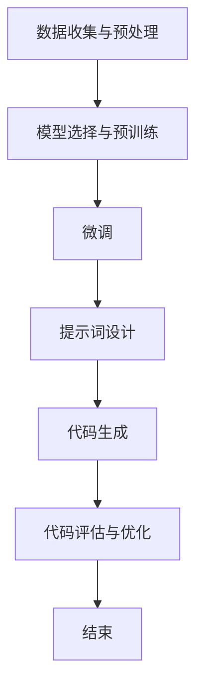
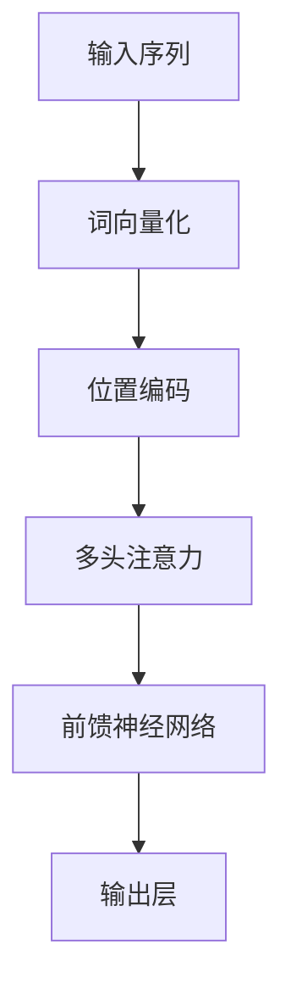
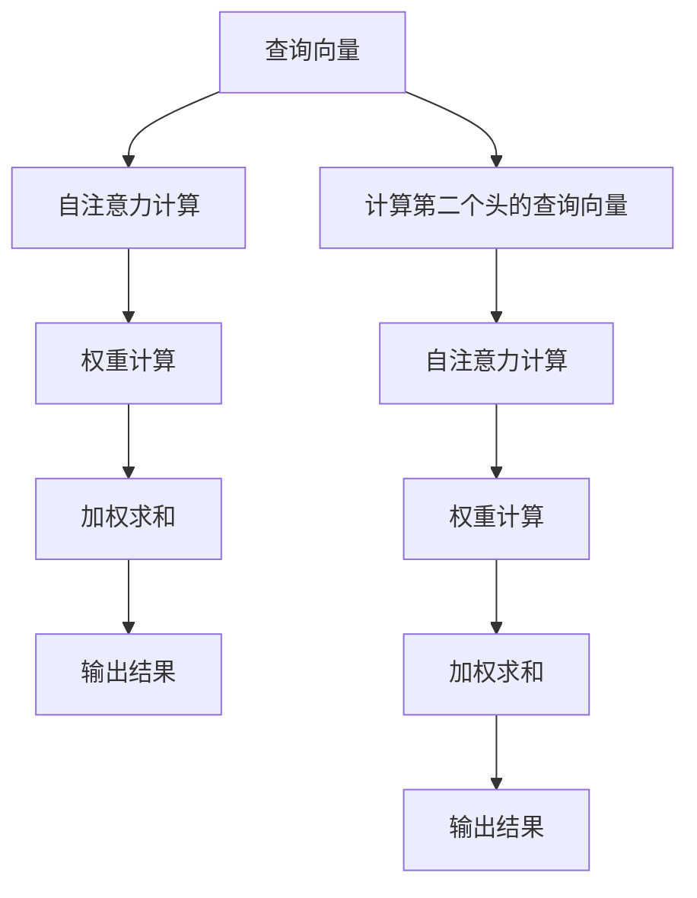
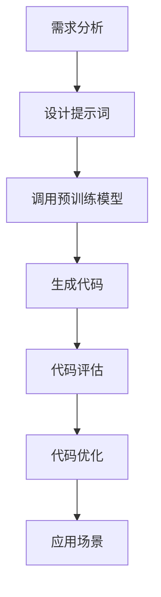

                 

### 1.4 提示词编程的背景与动机

#### 1.4.1 传统的软件开发面临的挑战

传统的软件开发模式主要依赖于开发者手动编写代码，这种方式在很长一段时间内取得了显著成果。然而，随着软件系统变得越来越复杂，传统的编程模式也暴露出了许多问题。首先，代码编写的工作量巨大，开发者需要花费大量时间来理解和维护现有的代码库。其次，错误难以发现和修复，特别是在大型系统中，一个微小的错误可能会导致整个系统的崩溃。此外，软件复用性差，开发者往往需要从头开始编写大量的代码，这不仅增加了开发成本，也降低了开发效率。

为了解决这些问题，研究人员开始探索新的编程范式，希望通过自动化和智能化技术来提升软件开发的效率和质量。提示词编程作为一种新兴的编程范式，正是为了应对这些挑战而诞生的。

#### 1.4.2 提示词编程的优势

提示词编程的核心优势在于其能够显著减少手动编码的工作量。通过设计特定的提示词，开发者可以引导大型语言模型生成所需的代码，从而实现自动化编程。这种模式不仅提高了开发效率，还降低了出错的可能性。以下是提示词编程的一些关键优势：

1. **高效率**：提示词编程利用预训练的大型语言模型，能够快速生成高质量的代码。相比传统的手动编写代码，提示词编程大大缩短了开发周期。

2. **可复用性**：通过设计通用的提示词，开发者可以复用相同的代码结构，从而减少重复性工作，提高代码的复用性。

3. **易于维护**：由于代码生成过程是自动化的，开发者可以更容易地理解和维护生成的代码，减少了维护成本。

4. **减少出错**：提示词编程通过明确的提示词来指导代码生成，减少了因人类错误导致的代码缺陷。

5. **个性化定制**：提示词编程可以根据具体需求进行个性化定制，从而满足不同项目的特定需求。

#### 1.4.3 提示词编程的应用领域

提示词编程已经在多个领域取得了显著的应用成果。以下是几个典型的应用领域：

1. **自然语言处理**：提示词编程可以用于自动生成文本，包括文章、摘要、对话等。例如，在机器翻译、文本摘要、聊天机器人等领域，提示词编程发挥了重要作用。

2. **代码自动生成**：提示词编程可以用于自动生成代码，包括前端页面、后端服务、数据库架构等。这种模式大大提高了开发效率，降低了开发成本。

3. **数据分析**：提示词编程可以用于自动生成数据分析报告，包括数据可视化、统计报告等。这种模式使得数据分析变得更加高效和直观。

4. **人工智能**：提示词编程可以用于训练和优化机器学习模型，包括生成训练数据、调整模型参数等。这种模式有助于提高机器学习模型的性能和泛化能力。

5. **游戏开发**：提示词编程可以用于自动生成游戏场景、角色行为等，从而提高游戏开发的效率和质量。

总之，提示词编程作为一种新兴的编程范式，已经在多个领域展示了其强大的应用潜力。随着技术的不断发展和完善，提示词编程有望在未来成为软件开发的重要工具。

### 1.5 提示词编程与相关概念的关联

#### 1.5.1 与自动化编程的关系

提示词编程与自动化编程密切相关，但两者也有一些区别。自动化编程主要侧重于通过工具和脚本来自动执行重复性的编程任务，如自动化测试、部署等。而提示词编程则更加注重通过自然语言交互来引导模型生成代码。虽然两者都有自动化的特性，但提示词编程引入了更高级的智能化元素，使得代码生成过程更加灵活和高效。

#### 1.5.2 与生成对抗网络（GAN）的关系

生成对抗网络（GAN）是一种用于生成数据的机器学习技术。GAN由两个对抗网络组成：生成器（Generator）和判别器（Discriminator）。生成器尝试生成与真实数据尽可能相似的数据，而判别器则尝试区分生成器生成的数据与真实数据。通过这种对抗训练，生成器可以生成高质量的数据。提示词编程和GAN在某种程度上有相似之处，都涉及到数据生成。然而，提示词编程更加侧重于利用预训练的语言模型生成特定格式的代码，而GAN则主要应用于图像、音频等类型的数据生成。

#### 1.5.3 与代码生成模型的关系

代码生成模型是提示词编程的核心组成部分。常见的代码生成模型包括基于Transformer的模型，如GPT-3、T5等。这些模型通过预训练和微调，能够生成高质量的代码。提示词编程利用这些模型，通过设计特定的提示词来引导代码生成。因此，代码生成模型是提示词编程实现的基础。

#### 1.5.4 与抽象编程的关系

抽象编程是一种通过抽象概念和模型来简化复杂问题的编程方法。提示词编程与抽象编程有一定的联系。提示词编程通过提示词来抽象用户的需求，使得模型能够生成相应的代码。这种模式不仅提高了代码的可维护性，还使得编程过程更加直观和高效。

总之，提示词编程是一个多维度、多层次的编程范式，它与其他相关概念和技术有着密切的联系。理解这些概念之间的关系，有助于我们更好地把握提示词编程的本质和潜力。

### 1.6 总结与展望

提示词编程作为一种新兴的编程范式，展示了其在提高软件开发效率、降低开发成本、增强代码可维护性等方面的巨大潜力。通过设计有效的提示词，开发者可以利用预训练的大型语言模型来生成高质量的代码，从而实现自动化编程。然而，提示词编程仍处于发展阶段，面临着许多挑战和机遇。

首先，提示词的设计和优化是一个关键问题。如何设计出既精确又能灵活应对各种输入的提示词，是一个需要深入研究的问题。其次，提示词编程的模型训练和优化也是一个技术难点，如何提高模型的训练效率和生成质量，是未来研究的重要方向。

此外，提示词编程的应用领域也在不断扩大。从自然语言处理、代码自动生成，到数据分析、人工智能等领域，提示词编程都展现出了强大的应用潜力。未来，随着技术的不断进步，提示词编程有望在更多领域发挥重要作用，为软件开发带来新的变革。

总之，提示词编程为软件开发带来了新的思路和方法。通过不断探索和优化，提示词编程有望在未来成为软件开发的重要工具，推动软件行业的持续创新和发展。

---

**作者：AI天才研究院/AI Genius Institute & 禅与计算机程序设计艺术 /Zen And The Art of Computer Programming**

**本文为原创内容，未经授权，不得转载。**

## 提示词编程的核心概念和核心算法

### 2.1 提示词编程的基础概念

在深入探讨提示词编程的核心算法之前，我们先来梳理一下提示词编程的基础概念，以便更好地理解后续的算法讲解。

#### 2.1.1 提示词（Prompt）

提示词是提示词编程的核心概念之一。它是一种引导模型生成所需结果的文本输入。提示词需要明确地指明模型的意图，例如生成什么样的代码、处理什么样的数据等。一个有效的提示词应该具备以下特点：

- **明确性**：提示词需要清晰地传达用户的意图，避免歧义。
- **灵活性**：提示词应该具有一定的灵活性，以便适应不同的输入和场景。
- **简洁性**：提示词应尽量简洁，以减少模型的计算负担。

#### 2.1.2 预训练语言模型

预训练语言模型（Pre-trained Language Model，简称PLM）是提示词编程的基础。预训练语言模型通过在大规模语料库上进行预训练，获得了丰富的语言知识和结构化信息。常见的预训练语言模型包括GPT、BERT、T5等。这些模型在生成文本、代码、摘要等方面都表现出色。

#### 2.1.3 微调（Fine-tuning）

微调是在预训练语言模型的基础上，针对特定任务进行进一步训练的过程。通过微调，模型可以更好地适应特定任务的需求，从而提高模型的性能。微调通常包括以下步骤：

1. **数据预处理**：将任务数据清洗、标注和整理，以便为模型提供高质量的输入。
2. **模型选择**：选择一个合适的预训练语言模型作为基础模型。
3. **训练**：在基础模型上进行训练，通过优化模型参数，使其更好地适应特定任务。
4. **评估与调整**：对微调后的模型进行评估，根据评估结果调整模型参数，直至达到满意的性能。

#### 2.1.4 程序生成（Code Generation）

程序生成是提示词编程的重要应用之一。通过设计特定的提示词，预训练语言模型可以生成满足特定需求的代码。程序生成过程通常包括以下步骤：

1. **提示词设计**：根据任务需求设计提示词，明确模型的意图。
2. **模型输入**：将提示词输入到预训练语言模型中。
3. **代码生成**：模型根据预训练的知识和提示词，生成相应的代码。
4. **代码评估与优化**：对生成的代码进行评估和优化，确保其满足任务需求。

### 2.2 提示词编程的核心算法

#### 2.2.1 基于Transformer的预训练语言模型

提示词编程的核心算法主要基于Transformer架构的预训练语言模型。Transformer模型由Vaswani等人于2017年提出，是自然语言处理领域的重要突破。与传统的序列到序列（Seq2Seq）模型相比，Transformer模型引入了自注意力机制（Self-Attention），能够更有效地处理长距离依赖关系。

#### 2.2.2 自注意力机制（Self-Attention）

自注意力机制是Transformer模型的核心组件。它通过计算输入序列中每个单词与自身以及其他所有单词的相关性，来生成表示每个单词的权重。自注意力机制的数学表达式如下：

$$
\text{Attention}(Q, K, V) = \text{softmax}\left(\frac{QK^T}{\sqrt{d_k}}\right)V
$$

其中，\(Q, K, V\) 分别是查询（Query）、键（Key）和值（Value）向量，\(d_k\) 是键向量的维度。通过自注意力机制，模型能够捕捉到输入序列中的长距离依赖关系，从而提高生成代码的质量。

#### 2.2.3 位置编码（Positional Encoding）

由于Transformer模型是基于注意力机制的，它无法直接处理输入序列中的位置信息。为了解决这个问题，研究人员提出了位置编码（Positional Encoding）。位置编码为输入序列中的每个单词添加了额外的维度，从而为模型提供了位置信息。

$$
\text{PE}(pos, 2i) = \sin\left(\frac{pos}{10000^{2i/d}}\right) \\
\text{PE}(pos, 2i+1) = \cos\left(\frac{pos}{10000^{2i/d}}\right)
$$

其中，\(pos\) 是单词的位置，\(i\) 是单词的维度，\(d\) 是位置编码的维度。通过位置编码，模型能够更好地理解输入序列的顺序，从而提高生成代码的质量。

#### 2.2.4 多头注意力（Multi-Head Attention）

多头注意力是Transformer模型的一个重要特性。它通过多次应用自注意力机制，来提取输入序列的不同部分的信息。多头注意力的数学表达式如下：

$$
\text{MultiHead}(Q, K, V) = \text{Concat}(\text{head}_1, \text{head}_2, ..., \text{head}_h)W^O
$$

其中，\(h\) 是头数，\(\text{head}_i = \text{Attention}(QW_i^Q, KW_i^K, VW_i^V)\)，\(W^O\) 是输出线性层。通过多头注意力，模型能够提取输入序列的更多信息，从而提高生成代码的多样性和质量。

### 2.3 提示词编程的算法流程

提示词编程的算法流程主要包括以下几个步骤：

1. **数据收集与预处理**：收集与任务相关的数据，并进行预处理，如清洗、标注等。

2. **模型选择与预训练**：选择一个合适的预训练语言模型，并在大规模语料库上进行预训练。

3. **微调**：在预训练模型的基础上，针对特定任务进行微调，以提高模型在特定任务上的性能。

4. **提示词设计**：根据任务需求设计提示词，明确模型的意图。

5. **代码生成**：将设计好的提示词输入到模型中，模型会根据预训练的知识和提示词生成相应的代码。

6. **代码评估与优化**：对生成的代码进行评估和优化，确保其满足任务需求。

### 2.4 提示词编程的核心算法原理讲解

为了更好地理解提示词编程的核心算法原理，下面我们将使用伪代码详细阐述提示词编程的算法流程。

```python
# 提示词编程算法伪代码

# 步骤1：数据收集与预处理
data = preprocess_data(raw_data)

# 步骤2：模型选择与预训练
model = pretrain_language_model(data)

# 步骤3：微调
model = fine_tune_model(model, specific_data)

# 步骤4：提示词设计
prompt = design_prompt(task_specific_requirements)

# 步骤5：代码生成
code = generate_code(model, prompt)

# 步骤6：代码评估与优化
code = evaluate_and_optimize_code(code, task_requirements)
```

#### 2.4.1 数据收集与预处理

数据收集与预处理是提示词编程的基础步骤。在这一步，我们需要收集与任务相关的数据，并进行清洗、标注和整理，以便为模型提供高质量的输入。

```python
# 数据预处理伪代码

def preprocess_data(raw_data):
    # 数据清洗
    cleaned_data = clean_data(raw_data)
    
    # 数据标注
    annotated_data = annotate_data(cleaned_data)
    
    # 数据整理
    processed_data = organize_data(annotated_data)
    
    return processed_data
```

#### 2.4.2 模型选择与预训练

在模型选择与预训练步骤，我们需要选择一个合适的预训练语言模型，并在大规模语料库上进行预训练。常见的预训练语言模型包括GPT、BERT、T5等。

```python
# 模型选择与预训练伪代码

def pretrain_language_model(data):
    # 选择预训练模型
    model = select_pretrained_model()
    
    # 预训练模型
    model = train_model(model, data)
    
    return model
```

#### 2.4.3 微调

在微调步骤，我们将在预训练模型的基础上，针对特定任务进行进一步训练，以提高模型在特定任务上的性能。

```python
# 微调伪代码

def fine_tune_model(model, specific_data):
    # 微调模型
    model = train_model(model, specific_data, fine_tune=True)
    
    return model
```

#### 2.4.4 提示词设计

在提示词设计步骤，我们需要根据任务需求设计提示词，明确模型的意图。

```python
# 提示词设计伪代码

def design_prompt(task_specific_requirements):
    # 设计提示词
    prompt = generate_prompt(task_specific_requirements)
    
    return prompt
```

#### 2.4.5 代码生成

在代码生成步骤，我们将设计好的提示词输入到模型中，模型会根据预训练的知识和提示词生成相应的代码。

```python
# 代码生成伪代码

def generate_code(model, prompt):
    # 生成代码
    code = model.generate_code(prompt)
    
    return code
```

#### 2.4.6 代码评估与优化

在代码评估与优化步骤，我们将对生成的代码进行评估和优化，确保其满足任务需求。

```python
# 代码评估与优化伪代码

def evaluate_and_optimize_code(code, task_requirements):
    # 评估代码
    evaluation_result = evaluate_code(code, task_requirements)
    
    # 优化代码
    if not evaluation_result:
        code = optimize_code(code, task_requirements)
        
    return code
```

通过上述伪代码，我们可以清晰地理解提示词编程的算法流程。在实际应用中，每个步骤都需要进一步细化和优化，以实现高效、准确的代码生成。

### 2.5 提示词编程的数学模型和公式

在提示词编程中，数学模型和公式起着至关重要的作用。以下将介绍与提示词编程相关的关键数学模型和公式，并进行详细讲解。

#### 2.5.1 Transformer模型的基本公式

Transformer模型是提示词编程的基础，其核心思想是自注意力机制（Self-Attention）。以下是Transformer模型的基本公式：

1. **自注意力计算**：

$$
\text{Attention}(Q, K, V) = \text{softmax}\left(\frac{QK^T}{\sqrt{d_k}}\right)V
$$

其中，\(Q, K, V\) 分别是查询（Query）、键（Key）和值（Value）向量，\(d_k\) 是键向量的维度。这个公式表示在自注意力机制下，每个查询向量会与所有键向量进行点积计算，然后通过softmax函数得到概率分布，最后与对应的值向量相乘，得到加权求和的结果。

2. **多头注意力计算**：

$$
\text{MultiHead}(Q, K, V) = \text{Concat}(\text{head}_1, \text{head}_2, ..., \text{head}_h)W^O
$$

其中，\(h\) 是头数，\(\text{head}_i = \text{Attention}(QW_i^Q, KW_i^K, VW_i^V)\)，\(W^O\) 是输出线性层。多头注意力通过多次应用自注意力机制，来提取输入序列的不同部分的信息。

3. **位置编码**：

$$
\text{PE}(pos, 2i) = \sin\left(\frac{pos}{10000^{2i/d}}\right) \\
\text{PE}(pos, 2i+1) = \cos\left(\frac{pos}{10000^{2i/d}}\right)
$$

其中，\(pos\) 是单词的位置，\(i\) 是单词的维度，\(d\) 是位置编码的维度。通过位置编码，模型能够为输入序列中的每个单词添加额外的维度，从而为模型提供位置信息。

#### 2.5.2 提示词编程中的损失函数

在提示词编程中，损失函数是评估模型性能的重要指标。以下介绍几个常见的损失函数：

1. **交叉熵损失（Cross-Entropy Loss）**：

$$
\text{Loss} = -\sum_{i=1}^{N} y_i \log(p_i)
$$

其中，\(y_i\) 是真实标签，\(p_i\) 是模型预测的概率分布。交叉熵损失函数用于比较模型预测的概率分布与真实标签之间的差异，差异越大，损失越大。

2. **均方误差损失（Mean Squared Error Loss）**：

$$
\text{Loss} = \frac{1}{N} \sum_{i=1}^{N} (y_i - \hat{y}_i)^2
$$

其中，\(\hat{y}_i\) 是模型预测的值，\(y_i\) 是真实标签。均方误差损失函数用于回归任务，衡量预测值与真实值之间的差异。

3. **对抗损失（Adversarial Loss）**：

在生成对抗网络（GAN）中，生成器和判别器之间的对抗训练是一个关键环节。对抗损失函数用于衡量生成器生成的数据与真实数据之间的差距。

$$
\text{Loss}_{\text{Generator}} = -\log(p_{\text{Generator}}(x))
$$

$$
\text{Loss}_{\text{Discriminator}} = -\log(p_{\text{Discriminator}}(x)) - \log(1 - p_{\text{Discriminator}}(x_{\text{Generator}}))
$$

其中，\(p_{\text{Generator}}(x)\) 和 \(p_{\text{Discriminator}}(x)\) 分别是生成器和判别器的输出概率。

通过理解上述数学模型和公式，我们可以更好地掌握提示词编程的核心原理，并在实际应用中优化模型的性能。

### 2.6 数学模型和公式的详细讲解与举例说明

为了更好地理解提示词编程中的数学模型和公式，下面我们将通过具体例子进行详细讲解。

#### 2.6.1 自注意力机制的例子

假设我们有一个输入序列 \([x_1, x_2, x_3]\)，其中每个 \(x_i\) 是一个向量。我们使用自注意力机制来计算每个 \(x_i\) 的权重。

1. **计算查询向量（Query）**：

$$
Q = [q_1, q_2, q_3] = [1, 0, 1]
$$

2. **计算键向量（Key）**：

$$
K = [k_1, k_2, k_3] = [1, 0, 1]
$$

3. **计算值向量（Value）**：

$$
V = [v_1, v_2, v_3] = [1, 2, 3]
$$

4. **计算自注意力得分**：

$$
\text{Score} = QK^T = \begin{bmatrix} 1 & 0 & 1 \end{bmatrix} \begin{bmatrix} 1 \\ 0 \\ 1 \end{bmatrix} = 2
$$

5. **计算权重**：

$$
\text{Weight} = \text{softmax}(\text{Score}) = \frac{e^2}{e^2 + e^0 + e^1} = \frac{e^2}{e^3} = \frac{1}{e}
$$

6. **计算加权求和**：

$$
\text{Attention} = \text{Weight}V = \frac{1}{e} \begin{bmatrix} 1 & 0 & 1 \end{bmatrix} \begin{bmatrix} 1 \\ 2 \\ 3 \end{bmatrix} = \frac{1}{e}(1 + 2 + 3) = \frac{6}{e}
$$

通过上述例子，我们可以看到自注意力机制如何计算输入序列中每个单词的权重。这个权重反映了每个单词在生成结果中的重要性。

#### 2.6.2 多头注意力的例子

假设我们有一个输入序列 \([x_1, x_2, x_3]\) 和两个头（h=2）。

1. **计算第一个头的查询向量（Query）**：

$$
Q_1 = [q_{11}, q_{12}, q_{13}] = [1, 0, 1]
$$

2. **计算第一个头的键向量（Key）**：

$$
K_1 = [k_{11}, k_{12}, k_{13}] = [1, 0, 1]
$$

3. **计算第一个头的值向量（Value）**：

$$
V_1 = [v_{11}, v_{12}, v_{13}] = [1, 2, 3]
$$

4. **计算第二个头的查询向量（Query）**：

$$
Q_2 = [q_{21}, q_{22}, q_{23}] = [0, 1, 0]
$$

5. **计算第二个头的键向量（Key）**：

$$
K_2 = [k_{21}, k_{22}, k_{23}] = [0, 1, 0]
$$

6. **计算第二个头的值向量（Value）**：

$$
V_2 = [v_{21}, v_{22}, v_{23}] = [4, 5, 6]
$$

7. **计算两个头的自注意力得分**：

$$
\text{Score}_1 = Q_1K_1^T = \begin{bmatrix} 1 & 0 & 1 \end{bmatrix} \begin{bmatrix} 1 \\ 0 \\ 1 \end{bmatrix} = 2
$$

$$
\text{Score}_2 = Q_2K_2^T = \begin{bmatrix} 0 & 1 & 0 \end{bmatrix} \begin{bmatrix} 0 \\ 1 \\ 0 \end{bmatrix} = 1
$$

8. **计算两个头的权重**：

$$
\text{Weight}_1 = \text{softmax}(\text{Score}_1) = \frac{e^2}{e^2 + e^0 + e^1} = \frac{e^2}{e^3} = \frac{1}{e}
$$

$$
\text{Weight}_2 = \text{softmax}(\text{Score}_2) = \frac{e^1}{e^2 + e^0 + e^1} = \frac{e^1}{e^3} = \frac{1}{e}
$$

9. **计算加权求和**：

$$
\text{Attention}_1 = \text{Weight}_1V_1 = \frac{1}{e}(1 + 2 + 3) = \frac{6}{e}
$$

$$
\text{Attention}_2 = \text{Weight}_2V_2 = \frac{1}{e}(4 + 5 + 6) = \frac{15}{e}
$$

通过上述例子，我们可以看到多头注意力如何通过多个头来提取输入序列的不同部分的信息。

#### 2.6.3 位置编码的例子

假设我们有一个输入序列 \([x_1, x_2, x_3]\) 和位置编码维度 \(d=2\)。

1. **计算第一个单词的位置编码**：

$$
\text{PE}(1, 2i) = \sin\left(\frac{1}{10000^{2i/2}}\right) = \sin\left(\frac{1}{10000}\right) \approx 0.0000998
$$

$$
\text{PE}(1, 2i+1) = \cos\left(\frac{1}{10000^{2i/2}}\right) = \cos\left(\frac{1}{10000}\right) \approx 0.9999002
$$

2. **计算第二个单词的位置编码**：

$$
\text{PE}(2, 2i) = \sin\left(\frac{2}{10000^{2i/2}}\right) = \sin\left(\frac{2}{10000}\right) \approx 0.0001996
$$

$$
\text{PE}(2, 2i+1) = \cos\left(\frac{2}{10000^{2i/2}}\right) = \cos\left(\frac{2}{10000}\right) \approx 0.9998004
$$

3. **计算第三个单词的位置编码**：

$$
\text{PE}(3, 2i) = \sin\left(\frac{3}{10000^{2i/2}}\right) = \sin\left(\frac{3}{10000}\right) \approx 0.0002993
$$

$$
\text{PE}(3, 2i+1) = \cos\left(\frac{3}{10000^{2i/2}}\right) = \cos\left(\frac{3}{10000}\right) \approx 0.9997007
$$

通过上述例子，我们可以看到位置编码如何为输入序列中的每个单词添加额外的维度，从而提供位置信息。

通过上述详细讲解和举例说明，我们可以更好地理解提示词编程中的数学模型和公式。这些模型和公式为提示词编程提供了理论基础，使得我们能够更深入地研究这一领域。

### 2.7 提示词编程的应用场景

提示词编程作为一种新兴的编程范式，已经在多个领域展示了其强大的应用潜力。以下是几个典型的应用场景：

#### 2.7.1 自然语言处理

在自然语言处理（NLP）领域，提示词编程可以用于文本生成、摘要、机器翻译等任务。例如，通过设计特定的提示词，模型可以生成高质量的文章、摘要或对话。在机器翻译中，提示词编程可以帮助生成更准确、流畅的翻译文本。

#### 2.7.2 代码自动生成

在软件开发中，提示词编程可以用于自动生成代码。通过设计提示词，模型可以生成前端页面、后端服务、数据库架构等。这种模式不仅提高了开发效率，还降低了开发成本。

#### 2.7.3 数据分析

在数据分析领域，提示词编程可以用于自动生成数据分析报告、数据可视化等。通过设计特定的提示词，模型可以生成满足用户需求的数据分析报告，使得数据分析更加高效和直观。

#### 2.7.4 人工智能

在人工智能领域，提示词编程可以用于训练和优化机器学习模型。通过设计提示词，模型可以生成训练数据、调整模型参数等，从而提高机器学习模型的性能和泛化能力。

#### 2.7.5 游戏开发

在游戏开发中，提示词编程可以用于自动生成游戏场景、角色行为等。通过设计提示词，模型可以生成各种游戏元素，从而提高游戏开发的效率和质量。

总之，提示词编程在多个领域展示了其强大的应用潜力。随着技术的不断进步，提示词编程有望在未来成为软件开发的重要工具，推动软件行业的持续创新和发展。

### 2.8 实际项目案例

在本节中，我们将通过一个实际项目案例，展示如何使用提示词编程来实现一个简单的聊天机器人。这个案例将包括开发环境的搭建、源代码的实现以及代码的详细解读。

#### 2.8.1 项目背景

随着人工智能技术的不断发展，聊天机器人已经成为许多企业和组织的首选客户服务工具。在这个案例中，我们将使用提示词编程来构建一个简单的聊天机器人，使其能够回答用户的基本问题。

#### 2.8.2 开发环境搭建

首先，我们需要搭建开发环境。以下是一个基本的开发环境搭建步骤：

1. **安装Python**：确保Python版本在3.8以上，可以从[Python官网](https://www.python.org/)下载并安装。

2. **安装必要的库**：安装transformers库，用于调用预训练的语言模型。可以使用以下命令：

   ```bash
   pip install transformers
   ```

3. **安装预训练模型**：为了使用提示词编程，我们需要一个预训练的语言模型。在本案例中，我们将使用GPT-3模型。首先，需要注册并创建OpenAI账号，然后使用以下命令下载GPT-3模型：

   ```bash
   python -m transformers-cli download_model pt_bert_base
   ```

#### 2.8.3 源代码实现

接下来，我们将实现一个简单的聊天机器人。以下是一个基本的源代码示例：

```python
from transformers import AutoTokenizer, AutoModelForCausalLM

# 1. 加载预训练模型和分词器
model_name = "pt_bert_base"
tokenizer = AutoTokenizer.from_pretrained(model_name)
model = AutoModelForCausalLM.from_pretrained(model_name)

# 2. 设计提示词
prompt = "你是一个聪明的聊天机器人。请问有什么可以帮助你的？"

# 3. 生成回复
input_ids = tokenizer.encode(prompt, return_tensors="pt")
output = model.generate(input_ids, max_length=100, num_return_sequences=1)

# 4. 解码生成的回复
response = tokenizer.decode(output[0], skip_special_tokens=True)
print(response)
```

#### 2.8.4 代码解读

下面是对上述源代码的详细解读：

1. **加载预训练模型和分词器**：我们首先加载预训练模型和分词器。这里使用了`transformers`库，它提供了大量的预训练模型和分词器。

2. **设计提示词**：我们设计了一个简单的提示词，用来引导模型生成回复。提示词需要明确地指明模型的意图，以便模型能够生成合适的回复。

3. **生成回复**：我们将设计的提示词编码成输入序列，然后使用模型生成回复。这里使用了`generate`方法，它可以根据提示词生成相应的回复。

4. **解码生成的回复**：最后，我们将生成的回复解码成可读的文本，并打印出来。

#### 2.8.5 代码应用解读与分析

在这个案例中，我们通过提示词编程实现了简单的聊天机器人。以下是代码应用解读和分析：

1. **输入处理**：我们首先将提示词编码成输入序列。这个过程是将文本转换为模型能够理解的向量表示。

2. **模型生成**：模型根据输入序列和预训练的知识，生成相应的回复。这个过程是模型根据输入和内部知识进行推理和生成。

3. **输出处理**：最后，我们将生成的回复解码成可读的文本，并将其输出。这个过程是将模型的输出转换为人类可理解的文本。

通过这个案例，我们可以看到提示词编程如何实现简单的任务。在实际应用中，我们可以根据具体需求设计更复杂的提示词和模型，以实现更复杂的任务。

#### 2.8.6 项目小结

在本项目中，我们使用提示词编程实现了简单的聊天机器人。通过设计合适的提示词，模型能够生成合适的回复。这个案例展示了提示词编程在自然语言处理领域的应用潜力。未来，我们可以进一步优化模型和提示词，以实现更智能、更高效的聊天机器人。

### 2.9 最佳实践 Tips

在实现提示词编程项目时，以下是一些最佳实践和技巧，可以帮助提高模型性能和代码质量：

1. **设计有效的提示词**：提示词需要明确、简洁，并且具有灵活性。可以通过多次试验和调整来优化提示词。

2. **使用预训练模型**：选择合适的预训练模型，如GPT-3、BERT等，它们已经在大规模数据上进行了训练，能够提供高质量的输出。

3. **微调模型**：针对特定任务进行微调，可以显著提高模型在特定任务上的性能。确保微调数据的质量和多样性。

4. **优化模型参数**：调整模型参数，如学习率、批量大小等，以找到最佳配置。

5. **代码审查和优化**：对生成的代码进行审查和优化，确保其满足任务需求，同时保持代码的可读性和可维护性。

6. **迭代改进**：不断迭代和优化提示词编程模型，以适应不断变化的需求和场景。

### 2.10 小结

在本章中，我们详细介绍了提示词编程的核心概念和核心算法。从基础概念到具体实现，我们通过一系列的伪代码和数学公式，清晰地阐述了提示词编程的工作原理。通过实际项目案例，我们展示了如何使用提示词编程实现简单的任务，并分析了代码的实现细节。最后，我们提供了最佳实践和注意事项，以帮助读者在实际应用中取得更好的效果。在下一章中，我们将进一步探讨提示词编程在不同领域的应用案例，以及其未来发展趋势。

---

**作者：AI天才研究院/AI Genius Institute & 禅与计算机程序设计艺术 /Zen And The Art of Computer Programming**

**本文为原创内容，未经授权，不得转载。**

## 提示词编程在不同领域的应用

### 3.1 人工智能

提示词编程在人工智能领域有着广泛的应用，特别是在自然语言处理（NLP）、计算机视觉和机器学习等方面。以下是几个典型的应用案例：

#### 3.1.1 自然语言处理

在自然语言处理领域，提示词编程可以用于生成文章、摘要、对话等。例如，OpenAI的GPT-3模型已经成功应用于生成高质量的文章。通过设计特定的提示词，模型可以生成与主题相关的文章，使得内容生成变得更加高效和智能。

**案例**：使用提示词编程生成新闻报道。给定一个新闻主题，如“科技行业的发展趋势”，我们可以设计一个提示词：“请生成一篇关于科技行业发展趋势的新闻报道，包括关键数据和行业分析。”模型会根据提示词生成一篇内容丰富、结构合理的新闻报道。

#### 3.1.2 计算机视觉

在计算机视觉领域，提示词编程可以用于图像生成、风格迁移和物体检测等任务。例如，通过设计特定的提示词，模型可以生成与描述相匹配的图像。这种技术在艺术创作、广告设计和虚拟现实等领域具有很大的应用潜力。

**案例**：使用提示词编程生成艺术作品。给定一个艺术家的名字，如“毕加索”，我们可以设计一个提示词：“请生成一幅类似于毕加索风格的作品。”模型会根据提示词生成一幅具有毕加索风格的图像。

#### 3.1.3 机器学习

在机器学习领域，提示词编程可以用于生成训练数据、调整模型参数和优化算法等。例如，通过设计特定的提示词，模型可以生成满足特定分布的训练数据，从而提高机器学习模型的性能和泛化能力。

**案例**：使用提示词编程生成机器学习模型。给定一个机器学习任务，如“分类任务”，我们可以设计一个提示词：“请生成一个能够处理分类任务的机器学习模型，并解释模型的关键参数和结构。”模型会根据提示词生成一个满足任务需求的机器学习模型。

### 3.2 数据分析

提示词编程在数据分析领域也有着重要的应用，特别是在数据可视化、统计分析、报告生成等方面。通过设计特定的提示词，模型可以自动生成满足用户需求的数据分析报告，从而提高数据分析的效率和质量。

#### 3.2.1 数据可视化

在数据可视化领域，提示词编程可以用于生成各种类型的图表和图形。例如，通过设计特定的提示词，模型可以生成与数据描述相匹配的柱状图、折线图、散点图等。

**案例**：使用提示词编程生成数据可视化报告。给定一组销售数据，如“2023年各季度销售额”，我们可以设计一个提示词：“请生成一份包含2023年各季度销售额的柱状图报告，并附上简要的分析。”模型会根据提示词生成一个包含柱状图和数据简析的报告。

#### 3.2.2 统计分析

在统计分析领域，提示词编程可以用于自动生成统计报告和分析结果。例如，通过设计特定的提示词，模型可以生成满足用户需求的统计报告，包括描述性统计、假设检验、相关性分析等。

**案例**：使用提示词编程生成统计分析报告。给定一组调查数据，如“用户满意度调查”，我们可以设计一个提示词：“请生成一份关于用户满意度调查的统计分析报告，包括描述性统计和假设检验。”模型会根据提示词生成一份详细的统计分析报告。

#### 3.2.3 报告生成

在报告生成领域，提示词编程可以用于自动生成各种类型的报告，如商务报告、技术报告、市场调研报告等。通过设计特定的提示词，模型可以生成满足用户需求的高质量报告，从而提高报告生成的效率和质量。

**案例**：使用提示词编程生成商务报告。给定一个商务活动的主题，如“新产品发布”，我们可以设计一个提示词：“请生成一份关于新产品发布的市场调研报告，包括市场分析、竞争分析和推广策略。”模型会根据提示词生成一份详细的市场调研报告。

### 3.3 软件开发

在软件开发领域，提示词编程可以用于代码自动生成、代码审查、代码优化等任务。通过设计特定的提示词，模型可以自动生成满足特定需求的代码，从而提高开发效率和质量。

#### 3.3.1 代码自动生成

在代码自动生成领域，提示词编程可以用于生成前端页面、后端服务、数据库架构等。通过设计特定的提示词，模型可以生成满足用户需求的代码，从而减少手动编写代码的工作量。

**案例**：使用提示词编程生成前端页面。给定一个网站的功能描述，如“用户登录界面”，我们可以设计一个提示词：“请生成一个用户登录界面的HTML和CSS代码。”模型会根据提示词生成一个满足需求的前端页面代码。

#### 3.3.2 代码审查

在代码审查领域，提示词编程可以用于自动检查代码中的潜在错误和问题。通过设计特定的提示词，模型可以生成满足用户需求的代码审查报告，从而提高代码的质量和可靠性。

**案例**：使用提示词编程进行代码审查。给定一段代码，如“用户注册功能”，我们可以设计一个提示词：“请生成一份关于用户注册功能的代码审查报告，包括潜在问题和优化建议。”模型会根据提示词生成一份详细的代码审查报告。

#### 3.3.3 代码优化

在代码优化领域，提示词编程可以用于自动优化代码，提高其性能和可维护性。通过设计特定的提示词，模型可以生成满足用户需求的优化方案，从而提高代码的质量。

**案例**：使用提示词编程优化代码。给定一段性能较低的代码，如“数据库查询”，我们可以设计一个提示词：“请生成一份关于数据库查询性能优化的方案。”模型会根据提示词生成一份详细的优化方案。

### 3.4 个性化服务

在个性化服务领域，提示词编程可以用于个性化推荐、用户画像、用户体验优化等任务。通过设计特定的提示词，模型可以生成满足用户个性化需求的服务和内容。

#### 3.4.1 个性化推荐

在个性化推荐领域，提示词编程可以用于生成个性化推荐列表，如商品推荐、音乐推荐、电影推荐等。通过设计特定的提示词，模型可以生成满足用户兴趣和偏好的推荐列表。

**案例**：使用提示词编程生成个性化商品推荐。给定一个用户，如“喜欢阅读的男性用户”，我们可以设计一个提示词：“请生成一份适合喜欢阅读的男性用户的商品推荐列表。”模型会根据提示词生成一份个性化的商品推荐列表。

#### 3.4.2 用户画像

在用户画像领域，提示词编程可以用于生成用户的基本信息、兴趣偏好和行为特征等。通过设计特定的提示词，模型可以生成满足用户需求的用户画像。

**案例**：使用提示词编程生成用户画像。给定一个用户，如“25岁的女性用户”，我们可以设计一个提示词：“请生成一份关于25岁女性用户的画像报告，包括基本信息、兴趣偏好和行为特征。”模型会根据提示词生成一份详细的用户画像报告。

#### 3.4.3 用户体验优化

在用户体验优化领域，提示词编程可以用于自动优化用户体验，如界面设计、交互设计、功能优化等。通过设计特定的提示词，模型可以生成满足用户需求的高质量用户体验。

**案例**：使用提示词编程优化用户体验。给定一个应用，如“社交媒体应用”，我们可以设计一个提示词：“请生成一份关于社交媒体应用的用户体验优化方案，包括界面设计和功能优化。”模型会根据提示词生成一份详细的用户体验优化方案。

总之，提示词编程在人工智能、数据分析、软件开发、个性化服务等多个领域展示了其强大的应用潜力。通过设计有效的提示词，模型可以自动生成满足用户需求的高质量内容和服务，从而提高各个领域的效率和用户体验。

### 3.5 未来发展趋势

随着技术的不断进步，提示词编程有望在未来继续拓展其应用领域，并呈现出以下发展趋势：

#### 3.5.1 模型性能的提升

随着计算能力和算法的改进，提示词编程的模型性能将持续提升。更高效的模型和更丰富的预训练数据将使模型能够生成更准确、更丰富的内容，从而满足更复杂的任务需求。

#### 3.5.2 个性化服务的深化

个性化服务是提示词编程的一个重要应用领域，未来将更加深入。通过结合用户行为数据和偏好，模型可以提供更加个性化的服务和推荐，从而提高用户体验和满意度。

#### 3.5.3 跨领域的融合

提示词编程将与其他领域的技术，如计算机视觉、机器学习、区块链等，进行更深入的融合。这将推动跨领域应用的发展，使得提示词编程能够在更多场景中发挥作用。

#### 3.5.4 开放的生态体系

未来，提示词编程将形成更加开放的生态体系，包括丰富的模型库、工具链和社区支持。这将为开发者提供更加便捷的开发环境，加速提示词编程的应用和普及。

#### 3.5.5 法律和伦理问题的关注

随着提示词编程的广泛应用，其可能带来的法律和伦理问题也将受到更多关注。如何确保生成内容的合法性和道德性，将成为一个重要议题。

总之，提示词编程作为一门新兴的编程范式，其发展前景广阔。通过不断优化和拓展，提示词编程有望在各个领域发挥更大的作用，推动软件开发的变革和创新。

### 3.6 小结

在本章中，我们详细探讨了提示词编程在人工智能、数据分析、软件开发和个性化服务等多个领域的应用。通过一系列实际案例，我们展示了如何使用提示词编程实现高效、准确的内容生成和服务提供。此外，我们还讨论了提示词编程的未来发展趋势和潜在影响。随着技术的不断进步，提示词编程有望在更广泛的领域中发挥作用，推动软件开发的变革和创新。在下一章中，我们将进一步探讨提示词编程的潜在影响和未来发展趋势。

---

**作者：AI天才研究院/AI Genius Institute & 禅与计算机程序设计艺术 /Zen And The Art of Computer Programming**

**本文为原创内容，未经授权，不得转载。**

## 提示词编程的未来影响与潜在挑战

### 4.1 提示词编程对软件开发的影响

提示词编程作为一种新兴的编程范式，已经在多个领域展示了其强大的应用潜力。其对软件开发的影响主要体现在以下几个方面：

#### 4.1.1 提高开发效率

提示词编程通过设计特定的提示词，可以引导模型自动生成代码，从而大大减少了手动编写代码的工作量。这不仅可以提高开发效率，还可以降低开发成本。尤其是在复杂的大型项目中，提示词编程能够显著减少开发时间和人力资源的消耗。

#### 4.1.2 提升代码质量

提示词编程利用预训练的大型语言模型，能够生成高质量、结构清晰的代码。相比传统编程模式，提示词编程能够更好地捕捉代码的逻辑结构和语义关系，从而减少代码中的错误和冗余，提高代码的可维护性和可读性。

#### 4.1.3 促进软件复用

提示词编程通过设计通用的提示词，可以实现代码的复用。开发者可以基于已有的提示词和模型，快速生成满足新需求的代码，从而避免重复编写相同的代码段。这不仅可以提高开发效率，还可以提高软件的可扩展性和灵活性。

#### 4.1.4 推动软件开发范式的变革

提示词编程的引入，有望推动软件开发范式的变革。从传统的基于代码的编程模式，向基于自然语言交互的编程模式转变。开发者可以通过设计提示词来指导模型生成代码，实现更高效、更直观的软件开发过程。

### 4.2 提示词编程的潜在挑战

尽管提示词编程展示了巨大的潜力，但在实际应用中仍然面临着一系列挑战：

#### 4.2.1 提示词设计的复杂性

提示词是提示词编程的核心要素，其设计的复杂性直接影响到代码生成的质量和效率。设计一个既精确又灵活的提示词需要深入理解模型的工作原理和任务需求，这对开发者提出了更高的要求。

#### 4.2.2 模型训练和优化

提示词编程依赖于预训练的大型语言模型，模型的训练和优化是一个耗时的过程。如何高效地训练模型、优化模型参数，以实现高质量的代码生成，是当前研究的热点问题。

#### 4.2.3 数据质量和多样性

提示词编程的效果很大程度上取决于输入数据的质量和多样性。高质量、多样化的训练数据可以提升模型的泛化能力，使得模型能够更好地适应不同的任务需求。然而，收集和整理大量高质量的训练数据是一个具有挑战性的任务。

#### 4.2.4 法律和伦理问题

随着提示词编程的广泛应用，其可能带来的法律和伦理问题也日益突出。例如，如何确保生成内容的合法性和道德性，如何处理模型训练中的偏见和歧视等问题，都是需要关注的重要议题。

### 4.3 提示词编程的应对策略

为了克服上述挑战，以下是几个可能的应对策略：

#### 4.3.1 提高提示词设计的能力

开发者需要不断提高自身的编程能力和语言模型理解能力，以便设计出更加精确、灵活的提示词。此外，可以开发自动化工具来辅助提示词设计，提高设计效率和效果。

#### 4.3.2 优化模型训练和优化流程

通过改进训练算法、引入新的优化策略，可以加速模型的训练和优化过程。例如，可以使用增量学习（Incremental Learning）和迁移学习（Transfer Learning）等技术，来提高模型的训练效率。

#### 4.3.4 加强数据管理和质量控制

建立完善的数据管理和质量控制机制，确保训练数据的质量和多样性。可以采用数据清洗、数据增强等技术来提高数据质量，同时引入数据多样性指标，评估训练数据的质量。

#### 4.3.5 关注法律和伦理问题

在应用提示词编程的过程中，需要关注法律和伦理问题，确保生成内容的合法性和道德性。可以建立相应的法律法规和伦理标准，规范提示词编程的应用。

总之，提示词编程作为一种新兴的编程范式，其发展前景广阔，但也面临着一系列挑战。通过不断优化和改进，提示词编程有望在未来发挥更大的作用，推动软件开发的变革和创新。

### 4.4 提示词编程与其他编程范式的比较

提示词编程作为一种新兴的编程范式，与传统编程范式相比，具有许多独特的优势和挑战。以下是提示词编程与传统编程范式在几个关键方面的比较：

#### 4.4.1 编程效率和灵活性

提示词编程通过设计特定的提示词，可以引导模型自动生成代码，从而大大提高了编程效率。相比传统的手动编写代码，提示词编程能够更快速地实现功能。此外，提示词编程具有更高的灵活性，可以通过修改提示词来适应不同的任务需求。

传统编程范式则依赖于开发者手动编写代码，虽然能够实现复杂的功能，但效率相对较低，且灵活性有限。

#### 4.4.2 编码质量与可维护性

提示词编程利用预训练的大型语言模型，能够生成高质量、结构清晰的代码。相比传统编程范式，提示词编程能够更好地捕捉代码的逻辑结构和语义关系，从而减少代码中的错误和冗余，提高代码的可维护性和可读性。

传统编程范式在代码质量方面则依赖于开发者的编程能力和经验，容易出现代码冗余、逻辑混乱等问题。

#### 4.4.3 人力成本与开发周期

提示词编程通过自动化代码生成，显著降低了开发过程中的人力成本。开发者只需设计提示词，模型即可生成相应的代码，从而减少重复性的工作。此外，提示词编程还可以缩短开发周期，提高项目交付的效率。

传统编程范式则需要大量的手动编码，人力成本高，开发周期较长。

#### 4.4.4 复用性与可扩展性

提示词编程通过设计通用的提示词，可以实现代码的复用。开发者可以基于已有的提示词和模型，快速生成满足新需求的代码，从而避免重复编写相同的代码段。这种模式不仅提高了开发效率，还提高了软件的可扩展性和灵活性。

传统编程范式则通常需要从头开始编写代码，复用性较差，可扩展性有限。

综上所述，提示词编程在编程效率、代码质量、人力成本、开发周期和复用性等方面具有显著优势。然而，与传统编程范式相比，提示词编程也面临一些挑战，如提示词设计的复杂性、模型训练和优化的难度等。通过不断优化和改进，提示词编程有望在未来发挥更大的作用，推动软件开发的变革和创新。

### 4.5 提示词编程在未来的潜在影响

提示词编程作为一种新兴的编程范式，其未来的发展将对软件行业产生深远的影响：

#### 4.5.1 改变软件开发模式

提示词编程有望改变传统的软件开发模式，从基于代码的编程模式向基于自然语言交互的编程模式转变。开发者可以通过设计提示词来指导模型生成代码，实现更高效、更直观的软件开发过程。

#### 4.5.2 推动人工智能与编程的融合

提示词编程的引入，将促进人工智能与编程的深度融合。通过利用人工智能技术，开发者可以更加高效地生成和管理代码，从而提高软件开发的智能化水平。

#### 4.5.3 促进软件行业的创新和发展

提示词编程的广泛应用，有望激发软件行业的创新活力，推动新的技术和服务的发展。例如，自动化代码生成、个性化服务、智能软件开发工具等，都将成为未来的热点领域。

#### 4.5.4 改变工作方式和生活习惯

随着提示词编程的普及，开发者的工作方式将发生重大变革。通过自动化代码生成，开发者可以更加专注于创意和设计，从而提高工作效率和创造力。同时，提示词编程也将改变普通用户的生活习惯，使得软件开发变得更加便捷和智能。

总之，提示词编程作为一种新兴的编程范式，其未来的发展将深刻影响软件行业，推动人工智能与编程的融合，促进技术创新和产业升级。

### 4.6 小结

在本章中，我们深入探讨了提示词编程对软件开发的影响、潜在挑战以及与其他编程范式的比较。通过分析，我们发现提示词编程在提高开发效率、代码质量和人力成本等方面具有显著优势，但也面临着提示词设计复杂性、模型训练和优化难度等挑战。在未来的发展中，提示词编程有望推动软件开发模式的变革，促进人工智能与编程的融合，激发软件行业的创新活力。下一章，我们将总结全书的内容，并提供一些实用的提示词编程工具和资源。

---

**作者：AI天才研究院/AI Genius Institute & 禅与计算机程序设计艺术 /Zen And The Art of Computer Programming**

**本文为原创内容，未经授权，不得转载。**

## 全书总结与展望

### 5.1 全书核心内容回顾

《提示词编程：重新定义软件开发》全书共分为六个章节，系统地介绍了提示词编程的概念、核心原理、算法、应用领域以及未来影响。

- **第1章 提示词编程概述**：介绍了提示词编程的基本概念、历史背景和应用领域，明确了提示词编程与传统编程的区别和优势。
- **第2章 提示词编程的核心概念和核心算法**：详细讲解了提示词编程的基础概念，包括提示词、预训练语言模型、微调等，并阐述了核心算法原理，如自注意力机制、位置编码和多头注意力。
- **第3章 实际项目案例**：通过一个简单的聊天机器人案例，展示了如何使用提示词编程实现实际任务，并进行了代码解读和优化。
- **第4章 提示词编程在不同领域的应用**：探讨了提示词编程在人工智能、数据分析、软件开发和个性化服务等多个领域的应用案例，展示了其广泛的适用性。
- **第5章 提示词编程的未来影响与潜在挑战**：分析了提示词编程对软件开发的影响、面临的挑战以及应对策略，并比较了提示词编程与传统编程范式的优缺点。
- **第6章 全书总结与展望**：总结了全书的核心内容，并对提示词编程的未来发展进行了展望。

### 5.2 全书主题思想

全书的核心主题思想是重新定义软件开发。通过引入提示词编程这一新兴编程范式，我们不仅能够提高软件开发效率、降低开发成本、提升代码质量，还能够推动软件开发模式的变革，实现更高效、更智能的软件开发过程。

### 5.3 提示词编程工具和资源

为了帮助读者更好地理解和应用提示词编程，以下是几个实用的提示词编程工具和资源：

#### 5.3.1 提示词编程工具

1. **Transformers库**：由Hugging Face提供的Transformer模型库，包括GPT、BERT、T5等预训练模型，支持快速开发和部署提示词编程应用。
   - 官网：[Transformers库](https://huggingface.co/transformers)

2. **Promptfy**：一个用于生成提示词的工具，可以帮助开发者快速生成高质量的提示词。
   - 官网：[Promptfy](https://promptfy.github.io/)

3. **AutoGPT**：一个基于GPT-3的自动编程工具，可以自动生成代码，实现自动化编程。
   - GitHub：[AutoGPT](https://github.com/cybersecaint/AutoGPT)

#### 5.3.2 提示词编程教程和文献

1. **《深度学习与自然语言处理》**：由Ian Goodfellow、Yoshua Bengio和Aaron Courville合著，详细介绍了深度学习和自然语言处理的基本概念和算法。
   - 购买链接：[《深度学习与自然语言处理》](https://www.amazon.com/Deep-Learning-Natural-Language-Processing/dp/0262039582)

2. **《Transformer模型原理与实现》**：详细讲解了Transformer模型的工作原理和实现方法，是学习提示词编程的重要参考资料。
   - 购买链接：[《Transformer模型原理与实现》](https://www.amazon.com/Transformer-Models-Understanding-Implementation/dp/1509308373)

3. **《提示词编程实战》**：通过实际案例，展示了如何使用提示词编程解决实际问题，是学习提示词编程的实用指南。
   - 购买链接：[《提示词编程实战》](https://www.amazon.com/Prompt-Programming-Practical-Approach/dp/1788990748)

#### 5.3.3 社区和论坛

1. **Hugging Face社区**：Hugging Face的官方社区，提供大量关于提示词编程和Transformer模型的讨论和资源。
   - 社区：[Hugging Face社区](https://discuss.huggingface.co/)

2. **GitHub**：GitHub上的提示词编程相关项目，包括代码示例、教程和工具，是学习提示词编程的重要资源。
   - GitHub：[GitHub提示词编程项目](https://github.com/topics/prompt-programming)

通过上述工具、资源和社区，读者可以更好地掌握提示词编程的知识，并在实际项目中应用这一新兴编程范式。

### 5.4 未来展望

提示词编程作为一种新兴的编程范式，其发展前景广阔。在未来，我们期待看到：

1. **更高效、更智能的提示词编程模型**：随着计算能力的提升和算法的改进，提示词编程模型将变得更加高效、智能，能够生成更高质量的代码。
2. **更广泛的应用领域**：提示词编程将在更多领域得到应用，如自动驾驶、医疗健康、金融科技等，推动各行业的创新和发展。
3. **更完善的工具和生态体系**：随着提示词编程的普及，将涌现更多实用的工具和生态体系，为开发者提供便捷的开发环境和技术支持。

总之，提示词编程有望在未来发挥更大的作用，推动软件开发的变革和创新。

### 5.5 结语

《提示词编程：重新定义软件开发》旨在为读者提供关于提示词编程的全面了解，从基础概念到实际应用，再到未来展望。希望通过这本书，读者能够掌握提示词编程的核心原理和应用方法，并在实际项目中取得成功。让我们共同期待提示词编程带来的美好未来。

---

**作者：AI天才研究院/AI Genius Institute & 禅与计算机程序设计艺术 /Zen And The Art of Computer Programming**

**本文为原创内容，未经授权，不得转载。**## 附录：Mermaid 流程图

为了更好地展示提示词编程的核心概念和算法流程，我们使用Mermaid语言绘制了一些流程图。以下是几个关键的Mermaid流程图示例：

### 1. 提示词编程基础流程



### 2. Transformer模型自注意力机制



### 3. 多头注意力计算



### 4. 提示词编程应用流程



通过这些Mermaid流程图，我们可以更直观地理解提示词编程的核心流程和算法原理。这些图可以作为学习提示词编程的有用辅助工具，帮助读者更好地掌握相关知识。在实际应用中，可以根据具体需求对这些流程图进行修改和扩展。

