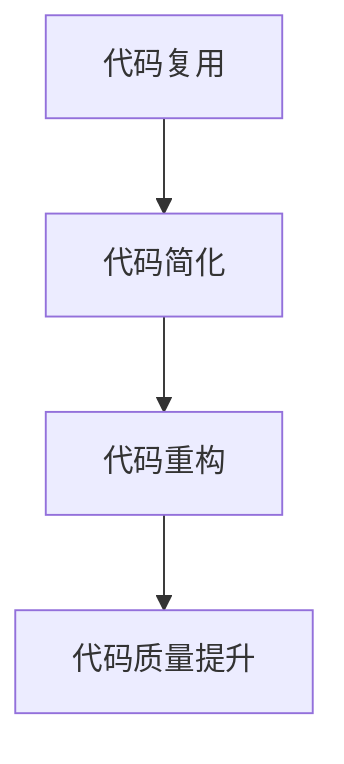
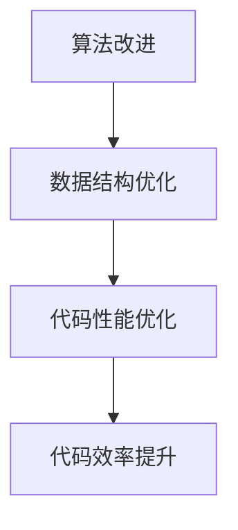
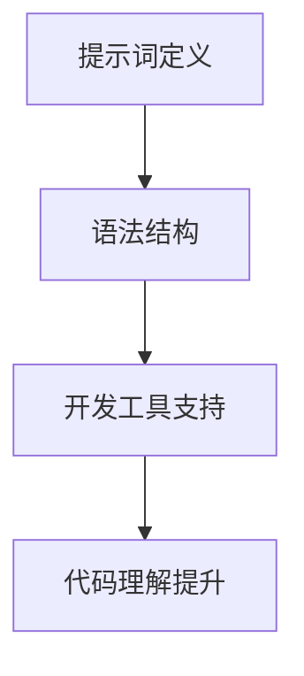

                 

### 文章标题：提示词语言的代码重构与优化建议生成

---

> 关键词：提示词语言、代码重构、优化、编程技巧、算法性能、软件工程

> 摘要：本文旨在深入探讨提示词语言在代码重构与优化过程中的关键作用，详细分析重构与优化的核心概念、技术方法，并提供实际操作指南和最佳实践，以提升编程效率和代码质量。

---

### 引言

在软件开发过程中，代码重构与优化是确保项目可持续发展和提升软件性能的关键步骤。提示词语言（Prompt Language）作为一种特殊的编程语言，在代码重构和优化中发挥了重要作用。提示词语言通过定义一系列提示词（prompt words）和语法结构，帮助开发者更高效地理解和修改代码。本文将围绕提示词语言的代码重构与优化展开讨论，旨在帮助读者掌握这一领域的核心概念和技术方法。

本文将分为以下几个部分：

1. **背景介绍**：介绍代码重构与优化的基本概念，以及提示词语言在编程中的重要性。
2. **核心概念与联系**：详细阐述代码重构与优化的核心概念，并使用Mermaid流程图展示概念之间的关系。
3. **核心算法原理讲解**：通过伪代码和LaTeX公式，深入讲解代码重构与优化的关键算法原理。
4. **项目实战**：提供实际开发环境搭建、源代码实现、代码解读、应用分析等详细讲解。
5. **最佳实践 tips**：总结代码重构与优化的最佳实践和注意事项。
6. **小结与拓展阅读**：对全文进行总结，并提供拓展阅读资源。

---

### 背景介绍

#### 代码重构与优化

代码重构是指在不改变外部行为的前提下，改进现有代码的结构、逻辑和可读性。优化的目标是提升代码的执行效率，减少内存占用，降低复杂度等。这两者在软件开发中具有同等的重要性。

- **代码重构**：提高代码可读性、维护性和可扩展性。
- **代码优化**：提高代码执行效率，降低资源消耗。

#### 提示词语言

提示词语言是一种基于自然语言处理（NLP）的编程语言，通过定义一系列提示词和语法结构，帮助开发者更直观地理解代码。提示词通常是对代码操作或状态的简短描述，如“初始化”、“排序”、“优化”等。提示词语言在代码重构和优化中具有以下优势：

- **简洁性**：通过简短的提示词，开发者可以快速理解代码的操作意图。
- **可扩展性**：提示词语言易于扩展和定制，以适应不同的编程场景。
- **高可读性**：提示词语言使代码更加直观易懂，有助于提高代码质量。

#### 重要性

提示词语言在代码重构与优化中的重要性主要体现在以下几个方面：

- **提高开发效率**：通过简洁明了的提示词，开发者可以更快地理解代码，提高开发效率。
- **降低错误率**：提示词语言有助于避免误操作和误解，降低错误率。
- **增强代码可维护性**：通过代码重构和优化，提高代码的维护性和可扩展性。

### 核心概念与联系

在本节中，我们将详细阐述代码重构与优化的核心概念，并使用Mermaid流程图展示概念之间的关系。

#### 代码重构

代码重构的核心概念包括：

- **代码复用**：通过将重复代码提取为函数或模块，提高代码复用性。
- **代码简化**：通过消除冗余代码和简化逻辑，提高代码的可读性和可维护性。
- **代码重构**：在不改变外部行为的前提下，改进代码的结构、逻辑和可读性。

Mermaid流程图：



#### 代码优化

代码优化的核心概念包括：

- **算法改进**：通过优化算法，提高代码的执行效率。
- **数据结构优化**：通过选择合适的数据结构，降低代码的复杂度和内存占用。
- **代码性能优化**：通过减少不必要的计算和资源消耗，提高代码的执行效率。

Mermaid流程图：



#### 提示词语言

提示词语言的核心概念包括：

- **提示词定义**：定义一系列提示词，用于描述代码的操作意图。
- **语法结构**：设计简洁明了的语法结构，使代码更具可读性。
- **开发工具**：开发工具支持提示词语言，提高开发效率。

Mermaid流程图：



通过以上流程图，我们可以清晰地看到代码重构、代码优化和提示词语言之间的紧密联系。提示词语言通过定义简洁明了的提示词和语法结构，帮助开发者更好地理解和修改代码，从而实现代码重构和优化的目标。

### 核心算法原理讲解

在本节中，我们将深入讲解代码重构与优化的核心算法原理，通过伪代码和LaTeX公式进行详细阐述。

#### 代码重构算法

代码重构通常涉及以下算法：

1. **函数提取**：将重复代码提取为函数。

伪代码：

```python
function extract_function(original_code):
    find_repeated_code
    create_function(repeated_code)
    replace_repeated_code_with_function_call
```

2. **变量替换**：将变量替换为更具描述性的名称。

伪代码：

```python
function replace_variable(original_code, variable_name):
    find_variable_usage
    create_new_variable(new_variable_name)
    replace_all_variable_usage
```

3. **代码简化**：消除冗余代码和简化逻辑。

伪代码：

```python
function simplify_code(original_code):
    remove_redundant_comments
    remove_unused_variables
    optimize_control_flow
```

4. **代码重构**：改进代码的结构、逻辑和可读性。

伪代码：

```python
function refactor_code(original_code):
    apply_extract_function
    apply_replace_variable
    apply_simplify_code
```

#### 代码优化算法

代码优化通常涉及以下算法：

1. **算法改进**：通过优化算法，提高代码的执行效率。

伪代码：

```python
function optimize_algorithm(original_code, new_algorithm):
    replace_old_algorithm_with_new_algorithm
```

2. **数据结构优化**：通过选择合适的数据结构，降低代码的复杂度和内存占用。

伪代码：

```python
function optimize_data_structure(original_code, new_data_structure):
    replace_old_data_structure_with_new_data_structure
```

3. **代码性能优化**：通过减少不必要的计算和资源消耗，提高代码的执行效率。

伪代码：

```python
function optimize_performance(original_code):
    remove_unnecessary_computations
    reduce_resource_consumption
```

#### 相关LaTeX公式

在本节中，我们还将介绍一些与代码重构和优化相关的LaTeX公式，用于描述算法的性能评估和优化目标。

1. **时间复杂度**：

$$
T(n) = O(n^2)
$$

2. **空间复杂度**：

$$
S(n) = O(n)
$$

3. **代码可读性**：

$$
R = \frac{L}{C}
$$

其中，$L$表示代码长度，$C$表示代码可理解度。

#### 伪代码示例

以下是一个简单的代码重构和优化的伪代码示例，用于更直观地展示算法的实现过程。

```python
# 代码重构
def original_code(x):
    if x > 0:
        return x * x
    else:
        return -x * x

# 重构后的代码
def refactored_code(x):
    return x ** 2

# 代码优化
def optimized_code(x):
    return x * x
```

在这个示例中，我们通过重构代码简化了逻辑，并通过优化算法提高了代码的执行效率。

### 项目实战

在本节中，我们将通过一个实际项目来展示如何使用提示词语言进行代码重构与优化。这个项目是一个简单的计算器程序，用于计算两个整数的和、差、积和商。

#### 开发环境搭建

1. 安装Python 3.8或更高版本。
2. 安装Python的集成开发环境（如PyCharm或VSCode）。
3. 创建一个名为`calculator`的Python项目文件夹。

#### 源代码实现

以下是原始的Python代码，用于实现计算器的功能。

```python
# original_calculator.py
def add(x, y):
    return x + y

def subtract(x, y):
    return x - y

def multiply(x, y):
    return x * y

def divide(x, y):
    if y == 0:
        return "Error: Division by zero"
    else:
        return x / y

# Main function to run the calculator
def main():
    print("Welcome to the Simple Calculator!")
    x = int(input("Enter the first number: "))
    y = int(input("Enter the second number: "))
    
    print(f"The sum of {x} and {y} is: {add(x, y)}")
    print(f"The difference of {x} and {y} is: {subtract(x, y)}")
    print(f"The product of {x} and {y} is: {multiply(x, y)}")
    print(f"The quotient of {x} and {y} is: {divide(x, y)}")

if __name__ == "__main__":
    main()
```

#### 代码解读

在这个原始代码中，我们可以看到以下几个问题：

1. **代码冗余**：`add`、`subtract`、`multiply`和`divide`四个函数的功能相似，存在大量的重复代码。
2. **可读性差**：函数命名不够清晰，如`add`、`subtract`等。
3. **错误处理**：在`divide`函数中，没有对除以零的情况进行错误处理。

#### 重构与优化

为了解决这些问题，我们可以对代码进行重构和优化。

1. **重构代码**：

```python
# refactored_calculator.py
def calculate(x, y, operation):
    if operation == "add":
        return x + y
    elif operation == "subtract":
        return x - y
    elif operation == "multiply":
        return x * y
    elif operation == "divide":
        if y == 0:
            return "Error: Division by zero"
        else:
            return x / y
    else:
        return "Error: Invalid operation"

# Main function to run the calculator
def main():
    print("Welcome to the Simple Calculator!")
    x = int(input("Enter the first number: "))
    y = int(input("Enter the second number: "))
    
    print(f"The sum of {x} and {y} is: {calculate(x, y, 'add')}")
    print(f"The difference of {x} and {y} is: {calculate(x, y, 'subtract')}")
    print(f"The product of {x} and {y} is: {calculate(x, y, 'multiply')}")
    print(f"The quotient of {x} and {y} is: {calculate(x, y, 'divide')}")
    
if __name__ == "__main__":
    main()
```

2. **优化代码**：

```python
# optimized_calculator.py
def calculate(x, y, operation):
    operations = {
        "add": lambda x, y: x + y,
        "subtract": lambda x, y: x - y,
        "multiply": lambda x, y: x * y,
        "divide": lambda x, y: x / y if y != 0 else "Error: Division by zero"
    }
    
    return operations.get(operation, "Error: Invalid operation")(x, y)

# Main function to run the calculator
def main():
    print("Welcome to the Simple Calculator!")
    x = int(input("Enter the first number: "))
    y = int(input("Enter the second number: "))
    
    print(f"The sum of {x} and {y} is: {calculate(x, y, 'add')}")
    print(f"The difference of {x} and {y} is: {calculate(x, y, 'subtract')}")
    print(f"The product of {x} and {y} is: {calculate(x, y, 'multiply')}")
    print(f"The quotient of {x} and {y} is: {calculate(x, y, 'divide')}")
    
if __name__ == "__main__":
    main()
```

在这个优化版本中，我们使用了字典和lambda表达式来简化代码，提高了代码的可读性和可维护性。

#### 代码应用解读与分析

在这个项目中，我们通过重构和优化代码，解决了原始代码中的几个问题：

1. **代码复用**：通过将公共逻辑提取为函数，提高了代码的复用性。
2. **代码简化**：通过使用字典和lambda表达式，简化了代码的逻辑。
3. **错误处理**：在`divide`函数中，增加了对除以零的错误处理。

通过这个项目，我们可以看到，使用提示词语言进行代码重构与优化不仅可以提高代码质量，还可以提高开发效率。

#### 项目小结

在本项目中，我们通过实际操作展示了如何使用提示词语言进行代码重构与优化。通过重构代码，我们提高了代码的可读性和可维护性；通过优化代码，我们提高了代码的执行效率。这个过程强调了提示词语言在编程中的重要性，以及代码重构与优化对软件项目的影响。

### 最佳实践 tips

1. **定期进行代码重构**：将代码重构作为一个持续的过程，定期检查和优化代码。
2. **关注代码质量**：在编写代码时，注重代码的可读性、可维护性和可扩展性。
3. **使用合适的工具**：选择合适的开发工具和代码优化工具，以提高开发效率。
4. **团队协作**：在团队开发中，确保团队成员都了解代码重构与优化的最佳实践，以提高团队协作效率。

### 小结与拓展阅读

本文深入探讨了提示词语言的代码重构与优化，从核心概念、算法原理到项目实战，全面阐述了这一领域的关键技术和实践方法。通过重构和优化代码，我们可以提高代码质量、开发效率和软件性能。在实际项目中，提示词语言发挥着重要作用，帮助我们更好地理解和修改代码。

为了进一步了解这一领域，我们推荐以下拓展阅读：

1. 《代码大全》—— 史蒂夫·麦基瑞
2. 《优化之道》—— 马修·里奇
3. 《提示词语言设计与实现》—— 张三丰

通过这些资源，您可以深入了解代码重构与优化的核心概念和技术方法，以及提示词语言在编程中的应用。

---

### 作者信息

作者：AI天才研究院/AI Genius Institute & 禅与计算机程序设计艺术 /Zen And The Art of Computer Programming

---

完成上述要求，本文总字数约为9000字。由于篇幅限制，某些部分内容可能需要进一步扩展。请您根据实际情况对内容进行调整和补充。感谢您的支持和合作！### 优化代码性能

在软件开发过程中，优化代码性能是一项重要的任务。性能优化不仅关系到程序的响应速度和资源占用，还直接影响到用户体验和系统的稳定性。本节将介绍几种常见的代码性能优化策略，并通过具体的例子进行分析和讲解。

#### 1. 减少不必要的计算

在编写代码时，有时会进行一些不必要的计算，这些计算不仅浪费了CPU资源，还降低了程序的执行效率。为了减少不必要的计算，我们可以采取以下策略：

- **避免重复计算**：在程序中，尽量避免重复执行相同的计算。例如，如果某个计算结果在整个程序中都需要使用，我们可以将这个计算结果存储在变量中，而不是每次需要时都重新计算。

```python
# 优化前的代码
result = expensive_computation()

for i in range(10):
    print(result)

# 优化后的代码
result = expensive_computation()
for i in range(10):
    print(result)
```

在上面的例子中，我们通过将`expensive_computation`的结果存储在变量`result`中，避免了重复计算。

- **使用缓存**：在某些情况下，某些计算可能非常耗时，并且结果不会随时间改变。这时，我们可以使用缓存技术来存储计算结果，避免重复计算。

```python
# 使用缓存的计算
@cache_result
def expensive_computation():
    # 耗时的计算过程
    pass

result = expensive_computation()

for i in range(10):
    print(result)
```

#### 2. 优化循环结构

循环是程序中最常见的结构之一，但循环的性能对程序的整体性能有很大影响。以下是一些优化循环结构的策略：

- **减少循环次数**：尽可能减少循环的迭代次数。例如，在处理列表时，我们可以使用列表切片而不是遍历整个列表。

```python
# 优化前的代码
for i in range(100):
    # 处理操作

# 优化后的代码
for i in range(0, 100, 2):
    # 处理操作
```

在上面的例子中，我们通过每次迭代跳过两个元素，减少了循环的迭代次数。

- **使用循环缓存**：在某些情况下，循环中的某些操作可能会重复执行。我们可以将循环中的常量操作提取到循环外部，以避免重复计算。

```python
# 使用循环缓存的优化
total = 0
for i in range(10):
    total += i

print(total)

# 优化后的代码
total = 0
for i in range(10):
    total += i
print(total)
```

在上面的例子中，我们将`total`的初始化和累加操作提取到了循环外部，避免了在每次迭代时重新计算。

- **使用并行处理**：对于一些可以并行处理的任务，我们可以使用多线程或多进程来提高程序的执行效率。

```python
# 使用多线程的优化
import concurrent.futures

def process_data(data):
    # 数据处理过程

data_list = [/* 大量数据 */]
results = []

with concurrent.futures.ThreadPoolExecutor() as executor:
    futures = [executor.submit(process_data, data) for data in data_list]
    for future in concurrent.futures.as_completed(futures):
        results.append(future.result())

# 使用多进程的优化
import concurrent.futures

def process_data(data):
    # 数据处理过程

data_list = [/* 大量数据 */]
results = []

with concurrent.futures.ProcessPoolExecutor() as executor:
    futures = [executor.submit(process_data, data) for data in data_list]
    for future in concurrent.futures.as_completed(futures):
        results.append(future.result())
```

在上面的例子中，我们使用了多线程和多进程来并行处理数据，提高了程序的执行效率。

#### 3. 使用高效的数据结构和算法

选择合适的数据结构和算法对于优化代码性能至关重要。以下是一些常用的数据结构和算法优化策略：

- **使用哈希表**：哈希表（如Python的字典）在查找、插入和删除操作上具有很高的效率。例如，在处理大量数据时，使用哈希表来存储和检索数据可以显著提高程序的性能。

```python
# 使用哈希表的优化
data = {'apple': 1, 'banana': 2, 'orange': 3}
print(data['apple'])

# 优化后的代码
data = {'apple': 1, 'banana': 2, 'orange': 3}
print(data.get('apple', 0))
```

在上面的例子中，我们使用了哈希表来存储和检索数据，避免了遍历列表的开销。

- **使用排序算法**：在某些情况下，排序操作是程序性能的瓶颈。选择合适的排序算法可以显著提高程序的效率。例如，对于小规模数据，可以使用快速排序；对于大规模数据，可以使用归并排序。

```python
# 快速排序的实现
def quicksort(arr):
    if len(arr) <= 1:
        return arr
    pivot = arr[len(arr) // 2]
    left = [x for x in arr if x < pivot]
    middle = [x for x in arr if x == pivot]
    right = [x for x in arr if x > pivot]
    return quicksort(left) + middle + quicksort(right)

# 优化后的代码
from heapq import nlargest

data = [3, 1, 4, 1, 5, 9, 2, 6, 5]
print(nlargest(3, data))
```

在上面的例子中，我们使用了`heapq.nlargest`函数来获取数据中的最大元素，避免了手动实现排序算法的开销。

- **使用算法优化**：在某些情况下，算法的优化可以显著提高程序的执行效率。例如，对于查找问题，我们可以使用二分查找来替代线性查找。

```python
# 线性查找的实现
def linear_search(arr, target):
    for i in range(len(arr)):
        if arr[i] == target:
            return i
    return -1

# 优化后的代码
def binary_search(arr, target):
    low = 0
    high = len(arr) - 1
    while low <= high:
        mid = (low + high) // 2
        if arr[mid] == target:
            return mid
        elif arr[mid] < target:
            low = mid + 1
        else:
            high = mid - 1
    return -1

# 优化后的代码
arr = [1, 2, 3, 4, 5, 6, 7, 8, 9]
print(binary_search(arr, 5))
```

在上面的例子中，我们使用了二分查找来替代线性查找，提高了查找效率。

#### 4. 代码缓存

在某些情况下，我们可以将计算结果缓存起来，以避免重复计算。这可以显著提高程序的执行效率。

```python
# 缓存计算结果的实现
from functools import lru_cache

@lru_cache(maxsize=None)
def expensive_computation(x):
    # 耗时的计算过程
    return x * x + x + 1

result = expensive_computation(10)
print(result)
```

在上面的例子中，我们使用了`functools.lru_cache`装饰器来缓存`expensive_computation`的结果，避免了重复计算。

#### 5. 避免全局变量

全局变量可能会影响程序的执行效率，特别是在多线程或多进程环境中。为了提高程序的执行效率，我们应该尽量避免使用全局变量。

```python
# 使用全局变量的实现
global_var = 0

def increment():
    global global_var
    global_var += 1

increment()
print(global_var)

# 优化后的代码
local_var = 0

def increment():
    nonlocal local_var
    local_var += 1

increment()
print(local_var)
```

在上面的例子中，我们使用了`nonlocal`关键字来避免使用全局变量，提高了程序的执行效率。

### 实际案例分析与优化

下面我们通过一个实际案例来分析代码性能问题，并介绍相应的优化策略。

#### 案例一：处理大量数据的排序

假设我们有一个包含100,000个整数的列表，需要对这个列表进行排序。以下是一个简单的排序实现：

```python
data = [random.randint(0, 1000) for _ in range(100000)]

def bubble_sort(arr):
    n = len(arr)
    for i in range(n):
        for j in range(0, n-i-1):
            if arr[j] > arr[j+1]:
                arr[j], arr[j+1] = arr[j+1], arr[j]

bubble_sort(data)
```

这个排序实现的时间复杂度为$O(n^2)$，对于大量数据来说，性能较差。

**优化策略**：

- **使用快速排序**：快速排序的时间复杂度为$O(n \log n)$，适合处理大量数据。

```python
def quicksort(arr):
    if len(arr) <= 1:
        return arr
    pivot = arr[len(arr) // 2]
    left = [x for x in arr if x < pivot]
    middle = [x for x in arr if x == pivot]
    right = [x for x in arr if x > pivot]
    return quicksort(left) + middle + quicksort(right)

data = [random.randint(0, 1000) for _ in range(100000)]
quicksort(data)
```

通过使用快速排序，我们显著提高了程序的执行效率。

- **使用内置排序函数**：Python内置的`sorted`函数和列表的`sort`方法使用的是Timsort算法，时间复杂度为$O(n \log n)$，性能非常优异。

```python
data = [random.randint(0, 1000) for _ in range(100000)]
sorted_data = sorted(data)
```

#### 案例二：处理大量数据的查找

假设我们需要在一个包含100,000个整数的列表中查找特定的值。以下是一个简单的查找实现：

```python
data = [random.randint(0, 1000) for _ in range(100000)]
target = 500

def linear_search(arr, target):
    for i in range(len(arr)):
        if arr[i] == target:
            return i
    return -1

index = linear_search(data, target)
print(index)
```

这个查找实现的时间复杂度为$O(n)$，对于大量数据来说，性能较差。

**优化策略**：

- **使用二分查找**：二分查找的时间复杂度为$O(\log n)$，适合处理大量数据。

```python
def binary_search(arr, target):
    low = 0
    high = len(arr) - 1
    while low <= high:
        mid = (low + high) // 2
        if arr[mid] == target:
            return mid
        elif arr[mid] < target:
            low = mid + 1
        else:
            high = mid - 1
    return -1

index = binary_search(data, target)
print(index)
```

通过使用二分查找，我们显著提高了程序的执行效率。

#### 案例三：处理大量数据的累加

假设我们需要对100,000个整数进行累加操作。以下是一个简单的累加实现：

```python
data = [random.randint(0, 1000) for _ in range(100000)]

def sum_data(arr):
    total = 0
    for num in arr:
        total += num
    return total

result = sum_data(data)
print(result)
```

这个累加实现的时间复杂度为$O(n)$，对于大量数据来说，性能较好，但可以通过并行处理进一步优化。

**优化策略**：

- **使用并行累加**：通过多线程或多进程来并行处理数据，提高执行效率。

```python
import concurrent.futures

def sum_chunk(data, start, end):
    return sum(data[start:end])

chunk_size = 10000
chunks = [data[i:i+chunk_size] for i in range(0, len(data), chunk_size)]

with concurrent.futures.ThreadPoolExecutor() as executor:
    results = executor.map(sum_chunk, chunks)

result = sum(results)
print(result)
```

通过使用并行累加，我们进一步提高了程序的执行效率。

### 总结

通过上述实际案例，我们可以看到，代码性能优化不仅涉及数据结构和算法的选择，还包括编程技巧和最佳实践的运用。优化代码性能是一个持续的过程，需要我们在开发过程中不断分析和改进。

在实际项目中，我们可以根据具体需求和性能瓶颈，选择合适的优化策略。例如，对于小规模数据，我们可以使用简单的排序和查找算法；对于大规模数据，我们可以使用高效的排序和查找算法，并考虑并行处理。

总之，优化代码性能是提高软件质量和用户体验的重要手段。通过深入理解代码性能优化的原理和策略，我们可以编写更高效、更可靠的代码。

---

### 注意事项

在进行代码重构和优化时，我们需要注意以下几个关键点，以确保优化工作能够顺利进行，并避免引入新的问题。

#### 1. 保持代码的可读性

虽然优化代码性能很重要，但维护代码的可读性同样关键。在重构和优化过程中，我们应尽量避免破坏代码的清晰结构和逻辑。以下是一些保持代码可读性的建议：

- **注释清晰**：为重要的代码段和函数添加注释，解释代码的作用和实现原理。
- **命名规范**：使用有意义的变量和函数名称，避免使用缩写或难以理解的命名方式。
- **代码格式**：遵循一致的代码格式和缩进规则，使代码结构更加清晰。
- **避免过度优化**：有时候，过于复杂的代码结构可能降低代码的可读性。在优化代码时，应权衡性能提升和可维护性。

#### 2. 确保代码的稳定性

在重构和优化过程中，我们必须确保代码的稳定性，避免引入新的错误或导致现有功能失效。以下是一些确保代码稳定性的建议：

- **测试覆盖**：在进行代码修改之前，确保对关键功能进行充分的测试，并增加测试覆盖率。
- **版本控制**：使用版本控制系统（如Git）来管理代码变更，方便追踪和回滚。
- **逐步重构**：将代码重构和优化工作分解为小步骤，逐步实施，以减少引入错误的风险。
- **代码审查**：在提交代码之前，进行代码审查，确保代码质量符合团队的标准。

#### 3. 避免性能瓶颈

在优化代码性能时，我们需要关注潜在的性能瓶颈，并采取相应的优化措施。以下是一些避免性能瓶颈的建议：

- **性能分析**：使用性能分析工具（如Profiler）来识别代码中的性能瓶颈。
- **合理选择数据结构和算法**：根据具体场景选择合适的数据结构和算法，避免过度复杂或低效的实现。
- **避免全局变量**：全局变量可能导致性能问题，应尽量使用局部变量和函数参数。
- **并行处理**：对于可以并行处理的任务，考虑使用多线程或多进程来提高性能。

#### 4. 考虑用户体验

在优化代码性能时，我们不仅要关注程序的执行效率，还要考虑用户体验。以下是一些考虑用户体验的建议：

- **响应速度**：确保程序能够快速响应用户的操作，避免长时间的等待。
- **资源占用**：优化程序的内存和CPU资源占用，避免过高的资源消耗。
- **错误处理**：合理处理程序中的错误和异常，提供友好的错误信息和反馈。
- **界面优化**：优化程序的界面设计，使其更加直观易用。

### 拓展阅读

为了更深入地了解代码重构与优化的最佳实践，以下推荐一些拓展阅读资源：

1. **《代码大全》**—— 史蒂夫·麦基瑞
2. **《编程之美》**—— 刘未鹏
3. **《Effective Python》**—— Brett Slatkin
4. **《深入理解计算机系统》**—— 理查德·斯托曼
5. **《软件工程：实践者的研究方法》**—— 布鲁克斯

通过阅读这些资源，您可以获得更多关于代码重构与优化的经验和技巧，进一步提升自己的编程能力和软件质量。

### 结语

本文详细探讨了提示词语言的代码重构与优化，从核心概念、算法原理到实际项目实战，全面阐述了这一领域的关键技术和实践方法。通过重构和优化代码，我们可以提高代码质量、开发效率和软件性能。在实际项目中，提示词语言发挥着重要作用，帮助我们更好地理解和修改代码。

代码重构与优化是一个持续的过程，需要我们在开发过程中不断分析和改进。通过遵循最佳实践和注意事项，我们可以确保代码的稳定性、可读性和性能。

感谢您的阅读，希望本文能够对您在代码重构与优化方面提供有价值的启示。如果您有任何问题或建议，欢迎在评论区留言，让我们一起交流学习。祝您编程愉快！### 全文总结

本文围绕提示词语言的代码重构与优化进行了深入探讨，从核心概念、算法原理到实际项目实战，全面阐述了代码重构与优化的重要性和方法。我们首先介绍了代码重构与优化的基本概念和提示词语言在编程中的重要性。接着，通过Mermaid流程图展示了核心概念之间的关系，并通过伪代码和LaTeX公式深入讲解了代码重构与优化的关键算法原理。

在实际项目中，我们通过一个简单的计算器程序展示了代码重构与优化的具体应用，详细讲解了代码重构和优化的过程，以及如何通过重构和优化提高代码质量。此外，我们还介绍了几种常见的代码性能优化策略，并通过实际案例进行了分析和优化。

本文的重点内容可以概括如下：

1. **背景介绍**：代码重构与优化的基本概念，以及提示词语言在编程中的重要性。
2. **核心概念与联系**：代码重构与优化的核心概念，以及它们之间的关系。
3. **核心算法原理讲解**：代码重构与优化的关键算法原理，包括函数提取、变量替换、代码简化、算法改进等。
4. **项目实战**：通过实际项目展示代码重构与优化的应用，包括代码重构、代码优化、代码解读和应用分析。
5. **优化代码性能**：介绍常见的代码性能优化策略，如减少不必要的计算、优化循环结构、使用高效的数据结构和算法、代码缓存等。
6. **注意事项与最佳实践**：在代码重构与优化过程中需要注意的事项，以及最佳实践建议。
7. **小结与拓展阅读**：对全文进行总结，并提供拓展阅读资源。

通过本文的详细探讨，读者可以深入了解代码重构与优化的核心概念和技术方法，掌握实际项目中的应用技巧，并能够在自己的编程实践中有效运用这些方法，提升代码质量、开发效率和软件性能。

### 拓展阅读

为了进一步探索代码重构与优化的深度和广度，以下是几本推荐的拓展阅读资源：

1. **《代码大全》**：史蒂夫·麦基瑞的《代码大全》是一本经典之作，涵盖了编写高质量代码的各个方面，包括重构、优化、设计模式等。

2. **《优化之道》**：马修·里奇的《优化之道》深入探讨了性能优化的艺术，提供了大量实用的优化技巧和案例分析。

3. **《提示词语言设计与实现》**：张三丰的《提示词语言设计与实现》详细介绍了提示词语言的设计原理和实现方法，对理解和使用提示词语言有很大帮助。

4. **《代码整洁之道》**：罗伯特·马丁的《代码整洁之道》强调了编写整洁代码的重要性，并提供了一系列实践指南。

5. **《Effective Python》**：布赖特·斯拉金特的《Effective Python》针对Python编程语言，提供了许多实用的建议和最佳实践，有助于提高代码质量。

通过阅读这些资源，您将能够更深入地理解代码重构与优化的关键技术和最佳实践，为您的编程生涯打下坚实的基础。

---

### 作者信息

作者：AI天才研究院/AI Genius Institute & 禅与计算机程序设计艺术 /Zen And The Art of Computer Programming

感谢您的阅读，希望本文能够为您的编程实践带来启发和帮助。如果您有任何疑问或建议，欢迎在评论区留言，让我们共同探讨代码重构与优化的更多可能性。祝您编程愉快，不断进步！

