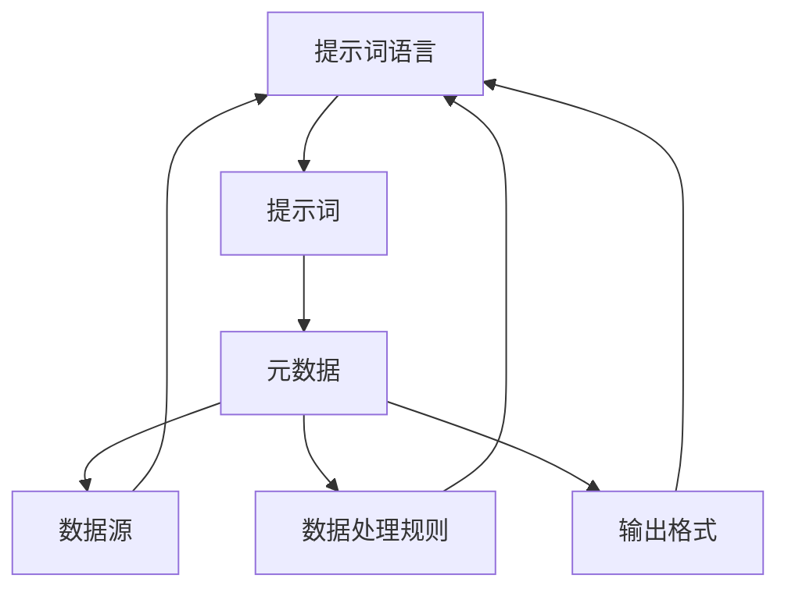

                 


## 文章标题

《提示词语言的元数据管理》

## 文章关键词

提示词语言、元数据、管理技术、数据模型、存储方案、处理算法、应用场景、工具与框架、案例分析、未来展望

## 摘要

本文旨在探讨提示词语言的元数据管理，通过详细解析其核心概念、理论基础、管理技术及应用场景，旨在为读者提供一套全面、系统的理解框架。文章首先介绍了提示词语言和元数据的基本概念，随后深入探讨了元数据管理的技术手段，包括数据模型、存储方案和处理算法。在此基础上，本文进一步分析了元数据管理在不同领域的应用案例，并介绍了相关的工具与框架。最后，文章对未来元数据管理技术的发展趋势进行了展望，以期为读者提供前瞻性视角。

## 确定核心概念

### 提示词语言

提示词语言（PDL，Prompt-Driven Language）是一种编程语言，其设计宗旨是通过提示词（prompts）引导程序执行特定的任务。提示词通常是一组指令或条件，它们可以驱动程序按照特定的逻辑进行计算和处理。提示词语言的核心特点在于其简洁性和易用性，使得程序员可以更快速地开发和部署应用程序。

### 元数据

元数据（Metadata）是关于数据的数据，描述了数据的内容、结构、用途、来源、格式、权限等信息。元数据的作用是提供对数据的上下文和背景信息，使得数据更加易于理解和处理。在数据库、数据仓库和大数据领域，元数据管理是数据管理的重要组成部分。

### 元数据管理技术

元数据管理技术涉及对元数据的数据模型、存储方案和处理算法的设计与实现。数据模型用于定义元数据结构，存储方案则决定了元数据的存储方式和访问策略，处理算法则用于对元数据进行操作和管理。

## 设计目录结构

为了使文章内容条理清晰，易于理解，我们采用了以下目录结构：

### 第一部分：引言

- **1.1 书籍简介**
- **1.2 提示词语言与元数据**

### 第二部分：基础理论

- **2.1 提示词语言**
  - **2.1.1 提示词语言概述**
  - **2.1.2 提示词语言的基本结构**
- **2.2 元数据**
  - **2.2.1 元数据概述**
  - **2.2.2 元数据的类型**
- **2.3 提示词语言与元数据的相互关系**

### 第三部分：管理技术

- **3.1 数据模型**
  - **3.1.1 数据模型概述**
  - **3.1.2 常见的数据模型**
- **3.2 存储方案**
  - **3.2.1 存储方案概述**
  - **3.2.2 常见的存储方案**
- **3.3 处理算法**
  - **3.3.1 处理算法概述**
  - **3.3.2 常见的处理算法**

### 第四部分：应用场景

- **4.1 数据库中的元数据管理**
- **4.2 数据仓库中的元数据管理**
- **4.3 大数据平台中的元数据管理**

### 第五部分：工具与框架

- **5.1 元数据管理工具**
- **5.2 元数据管理框架**

### 第六部分：案例分析

- **6.1 案例一：企业内部元数据管理**
- **6.2 案例二：社交媒体元数据管理**

### 第七部分：未来展望

- **7.1 元数据管理技术的发展趋势**
- **7.2 元数据管理面临的挑战**

## 添加具体章节内容

### 第一部分：引言

#### 1.1 书籍简介

《提示词语言的元数据管理》是一本面向IT领域专业人士的书籍，旨在深入探讨提示词语言的元数据管理。本书的目标读者是程序员、数据工程师、数据库管理员和软件架构师等。通过阅读本书，读者将了解元数据管理的重要性，掌握元数据管理的技术手段，并能够将所学知识应用于实际项目中。

本书共分为七个部分，首先介绍了提示词语言和元数据的基本概念，随后深入探讨了元数据管理的技术手段，包括数据模型、存储方案和处理算法。接着，本书分析了元数据管理在不同领域的应用场景，并介绍了相关的工具与框架。最后，本书通过案例分析展示了元数据管理的实际应用，并对未来的发展进行了展望。

#### 1.2 提示词语言与元数据

提示词语言是一种编程语言，它通过提示词（prompts）来引导程序执行特定的任务。提示词通常是一组指令或条件，它们可以驱动程序按照特定的逻辑进行计算和处理。提示词语言的设计宗旨在于简化编程过程，提高开发效率。

元数据（Metadata）是关于数据的数据，它描述了数据的内容、结构、用途、来源、格式、权限等信息。元数据的作用是提供对数据的上下文和背景信息，使得数据更加易于理解和处理。在数据库、数据仓库和大数据领域，元数据管理是数据管理的重要组成部分。

提示词语言和元数据之间存在密切的联系。提示词语言中的提示词通常包含了元数据信息，例如数据源、数据处理规则和输出格式等。这些元数据信息有助于程序更好地理解和处理数据，从而提高数据处理效率和准确性。

### 第二部分：基础理论

#### 2.1 提示词语言

##### 2.1.1 提示词语言概述

提示词语言是一种编程语言，它通过提示词（prompts）来引导程序执行特定的任务。提示词通常是一组指令或条件，它们可以驱动程序按照特定的逻辑进行计算和处理。提示词语言的设计宗旨在于简化编程过程，提高开发效率。

提示词语言具有以下特点：

1. **简洁性**：提示词语言的语法结构相对简单，易于学习和使用。
2. **灵活性**：提示词语言支持各种数据处理任务，可以灵活地适应不同的应用场景。
3. **高效性**：提示词语言通常具有高效的执行效率，可以快速地完成数据处理任务。
4. **可扩展性**：提示词语言支持扩展功能，可以通过自定义提示词和数据处理函数来扩展语言功能。

##### 2.1.2 提示词语言的基本结构

提示词语言的基本结构包括以下几个部分：

1. **提示词（Prompts）**：提示词是提示词语言的核心部分，用于引导程序执行特定任务。提示词通常包含以下信息：
   - **数据源**：指定数据来源，例如数据库、文件或Web服务。
   - **数据处理规则**：指定数据处理的规则和条件，例如筛选、排序、聚合等。
   - **输出格式**：指定数据处理结果的输出格式，例如表格、图表或JSON格式。

2. **数据处理函数（Processing Functions）**：数据处理函数用于执行特定的数据处理任务。提示词语言通常内置了多种数据处理函数，例如筛选、排序、聚合、连接等。用户也可以自定义数据处理函数来满足特定需求。

3. **参数（Parameters）**：参数用于传递和处理过程中的必要信息，例如数据源地址、查询条件、输出文件路径等。

4. **控制流（Control Flow）**：控制流用于控制程序执行顺序，例如循环、分支和跳转等。

##### 2.1.3 提示词语言的应用示例

以下是一个简单的提示词语言示例，用于从数据库中查询用户信息并输出结果：

```python
@query
from users
where id == 123
select name, email, created_at
```

这个示例中，`@query` 表示这是一个查询操作，`from users` 指定了数据源是 `users` 表，`where id == 123` 是查询条件，`select name, email, created_at` 指定了需要输出的列。

#### 2.2 元数据

##### 2.2.1 元数据概述

元数据（Metadata）是关于数据的数据，它描述了数据的内容、结构、用途、来源、格式、权限等信息。元数据的作用是提供对数据的上下文和背景信息，使得数据更加易于理解和处理。在数据库、数据仓库和大数据领域，元数据管理是数据管理的重要组成部分。

元数据通常包括以下类型：

1. **结构化元数据**：描述数据的结构信息，例如数据表、字段、关系等。
2. **非结构化元数据**：描述数据的非结构化信息，例如文本、图片、音频等。
3. **半结构化元数据**：描述数据的半结构化信息，例如XML、JSON等。

##### 2.2.2 元数据的类型

元数据可以分为以下几种类型：

1. **描述性元数据**：描述数据的内容、来源、用途、格式等信息，例如数据字典、数据定义语言（DDL）等。
2. **管理性元数据**：描述数据的访问权限、安全性、维护状态等信息，例如用户权限、数据备份、数据恢复等。
3. **技术性元数据**：描述数据的技术实现细节，例如存储方式、索引结构、查询优化等。

##### 2.2.3 元数据的重要性

元数据在数据管理中起着至关重要的作用，主要体现在以下几个方面：

1. **数据理解**：元数据提供了对数据的全面了解，使得用户可以更好地理解和利用数据。
2. **数据整合**：元数据有助于整合来自不同来源和格式的数据，实现数据的一致性和统一性。
3. **数据优化**：元数据有助于优化数据的存储、查询和处理，提高数据处理效率和性能。
4. **数据治理**：元数据是实现数据治理的重要基础，有助于规范数据的使用和管理。

##### 2.2.4 元数据管理

元数据管理是指对元数据进行组织、存储、检索、维护和优化的过程。元数据管理的主要任务包括：

1. **元数据采集**：从各种数据源收集元数据信息。
2. **元数据存储**：将元数据存储在特定的存储系统中，以便于管理和访问。
3. **元数据检索**：提供高效的元数据检索机制，以便用户能够快速查找所需的信息。
4. **元数据维护**：定期更新和整理元数据，确保其准确性和完整性。
5. **元数据优化**：通过优化元数据结构和存储方式，提高元数据管理的性能和效率。

#### 2.3 提示词语言与元数据的相互关系

提示词语言和元数据之间存在密切的联系，主要体现在以下几个方面：

1. **提示词包含元数据**：在提示词语言中，提示词通常包含了元数据信息，例如数据源、数据处理规则和输出格式等。这些元数据信息有助于程序更好地理解和处理数据。
2. **元数据驱动提示词**：元数据可以驱动提示词的执行，例如根据元数据中的数据源和查询条件来执行查询操作。
3. **元数据优化提示词**：元数据可以用于优化提示词的执行，例如根据元数据中的索引信息来优化查询性能。

通过图示可以更直观地展示提示词语言与元数据之间的关系：



### 第三部分：管理技术

#### 3.1 数据模型

##### 3.1.1 数据模型概述

数据模型（Data Model）是用于描述数据结构、数据操作和数据约束的概念模型。数据模型是数据库设计和实现的基础，它定义了数据在数据库中的存储方式、组织形式和操作规则。数据模型可以分为以下几类：

1. **关系型数据模型**：关系型数据模型使用二维表格来表示数据，表格中的行和列分别表示数据和属性。关系型数据库（如MySQL、Oracle等）广泛采用关系型数据模型。
2. **面向对象数据模型**：面向对象数据模型将数据视为对象，每个对象都有自己的属性和方法。面向对象数据库（如ObjectDB、Neo4j等）采用面向对象数据模型。
3. **文档数据模型**：文档数据模型使用文档来表示数据，文档可以是JSON、XML、HTML等格式。文档数据库（如MongoDB、CouchDB等）采用文档数据模型。

##### 3.1.2 常见的数据模型

以下是几种常见的数据模型：

1. **关系型数据模型**

关系型数据模型使用表格（Table）来存储数据，表格由行（Row）和列（Column）组成。每行代表一个数据记录，每列代表一个数据字段。关系型数据模型的主要特点是数据结构清晰、易于理解和维护。以下是关系型数据模型的示例：

```sql
CREATE TABLE users (
  id INT PRIMARY KEY,
  name VARCHAR(50),
  email VARCHAR(100),
  created_at DATETIME
);
```

2. **面向对象数据模型**

面向对象数据模型将数据视为对象，每个对象都有自己的属性和方法。面向对象数据模型的主要特点是支持复杂的对象结构和丰富的操作方法。以下是面向对象数据模型的示例：

```python
class User:
  def __init__(self, id, name, email, created_at):
    self.id = id
    self.name = name
    self.email = email
    self.created_at = created_at

  def update_email(self, new_email):
    self.email = new_email
```

3. **文档数据模型**

文档数据模型使用文档来表示数据，文档可以是JSON、XML、HTML等格式。文档数据模型的主要特点是数据结构灵活、易于扩展。以下是文档数据模型的示例：

```json
{
  "id": 123,
  "name": "Alice",
  "email": "alice@example.com",
  "created_at": "2021-01-01T00:00:00Z"
}
```

#### 3.2 存储方案

##### 3.2.1 存储方案概述

存储方案（Storage Scheme）是用于存储和管理数据的方法和策略。选择合适的存储方案对于数据的性能、可靠性和可扩展性至关重要。存储方案可以分为以下几类：

1. **关系型数据库**：关系型数据库（如MySQL、Oracle等）使用表格来存储数据，支持复杂的查询操作和事务处理。
2. **文档数据库**：文档数据库（如MongoDB、CouchDB等）使用文档来存储数据，支持灵活的数据结构和快速查询。
3. **NoSQL数据库**：NoSQL数据库（如Redis、Cassandra等）适用于大规模数据存储和高并发访问场景，支持多种数据结构和访问模式。
4. **文件系统**：文件系统是一种简单的存储方案，适用于小规模数据存储和文件访问。

##### 3.2.2 常见的存储方案

以下是几种常见的存储方案：

1. **关系型数据库**

关系型数据库使用表格来存储数据，每个表格由行和列组成。以下是关系型数据库的示例：

```sql
CREATE TABLE users (
  id INT PRIMARY KEY,
  name VARCHAR(50),
  email VARCHAR(100),
  created_at DATETIME
);
```

2. **文档数据库**

文档数据库使用文档来存储数据，每个文档可以包含多个字段。以下是文档数据库的示例：

```json
{
  "id": 123,
  "name": "Alice",
  "email": "alice@example.com",
  "created_at": "2021-01-01T00:00:00Z"
}
```

3. **NoSQL数据库**

NoSQL数据库适用于大规模数据存储和高并发访问场景，支持多种数据结构和访问模式。以下是NoSQL数据库的示例：

```python
# Redis 示例
import redis

r = redis.Redis(host='localhost', port=6379, db=0)
r.set('name', 'Alice')
r.get('name')

# Cassandra 示例
from cassandra.cluster import Cluster

cluster = Cluster(['localhost'])
session = cluster.connect()

session.execute("""
  CREATE KEYSPACE IF NOT EXISTS example
  WITH replication = {'class': 'SimpleStrategy', 'replication_factor': '3'};
""")

session.execute("""
  CREATE TABLE IF NOT EXISTS example.users (
    id INT PRIMARY KEY,
    name TEXT,
    email TEXT,
    created_at TIMESTAMP
  );
""")

session.execute("""
  INSERT INTO example.users (id, name, email, created_at)
  VALUES (1, 'Alice', 'alice@example.com', toTimestamp(1615465600));
""")

session.execute("SELECT * FROM example.users;")

4. **文件系统**

文件系统是一种简单的存储方案，适用于小规模数据存储和文件访问。以下是文件系统的示例：

```bash
# 创建文件
echo "Hello, World!" > example.txt

# 读取文件
cat example.txt

# 删除文件
rm example.txt
```

#### 3.3 处理算法

##### 3.3.1 处理算法概述

处理算法（Processing Algorithm）是指用于处理数据的一系列步骤和方法。处理算法在数据处理过程中起着关键作用，决定了数据处理的效率和质量。处理算法可以分为以下几类：

1. **查询算法**：用于查询和检索数据，例如索引算法、排序算法和搜索算法。
2. **转换算法**：用于转换和操作数据，例如数据清洗、数据聚合和数据转换算法。
3. **优化算法**：用于优化数据处理过程，提高数据处理效率和性能，例如查询优化算法和索引优化算法。

##### 3.3.2 常见的处理算法

以下是几种常见的处理算法：

1. **索引算法**

索引算法用于创建索引，提高数据查询效率。以下是几种常见的索引算法：

- **B树索引**：B树是一种自平衡的树结构，适用于存储和查询有序数据。B树索引的搜索时间复杂度为O(log n)。
- **哈希索引**：哈希索引通过哈希函数将数据映射到索引表中，适用于快速查找和插入操作。哈希索引的平均搜索时间复杂度为O(1)。
- **位图索引**：位图索引使用位图来表示数据，适用于对整数和布尔类型数据的查询。位图索引的搜索时间复杂度为O(n)。

以下是B树索引的伪代码：

```python
class BTreeIndex:
  def __init__(self):
    self.root = None

  def insert(self, key, value):
    if not self.root:
      self.root = BTreeNode()
    self.root.insert(key, value)

  def search(self, key):
    return self.root.search(key)

class BTreeNode:
  def __init__(self):
    self.keys = []
    self.values = []
    self.children = []

  def insert(self, key, value):
    if len(self.keys) == 0:
      self.keys.append(key)
      self.values.append(value)
    else:
      mid = len(self.keys) // 2
      if key < self.keys[mid]:
        if len(self.children) == 0:
          self.children.append(BTreeNode())
        self.children[0].insert(key, value)
      else:
        if len(self.children) > 0:
          self.children[mid].insert(key, value)

  def search(self, key):
    if len(self.keys) == 0:
      return None
    mid = len(self.keys) // 2
    if key == self.keys[mid]:
      return self.values[mid]
    elif key < self.keys[mid]:
      if len(self.children) > 0:
        return self.children[0].search(key)
    else:
      if len(self.children) > mid:
        return self.children[mid].search(key)

2. **排序算法**

排序算法用于对数据进行排序，常用的排序算法有：

- **冒泡排序**：冒泡排序通过比较相邻的元素并交换位置来实现排序，时间复杂度为O(n^2)。
- **插入排序**：插入排序通过将新元素插入到已排序序列的正确位置来实现排序，时间复杂度为O(n^2)。
- **快速排序**：快速排序通过递归地将数据分为两部分并排序来实现排序，时间复杂度为O(n log n)。

以下是快速排序的伪代码：

```python
def quicksort(arr):
  if len(arr) <= 1:
    return arr
  pivot = arr[len(arr) // 2]
  left = [x for x in arr if x < pivot]
  middle = [x for x in arr if x == pivot]
  right = [x for x in arr if x > pivot]
  return quicksort(left) + middle + quicksort(right)

arr = [3, 6, 8, 10, 1, 2, 1]
quicksort(arr)
```

3. **搜索算法**

搜索算法用于在数据中查找特定的元素，常用的搜索算法有：

- **顺序搜索**：顺序搜索从数据集合的第一个元素开始，逐个比较直到找到目标元素或遍历完整个集合。时间复杂度为O(n)。
- **二分搜索**：二分搜索在有序数据集合中查找目标元素，每次将搜索范围缩小一半，时间复杂度为O(log n)。

以下是二分搜索的伪代码：

```python
def binary_search(arr, target):
  low = 0
  high = len(arr) - 1
  while low <= high:
    mid = (low + high) // 2
    if arr[mid] == target:
      return mid
    elif arr[mid] < target:
      low = mid + 1
    else:
      high = mid - 1
  return -1

arr = [1, 3, 5, 7, 9, 11, 13, 15]
binary_search(arr, 7)
```

### 第四部分：应用场景

#### 4.1 数据库中的元数据管理

数据库中的元数据管理是指对数据库中的元数据进行组织、存储、检索和维护的过程。元数据管理在数据库设计、开发和维护中起着重要作用，有助于提高数据库的性能、可靠性和易用性。

以下是在数据库中管理元数据的几个关键方面：

1. **元数据采集**：元数据采集是指从各种数据源（如数据库表、视图、存储过程等）收集元数据信息。常见的元数据采集方法包括：

- **SQL查询**：通过执行特定的SQL查询语句，获取数据库对象的元数据信息。
- **数据库API**：使用数据库提供的API接口，获取数据库对象的元数据信息。
- **第三方工具**：使用第三方工具（如数据库管理工具、元数据采集工具等）来获取数据库对象的元数据信息。

2. **元数据存储**：元数据存储是指将收集到的元数据信息存储在特定的存储系统中，以便于管理和访问。常见的元数据存储方式包括：

- **关系型数据库**：使用关系型数据库（如MySQL、Oracle等）来存储元数据信息，通过创建专门的元数据表来存储元数据。
- **NoSQL数据库**：使用NoSQL数据库（如MongoDB、Cassandra等）来存储元数据信息，通过文档数据模型来组织和管理元数据。
- **文件系统**：使用文件系统（如HDFS、FTP等）来存储元数据信息，通过文件目录结构来组织和管理元数据。

3. **元数据检索**：元数据检索是指提供高效的元数据检索机制，以便用户能够快速查找所需的信息。常见的元数据检索方法包括：

- **基于SQL的检索**：使用SQL查询语句来检索元数据信息，通过编写特定的查询条件来过滤和排序元数据。
- **基于API的检索**：使用数据库提供的API接口来检索元数据信息，通过调用特定的API方法来获取元数据。
- **基于Web的检索**：使用Web界面来提供元数据检索功能，通过Web应用来展示和管理元数据。

4. **元数据维护**：元数据维护是指定期更新和整理元数据，确保其准确性和完整性。常见的元数据维护方法包括：

- **自动更新**：通过数据库的自动备份和恢复功能来更新元数据，确保元数据与数据库对象的一致性。
- **手动更新**：通过手动编辑和修改元数据信息，确保元数据的准确性和完整性。
- **数据校验**：使用数据校验工具来检查元数据的准确性，及时发现和修复错误。

5. **元数据应用**：元数据在数据库中的应用包括：

- **数据库设计**：通过元数据来设计数据库结构，包括表、视图、存储过程等。
- **性能优化**：通过元数据来分析和优化数据库性能，包括查询优化、索引优化等。
- **安全控制**：通过元数据来管理和控制数据库访问权限，包括用户权限、角色权限等。

#### 4.2 数据仓库中的元数据管理

数据仓库中的元数据管理是指对数据仓库中的元数据进行组织、存储、检索和维护的过程。元数据管理在数据仓库的设计、开发和维护中起着重要作用，有助于提高数据仓库的性能、可靠性和易用性。

以下是在数据仓库中管理元数据的几个关键方面：

1. **数据源元数据管理**：数据源元数据管理是指对数据仓库中的数据源进行元数据管理。常见的元数据管理方法包括：

- **数据源识别**：识别数据仓库中的数据源，包括内部数据源（如数据库、文件等）和外部数据源（如Web服务、API等）。
- **数据源描述**：描述数据源的类型、位置、访问方式等信息，以便于数据仓库的集成和管理。
- **数据源映射**：将数据源中的数据映射到数据仓库中的数据模型，确保数据的一致性和完整性。

2. **数据模型元数据管理**：数据模型元数据管理是指对数据仓库中的数据模型进行元数据管理。常见的元数据管理方法包括：

- **数据模型设计**：设计数据仓库中的数据模型，包括实体关系、属性定义、数据类型等。
- **数据模型描述**：描述数据模型的用途、结构、关系等信息，以便于数据仓库的开发和维护。
- **数据模型验证**：验证数据模型的准确性和一致性，确保数据仓库的正常运行。

3. **数据处理元数据管理**：数据处理元数据管理是指对数据仓库中的数据处理过程进行元数据管理。常见的元数据管理方法包括：

- **数据处理流程设计**：设计数据仓库中的数据处理流程，包括数据抽取、转换、加载等步骤。
- **数据处理描述**：描述数据处理的规则、条件、算法等信息，以便于数据处理过程的监控和管理。
- **数据处理优化**：通过元数据来分析和优化数据处理过程，提高数据仓库的性能和效率。

4. **数据质量元数据管理**：数据质量元数据管理是指对数据仓库中的数据质量进行元数据管理。常见的元数据管理方法包括：

- **数据质量评估**：评估数据仓库中的数据质量，包括数据的准确性、完整性、一致性等。
- **数据质量监控**：监控数据仓库中的数据质量变化，及时发现和解决数据质量问题。
- **数据质量报告**：生成数据质量报告，为数据仓库的管理者提供数据质量的参考依据。

5. **数据访问元数据管理**：数据访问元数据管理是指对数据仓库中的数据访问进行元数据管理。常见的元数据管理方法包括：

- **数据访问控制**：控制数据仓库中的数据访问权限，确保数据的机密性和安全性。
- **数据访问审计**：审计数据仓库中的数据访问记录，记录数据的访问行为和访问时间。
- **数据访问分析**：分析数据仓库中的数据访问模式，优化数据访问性能和用户体验。

#### 4.3 大数据平台中的元数据管理

大数据平台中的元数据管理是指对大数据平台中的元数据进行组织、存储、检索和维护的过程。元数据管理在大数据平台的构建、运行和维护中起着重要作用，有助于提高大数据平台的数据处理能力、数据质量和用户满意度。

以下是在大数据平台中管理元数据的几个关键方面：

1. **数据源元数据管理**：数据源元数据管理是指对大数据平台中的数据源进行元数据管理。常见的元数据管理方法包括：

- **数据源识别**：识别大数据平台中的数据源，包括结构化数据源（如数据库、文件等）和非结构化数据源（如日志、邮件等）。
- **数据源描述**：描述数据源的类型、位置、访问方式等信息，以便于大数据平台的集成和管理。
- **数据源映射**：将数据源中的数据映射到大数据平台中的数据模型，确保数据的一致性和完整性。

2. **数据处理元数据管理**：数据处理元数据管理是指对大数据平台中的数据处理过程进行元数据管理。常见的元数据管理方法包括：

- **数据处理流程设计**：设计大数据平台中的数据处理流程，包括数据抽取、转换、加载等步骤。
- **数据处理描述**：描述数据处理的规则、条件、算法等信息，以便于数据处理过程的监控和管理。
- **数据处理优化**：通过元数据来分析和优化数据处理过程，提高大数据平台的性能和效率。

3. **数据存储元数据管理**：数据存储元数据管理是指对大数据平台中的数据存储进行元数据管理。常见的元数据管理方法包括：

- **数据存储选择**：选择合适的数据存储方案，包括分布式文件系统（如HDFS、Cassandra等）、数据库（如HBase、MongoDB等）等。
- **数据存储描述**：描述数据存储的类型、位置、访问方式等信息，以便于大数据平台的集成和管理。
- **数据存储优化**：通过元数据来分析和优化数据存储方案，提高大数据平台的存储性能和存储效率。

4. **数据质量元数据管理**：数据质量元数据管理是指对大数据平台中的数据质量进行元数据管理。常见的元数据管理方法包括：

- **数据质量评估**：评估大数据平台中的数据质量，包括数据的准确性、完整性、一致性等。
- **数据质量监控**：监控大数据平台中的数据质量变化，及时发现和解决数据质量问题。
- **数据质量报告**：生成数据质量报告，为大数据平台的管理者提供数据质量的参考依据。

5. **数据访问元数据管理**：数据访问元数据管理是指对大数据平台中的数据访问进行元数据管理。常见的元数据管理方法包括：

- **数据访问控制**：控制大数据平台中的数据访问权限，确保数据的机密性和安全性。
- **数据访问审计**：审计大数据平台中的数据访问记录，记录数据的访问行为和访问时间。
- **数据访问分析**：分析大数据平台中的数据访问模式，优化数据访问性能和用户体验。

### 第五部分：工具与框架

#### 5.1 元数据管理工具

元数据管理工具（Metadata Management Tools）是用于收集、存储、检索和维护元数据信息的软件工具。这些工具帮助用户有效地管理和利用元数据，提高数据质量和数据处理效率。以下是几种常见的元数据管理工具：

1. **Apache Atlas**

Apache Atlas是一个开源的元数据管理平台，用于统一管理数据源、数据模型、数据处理流程和数据质量等信息。Atlas支持自动化的元数据采集、存储和检索功能，提供了丰富的元数据管理和可视化工具。Atlas还与Apache Hadoop生态系统紧密集成，支持大规模数据处理和分析。

2. **Informatica MDM**

Informatica Master Data Management（MDM）是一款商业化的元数据管理工具，提供了全面的数据治理、元数据采集、存储、检索和管理功能。Informatica MDM支持多种数据源和数据模型，可以自动收集和整合数据源中的元数据信息。此外，Informatica MDM还提供了强大的数据质量管理、数据集成和数据访问功能。

3. **Talend Data Management**

Talend Data Management是一款功能强大的元数据管理工具，提供了全面的元数据采集、存储、检索和管理功能。Talend Data Management支持多种数据源和数据模型，可以自动收集和整合数据源中的元数据信息。此外，Talend Data Management还提供了丰富的数据质量管理、数据集成和数据访问功能。

#### 5.2 元数据管理框架

元数据管理框架（Metadata Management Framework）是用于构建和集成元数据管理功能的软件框架。这些框架为开发人员提供了通用的元数据管理接口和工具，简化了元数据管理和数据集成的工作。以下是几种常见的元数据管理框架：

1. **Apache Hadoop**

Apache Hadoop是一个开源的大数据处理框架，提供了强大的元数据管理功能。Hadoop的HDFS文件系统支持自动化的元数据采集和存储，可以与Hive、HBase等大数据处理工具集成。Hadoop的YARN资源管理器和MapReduce编程模型也提供了丰富的元数据管理和数据处理功能。

2. **Apache Spark**

Apache Spark是一个开源的大数据处理框架，提供了强大的元数据管理功能。Spark的RDD（Resilient Distributed Dataset）抽象和数据流模型支持自动化的元数据采集和存储，可以与Spark SQL、Spark MLlib等大数据处理工具集成。Spark的弹性调度和内存计算能力也提高了元数据管理的性能和效率。

3. **Apache Kafka**

Apache Kafka是一个开源的流数据处理平台，提供了强大的元数据管理功能。Kafka的分布式架构和日志存储机制支持自动化的元数据采集和存储，可以与Kafka Streams、Kafka Connect等流数据处理工具集成。Kafka的高性能和可扩展性也提高了元数据管理的效率和可靠性。

### 第六部分：案例分析

#### 6.1 案例一：企业内部元数据管理

企业内部元数据管理案例是一个典型的元数据管理应用场景。在这个案例中，企业需要管理大量的数据源、数据模型、数据处理流程和数据质量等信息，以提高数据质量和数据处理效率。

以下是企业内部元数据管理案例的详细步骤：

1. **需求分析**

在开始元数据管理之前，企业需要对元数据管理的需求进行分析。需求分析包括以下几个方面：

- **数据源识别**：识别企业内部的数据源，包括内部数据库、外部数据库、文件系统等。
- **数据模型设计**：设计企业内部的数据模型，包括实体关系、属性定义、数据类型等。
- **数据处理流程设计**：设计企业内部的数据处理流程，包括数据抽取、转换、加载等步骤。
- **数据质量评估**：评估企业内部的数据质量，包括数据的准确性、完整性、一致性等。

2. **元数据采集**

在元数据采集阶段，企业需要使用元数据管理工具（如Apache Atlas、Informatica MDM等）来自动收集和整合数据源中的元数据信息。元数据采集包括以下几个方面：

- **数据源识别**：使用元数据管理工具识别企业内部的数据源，并将数据源的元数据信息存储到元数据仓库中。
- **数据模型描述**：使用元数据管理工具描述企业内部的数据模型，并将数据模型的元数据信息存储到元数据仓库中。
- **数据处理描述**：使用元数据管理工具描述企业内部的数据处理流程，并将数据处理流程的元数据信息存储到元数据仓库中。
- **数据质量评估**：使用元数据管理工具评估企业内部的数据质量，并将数据质量的元数据信息存储到元数据仓库中。

3. **元数据存储**

在元数据存储阶段，企业需要选择合适的元数据存储方案，如关系型数据库、NoSQL数据库、文件系统等。元数据存储包括以下几个方面：

- **元数据仓库设计**：设计企业内部的元数据仓库，包括表结构、索引、存储方式等。
- **元数据存储**：将采集到的元数据信息存储到元数据仓库中，并确保元数据仓库的可靠性和安全性。
- **元数据检索**：提供高效的元数据检索机制，以便用户能够快速查找所需的信息。

4. **元数据维护**

在元数据维护阶段，企业需要定期更新和整理元数据，确保其准确性和完整性。元数据维护包括以下几个方面：

- **自动更新**：通过数据库的自动备份和恢复功能来更新元数据，确保元数据与数据库对象的一致性。
- **手动更新**：通过手动编辑和修改元数据信息，确保元数据的准确性和完整性。
- **数据校验**：使用数据校验工具来检查元数据的准确性，及时发现和修复错误。

5. **元数据应用**

在元数据应用阶段，企业可以将元数据应用于数据治理、数据集成、数据质量管理等方面。元数据应用包括以下几个方面：

- **数据治理**：通过元数据来设计和维护企业内部的数据治理策略，包括数据标准、数据质量、数据安全等。
- **数据集成**：通过元数据来管理和协调企业内部的数据集成过程，包括数据抽取、转换、加载等。
- **数据质量管理**：通过元数据来监控和评估企业内部的数据质量，包括数据的准确性、完整性、一致性等。

#### 6.2 案例二：社交媒体元数据管理

社交媒体元数据管理案例是一个复杂且具有挑战性的元数据管理应用场景。社交媒体平台需要管理大量的用户数据、内容数据、社交关系数据等，以提高用户体验和数据价值。

以下

