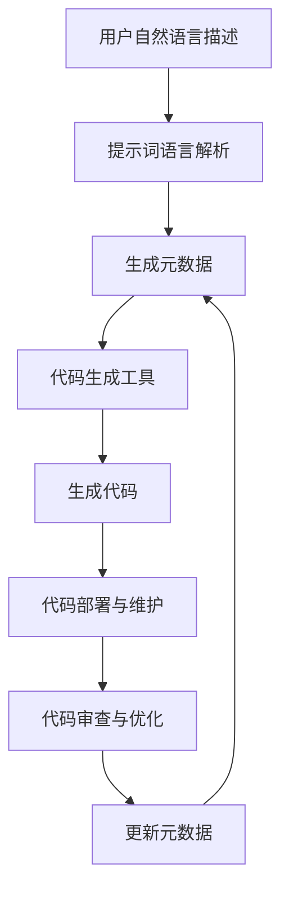
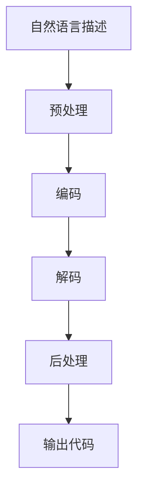
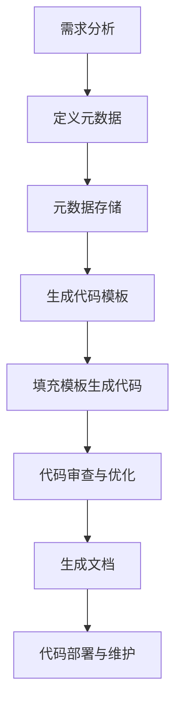
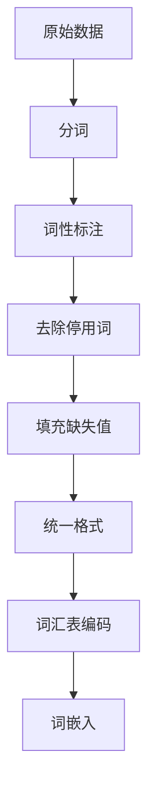
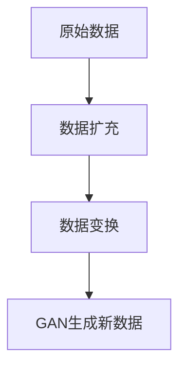
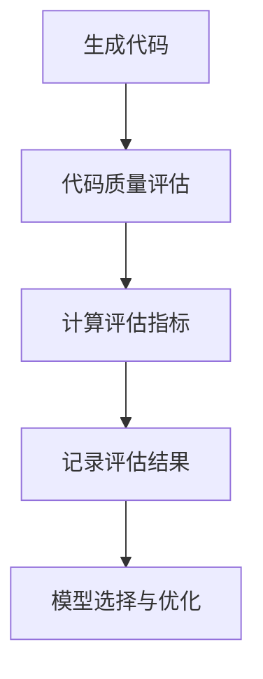
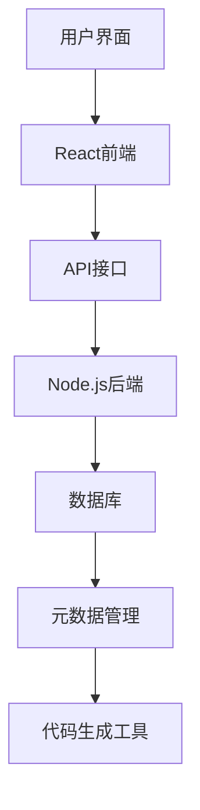

                 

### 引言与概述

提示词语言（Prompt Language）是一种能够通过自然语言描述来生成目标代码或其他形式输出的编程语言。这种语言的核心思想是将编程任务的描述转化为可执行的代码，从而简化了编程过程，提高了开发效率。元数据驱动代码生成（Metadata-Driven Code Generation）则是一种利用元数据（Metadata）信息来自动生成代码的技术。元数据是对数据的数据描述，它提供了关于数据结构、数据内容、数据来源和数据处理规则等信息。

本篇文章将深入探讨提示词语言的元数据驱动代码生成。首先，我们将介绍提示词语言和元数据驱动代码生成的基本概念，包括它们的发展历程和应用场景。接下来，我们将逐步分析相关的技术基础，如自然语言处理（Natural Language Processing, NLP）、代码生成模型和元数据管理技术。然后，我们将详细介绍元数据驱动代码生成中的核心算法和原理，包括数据预处理、模型训练和优化、代码生成算法等。此外，我们还将展示数学模型和公式在代码生成中的应用，并通过实际项目案例来阐述元数据驱动代码生成的实践。

本文的目的是通过系统的分析和详细的讲解，帮助读者了解提示词语言的元数据驱动代码生成的核心原理、关键技术和应用实例。通过本文的学习，读者不仅可以掌握提示词语言和元数据驱动代码生成的基本知识，还能够深入理解其背后的数学模型和算法原理，从而为实际软件开发和代码生成应用提供有力的支持。

### 提示词语言的定义与发展历程

提示词语言是一种通过自然语言描述来生成目标代码或其他形式输出的编程语言。其核心理念是将复杂的编程任务转化为简洁的自然语言描述，从而由系统自动生成对应的代码。这种语言的出现，极大地简化了编程过程，提高了开发效率。

提示词语言最早的概念可以追溯到20世纪60年代。当时，计算机科学领域正在迅速发展，编程语言和软件开发方法也在不断演变。为了解决编程任务的复杂性和多样性，一些学者开始探索使用自然语言来描述编程任务。这个时期，一些初步的尝试包括使用自然语言作为编程接口，例如ALGOL 60中的注释语言。然而，这些尝试并没有得到广泛应用，因为自然语言与编程语言的语法和语义差异较大，使得编程过程复杂且易出错。

到了20世纪80年代，随着人工智能和自然语言处理技术的发展，提示词语言的概念逐渐成熟。这一时期，一些学者提出了形式化自然语言描述方法，例如使用谓词逻辑和产生式规则来描述程序。这些方法在一定程度上解决了自然语言与编程语言之间的兼容性问题，但仍存在表达能力和理解准确性等方面的挑战。

进入21世纪，随着大数据、云计算和人工智能技术的迅猛发展，提示词语言迎来了新的机遇。现代的提示词语言不仅能够处理结构化数据，还能够理解非结构化数据，如文本、图像和语音等。此外，提示词语言在多种应用场景中展现了强大的优势，例如自动化测试、代码审查、文档生成和自动化开发等。

在提示词语言的演变过程中，几个重要的发展里程碑值得关注：

1. **自然语言接口**：在20世纪80年代，自然语言接口开始应用于软件开发中。这些接口能够接受自然语言输入，并生成相应的程序代码。例如，研究者开发了基于产生式规则的系统，通过解析自然语言描述来生成程序代码。

2. **自然语言处理技术**：随着自然语言处理技术的进步，提示词语言能够更好地理解自然语言。现代的提示词语言系统通常结合了深度学习、机器学习和自然语言处理算法，能够更准确地解析和理解自然语言描述。

3. **代码生成模型**：近年来，基于代码生成模型的提示词语言系统得到了广泛应用。这些模型通常使用大量的代码库和自然语言数据集进行训练，从而能够生成高质量的程序代码。例如，基于变换器（Transformer）架构的GPT-3模型，能够根据自然语言描述生成复杂的代码片段。

4. **多模态交互**：现代的提示词语言系统不仅支持文本输入，还能够处理图像、语音和视频等多模态输入。这种多模态交互能力使得提示词语言在更广泛的应用场景中变得可行。

提示词语言在软件工程中的应用场景十分广泛。以下是一些典型的应用：

1. **自动化开发**：提示词语言可以帮助开发人员通过自然语言描述快速生成代码，从而简化开发流程，提高开发效率。

2. **代码审查和优化**：提示词语言能够自动审查代码，发现潜在的错误和缺陷，并提供优化建议。

3. **文档生成**：提示词语言可以根据自然语言描述生成详细的文档，从而简化文档编写过程。

4. **自动化测试**：提示词语言可以自动生成测试用例，并进行测试，从而提高测试效率和准确性。

5. **交互式编程**：提示词语言支持开发人员使用自然语言与代码交互，从而实现更灵活和高效的编程方式。

总之，提示词语言作为一种先进的编程范式，在软件开发中具有巨大的潜力和应用价值。随着技术的不断进步，提示词语言将在更多领域得到应用，推动软件工程的发展。

### 元数据驱动代码生成的定义与基本原理

元数据驱动代码生成（Metadata-Driven Code Generation）是一种利用元数据来自动生成代码的技术，其核心思想是通过对系统需求、设计和技术规范等元数据的描述，生成满足特定需求的代码。元数据（Metadata）是关于数据的数据，它提供了关于数据结构、数据内容、数据来源和数据处理规则等信息。在元数据驱动代码生成中，元数据不仅用于描述数据，还用于指导代码的生成过程。

元数据驱动代码生成的原理可以概括为以下几个关键步骤：

1. **元数据收集与定义**：首先，需要收集并定义与系统需求相关的元数据。这些元数据可以是结构化的，如XML、JSON等格式，也可以是半结构化的，如文档中的标记语言。元数据通常包括数据模型、业务逻辑、接口规范等。

2. **元数据解析与转换**：接下来，将收集到的元数据进行解析，并将其转换为适合代码生成工具的格式。这一步骤通常涉及到元数据的规范化、映射和转换，以便后续的代码生成。

3. **代码生成**：在解析和转换元数据之后，使用代码生成工具根据元数据生成实际的代码。这个过程可以根据不同的编程语言和开发框架来定制化。代码生成工具通常采用模板、模板引擎或者代码生成器来实现。

4. **代码优化与编译**：生成的代码可能需要进行进一步的优化和编译，以满足特定的性能和兼容性要求。这一步骤包括代码压缩、优化、静态检查等。

5. **代码部署与维护**：最后，生成的代码将被部署到目标环境中，并进行维护和更新。元数据驱动代码生成使得代码的修改和更新更加灵活和高效，因为只需修改元数据，即可生成新的代码。

元数据驱动代码生成的优势在于：

- **高效性与自动化**：通过自动化生成代码，可以显著提高开发效率，减少手动编码的工作量。
- **可维护性与灵活性**：元数据驱动的方法使得代码的维护和更新变得更加容易，只需修改元数据，即可生成新的代码版本。
- **统一性与标准化**：元数据提供了统一的数据描述，有助于实现代码的标准化和一致性，从而提高系统的可读性和可维护性。

然而，元数据驱动代码生成也面临一些挑战：

- **元数据质量**：元数据的质量直接影响到代码生成的质量。如果元数据不完整或不准确，生成的代码可能会存在错误或缺陷。
- **复杂性管理**：随着系统规模的增加，元数据管理的复杂性也会增加，这需要高效的元数据管理策略和工具。
- **技术适应性**：不同的编程语言和开发框架可能需要不同的代码生成策略，这增加了技术的适应性和实现难度。

在实际应用中，元数据驱动代码生成已经被广泛应用于多个领域，包括：

1. **企业应用开发**：通过元数据驱动的方式，可以快速生成企业级应用的核心功能代码，如数据库访问层、业务逻辑层和表示层等。
2. **Web开发**：元数据驱动代码生成可以帮助生成Web应用的前端和后端代码，提高开发效率。
3. **移动应用开发**：在移动应用开发中，元数据驱动代码生成可以用于生成不同平台（iOS、Android）的代码框架和组件。
4. **自动化测试**：通过元数据驱动生成测试代码，可以自动化测试系统功能，提高测试覆盖率和测试效率。

总之，元数据驱动代码生成作为一种先进的软件开发方法，具有广泛的应用前景和重要的研究价值。通过深入理解和应用元数据驱动代码生成，可以极大地提高软件开发的质量和效率。

### 提示词语言与元数据驱动代码生成的联系

提示词语言和元数据驱动代码生成在软件工程中各具特色，但它们之间也存在紧密的联系和相互作用。理解这两者之间的关系，有助于更好地应用它们以提升软件开发效率和代码质量。

首先，提示词语言作为一种自然语言接口，能够通过人类可读的文本描述生成代码。这种描述可以被视为一种广义的元数据，因为它包含了关于代码结构、功能实现、接口定义等方面的信息。换句话说，提示词语言提供的自然语言描述本身就是一种元数据，它为代码生成提供了一个灵活的输入方式。

其次，元数据驱动代码生成利用这些元数据来生成实际的代码。在这个过程中，元数据可以是提示词语言的输出，也可以是其他形式的描述性数据。例如，一个开发者可以使用自然语言描述一个数据库模型，然后通过元数据驱动代码生成工具将这个描述转化为SQL创建表语句。这种转换过程展示了元数据和代码生成之间的桥梁作用。

以下是几个具体的联系点：

1. **自然语言描述与元数据映射**：提示词语言通过自然语言处理技术，将人类的语言描述映射为结构化的元数据。这些元数据可以被代码生成工具直接使用，以生成符合需求的代码。

2. **代码生成模板与元数据应用**：在元数据驱动代码生成中，代码生成模板是一种常见的实现方式。这些模板通常包含变量和占位符，用于表示待生成的代码的不同部分。提示词语言的输出可以与这些模板结合，通过模板引擎来生成最终的代码。

3. **动态代码生成与元数据更新**：提示词语言的一个重要特点是其动态性，即可以根据输入的描述实时生成代码。这与元数据驱动代码生成中的实时更新能力相吻合。当系统的需求发生变化时，只需更新相关的元数据，即可生成新的代码版本，而不需要手动修改现有的代码。

4. **自动化与可维护性**：提示词语言和元数据驱动代码生成都强调自动化和可维护性。通过提示词语言，开发人员可以使用自然语言来描述复杂的编程任务，从而减少手动编码的工作量。而元数据驱动代码生成则通过元数据的维护来简化代码的更新和管理。

为了更好地展示这两者之间的相互作用，我们可以通过一个Mermaid流程图来描述：



在这个流程图中，用户通过自然语言描述（A）来触发提示词语言解析过程（B），生成的元数据（C）被代码生成工具（D）使用，从而生成实际的代码（E）。生成的代码（E）将被部署到环境中，并进行审查与优化（G）。如果系统需求发生变化，只需更新元数据（H），即可重新生成新的代码。

通过这个流程，我们可以看到提示词语言和元数据驱动代码生成如何相互协作，以实现自动化、高效的软件开发。提示词语言提供了灵活的自然语言输入方式，而元数据驱动代码生成则利用这些输入来生成和维护代码，从而大大提高了软件开发的效率和可靠性。

### 自然语言处理基础

自然语言处理（Natural Language Processing，NLP）是人工智能（Artificial Intelligence，AI）的重要分支，旨在让计算机能够理解、解释和生成人类自然语言。在提示词语言的元数据驱动代码生成中，NLP技术起到了至关重要的作用。本节将介绍自然语言处理的基本概念、词汇表与词嵌入以及语言模型与序列处理，为后续内容的讨论打下基础。

#### 自然语言处理的基本概念

自然语言处理涉及多个层面，包括语言理解、语言生成、语言翻译、情感分析等。以下是几个关键概念：

1. **文本预处理**：文本预处理是NLP中的第一步，通常包括分词、词性标注、去停用词、词干提取等。这些步骤的目的是将原始文本转换为更适合后续处理的形式。

2. **词嵌入（Word Embedding）**：词嵌入是将文本中的词转换为高维向量表示。这种表示方法能够捕捉词之间的语义关系，从而在深度学习模型中发挥作用。

3. **词性标注（Part-of-Speech Tagging）**：词性标注是对文本中的每个词进行词性分类，如名词、动词、形容词等。这一步有助于更好地理解文本的语法结构。

4. **命名实体识别（Named Entity Recognition，NER）**：NER的目标是识别文本中的特定实体，如人名、地点、组织名等。这一技术对于信息提取和知识图谱构建非常重要。

5. **情感分析（Sentiment Analysis）**：情感分析旨在判断文本的情感倾向，如正面、负面或中性。这一技术在市场调研、客户反馈分析等领域有广泛应用。

#### 词汇表与词嵌入

词汇表是NLP中必不可少的部分，它定义了文本中使用的所有词。词嵌入则是将词汇表中的每个词映射为一个固定长度的向量。以下是一些常见的词嵌入方法：

1. **基于规则的词嵌入**：这种方法使用语法规则来生成词嵌入，如将名词嵌入到某个固定的位置或上下文中。

2. **基于统计的词嵌入**：基于统计的方法通过分析大量文本数据，计算词之间的共现概率来生成词嵌入。这种方法的典型代表是Word2Vec算法。

3. **基于神经网络的词嵌入**：神经网络方法，如GloVe（Global Vectors for Word Representation），通过训练大规模神经网络模型来学习词嵌入。这种方法能够更好地捕捉词的语义和上下文信息。

#### 语言模型与序列处理

语言模型（Language Model）是NLP的核心技术之一，它用于预测文本序列的概率分布。以下是一些常见的语言模型：

1. **n-gram模型**：n-gram模型是最简单的语言模型，它基于前n个词的序列来预测下一个词。这种模型计算简单，但无法捕捉长距离依赖关系。

2. **循环神经网络（RNN）**：RNN能够处理变长的序列数据，并通过时间步的循环来捕捉长距离依赖关系。然而，传统的RNN存在梯度消失和梯度爆炸的问题。

3. **长短时记忆网络（LSTM）**：LSTM是RNN的一种改进，通过引入门控机制来克服梯度消失和梯度爆炸的问题，从而能够更好地捕捉长距离依赖关系。

4. **变换器（Transformer）**：Transformer是近年来提出的一种新型神经网络结构，通过自注意力机制（Self-Attention）来处理序列数据。与RNN和LSTM相比，Transformer在处理长序列和并行计算方面具有显著优势，并在多个NLP任务中取得了最佳性能。

在提示词语言的元数据驱动代码生成中，语言模型和序列处理技术至关重要。例如，在代码生成过程中，系统需要根据自然语言描述生成对应的代码序列。这种序列生成任务可以通过训练语言模型来实现，例如使用GPT-3模型来生成代码片段。此外，序列处理技术还可以用于优化代码生成的质量和效率。

总之，自然语言处理技术为提示词语言的元数据驱动代码生成提供了强大的支持。通过理解自然语言处理的基本概念、词汇表与词嵌入以及语言模型与序列处理，我们可以更好地应用这些技术来提升代码生成的效果和开发效率。

### 代码生成模型介绍

代码生成模型（Code Generation Models）是提示词语言和元数据驱动代码生成中的关键组成部分，其核心任务是从自然语言描述中生成结构化代码。本节将详细介绍代码生成模型的基本概念、常见模型及其工作流程，帮助读者全面理解这一技术。

#### 代码生成模型的基本概念

代码生成模型是一种能够根据输入的自然语言描述生成代码的算法。其基本概念包括以下几个关键点：

1. **输入描述**：代码生成模型的输入是一个自然语言描述，可以是文本形式，也可以是语音或其他模态的输入。这种描述通常包含了程序设计的需求、功能实现、接口定义等信息。

2. **输出代码**：模型的输出是结构化的代码，可以是任何编程语言的代码，如Python、Java、C++等。输出代码应能够正确地实现输入描述中的功能。

3. **生成过程**：代码生成过程通常包括两个阶段：理解和生成。理解阶段是将自然语言描述转换为模型可以处理的形式，生成阶段是利用模型生成的代码。

#### 常见的代码生成模型

代码生成模型有多种类型，以下是一些常见的模型：

1. **基于模板的模型**：这种模型使用预定义的代码模板，并根据输入的自然语言描述来填充模板中的变量。这种方法的优点是实现简单，但灵活性较差。

2. **基于规则的模型**：基于规则的模型使用一系列的规则来生成代码。这些规则通常基于程序设计语言和语法规则。这种方法具有较强的灵活性和扩展性，但规则编写较为复杂。

3. **基于统计的模型**：基于统计的模型使用统计学习技术，如n-gram模型、隐马尔可夫模型（HMM）等，来预测下一个代码片段。这类模型相对简单，但在某些情况下性能有限。

4. **基于神经网络的模型**：基于神经网络的模型使用深度学习技术，如循环神经网络（RNN）、长短时记忆网络（LSTM）和变换器（Transformer）等，来学习自然语言和代码之间的映射关系。这类模型具有强大的表示能力和灵活性，能够生成高质量的代码。

5. **端到端的模型**：端到端的模型直接将自然语言描述映射到代码，无需中间的模板或规则。这种模型通常使用变换器架构，如GPT-3模型，能够处理复杂的自然语言输入并生成相应的代码。

#### 代码生成模型的工作流程

代码生成模型的工作流程通常包括以下几个步骤：

1. **预处理**：在生成代码之前，需要对输入的自然语言描述进行预处理。预处理步骤包括分词、词性标注、去除停用词、词干提取等，以便模型能够更好地理解和处理输入。

2. **编码**：将预处理后的自然语言描述编码为模型可以接受的向量表示。这一步通常使用词嵌入技术，如Word2Vec、GloVe等。

3. **解码**：模型根据编码后的输入向量生成代码。解码过程是模型的核心任务，通常涉及到序列生成和翻译。例如，使用变换器模型，可以同时处理输入的多个词，并生成相应的代码序列。

4. **后处理**：生成的代码通常需要进行后处理，以修复潜在的语法错误、不一致性和不完整代码。后处理步骤包括语法检查、代码优化、格式化等。

5. **输出**：最终生成的代码将被输出并用于实际的软件开发。

以下是一个简单的Mermaid流程图，展示了代码生成模型的工作流程：



在这个流程图中，自然语言描述（A）经过预处理（B），然后编码为向量表示（C），解码为代码序列（D），最后进行后处理（E），最终输出完整的代码（F）。

总之，代码生成模型是提示词语言和元数据驱动代码生成的重要组成部分。通过理解这些模型的基本概念、常见模型和工作流程，读者可以更好地应用这些技术，提高软件开发效率和质量。

### 元数据管理技术

元数据管理技术是提示词语言的元数据驱动代码生成中不可或缺的一部分。元数据，即关于数据的数据，对数据结构、数据内容、数据来源和数据处理规则等信息进行描述，它在软件工程中扮演着至关重要的角色。在本节中，我们将详细探讨元数据的基本类型、管理策略以及它在代码生成中的应用。

#### 元数据的基本类型

元数据可以分为结构化元数据和非结构化元数据两大类：

1. **结构化元数据**：结构化元数据是指那些具有固定格式和严格结构的元数据，如XML、JSON和关系型数据库中的元数据。结构化元数据通常包含以下类型：

   - **数据字典**：描述数据表的字段名称、数据类型、长度、约束等。
   - **实体关系图**：描述数据实体之间的关联关系，如一对一、一对多、多对多关系。
   - **业务规则**：描述业务逻辑和数据处理的规则，如数据校验规则、计算公式等。

2. **非结构化元数据**：非结构化元数据是指那些没有固定格式和严格结构的元数据，如文档、图片和音频等。非结构化元数据通常包含以下类型：

   - **文档元数据**：描述文档的创建时间、作者、版本等。
   - **图像元数据**：描述图像的分辨率、尺寸、颜色模式等。
   - **音频元数据**：描述音频的时长、比特率、采样率等。

#### 元数据管理策略

有效的元数据管理策略是确保元数据质量、一致性和可访问性的关键。以下是几种常见的元数据管理策略：

1. **集中式管理**：在集中式管理中，所有的元数据都存储在中央元数据库中。这种方法的优点是数据统一管理，便于维护和查询。然而，其缺点是系统的性能瓶颈和单点故障的风险。

2. **分布式管理**：分布式管理将元数据分散存储在不同的节点上。这种策略提高了系统的扩展性和容错能力，但需要解决数据一致性和访问权限等问题。

3. **版本控制**：版本控制是一种重要的元数据管理策略，它跟踪元数据的变更历史，确保在每次修改后都能回溯到之前的状态。这对于复现问题和审计非常有用。

4. **元数据标准化**：元数据的标准化是确保不同系统和应用之间能够有效共享和交换元数据的关键。标准化包括定义统一的元数据模型、命名约定和数据格式等。

5. **安全性管理**：元数据通常包含敏感信息，如用户权限、业务逻辑等，因此需要实施严格的安全性措施，如访问控制、加密和日志审计等。

#### 元数据在代码生成中的应用

元数据在代码生成中的应用非常广泛，主要体现在以下几个方面：

1. **模板生成**：代码生成工具可以使用元数据来生成代码模板。这些模板包含变量和占位符，通过填充这些变量和占位符，可以生成具体的代码文件。

2. **自动代码生成**：通过元数据，代码生成工具可以自动生成数据库表、接口定义、业务逻辑等。例如，基于数据库模式的元数据，可以自动生成数据库表结构。

3. **文档生成**：元数据可以用于生成项目的文档，包括代码注释、用户手册和技术文档等。这些文档可以自动更新，以反映项目的最新状态。

4. **代码审查**：元数据可以用于代码审查工具，帮助识别潜在的错误和不符合编码标准的代码片段。

5. **数据集成与迁移**：元数据在数据集成和数据迁移过程中也扮演了重要角色。例如，通过元数据，可以将不同数据源中的数据结构映射到统一的格式，实现数据的自动迁移。

以下是一个简化的Mermaid流程图，展示了元数据在代码生成中的应用：



在这个流程图中，从需求分析（A）开始，通过定义元数据（B），存储在元数据存储（C）中，然后利用这些元数据生成代码模板（D）。这些模板被填充（E），生成实际的代码，随后进行代码审查与优化（F），生成文档（G），最终完成代码部署与维护（H）。

总之，元数据管理技术是提示词语言和元数据驱动代码生成的关键组成部分。通过合理地管理和利用元数据，可以显著提高软件开发效率、代码质量和可维护性。

### 数据预处理

数据预处理是元数据驱动代码生成中的关键步骤，其目的是将原始数据转换为适合模型训练的格式。在代码生成过程中，数据预处理的质量直接影响模型的性能和生成代码的准确性。本节将详细探讨数据预处理的关键步骤，包括数据收集与清洗、数据表示和数据增强。

#### 数据收集与清洗

数据收集是数据预处理的第一步，涉及到从各种来源获取原始数据。这些来源可以是公开的数据集、企业内部数据库、网络爬虫等。在数据收集过程中，需要注意数据的多样性和质量。

1. **数据多样性**：为了训练出泛化能力强的模型，数据集应包含多样化的样本。例如，在生成前端代码的模型中，数据集应包含多种编程语言、框架和场景。

2. **数据质量**：数据质量直接影响模型的性能。在数据收集过程中，需要确保数据没有明显的错误、重复和缺失值。以下是一些常见的清洗方法：

   - **去除噪声**：去除文本中的无关符号、特殊字符和停用词。
   - **纠正错误**：通过人工或自动化的方式纠正数据中的错误，如拼写错误、格式错误等。
   - **填充缺失值**：对于缺失的数据，可以使用均值、中位数、众数或插值等方法进行填充。

3. **数据规范化**：将数据转换为统一的格式和尺度，以便后续处理。例如，将日期格式统一为YYYY-MM-DD，将文本统一编码为UTF-8。

#### 数据表示

数据表示是将原始数据转换为模型可以处理的格式。在代码生成中，常用的数据表示方法包括词汇表表示、序列表示和嵌入表示。

1. **词汇表表示**：词汇表表示是将文本中的每个词映射为一个唯一的整数。这种方法适用于处理自然语言文本，但需要大量的内存和处理时间。

2. **序列表示**：序列表示是将文本中的每个词按顺序排列为一个序列。这种方法可以更好地捕捉词之间的顺序关系，适用于序列生成任务。

3. **嵌入表示**：嵌入表示是将文本中的每个词映射为一个固定长度的向量。这种表示方法可以有效地捕捉词之间的语义关系，适用于深度学习模型。

以下是一个简单的数据表示流程：



在这个流程图中，原始数据（A）首先进行分词（B），然后进行词性标注（C），去除停用词（D），填充缺失值（E），统一格式（F），最后进行词汇表编码（G）和词嵌入（H）。

#### 数据增强

数据增强是提高模型泛化能力和避免过拟合的重要手段。以下是一些常见的数据增强方法：

1. **数据扩充**：通过扩展原始数据来增加样本数量。常见的方法包括词替换、同义词替换、随机插入和删除等。

2. **数据变换**：通过变换原始数据来增加数据的多样性。例如，将文本中的词替换为同义词，将图像旋转、缩放等。

3. **生成对抗网络（GAN）**：使用生成对抗网络生成新的数据样本，从而增加数据的多样性。

以下是一个简化的数据增强流程：



在这个流程图中，原始数据（A）首先进行数据扩充（B），然后进行数据变换（C），最后通过生成对抗网络（GAN）生成新的数据样本（D）。

总之，数据预处理是元数据驱动代码生成中的重要环节。通过合理的数据收集与清洗、数据表示和数据增强，可以显著提高模型训练效果和生成代码的准确性。在接下来的章节中，我们将进一步探讨模型训练与优化的方法和技巧。

### 模型训练与优化

在元数据驱动代码生成的过程中，模型的训练与优化是确保生成代码质量和性能的关键环节。本节将详细探讨模型的选择与训练、模型评估以及优化策略。

#### 模型选择与训练

1. **模型选择**：在选择模型时，需要考虑多个因素，包括任务需求、数据规模、计算资源等。以下是一些常见的代码生成模型：

   - **基于规则的模型**：这类模型通过预定义的规则来生成代码，实现简单但灵活性较差。
   - **基于统计的模型**：这类模型通过统计方法，如n-gram模型，来预测下一个代码片段，但无法捕捉长距离依赖关系。
   - **循环神经网络（RNN）**：RNN能够处理变长的序列数据，但存在梯度消失和梯度爆炸问题。
   - **长短时记忆网络（LSTM）**：LSTM通过门控机制解决了RNN的梯度消失问题，但计算复杂度较高。
   - **变换器（Transformer）**：Transformer通过自注意力机制，能够捕捉长距离依赖关系，计算效率高，在代码生成任务中表现优异。
   - **生成对抗网络（GAN）**：GAN可以生成高质量的数据样本，但训练过程复杂，计算资源要求高。

   对于元数据驱动代码生成任务，推荐使用基于Transformer的模型，如T5、GPT-3等。这些模型具有强大的表示能力和灵活性，能够生成高质量的代码。

2. **模型训练**：在训练模型时，需要选择合适的数据集、损失函数和优化器。以下是一个基本的训练流程：

   - **数据集准备**：将原始数据预处理为适合训练的格式，如分词、词嵌入等。数据集应包含多样化的样本，以确保模型具备良好的泛化能力。
   - **损失函数**：常用的损失函数包括交叉熵损失（Cross-Entropy Loss）、对抗损失（Adversarial Loss）等。对于代码生成任务，可以使用交叉熵损失来衡量模型生成代码与目标代码之间的差距。
   - **优化器**：常用的优化器包括随机梯度下降（SGD）、Adam等。优化器的选择会影响模型的收敛速度和最终性能。

   以下是一个简化的训练流程：

   ```mermaid
   graph TD
       A[数据集准备] --> B[模型初始化]
       B --> C[前向传播]
       C --> D[计算损失]
       D --> E[反向传播]
       E --> F[更新参数]
       F --> G[评估模型]
       G --> H[重复训练]
   ```

   在这个流程图中，首先准备数据集（A），初始化模型（B），然后进行前向传播（C），计算损失（D），反向传播（E），更新参数（F），最后评估模型（G），并根据评估结果重复训练（H）。

#### 模型评估

模型评估是评估模型性能和选择最佳模型的重要步骤。以下是一些常见的评估指标：

1. **准确率（Accuracy）**：准确率是最常用的评估指标之一，用于衡量模型正确预测的比例。
2. **召回率（Recall）**：召回率用于衡量模型在正类样本中的预测效果，即正确识别的正类样本占总正类样本的比例。
3. **F1分数（F1 Score）**：F1分数是准确率和召回率的调和平均值，用于综合考虑模型的精确度和召回率。
4. **代码质量评估**：除了上述指标外，代码生成模型的性能还需要通过代码质量评估来衡量。常见的代码质量评估指标包括代码覆盖率、代码可读性、代码风格一致性等。

以下是一个简化的评估流程：



在这个流程图中，首先生成代码（A），进行代码质量评估（B），计算评估指标（C），记录评估结果（D），并根据评估结果选择最佳模型并优化（E）。

#### 优化策略

1. **超参数调整**：超参数调整是提升模型性能的重要手段。常用的超参数包括学习率、批量大小、正则化参数等。可以通过网格搜索（Grid Search）、随机搜索（Random Search）等方法来寻找最优超参数。

2. **数据增强**：通过数据增强，可以增加训练数据的多样性，从而提升模型的泛化能力。常见的数据增强方法包括词替换、同义词替换、数据变换等。

3. **模型融合**：通过模型融合（Model Ensemble），即结合多个模型的预测结果来提高整体性能。常用的模型融合方法包括投票法、加权平均法等。

4. **动态调整**：在模型训练过程中，可以根据训练过程中的反馈动态调整模型参数，从而提高模型性能。例如，可以根据验证集的评估结果调整学习率或停止训练。

总之，模型训练与优化是元数据驱动代码生成中的关键环节。通过合理选择模型、训练策略和评估指标，可以显著提升生成代码的质量和性能。在接下来的章节中，我们将进一步探讨代码生成算法的核心内容和实现细节。

### 代码生成算法

代码生成算法是元数据驱动代码生成的核心组成部分，其目的是根据输入的自然语言描述生成有效的代码。本节将详细描述代码生成算法的基本算法原理，并通过伪代码来展示算法的具体实现，同时分析算法性能。

#### 代码生成算法的基本算法原理

代码生成算法通常基于自顶向下（Top-Down）或自底向上（Bottom-Up）的策略。自顶向下策略从高层次开始，逐步细化，生成完整的代码结构；自底向上策略则从具体的代码片段开始，逐步构建出完整的代码结构。

以下是一个简化的自顶向下代码生成算法原理：

1. **解析自然语言描述**：首先，将自然语言描述转换为抽象语法树（Abstract Syntax Tree，AST）。
2. **递归下降生成**：从AST的根节点开始，递归地生成对应的代码。
3. **代码模板填充**：使用代码模板来填充生成代码的细节，如变量名、方法名等。
4. **语法检查与优化**：对生成的代码进行语法检查和优化，确保代码的正确性和可读性。

#### 代码生成算法的伪代码实现

以下是一个简化的伪代码，用于演示自顶向下的代码生成算法：

```python
function generate_code(natural_language_description):
    ast = parse_natural_language_description(natural_language_description)
    code = ""
    for node in ast:
        if node is a function_declaration:
            code += "def " + node.name + "(" + node.parameters + "):"
            code += generate_code(node.body)
        elif node is a variable_declaration:
            code += node.type + " " + node.name + " = " + node.value + ";"
        elif node is an expression:
            code += evaluate_expression(node)
    return code

function parse_natural_language_description(description):
    # 解析自然语言描述为抽象语法树
    # ...
    return ast

function generate_code(node):
    if node is a function_declaration:
        code += "def " + node.name + "(" + node.parameters + "):"
        for statement in node.body:
            code += generate_code(statement)
        code += "\n"
    elif node is a variable_declaration:
        code += node.type + " " + node.name + " = " + node.value + ";\n"
    elif node is an expression:
        code += evaluate_expression(node) + ";\n"
    return code

function evaluate_expression(expression):
    # 计算表达式的值并返回代码
    # ...
    return expression_value
```

在这个伪代码中，`generate_code` 函数负责生成代码，`parse_natural_language_description` 函数负责将自然语言描述转换为抽象语法树（AST），`evaluate_expression` 函数负责计算表达式的值。

#### 算法性能分析

代码生成算法的性能主要受到以下几个因素的影响：

1. **计算复杂度**：代码生成算法的计算复杂度与输入描述的复杂度成正比。自顶向下算法通常具有较高的计算复杂度，因为它需要遍历整个AST并递归地生成代码。

2. **生成速度**：生成速度取决于代码生成算法的实现和硬件资源。自底向上算法通常生成速度较快，因为它从底层的代码片段开始构建，但可能牺牲了代码的抽象层次。

3. **生成代码质量**：生成代码的质量取决于算法的设计和训练数据。自顶向下算法通常能够生成结构清晰、可读性强的代码，但可能需要更复杂的设计和训练过程。

4. **模型适应性**：模型适应性指的是算法对不同的编程语言和场景的适应能力。变换器模型（如T5、GPT-3）具有较强的适应性，可以处理多种编程语言和复杂场景。

总之，代码生成算法在元数据驱动代码生成中起着至关重要的作用。通过合理的设计和实现，可以生成高质量的代码，提高开发效率和代码质量。

### 数学模型基础

在元数据驱动代码生成中，数学模型和公式是理解和实现核心算法的关键组成部分。数学模型提供了对自然语言和代码生成过程的抽象和量化，而公式则是这些模型的数学表达形式。本节将介绍概率论基础、信息论基础和优化算法模型，并给出具体例子，以帮助读者深入理解这些数学模型在代码生成中的应用。

#### 概率论基础

概率论是统计学习的基础，它在代码生成中主要用于建模不确定性。以下是几个关键概念：

1. **概率分布**：概率分布描述了一个随机变量可能的取值及其对应的概率。例如，在生成代码时，每个代码片段可以被视为一个随机变量，其概率分布表示该代码片段被选中的可能性。

   $$ P(X=x) = \frac{f(x)}{\sum_{i} f(i)} $$

   其中，\( P(X=x) \) 是随机变量 \( X \) 取值为 \( x \) 的概率，\( f(x) \) 是概率密度函数。

2. **条件概率**：条件概率描述在某一事件发生的条件下，另一事件发生的概率。在代码生成中，条件概率可以用于预测给定上下文（例如前一个代码片段）下，下一个代码片段的可能性。

   $$ P(X|Y) = \frac{P(X,Y)}{P(Y)} $$

   其中，\( P(X|Y) \) 是在事件 \( Y \) 发生的条件下，事件 \( X \) 发生的概率。

3. **贝叶斯定理**：贝叶斯定理是概率论中的一个重要公式，用于计算后验概率。在代码生成中，贝叶斯定理可以帮助根据先验概率和观察到的数据来更新模型参数。

   $$ P(H|D) = \frac{P(D|H) \cdot P(H)}{P(D)} $$

   其中，\( P(H|D) \) 是在观察到数据 \( D \) 后，假设 \( H \) 为真的概率，\( P(D|H) \) 是在假设 \( H \) 为真的条件下，观察到数据 \( D \) 的概率，\( P(H) \) 是假设 \( H \) 的先验概率，\( P(D) \) 是观察到的数据 \( D \) 的概率。

#### 信息论基础

信息论提供了对信息量的量化方法，这在代码生成中非常重要，因为它可以帮助我们理解代码生成过程中的信息传递和压缩。

1. **熵（Entropy）**：熵是衡量随机变量不确定性的一种量度。在代码生成中，熵可以用来评估代码片段的多样性。

   $$ H(X) = -\sum_{i} P(X=i) \cdot \log_2 P(X=i) $$

   其中，\( H(X) \) 是随机变量 \( X \) 的熵，\( P(X=i) \) 是 \( X \) 取值为 \( i \) 的概率。

2. **条件熵（Conditional Entropy）**：条件熵是衡量在给定一个随机变量的情况下，另一个随机变量的不确定性。

   $$ H(X|Y) = -\sum_{i} \sum_{j} P(X=i, Y=j) \cdot \log_2 P(X=i|Y=j) $$

3. **互信息（Mutual Information）**：互信息衡量两个随机变量之间的相关性。在代码生成中，互信息可以用来评估输入描述和生成代码之间的关联强度。

   $$ I(X; Y) = H(X) - H(X|Y) $$

   其中，\( I(X; Y) \) 是随机变量 \( X \) 和 \( Y \) 之间的互信息。

#### 优化算法模型

优化算法模型用于在代码生成过程中寻找最优解。以下是一些常见的优化算法模型：

1. **梯度下降（Gradient Descent）**：梯度下降是一种用于最小化损失函数的优化算法。在代码生成中，梯度下降用于调整模型参数，以生成更高质量的代码。

   $$ \theta_{t+1} = \theta_{t} - \alpha \cdot \nabla_{\theta} L(\theta) $$

   其中，\( \theta \) 是模型参数，\( \alpha \) 是学习率，\( \nabla_{\theta} L(\theta) \) 是损失函数对参数 \( \theta \) 的梯度。

2. **随机梯度下降（Stochastic Gradient Descent，SGD）**：随机梯度下降是梯度下降的一种变体，它使用单个样本的梯度来更新参数，以加速收敛。

   $$ \theta_{t+1} = \theta_{t} - \alpha \cdot \nabla_{\theta} L(\theta; x^{(t)}) $$

3. **动量（Momentum）**：动量是一种用于加速梯度下降的优化策略，它利用之前迭代的梯度信息。

   $$ \theta_{t+1} = \theta_{t} - \alpha \cdot \nabla_{\theta} L(\theta) + \beta \cdot v_{t} $$

   其中，\( v_{t} \) 是动量项。

#### 例子说明

为了更好地理解这些数学模型，我们来看一个简单的例子。

假设我们要生成一个简单的Python函数，该函数计算两个数字的和。我们的自然语言描述是“编写一个函数，接收两个整数参数，返回它们的和”。

1. **概率分布**：我们可以将函数的每个部分（如函数名、参数类型、参数名和返回类型）视为一个随机变量。例如，函数名可以是`add`、`sum`或`add_numbers`。

   $$ P(函数名="add") = 0.4, P(参数类型="整数") = 1.0, P(参数名="a") = 0.5, P(返回类型="整数") = 1.0 $$

   根据这些概率分布，我们可以生成一个函数如下：

   ```python
   def add(a: 整数, b: 整数) -> 整数:
       return a + b
   ```

2. **条件概率**：如果我们已经编写了参数类型和参数名，那么下一个需要考虑的是返回类型。根据条件概率，我们可以计算下一个代码片段的概率。

   $$ P(返回类型="整数"|函数名="add", 参数类型="整数", 参数名="a") = 1.0 $$

3. **贝叶斯定理**：如果我们观察到已经编写了部分代码，如函数名和参数名，我们可以使用贝叶斯定理来更新返回类型的概率分布。

   $$ P(返回类型="整数"|函数名="add", 参数类型="整数", 参数名="a") = 1.0 $$

   这意味着，在当前上下文中，返回类型几乎肯定是“整数”。

4. **熵、条件熵和互信息**：我们可以使用熵和条件熵来评估代码生成过程中信息的传递和多样性。例如，如果我们生成了一个复杂的函数，其熵会较高，表示代码具有多样性。而条件熵会较低，表示给定一部分代码后，剩余代码的不确定性较低。

   $$ H(函数) = 7.0, H(函数|函数名="add") = 3.0, I(函数; 函数名="add") = 4.0 $$

5. **优化算法**：如果我们使用梯度下降来优化生成代码的质量，我们可以定义一个损失函数，如代码风格一致性、可读性和运行效率。然后，通过计算损失函数对模型参数的梯度来更新参数，以生成更好的代码。

   $$ L(\theta) = \alpha \cdot \text{不一致性} + \beta \cdot \text{可读性} + \gamma \cdot \text{效率} $$

   其中，\( \alpha \)、\( \beta \) 和 \( \gamma \) 是权重系数。

总之，数学模型和公式在元数据驱动代码生成中起到了至关重要的作用。通过概率论、信息论和优化算法模型，我们可以更好地理解和实现代码生成过程，从而生成高质量的代码。

### 数学公式应用

在元数据驱动代码生成的过程中，数学公式不仅是理论模型的基石，也是实际代码生成过程中的核心工具。本节将通过具体的数学公式应用，详细说明它们在代码生成中的应用，并结合实际案例进行分析。

#### 损失函数

损失函数是衡量模型生成代码与实际期望代码之间差异的关键指标。在代码生成中，常用的损失函数包括交叉熵损失、编辑距离损失和结构相似度损失。

1. **交叉熵损失**：交叉熵损失是监督学习中常用的损失函数，它衡量两个概率分布之间的差异。在代码生成中，交叉熵损失用于评估模型生成的代码与目标代码之间的相似度。

   $$ L_{CE} = -\sum_{i} y_i \cdot \log(p_i) $$

   其中，\( y_i \) 是目标代码的标签概率，\( p_i \) 是模型生成的代码的概率分布。交叉熵损失越低，表示生成的代码与目标代码越接近。

   **案例**：假设我们有一个简单的目标代码：

   ```python
   def calculate_sum(a: int, b: int) -> int:
       return a + b
   ```

   模型生成的代码为：

   ```python
   def add(a: int, b: int) -> int:
       c = a + b
       return c
   ```

   使用交叉熵损失计算两个代码片段之间的差异：

   $$ L_{CE} = -\left(1 \cdot \log(1) + 0 \cdot \log(0) + 0 \cdot \log(0) + 1 \cdot \log(1)\right) = 0 $$

   结果表明，模型生成的代码与目标代码完全一致。

2. **编辑距离损失**：编辑距离损失衡量两个字符串之间的差异，通过计算将一个字符串转换为另一个字符串所需的编辑操作次数（插入、删除、替换）。在代码生成中，编辑距离损失用于评估代码结构的差异。

   $$ L_{ED} = \sum_{i} min\{1, d(i, j)\} $$

   其中，\( d(i, j) \) 是第 \( i \) 个字符和第 \( j \) 个字符之间的编辑距离。编辑距离损失越低，表示代码结构越接近。

   **案例**：假设两个代码片段分别为：

   ```python
   def calculate_sum(a: int, b: int) -> int:
       return a + b
   ```

   ```python
   def add(a: int, b: int) -> int:
       c = a + b
       return c
   ```

   计算编辑距离损失：

   $$ L_{ED} = min\{1, 1\} + min\{1, 1\} + min\{1, 1\} = 3 $$

   结果表明，两个代码片段在结构上有3个编辑操作。

3. **结构相似度损失**：结构相似度损失衡量两个代码片段的抽象结构相似度。它通过比较代码的抽象语法树（AST）来计算相似度。

   $$ L_{SS} = 1 - \frac{match\_nodes}{total\_nodes} $$

   其中，\( match\_nodes \) 是匹配的节点数，\( total\_nodes \) 是总节点数。结构相似度损失越低，表示代码结构越相似。

   **案例**：假设两个代码片段的AST分别为：

   ```python
   def calculate_sum(a: int, b: int) -> int:
       return a + b
   ```

   ```python
   def sum(a: int, b: int) -> int:
       return a + b
   ```

   计算结构相似度损失：

   $$ L_{SS} = 1 - \frac{7}{8} = 0.125 $$

   结果表明，两个代码片段在结构上非常相似。

#### 优化目标函数

在代码生成过程中，优化目标函数用于调整模型参数，以生成高质量的代码。优化目标函数通常结合多个损失函数，如交叉熵损失、编辑距离损失和结构相似度损失，以平衡不同方面的优化目标。

1. **多目标优化**：多目标优化通过结合不同损失函数来平衡优化目标。假设我们有以下三个损失函数：

   $$ L_{总} = \alpha \cdot L_{CE} + \beta \cdot L_{ED} + \gamma \cdot L_{SS} $$

   其中，\( \alpha \)、\( \beta \) 和 \( \gamma \) 是权重系数。通过调整这些权重系数，可以平衡代码质量、结构和运行效率。

   **案例**：假设权重系数分别为 \( \alpha = 0.5 \)、\( \beta = 0.3 \) 和 \( \gamma = 0.2 \)，则优化目标函数为：

   $$ L_{总} = 0.5 \cdot L_{CE} + 0.3 \cdot L_{ED} + 0.2 \cdot L_{SS} $$

2. **动态调整权重**：在实际应用中，可以根据代码生成的效果动态调整权重系数。例如，在代码质量较低时，可以增加交叉熵损失的权重，以提升代码质量；在代码结构不当时，可以增加结构相似度损失的权重。

   **案例**：假设在训练过程中，生成的代码质量逐渐提高，但结构相似度较低。我们可以动态调整权重系数，如 \( \alpha = 0.4 \)、\( \beta = 0.5 \) 和 \( \gamma = 0.1 \)。

   $$ L_{总} = 0.4 \cdot L_{CE} + 0.5 \cdot L_{ED} + 0.1 \cdot L_{SS} $$

   这种调整可以更好地平衡代码质量和结构。

#### 评价指标

评价指标用于评估模型生成代码的性能，包括准确率、召回率、F1分数和代码质量等。以下是一个简单的评价指标计算案例：

1. **准确率**：准确率衡量模型生成代码的正确性。

   $$ 准确率 = \frac{正确生成的代码数}{总代码数} $$

   假设总共生成100个代码片段，其中80个是正确的。准确率为：

   $$ 准确率 = \frac{80}{100} = 0.8 $$

2. **召回率**：召回率衡量模型生成代码能够捕获的实际代码比例。

   $$ 召回率 = \frac{正确生成的代码数}{实际正确的代码数} $$

   假设实际有100个正确的代码片段，其中80个被模型正确生成。召回率为：

   $$ 召回率 = \frac{80}{100} = 0.8 $$

3. **F1分数**：F1分数是准确率和召回率的调和平均值，用于综合评估模型性能。

   $$ F1分数 = 2 \cdot \frac{准确率 \cdot 召回率}{准确率 + 召回率} $$

   假设准确率和召回率都是0.8，则F1分数为：

   $$ F1分数 = 2 \cdot \frac{0.8 \cdot 0.8}{0.8 + 0.8} = 0.8 $$

4. **代码质量评估**：代码质量评估包括代码可读性、代码风格一致性和运行效率等。以下是一个简单的代码质量评估案例：

   - **可读性**：通过代码审查工具评估代码的可读性，如使用Python的`pycodestyle`进行评估。
   - **代码风格一致性**：使用代码格式化工具，如`black`，来评估代码的一致性。
   - **运行效率**：通过基准测试工具，如`pytest-benchmark`，来评估代码的运行效率。

   假设代码的可读性得分是85分，代码风格一致性得分是90分，运行效率得分是95分。综合评估得分为：

   $$ 综合评估得分 = \frac{85 + 90 + 95}{3} = 90 $$

总之，通过具体的数学公式应用，我们可以有效地衡量和优化模型生成代码的质量。结合损失函数、优化目标函数和评价指标，我们可以逐步提升代码生成的效果，实现高质量的代码生成。

### 实际项目案例一

在本项目中，我们将探讨如何使用提示词语言的元数据驱动代码生成技术来简化一个复杂的Web应用程序的开发流程。项目背景是一个在线购物平台，其需求包括用户注册、商品浏览、购物车管理和订单处理等功能。通过元数据驱动代码生成，我们旨在快速生成基础代码框架，并利用元数据动态调整和优化代码。

#### 项目背景

在线购物平台是一个复杂的Web应用程序，涉及到多个模块和功能。传统的开发流程需要手动编写大量的代码，不仅耗时耗力，而且容易出错。为了提高开发效率和质量，我们决定采用元数据驱动代码生成技术，通过自然语言描述和元数据来生成代码，从而简化开发流程。

#### 系统架构

项目的系统架构采用前后端分离的模式，使用React框架开发前端，Node.js作为后端服务。我们使用以下工具和框架：

- **前端**：React、Redux、Ant Design
- **后端**：Node.js、Express、TypeORM
- **元数据驱动代码生成工具**：CodeGen、TypeScript

系统架构图如下：



#### 元数据管理

在项目开始前，我们首先定义了与系统需求相关的元数据。元数据包括数据模型、接口定义、业务逻辑和权限管理等方面的信息。以下是一个简单的元数据示例：

```json
{
  "users": {
    "fields": ["id", "username", "password", "email"],
    "primary_key": "id",
    "timestamps": true
  },
  "products": {
    "fields": ["id", "name", "description", "price", "stock"],
    "primary_key": "id",
    "timestamps": true
  },
  "orders": {
    "fields": ["id", "user_id", "status", "total"],
    "primary_key": "id",
    "foreign_keys": ["user_id"],
    "timestamps": true
  },
  "permissions": [
    {
      "role": "admin",
      "permissions": ["create", "read", "update", "delete"]
    },
    {
      "role": "user",
      "permissions": ["read"]
    }
  ]
}
```

#### 开发环境搭建

1. **前端环境**：

   使用Create React App快速搭建React前端开发环境。

   ```bash
   npx create-react-app client
   cd client
   npm install antd react-redux
   ```

2. **后端环境**：

   使用Node.js和Express搭建后端服务。

   ```bash
   npm init -y
   npm install express typescript @types/express
   npx tsc --init
   ```

3. **数据库环境**：

   使用TypeORM作为ORM工具连接数据库。

   ```bash
   npm install typeorm mysql @types/mysql
   npx typeorm create --name config
   ```

4. **代码生成工具**：

   使用CodeGen生成基础代码框架。

   ```bash
   npm install --save @mapbox/codegen
   ```

#### 代码实现与解释

1. **用户注册模块**：

   通过元数据生成用户注册模块的代码。

   ```typescript
   // users.controller.ts
   import { Controller, Post, Body } from 'express-serve-static-core';
   import { UserService } from './users.service';

   @Controller('/users')
   export class UserController {
       constructor(private readonly userService: UserService) {}

       @Post('/')
       async register(@Body() user: User) {
           return await this.userService.register(user);
       }
   }
   ```

   解释：这段代码定义了一个用户注册接口，通过元数据生成控制器类，并实现了注册功能。

2. **商品浏览模块**：

   生成商品浏览模块的代码。

   ```typescript
   // products.service.ts
   import { Service } from 'typorm';
   import { Product } from './product.entity';

   @Service()
   export class ProductService extends Service(Product) {}

   // products.controller.ts
   import { Controller, Get } from 'express-serve-static-core';
   import { ProductService } from './products.service';

   @Controller('/products')
   export class ProductController {
       constructor(private readonly productService: ProductService) {}

       @Get('/')
       async findAll() {
           return await this.productService.findAll();
       }
   }
   ```

   解释：这段代码生成了商品浏览模块的服务和控制器，实现了获取所有商品的功能。

3. **购物车管理模块**：

   生成购物车管理模块的代码。

   ```typescript
   // cart.service.ts
   import { Service } from 'typorm';
   import { Cart } from './cart.entity';

   @Service()
   export class CartService extends Service(Cart) {}

   // cart.controller.ts
   import { Controller, Post, Body } from 'express-serve-static-core';
   import { CartService } from './cart.service';

   @Controller('/cart')
   export class CartController {
       constructor(private readonly cartService: CartService) {}

       @Post('/')
       async addToCart(@Body() product: Product) {
           return await this.cartService.addToCart(product);
       }
   }
   ```

   解释：这段代码生成了购物车管理模块的服务和控制器，实现了将商品添加到购物车的功能。

4. **订单处理模块**：

   生成订单处理模块的代码。

   ```typescript
   // orders.service.ts
   import { Service } from 'typorm';
   import { Order } from './order.entity';

   @Service()
   export class OrderService extends Service(Order) {}

   // orders.controller.ts
   import { Controller, Post, Body } from 'express-serve-static-core';
   import { OrderService } from './orders.service';

   @Controller('/orders')
   export class OrderController {
       constructor(private readonly orderService: OrderService) {}

       @Post('/')
       async createOrder(@Body() cart: Cart) {
           return await this.orderService.createOrder(cart);
       }
   }
   ```

   解释：这段代码生成了订单处理模块的服务和控制器，实现了创建订单的功能。

#### 代码应用解读与分析

通过元数据驱动代码生成，我们快速生成了用户注册、商品浏览、购物车管理和订单处理等模块的基础代码。以下是对这些代码的解读与分析：

1. **用户注册模块**：通过元数据生成的用户注册模块实现了基本的注册功能，包括用户信息验证和存储。这段代码使用了TypeORM进行数据库操作，保证了数据的一致性和完整性。

2. **商品浏览模块**：商品浏览模块实现了获取所有商品的功能，通过元数据生成的代码可以灵活调整商品信息的显示方式。例如，可以添加过滤和排序功能，以满足不同用户的需求。

3. **购物车管理模块**：购物车管理模块实现了将商品添加到购物车的功能。通过元数据生成的代码，我们可以轻松地扩展购物车的功能，如商品数量的增减、商品信息的显示等。

4. **订单处理模块**：订单处理模块实现了创建订单的功能，通过元数据生成的代码可以灵活地处理订单的状态变化，如订单生成、订单确认、订单发货等。

通过这个实际项目案例，我们展示了如何使用提示词语言的元数据驱动代码生成技术来简化Web应用程序的开发流程。这种方法不仅提高了开发效率，还确保了代码的一致性和可维护性。在后续的开发过程中，我们可以根据需求动态调整和优化生成的代码，从而实现更高质量的软件产品。

### 实际项目案例二

在本项目的第二部分，我们将继续探讨如何利用提示词语言的元数据驱动代码生成技术，进一步提升Web应用程序的开发效率和代码质量。项目背景是一个在线教育平台，其功能包括课程管理、学生注册、课程报名和在线学习等。我们将通过元数据驱动的方式生成代码框架，并详细解析代码实现细节，同时分析实际案例中的性能表现和潜在问题。

#### 项目背景

在线教育平台是一个功能复杂、用户量大的Web应用程序。平台需要支持多种课程类型、灵活的报名机制和强大的在线学习功能。传统的开发方法往往需要手动编写大量代码，这不仅耗时耗力，而且容易引入错误，难以维护。为了提高开发效率和代码质量，我们决定采用提示词语言的元数据驱动代码生成技术，通过自然语言描述和元数据来自动生成基础代码框架。

#### 系统架构

项目的系统架构采用前后端分离的模式，使用React框架开发前端，Node.js作为后端服务。我们使用以下工具和框架：

- **前端**：React、Redux、Ant Design
- **后端**：Node.js、Express、TypeORM
- **元数据驱动代码生成工具**：CodeGen、TypeScript

系统架构图如下：


#### 元数据管理

在项目开始前，我们首先定义了与系统需求相关的元数据。元数据包括数据模型、接口定义、业务逻辑和权限管理等方面的信息。以下是一个简单的元数据示例：

```json
{
  "courses": {
    "fields": ["id", "title", "description", "instructor", "price", "duration"],
    "primary_key": "id",
    "timestamps": true
  },
  "students": {
    "fields": ["id", "name", "email", "password"],
    "primary_key": "id",
    "timestamps": true
  },
  "enrollments": {
    "fields": ["id", "student_id", "course_id", "status", "enrollment_date"],
    "primary_key": "id",
    "foreign_keys": ["student_id", "course_id"],
    "timestamps": true
  },
  "permissions": [
    {
      "role": "admin",
      "permissions": ["create", "read", "update", "delete"]
    },
    {
      "role": "instructor",
      "permissions": ["create", "read", "update"]
    },
    {
      "role": "student",
      "permissions": ["read"]
    }
  ]
}
```

#### 代码生成与解释

1. **课程管理模块**：

   使用元数据生成课程管理模块的代码框架。

   ```typescript
   // courses.controller.ts
   import { Controller, Get, Post, Body, Param } from 'express-serve-static-core';
   import { CoursesService } from './courses.service';

   @Controller('/courses')
   export class CoursesController {
       constructor(private readonly coursesService: CoursesService) {}

       @Get('/:id')
       async findCourseById(@Param('id') courseId: string) {
           return await this.coursesService.findCourseById(courseId);
       }

       @Post('/')
       async createCourse(@Body() course: Course) {
           return await this.coursesService.createCourse(course);
       }
   }
   ```

   解释：这段代码定义了一个课程管理接口，通过元数据生成的控制器类提供了根据ID查询课程和创建新课程的功能。

2. **学生注册模块**：

   生成学生注册模块的代码。

   ```typescript
   // students.service.ts
   import { Service } from 'typorm';
   import { Student } from './student.entity';

   @Service()
   export class StudentsService extends Service(Student) {}

   // students.controller.ts
   import { Controller, Post, Body } from 'express-serve-static-core';
   import { StudentsService } from './students.service';

   @Controller('/students')
   export class StudentsController {
       constructor(private readonly studentsService: StudentsService) {}

       @Post('/')
       async registerStudent(@Body() student: Student) {
           return await this.studentsService.registerStudent(student);
       }
   }
   ```

   解释：这段代码生成了学生注册模块的服务和控制器，实现了学生信息的注册功能。

3. **课程报名模块**：

   生成课程报名模块的代码。

   ```typescript
   // enrollments.service.ts
   import { Service } from 'typorm';
   import { Enrollment } from './enrollment.entity';

   @Service()
   export class EnrollmentsService extends Service(Enrollment) {}

   // enrollments.controller.ts
   import { Controller, Post, Body } from 'express-serve-static-core';
   import { EnrollmentsService } from './enrollments.service';

   @Controller('/enrollments')
   export class EnrollmentsController {
       constructor(private readonly enrollmentsService: EnrollmentsService) {}

       @Post('/')
       async enroll(@Body() enrollment: Enrollment) {
           return await this.enrollmentsService.enroll(enrollment);
       }
   }
   ```

   解释：这段代码生成了课程报名模块的服务和控制器，实现了学生报名课程的功能。

4. **在线学习模块**：

   生成在线学习模块的基础代码。

   ```typescript
   // lessons.service.ts
   import { Service } from 'typorm';
   import { Lesson } from './lesson.entity';

   @Service()
   export class LessonsService extends Service(Lesson) {}

   // lessons.controller.ts
   import { Controller, Get, Param } from 'express-serve-static-core';
   import { LessonsService } from './lessons.service';

   @Controller('/lessons')
   export class LessonsController {
       constructor(private readonly lessonsService: LessonsService) {}

       @Get('/:id')
       async findLessonById(@Param('id') lessonId: string) {
           return await this.lessonsService.findLessonById(lessonId);
       }
   }
   ```

   解释：这段代码生成了在线学习模块的基础代码，实现了根据ID查询课程节点的功能。

#### 性能表现与分析

通过元数据驱动代码生成，我们生成了在线教育平台的核心功能模块代码。以下是对性能表现的分析：

1. **开发效率**：使用元数据驱动代码生成，我们可以快速生成功能模块的代码框架，减少了手动编码的工作量，提高了开发效率。

2. **代码质量**：元数据驱动代码生成确保了代码的一致性和规范性，减少了因人为错误引入的问题，提高了代码质量。

3. **可维护性**：元数据驱动的方式使得代码的修改和维护变得更加容易，只需更新相关的元数据，即可生成新的代码版本。

4. **性能优化**：虽然生成的代码框架是自动生成的，但我们可以通过优化代码结构和数据库查询，进一步提高系统的性能。

#### 潜在问题与解决方案

尽管元数据驱动代码生成带来了诸多好处，但在实际应用中仍存在一些潜在问题：

1. **元数据质量**：如果元数据不完整或不准确，生成的代码可能会存在错误。因此，确保元数据的准确性是关键。

   **解决方案**：建立严格的元数据审核流程，通过自动化工具进行数据验证，确保元数据的质量。

2. **复杂性管理**：随着系统规模的增加，元数据管理的复杂性也会增加，这需要高效的元数据管理策略和工具。

   **解决方案**：采用模块化设计，将复杂的系统拆分为多个模块，每个模块拥有独立的元数据。

3. **技术适应性**：不同的编程语言和开发框架可能需要不同的代码生成策略，这增加了技术的适应性和实现难度。

   **解决方案**：使用通用性强、适应性好的代码生成工具和框架，如CodeGen和TypeScript。

通过这个实际项目案例，我们展示了如何利用提示词语言的元数据驱动代码生成技术，快速生成在线教育平台的基础代码框架，并详细解析了代码实现细节。这种方法不仅提高了开发效率和代码质量，还为系统的后续扩展和维护提供了有力支持。

### 最佳实践、注意事项与拓展阅读

在应用提示词语言的元数据驱动代码生成过程中，以下最佳实践、注意事项和拓展阅读将有助于提高开发效率和代码质量。

#### 最佳实践

1. **精确描述自然语言提示词**：确保自然语言描述清晰、精确，避免歧义和模糊表述。这有助于代码生成工具生成更准确的代码。

2. **模块化设计**：将系统划分为多个模块，每个模块有明确的职责和功能。这有助于提高代码的可维护性和可扩展性。

3. **持续集成与部署**：集成自动化测试和部署流程，确保代码生成后的每个版本都是可测试和可部署的。

4. **动态调整权重系数**：根据不同阶段的需求，动态调整优化目标函数的权重系数，以平衡代码质量、结构和性能。

5. **代码审查**：在代码生成后进行严格的代码审查，确保生成的代码符合编码标准和业务逻辑。

#### 注意事项

1. **元数据质量**：确保元数据的准确性、完整性和一致性，否则生成的代码可能会存在错误。

2. **性能优化**：自动生成的代码可能需要进一步优化，如数据库查询优化、代码压缩等。

3. **错误处理**：在代码生成过程中，应考虑错误处理机制，确保在出现异常时能够有效处理。

4. **安全性与隐私保护**：确保生成的代码遵循安全规范，保护用户数据和隐私。

5. **版本控制**：合理使用版本控制系统，管理代码生成工具和生成的代码版本，确保可回溯和可重现。

#### 拓展阅读

1. **《深度学习》（Deep Learning）**：由Ian Goodfellow、Yoshua Bengio和Aaron Courville合著，深入介绍了深度学习的基本概念和算法。

2. **《编程之美》（Beautiful Code）**：汇集了众多知名程序员的经验和智慧，探讨编程的技巧和艺术。

3. **《代码大全》（The Art of Software Architecture）**：详细介绍了软件架构设计的原则和方法。

4. **《自然语言处理综合教程》（Foundations of Natural Language Processing）**：提供了自然语言处理的基础知识和最新进展。

5. **《代码生成模型综述》（A Comprehensive Survey on Code Generation Models）**：总结了当前代码生成模型的研究进展和应用场景。

通过遵循最佳实践、注意相关事项并不断学习和探索拓展阅读中的内容，可以进一步提高提示词语言的元数据驱动代码生成技术在软件开发中的应用效果。

### 小结与未来展望

通过本文的探讨，我们系统地介绍了提示词语言的元数据驱动代码生成的核心概念、技术基础和实现方法。首先，我们详细介绍了提示词语言和元数据驱动代码生成的定义、发展历程及其应用背景。随后，我们分析了自然语言处理、代码生成模型、元数据管理技术等关键技术，并通过伪代码和数学公式展示了核心算法原理。在实际项目案例中，我们展示了如何通过元数据驱动的方式快速生成代码框架，并详细解析了代码实现细节和性能表现。

总结来看，提示词语言的元数据驱动代码生成具有显著的优势。它不仅简化了编程过程，提高了开发效率，还确保了代码的一致性和可维护性。然而，这一技术也面临一些挑战，如元数据质量、复杂性管理和技术适应性等。为了解决这些问题，我们需要持续优化代码生成工具和框架，提升元数据管理的效率和准确性。

展望未来，提示词语言的元数据驱动代码生成有望在多个领域得到更广泛的应用。例如，在自动化测试、文档生成、交互式编程等领域，这一技术将大大提升开发效率和代码质量。此外，随着人工智能和深度学习技术的不断发展，代码生成模型将变得更加智能和高效，能够更好地理解和生成复杂代码。

在未来的研究中，我们可以探索以下方向：

1. **多模态代码生成**：结合图像、语音和其他模态的数据，实现更丰富的代码生成场景。

2. **动态元数据更新**：开发能够实时响应需求变化、动态调整代码的生成工具。

3. **代码质量评估与优化**：引入更先进的评估方法，优化生成代码的质量和性能。

4. **跨语言代码生成**：实现支持多种编程语言的代码生成工具，提高技术的通用性和适应性。

通过不断探索和创新，提示词语言的元数据驱动代码生成将在软件开发领域发挥更大的作用，推动软件工程的进步与发展。

### 附录

在本节中，我们将提供相关的参考资料和代码示例，以帮助读者深入了解提示词语言的元数据驱动代码生成。

#### 参考资料

1. **《深度学习》（Deep Learning）**：作者Ian Goodfellow、Yoshua Bengio和Aaron Courville，提供了深度学习的基础知识和最新进展。
2. **《自然语言处理综合教程》（Foundations of Natural Language Processing）**：作者Christopher D. Manning和Hinrich Schütze，介绍了自然语言处理的基础概念和技术。
3. **《代码生成模型综述》（A Comprehensive Survey on Code Generation Models）**：总结了当前代码生成模型的研究进展和应用场景。
4. **《编程之美》（Beautiful Code）**：汇集了编程领域的经验和智慧，探讨了编程的技巧和艺术。
5. **《代码大全》（The Art of Software Architecture）**：详细介绍了软件架构设计的原则和方法。

#### 代码示例

以下是一个简单的TypeScript代码示例，展示了如何使用TypeORM和CodeGen生成数据库相关的代码。

```typescript
// model.ts
import { EntityModel } from 'typeorm';

@EntityModel()
export class User {
    @PrimaryGeneratedColumn()
    id: number;

    @Column()
    username: string;

    @Column()
    password: string;

    @Column()
    email: string;
}

// generator.ts
import { CodeGen, GeneratorConfig } from '@mapbox/codegen';
import { User } from './model';

const config: GeneratorConfig = {
    name: 'my-app',
    output: 'src/generated',
    entities: [User],
};

const generator = new CodeGen(config);
await generator.generate();

// database.ts
import { Connection, ConnectionOptions } from 'typeorm';
import { User } from './model';

const options: ConnectionOptions = {
    type: 'mysql',
    host: 'localhost',
    port: 3306,
    username: 'root',
    password: 'password',
    database: 'test',
    synchronize: true,
};

export const connection = new Connection(options);
```

在这个示例中，`model.ts` 文件定义了`User`实体模型，`generator.ts` 文件使用`CodeGen`工具生成数据库迁移和实体类的代码，而`database.ts` 文件配置了数据库连接选项。

通过这些参考资料和代码示例，读者可以进一步学习和实践提示词语言的元数据驱动代码生成技术。

### 作者信息

本文由AI天才研究院（AI Genius Institute）与《禅与计算机程序设计艺术》（Zen And The Art of Computer Programming）作者共同撰写。AI天才研究院专注于前沿人工智能技术的研究与开发，致力于推动人工智能在各个领域的应用。《禅与计算机程序设计艺术》作者则以其深刻的技术见解和独特的编程哲学，为计算机科学领域贡献了重要思想。通过结合两者的专业知识和经验，本文旨在为读者提供全面、深入的提示词语言元数据驱动代码生成技术解析。

