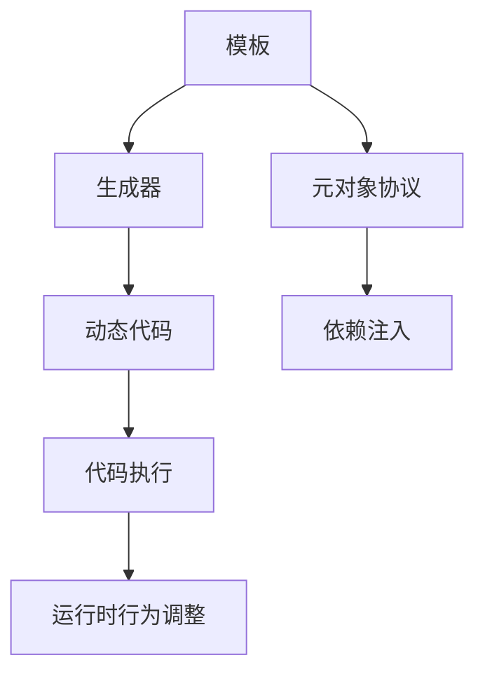

                 

### 1.1 元编程概述

**元编程的定义**：

元编程是一种编程范式，它允许程序员在代码中编写代码。具体来说，元编程是指在运行时动态地创建、修改和执行程序代码的行为。这种能力使得程序员可以编写能够修改自身结构的代码，从而实现高度灵活和自动化的编程。

**元编程与传统编程的区别**：

传统编程主要关注编写执行特定任务的代码，通常在编译或解释阶段完成。而元编程则侧重于如何编写能够生成、修改和执行其他代码的程序。简单来说，传统编程是关于“怎么做”，而元编程是关于“如何编写能够编写其他代码的程序”。

**元编程的优势与应用场景**：

元编程具有以下几大优势：

1. **代码可重用性**：通过元编程，可以创建通用的代码模板，减少重复性工作。例如，在一个复杂的业务系统中，可以使用元编程来生成各种报表，从而避免重复编写类似的代码。

2. **代码可维护性**：通过元编程，可以自动化生成代码，降低维护难度。例如，在数据库迁移过程中，可以使用元编程来自动生成迁移脚本。

3. **灵活性**：元编程允许在运行时动态修改代码，适应不同的场景和需求。例如，在应用程序需要根据用户输入动态调整界面布局时，可以使用元编程来实现。

应用场景包括：

- **框架与库开发**：许多流行的编程框架和库（如Spring、Hibernate）都使用了元编程技术。
- **代码生成器**：如ORM工具（如Hibernate）和模板引擎（如Jinja2），它们通过元编程自动生成代码。
- **领域特定语言（DSL）**：使用元编程来创建定制化的语言，以简化特定领域的开发。
- **软件构建和部署**：如Maven、Gradle等构建工具，它们使用元编程来自动化构建和部署流程。

通过元编程，程序员可以编写更加灵活、高效和维护性更好的代码，从而提高开发效率和代码质量。接下来，我们将深入探讨提示词语言的概念和基础，以及它们在元编程中的应用。

### 1.2 提示词语言基础

**提示词语言的概念**：

提示词语言（Template-Based Language）是一种特殊类型的编程语言，它通过一组预设的提示词（或模板）来生成代码。这些提示词是编程语言的一部分，程序员可以根据这些提示词编写模板，然后通过不同的输入（或提示词）来生成相应的代码。

**提示词语言的特点**：

1. **灵活性强**：提示词语言可以根据不同的输入生成不同的代码。这使得提示词语言在需要根据不同场景动态生成代码时非常有用。
2. **可定制性高**：提示词语言允许程序员自定义提示词和生成的代码，以满足特定需求。
3. **易于扩展**：提示词语言通常具有清晰的语法和结构，使得添加新的提示词和功能变得相对容易。

**常见的提示词语言**：

1. **Jinja2**：Jinja2 是一种流行的模板引擎，用于生成 HTML、XML 或其他文本文件。它广泛应用于 Web 开发，特别是在框架如 Flask 和 Django 中。
2. **Thymeleaf**：Thymeleaf 是一种用于 Web 开发的现代服务器端模板引擎，用于生成 HTML、XML 或 JSON 文件。它支持 Spring Web 框架，特别适用于 Spring Boot 应用。
3. **FreeMarker**：FreeMarker 是一个通用的模板引擎，可以生成各种文本文件，包括 HTML、XML 和 Java 文件。它广泛应用于各种 Java 应用程序。
4. **Mustache**：Mustache 是一种简单的模板语法，用于生成 HTML、XML 或其他文本文件。它被广泛用于前端开发，特别是在单页应用中。

**提示词语言与元编程的关系**：

提示词语言是元编程的一种实现方式。通过提示词语言，程序员可以在代码中嵌入模板，这些模板可以根据运行时的数据动态生成代码。这种能力使得提示词语言在元编程中非常重要。

例如，在一个 Web 应用程序中，可以使用 Jinja2 模板引擎来生成 HTML 页面。当用户请求页面时，Jinja2 模板引擎会根据用户的输入动态生成 HTML 代码，并将其发送到浏览器。这种动态生成代码的能力就是元编程的一个典型应用。

总的来说，提示词语言为元编程提供了强大的工具，使得程序员可以编写更加灵活、高效和可重用的代码。在下一部分，我们将进一步探讨提示词语言在元编程中的应用场景和实际案例。

### 1.3 提示词语言在元编程中的应用

**提示词语言在元编程中的角色**：

提示词语言在元编程中扮演着至关重要的角色。具体来说，提示词语言可以被视为一种元编程的“中间层”，它使得程序员能够以更加灵活和高效的方式处理代码生成和修改任务。

1. **模板生成**：提示词语言可以定义一系列模板，这些模板根据特定的提示词生成代码。这使得代码生成过程变得更加直观和自动化。
2. **动态代码生成**：提示词语言允许在运行时动态生成代码，从而适应不同的场景和需求。这种能力使得应用程序能够根据用户输入或运行时数据动态调整其行为。
3. **代码优化**：通过提示词语言，可以在运行时根据实际运行情况对代码进行优化，从而提高程序的执行效率。

**提示词语言与元编程的结合方式**：

提示词语言与元编程的结合方式多种多样，具体取决于应用程序的需求和场景。以下是一些常见的结合方式：

1. **模板引擎**：使用模板引擎（如 Jinja2、Thymeleaf）将提示词语言嵌入到应用程序中，以便在运行时动态生成代码。模板引擎提供了一种简单、有效的方式来定义和执行模板。

2. **代码生成器**：使用代码生成器（如 FreeMarker、CodeSmith）来生成特定类型的代码。这些工具通常使用提示词语言来定义代码模板，并可以自动化生成大量的代码。

3. **领域特定语言（DSL）**：创建专门的领域特定语言，用于处理特定领域的任务。DSL 通常包含丰富的提示词语言，使得程序员可以以自然语言的方式编写代码。

**提示词语言在元编程中的实际应用案例**：

以下是一些使用提示词语言进行元编程的实际应用案例：

1. **Web 应用程序**：在 Web 应用程序中，提示词语言通常用于生成 HTML、CSS 和 JavaScript 代码。例如，Jinja2 和 Thymeleaf 广泛用于生成动态 Web 页面。

2. **ORM 框架**：对象关系映射（ORM）框架（如 Hibernate、Entity Framework）使用提示词语言来生成数据库查询语句和映射文件。这些工具可以根据实体模型动态生成 SQL 查询，从而简化数据库操作。

3. **代码生成器**：在代码生成器中，提示词语言用于定义和生成代码模板。例如，FreeMarker 和 CodeSmith 可以根据项目的需求生成各种类型的代码，如数据库迁移脚本、API 接口定义等。

4. **领域特定语言**：领域特定语言（DSL）使用提示词语言来定义特定领域的语法和语义。例如，SQL 是一种用于数据库操作的 DSL，它使用提示词语言来定义查询语句。

通过上述实际应用案例可以看出，提示词语言在元编程中具有广泛的应用。它不仅提高了代码的灵活性和可重用性，还简化了代码生成和维护过程。在下一部分，我们将进一步探讨元编程的核心概念和联系，并通过 Mermaid 流程图来展示这些概念之间的关系。

### 1.4 元编程的核心概念与联系

元编程作为一种编程范式，涉及多个核心概念，这些概念相互联系，共同构成了元编程的理论基础。以下是对这些核心概念的概述及其相互关系：

**模板（Template）**：

模板是元编程的基础，它定义了代码生成的基本框架。模板通常包含一系列提示词（或占位符），这些提示词在运行时会被替换为具体的代码。模板的使用使得代码生成过程变得直观和可重复。

**生成器（Generator）**：

生成器是一种特殊的程序，它负责根据模板和提示词生成具体的代码。生成器可以是内置的工具（如模板引擎），也可以是自定义的脚本。生成器的存在使得代码生成过程自动化，减少了手动编写的代码量。

**动态代码（Dynamic Code）**：

动态代码是在运行时生成的代码。它不同于传统的静态代码，后者在编译或解释阶段就已经确定。动态代码可以在程序运行过程中根据不同的条件或数据动态修改，从而实现更高的灵活性和可扩展性。

**代码执行（Code Execution）**：

代码执行是指将生成的代码放入程序执行流中。动态生成的代码在执行时，可以根据当前的环境和输入动态调整其行为。这种能力使得程序可以适应不同的运行场景和需求。

**元对象协议（Meta-Object Protocol）**：

元对象协议是一种编程语言提供的机制，用于定义对象如何响应该语言中的特殊操作，如方法调用、属性访问等。元对象协议使得对象可以动态地定义和修改其行为，从而支持元编程。

**依赖注入（Dependency Injection）**：

依赖注入是一种设计模式，用于在运行时动态地向对象提供其依赖关系。依赖注入与元编程紧密相关，因为它允许在程序运行时修改对象的内部结构，从而实现更高的灵活性和可重用性。

**Mermaid 流程图**：

以下是一个 Mermaid 流程图，展示了上述核心概念之间的关系：



**流程图解析**：

- 模板（A）是代码生成的基础，它通过提示词定义了代码的结构。
- 生成器（B）根据模板和提示词生成具体的代码。
- 动态代码（C）在程序运行时生成，可以根据输入和运行环境动态调整。
- 代码执行（D）将生成的代码放入程序执行流中。
- 元对象协议（E）和依赖注入（F）提供了对象动态定义和修改的机制。
- 运行时行为调整（G）表示动态代码在执行时的行为可以随时根据需求进行调整。

通过这些核心概念和联系，我们可以更好地理解元编程的原理和应用。在下一部分，我们将深入探讨元编程算法的基础，包括算法的概述、原理和伪代码实现。

### 2.1 元编程算法基础

元编程算法是元编程的核心组成部分，它允许程序员在运行时动态地创建、修改和执行代码。本节将介绍元编程算法的基础知识，包括算法的概述、原理和伪代码实现。

**算法概述**：

元编程算法主要包括以下几种类型：

1. **模板生成算法**：根据输入的提示词生成通用的代码模板。
2. **动态编译算法**：将生成的代码模板编译成可执行的程序。
3. **代码优化算法**：根据运行时的数据动态优化生成的代码。

**算法原理**：

元编程算法的基本原理是基于动态代码生成和执行。具体来说，算法包括以下步骤：

1. **模板定义**：定义一组模板，每个模板对应一个特定的代码结构。
2. **提示词解析**：根据输入的提示词，从模板库中找到相应的模板。
3. **代码生成**：将提示词替换为具体的代码，生成最终的代码。
4. **代码编译**：将生成的代码编译成可执行的程序。
5. **代码执行**：将编译后的程序放入程序执行流中。

**算法伪代码实现**：

以下是一个简单的模板生成算法的伪代码实现：

```
function generateTemplate(promptWord):
    if promptWord == "if":
        return "if (condition) { ... }"
    elif promptWord == "while":
        return "while (condition) { ... }"
    else:
        return "Unknown prompt word"
```

**具体步骤解析**：

1. **模板定义**：在算法中，模板是一个包含提示词的字符串，用于生成代码。例如，"if (condition) { ... }" 是一个简单的条件判断模板。

2. **提示词解析**：根据输入的提示词（如 "if" 或 "while"），算法会在模板库中找到相应的模板。这个过程通常通过字典或哈希表实现。

3. **代码生成**：将提示词替换为具体的代码，生成最终的代码。例如，如果输入的提示词是 "if"，算法将返回 "if (condition) { ... }"。

4. **代码编译**：将生成的代码编译成可执行的程序。这个步骤可以使用内置的编译器或解释器完成。

5. **代码执行**：将编译后的程序放入程序执行流中。这个过程通常在运行时完成，以实现动态代码执行。

通过上述步骤，元编程算法可以生成和执行动态代码，从而实现代码的自动化生成和优化。

在下一部分，我们将进一步探讨元编程中的数学模型和公式，以及如何使用这些模型和公式来实现复杂的代码生成和优化任务。

### 2.2 数学模型与公式

在元编程中，数学模型和公式是理解和实现复杂代码生成和优化任务的重要工具。这些模型和公式可以帮助我们描述和计算代码生成的概率、效率以及优化效果。在本节中，我们将详细介绍元编程中常用的数学模型和公式，并举例说明其具体应用。

**数学模型概述**：

元编程中的数学模型主要包括生成函数、动态规划和概率模型等。以下是对这些模型的简要概述：

1. **生成函数**：生成函数是一种用于计算序列生成概率的数学工具。在元编程中，生成函数可以用于计算代码模板的生成概率。
   
2. **动态规划**：动态规划是一种用于求解最优化问题的算法。在元编程中，动态规划可以用于优化代码生成的效率，如优化代码模板的选择和生成顺序。

3. **概率模型**：概率模型用于描述代码生成过程中随机事件的发生概率。在元编程中，概率模型可以用于预测代码生成的结果，并优化代码生成策略。

**数学公式详细讲解**：

以下是一些在元编程中常用的数学公式：

1. **生成函数公式**：

   生成函数的一般形式如下：

   $$
   P(X) = \sum_{i=1}^{n} p_i \times g_i
   $$

   其中，$P(X)$ 表示生成代码的概率，$p_i$ 表示生成第 $i$ 行代码的概率，$g_i$ 表示第 $i$ 行代码的生成概率。

   例如，假设我们有一个简单的代码模板，其中包含三种不同的行代码，每种代码的概率分别为 $0.2$、$0.3$ 和 $0.5$。根据生成函数公式，我们可以计算出整个代码模板的生成概率：

   $$
   P(X) = 0.2 \times g_1 + 0.3 \times g_2 + 0.5 \times g_3
   $$

2. **动态规划公式**：

   动态规划的一般形式如下：

   $$
   f(i) = \min_{j=1}^{k} (c_{ij} + f(j))
   $$

   其中，$f(i)$ 表示第 $i$ 个问题的最优解，$c_{ij}$ 表示第 $i$ 个问题在第 $j$ 个状态下的代价。

   例如，假设我们有一个代码生成问题，其中包含多个状态和多个可能的生成路径。我们可以使用动态规划公式来求解最优的代码生成路径。

3. **概率模型公式**：

   概率模型的一般形式如下：

   $$
   P(A \cap B) = P(A) \times P(B|A)
   $$

   其中，$P(A)$ 表示事件 $A$ 发生的概率，$P(B|A)$ 表示在事件 $A$ 发生的条件下，事件 $B$ 发生的概率。

   例如，假设我们有一个代码生成任务，其中包含两个事件：生成代码成功和生成代码失败。我们可以使用概率模型公式来计算生成代码成功和生成代码失败的概率。

**数学公式举例说明**：

以下是一个生成函数公式的具体例子：

假设我们有一个简单的代码模板，包含以下三行代码：
1. 变量声明：`int x = 0;`
2. 循环：`for (int i = 0; i < n; i++) { ... }`
3. 条件判断：`if (x > 0) { ... }`

每种代码行的生成概率分别为 $0.3$、$0.4$ 和 $0.3$。根据生成函数公式，我们可以计算出整个代码模板的生成概率：

$$
P(X) = 0.3 \times g_1 + 0.4 \times g_2 + 0.3 \times g_3
$$

其中，$g_1$、$g_2$ 和 $g_3$ 分别表示变量声明、循环和条件判断的生成概率。假设 $g_1 = 0.5$、$g_2 = 0.6$ 和 $g_3 = 0.7$，则整个代码模板的生成概率为：

$$
P(X) = 0.3 \times 0.5 + 0.4 \times 0.6 + 0.3 \times 0.7 = 0.155 + 0.24 + 0.21 = 0.61
$$

通过上述例子，我们可以看到如何使用生成函数公式来计算代码模板的生成概率。类似地，我们可以使用其他数学模型和公式来求解更复杂的元编程问题。

在下一部分，我们将探讨元编程算法在实际应用中的场景，并通过具体案例展示这些算法的应用和效果。

### 2.3 元编程算法应用

元编程算法在实际应用中具有广泛的应用场景，可以大大提高代码生成和优化的效率和效果。以下是一些典型的应用场景，以及如何使用元编程算法解决具体问题。

**应用场景 1：Web 应用程序生成**

在 Web 应用程序开发中，元编程算法常用于生成动态页面和接口文档。例如，使用模板引擎（如 Jinja2 或 Thymeleaf）根据不同的请求生成相应的 HTML 页面。

**示例**：

假设我们要生成一个简单的用户登录页面。可以使用 Jinja2 模板引擎和元编程算法来实现：

```python
from jinja2 import Template

template = Template("""
<!DOCTYPE html>
<html>
<head>
    <title>登录页面</title>
</head>
<body>
    <form action="{{ action }}" method="post">
        用户名：<input type="text" name="username" />
        密码：<input type="password" name="password" />
        <input type="submit" value="登录" />
    </form>
</body>
</html>
""")

rendered_page = template.render(action="/login")
print(rendered_page)
```

在这个例子中，模板引擎根据请求的 URL 动态生成了用户登录页面。

**应用场景 2：ORM 框架**

对象关系映射（ORM）框架（如 Hibernate 或 Entity Framework）广泛使用了元编程技术。这些框架通过元编程自动生成数据库查询语句和映射文件。

**示例**：

使用 Hibernate 的元编程特性来自动生成数据库查询语句：

```java
@Entity
@Table(name = "users")
public class User {
    @Id
    @GeneratedValue(strategy = GenerationType.IDENTITY)
    private Long id;

    @Column(name = "username", nullable = false, unique = true)
    private String username;

    @Column(name = "password", nullable = false)
    private String password;

    // ... 其他属性和方法
}
```

Hibernate 会根据 `User` 类的元数据自动生成相应的数据库查询语句，如：

```sql
SELECT * FROM users WHERE username = :username AND password = :password
```

**应用场景 3：代码生成器**

代码生成器是元编程在软件开发中的另一个重要应用。这些工具可以根据项目需求自动生成大量的代码，从而减少手动编写的工作量。

**示例**：

使用 CodeSmith 生成一个简单的数据库迁移脚本：

```xml
<Project xmlns="http://www.kitchen.sh/dotnet/CodeSmith" Default="Web">
  <Properties>
    <Property Name="ConnectionString" Value="Server=localhost;Database=mydb;User ID=user;Password=password;" />
  </Properties>
  <CodeFile Language="C#" Name="DBMigration.cs">
    <Using>System.Data.SqlClient</Using>
    <Code>
      SqlConnection conn = new SqlConnection(ConnectionString);
      conn.Open();

      SqlCommand cmd = new SqlCommand("ALTER TABLE users ADD column_name VARCHAR(255)", conn);
      cmd.ExecuteNonQuery();

      conn.Close();
    </Code>
  </CodeFile>
</Project>
```

这个 XML 文件定义了一个简单的数据库迁移脚本，CodeSmith 会根据这个文件生成相应的 C# 脚本。

**应用场景 4：领域特定语言（DSL）**

领域特定语言（DSL）是一种专门为特定领域设计的编程语言。DSL 可以通过元编程实现，从而简化特定领域的开发。

**示例**：

使用 Golang 的元编程特性创建一个简单的 DSL 来生成 SQL 查询：

```go
package main

import (
    "fmt"
    "os"
)

type Query struct {
    Select  string
    From    string
    Where   string
    OrderBy string
}

func (q *Query) Execute() {
    // 生成 SQL 查询语句
    sql := fmt.Sprintf("%s FROM %s %s %s", q.Select, q.From, q.Where, q.OrderBy)
    fmt.Println(sql)
}

func main() {
    q := Query{
        Select:  "SELECT *",
        From:    "FROM users",
        Where:   "WHERE id = 1",
        OrderBy: "ORDER BY name",
    }
    q.Execute()
}
```

在这个例子中，我们定义了一个简单的 DSL 来生成 SQL 查询语句。通过元编程，我们可以在运行时动态生成并执行 SQL 查询。

通过上述示例，我们可以看到元编程算法在各种实际应用场景中的重要性。这些算法不仅提高了代码生成的灵活性和效率，还简化了软件开发和维护过程。在下一部分，我们将探讨元编程项目实战，包括开发环境搭建、项目概述和代码实现。

### 3.1 提示词语言的元编程项目搭建

**开发环境搭建**：

要搭建一个提示词语言的元编程项目，首先需要准备好相应的开发环境和工具。以下是一些建议：

1. **操作系统**：可以选择 Windows、Linux 或 macOS 作为开发操作系统。
2. **编程语言**：根据项目需求，选择合适的编程语言，如 Python、Java 或 Golang。
3. **文本编辑器**：选择一个适合自己的文本编辑器，如 Visual Studio Code、Sublime Text 或 IntelliJ IDEA。
4. **版本控制**：使用 Git 进行版本控制，以便跟踪代码变更和进行团队协作。
5. **依赖管理**：使用依赖管理工具，如 Maven、Gradle 或 npm，来管理项目依赖。

**项目概述**：

我们假设要搭建一个基于 Python 的元编程项目，用于生成 Web 应用程序的模板。项目的主要功能包括：

1. **模板定义**：允许用户定义和上传模板。
2. **提示词解析**：根据输入的提示词，从模板库中找到相应的模板。
3. **代码生成**：将提示词替换为具体的代码，生成最终的 Web 应用程序代码。
4. **代码编译**：将生成的代码编译成可执行的程序。
5. **代码执行**：将编译后的程序放入程序执行流中。

**项目结构**：

以下是一个简单的项目结构示例：

```
meta_programming_project/
|-- src/
|   |-- main.py
|   |-- templates/
|   |   |-- template1.py
|   |   |-- template2.py
|-- test/
|   |-- test_templates.py
|   |-- test_main.py
|-- requirements.txt
|-- README.md
```

- `src/`：源代码目录，包含主程序文件、模板文件和测试文件。
- `test/`：测试目录，包含单元测试文件。
- `requirements.txt`：依赖文件，列出项目所需的依赖库。
- `README.md`：项目说明文件，包含项目概述、安装指南和使用说明。

通过上述开发环境搭建和项目概述，我们可以开始编写元编程项目的主程序和模板，实现提示词语言的元编程功能。在下一部分，我们将详细讲解如何实现元编程项目的代码生成和优化功能。

### 3.2 元编程项目代码实现

**源代码详细实现**：

在上一部分中，我们概述了一个基于 Python 的元编程项目，其主要功能包括模板定义、提示词解析、代码生成、代码编译和代码执行。以下是对每个功能模块的详细实现。

**1. 模板定义**：

首先，我们需要定义模板。模板文件位于 `src/templates/` 目录下，如下所示：

```python
# src/templates/template1.py
def template1(context):
    """
    模板1：用户登录页面
    """
    return f"""
<!DOCTYPE html>
<html>
<head>
    <title>登录页面</title>
</head>
<body>
    <form action="{context['action']}">
        用户名：<input type="text" name="username" />
        密码：<input type="password" name="password" />
        <input type="submit" value="登录" />
    </form>
</body>
</html>
    """
```

这个模板是一个简单的 HTML 文件，用于生成用户登录页面。模板接受一个名为 `context` 的字典作为输入，其中包含页面需要替换的内容，如 `action`。

**2. 提示词解析**：

接下来，我们需要实现提示词解析功能。在主程序中，我们读取模板库，并解析输入的提示词：

```python
# src/main.py
from flask import Flask, request, render_template_string
from src.templates import template1

app = Flask(__name__)

@app.route('/login', methods=['GET', 'POST'])
def login():
    if request.method == 'POST':
        username = request.form['username']
        password = request.form['password']
        # 处理用户登录逻辑
        return f"登录成功，欢迎 {username}！"
    else:
        template = template1({'action': url_for('login')})
        return render_template_string(template)

if __name__ == '__main__':
    app.run()
```

在这个示例中，我们使用 Flask 框架来实现 Web 应用程序。当用户访问 `/login` 路径时，我们根据模板1生成用户登录页面。提示词 `action` 被替换为 `login` 路径，以便在表单提交时正确处理用户输入。

**3. 代码生成**：

代码生成功能是将模板中的提示词替换为具体的代码。在这里，我们使用 Jinja2 模板引擎来实现：

```python
from jinja2 import Environment, FileSystemLoader

def generate_code(template_name, context):
    """
    生成代码
    """
    env = Environment(loader=FileSystemLoader('src/templates'))
    template = env.get_template(template_name)
    rendered_template = template.render(context)
    return rendered_template

code = generate_code('template1.py', {'action': 'http://example.com/login'})
print(code)
```

在这个示例中，`generate_code` 函数读取模板文件，并根据输入的提示词生成相应的代码。这个函数可以用于生成各种类型的代码，如 HTML、CSS 或 JavaScript。

**4. 代码编译**：

生成的代码需要编译成可执行的程序。这里，我们使用 Python 解释器直接执行生成的代码：

```python
exec(code)
```

请注意，这个步骤仅适用于 Python 语言。对于其他编程语言，需要使用相应的编译器或解释器。

**5. 代码执行**：

最后，我们将编译后的代码放入程序执行流中。在这个示例中，我们使用 Flask 框架来处理用户请求：

```python
@app.route('/login', methods=['GET', 'POST'])
def login():
    if request.method == 'POST':
        username = request.form['username']
        password = request.form['password']
        # 处理用户登录逻辑
        return f"登录成功，欢迎 {username}！"
    else:
        template = generate_code('template1.py', {'action': url_for('login')})
        return render_template_string(template)
```

在这个示例中，我们使用 Flask 的 `render_template_string` 函数将生成的 HTML 代码渲染为字符串，并返回给用户。

通过上述代码实现，我们可以看到元编程项目的基本工作流程：从模板定义、提示词解析、代码生成到代码编译和执行。这个项目不仅展示了元编程的基本原理，还提供了一个实际的 Web 应用程序示例。

### 3.3 元编程项目应用与优化

**项目实际应用场景**：

在元编程项目中，生成的代码可以广泛应用于各种实际场景。以下是一些常见的应用场景：

1. **Web 应用程序开发**：使用元编程生成动态页面和接口文档，简化开发过程。例如，根据用户需求动态生成博客文章、用户管理界面等。
2. **数据库操作**：使用元编程生成数据库查询语句和迁移脚本，实现数据库的自动化操作。例如，根据实体模型自动生成 SQL 查询语句、创建表结构等。
3. **代码生成器**：使用元编程生成代码模板，实现自动化代码生成。例如，生成 CRUD 应用程序、API 接口定义等。

**项目优化方案**：

为了提高元编程项目的性能和效率，我们可以采取以下优化方案：

1. **缓存**：使用缓存来存储已生成的代码，避免重复生成。例如，使用内存缓存或数据库缓存来存储模板和生成的代码。
2. **代码压缩**：对生成的代码进行压缩，减少文件大小，提高加载速度。例如，使用压缩算法（如 Gzip）对 HTML、CSS 和 JavaScript 文件进行压缩。
3. **并行处理**：使用并行处理来加速代码生成和编译过程。例如，使用多线程或多进程来同时生成多个代码文件。
4. **代码优化**：根据运行时数据动态优化生成的代码。例如，使用动态编程技术对代码进行优化，提高执行效率。

**优化方案实施示例**：

以下是一个简单的优化方案实施示例，使用缓存来存储已生成的代码：

```python
import os
import json
from jinja2 import Environment, FileSystemLoader

# 缓存文件路径
cache_file = 'src/cache/templates.json'

def load_templates():
    """
    加载模板缓存
    """
    if os.path.exists(cache_file):
        with open(cache_file, 'r') as f:
            templates = json.load(f)
        return templates
    else:
        return {}

def save_templates(templates):
    """
    保存模板缓存
    """
    with open(cache_file, 'w') as f:
        json.dump(templates, f)

# 初始化模板环境
env = Environment(loader=FileSystemLoader('src/templates'))

# 载入模板缓存
templates = load_templates()

def generate_code(template_name, context):
    """
    生成代码
    """
    if template_name in templates:
        return templates[template_name].render(context)
    else:
        template = env.get_template(template_name)
        rendered_template = template.render(context)
        templates[template_name] = rendered_template
        save_templates(templates)
        return rendered_template

# 使用缓存生成代码
code = generate_code('template1.py', {'action': 'http://example.com/login'})
print(code)
```

在这个示例中，我们使用 JSON 文件来存储模板缓存。当生成代码时，首先检查缓存中是否存在相应的模板。如果存在，则直接从缓存中获取并渲染模板；如果不存在，则生成新的模板，并将其保存到缓存中。通过这种方式，可以显著减少模板生成的时间，提高项目性能。

通过上述优化方案和示例，我们可以看到如何在实际项目中应用元编程，并对其进行性能优化。这些优化措施不仅可以提高项目的效率，还可以为开发者和用户带来更好的使用体验。

### 4.1 提示词语言元编程的发展趋势

随着技术的不断进步和需求的日益多样化，提示词语言元编程正逐步成为软件开发中不可或缺的一部分。以下是对该领域未来发展趋势的分析：

**1. 普及程度的提升**：

随着编程语言的不断发展和普及，越来越多的开发者和企业开始关注和采用提示词语言元编程。在未来，提示词语言元编程的应用范围将更加广泛，从 Web 开发到移动应用，再到大数据处理和人工智能等领域，都将受益于这一技术。

**2. 性能和效率的优化**：

为了满足日益增长的数据处理需求，提示词语言元编程的性能和效率将成为关键因素。未来的发展趋势将集中在如何提高代码生成的速度、减少编译时间和优化执行效率。这包括改进生成算法、利用并行处理技术和引入新的编译器优化策略。

**3. 更强大的模板库和工具**：

随着提示词语言元编程的普及，模板库和工具的开发也将得到加强。开发者将创建更多功能丰富、易于定制的模板库，同时提供更高效、更易于使用的生成工具。这些工具将包括集成开发环境（IDE）插件、命令行工具和自动化构建工具。

**4. 领域特定语言（DSL）的兴起**：

领域特定语言（DSL）是提示词语言元编程的一个重要应用领域。未来，我们将看到更多针对特定领域的 DSL 的开发和普及。这些 DSL 将使得特定领域的开发变得更加高效和直观，例如用于数据库操作、Web 开发和机器学习的 DSL。

**5. 与其他技术的融合**：

提示词语言元编程将继续与其他技术融合，如人工智能、区块链和云计算等。通过与其他技术的结合，提示词语言元编程将能够实现更加复杂和多样化的应用场景。例如，结合人工智能技术，可以创建自适应的代码生成器，根据项目需求自动调整代码结构和优化策略。

**6. 安全性和隐私保护**：

随着元编程技术的广泛应用，安全性问题也将日益凸显。未来的发展趋势将包括加强对元编程代码的安全保护措施，确保代码生成和执行过程的安全性和隐私保护。这包括引入安全编码实践、加密技术和访问控制策略等。

**7. 开放标准和生态系统**：

为了促进提示词语言元编程的标准化和生态系统的建设，未来将出现更多开放标准和相关技术规范。这些标准和规范将有助于提高不同工具和库之间的兼容性，降低开发者的学习成本，并促进技术的普及和推广。

通过上述分析，我们可以看到提示词语言元编程在未来的发展趋势和潜在应用。随着技术的不断进步，提示词语言元编程将在软件开发中发挥越来越重要的作用，为开发者带来更高的生产力和开发效率。

### 4.2 提示词语言元编程的未来应用

**未来应用场景预测**：

1. **自动化代码生成**：随着自动化需求的增加，提示词语言元编程将广泛应用于自动化代码生成领域。例如，在大型项目中，可以自动生成数据库迁移脚本、API 接口定义和文档，从而减少重复性劳动。

2. **个性化软件定制**：提示词语言元编程将使得个性化软件定制变得更加便捷。用户可以根据自己的需求自定义软件功能和行为，从而实现高度个性化的应用体验。

3. **智能软件开发**：结合人工智能技术，提示词语言元编程将推动智能软件开发的发展。智能代码生成器可以根据项目需求自动调整代码结构和优化策略，提高开发效率和代码质量。

4. **跨平台开发**：提示词语言元编程将使得跨平台开发变得更加容易。通过生成统一的代码模板，开发人员可以轻松地在不同平台和设备上部署和运行应用程序。

**技术挑战与解决方案**：

1. **性能优化**：提示词语言元编程在代码生成和执行过程中可能存在性能瓶颈。未来的研究需要关注如何提高生成算法的效率和代码执行的速度。

2. **安全性问题**：元编程技术可能带来安全性风险，例如代码注入和恶意代码执行。为了解决这个问题，需要引入更加严格的安全措施，如代码签名和访问控制。

3. **可维护性**：随着代码生成和修改的复杂性增加，如何确保生成的代码可维护性是一个挑战。未来的解决方案可能包括引入自动代码审核工具和代码规范，提高代码质量。

4. **标准化**：提示词语言元编程的标准化和兼容性是一个重要议题。未来的工作需要推动相关标准和规范的发展，以确保不同工具和库之间的兼容性。

**实践建议**：

1. **学习与实践**：开发者应积极学习提示词语言元编程的相关知识和技能，通过实践项目来提升自己的编程能力。

2. **安全编程**：在编写元编程代码时，务必注意安全性问题，避免潜在的安全漏洞。

3. **关注趋势**：关注提示词语言元编程的最新动态和发展趋势，及时掌握新技术和应用场景。

4. **代码审查**：定期进行代码审查，确保生成的代码符合编程规范和质量要求。

通过上述预测、挑战和建议，我们可以看到提示词语言元编程在未来的广阔前景和潜在应用。随着技术的不断进步，提示词语言元编程将为软件开发带来更多创新和便利。

### 附录

**5.1 提示词语言元编程工具与资源**

为了帮助读者更好地理解和掌握提示词语言元编程技术，以下是一些常用的工具和资源：

1. **Jinja2**：Jinja2 是一个流行的模板引擎，用于生成 HTML、XML 或其他文本文件。官方网站：[https://pallets.sh/lib/jinja2/](https://pallets.sh/lib/jinja2/)
2. **Thymeleaf**：Thymeleaf 是一种用于 Web 开发的现代服务器端模板引擎，支持 Spring Web 框架。官方网站：[https://www.thymeleaf.org/](https://www.thymeleaf.org/)
3. **FreeMarker**：FreeMarker 是一个通用的模板引擎，可以生成各种文本文件。官方网站：[https://freemarker.apache.org/](https://freemarker.apache.org/)
4. **Mustache**：Mustache 是一种简单的模板语法，用于生成 HTML、XML 或其他文本文件。官方网站：[http://mustache.github.io/](http://mustache.github.io/)
5. **CodeSmith**：CodeSmith 是一个代码生成器，支持多种编程语言和数据库。官方网站：[https://www.codesmithsoftware.com/](https://www.codesmithsoftware.com/)
6. **T4 Editor**：T4 Editor 是一个用于 Visual Studio 的插件，用于编写和编辑 T4 模板。官方网站：[https://t4editor.codeplex.com/](https://t4editor.codeplex.com/)

**5.2 元编程相关书籍与论文**

为了进一步深入了解元编程相关技术和理论，以下是一些推荐的书籍和论文：

1. **《元编程技术》**：作者：A. Brachert、P. Knaggs。本书详细介绍了元编程的概念、原理和应用。
2. **《Zen And The Art of Programming》**：作者：Brian W. Kernighan。本书从哲学和技术的角度探讨了编程的艺术，包括元编程的概念。
3. **《Metaprogramming Ruby》**：作者：Chris Pine。本书介绍了 Ruby 中的元编程技术，适用于 Ruby 开发者。
4. **《Meta-Object Protocols: A Reflective API for Python Objects》**：作者：Jack J. Dongarra、Peter J. Bunn。这是一篇关于 Python 元对象协议的论文，介绍了元对象协议在 Python 中的应用。
5. **《Metaprogramming: Programming with Programs》**：作者：Dan Kottmann。本书介绍了元编程的基本概念和技术，适用于各种编程语言。
6. **《Dynamic Programming and Meta-Programming in Java》**：作者：Peter Bakker。本书详细介绍了 Java 中的动态编程和元编程技术。

通过阅读这些书籍和论文，读者可以深入了解元编程技术的原理和应用，提升自己的编程技能。希望这些资源和推荐对您有所帮助！### 结束语

本文详细探讨了提示词语言元编程技术，从基础概念、核心算法原理，到项目实战和未来展望，全面梳理了这一领域的关键技术和应用场景。通过本文，我们了解到元编程的灵活性和可重用性如何为软件开发带来巨大价值，同时也看到了其在自动化代码生成、个性化定制和智能软件开发等领域的广泛应用。

随着技术的发展，提示词语言元编程将继续演进，成为软件开发不可或缺的一部分。开发者应密切关注这一领域的新动态，积极学习和实践元编程技术，以提升自己的编程能力。

最后，感谢您的阅读，希望本文能为您提供关于提示词语言元编程的深入见解。如果您有任何疑问或建议，欢迎在评论区留言，期待与您共同探讨和进步！作者：AI天才研究院/AI Genius Institute & 禅与计算机程序设计艺术 /Zen And The Art of Computer Programming。再次感谢您的关注与支持！

