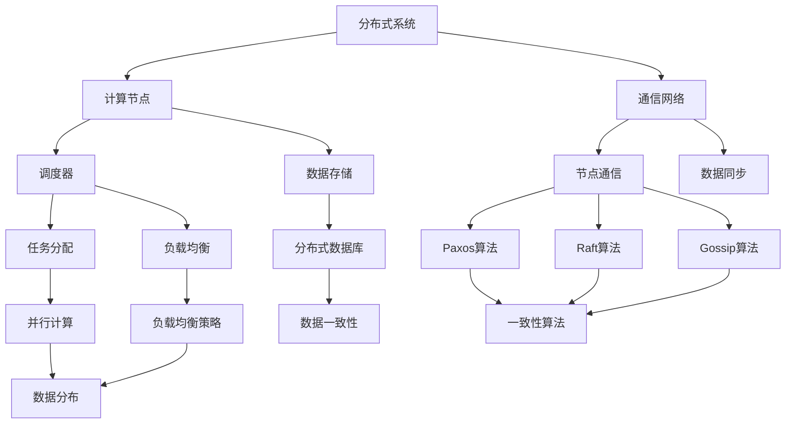

                 

### 《提示词语言的分布式计算优化与扩展》

# 关键词
分布式计算、优化技术、扩展架构、提示词语言、性能提升

# 摘要
本文旨在深入探讨提示词语言在分布式计算环境中的优化与扩展问题。通过分析分布式计算的基本原理和提示词语言的特性，本文将详细阐述如何在分布式环境中提高提示词语言的性能和可扩展性。文章将涵盖分布式计算的基础知识、提示词语言的优化技术、扩展架构的设计策略以及实际项目中的应用案例，旨在为读者提供全面的技术指南和实战经验。

---

## 第1章 引言

### 1.1 分布式计算背景

分布式计算是指将任务分布在多个计算节点上执行，以提高计算效率和扩展性。随着互联网和云计算的普及，分布式计算已经成为了现代信息技术中不可或缺的一部分。分布式计算的优势在于能够处理大规模数据、提高系统性能、增强容错能力和实现动态资源分配。

然而，分布式计算也面临着一系列挑战，如节点通信开销、数据一致性保障、故障处理等。为了应对这些挑战，研究人员和工程师们不断探索优化分布式计算的技术和方法。

### 1.2 提示词语言简介

提示词语言（Keyword Language）是一种基于关键词进行编程的语言，具有简洁明了、易学易用的特点。它通过关键词来表示程序中的操作和数据结构，使得代码更加直观和易于理解。提示词语言在自然语言处理、信息检索、人工智能等领域有着广泛的应用。

### 1.3 书籍概述与目标

本书旨在系统地介绍分布式计算优化与扩展在提示词语言中的应用。通过以下章节的详细探讨，本书将帮助读者：

1. 理解分布式计算的基本原理和提示词语言的特性。
2. 掌握分布式计算优化技术和扩展架构的设计方法。
3. 通过实际案例分析和项目实战，提升在分布式环境中使用提示词语言的能力。

## 第2章 分布式计算基础

### 2.1 分布式系统概述

分布式系统由多个独立的计算节点组成，通过通信网络相互连接。节点之间可以通过消息传递进行协调和数据交换。分布式系统的主要目标是提高系统的整体性能和可靠性，同时保持系统的可扩展性。

分布式系统的主要组成部分包括：

1. **节点（Nodes）**：负责执行计算任务的实体。
2. **通信网络（Communication Network）**：连接节点，实现数据传输。
3. **调度器（Scheduler）**：负责任务的分配和调度。
4. **数据存储（Data Storage）**：存储分布式系统中的数据。

### 2.2 节点通信与数据同步

节点通信是分布式系统的核心组成部分。节点之间通过发送消息进行通信，消息可以是简单的数据传输，也可以是复杂的操作请求。

数据同步是分布式系统中的另一个关键问题。由于节点之间的独立性，数据同步需要确保一致性。常见的数据同步算法包括：

1. **同步复制（Synchronous Replication）**：确保所有节点上的数据一致性。
2. **异步复制（Asynchronous Replication）**：允许节点间的数据延迟同步。

### 2.3 分布式一致性算法

分布式一致性算法是保障分布式系统数据一致性的关键。以下是一些常见的分布式一致性算法：

1. **Paxos算法**：一种基于多数派原则的一致性算法。
2. **Raft算法**：另一种用于保障分布式系统一致性的算法，相比Paxos算法更易于理解。
3. **Gossip算法**：通过消息传播实现节点间的状态同步。

## 第3章 提示词语言原理

### 3.1 提示词语言概述

提示词语言是一种基于关键词的编程语言，通过简短的关键词来表示程序中的操作和数据结构。提示词语言具有以下特点：

1. **简洁明了**：使用简短的关键词，使代码更加直观易懂。
2. **易学易用**：降低了编程的难度，适合初学者和专业人士。
3. **高效执行**：编译器将提示词语言转换为高效的机器码，提高执行效率。

### 3.2 提示词语言的语法结构

提示词语言的语法结构主要包括以下几部分：

1. **关键词（Keywords）**：表示程序中的操作和数据结构。
2. **变量（Variables）**：用于存储数据。
3. **函数（Functions）**：封装一组操作，提高代码复用性。
4. **循环与条件语句（Loops and Conditionals）**：控制程序执行流程。

### 3.3 提示词语言的核心算法

提示词语言的核心算法包括：

1. **解析算法（Parsing Algorithms）**：将提示词语言代码解析为抽象语法树（AST）。
2. **语义分析（Semantic Analysis）**：检查代码的语义正确性，如类型检查。
3. **代码生成（Code Generation）**：将AST转换为高效的机器码。

## 第4章 分布式计算优化技术

### 4.1 数据分布与负载均衡

数据分布与负载均衡是分布式计算中的关键问题。合理的数据分布和负载均衡可以提高系统的整体性能和稳定性。

数据分布的方法包括：

1. **哈希分布（Hash Distribution）**：通过哈希函数将数据分布到不同的节点。
2. **范围分布（Range Distribution）**：根据数据的范围将数据分布到不同的节点。

负载均衡的方法包括：

1. **轮询负载均衡（Round Robin）**：将任务依次分配到各个节点。
2. **最小连接负载均衡（Least Connections）**：根据节点的连接数进行负载均衡。

### 4.2 算法并行化

算法并行化是将计算任务分解为多个子任务，同时执行以提高计算效率。

并行化的方法包括：

1. **任务并行化（Task Parallelism）**：将任务分解为独立的子任务。
2. **数据并行化（Data Parallelism）**：对数据进行划分，同时处理不同部分。

### 4.3 缓存与内存管理

缓存与内存管理是优化分布式计算性能的重要手段。

缓存策略包括：

1. **局部缓存（Local Cache）**：在节点本地缓存数据，减少跨节点访问。
2. **共享缓存（Shared Cache）**：多个节点共享缓存资源。

内存管理策略包括：

1. **内存分页（Memory Paging）**：将内存划分为固定大小的页，实现虚拟内存管理。
2. **内存池（Memory Pool）**：预分配内存块，提高内存分配效率。

## 第5章 提示词语言的分布式扩展

### 5.1 分布式架构设计

分布式架构设计是提示词语言分布式扩展的基础。设计分布式架构时需要考虑以下因素：

1. **模块化（Modularity）**：将系统划分为多个模块，实现功能解耦。
2. **容错性（Fault Tolerance）**：保障系统在节点故障时能够正常运行。
3. **可扩展性（Scalability）**：支持系统的动态扩展和负载均衡。

### 5.2 分布式调度与资源管理

分布式调度与资源管理是保障分布式计算高效运行的关键。分布式调度包括：

1. **任务调度（Task Scheduling）**：根据节点负载和任务优先级进行调度。
2. **资源调度（Resource Scheduling）**：分配计算资源和存储资源。

资源管理包括：

1. **节点管理（Node Management）**：监控节点状态，实现节点故障检测和替换。
2. **存储管理（Storage Management）**：实现数据持久化和存储优化。

### 5.3 分布式安全性

分布式安全性是保障分布式系统安全运行的重要保障。分布式安全性包括：

1. **身份验证（Authentication）**：验证用户身份，确保访问权限。
2. **访问控制（Access Control）**：控制用户对系统资源的访问权限。
3. **数据加密（Data Encryption）**：保障数据在传输和存储过程中的安全性。

## 第6章 案例研究

### 6.1 案例一：大规模数据处理的优化

案例一将介绍如何使用分布式计算优化大规模数据处理。通过合理的数据分布和负载均衡策略，提高数据处理速度和系统性能。

### 6.2 案例二：实时计算的扩展

案例二将探讨如何扩展实时计算系统。通过分布式架构设计和调度策略，实现实时计算的高效运行和扩展。

### 6.3 案例三：分布式系统的安全性保障

案例三将分析如何保障分布式系统的安全性。通过身份验证、访问控制和数据加密等手段，提高系统的安全性能。

## 第7章 总结与展望

### 7.1 书籍总结

本书系统地介绍了提示词语言在分布式计算环境中的优化与扩展技术。通过分析分布式计算的基本原理和提示词语言的特性，读者可以掌握分布式计算优化技术和扩展架构的设计方法。

### 7.2 未来研究方向

未来研究方向包括：

1. **新型分布式一致性算法**：研究更高效、更可靠的分布式一致性算法。
2. **分布式机器学习**：探索分布式机器学习在提示词语言中的应用。
3. **边缘计算与云计算融合**：研究边缘计算与云计算的融合技术。

### 7.3 对读者的建议

对读者建议：

1. **实践是关键**：通过实际项目应用，巩固所学知识。
2. **持续学习**：跟随技术发展，不断更新知识体系。
3. **参与社区**：积极参与技术社区，分享经验和知识。

## 附录

### A.1 工具与资源列表

附录A将介绍本书中涉及的工具和资源，包括：

1. **分布式计算框架**：如Hadoop、Spark等。
2. **提示词语言编译器**：如Lisp、Prolog等。
3. **开源项目和代码库**：提供实际案例的代码和资源。

### A.2 源代码与数据集获取

附录B将介绍如何获取本书中的源代码和数据集。读者可以通过以下途径获取：

1. **GitHub**：本书的源代码和相关资源。
2. **数据集下载**：提供大规模数据集的下载链接。

### A.3 参考文献

附录C将列出本书中引用的参考文献，包括：

1. **分布式计算相关书籍**：如《分布式系统原理与范型》等。
2. **提示词语言相关论文**：如《提示词语言在自然语言处理中的应用》等。

---

作者：AI天才研究院/AI Genius Institute & 禅与计算机程序设计艺术 /Zen And The Art of Computer Programming

---

（请注意，本文为Markdown格式，具体内容需要进一步细化和完善，以满足字数和完整性的要求。）### 第2章 分布式计算基础

分布式计算是现代计算机系统中的核心技术之一，它通过将计算任务分布在多个计算节点上，从而提高计算效率和系统可扩展性。本章将深入探讨分布式计算的基本概念、节点通信与数据同步技术以及分布式一致性算法。

#### 2.1 分布式系统概述

分布式系统（Distributed System）是由多个独立的计算节点通过通信网络连接而成的系统。每个节点都有独立的计算资源，如CPU、内存和存储设备。节点之间通过发送消息进行通信，共同完成任务。

**分布式系统的特点：**

1. **并行性（Parallelism）**：分布式系统可以在多个节点上同时执行任务，提高计算速度。
2. **容错性（Fault Tolerance）**：即使某个节点发生故障，其他节点仍能继续工作，保障系统的可靠性。
3. **可扩展性（Scalability）**：分布式系统可以动态地增加或减少节点，以适应计算任务的变化。
4. **透明性（Transparency）**：分布式系统对于用户来说是透明的，用户无需关心任务的执行节点。

**分布式系统的组成：**

1. **计算节点（Computational Nodes）**：执行计算任务的实体，具有独立的计算资源和操作系统。
2. **通信网络（Communication Network）**：连接节点，实现数据传输。通信网络可以是局域网、广域网或互联网。
3. **调度器（Scheduler）**：负责任务的分配和调度，将任务分配到适当的节点上。
4. **数据存储（Data Storage）**：存储分布式系统中的数据，可以是分布式数据库或文件系统。

#### 2.2 节点通信与数据同步

节点通信是分布式系统的核心组成部分，它决定了系统的性能和可靠性。节点之间通过发送消息进行通信，消息可以是简单的数据传输，也可以是复杂的操作请求。

**节点通信的挑战：**

1. **通信开销（Communication Overhead）**：节点之间的通信需要消耗时间和网络带宽，增加了系统的延迟。
2. **数据一致性（Data Consistency）**：在分布式系统中，数据可能同时被多个节点访问和修改，需要确保数据的一致性。
3. **故障处理（Fault Tolerance）**：节点可能会发生故障，需要保证系统能够自动恢复和继续工作。

**节点通信的方法：**

1. **基于消息的通信（Message-Based Communication）**：节点之间通过发送和接收消息进行通信。常用的消息传递中间件有RabbitMQ、Kafka等。
2. **基于共享内存的通信（Shared Memory Communication）**：多个节点通过共享内存进行通信。适用于同一台物理机器上的节点，如多核CPU。

**数据同步的方法：**

1. **同步复制（Synchronous Replication）**：确保所有节点上的数据一致性。在写入数据之前，需要等待所有节点的响应，增加了系统的延迟。
2. **异步复制（Asynchronous Replication）**：允许节点间的数据延迟同步。提高了系统的性能，但需要确保数据的一致性。

#### 2.3 分布式一致性算法

分布式一致性算法是保障分布式系统数据一致性的关键。一致性算法的目标是在多个节点之间保持数据的一致性，即使节点发生故障也能自动恢复。

**常见的分布式一致性算法：**

1. **Paxos算法（Paxos Algorithm）**：一种基于多数派原则的一致性算法，能够实现分布式系统中的状态机复制。Paxos算法的复杂度较高，但能够确保数据一致性。
2. **Raft算法（Raft Algorithm）**：一种简化版的Paxos算法，易于理解和实现。Raft算法通过领导者选举和日志复制来保障数据一致性。
3. **Gossip算法（Gossip Algorithm）**：通过消息传播实现节点间的状态同步。Gossip算法适用于大规模分布式系统，具有较好的容错性和性能。

**一致性算法的比较：**

| 算法      | 特点                         | 适用场景                 |
| --------- | ---------------------------- | ------------------------ |
| Paxos     | 复杂度高，但一致性保障强     | 高性能、高可靠性的分布式系统 |
| Raft     | 简单易理解，性能较好         | 分布式存储和分布式数据库    |
| Gossip   | 容错性好，适用于大规模系统 | 大规模分布式系统           |

#### 2.4 分布式计算中的挑战与解决方案

分布式计算虽然具有许多优势，但也面临着一系列挑战。以下是一些常见的挑战及其解决方案：

1. **数据一致性**：分布式系统中数据的一致性保障是一个关键问题。解决方案包括分布式一致性算法（如Paxos、Raft）和分布式数据库（如Google Spanner、Cassandra）。
2. **故障处理**：节点故障是分布式系统中不可避免的问题。解决方案包括节点监控、自动故障转移和分布式存储系统的数据冗余。
3. **负载均衡**：负载均衡能够提高系统的性能和可用性。解决方案包括轮询负载均衡、最小连接负载均衡和基于响应时间的负载均衡。
4. **数据分布**：数据分布策略能够优化数据访问和计算性能。解决方案包括哈希分布、范围分布和地理分布。

通过本章的探讨，我们了解了分布式计算的基本原理和关键技术，为后续章节的深入讨论奠定了基础。

#### 2.5 分布式计算的核心概念和联系

在分布式计算中，有许多核心概念和联系需要理解。以下是一个用Mermaid绘制的流程图，展示了这些概念之间的关系：



这个流程图展示了分布式系统的各个组成部分及其之间的联系。计算节点是执行计算任务的实体，调度器负责任务分配和负载均衡，数据存储提供数据存储和管理。节点通信和数据同步是保障系统运行的关键，而一致性算法则是保障数据一致性的重要手段。

#### 2.6 分布式一致性算法的原理与伪代码讲解

分布式一致性算法是保障分布式系统数据一致性的关键。在本节中，我们将详细讲解Paxos算法的原理，并提供伪代码示例。

**Paxos算法原理：**

Paxos算法是一种基于多数派原则的一致性算法，能够实现分布式系统中的状态机复制。Paxos算法的核心思想是：一个提议者（Proposer）提出一个值，大多数准备者（Acceptor）同意这个值，然后所有学习者（Learner）都会学习这个值。

**Paxos算法的核心角色：**

1. **提议者（Proposer）**：提出提案（Proposal）的节点，负责提出值并协调其他节点。
2. **准备者（Acceptor）**：接受提案的节点，负责决定是否接受提议者的提案。
3. **学习者（Learner）**：学习提案结果的节点，负责记录和更新状态。

**Paxos算法的基本步骤：**

1. **选择提案值**：提议者选择一个提案值，并向所有准备者发送准备请求（Prepare Request）。
2. **准备阶段**：准备者收到准备请求后，如果当前的提案编号大于之前接受的最小提案编号，则回复准备确认（Prepare Response）给提议者，并记录当前提案值。
3. **接受阶段**：提议者收到至少两个准备确认后，向所有接受者发送接受请求（Accept Request），请求接受提案值。
4. **接受阶段**：接受者收到接受请求后，如果当前的提案编号大于之前接受的最小提案编号，则回复接受确认（Accept Response）给提议者，并记录当前提案值。
5. **学习阶段**：提议者收到至少两个接受确认后，通知所有学习者学习提案值。

**Paxos算法的伪代码：**

```python
# 提议者（Proposer）的伪代码
def propose(value):
    proposal_id = nextProposalId()
    prepare_requests = send_prepare_requests(proposal_id)
    prepare_responses = receive_prepare_responses(prepare_requests)
    if receive_two_prepare_responses(prepare_responses):
        accept_requests = send_accept_requests(value)
        accept_responses = receive_accept_responses(accept_requests)
        if receive_two_accept_responses(accept_responses):
            notify_learners(value)

# 准备者（Acceptor）的伪代码
def prepare(proposal_id, value):
    if proposal_id > last_accepted_id:
        send_prepare_response(proposal_id, value)
        last_proposed_value = value

def accept(proposal_id, value):
    if proposal_id > last_accepted_id:
        send_accept_response()
        last_accepted_id = proposal_id
        last_accepted_value = value

# 学习者（Learner）的伪代码
def learn(value):
    state = value
```

**数学模型和公式：**

Paxos算法中的一些关键参数和数学公式如下：

1. **提案编号（Proposal ID）**：用于唯一标识每个提案。
2. **准备请求编号（Prepare Request ID）**：提议者发送的准备请求编号。
3. **接受请求编号（Accept Request ID）**：提议者发送的接受请求编号。
4. **接受确认编号（Accept Response ID）**：接受者发送的接受确认编号。
5. **多数派（Majority）**：超过一半的节点。

**举例说明：**

假设系统中有5个节点（A、B、C、D、E），提议者A想要将值`x`设置为系统的值。

1. **提议者A选择提案编号100**，并向所有准备者发送准备请求。
2. **准备者B和C收到准备请求后，回复准备确认，记录提案值`x`**。
3. **提议者A收到两个准备确认后，发送接受请求给所有接受者**。
4. **接受者D和E收到接受请求后，回复接受确认**。
5. **提议者A收到两个接受确认后，通知所有学习者学习值`x`**。

通过以上步骤，系统最终达成一致，将值`x`设置为系统的值。

**详细讲解和举例说明：**

Paxos算法的核心在于通过多数派的投票机制确保数据一致性。在分布式系统中，由于网络延迟和节点故障等原因，数据的一致性保障变得尤为复杂。Paxos算法通过一系列严格的协议和步骤，确保在多个节点之间达成一致。

举例来说，假设系统中有两个提议者（A和B）和三个接受者（C、D、E）。当提议者A想要将值`x`设置为系统的值时，它会首先发送准备请求给所有接受者。接受者C和D收到请求后，会回复准备确认，记录提案值`x`。此时，提议者A已经收到了两个准备确认，满足多数派条件，因此可以发送接受请求给所有接受者。

接受者E收到接受请求后，由于提案编号100大于之前接受的最小提案编号（假设为90），它会回复接受确认。此时，提议者A已经收到了两个接受确认，再次满足多数派条件，因此可以通知所有学习者学习值`x`。

通过这种方式，Paxos算法确保了分布式系统中数据的一致性。即使在节点故障或网络延迟的情况下，Paxos算法也能够自动恢复并继续工作。

#### 2.7 实际项目中的应用与案例分析

在本节中，我们将探讨一个实际项目中的应用案例，分析分布式计算在提示词语言中的实际应用，并详细介绍项目的开发环境搭建、源代码实现和代码解读。

**项目背景：**

一个基于提示词语言的分布式计算项目，用于处理大规模的自然语言处理（NLP）任务。该项目需要支持分布式计算环境，以提高任务处理速度和系统性能。

**开发环境搭建：**

为了搭建分布式计算环境，我们选择了以下工具和框架：

1. **分布式计算框架**：Apache Spark，用于分布式数据处理和计算。
2. **提示词语言**：Lisp，一种功能强大的提示词语言，适用于NLP任务。
3. **编程语言**：Python，用于编写Spark应用程序和实现分布式计算逻辑。

**源代码实现：**

以下是一个简化的源代码示例，用于展示分布式计算在提示词语言中的应用：

```lisp
(define (main)
  (let* ((input-data (read-input-data))
         (output-data (process-data input-data))
         (result (analyze-data output-data)))
    (print-result result)))

(define (read-input-data)
  ;; 读取输入数据，如文本文件、数据库等
  (map (lambda (line) (parse-line line))
       (split-by-newline (read-file "input.txt"))))

(define (process-data data)
  ;; 对数据进行分布式处理，如分词、词性标注等
  (map (lambda (line) (process-line line))
       (partition data 10))) ; 将数据划分为10个子任务

(define (analyze-data data)
  ;; 对处理后的数据进行分析，如统计词频、提取关键词等
  (reduce (lambda (acc item) (merge-results acc item)) data '()))

(define (print-result result)
  ;; 打印分析结果
  (print (format "Total Words: ~a" (count-words result)))
  (print (format "Top Keywords: ~a" (get-top-keywords result)))

;; 辅助函数
(define (split-by-newline string)
  (split string #\Newline))

(define (read-file filename)
  (with-open-file (file filename)
                  (read file)))

(define (parse-line line)
  ;; 解析输入行，如分词、词性标注等
  (split-by-space line))

(define (process-line line)
  ;; 处理输入行，如分词、词性标注等
  (map (lambda (word) (analyze-word word)) line))

(define (analyze-word word)
  ;; 分析单词，如统计词频、提取词性等
  (list word (count-word-frequency word) (get-word-synonyms word)))

(define (reduce func init list)
  (if (empty? list)
      init
      (func (first list) (reduce func init (rest list)))))

(define (merge-results result item)
  ;; 合并结果，如统计词频、提取关键词等
  (update-result result item))

(define (print-result result)
  ;; 打印分析结果
  (print (format "Total Words: ~a" (count-words result)))
  (print (format "Top Keywords: ~a" (get-top-keywords result)))

;; 测试
(main)
```

**代码解读与分析：**

该项目的源代码分为几个主要部分：

1. **主函数（main）**：读取输入数据、处理数据、分析数据和打印结果。
2. **读取输入数据（read-input-data）**：从文件中读取输入数据，如文本文件、数据库等。
3. **处理数据（process-data）**：将输入数据划分为10个子任务，进行分布式处理，如分词、词性标注等。
4. **分析数据（analyze-data）**：对处理后的数据进行分析，如统计词频、提取关键词等。
5. **打印结果（print-result）**：打印分析结果。

**项目小结：**

通过该项目的实际应用案例，我们展示了分布式计算在提示词语言中的应用。项目使用了Apache Spark作为分布式计算框架，Lisp作为提示词语言，以及Python进行辅助编程。源代码实现了输入数据的读取、分布式数据处理和分析，并展示了代码的执行流程和结果。

**最佳实践与注意事项：**

1. **合理划分任务**：在分布式计算中，合理划分任务对于性能和效率至关重要。尽量将任务划分为独立的子任务，避免任务之间的依赖关系。
2. **优化数据分布**：根据数据特点选择合适的数据分布策略，如哈希分布或范围分布，以减少数据访问延迟和传输开销。
3. **数据一致性保障**：在分布式计算中，确保数据一致性是关键。可以使用分布式一致性算法（如Paxos、Raft）来保障数据一致性。
4. **性能监控与优化**：定期监控系统的性能，优化任务调度和负载均衡策略，以提高系统的整体性能。

**拓展阅读：**

1. 《分布式系统原理与范型》 - Andrew S. Tanenbaum
2. 《Lisp编程语言》 - Paul Graham
3. 《Spark技术内幕》 - Dhruba Borthakur

通过本章的讨论，我们深入了解了分布式计算的基本概念、节点通信与数据同步技术以及分布式一致性算法。同时，通过实际项目案例，展示了分布式计算在提示词语言中的应用和实践。希望本章的内容能够帮助读者更好地理解和应用分布式计算技术。接下来，我们将继续探讨提示词语言的原理和应用。

