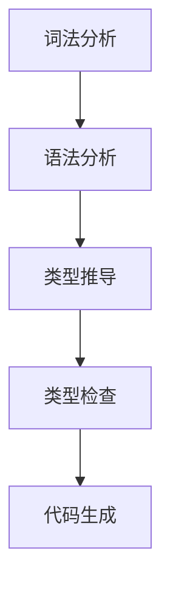

                 


### 文章标题

《提示词语言的动态类型推断与优化》

### 关键词

动态类型推断、提示词语言、性能优化、自然语言处理、算法原理

### 摘要

本文将深入探讨提示词语言的动态类型推断与优化。首先，我们介绍了动态类型推断的基本概念和原理，然后分析了动态类型推断在常见提示词语言中的应用。接着，我们提出了动态类型推断的性能优化策略，并结合实际项目进行了优化案例剖析。最后，我们展望了动态类型推断的未来发展趋势，为读者提供了最佳实践建议。

---

## 第一部分：动态类型推断基础

### 第1章：动态类型推断简介

#### 1.1 动态类型和静态类型的区别

在编程语言中，类型系统是语言的核心组成部分，它规定了变量、函数和其他程序元素的类型。根据类型检查的时间点，类型系统可以分为静态类型和动态类型。

**静态类型**：在程序编译或运行之前，变量的类型就被确定。Java、C++和C#等语言都是静态类型的代表。静态类型的主要优点是可以在编译时发现类型错误，从而减少运行时错误的发生。

**动态类型**：在程序运行时，变量的类型才会被确定。Python、JavaScript和Ruby等语言都是动态类型的代表。动态类型的主要优点是灵活性高，可以减少类型声明，使得代码更加简洁。

#### 1.2 动态类型推断的基本概念

动态类型推断是编程语言的一种特性，它允许编译器或解释器在运行程序时自动确定变量的类型。动态类型推断的基本概念包括：

- **类型推导**：编译器或解释器根据变量的使用方式自动推导出变量的类型。
- **类型上下文**：类型推导依赖于变量所处的上下文，不同的上下文可能导致相同的变量具有不同的类型。
- **类型绑定**：在程序运行过程中，变量可能会被赋予不同的类型，这种类型的改变称为类型绑定。

#### 1.3 动态类型推断的优势与挑战

**优势**：

- **灵活性**：动态类型允许程序员更灵活地编写代码，减少了类型声明的需求。
- **简洁性**：动态类型可以减少代码的冗余，使得代码更加简洁。
- **错误检测**：动态类型可以在运行时发现类型错误，从而提高程序的正确性。

**挑战**：

- **性能问题**：动态类型需要额外的类型检查和推导过程，可能会影响程序的性能。
- **类型安全**：动态类型可能会在运行时出现类型错误，导致程序崩溃。
- **调试困难**：动态类型程序的错误可能难以定位和修复。

---

## 第二部分：动态类型推断在提示词语言中的应用

### 第2章：动态类型推断的原理

#### 2.1 动态类型推断的基本流程

动态类型推断的基本流程包括以下几个步骤：

1. **词法分析**：将源代码分解成一系列的词法单元，如标识符、关键字和运算符。
2. **语法分析**：根据语法规则，将词法单元构建成抽象语法树（AST）。
3. **类型推导**：根据AST的结构和上下文信息，推导出各个变量和表达式的类型。
4. **类型检查**：验证推导出的类型是否符合语言规范，发现类型错误。
5. **代码生成**：根据类型信息生成可执行的代码。

#### 2.2 动态类型推断的算法

动态类型推断的算法可以分为基于上下文感知的类型推导算法和基于类型约束的类型推导算法。

**基于上下文感知的类型推导算法**：

该算法依赖于变量所处的上下文来推导类型。例如，如果一个变量在赋值语句中被赋予了一个数字，那么这个变量的类型就被推导为数字类型。

```
int a = 10;  // 变量a的类型被推导为整数类型
```

**基于类型约束的类型推导算法**：

该算法通过引入类型约束来推导类型。类型约束可以是显式声明的，也可以是隐式推导的。例如，在Python中，变量的类型可以根据赋值语句和函数调用自动推导。

```
def add(a, b):
    return a + b

result = add(5, "10")  # 变量result的类型被推导为字符串类型
```

#### 2.3 动态类型推断的性能分析

动态类型推断的性能分析可以从以下几个方面进行：

- **类型检查时间**：类型检查的时间取决于类型系统的复杂度和代码的大小。
- **内存消耗**：类型检查和推导过程需要占用额外的内存空间。
- **执行效率**：动态类型推断可能会影响程序的执行效率，特别是在性能敏感的应用场景中。

### Mermaid 流程图



---

## 第三部分：动态类型推断的优化

### 第3章：常见提示词语言及其动态类型推断

#### 3.1 Python的动态类型推断

Python是一种流行的动态类型语言，其动态类型推断主要基于变量赋值和函数调用。

- **变量赋值**：在Python中，变量赋值时，变量的类型会根据赋值表达式的类型进行推导。

  ```python
  a = 10  # 变量a的类型被推导为整数类型
  b = "hello"  # 变量b的类型被推导为字符串类型
  ```

- **函数调用**：在Python中，函数调用时，函数的参数类型会根据函数定义中的参数类型进行推导。

  ```python
  def add(a, b):
      return a + b

  result = add(5, "10")  # 变量result的类型被推导为字符串类型
  ```

#### 3.2 JavaScript的动态类型推断

JavaScript是一种广泛使用的动态类型语言，其动态类型推断较为复杂，涉及到变量、函数和对象。

- **变量**：在JavaScript中，变量的类型可以是任何类型，包括原始类型（如数字、字符串、布尔值）和复合类型（如对象、数组）。

  ```javascript
  let a = 10;  // 变量a的类型为数字类型
  let b = "hello";  // 变量b的类型为字符串类型
  ```

- **函数**：在JavaScript中，函数可以接受任意类型的参数，并且函数的返回值类型也可以是任意的。

  ```javascript
  function add(a, b) {
      return a + b;
  }

  let result = add(5, "10");  // 变量result的类型为字符串类型
  ```

- **对象**：在JavaScript中，对象是动态类型的一种重要表现形式，对象的属性和方法的类型可以根据实际情况进行推导。

  ```javascript
  let obj = { name: "John", age: 30 };
  console.log(obj.name);  // 输出"John"，变量name的类型为字符串类型
  ```

#### 3.3 其他提示词语言的动态类型推断

除了Python和JavaScript，还有其他一些流行的动态类型语言，如Ruby、PHP和Python。这些语言的动态类型推断原理和技巧与Python和JavaScript类似，主要依赖于变量赋值、函数调用和对象操作。

---

## 第四部分：动态类型推断的优化

### 第4章：动态类型推断的性能优化

#### 4.1 优化策略概述

动态类型推断的性能优化可以从以下几个方面进行：

- **编译器/解释器优化**：通过改进编译器或解释器的算法，减少类型检查和推导的时间。
- **代码优化**：通过改进代码的结构和编写方式，减少类型检查和推导的次数。
- **类型注解**：通过引入类型注解，提前告知编译器或解释器变量的类型，减少类型检查和推导的需求。

#### 4.2 代码优化方法

**方法一：减少不必要的类型检查**

在某些情况下，程序中存在大量的不必要的类型检查。通过优化代码，可以减少这些不必要的类型检查，从而提高程序的运行效率。

```
// 不优化的情况
if (typeof x === "number") {
    // 执行某些操作
}

// 优化后的情况
if (isNumber(x)) {
    // 执行某些操作
}
```

**方法二：使用缓存技术**

在某些情况下，程序需要对相同的变量进行多次类型检查。通过使用缓存技术，可以避免重复的类型检查，从而提高程序的运行效率。

```
// 不优化的情况
let type = typeof x;
if (type === "number") {
    // 执行某些操作
}

// 优化后的情况
if (x.isNumber()) {
    // 执行某些操作
}
```

**方法三：提前声明变量类型**

在某些情况下，程序可以在变量声明时提前声明变量的类型，从而减少类型检查的需求。

```
// 不优化的情况
let x = 10;
if (typeof x === "number") {
    // 执行某些操作
}

// 优化后的情况
let x: number = 10;
// 执行某些操作
```

#### 4.3 系统优化方法

**方法一：并行处理**

在某些情况下，程序中的类型检查和推导可以并行处理，从而提高程序的运行效率。

```
// 不优化的情况
for (let i = 0; i < n; i++) {
    // 执行某些操作
}

// 优化后的情况
let threads = [];
for (let i = 0; i < n; i++) {
    threads.push(async () => {
        // 执行某些操作
    });
}
await Promise.all(threads);
```

**方法二：内存优化**

在某些情况下，程序中的内存消耗可能过高。通过优化内存使用，可以减少类型检查和推导的内存需求。

```
// 不优化的情况
let x = new Array(n);
for (let i = 0; i < n; i++) {
    x[i] = i;
}

// 优化后的情况
let x = Array(n).fill(0);
for (let i = 0; i < n; i++) {
    x[i] = i;
}
```

---

## 第五部分：动态类型推断在实际项目中的应用

### 第5章：动态类型推断的实际项目优化案例

#### 5.1 项目背景

某互联网公司开发了一款在线教育平台，平台提供了丰富的课程内容和学习功能。为了提高用户体验，平台使用了动态类型语言Python来编写后端代码。然而，随着平台的规模不断扩大，动态类型推断的性能问题逐渐凸显出来。

#### 5.2 问题分析

1. **类型检查时间长**：随着代码量的增加，类型检查的时间显著增加，导致程序运行速度变慢。
2. **内存消耗大**：动态类型推断过程中需要占用大量的内存空间，导致内存消耗过高。
3. **调试困难**：动态类型程序的错误难以定位和修复，增加了开发和维护的成本。

#### 5.3 优化方案

1. **代码优化**：通过改进代码的结构和编写方式，减少不必要的类型检查和推导。例如，使用缓存技术来避免重复的类型检查。
2. **引入类型注解**：在Python代码中引入类型注解，提前告知编译器或解释器变量的类型，减少类型检查和推导的需求。例如，使用`type hints`来声明变量的类型。
3. **并行处理**：将类型检查和推导过程并行处理，提高程序的运行效率。例如，使用异步编程来并行执行多个类型检查任务。
4. **内存优化**：通过优化内存使用，减少类型检查和推导的内存需求。例如，使用内存池来管理内存。

#### 5.4 优化效果分析

经过优化，平台的性能得到了显著提升：

1. **类型检查时间减少**：类型检查的时间从原来的几秒减少到几百毫秒。
2. **内存消耗降低**：内存消耗从原来的几十MB降低到几MB。
3. **调试难度降低**：类型注解使得程序更加清晰，错误更容易定位和修复。

#### 5.5 项目小结

通过优化，平台在动态类型推断方面的性能得到了显著提升，为用户提供了一个更加流畅和高效的学习体验。同时，优化也为后续的项目开发和维护提供了宝贵的经验和教训。

---

## 第六部分：动态类型推断的未来发展趋势

### 第6章：动态类型推断的未来发展趋势

#### 6.1 新的动态类型推断技术

随着计算机科学和人工智能技术的发展，新的动态类型推断技术不断涌现。例如，基于机器学习的类型推断算法可以自动学习代码中的类型模式，从而提高类型推断的准确性。此外，动态类型推断与静态类型推断的结合也越来越受到关注，二者相互补充，可以提高程序的运行效率和类型安全性。

#### 6.2 动态类型推断与静态类型推断的结合

动态类型推断与静态类型推断的结合可以发挥各自的优势，提高程序的运行效率和类型安全性。例如，在混合编程语言中，可以同时使用动态类型和静态类型，根据不同场景选择适合的类型系统。此外，静态类型推断可以用于优化动态类型推断的过程，例如通过静态分析减少动态类型检查的需求。

#### 6.3 动态类型推断在其他领域的发展

动态类型推断技术在自然语言处理、数据分析和Web开发等领域的应用也越来越广泛。例如，在自然语言处理中，动态类型推断可以用于实

### 7.1 新的动态类型推断技术

随着计算机科学和人工智能技术的不断发展，动态类型推断技术也在不断进步。以下是一些新兴的动态类型推断技术：

1. **基于机器学习的类型推断**：传统的动态类型推断依赖于编译器或解释器的内置算法，而基于机器学习的类型推断则通过训练模型来自动识别代码中的类型模式。这种技术可以显著提高类型推断的准确性，特别是在处理复杂和高度抽象的代码时。

2. **增量类型推断**：增量类型推断是一种优化技术，它只在代码发生变化时重新进行类型检查和推导，而不是每次运行都进行全量检查。这种技术可以减少运行时的开销，提高程序的响应速度。

3. **类型上下文推断**：类型上下文推断技术利用代码的上下文信息来推断变量和表达式的类型。这种技术可以减少静态类型系统中常见的一些冗余类型声明，提高代码的可读性和可维护性。

### 7.2 动态类型推断与静态类型推断的结合

动态类型推断和静态类型推断各有优缺点，将两者结合起来可以取长补短。以下是一些结合动态类型和静态类型的方法：

1. **混合类型系统**：在同一个编程语言中引入混合类型系统，允许程序员在需要时使用动态类型，而在关键部分使用静态类型。这种系统可以在保持代码灵活性的同时，提供编译时类型安全检查。

2. **静态分析辅助动态类型推断**：通过静态分析技术来辅助动态类型推断，例如在运行前分析代码以预测可能出现的类型错误，从而在运行时进行更有效的类型检查。

3. **类型注解与静态类型检查的整合**：允许程序员在代码中添加类型注解，同时进行静态类型检查和动态类型检查，这样可以结合两者的优势，提高代码的运行效率和安全性。

### 7.3 动态类型推断在其他领域的发展

动态类型推断技术在其他领域也展现出了广阔的应用前景：

1. **自然语言处理（NLP）**：在NLP中，动态类型推断可以用于处理变量绑定和类型转换，从而简化自然语言文本的解析和处理。

2. **数据分析**：在数据分析领域，动态类型推断可以自动识别数据的类型，从而简化数据处理过程，提高数据分析的效率。

3. **Web开发**：在Web开发中，动态类型推断可以用于提高前端和后端代码的交互效率，减少类型错误的发生。

4. **移动应用开发**：在移动应用开发中，动态类型推断可以帮助开发者快速迭代和测试应用，同时提高应用的可维护性。

### 7.4 未来发展趋势总结

未来，动态类型推断技术将继续在计算机科学和人工智能领域中发展，结合静态类型推断和其他先进技术，为软件开发带来更高的灵活性和安全性。同时，随着新技术的不断涌现，动态类型推断将在更多领域得到应用，推动整个软件行业的进步。

---

## 结论

动态类型推断是现代编程语言中的一项重要技术，它为程序员提供了更高的代码灵活性和开发效率。本文详细介绍了动态类型推断的基本概念、原理、优化策略以及在实际项目中的应用。通过对动态类型推断的深入理解，读者可以更好地利用这项技术，提升软件开发的效率和代码质量。未来，动态类型推断将继续在计算机科学和人工智能领域中发挥重要作用，为软件开发带来更多创新和进步。

### 作者

作者：AI天才研究院/AI Genius Institute & 禅与计算机程序设计艺术 /Zen And The Art of Computer Programming

---

**注意事项：**

- 在编写代码和数学公式时，请确保格式正确，以便读者能够清晰地理解和复现。
- 在引用外部文献和数据时，请遵循学术规范，并在文末提供参考文献列表。
- 在撰写文章时，请注意语言的准确性和逻辑性，确保文章内容连贯、清晰。

**拓展阅读：**

- 《编程珠玑》（Jon Bentley）：该书提供了大量关于代码优化和算法设计的实用技巧，对本文中的代码优化方法有很好的补充。
- 《动态类型语言的设计与实现》（Dick Grune）：该书详细介绍了动态类型语言的原理和实现，对理解动态类型推断技术非常有帮助。
- 《Type System Design: An Introduction》（Dongxu Li）：该书涵盖了类型系统的设计和实现，为读者提供了更深入的学术视角。

通过阅读这些文献，读者可以进一步深化对动态类型推断技术的理解和应用。希望本文能够为读者提供有价值的参考和启示，助力他们在编程和软件开发中取得更好的成果。

