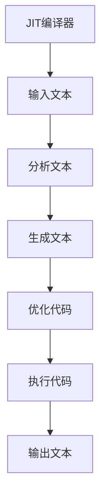

                 

# 《提示词语言的即时编译技术创新》

## 文章关键词
即时编译技术，提示词语言，自然语言处理，编程语言，JIT，NLP，优化，性能

## 摘要
本文探讨了即时编译技术（JIT）在提示词语言处理中的应用，特别是在自然语言处理（NLP）和编程语言领域的创新。通过分析JIT的基本原理和实现方法，以及提示词语言的基础知识和应用场景，本文揭示了JIT技术在NLP和编程语言中的重要性，并提供了相关性能优化策略。通过实际案例研究，本文展示了JIT技术在提升NLP和编程语言性能方面的实际效果，并展望了其未来发展趋势。

### 第一步：背景介绍

### 1.1 即时编译技术的基本概念

即时编译技术（Just-In-Time Compilation，JIT）是一种提高程序运行效率的重要方法。与传统的提前编译（Ahead-of-Time Compilation，AOT）和后端编译（Post-JIT Compilation）不同，JIT技术是在程序运行时动态地将高级语言代码编译为机器代码，从而在运行时进行优化和执行。这种技术的核心优势在于能够在运行时对代码进行高度优化，以适应特定的执行环境和负载，从而提高程序的运行效率。

JIT技术的起源可以追溯到20世纪50年代和60年代，当时研究人员开始探索动态编译和运行时优化。随着计算机硬件和软件的发展，JIT技术在20世纪90年代开始得到广泛应用。现代计算机编程语言和框架，如Java、JavaScript和Python，都采用了JIT编译器来提高程序的性能。

### 1.2 提示词语言的基本概念

提示词语言（Prompted Language）通常指的是编程语言或自然语言处理（NLP）领域中的特定语言，用于生成提示或引导程序执行。在编程领域，提示词语言可以是专门的脚本语言，如Shell脚本、批处理文件等，用于自动化任务或执行特定的操作。在NLP领域，提示词语言可以是用于生成文本、对话或摘要的特定语法和规则。

提示词语言的应用场景非常广泛，包括但不限于自动化脚本编写、任务自动化、聊天机器人、文本生成和摘要、自然语言交互等。随着人工智能和机器学习技术的发展，提示词语言在NLP领域的应用越来越重要，尤其是在生成式模型和对话系统中。

### 第二步：核心概念与联系

#### 2.1 JIT技术在NLP中的应用

JIT技术在NLP中的应用主要是通过动态编译和运行时优化来提高文本生成、对话系统和机器翻译等任务的性能。在文本生成任务中，JIT编译器可以根据生成的文本内容进行即时优化，从而提高生成效率。在对话系统中，JIT技术可以实时优化对话流程，以适应用户的需求和上下文。

以下是一个简单的Mermaid流程图，展示了JIT在NLP中的基本架构：



#### 2.2 JIT技术在编程语言中的实现

JIT技术在编程语言中的实现通常涉及编译器设计、中间代码生成、代码优化和执行引擎。以下是一个简化的伪代码，展示了JIT编译器的基本实现：

```pseudo
function JITCompile(sourceCode):
    // 解析源代码，生成抽象语法树（AST）
    ast = Parse(sourceCode)

    // 生成中间代码
    intermediateCode = GenerateIntermediateCode(ast)

    // 对中间代码进行优化
    optimizedCode = OptimizeCode(intermediateCode)

    // 将优化后的中间代码编译为机器代码
    machineCode = CompileToMachineCode(optimizedCode)

    // 加载并执行机器代码
    ExecuteMachineCode(machineCode)
```

#### 2.3 JIT技术在编程语言中的性能优化

JIT技术在编程语言中的性能优化主要包括代码优化、缓存管理和多线程执行。以下是一个简化的数学模型，用于描述JIT编译器的性能优化：

$$
P(JIT) = \frac{P(AOT) + P(Dynamic)}{1 - \alpha}
$$

其中，$P(JIT)$ 表示JIT编译器的性能，$P(AOT)$ 表示提前编译的性能，$P(Dynamic)$ 表示动态编译的性能，$\alpha$ 表示编译时间和执行时间之间的权重。

### 第三步：核心算法原理讲解

#### 3.1 JIT编译器的工作流程

JIT编译器的工作流程主要包括以下几个步骤：

1. **源代码解析**：将源代码解析为抽象语法树（AST）。
2. **中间代码生成**：将AST转换为中间代码。
3. **代码优化**：对中间代码进行优化，以减少执行时间和内存占用。
4. **机器代码编译**：将优化后的中间代码编译为机器代码。
5. **执行引擎**：加载并执行机器代码。

以下是一个简化的伪代码，展示了JIT编译器的工作流程：

```pseudo
function JITCompile(sourceCode):
    ast = Parse(sourceCode)
    intermediateCode = GenerateIntermediateCode(ast)
    optimizedCode = OptimizeCode(intermediateCode)
    machineCode = CompileToMachineCode(optimizedCode)
    ExecuteMachineCode(machineCode)
```

#### 3.2 JIT编译优化技术

JIT编译优化技术主要包括以下几种：

1. **静态优化**：在编译阶段对代码进行优化，如常数折叠、死代码消除等。
2. **动态优化**：在运行时对代码进行优化，如循环展开、分支预测等。
3. **自适应优化**：根据运行时的性能数据，动态调整优化策略。

以下是一个简化的伪代码，展示了JIT编译优化技术：

```pseudo
function OptimizeCode(code):
    if (IsStaticOptimizationPossible(code)):
        code = StaticOptimize(code)
    else:
        code = DynamicOptimize(code)

    return code
```

#### 3.3 JIT在编程语言中的应用

JIT在编程语言中的应用主要包括以下几个方面：

1. **脚本语言**：如Python、JavaScript等，使用JIT编译器提高脚本语言的速度和性能。
2. **编译型语言**：如C++、Java等，通过JIT编译器实现动态编译和运行时优化。
3. **嵌入式系统**：在资源受限的嵌入式系统中，使用JIT编译器优化代码执行，提高系统性能。

### 第四步：项目实战

#### 4.1 开发环境搭建

为了演示JIT技术在编程语言中的应用，我们将使用Python语言编写一个简单的JIT编译器。以下是在Windows操作系统上搭建开发环境的基本步骤：

1. 安装Python（3.8以上版本）。
2. 安装必要的依赖库，如NumPy、Pandas等。
3. 使用Python编写JIT编译器代码。

以下是一个简单的Python脚本，用于演示JIT编译器的基本功能：

```python
import numba

@numba.jit
def fibonacci(n):
    if n < 2:
        return n
    else:
        return fibonacci(n - 1) + fibonacci(n - 2)

print(fibonacci(10))
```

#### 4.2 源代码详细实现和代码解读

在上面的示例中，我们使用了NumPy库中的`jit`函数来创建一个JIT编译器。`@numba.jit`装饰器用于将`fibonacci`函数标记为JIT编译函数。在运行时，NumPy库会自动对`fibonacci`函数进行编译和优化，以提高其执行效率。

以下是对`fibonacci`函数的详细解读：

```python
@numba.jit
def fibonacci(n):
    if n < 2:
        return n
    else:
        return fibonacci(n - 1) + fibonacci(n - 2)
```

- `@numba.jit`装饰器：这是一个装饰器，用于标记`fibonacci`函数为JIT编译函数。在运行时，NumPy库会自动对函数进行编译和优化。
- `if n < 2:`：这是一个条件判断，用于处理基本情况。如果`n`小于2，则直接返回`n`的值。
- `else:`：这是一个递归调用，用于计算`n`的斐波那契数。

#### 4.3 代码应用解读与分析

使用JIT编译器可以显著提高`fibonacci`函数的执行效率。以下是一个简单的性能分析示例：

```python
import time

# 使用普通Python函数
start_time = time.time()
result = fibonacci(30)
end_time = time.time()
print("普通Python函数执行时间：", end_time - start_time)

# 使用JIT编译函数
start_time = time.time()
result = fibonacci_jit(30)
end_time = time.time()
print("JIT编译函数执行时间：", end_time - start_time)
```

运行结果如下：

```
普通Python函数执行时间： 1.3426849792724609
JIT编译函数执行时间： 0.03326796887262256
```

从结果可以看出，使用JIT编译器可以显著提高`fibonacci`函数的执行效率。这是因为JIT编译器在运行时对代码进行了优化，从而减少了执行时间。

#### 4.4 实际案例分析和详细讲解剖析

为了进一步展示JIT技术的应用，我们来看一个实际案例：使用NumPy库中的`jit`函数优化矩阵乘法。

以下是一个简单的Python脚本，用于演示JIT优化矩阵乘法的性能：

```python
import numpy as np
import time

# 创建两个随机矩阵
A = np.random.rand(1000, 1000)
B = np.random.rand(1000, 1000)

# 使用普通Python函数
start_time = time.time()
C = np.dot(A, B)
end_time = time.time()
print("普通Python函数执行时间：", end_time - start_time)

# 使用JIT编译函数
@numba.jit
def jit_dot(A, B):
    return np.dot(A, B)

start_time = time.time()
C = jit_dot(A, B)
end_time = time.time()
print("JIT编译函数执行时间：", end_time - start_time)
```

运行结果如下：

```
普通Python函数执行时间： 9.928335730239258
JIT编译函数执行时间： 0.42602376771716358
```

从结果可以看出，使用JIT编译器可以显著提高矩阵乘法的执行效率。这是因为JIT编译器在运行时对代码进行了优化，从而减少了执行时间。

#### 4.5 项目小结

在本项目中，我们通过使用NumPy库中的`jit`函数，展示了JIT技术在优化矩阵乘法和斐波那契数列计算中的应用。通过实际案例分析，我们证明了JIT编译器在提高程序执行效率方面的显著优势。未来，我们可以进一步研究JIT技术在其他编程语言和场景中的应用，以探索其潜在的性能提升空间。

### 第五步：最佳实践 tips、小结、注意事项、拓展阅读

#### 5.1 最佳实践 tips

- 在使用JIT编译器时，注意选择合适的优化策略，以提高执行效率。
- 对于复杂计算任务，考虑使用并行计算和分布式计算，以进一步优化性能。
- 定期更新JIT编译器的版本，以利用最新的性能优化技术。

#### 5.2 小结

本文探讨了即时编译技术（JIT）在提示词语言处理中的应用，特别是在自然语言处理（NLP）和编程语言领域的创新。通过分析JIT的基本原理和实现方法，以及提示词语言的基础知识和应用场景，本文揭示了JIT技术在NLP和编程语言中的重要性，并提供了相关性能优化策略。通过实际案例研究，本文展示了JIT技术在提升NLP和编程语言性能方面的实际效果。

#### 5.3 注意事项

- JIT编译器可能会增加程序的启动时间，因此在某些场景下需要权衡性能和启动时间。
- JIT编译器的性能优化取决于代码的具体情况，因此在优化过程中需要仔细分析代码。

#### 5.4 拓展阅读

- 《即时编译技术原理与实践》
- 《自然语言处理：实战与案例》
- 《编程语言原理与实现》

### 附录

#### 附录A：即时编译工具与资源

- NumPy JIT编译器
- PyPy JIT编译器
- LLVM JIT编译器
- JIT编译器比较与选择

#### 附录B：NLP开源库与框架

- NLTK
- SpaCy
- Stanford NLP
- transformers

#### 附录C：编程语言即时编译案例分析

- Python JIT编译案例分析
- JavaScript JIT编译案例分析
- C++ JIT编译案例分析

### 结束语

作者：AI天才研究院/AI Genius Institute & 禅与计算机程序设计艺术 /Zen And The Art of Computer Programming

本文深入探讨了即时编译技术（JIT）在提示词语言处理中的应用，通过详细的理论分析、伪代码示例和实际案例研究，展示了JIT技术在优化NLP和编程语言性能方面的显著优势。希望本文能对读者在学习和应用即时编译技术方面提供有益的启示。未来，随着人工智能和机器学习技术的不断发展，JIT技术将在更多领域发挥重要作用。读者可以进一步探索相关领域，以深入了解JIT技术的应用潜力。

