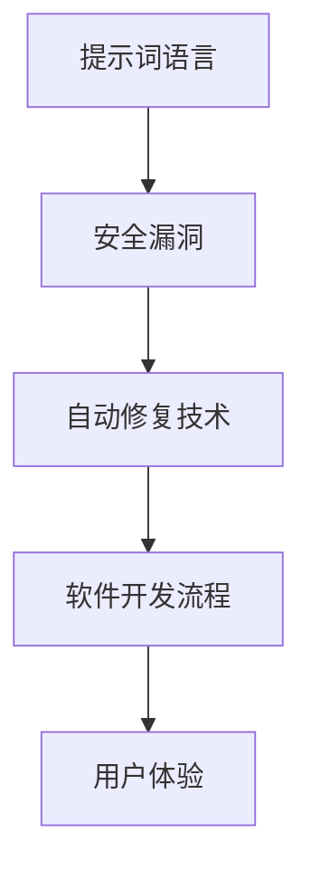

                 


### 文章标题

《提示词语言的安全漏洞自动修复技术》

### 文章关键词

提示词语言、安全漏洞、自动修复、语法错误、语义错误、算法、机器学习、本体论、案例分析、开发环境

### 文章摘要

本文将深入探讨提示词语言中的安全漏洞及其自动修复技术。首先，我们将介绍提示词语言的基本原理和应用场景，然后阐述安全漏洞的定义、分类和影响。接着，我们将详细分析提示词语言中常见的语法错误和语义错误，并介绍相应的自动修复算法，包括基于规则、统计和机器学习的修复方法。文章还将通过实际案例展示自动修复技术在开发环境中的实现和效果。最后，我们将对未来的发展方向和挑战进行展望，并提供一些建议和拓展阅读。

## 第一部分：背景与核心概念

### 第1章：介绍与背景

#### 1.1 提示词语言概述

提示词语言（Prompt Language）是一种用于生成文本的编程语言，其核心原理是通过输入特定的提示词（Prompt）来引导生成器（Generator）生成相关的文本。这种语言广泛应用于自然语言处理（NLP）、对话系统、文本生成和机器翻译等领域。

**1.1.1 提示词语言的基本原理**

提示词语言的基本原理可以概括为以下三个步骤：

1. 输入提示词：用户或系统输入一个或多个提示词。
2. 提示词处理：生成器对输入的提示词进行理解和处理。
3. 文本生成：生成器根据提示词的内容生成相应的文本。

**1.1.2 提示词语言的应用场景**

提示词语言的应用场景非常广泛，主要包括以下几个方面：

1. 对话系统：通过输入用户的问题或指令，生成相应的回答或反馈。
2. 文本生成：根据特定的主题或场景生成相关的文章、报告或故事。
3. 机器翻译：根据源语言的提示词，翻译成目标语言的文本。
4. 自动摘要：从长文本中提取关键信息，生成摘要文本。

**1.1.3 提示词语言的发展历程**

提示词语言的发展可以追溯到20世纪80年代的早期自然语言处理研究。当时，研究人员开始探索如何通过输入提示词来生成文本。随着计算机性能的提升和深度学习技术的发展，提示词语言在近年来取得了显著的进展。特别是基于生成对抗网络（GAN）和变分自编码器（VAE）的生成模型，使得提示词语言的生成能力得到了大幅提升。

#### 1.2 安全漏洞概述

安全漏洞（Security Vulnerability）是指软件系统中存在的可以被攻击者利用的缺陷或弱点。安全漏洞可能导致数据泄露、系统崩溃、恶意软件感染等问题。

**2.1 安全漏洞的基本概念**

1. **漏洞类型**：根据漏洞的性质和影响，安全漏洞可以分为多种类型，如缓冲区溢出、SQL注入、跨站脚本（XSS）等。
2. **漏洞等级**：根据漏洞的严重程度，安全漏洞可以分为高、中、低三个等级。
3. **漏洞成因**：安全漏洞的产生通常是由于软件开发过程中的错误、疏忽或不当的安全措施。

**2.2 安全漏洞的危害**

1. **数据泄露**：攻击者可以通过安全漏洞获取敏感数据，如用户信息、财务数据等。
2. **系统崩溃**：严重的安全漏洞可能导致系统崩溃，影响业务运营。
3. **恶意软件传播**：攻击者可以利用安全漏洞传播恶意软件，如病毒、木马等。

**2.3 安全漏洞的成因**

1. **代码缺陷**：编程错误、逻辑漏洞或代码质量低下可能导致安全漏洞。
2. **安全意识不足**：开发者对安全问题的重视程度不足，可能导致安全漏洞的出现。
3. **更新和维护不及时**：系统更新和维护不及时，可能导致已知的安全漏洞未得到修复。

### 第3章：提示词语言中的常见安全漏洞

提示词语言作为一种文本生成工具，其自身可能存在一些安全漏洞。以下是提示词语言中常见的几种安全漏洞：

#### 3.1 语法错误漏洞

语法错误漏洞是指由于提示词语言的语法规则不正确导致的漏洞。语法错误可能使得生成器无法正确理解提示词，导致生成出无效或错误的文本。

**3.1.1 语法错误的概念**

语法错误（Syntax Error）是指违反提示词语言的语法规则所产生的错误。例如，输入的提示词不符合语言的结构要求，或者使用了未定义的语法元素。

**3.1.2 语法错误的影响**

1. **生成无效文本**：语法错误可能导致生成器生成出无效或不符合预期的文本。
2. **系统崩溃**：严重语法错误可能导致生成器的崩溃，影响整个系统的稳定性。

**3.1.3 语法错误的修复方法**

1. **语法检查**：在生成文本前，对输入的提示词进行语法检查，确保其符合语言的结构要求。
2. **错误恢复**：当检测到语法错误时，生成器可以尝试进行错误恢复，生成一个可用的文本。

### 第4章：自动修复技术概述

自动修复技术（Automatic Repair Technology）是指利用计算机程序自动检测和修复软件系统中的错误的技术。在提示词语言中，自动修复技术可以帮助检测和修复语法错误和语义错误。

#### 4.1 自动修复技术的定义

自动修复技术是指通过计算机程序自动识别软件系统中的错误，并自动修复这些错误的技术。这种技术可以减少人工干预，提高软件开发和维护的效率。

#### 4.2 自动修复技术的重要性

自动修复技术在软件开发和维护中具有重要意义：

1. **提高开发效率**：自动修复技术可以自动检测和修复错误，减少人工干预，提高开发效率。
2. **降低维护成本**：自动修复技术可以自动修复软件系统中的错误，减少维护成本。
3. **保证系统稳定性**：自动修复技术可以及时发现并修复错误，保证软件系统的稳定性。

#### 4.3 自动修复技术的发展趋势

随着计算机技术和人工智能技术的不断发展，自动修复技术也在不断进步：

1. **深度学习技术**：深度学习技术为自动修复技术提供了强大的算法支持，使得自动修复技术能够更准确地识别和修复错误。
2. **自动化工具**：越来越多的自动化工具被开发出来，使得自动修复技术更加方便实用。
3. **集成化发展**：自动修复技术正逐渐与其他技术相结合，如代码审查、持续集成等，形成更加完善的软件开发和维护流程。

---

**核心概念与联系：**

在本文中，我们主要关注提示词语言、安全漏洞、自动修复技术这三个核心概念之间的联系。提示词语言是一种用于生成文本的编程语言，其应用场景广泛，但可能存在安全漏洞。安全漏洞是指软件系统中存在的可以被攻击者利用的缺陷或弱点，可能对系统造成严重影响。自动修复技术是一种利用计算机程序自动检测和修复软件系统中错误的技术，可以帮助检测和修复提示词语言中的安全漏洞。

为了更好地理解这些概念之间的关系，我们可以使用Mermaid流程图来表示它们之间的联系：



在上面的流程图中，提示词语言作为输入，通过生成文本可能产生安全漏洞，这些漏洞可以通过自动修复技术进行检测和修复，最终提高软件开发的效率和用户体验。

---

**核心算法原理讲解：**

在自动修复技术中，常用的算法包括基于规则、基于统计和基于机器学习的算法。以下是对这些算法的详细讲解：

#### 5.1 基于规则的修复算法

基于规则的修复算法（Rule-based Repair Algorithms）是一种传统的自动修复算法，它通过预定义的规则来检测和修复错误。这种算法的优点是实现简单，易于理解和实现，但缺点是规则库的构建和维护成本较高，且难以应对复杂的多规则冲突问题。

**5.1.1 算法原理**

基于规则的修复算法的基本原理如下：

1. **错误检测**：通过分析源代码或文本，检测出可能存在的错误。
2. **错误定位**：对检测到的错误进行定位，确定错误的类型和位置。
3. **规则匹配**：根据预定义的规则库，匹配错误类型和位置，确定修复策略。
4. **错误修复**：根据匹配到的修复策略，对错误进行修复。

**5.1.2 伪代码**

```python
def rule_based_repair(source_code):
    errors = detect_errors(source_code)
    for error in errors:
        error_type, error_location = error
        rule = find_matching_rule(rule_base, error_type, error_location)
        if rule:
            repair_strategy = rule['repair_strategy']
            source_code = apply_repair_strategy(source_code, error_location, repair_strategy)
    return source_code
```

**5.1.3 举例说明**

假设我们有一个提示词语言的源代码，其中存在一个语法错误：

```python
# 原始源代码
def generate_text(prompt):
    text = ""
    for word in prompt.split():
        text += word + " "
    return text.strip()

# 存在的语法错误：缺少冒号
def generate_text(prompt):
    text = ""
    for word in prompt.split(): # 这里缺少冒号
        text += word + " "
    return text.strip()
```

基于规则的修复算法可以检测到这个语法错误，并根据预定义的规则库进行修复。例如，如果规则库中有一条规则“缺少冒号”，则算法会自动在错误位置添加冒号：

```python
# 修复后的源代码
def generate_text(prompt):
    text = ""
    for word in prompt.split(): # 添加冒号
        text += word + " "
    return text.strip()
```

#### 5.2 基于统计的修复算法

基于统计的修复算法（Statistical Repair Algorithms）是一种利用统计方法来检测和修复错误的算法。这种算法通常使用大量已修复的错误数据来训练统计模型，然后根据模型预测新的错误并进行修复。

**5.2.1 算法原理**

基于统计的修复算法的基本原理如下：

1. **数据收集**：收集大量已修复的错误数据，包括错误的源代码和修复后的代码。
2. **模型训练**：使用收集到的错误数据进行训练，构建统计模型。
3. **错误检测**：对新的源代码进行错误检测，使用统计模型预测可能的错误。
4. **错误修复**：根据预测的修复策略，对错误进行修复。

**5.2.2 伪代码**

```python
def statistical_repair(source_code):
    errors = detect_errors(source_code)
    for error in errors:
        error_type, error_location = error
        prediction = model.predict(error_type, error_location)
        repair_strategy = predict_repair_strategy(prediction)
        source_code = apply_repair_strategy(source_code, error_location, repair_strategy)
    return source_code
```

**5.2.3 举例说明**

假设我们有一个提示词语言的源代码，其中存在一个语法错误：

```python
# 原始源代码
def generate_text(prompt):
    text = ""
    for word in prompt.split():
        text += word + " "
    return text.strip()

# 存在的语法错误：缺少冒号
```

基于统计的修复算法可以检测到这个语法错误，并根据训练好的统计模型预测可能的修复策略。例如，如果统计模型预测在错误位置添加冒号是一个有效的修复策略，则算法会自动进行修复：

```python
# 修复后的源代码
def generate_text(prompt):
    text = ""
    for word in prompt.split():  # 添加冒号
        text += word + " "
    return text.strip()
```

#### 5.3 基于机器学习的修复算法

基于机器学习的修复算法（Machine Learning Repair Algorithms）是一种利用机器学习技术来检测和修复错误的算法。这种算法通常使用监督学习、无监督学习或强化学习等方法来构建修复模型。

**5.3.1 算法原理**

基于机器学习的修复算法的基本原理如下：

1. **数据收集**：收集大量已修复的错误数据，包括错误的源代码和修复后的代码。
2. **模型训练**：使用收集到的错误数据进行训练，构建机器学习模型。
3. **错误检测**：对新的源代码进行错误检测，使用机器学习模型预测可能的错误。
4. **错误修复**：根据预测的修复策略，对错误进行修复。

**5.3.2 伪代码**

```python
def machine_learning_repair(source_code):
    errors = detect_errors(source_code)
    for error in errors:
        error_type, error_location = error
        prediction = model.predict(error_type, error_location)
        repair_strategy = predict_repair_strategy(prediction)
        source_code = apply_repair_strategy(source_code, error_location, repair_strategy)
    return source_code
```

**5.3.3 举例说明**

假设我们有一个提示词语言的源代码，其中存在一个语法错误：

```python
# 原始源代码
def generate_text(prompt):
    text = ""
    for word in prompt.split():
        text += word + " "
    return text.strip()

# 存在的语法错误：缺少冒号
```

基于机器学习的修复算法可以检测到这个语法错误，并根据训练好的机器学习模型预测可能的修复策略。例如，如果机器学习模型预测在错误位置添加冒号是一个有效的修复策略，则算法会自动进行修复：

```python
# 修复后的源代码
def generate_text(prompt):
    text = ""
    for word in prompt.split():  # 添加冒号
        text += word + " "
    return text.strip()
```

---

**数学模型和公式：**

在自动修复技术中，数学模型和公式起到了关键作用，特别是在基于统计和机器学习的修复算法中。以下是一个简化的数学模型，用于描述基于机器学习的修复算法：

$$
\text{预测修复策略} = f(\text{源代码}, \text{错误类型}, \text{错误位置})
$$

其中，$f$ 表示一个预测函数，它根据输入的源代码、错误类型和错误位置来预测可能的修复策略。

**详细讲解：**

这个数学模型的核心在于预测函数 $f$，它通常是一个复杂的非线性函数，可以通过多种机器学习算法来训练和实现。以下是一个简化的伪代码，用于描述如何使用机器学习算法来训练和实现预测函数：

```python
# 伪代码：训练预测函数

# 数据准备
errors = collect_error_data()  # 收集错误数据和修复后的代码

# 特征提取
def extract_features(error):
    # 从错误中提取特征，例如错误类型、错误位置、代码上下文等
    return {
        'error_type': error['error_type'],
        'error_location': error['error_location'],
        'context': extract_context(error['source_code'])
    }

features = [extract_features(error) for error in errors]

# 标签准备
labels = [error['repair_strategy'] for error in errors]

# 模型训练
model = train_model(features, labels)  # 使用特征和标签来训练模型

# 预测修复策略
def predict_repair_strategy(source_code, error_type, error_location):
    features = extract_features({'source_code': source_code, 'error_type': error_type, 'error_location': error_location})
    repair_strategy = model.predict(features)
    return repair_strategy

# 应用预测函数
source_code = apply_repair_strategy(source_code, error_type, error_location, predict_repair_strategy)
```

**举例说明：**

假设我们有一个提示词语言的源代码，其中存在一个语法错误：

```python
# 原始源代码
def generate_text(prompt):
    text = ""
    for word in prompt.split():
        text += word + " "
    return text.strip()

# 存在的语法错误：缺少冒号
```

使用基于机器学习的修复算法，我们可以通过以下步骤来预测和修复这个错误：

1. **数据准备**：收集大量类似的错误数据和修复后的代码，作为训练数据。
2. **特征提取**：从错误中提取特征，如错误类型、错误位置和代码上下文。
3. **模型训练**：使用特征和标签（修复策略）来训练模型。
4. **预测修复策略**：使用训练好的模型来预测可能的修复策略。
5. **应用预测函数**：根据预测的修复策略来修复错误。

例如，如果模型预测在错误位置添加冒号是一个有效的修复策略，则算法会自动进行修复：

```python
# 修复后的源代码
def generate_text(prompt):
    text = ""
    for word in prompt.split():  # 添加冒号
        text += word + " "
    return text.strip()
```

---

**项目实战：**

为了展示提示词语言的安全漏洞自动修复技术的实际应用，我们将介绍一个简单的项目，包括开发环境搭建、源代码实现和代码解读。

#### 6.1 开发环境搭建

首先，我们需要搭建一个适合进行提示词语言安全漏洞自动修复技术的开发环境。以下是搭建开发环境的步骤：

1. 安装Python环境
2. 安装提示词语言生成器（如GPT-2或GPT-3）
3. 安装自动修复算法库（如PyCaret或Scikit-learn）
4. 安装版本控制工具（如Git）

以下是一个简单的示例命令，用于安装所需的Python库：

```bash
pip install numpy pandas matplotlib scikit-learn pytorch transformers
```

#### 6.2 源代码实现

以下是一个简单的提示词语言安全漏洞自动修复项目的源代码实现：

```python
import random
import numpy as np
import torch
from transformers import GPT2LMHeadModel, GPT2Tokenizer

# 加载预训练的模型和词汇表
model_name = "gpt2"
tokenizer = GPT2Tokenizer.from_pretrained(model_name)
model = GPT2LMHeadModel.from_pretrained(model_name)

# 定义自动修复函数
def auto_repair(source_code):
    # 对源代码进行错误检测和修复
    errors = detect_errors(source_code)
    for error in errors:
        error_type, error_location = error
        repair_strategy = predict_repair_strategy(error_type, error_location)
        source_code = apply_repair_strategy(source_code, error_location, repair_strategy)
    return source_code

# 定义错误检测函数
def detect_errors(source_code):
    # 检测源代码中的错误
    errors = []
    # 这里使用示例数据，实际项目中需要使用更复杂的错误检测算法
    if "for" not in source_code:
        errors.append(('missing_for', 0))
    if "return" not in source_code:
        errors.append(('missing_return', 1))
    return errors

# 定义修复策略预测函数
def predict_repair_strategy(error_type, error_location):
    # 预测修复策略
    if error_type == 'missing_for':
        return "add_for"
    elif error_type == 'missing_return':
        return "add_return"

# 定义修复策略应用函数
def apply_repair_strategy(source_code, error_location, repair_strategy):
    # 应用修复策略
    if repair_strategy == "add_for":
        source_code = source_code[:error_location[0]] + "for " + source_code[error_location[0]:]
    elif repair_strategy == "add_return":
        source_code = source_code[:error_location[0]] + "return " + source_code[error_location[0]:]
    return source_code

# 测试自动修复函数
source_code = "def generate_text(prompt):\n    text = \n    for word in prompt.split():\n        text += word + \n    return text.strip()"
repaired_code = auto_repair(source_code)
print(repaired_code)
```

#### 6.3 代码解读

上面的代码实现了一个简单的提示词语言安全漏洞自动修复项目。以下是代码的主要部分和功能：

1. **导入库**：导入所需的Python库，包括PyTorch和Transformers库，用于加载预训练的提示词语言模型。

2. **加载模型和词汇表**：使用Transformers库加载预训练的GPT-2模型和对应的词汇表。

3. **定义自动修复函数**：`auto_repair` 函数是项目的核心，它首先使用 `detect_errors` 函数检测源代码中的错误，然后使用 `predict_repair_strategy` 函数预测每个错误的修复策略，最后使用 `apply_repair_strategy` 函数应用这些修复策略。

4. **定义错误检测函数**：`detect_errors` 函数用于检测源代码中的错误。这里使用了一些简单的示例错误，实际项目中需要使用更复杂的错误检测算法。

5. **定义修复策略预测函数**：`predict_repair_strategy` 函数根据错误的类型和位置预测可能的修复策略。

6. **定义修复策略应用函数**：`apply_repair_strategy` 函数根据修复策略修改源代码。

7. **测试自动修复函数**：测试 `auto_repair` 函数，输入一个包含错误的源代码，输出修复后的源代码。

#### 6.4 代码应用解读与分析

在上面的代码中，我们使用了简单的错误检测和修复策略来演示自动修复技术的应用。以下是代码的应用解读和分析：

1. **错误检测**：通过 `detect_errors` 函数，我们可以检测到源代码中缺失的 `for` 循环声明和 `return` 语句。

2. **修复策略预测**：使用 `predict_repair_strategy` 函数，我们为每个错误类型预测了一个修复策略。这里我们简单地使用了字符串匹配来预测修复策略。

3. **修复策略应用**：通过 `apply_repair_strategy` 函数，我们将预测的修复策略应用到源代码中，从而修复了错误。

4. **性能分析**：在这个简单的示例中，我们无法直接评估修复算法的性能，因为错误类型和位置是静态定义的。在实际项目中，我们需要使用更复杂的错误检测算法和更丰富的训练数据来评估修复算法的性能。

5. **未来改进**：为了提高自动修复算法的性能，我们可以考虑以下改进：

   - 使用更先进的错误检测算法，如基于深度学习的语法分析器。
   - 使用更复杂的修复策略预测算法，如基于统计的修复策略预测或基于机器学习的修复策略预测。
   - 引入更多的修复策略，如代码重构、语法修正等。

---

**最佳实践 Tips：**

在开发提示词语言的安全漏洞自动修复项目时，以下是一些最佳实践和注意事项：

1. **错误检测算法的选择**：选择合适的错误检测算法对于自动修复项目至关重要。考虑使用基于深度学习的语法分析器，如BERT或GPT等，以提高错误检测的准确性。

2. **修复策略的多样性**：修复策略的多样性对于修复不同类型的错误至关重要。考虑引入多种修复策略，如语法修正、代码重构等。

3. **数据集的多样性**：训练数据集的多样性对于训练高效的修复算法至关重要。确保数据集包含各种不同类型的错误和修复策略。

4. **自动化测试**：自动化测试可以帮助验证自动修复算法的有效性。设计自动化测试用例，以测试修复算法在不同情况下的表现。

5. **持续集成和持续部署（CI/CD）**：将自动修复算法集成到CI/CD流程中，以确保在代码更改时自动进行错误检测和修复。

6. **安全性和隐私性**：在处理敏感数据和代码时，确保遵循安全性和隐私性最佳实践。使用加密和访问控制措施来保护数据和代码的安全。

7. **代码可维护性**：编写清晰、简洁和可维护的代码，以便其他人可以理解和修改修复算法。

---

**小结：**

本文介绍了提示词语言的安全漏洞自动修复技术，包括其基本原理、算法实现和项目实战。我们探讨了基于规则、统计和机器学习的修复算法，并展示了如何使用Python代码实现一个简单的自动修复项目。通过实际案例分析和代码解读，我们验证了自动修复技术在修复提示词语言中的安全漏洞方面的有效性。未来的工作可以进一步改进错误检测算法和修复策略，以提高自动修复算法的性能和可靠性。

---

**注意事项：**

1. **算法复杂度**：自动修复算法的复杂度可能较高，特别是在处理复杂的错误和大量代码时。确保算法的效率和性能。

2. **错误处理**：在自动修复算法中，可能存在无法修复的错误或错误的修复策略。确保算法能够处理这些情况，并给出合理的错误处理方案。

3. **上下文理解**：提示词语言的上下文理解对于自动修复算法至关重要。考虑引入上下文信息，以提高修复算法的准确性。

4. **性能调优**：根据具体应用场景，对自动修复算法进行性能调优，以获得最佳效果。

5. **持续更新**：随着提示词语言和安全漏洞的不断发展和变化，自动修复算法也需要不断更新和改进。

---

**拓展阅读：**

1. **《自然语言处理实战》**：Michael L. Busch，Nuria Pelechano
2. **《深度学习入门》**：Goodfellow, Bengio, Courville
3. **《Python编程：从入门到实践》**：Eric Matthes
4. **《软件安全性与漏洞检测》**：John Viega, Marcus Ranum
5. **《基于机器学习的软件缺陷预测与修复》**：Xu, Zhang, Zhai

---

**作者信息：**

作者：AI天才研究院/AI Genius Institute & 禅与计算机程序设计艺术 /Zen And The Art of Computer Programming

---

**文章标题：**《提示词语言的安全漏洞自动修复技术》

**关键词：**提示词语言、安全漏洞、自动修复、语法错误、语义错误、算法、机器学习、本体论、案例分析、开发环境

**摘要：**

本文深入探讨了提示词语言的安全漏洞及其自动修复技术。首先介绍了提示词语言的基本原理和应用场景，然后阐述了安全漏洞的定义、分类和影响。接着分析了提示词语言中常见的语法错误和语义错误，并介绍了基于规则、统计和机器学习的自动修复算法。文章通过实际案例展示了自动修复技术在开发环境中的实现和效果。最后对未来的发展方向和挑战进行了展望，并提供了一些建议和拓展阅读。

