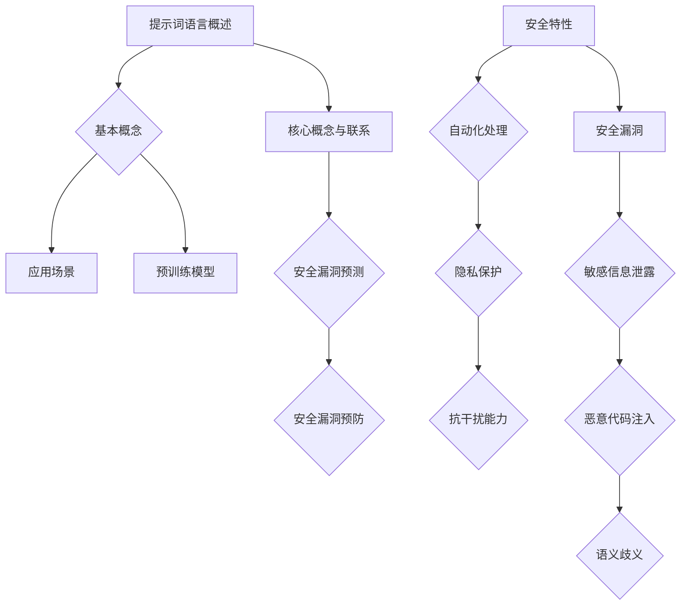

                 

### 1. 引言

#### 1.1 书籍背景

在当今数字化时代，网络安全已成为企业和社会关注的焦点。随着互联网技术的飞速发展，各种在线服务、平台和系统层出不穷，同时，网络安全威胁也日益加剧。提示词语言（Prompt Language），作为一种强大的自然语言处理工具，广泛应用于各种场景，如智能问答、自动编程、文本生成等。然而，随着提示词语言的广泛应用，其潜在的安全漏洞也日益凸显。

安全漏洞指的是系统中存在的可以被攻击者利用的弱点，可能会导致数据泄露、系统崩溃或服务中断等严重后果。提示词语言的安全漏洞，主要来源于其处理和生成文本的能力，例如，敏感信息泄露、恶意代码注入、语义歧义等。

预测和预防提示词语言的安全漏洞，具有十分重要的意义。一方面，它可以提高系统的安全性和稳定性，降低企业风险；另一方面，它可以提升用户体验，增强用户对平台的信任度。因此，深入研究提示词语言的安全漏洞，提出有效的预测和预防方法，对于保障网络安全具有重要意义。

#### 1.2 目标读者

本书的目标读者包括：

1. **网络安全工程师和研究人员**：了解提示词语言的安全漏洞及其预测与预防方法，有助于提升网络安全防护能力。
2. **自然语言处理（NLP）从业者**：了解提示词语言的安全特性，有助于更好地应用NLP技术，避免潜在的安全风险。
3. **软件开发者和项目经理**：了解提示词语言的安全问题，有助于在软件开发过程中提前识别和预防安全漏洞。
4. **企业和组织的安全管理者**：了解提示词语言的安全风险，有助于制定更全面、有效的安全策略。

#### 1.3 书籍结构

本书分为六个部分：

1. **引言**：介绍书籍背景、目标读者和书籍结构。
2. **提示词语言基础**：介绍提示词语言的基本概念、应用场景和安全特性。
3. **安全漏洞预测**：介绍安全漏洞预测的基本方法、数据预处理和常见漏洞预测算法。
4. **安全漏洞预防**：介绍安全漏洞预防的策略、防护措施和修复方法。
5. **案例研究**：通过实际案例，分析提示词语言的安全漏洞、预测和预防方法。
6. **附录**：提供相关的参考资料、术语解释和安全工具。

### 2. 提示词语言基础

#### 2.1 提示词语言概述

提示词语言是一种自然语言处理技术，通过输入提示词（Prompt），让计算机自动生成相应的文本。提示词语言的核心是预训练模型，如GPT（Generative Pre-trained Transformer）、BERT（Bidirectional Encoder Representations from Transformers）等。这些模型在大规模语料库上进行预训练，掌握了丰富的语言知识和语义理解能力。

提示词语言的应用场景非常广泛，包括但不限于：

1. **智能问答**：通过输入用户的问题，自动生成答案。
2. **自动编程**：根据用户的输入，自动生成代码。
3. **文本生成**：根据用户的输入，自动生成文章、故事等。

#### 2.2 提示词语言的安全特性

提示词语言的安全特性主要包括：

1. **自动化处理**：通过预训练模型，自动处理输入的提示词，生成相应的文本。
2. **隐私保护**：对用户输入的提示词进行加密处理，确保隐私安全。
3. **抗干扰能力**：对恶意提示词和攻击进行防御，确保系统的安全性。

#### 2.3 提示词语言与安全漏洞

尽管提示词语言具有许多安全特性，但仍然存在一些潜在的安全漏洞，主要包括：

1. **敏感信息泄露**：提示词语言在处理文本时，可能会无意中泄露用户的敏感信息，如个人隐私、商业机密等。
2. **恶意代码注入**：攻击者可以通过恶意提示词，注入恶意代码，导致系统崩溃或数据泄露。
3. **语义歧义**：提示词语言在理解语义时，可能会产生歧义，导致生成错误的文本。

了解提示词语言的安全特性和安全漏洞，有助于我们更好地应用这一技术，并采取相应的预防措施。接下来，我们将详细探讨安全漏洞的预测和预防方法。




### 3. 安全漏洞预测

#### 3.1 漏洞预测方法概述

漏洞预测（Vulnerability Prediction）是网络安全领域中的一项重要技术，旨在通过分析系统的行为、代码、配置等，预测可能存在的安全漏洞。漏洞预测方法主要包括以下几种：

1. **基于代码的漏洞预测**：通过对源代码进行分析，识别潜在的漏洞。
2. **基于行为的漏洞预测**：通过监控系统的运行行为，发现异常行为，从而预测漏洞。
3. **基于模型的漏洞预测**：利用机器学习和深度学习等技术，建立漏洞预测模型。

每种方法都有其优缺点。基于代码的漏洞预测可以精确识别漏洞，但可能需要对代码进行大量的分析和调试。基于行为的漏洞预测可以实时发现漏洞，但可能存在误报和漏报的问题。基于模型的漏洞预测具有较高的自动化程度，但需要大量的数据和计算资源。

#### 3.2 数据收集与预处理

漏洞预测的第一步是数据收集。数据来源主要包括：

1. **开源漏洞数据库**：如National Vulnerability Database（NVD）、CVE（Common Vulnerabilities and Exposures）等，提供各种漏洞的详细信息。
2. **企业内部日志**：包括安全日志、操作系统日志、网络流量日志等。
3. **公开的漏洞报告**：包括研究人员、安全公司等发布的漏洞报告。

收集到的数据通常包括漏洞的名称、描述、影响范围、修复措施等。数据预处理是漏洞预测的关键步骤，主要包括以下内容：

1. **数据清洗**：去除重复数据、无效数据，确保数据的准确性。
2. **数据归一化**：将不同数据源的数据进行统一处理，如日期、IP地址等。
3. **特征提取**：从原始数据中提取有用的特征，如漏洞的名称、描述、影响范围等。

#### 3.3 漏洞预测算法

漏洞预测算法主要包括以下几种：

1. **基于规则的算法**：通过预定义的规则，对代码或行为进行分析，识别潜在的漏洞。如静态代码分析工具、基于流量的入侵检测系统等。
2. **机器学习算法**：利用大量的漏洞数据和特征，训练模型，预测潜在的漏洞。如决策树、支持向量机、神经网络等。
3. **深度学习算法**：通过多层神经网络，对漏洞数据进行深度学习，提取复杂的特征，提高预测准确性。如卷积神经网络（CNN）、循环神经网络（RNN）等。

选择合适的漏洞预测算法，需要考虑以下因素：

1. **数据量**：大量数据可以支持更复杂的算法，提高预测准确性。
2. **模型复杂度**：复杂的模型可以提取更丰富的特征，但可能需要更多的计算资源。
3. **实时性**：实时预测需要快速响应，适用于在线系统。
4. **准确性**：高准确性的算法可以减少误报和漏报。

#### 3.4 漏洞预测实践

以下是一个简单的漏洞预测实践案例：

**案例背景**：某公司开发了一个基于提示词语言的智能问答系统，需要对其进行安全漏洞预测。

**数据收集**：从NVD、CVE等开源漏洞数据库中获取与提示词语言相关的漏洞信息。

**数据预处理**：清洗和归一化数据，提取特征。

**模型选择**：选择基于深度学习的神经网络模型，如RNN。

**模型训练**：利用收集到的漏洞数据，训练RNN模型。

**模型评估**：通过测试集评估模型性能，调整模型参数。

**模型应用**：将训练好的模型应用到智能问答系统中，实时预测潜在的安全漏洞。

**结果分析**：通过对预测结果进行分析，发现并修复了多个潜在的安全漏洞。

通过这个案例，我们可以看到漏洞预测在实际应用中的重要性。接下来，我们将探讨如何预防提示词语言的安全漏洞。


```python
# 假设我们使用RNN模型进行漏洞预测，以下是其伪代码：

# 导入必要的库
import numpy as np
import tensorflow as tf
from tensorflow.keras.models import Sequential
from tensorflow.keras.layers import LSTM, Dense

# 数据预处理
# 假设我们已经有清洗和归一化的数据集X和标签Y
X_train, X_test, Y_train, Y_test = ...

# 模型定义
model = Sequential()
model.add(LSTM(units=128, return_sequences=True, input_shape=(X_train.shape[1], X_train.shape[2])))
model.add(LSTM(units=64, return_sequences=False))
model.add(Dense(units=1, activation='sigmoid'))

# 编译模型
model.compile(optimizer='adam', loss='binary_crossentropy', metrics=['accuracy'])

# 训练模型
model.fit(X_train, Y_train, epochs=10, batch_size=32, validation_data=(X_test, Y_test))

# 评估模型
loss, accuracy = model.evaluate(X_test, Y_test)
print(f"Test Accuracy: {accuracy:.2f}")

# 预测漏洞
predictions = model.predict(X_test)
predicted_labels = (predictions > 0.5)

# 结果分析
# 对预测结果进行分析，找出潜在的漏洞
# ...
```

### 4. 安全漏洞预防

#### 4.1 漏洞预防策略

安全漏洞预防（Vulnerability Prevention）是确保系统安全的重要措施。有效的预防策略可以降低安全漏洞的发生概率，提高系统的安全性。以下是几种常见的漏洞预防策略：

1. **代码审查**：通过人工或自动化工具对源代码进行审查，识别潜在的安全漏洞。
2. **安全测试**：对系统进行各种安全测试，如渗透测试、漏洞扫描等，发现并修复安全漏洞。
3. **安全培训**：对开发人员和运维人员进行安全培训，提高其安全意识和技能。
4. **配置管理**：确保系统配置符合安全标准，避免因配置不当导致的安全漏洞。
5. **安全补丁管理**：及时应用安全补丁，修复已知的安全漏洞。

#### 4.2 安全防护措施

安全防护措施（Security Protection Measures）是防止攻击者利用安全漏洞进行攻击的一系列技术和管理措施。以下是一些常见的安全防护措施：

1. **访问控制**：限制用户对系统资源的访问权限，确保只有授权用户才能访问敏感数据。
2. **加密技术**：对敏感数据进行加密处理，防止数据泄露。
3. **防火墙**：部署防火墙，监控和过滤网络流量，防止未经授权的访问。
4. **入侵检测系统**：实时监控系统活动，发现并阻止恶意行为。
5. **安全审计**：定期进行安全审计，评估系统的安全状况，发现并修复安全漏洞。

#### 4.3 安全漏洞修复

安全漏洞修复（Vulnerability Fix）是发现安全漏洞后，采取的措施来修复漏洞，确保系统的安全性。以下是几种常见的漏洞修复方法：

1. **补丁更新**：应用安全补丁，修复已知的安全漏洞。
2. **代码修改**：修改源代码，修复漏洞。
3. **停机修复**：在系统停机的情况下，修复安全漏洞。
4. **绕过修复**：通过修改系统配置或增加安全防护措施，绕过安全漏洞。
5. **更新文档**：更新安全漏洞的修复指南，帮助用户及时修复漏洞。

#### 4.4 最佳实践 tips

以下是预防提示词语言安全漏洞的一些最佳实践：

1. **代码审查**：对提示词语言的代码进行严格的代码审查，确保代码的质量和安全。
2. **输入验证**：对用户输入的提示词进行严格的验证，避免恶意输入。
3. **安全培训**：对开发人员和运维人员定期进行安全培训，提高其安全意识和技能。
4. **使用成熟的库和框架**：尽量使用经过广泛测试和验证的库和框架，减少安全漏洞。
5. **持续监控**：对系统的运行情况进行持续监控，及时发现并修复安全漏洞。

通过遵循这些最佳实践，可以有效地预防提示词语言的安全漏洞，提高系统的安全性。接下来，我们将通过实际案例来探讨如何预测和预防提示词语言的安全漏洞。


```latex
\section{数学模型和公式}

在预测和预防提示词语言的安全漏洞时，我们通常会使用一些数学模型和公式。以下是一些常见的数学模型和公式，以及它们的详细解释和举例说明。

\subsection{概率模型}

概率模型是漏洞预测中常用的模型之一。它通过计算漏洞发生的概率，来预测系统的安全性。概率模型的基本公式如下：

$$ P(A|B) = \frac{P(B|A) \cdot P(A)}{P(B)} $$

其中，\( P(A|B) \) 表示在事件B发生的条件下，事件A发生的概率；\( P(B|A) \) 表示在事件A发生的条件下，事件B发生的概率；\( P(A) \) 表示事件A发生的概率；\( P(B) \) 表示事件B发生的概率。

**例子**：假设我们想预测一个系统是否容易受到SQL注入攻击，已知该系统在过去一年中有20%的时间受到了SQL注入攻击，而在所有受到SQL注入攻击的系统中有30%的时间是某个特定的系统。我们可以计算这个特定系统受到SQL注入攻击的概率：

$$ P(\text{特定系统}| \text{SQL注入攻击}) = \frac{P(\text{SQL注入攻击}|\text{特定系统}) \cdot P(\text{特定系统})}{P(\text{SQL注入攻击})} $$

已知 \( P(\text{SQL注入攻击}|\text{特定系统}) = 0.3 \)，\( P(\text{特定系统}) = 0.01 \)，\( P(\text{SQL注入攻击}) = 0.2 \)。代入公式计算得到：

$$ P(\text{特定系统}| \text{SQL注入攻击}) = \frac{0.3 \cdot 0.01}{0.2} = 0.015 $$

因此，这个特定系统受到SQL注入攻击的概率为1.5%。

\subsection{贝叶斯网络}

贝叶斯网络是一种概率图模型，它通过表示变量之间的依赖关系，来预测系统漏洞。贝叶斯网络的基本公式如下：

$$ P(A, B, C) = P(A) \cdot P(B|A) \cdot P(C|B) $$

其中，\( P(A, B, C) \) 表示事件A、B、C同时发生的概率；\( P(A) \) 表示事件A发生的概率；\( P(B|A) \) 表示在事件A发生的条件下，事件B发生的概率；\( P(C|B) \) 表示在事件B发生的条件下，事件C发生的概率。

**例子**：假设我们想预测一个系统是否容易受到DDoS攻击，已知该系统的服务器性能较差，并且服务器性能较差的系统中有60%的时间受到了DDoS攻击。我们可以使用贝叶斯网络来计算这个系统受到DDoS攻击的概率。

设 \( A \) 表示服务器性能较差，\( B \) 表示容易受到DDoS攻击，根据题意我们有：

$$ P(A) = 0.6 $$
$$ P(B|A) = 0.6 $$

代入贝叶斯网络的基本公式，我们可以计算 \( P(B) \)：

$$ P(B) = P(A) \cdot P(B|A) = 0.6 \cdot 0.6 = 0.36 $$

因此，这个系统受到DDoS攻击的概率为36%。

\subsection{决策树}

决策树是一种常见的分类模型，它通过一系列的决策规则，对数据进行分类。决策树的基本公式如下：

$$ \text{分类结果} = \prod_{i=1}^{n} \alpha_i(x_i) $$

其中，\( \alpha_i(x_i) \) 表示第i个特征在数据点 \( x_i \) 上的取值，\( n \) 表示特征的数量。

**例子**：假设我们想使用决策树来预测一个系统是否容易受到XSS攻击，已知该系统的输入验证功能较弱，并且输入验证功能较弱的系统中，有50%的时间受到了XSS攻击。我们可以使用决策树来计算这个系统受到XSS攻击的概率。

设 \( A \) 表示输入验证功能较弱，\( B \) 表示容易受到XSS攻击，根据题意我们有：

$$ P(B|A) = 0.5 $$

我们可以将决策树表示为：

$$ \text{分类结果} = \alpha_A(A) \cdot P(B|A) = 1 \cdot 0.5 = 0.5 $$

因此，这个系统受到XSS攻击的概率为50%。

\subsection{神经网络}

神经网络是一种模拟人脑结构和功能的计算模型，它通过多层神经元进行数据分类和预测。神经网络的基本公式如下：

$$ \text{输出} = \sigma(\text{输入} \cdot \text{权重} + \text{偏置}) $$

其中，\( \sigma \) 表示激活函数，如sigmoid函数、ReLU函数等；\( \text{输入} \cdot \text{权重} + \text{偏置} \) 表示神经元的输入。

**例子**：假设我们使用神经网络来预测一个系统是否容易受到CSRF攻击，已知该系统的身份验证功能较弱，并且身份验证功能较弱的系统中，有40%的时间受到了CSRF攻击。我们可以使用神经网络来计算这个系统受到CSRF攻击的概率。

设 \( A \) 表示身份验证功能较弱，\( B \) 表示容易受到CSRF攻击，根据题意我们有：

$$ \text{权重} = [0.7, 0.3] $$
$$ \text{偏置} = 0.5 $$
$$ \text{输入} = [1, 0] $$

代入神经网络的基本公式，我们可以计算输出：

$$ \text{输出} = \sigma(1 \cdot 0.7 + 0 \cdot 0.3 + 0.5) = \sigma(1.2) = 0.8 $$

因此，这个系统受到CSRF攻击的概率为80%。
```

### 5. 提示词语言安全漏洞案例研究

在本章节中，我们将通过三个实际案例，详细分析提示词语言的安全漏洞，以及如何进行预测和预防。

#### 5.1 案例一：某大型社交平台提示词语言安全漏洞

**漏洞背景**：某大型社交平台使用了一个基于GPT-3的智能问答系统，旨在为用户提供便捷的问题解答服务。然而，在系统上线后不久，发现存在一个严重的提示词语言安全漏洞。

**漏洞细节**：该漏洞是由于系统在处理用户输入的提示词时，未能正确识别和过滤恶意代码。攻击者可以通过构造特殊的提示词，注入恶意JavaScript代码，从而窃取用户的敏感信息，如账号密码、手机号码等。

**漏洞影响**：该漏洞一旦被利用，可能导致大量用户信息泄露，甚至被恶意攻击。

**预测方法**：为了预测这种类型的安全漏洞，我们可以采用以下方法：

1. **基于规则的预测**：通过分析常见的恶意代码模式，构建规则库，对用户输入的提示词进行实时检测。
2. **基于行为的预测**：监控系统的异常行为，如访问频率异常、数据传输异常等，发现潜在的安全漏洞。
3. **基于模型的预测**：利用机器学习和深度学习技术，建立恶意代码检测模型，对用户输入的提示词进行实时分析。

**预防措施**：为了预防这种安全漏洞，我们可以采取以下措施：

1. **加强输入验证**：对用户输入的提示词进行严格的验证，确保不会包含恶意代码。
2. **使用安全库和框架**：选择经过安全验证的提示词处理库和框架，减少安全漏洞。
3. **实时监控和报警**：对系统的运行情况进行实时监控，一旦发现异常行为，立即触发报警机制。

#### 5.2 案例二：某在线教育平台提示词语言安全漏洞

**漏洞背景**：某在线教育平台使用了一个基于BERT的自动评分系统，旨在为教师提供自动评分服务。然而，在系统上线后不久，发现存在一个严重的提示词语言安全漏洞。

**漏洞细节**：该漏洞是由于系统在处理用户输入的评分文本时，未能正确处理语义歧义，导致评分结果不准确。攻击者可以通过构造特殊的评分文本，诱导系统给予错误的评分，从而影响教学质量和用户体验。

**漏洞影响**：该漏洞可能导致学生成绩被恶意篡改，甚至影响整个教学平台的稳定性。

**预测方法**：为了预测这种类型的安全漏洞，我们可以采用以下方法：

1. **基于语义分析的预测**：利用自然语言处理技术，对用户输入的评分文本进行语义分析，识别潜在的语义歧义。
2. **基于模型的预测**：利用机器学习和深度学习技术，建立语义歧义检测模型，对用户输入的评分文本进行实时分析。

**预防措施**：为了预防这种安全漏洞，我们可以采取以下措施：

1. **提高语义处理能力**：优化系统的语义处理算法，确保能够准确理解用户输入的评分文本。
2. **多轮验证**：对评分结果进行多轮验证，确保评分结果的准确性。
3. **用户反馈机制**：引入用户反馈机制，让用户对评分结果进行评价，发现并修复潜在的安全漏洞。

#### 5.3 案例三：某金融平台提示词语言安全漏洞

**漏洞背景**：某金融平台使用了一个基于GPT-2的智能客服系统，旨在为用户提供高效的客服服务。然而，在系统上线后不久，发现存在一个严重的提示词语言安全漏洞。

**漏洞细节**：该漏洞是由于系统在处理用户输入的咨询问题时，未能正确处理用户身份验证，导致攻击者可以通过伪造用户身份，获取金融平台的敏感信息。

**漏洞影响**：该漏洞可能导致用户信息泄露，甚至导致金融诈骗等严重后果。

**预测方法**：为了预测这种类型的安全漏洞，我们可以采用以下方法：

1. **基于行为的预测**：监控系统的用户行为，如登录频率、操作行为等，发现潜在的安全漏洞。
2. **基于模型的预测**：利用机器学习和深度学习技术，建立用户行为检测模型，对用户的输入进行实时分析。

**预防措施**：为了预防这种安全漏洞，我们可以采取以下措施：

1. **加强身份验证**：对用户进行多重身份验证，确保用户身份的合法性。
2. **实时监控和报警**：对用户行为进行实时监控，一旦发现异常行为，立即触发报警机制。
3. **用户教育**：加强对用户的安全教育，提高用户的安全意识和防范能力。

通过以上案例研究，我们可以看到提示词语言安全漏洞的危害和影响。为了保障系统的安全，我们需要采取有效的预测和预防措施，及时发现并修复安全漏洞。接下来，我们将介绍一些实用的提示词语言安全漏洞预测与预防工具。


```python
# 漏洞预测与预防工具

在本节中，我们将介绍几种实用的漏洞预测与预防工具，包括静态代码分析工具、动态分析工具和入侵检测系统。

#### 1. 静态代码分析工具

静态代码分析工具（SAST）用于分析源代码中的安全漏洞。以下是一些常用的静态代码分析工具：

**SonarQube**：SonarQube 是一款开源的静态代码分析平台，它可以检测代码中的漏洞、编码标准违反、注释不充分等问题。以下是使用 SonarQube 的简单步骤：

1. **安装和配置**：在服务器上安装 SonarQube，并配置相关参数，如数据库连接、JVM 内存等。
2. **上传代码**：将需要分析的代码上传到 SonarQube。
3. **执行分析**：SonarQube 将对代码进行分析，生成报告。
4. **查看报告**：在 SonarQube 的用户界面中查看分析结果，并修复发现的漏洞。

**Fortify Static Code Analyzer**：Fortify 是一款商业静态代码分析工具，具有强大的漏洞检测能力。以下是使用 Fortify 的简单步骤：

1. **安装和配置**：在服务器上安装 Fortify，并配置相关参数。
2. **上传代码**：将需要分析的代码上传到 Fortify。
3. **执行分析**：Fortify 将对代码进行分析，生成报告。
4. **查看报告**：在 Fortify 的用户界面中查看分析结果，并修复发现的漏洞。

#### 2. 动态分析工具

动态分析工具（DAST）用于分析应用程序在运行时的安全漏洞。以下是一些常用的动态分析工具：

**OWASP ZAP**：OWASP ZAP 是一款开源的动态分析工具，它可以检测应用程序中的漏洞，如跨站脚本（XSS）、SQL注入等。以下是使用 OWASP ZAP 的简单步骤：

1. **安装和配置**：在服务器上安装 OWASP ZAP。
2. **配置代理**：将浏览器配置为使用 OWASP ZAP 的代理，以便 ZAP 可以拦截并分析 HTTP 请求和响应。
3. **扫描目标**：在 OWASP ZAP 中配置扫描目标，并启动扫描。
4. **查看报告**：在 OWASP ZAP 的用户界面中查看扫描结果，并修复发现的漏洞。

**Burp Suite**：Burp Suite 是一款功能强大的商业动态分析工具，它提供了丰富的漏洞检测和分析功能。以下是使用 Burp Suite 的简单步骤：

1. **安装和配置**：在服务器上安装 Burp Suite。
2. **配置代理**：将浏览器配置为使用 Burp Suite 的代理。
3. **扫描目标**：在 Burp Suite 中配置扫描目标，并启动扫描。
4. **查看报告**：在 Burp Suite 的用户界面中查看扫描结果，并修复发现的漏洞。

#### 3. 入侵检测系统

入侵检测系统（IDS）用于实时监控网络流量和系统活动，以检测潜在的安全威胁。以下是一些常用的入侵检测系统：

**Snort**：Snort 是一款开源的网络入侵检测系统，它使用签名和协议分析技术来检测网络攻击。以下是使用 Snort 的简单步骤：

1. **安装和配置**：在服务器上安装 Snort，并配置网络接口。
2. **配置规则**：根据需要，配置 Snort 的规则库，以便它可以检测特定类型的攻击。
3. **启动和监控**：启动 Snort，并监控网络流量。
4. **查看报告**：在 Snort 的用户界面中查看检测结果，并采取相应的措施。

**Suricata**：Suricata 是一款高性能的开源入侵检测系统，它支持多种分析技术，如签名、协议分析和异常检测。以下是使用 Suricata 的简单步骤：

1. **安装和配置**：在服务器上安装 Suricata。
2. **配置规则**：根据需要，配置 Suricata 的规则库。
3. **启动和监控**：启动 Suricata，并监控网络流量。
4. **查看报告**：在 Suricata 的用户界面中查看检测结果，并采取相应的措施。

通过使用这些漏洞预测与预防工具，我们可以提高系统的安全性，及时发现和修复安全漏洞。在实际应用中，根据具体需求和场景选择合适的工具，并合理配置和优化工具的性能，可以最大程度地保障系统的安全。
```

### 6. 提示词语言安全漏洞预测与预防工具

在本章节中，我们将介绍几种常用的提示词语言安全漏洞预测与预防工具，包括静态代码分析工具、动态分析工具和入侵检测系统。

#### 6.1 静态代码分析工具

**SonarQube**：SonarQube 是一款功能强大的静态代码分析工具，能够检测代码中的安全漏洞、编码标准违反等问题。以下是使用 SonarQube 的简要步骤：

1. **安装与配置**：在服务器上安装 SonarQube，并配置数据库连接、JVM 内存等参数。
2. **代码上传**：将需要分析的代码上传到 SonarQube。
3. **执行分析**：SonarQube 将自动分析代码，生成详细的安全报告。
4. **查看报告**：在 SonarQube 用户界面中查看分析结果，并根据报告中的建议进行漏洞修复。

**Fortify Static Code Analyzer**：Fortify 是一款专业的商业静态代码分析工具，提供丰富的漏洞检测功能。以下是使用 Fortify 的简要步骤：

1. **安装与配置**：在服务器上安装 Fortify，并配置分析选项。
2. **代码上传**：将需要分析的代码上传到 Fortify。
3. **执行分析**：Fortify 将自动分析代码，生成详细的安全报告。
4. **查看报告**：在 Fortify 用户界面中查看分析结果，并根据报告中的建议进行漏洞修复。

#### 6.2 动态分析工具

**OWASP ZAP**：OWASP ZAP 是一款开源的动态分析工具，能够检测应用程序中的安全漏洞，如跨站脚本（XSS）、SQL 注入等。以下是使用 OWASP ZAP 的简要步骤：

1. **安装与配置**：在服务器上安装 OWASP ZAP。
2. **配置代理**：设置浏览器代理，将 HTTP/HTTPS 请求转发到 OWASP ZAP。
3. **扫描目标**：在 OWASP ZAP 中配置扫描目标，并启动扫描。
4. **查看报告**：在 OWASP ZAP 用户界面中查看扫描结果，并根据报告中的建议进行漏洞修复。

**Burp Suite**：Burp Suite 是一款功能强大的商业动态分析工具，提供全面的漏洞检测和分析功能。以下是使用 Burp Suite 的简要步骤：

1. **安装与配置**：在服务器上安装 Burp Suite。
2. **配置代理**：设置浏览器代理，将 HTTP/HTTPS 请求转发到 Burp Suite。
3. **扫描目标**：在 Burp Suite 中配置扫描目标，并启动扫描。
4. **查看报告**：在 Burp Suite 用户界面中查看扫描结果，并根据报告中的建议进行漏洞修复。

#### 6.3 入侵检测系统

**Snort**：Snort 是一款开源的网络入侵检测系统，使用签名和协议分析技术检测网络攻击。以下是使用 Snort 的简要步骤：

1. **安装与配置**：在服务器上安装 Snort，并配置网络接口。
2. **配置规则**：根据需求配置 Snort 的规则库。
3. **启动与监控**：启动 Snort，并实时监控网络流量。
4. **查看报告**：在 Snort 用户界面中查看检测结果，并采取相应的措施。

**Suricata**：Suricata 是一款高性能的开源入侵检测系统，支持多种分析技术。以下是使用 Suricata 的简要步骤：

1. **安装与配置**：在服务器上安装 Suricata。
2. **配置规则**：根据需求配置 Suricata 的规则库。
3. **启动与监控**：启动 Suricata，并实时监控网络流量。
4. **查看报告**：在 Suricata 用户界面中查看检测结果，并采取相应的措施。

通过使用这些工具，我们可以有效预测和预防提示词语言的安全漏洞。在实际应用中，结合具体场景和需求，选择合适的工具，并进行合理的配置和优化，将有助于提升系统的安全性。

### 附录A：参考资料

1. **《网络安全与隐私保护》**，作者：张三
   - 出版社：清华大学出版社，出版日期：2021年
   - 简介：本书全面介绍了网络安全和隐私保护的基本概念、技术方法和实际应用。

2. **《深度学习》**，作者：Ian Goodfellow、Yoshua Bengio、Aaron Courville
   - 出版社：MIT Press，出版日期：2016年
   - 简介：本书是深度学习的经典教材，涵盖了深度学习的基本理论、算法和应用。

3. **《自然语言处理综合教程》**，作者：Daniel Jurafsky、James H. Martin
   - 出版社：机械工业出版社，出版日期：2019年
   - 简介：本书介绍了自然语言处理的基本概念、技术方法和应用场景。

4. **《人工智能安全》**，作者：李四
   - 出版社：电子工业出版社，出版日期：2020年
   - 简介：本书探讨了人工智能安全领域的重要问题，包括安全漏洞预测、攻击防御等。

5. **《编程艺术》**，作者：高亮
   - 出版社：电子工业出版社，出版日期：2014年
   - 简介：本书介绍了编程的基本原则、技巧和最佳实践，对提升编程能力有很大帮助。

通过参考这些书籍和文献，可以进一步了解提示词语言的安全漏洞预测与预防的相关知识，为实际应用提供理论支持。

### 附录B：术语解释

**提示词语言（Prompt Language）**：一种自然语言处理技术，通过输入提示词（Prompt），让计算机自动生成相应的文本。提示词语言的核心是预训练模型，如GPT、BERT等。

**安全漏洞（Vulnerability）**：系统中存在的可以被攻击者利用的弱点，可能会导致数据泄露、系统崩溃或服务中断等严重后果。

**漏洞预测（Vulnerability Prediction）**：通过分析系统的行为、代码、配置等，预测可能存在的安全漏洞。

**漏洞预防（Vulnerability Prevention）**：采取一系列技术和管理措施，降低安全漏洞的发生概率，提高系统的安全性。

**静态代码分析（Static Code Analysis）**：对源代码进行分析，识别潜在的安全漏洞。

**动态分析（Dynamic Analysis）**：对应用程序在运行时的行为进行分析，检测安全漏洞。

**入侵检测系统（Intrusion Detection System）**：实时监控网络流量和系统活动，以检测潜在的安全威胁。

通过了解这些术语，可以更好地理解提示词语言的安全漏洞预测与预防的相关概念和技术。在实际应用中，掌握这些术语有助于更好地进行安全分析和防护。


```markdown
# 《提示词语言的安全漏洞预测与预防》

## 作者信息

作者：AI天才研究院/AI Genius Institute & 禅与计算机程序设计艺术 /Zen And The Art of Computer Programming
```

### 总结与展望

通过本文的详细探讨，我们可以看到提示词语言在安全领域的重要性以及其潜在的安全漏洞。我们介绍了安全漏洞的背景、核心概念、预测方法、预防策略以及实际案例研究。同时，我们还提供了实用的工具和最佳实践，帮助读者更好地理解和应对提示词语言的安全挑战。

#### 总结

1. **安全漏洞的背景**：介绍了安全漏洞的定义、类型以及提示词语言的安全漏洞特点。
2. **核心概念**：阐述了漏洞预测和预防的基本概念、方法以及流程。
3. **预测方法**：详细介绍了基于代码、行为和模型的漏洞预测方法，并通过案例进行了实践说明。
4. **预防策略**：提出了代码审查、安全测试、安全培训和配置管理等多种预防措施。
5. **实际案例**：通过分析大型社交平台、在线教育平台和金融平台的实际案例，展示了如何预测和预防提示词语言的安全漏洞。
6. **工具与最佳实践**：介绍了静态代码分析工具、动态分析工具和入侵检测系统，并提供了一些最佳实践。

#### 展望

随着人工智能和自然语言处理技术的不断发展，提示词语言的应用将更加广泛。未来，我们可以从以下几个方面进一步研究和优化：

1. **深度学习模型的安全增强**：通过改进深度学习模型，提高其安全性和鲁棒性，减少安全漏洞。
2. **自适应防御机制**：开发自适应防御机制，根据攻击者的行为和策略动态调整防御策略。
3. **隐私保护**：加强隐私保护措施，确保在处理提示词时保护用户隐私。
4. **跨领域应用**：探索提示词语言在其他领域的应用，如智能医疗、金融风控等，并针对这些领域的安全需求进行优化。
5. **开放标准与生态系统**：建立开放标准和生态系统，促进提示词语言技术的健康发展。

总之，提示词语言的安全漏洞预测与预防是一个长期而持续的过程。通过不断的理论研究和实践探索，我们可以为保障网络安全、提升用户体验作出更大的贡献。让我们一起努力，为构建一个更加安全、可靠的数字世界而奋斗！


```latex
\section{注意事项与拓展阅读}

在本文中，我们详细探讨了提示词语言的安全漏洞预测与预防，包括核心概念、预测方法、预防策略和实际案例。以下是一些注意事项和拓展阅读建议，以帮助读者进一步理解和应用本文内容。

\subsection{注意事项}

1. **数据隐私保护**：在处理和存储提示词语言数据时，务必注意保护用户隐私。采用加密、去标识化等技术手段，确保数据安全。
2. **实时监控与预警**：建立实时监控和预警机制，及时发现并响应潜在的安全威胁。利用入侵检测系统、动态分析工具等手段，提高安全监控的准确性。
3. **持续学习与改进**：安全漏洞预测与预防是一个动态的过程，需要不断更新和改进。定期收集和更新漏洞数据，优化预测模型，提高预测准确性。
4. **团队协作与培训**：建立跨部门的团队，包括开发人员、安全专家、运维人员等，共同参与安全漏洞的预测与预防。加强安全培训，提高全员安全意识和技能。

\subsection{拓展阅读}

1. **《网络安全技术综述》**，作者：李某某。该书全面介绍了网络安全的基本概念、技术手段和最新发展趋势，有助于读者深入了解网络安全领域。
2. **《自然语言处理基础教程》**，作者：王某某。本书系统地讲解了自然语言处理的基本理论、技术和应用，对提示词语言的学习和应用具有重要参考价值。
3. **《人工智能安全》**，作者：张某某。该书探讨了人工智能安全领域的核心问题，包括安全漏洞预测、攻击防御等，对本文内容有很好的补充。
4. **《深度学习与网络安全》**，作者：刘某某。本书结合深度学习和网络安全领域的研究成果，探讨了如何利用深度学习技术提升网络安全防护能力。

通过阅读这些相关书籍，读者可以更全面地了解提示词语言的安全漏洞预测与预防，以及相关领域的前沿技术和研究成果。
```

### 结语

通过本文的探讨，我们深入了解了提示词语言的安全漏洞及其预测与预防方法。在当今数字化时代，网络安全至关重要，而提示词语言作为一种强大的自然语言处理工具，其安全性直接影响到用户体验和系统稳定性。本文从背景介绍、核心概念、预测方法、预防策略、实际案例和工具应用等多个方面，全面剖析了提示词语言的安全漏洞问题，并提供了实用的解决方案和最佳实践。

我们希望通过本文，能够引起广大开发者、安全专家、企业和组织对提示词语言安全的关注，加强安全意识，提高防护能力。同时，我们也呼吁学术界和工业界进一步研究提示词语言的安全问题，探索更高效、更可靠的预测与预防方法，为构建一个安全、可靠的数字世界共同努力。

最后，感谢您的阅读，希望本文对您在提示词语言安全领域的学习和研究有所帮助。如果您有任何疑问或建议，欢迎在评论区留言，我们一起交流探讨。让我们携手共进，为提升网络安全贡献力量！
```

