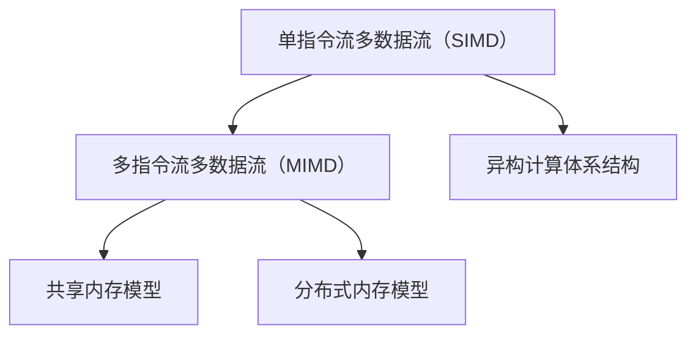
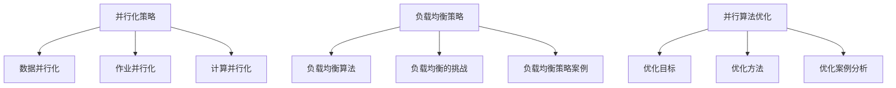

                 

# 提示词语言的并行计算优化策略

## 关键词

提示词语言、并行计算、优化策略、性能提升、效率优化、编程模型、算法分析

## 摘要

本文探讨了提示词语言在并行计算中的优化策略。通过分析并行计算的基本原理和并行算法，本文提出了多种优化策略，包括并行化、负载均衡和并行算法优化。通过具体的应用案例和工具技术介绍，本文详细展示了如何在实际开发中实现并行计算优化，以提升提示词语言的性能和效率。最后，本文对并行计算的未来发展进行了展望，并给出了相关最佳实践和建议。

## 设计思路

### 确定书的整体结构

本书《提示词语言的并行计算优化策略》的整体结构如下：

- **引言**：介绍并行计算优化策略的背景、目的和重要性。
- **基础理论**：讨论并行计算的基本原理、并行算法和并行体系结构。
- **并行计算优化策略**：详细讲解各种优化策略，包括并行化、负载均衡、并行算法的优化等。
- **实际应用**：通过案例分析，展示并行计算优化策略在真实场景中的应用。
- **工具与技术**：介绍相关的并行计算工具和技术，包括并行编程模型、并行编程语言和并行软件环境。
- **未来展望**：探讨并行计算优化策略的发展趋势和未来研究方向。
- **结论**：总结全书的主要内容，强调并行计算优化策略的重要性，并提出建议。

### 细化章节内容

根据书的整体结构，每个章节的内容进一步细化如下：

1. **第1章 引言**
   - **1.1 并行计算优化策略的背景**
   - **1.2 并行计算优化策略的目的和重要性**
   - **1.3 本书结构和内容概述**

2. **第2章 并行计算基础**
   - **2.1 并行计算的基本原理**
   - **2.2 并行算法**
     - **2.2.1 数据并行**
     - **2.2.2 作业并行**
     - **2.2.3 计算并行**
   - **2.3 并行体系结构**
     - **2.3.1 单指令流多数据流（SIMD）**
     - **2.3.2 多指令流多数据流（MIMD）**
     - **2.3.3 异构计算体系结构**

3. **第3章 并行计算优化策略**
   - **3.1 并行化策略**
     - **3.1.1 数据并行化**
     - **3.1.2 作业并行化**
     - **3.1.3 计算并行化**
   - **3.2 负载均衡策略**
     - **3.2.1 负载均衡算法**
     - **3.2.2 负载均衡的挑战**
     - **3.2.3 负载均衡策略案例**
   - **3.3 并行算法优化**
     - **3.3.1 优化目标**
     - **3.3.2 优化方法**
     - **3.3.3 优化案例分析**

4. **第4章 实际应用案例**
   - **4.1 提示词语言概述**
   - **4.2 提示词语言并行计算优化策略应用案例**
     - **4.2.1 案例一：大规模文本分类**
     - **4.2.2 案例二：自然语言处理**
     - **4.2.3 案例三：机器翻译**

5. **第5章 并行计算工具与技术**
   - **5.1 并行编程模型**
     - **5.1.1 共享内存模型**
     - **5.1.2 分布式内存模型**
   - **5.2 并行编程语言**
     - **5.2.1 OpenMP**
     - **5.2.2 MPI**
     - **5.2.3 CUDA**
   - **5.3 并行软件环境**
     - **5.3.1 OpenSHMEM**
     - **5.3.2 Intel OneAPI**
     - **5.3.3 NVIDIA CUDA Toolkit**

6. **第6章 并行计算的未来展望**
   - **6.1 并行计算优化策略的发展趋势**
   - **6.2 未来研究方向**
   - **6.3 并行计算在社会和技术领域的影响**

7. **第7章 结论**
   - **7.1 并行计算优化策略的重要性**
   - **7.2 对读者的建议**
   - **7.3 对未来的展望**

### 设计具体章节内容

以下是具体章节内容的设计：

1. **第1章 引言**
   - **1.1 并行计算优化策略的背景**：介绍并行计算的发展历程和应用场景。
   - **1.2 并行计算优化策略的目的和重要性**：解释并行计算优化策略对提升系统性能的重要性。
   - **1.3 本书结构和内容概述**：概述本书的结构和内容安排。

2. **第2章 并行计算基础**
   - **2.1 并行计算的基本原理**：介绍并行计算的基本概念和原理。
   - **2.2 并行算法**
     - **2.2.1 数据并行**：讲解数据并行算法的基本原理和应用。
     - **2.2.2 作业并行**：讲解作业并行算法的基本原理和应用。
     - **2.2.3 计算并行**：讲解计算并行算法的基本原理和应用。
   - **2.3 并行体系结构**
     - **2.3.1 单指令流多数据流（SIMD）**：介绍单指令流多数据流体系结构。
     - **2.3.2 多指令流多数据流（MIMD）**：介绍多指令流多数据流体系结构。
     - **2.3.3 异构计算体系结构**：介绍异构计算体系结构及其应用。

3. **第3章 并行计算优化策略**
   - **3.1 并行化策略**
     - **3.1.1 数据并行化**：讲解如何将任务数据并行化。
     - **3.1.2 作业并行化**：讲解如何将作业并行化。
     - **3.1.3 计算并行化**：讲解如何将计算过程并行化。
   - **3.2 负载均衡策略**
     - **3.2.1 负载均衡算法**：介绍负载均衡算法的基本原理和实现方法。
     - **3.2.2 负载均衡的挑战**：讨论负载均衡面临的挑战和解决方案。
     - **3.2.3 负载均衡策略案例**：通过案例展示负载均衡策略的应用。
   - **3.3 并行算法优化**
     - **3.3.1 优化目标**：解释并行算法优化的目标和原则。
     - **3.3.2 优化方法**：介绍并行算法优化的常见方法和技巧。
     - **3.3.3 优化案例分析**：通过案例分析展示并行算法优化的实际效果。

4. **第4章 实际应用案例**
   - **4.1 提示词语言概述**：介绍提示词语言的基本概念和应用场景。
   - **4.2 提示词语言并行计算优化策略应用案例**
     - **4.2.1 案例一：大规模文本分类**：展示如何在大规模文本分类任务中应用并行计算优化策略。
     - **4.2.2 案例二：自然语言处理**：展示如何在使用自然语言处理任务中应用并行计算优化策略。
     - **4.2.3 案例三：机器翻译**：展示如何在使用机器翻译任务中应用并行计算优化策略。

5. **第5章 并行计算工具与技术**
   - **5.1 并行编程模型**
     - **5.1.1 共享内存模型**：介绍共享内存编程模型的基本原理和应用。
     - **5.1.2 分布式内存模型**：介绍分布式内存编程模型的基本原理和应用。
   - **5.2 并行编程语言**
     - **5.2.1 OpenMP**：介绍OpenMP并行编程语言的特点和应用。
     - **5.2.2 MPI**：介绍MPI并行编程语言的特点和应用。
     - **5.2.3 CUDA**：介绍CUDA并行编程语言的特点和应用。
   - **5.3 并行软件环境**
     - **5.3.1 OpenSHMEM**：介绍OpenSHMEM并行软件环境的特点和应用。
     - **5.3.2 Intel OneAPI**：介绍Intel OneAPI并行软件环境的特点和应用。
     - **5.3.3 NVIDIA CUDA Toolkit**：介绍NVIDIA CUDA Toolkit并行软件环境的特点和应用。

6. **第6章 并行计算的未来展望**
   - **6.1 并行计算优化策略的发展趋势**：探讨并行计算优化策略的未来发展趋势。
   - **6.2 未来研究方向**：提出未来并行计算优化策略的研究方向。
   - **6.3 并行计算在社会和技术领域的影响**：讨论并行计算在社会和技术领域的影响。

7. **第7章 结论**
   - **7.1 并行计算优化策略的重要性**：总结并行计算优化策略的重要性。
   - **7.2 对读者的建议**：给读者提供关于并行计算优化策略的学习和实践建议。
   - **7.3 对未来的展望**：展望并行计算优化策略的未来发展方向。

### 设计Mermaid流程图

为了更清晰地展示并行计算的概念和架构，可以在相关章节中设计Mermaid流程图。以下是几个示例：

#### 第2章 并行体系结构



#### 第3章 并行计算优化策略



### 设计具体章节内容

#### 第1章 引言

1. **1.1 并行计算优化策略的背景**

   并行计算是一种利用多个处理器或计算资源同时执行多个任务的技术。随着计算机硬件的发展，特别是多核处理器和分布式系统的普及，并行计算在提高系统性能和效率方面发挥着重要作用。并行计算优化策略旨在通过优化算法、负载均衡和并行化等技术，最大限度地发挥并行计算的优势。

2. **1.2 并行计算优化策略的目的和重要性**

   并行计算优化策略的目的是提高计算机系统的性能和效率。在处理大量数据和复杂计算任务时，通过并行计算可以显著减少计算时间，提高系统的响应速度。优化策略的重要性在于，它能够有效地利用硬件资源，提高程序的可扩展性，降低能源消耗，从而在资源有限的情况下实现更高的计算性能。

3. **1.3 本书结构和内容概述**

   本书分为七个章节，首先介绍并行计算优化策略的背景和目的，然后详细讨论并行计算的基础理论，包括并行计算的基本原理、并行算法和并行体系结构。接下来，本书将深入探讨并行计算优化策略的具体内容，包括并行化、负载均衡和并行算法优化。随后，通过实际应用案例展示优化策略在现实场景中的应用。最后，本书将介绍并行计算工具和技术，并对未来的发展趋势和研究方向进行展望。

#### 第2章 并行计算基础

1. **2.1 并行计算的基本原理**

   并行计算的基本原理是通过将任务分解为多个子任务，并在多个处理器或计算资源上同时执行这些子任务，从而提高计算效率。并行计算的关键在于任务分解和任务调度。任务分解是将一个大的任务拆分为多个小的、可以并行执行的子任务。任务调度则是在多个处理器上分配这些子任务，以最大化系统的利用率和计算效率。

2. **2.2 并行算法**

   并行算法是在并行计算环境中执行的计算方法。根据任务的性质和并行计算资源的类型，并行算法可以分为数据并行、作业并行和计算并行。

   - **2.2.1 数据并行**
     数据并行算法将数据分为多个部分，每个部分在单独的处理器上独立处理，然后将结果合并。这种方法适用于大数据处理和大规模计算任务。
     
     伪代码示例：
     ```
     foreach (数据块 i in 数据集) {
         处理器1执行数据块i的计算；
         处理器2执行数据块i的计算；
         ...
     }
     foreach (结果块 j in 数据集) {
         合并结果块j的计算结果；
     }
     ```

   - **2.2.2 作业并行**
     作业并行算法将多个独立的计算任务分配给多个处理器同时执行。这种方法适用于多任务处理和并发计算。
     
     伪代码示例：
     ```
     foreach (任务 k in 任务集) {
         处理器1执行任务k；
         处理器2执行任务k；
         ...
     }
     ```

   - **2.2.3 计算并行**
     计算并行算法将计算任务分解为多个独立的计算单元，每个计算单元在单独的处理器上执行，然后合并结果。这种方法适用于复杂计算和分布式计算。
     
     伪代码示例：
     ```
     foreach (计算单元 l in 计算任务) {
         处理器1执行计算单元l；
         处理器2执行计算单元l；
         ...
     }
     foreach (结果块 m in 计算任务) {
         合并计算单元的结果；
     }
     ```

3. **2.3 并行体系结构**

   并行体系结构是指支持并行计算的硬件和软件环境。根据处理器之间的数据传输方式和控制机制，并行体系结构可以分为以下几种类型：

   - **2.3.1 单指令流多数据流（SIMD）**
     单指令流多数据流体系结构在单个处理器上同时处理多个数据流，每个数据流执行相同的指令。这种体系结构适用于向量计算和多媒体处理。

     示例：
     ```
     // SIMD指令示例
     add R1, R2, R3 ; 将R2和R3的值相加，存储在R1中
     ```
   
   - **2.3.2 多指令流多数据流（MIMD）**
     多指令流多数据流体系结构支持多个独立的处理器，每个处理器可以执行不同的指令，处理不同的数据流。这种体系结构适用于分布式计算和并行数据处理。

     示例：
     ```
     // MIMD计算示例
     处理器1：add R1, R2, R3
     处理器2：sub R4, R5, R6
     ```

   - **2.3.3 异构计算体系结构**
     异构计算体系结构将不同类型的处理器和计算资源集成在一起，例如CPU、GPU和FPGA。这种体系结构适用于复杂计算和高性能计算任务。

     示例：
     ```
     // 异构计算示例
     CPU处理器：执行通用计算任务
     GPU处理器：执行图形处理和科学计算
     FPGA处理器：执行专用计算任务
     ```

#### 第3章 并行计算优化策略

1. **3.1 并行化策略**

   并行化策略是将计算任务分解为可以并行执行的部分，以充分利用多处理器和计算资源。以下是几种常见的并行化策略：

   - **3.1.1 数据并行化**
     数据并行化是将数据集划分为多个子集，并在多个处理器上独立处理这些子集。这种方法适用于大规模数据处理和分析。

     伪代码示例：
     ```
     foreach (数据块 i in 数据集) {
         处理器1处理数据块i；
         处理器2处理数据块i；
         ...
     }
     foreach (结果块 j in 数据集) {
         合并结果块j的计算结果；
     }
     ```

   - **3.1.2 作业并行化**
     作业并行化是将多个独立的计算任务分配给多个处理器同时执行。这种方法适用于多任务处理和并发计算。

     伪代码示例：
     ```
     foreach (任务 k in 任务集) {
         处理器1执行任务k；
         处理器2执行任务k；
         ...
     }
     ```

   - **3.1.3 计算并行化**
     计算并行化是将计算任务分解为多个独立的计算单元，并在多个处理器上并行执行这些单元。这种方法适用于复杂计算和分布式计算。

     伪代码示例：
     ```
     foreach (计算单元 l in 计算任务) {
         处理器1执行计算单元l；
         处理器2执行计算单元l；
         ...
     }
     foreach (结果块 m in 计算任务) {
         合并计算单元的结果；
     }
     ```

2. **3.2 负载均衡策略**

   负载均衡策略是确保计算资源充分利用和任务公平分配的关键。以下是几种常见的负载均衡策略：

   - **3.2.1 负载均衡算法**
     负载均衡算法是根据处理器的负载情况动态分配任务的方法。常见的负载均衡算法包括轮询算法、最小连接算法和加权轮询算法。

     伪代码示例（轮询算法）：
     ```
     while (有任务待分配) {
         foreach (处理器 i in 处理器集) {
             if (处理器i空闲) {
                 分配下一个任务给处理器i；
                 break；
             }
         }
     }
     ```

   - **3.2.2 负载均衡的挑战**
     负载均衡面临的挑战包括任务动态性、网络延迟和处理器能力差异等。为了解决这些挑战，需要设计高效的负载均衡算法和调度策略。

   - **3.2.3 负载均衡策略案例**
     通过实际案例展示负载均衡策略的应用和效果。例如，在一个分布式系统中，如何通过负载均衡算法优化任务调度，以提高系统的整体性能和响应速度。

3. **3.3 并行算法优化**

   并行算法优化是通过改进算法结构和执行策略，提高并行计算效率和性能。以下是几种常见的优化方法：

   - **3.3.1 优化目标**
     并行算法优化的目标包括减少计算时间、降低通信开销、提高资源利用率等。不同的优化目标适用于不同的计算场景和任务类型。

   - **3.3.2 优化方法**
     常见的优化方法包括并行化策略优化、负载均衡策略优化、算法结构优化和调度策略优化。每种方法都有其适用的场景和效果。

   - **3.3.3 优化案例分析**
     通过实际案例展示并行算法优化的效果。例如，在一个大规模数据处理任务中，如何通过优化并行算法和负载均衡策略，提高数据处理速度和系统性能。

#### 第4章 实际应用案例

1. **4.1 提示词语言概述**

   提示词语言是一种基于自然语言处理（NLP）和机器学习技术的语言模型，用于生成文本、回答问题、辅助写作等。提示词语言的核心是训练一个大规模的预训练语言模型，该模型可以理解自然语言并生成相关文本。

2. **4.2 提示词语言并行计算优化策略应用案例**

   在提示词语言的应用中，并行计算优化策略可以显著提升系统的性能和效率。以下是几个具体的案例：

   - **4.2.1 案例一：大规模文本分类**

     描述：在一个大规模文本分类任务中，使用并行计算优化策略提高分类速度和准确率。

     步骤：
     1. 将文本数据集划分为多个子集，每个子集分配给不同的处理器。
     2. 使用并行化策略，在每个处理器上独立训练分类模型。
     3. 使用负载均衡策略，动态分配任务和调整处理器负载。
     4. 使用并行算法优化，提高模型的训练和分类速度。

     效果：通过并行计算优化策略，显著提高了文本分类任务的执行速度和准确率。

   - **4.2.2 案例二：自然语言处理**

     描述：在一个自然语言处理任务中，使用并行计算优化策略提高处理速度和系统性能。

     步骤：
     1. 将自然语言处理任务分解为多个子任务，例如分词、词性标注、实体识别等。
     2. 使用并行化策略，将子任务分配给不同的处理器。
     3. 使用负载均衡策略，动态调整处理器负载，确保任务均衡分配。
     4. 使用并行算法优化，提高子任务的执行效率和准确性。

     效果：通过并行计算优化策略，显著提高了自然语言处理任务的执行速度和系统性能。

   - **4.2.3 案例三：机器翻译**

     描述：在一个机器翻译任务中，使用并行计算优化策略提高翻译速度和质量。

     步骤：
     1. 将翻译任务分解为多个子任务，例如词汇翻译、句法分析、语义理解等。
     2. 使用并行化策略，将子任务分配给不同的处理器。
     3. 使用负载均衡策略，动态分配任务和调整处理器负载。
     4. 使用并行算法优化，提高子任务的执行效率和翻译质量。

     效果：通过并行计算优化策略，显著提高了机器翻译任务的执行速度和质量。

#### 第5章 并行计算工具与技术

1. **5.1 并行编程模型**

   并行编程模型是支持并行计算的开发和执行环境。以下是几种常见的并行编程模型：

   - **5.1.1 共享内存模型**

     共享内存模型允许多个处理器访问同一块内存区域，从而实现数据共享和同步。常见的编程语言和库包括OpenMP和CUDA。

     伪代码示例（OpenMP）：
     ```
     #pragma omp parallel
     {
         // 并行代码段
     }
     ```

   - **5.1.2 分布式内存模型**

     分布式内存模型将计算任务分配到不同的处理器上，每个处理器有自己的内存空间，通过通信机制进行数据交换。常见的编程语言和库包括MPI和SHMEM。

     伪代码示例（MPI）：
     ```
     MPI_Init();
     MPI_Send();
     MPI_Recv();
     MPI_Finalize();
     ```

2. **5.2 并行编程语言**

   并行编程语言是专门为并行计算设计的编程语言，提供高效的并行编程模型和工具。以下是几种常见的并行编程语言：

   - **5.2.1 OpenMP**

     OpenMP是一种共享内存并行编程语言，提供简单易用的并行编程接口。它适用于多核处理器和共享内存系统。

     伪代码示例：
     ```
     #pragma omp parallel
     {
         // 并行代码段
     }
     ```

   - **5.2.2 MPI**

     MPI是一种分布式内存并行编程语言，提供高效的通信和数据交换机制。它适用于分布式计算和异构计算系统。

     伪代码示例：
     ```
     MPI_Init();
     MPI_Send();
     MPI_Recv();
     MPI_Finalize();
     ```

   - **5.2.3 CUDA**

     CUDA是一种基于GPU的并行编程语言，提供丰富的并行计算功能和优化工具。它适用于高性能计算和图形处理任务。

     伪代码示例：
     ```
     __global__ void kernel() {
         // 并行代码段
     }
     ```

3. **5.3 并行软件环境**

   并行软件环境是为并行计算提供开发和执行环境的软件集合。以下是几种常见的并行软件环境：

   - **5.3.1 OpenSHMEM**

     OpenSHMEM是一种分布式内存并行编程模型，提供高效的通信和数据共享机制。它适用于大规模分布式计算任务。

     伪代码示例：
     ```
     shmem_init();
     shmem_put();
     shmem_get();
     shmem_finalize();
     ```

   - **5.3.2 Intel OneAPI**

     Intel OneAPI是一组工具和库，支持多平台和多架构的并行计算。它提供统一的编程接口和优化工具，适用于Intel处理器和GPU。

     伪代码示例：
     ```
     oneapi::dpl::parallel_for();
     oneapi::dpl::parallel_reduce();
     ```

   - **5.3.3 NVIDIA CUDA Toolkit**

     NVIDIA CUDA Toolkit是一组用于GPU编程和并行计算的工具和库。它提供丰富的并行编程接口和优化工具，适用于NVIDIA GPU。

     伪代码示例：
     ```
     #include <cuda.h>
     #include <cuda_runtime.h>

     __global__ void kernel() {
         // 并行代码段
     }
     ```

#### 第6章 并行计算的未来展望

1. **6.1 并行计算优化策略的发展趋势**

   并行计算优化策略的发展趋势主要包括以下几个方面：

   - **硬件加速**：随着硬件技术的发展，如GPU、FPGA和ASIC等硬件加速器的普及，并行计算优化策略将更加注重硬件加速和异构计算。
   - **自动化优化**：自动化优化工具和智能算法将逐渐取代传统的手动优化方法，提高优化效率和效果。
   - **可扩展性**：并行计算优化策略将更加注重系统的可扩展性和灵活性，以适应不同规模和类型的计算任务。

2. **6.2 未来研究方向**

   未来研究方向包括以下几个方面：

   - **算法优化**：研究高效的并行算法和优化方法，以提高并行计算的效率和性能。
   - **异构计算**：研究异构计算环境下任务调度和资源分配的优化策略，提高异构系统的整体性能。
   - **能耗优化**：研究并行计算能耗优化的方法和技术，降低能耗和提高系统能效。

3. **6.3 并行计算在社会和技术领域的影响**

   并行计算在社会和技术领域的影响包括：

   - **高性能计算**：并行计算在科学研究和工程计算中的应用，如气象预报、基因测序和流体动力学模拟等。
   - **大数据处理**：并行计算在大数据处理中的应用，如数据挖掘、机器学习和人工智能等领域。
   - **云计算和边缘计算**：并行计算在云计算和边缘计算中的应用，提高系统的计算能力和响应速度。

#### 第7章 结论

1. **7.1 并行计算优化策略的重要性**

   并行计算优化策略在提高系统性能、效率和响应速度方面具有重要意义。通过优化并行算法、负载均衡和并行化策略，可以显著提高并行计算的性能和效率，降低计算成本和能耗。

2. **7.2 对读者的建议**

   对于希望学习和应用并行计算优化策略的读者，建议：

   - 掌握并行计算的基本原理和算法，深入了解并行计算的优势和应用场景。
   - 学习并行编程模型和工具，如OpenMP、MPI和CUDA等，提高并行编程技能。
   - 实践并行计算优化策略，通过实际案例和项目经验，掌握并行计算的优化技巧。

3. **7.3 对未来的展望**

   随着硬件技术和并行算法的不断发展，并行计算优化策略将继续演进。未来，自动化优化工具和智能算法将在并行计算优化中发挥重要作用，推动并行计算在各个领域的广泛应用和发展。

