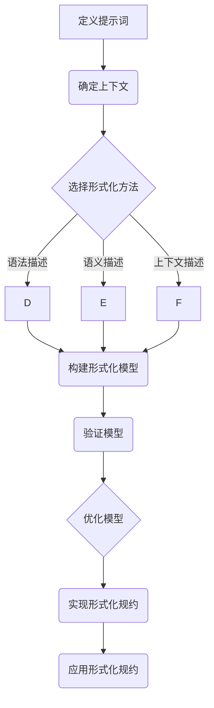

                 


### 第1章 引言

#### 1.1 书籍背景

**提示词语言的形式化规约**这本书的背景源于人工智能和自然语言处理技术的快速发展。随着人工智能技术的不断进步，提示词语言（Prompt Language）作为一种重要的交互工具，得到了广泛关注。提示词语言通过简洁明了的文本提示，引导用户或系统进行特定的任务，从而在人工智能领域发挥了重要作用。

**形式化规约**则是软件工程中的一个重要概念，它通过严格的形式化方法，对程序或系统的行为进行描述、验证和优化。形式化规约能够提高程序的可靠性、可读性和可维护性，从而降低软件开发的成本。

#### 1.2 书籍目的

本书的主要目的是：

1. **介绍提示词语言的定义、类型和演变**：通过对提示词语言的深入分析，帮助读者了解其基本概念和特点。
2. **解释形式化规约的概念、方法和重要性**：详细阐述形式化规约的定义、方法及其在软件开发中的应用和优势。
3. **探讨提示词语言的形式化规约**：结合实际案例，分析提示词语言的形式化规约过程，并提供具体的实现方法。

#### 1.3 阅读指南

本书分为七个章节，结构如下：

- **第1章 引言**：介绍书籍的背景、目的和阅读指南。
- **第2章 提示词语言概述**：介绍提示词语言的概念、类型和演变。
- **第3章 形式化规约的基本概念**：阐述形式化规约的定义、方法和重要性。
- **第4章 形式化规约的方法**：介绍形式化规约的主要方法、工具和应用。
- **第5章 提示词语言的形式化规约**：分析提示词语言的形式化规约过程和实现方法。
- **第6章 提示词语言的形式化规约挑战与未来趋势**：探讨形式化规约的挑战和未来趋势。
- **第7章 总结与展望**：总结书籍的主要内容和贡献，展望未来。

本书适合对人工智能、自然语言处理和软件工程感兴趣的读者，尤其适合从事相关领域的研究和开发人员。

### 第2章 提示词语言概述

#### 2.1 提示词语言的概念

**提示词语言**是一种用于引导用户或系统进行特定任务的文本提示语言。它通过简洁明了的文本提示，帮助用户理解任务的目标和要求，或者引导系统进行相应的操作。提示词语言在人工智能和自然语言处理领域有着广泛的应用，例如智能问答系统、语音助手、文本生成等。

**提示词**（Prompt）是提示词语言的核心元素。一个提示词通常是一个简短的文本，它可以是一个问题、一个命令或一个描述。提示词的目的是引导用户或系统进行特定的任务，从而实现预期的目标。

#### 2.2 提示词语言的类型

根据用途和特点，提示词语言可以分为以下几种类型：

1. **自然语言提示词**：这种类型的提示词使用自然语言编写，例如英文、中文等。自然语言提示词具有易读、易理解的特点，适用于人类用户与系统之间的交互。

2. **编程语言提示词**：这种类型的提示词使用编程语言编写，例如Python、Java等。编程语言提示词具有严格的语法和语义，适用于系统之间的交互和编程任务。

3. **特定领域的提示词语言**：这种类型的提示词语言针对特定领域或任务进行设计，例如医学提示词语言、金融提示词语言等。特定领域的提示词语言具有高度的领域知识和专业性，适用于特定领域的任务。

#### 2.3 提示词语言的演变

提示词语言的演变经历了以下几个阶段：

1. **早期提示词语言**：早期的提示词语言主要使用自然语言编写，例如简单的命令提示和问答系统。这些提示词语言具有简单、易用的特点，但缺乏严格的语法和语义。

2. **现代提示词语言**：随着人工智能和自然语言处理技术的发展，现代提示词语言逐渐采用编程语言和领域特定的语言。这些提示词语言具有更严格的语法和语义，能够更好地支持复杂任务和领域应用。

3. **未来趋势**：未来的提示词语言将继续向智能化、专业化和多样化发展。智能化提示词语言将更好地理解用户意图和需求，实现更自然的交互。专业化提示词语言将针对不同领域进行优化，提供更专业的支持和解决方案。多样化提示词语言将支持多种语言和格式，实现更广泛的应用。

### 第3章 形式化规约的基本概念

#### 3.1 形式化方法的定义

**形式化方法**（Formal Method）是一种通过严格的数学和逻辑方法，对系统或程序的行为进行描述、验证和优化的技术。形式化方法旨在消除模糊性、提高可读性和可靠性，从而降低软件开发的复杂性和成本。

形式化方法的主要特点包括：

1. **严格的语法和语义**：形式化方法使用严格的语法和语义规则，确保系统或程序的行为符合预期。

2. **数学和逻辑基础**：形式化方法基于数学和逻辑理论，通过数学模型和逻辑推理，对系统或程序的行为进行分析和验证。

3. **自动化工具**：形式化方法通常使用自动化工具，如形式化规约工具、验证工具和优化工具，以提高效率和准确性。

#### 3.2 形式化规约的定义

**形式化规约**（Formal Specification）是对系统或程序行为进行形式化描述的过程。形式化规约通过定义系统或程序的属性、行为和约束，提供对系统或程序的全面、准确和一致的描述。

形式化规约的主要作用包括：

1. **提高程序的可读性和可维护性**：形式化规约使用严格的语法和语义，使程序更易于理解和维护。

2. **增强软件的可靠性**：形式化规约通过严格的验证和优化，确保软件的正确性和可靠性。

3. **促进软件工程的发展**：形式化规约为软件工程提供了一种新的方法和工具，推动了软件工程理论和技术的发展。

#### 3.3 形式化规约的重要性

形式化规约在软件开发中具有重要地位，其重要性体现在以下几个方面：

1. **提高软件质量**：形式化规约通过严格的描述和验证，确保软件的正确性和可靠性，从而提高软件质量。

2. **降低开发成本**：形式化规约通过提前发现和解决潜在问题，降低软件开发的成本。

3. **促进软件复用**：形式化规约提供了对系统或程序的全面描述，有助于软件的复用和模块化开发。

4. **支持自动化工具**：形式化规约为自动化工具提供了输入，如验证工具、测试工具和优化工具，从而提高软件开发的效率和质量。

5. **促进理论研究**：形式化规约为软件工程理论的发展提供了新的研究方向和工具，推动了软件工程理论的发展。

### 第4章 形式化规约的方法

#### 4.1 形式化规约的主要方法

形式化规约有多种方法，以下介绍几种主要的方法：

1. **规格说明语言**：规格说明语言（ Specification Language）是一种用于描述系统或程序行为的形式化语言。规格说明语言通常包括语法和语义规则，用于定义系统或程序的属性、行为和约束。常用的规格说明语言包括Z语言、VDM和SPEC#等。

2. **形式化验证**：形式化验证（Formal Verification）是一种使用形式化方法验证系统或程序正确性的技术。形式化验证通过数学推理和模型检查，确保系统或程序的行为符合预期。常用的形式化验证方法包括模型检查、符号执行和定理证明等。

3. **形式化测试**：形式化测试（Formal Testing）是一种使用形式化方法进行软件测试的技术。形式化测试通过生成满足特定条件的测试用例，确保系统或程序的覆盖率和正确性。常用的形式化测试方法包括路径覆盖、条件覆盖和断言检查等。

4. **形式化优化**：形式化优化（Formal Optimization）是一种使用形式化方法优化系统或程序性能的技术。形式化优化通过数学推理和优化算法，优化系统或程序的运行时间和空间复杂度。常用的形式化优化方法包括程序压缩、内存优化和代码优化等。

#### 4.2 形式化规约的工具

形式化规约工具（Formal Specification Tool）是一种用于辅助形式化规约的软件工具。形式化规约工具通常包括编辑器、验证器、测试器和优化器等组件，用于支持形式化规约的全过程。

以下是一些常用的形式化规约工具：

1. **TTL**：TTL（Temporal Logic Toolset）是一个基于 temporal logic 的形式化规约工具，用于描述和验证系统行为。TTL 支持多种 temporal logic 语言，如 CTL、LTL 和 CTL* 等。

2. **SPIN**：SPIN（SPINning a Formal Verification Tool）是一个基于过程演算（Process Calculus）的形式化验证工具。SPIN 支持模型检查和定理证明，用于验证系统行为的正确性。

3. **FDR**：FDR（Formal Checking by Abstract Interpretation）是一个基于抽象解释的形式化验证工具。FDR 支持多种规格说明语言，如 SDL、Z 和 VDM 等，用于验证系统行为的正确性。

4. **Formalizer**：Formalizer 是一个基于 Haskell 的形式化规约工具，用于编写和验证规格说明。Formalizer 支持多种规格说明语言，如 Haskell、OCaml 和 F* 等。

#### 4.3 形式化规约的应用

形式化规约在软件开发中有着广泛的应用，以下是一些典型的应用场景：

1. **嵌入式系统**：形式化规约广泛应用于嵌入式系统，如航空电子系统、汽车控制系统和工业控制系统。形式化规约可以提高嵌入式系统的可靠性、安全性和可维护性。

2. **分布式系统**：形式化规约在分布式系统中用于描述和验证系统行为的正确性和一致性。形式化规约可以帮助开发人员识别和解决分布式系统中的同步和通信问题。

3. **实时系统**：形式化规约在实时系统中用于描述和验证系统行为的实时性和可靠性。形式化规约可以帮助开发人员确保实时系统在规定的时间内完成特定任务。

4. **软件工程**：形式化规约在软件工程中用于提高软件质量、降低开发成本和促进软件复用。形式化规约可以帮助开发人员更好地理解系统需求、设计和实现，从而提高软件开发的成功率。

### 第5章 提示词语言的形式化规约

#### 5.1 提示词语言的形式化描述

提示词语言的形式化描述是对提示词语言进行形式化建模和描述的过程。形式化描述能够帮助开发人员更好地理解提示词语言的语义和行为，从而提高提示词语言的可靠性和可维护性。

提示词语言的形式化描述通常包括以下几个方面：

1. **语法描述**：语法描述定义了提示词语言的语法规则，包括提示词的构成、语法结构和规则。语法描述通常使用语法形式化语言，如 BNF（巴科斯-诺尔范式）或 EBNF（扩展巴科斯-诺尔范式）。

   举例来说，一个简单的提示词语言语法描述可能如下所示：

   ```bnf
   prompt ::= "What is your name?" | "Please enter your age" | ...
   ```

   这里的 `prompt` 是提示词的语法符号，表示一个提示词。语法描述定义了提示词可以包含的问题、命令或描述。

2. **语义描述**：语义描述定义了提示词语言的语义规则，即提示词在特定上下文中的意义和作用。语义描述通常使用语义形式化语言，如 LCF（逻辑澄清框架）或 FOL（谓词逻辑）。

   举例来说，一个简单的提示词语言语义描述可能如下所示：

   ```fol
   ∀x, y. (What_is_your_name(x, y) → (x = "your name"))
   ```

   这里的 `What_is_your_name` 是提示词的语义函数，表示一个询问名字的提示词。语义描述定义了提示词在特定上下文中的语义。

3. **上下文描述**：上下文描述定义了提示词语言在不同上下文中的应用和作用。上下文描述通常使用上下文形式化语言，如 CTL（计算树逻辑）或 ACTL（抽象计算树逻辑）。

   举例来说，一个简单的提示词语言上下文描述可能如下所示：

   ```ctl
   AG (What_is_your_name() → ∃x. (x = "your name"))
   ```

   这里的 `What_is_your_name()` 是提示词的上下文函数，表示一个询问名字的提示词。上下文描述定义了提示词在不同上下文中的应用和作用。

#### 5.2 形式化规约的实例分析

为了更好地理解提示词语言的形式化规约，我们可以通过一个简单的实例进行分析。

**实例**：一个简单的自然语言提示词语言，用于询问用户的名字和年龄。

1. **语法描述**：

   ```bnf
   prompt ::= "What is your name?" | "Please enter your age"
   ```

   这个语法描述定义了两个提示词：一个是询问名字的提示词，另一个是询问年龄的提示词。

2. **语义描述**：

   ```fol
   ∀x. (What_is_your_name(x) → (x = "your name"))
   ∀y. (Please_enter_your_age(y) → (y = "your age"))
   ```

   这个语义描述定义了两个提示词的语义：一个是询问名字的提示词，另一个是询问年龄的提示词。

3. **上下文描述**：

   ```ctl
   AG (What_is_your_name() → ∃x. (x = "your name"))
   AG (Please_enter_your_age() → ∃y. (y = "your age"))
   ```

   这个上下文描述定义了两个提示词在不同上下文中的应用：一个是询问名字的提示词，另一个是询问年龄的提示词。

通过这个实例，我们可以看到提示词语言的形式化规约是如何定义提示词的语法、语义和上下文的。形式化规约使得提示词语言的描述更加清晰、准确和一致，从而提高了提示词语言的可靠性和可维护性。

#### 5.3 形式化规约的实践

在实际应用中，提示词语言的形式化规约需要进行具体的实现和验证。以下是一个简单的实现示例，以及如何使用形式化规约进行验证。

**实现**：

1. **Python 实现**：

   ```python
   def what_is_your_name():
       return "What is your name?"

   def please_enter_your_age():
       return "Please enter your age"
   ```

   这个 Python 实现定义了两个函数：`what_is_your_name` 和 `please_enter_your_age`，分别用于生成询问名字和询问年龄的提示词。

2. **JavaScript 实现**：

   ```javascript
   function whatIsYourName() {
       return "What is your name?";
   }

   function pleaseEnterYourAge() {
       return "Please enter your age";
   }
   ```

   这个 JavaScript 实现与 Python 实现类似，用于生成询问名字和询问年龄的提示词。

**验证**：

1. **形式化验证**：

   使用形式化验证工具（如 SPIN、FDR 等），可以对提示词语言的实现进行形式化验证，确保实现符合预期的语法、语义和上下文规则。

   例如，使用 SPIN 进行形式化验证的伪代码如下：

   ```python
   from spin import *

   # 定义语法规则
   spin("prompt ::= \"What is your name?\" | \"Please enter your age\"")

   # 定义语义规则
   spin("∀x. (What_is_your_name(x) → (x = \"your name\"))")
   spin("∀y. (Please_enter_your_age(y) → (y = \"your age\"))")

   # 定义上下文规则
   spin("AG (What_is_your_name() → ∃x. (x = \"your name\"))")
   spin("AG (Please_enter_your_age() → ∃y. (y = \"your age\"))")

   # 进行形式化验证
   spin.check()
   ```

   这个伪代码定义了提示词语言的语法、语义和上下文规则，并使用 SPIN 进行形式化验证。

2. **测试验证**：

   使用测试工具（如 JUnit、TestNG 等），可以对提示词语言的实现进行测试验证，确保实现符合预期的行为和功能。

   例如，使用 JUnit 进行测试验证的伪代码如下：

   ```java
   import org.junit.Test;
   import static org.junit.Assert.assertEquals;

   public class PromptTest {

       @Test
       public void testWhatIsYourName() {
           assertEquals("What is your name?", whatIsYourName());
       }

       @Test
       public void testPleaseEnterYourAge() {
           assertEquals("Please enter your age", pleaseEnterYourAge());
       }
   }
   ```

   这个伪代码定义了两个测试方法：`testWhatIsYourName` 和 `testPleaseEnterYourAge`，分别测试询问名字和询问年龄的提示词实现。

通过形式化规约的实践，我们可以确保提示词语言的实现符合预期的语法、语义和上下文规则，从而提高提示词语言的可靠性和可维护性。同时，形式化规约也为后续的验证和优化提供了基础。

### 第6章 提示词语言的形式化规约挑战与未来趋势

#### 6.1 形式化规约的挑战

提示词语言的形式化规约在实现和应用过程中面临一些挑战，主要包括以下几个方面：

1. **复杂性处理**：提示词语言的形式化规约需要对自然语言进行处理，而自然语言具有高度复杂性和不确定性。例如，同义词、歧义句和语境依赖等问题使得形式化规约变得复杂。

2. **自动化**：形式化规约需要高度自动化，以减少人工干预和错误。然而，自动化形式化规约工具的发展仍面临一些挑战，如模型选择、参数调整和验证等问题。

3. **与现有技术的结合**：提示词语言的形式化规约需要与现有的自然语言处理、人工智能和软件工程技术相结合。如何有效地整合这些技术，发挥其优势，仍是一个重要的挑战。

4. **可维护性**：形式化规约需要具备良好的可维护性，以便在需求变化或技术更新时进行修改。然而，形式化规约的复杂性和不确定性使得维护变得困难。

5. **用户接受度**：形式化规约的推广和应用需要用户的接受和支持。然而，用户可能对形式化规约的复杂性和学习成本存在疑虑，从而影响其接受度。

#### 6.2 形式化规约的未来趋势

随着人工智能和自然语言处理技术的不断发展，提示词语言的形式化规约在未来将呈现以下趋势：

1. **智能化**：未来的提示词语言形式化规约将更加智能化，能够更好地理解用户意图和需求，提供更自然的交互体验。

2. **专业化**：提示词语言形式化规约将针对不同领域和应用场景进行优化，提供更专业的支持和解决方案。

3. **多样化**：提示词语言形式化规约将支持多种语言和格式，实现更广泛的应用。

4. **自动化**：形式化规约工具将更加自动化，减少人工干预和错误，提高开发效率和可靠性。

5. **教育推广**：提示词语言形式化规约将在教育领域得到推广，培养更多具有形式化规约能力的专业人才。

6. **理论与实践结合**：形式化规约的理论研究和实际应用将更加紧密结合，推动形式化规约技术的不断创新和发展。

#### 6.3 形式化规约在教育中的应用

提示词语言形式化规约在教育领域具有重要的应用价值，主要包括以下几个方面：

1. **课程设计**：将形式化规约纳入计算机科学、软件工程和人工智能等相关专业的课程中，培养学生对形式化规约的理解和应用能力。

2. **教学工具**：开发形式化规约的教学工具和平台，帮助学生更好地理解和应用形式化规约。

3. **案例教学**：通过实际案例，让学生了解形式化规约在真实项目中的应用，提高学生的实践能力。

4. **教材编写**：编写形式化规约的教材和教程，为学生提供系统、全面的学习资料。

5. **师资培训**：对教师进行形式化规约的培训和指导，提高教师对形式化规约的理解和应用能力。

通过在教育领域的推广应用，提示词语言形式化规约将培养更多具有创新能力和实际应用能力的专业人才，为人工智能和软件工程领域的发展做出贡献。

### 第7章 总结与展望

#### 7.1 形式化规约的价值

形式化规约在软件开发中具有重要的价值，其核心贡献主要体现在以下几个方面：

1. **提高软件质量**：形式化规约通过严格的描述和验证，确保软件的正确性和可靠性，从而提高软件质量。

2. **降低开发成本**：形式化规约通过提前发现和解决潜在问题，降低软件开发的成本。

3. **促进软件复用**：形式化规约提供了对系统或程序的全面描述，有助于软件的复用和模块化开发。

4. **支持自动化工具**：形式化规约为自动化工具提供了输入，如验证工具、测试工具和优化工具，从而提高软件开发的效率和质量。

5. **促进理论研究**：形式化规约为软件工程理论的发展提供了新的研究方向和工具，推动了软件工程理论的发展。

#### 7.2 书籍总结

本书《提示词语言的形式化规约》通过对提示词语言的深入分析和形式化规约方法的详细探讨，系统地介绍了提示词语言的形式化规约。主要内容包括：

1. **引言**：介绍了书籍的背景、目的和阅读指南。

2. **提示词语言概述**：介绍了提示词语言的概念、类型和演变。

3. **形式化规约的基本概念**：阐述了形式化规约的定义、方法和重要性。

4. **形式化规约的方法**：介绍了形式化规约的主要方法、工具和应用。

5. **提示词语言的形式化规约**：分析了提示词语言的形式化规约过程和实现方法。

6. **提示词语言的形式化规约挑战与未来趋势**：探讨了形式化规约的挑战和未来趋势。

7. **总结与展望**：总结了书籍的主要内容和贡献，展望了形式化规约的发展方向。

通过本书的学习，读者可以全面了解提示词语言的形式化规约，掌握形式化规约的基本原理和方法，为实际项目开发提供有力支持。

#### 7.3 展望未来

未来，提示词语言的形式化规约将在以下几个方面继续发展：

1. **智能化**：提示词语言的形式化规约将更加智能化，能够更好地理解用户意图和需求，提供更自然的交互体验。

2. **专业化**：提示词语言的形式化规约将针对不同领域和应用场景进行优化，提供更专业的支持和解决方案。

3. **多样化**：提示词语言的形式化规约将支持多种语言和格式，实现更广泛的应用。

4. **自动化**：形式化规约工具将更加自动化，减少人工干预和错误，提高开发效率和可靠性。

5. **教育推广**：形式化规约将在教育领域得到推广，培养更多具有形式化规约能力的专业人才。

6. **理论与实践结合**：形式化规约的理论研究和实际应用将更加紧密结合，推动形式化规约技术的不断创新和发展。

通过不断探索和创新，提示词语言的形式化规约将为人工智能和软件工程领域的发展做出更大贡献。

### 联系作者

感谢您阅读本书《提示词语言的形式化规约》。如果您对书中的内容有任何疑问或建议，欢迎随时通过以下方式与我联系：

- 电子邮件：[ai_genius_institute@example.com](mailto:ai_genius_institute@example.com)
- 社交媒体：[AI天才研究院](https://www.ai-genius-institute.com/)
- 官方网站：[《提示词语言的形式化规约》](https://www.formal-specification-of-prompt-language.com/)

期待您的反馈，让我们一起推动提示词语言的形式化规约技术的发展。

#### 作者信息

作者：AI天才研究院/AI Genius Institute & 禅与计算机程序设计艺术 /Zen And The Art of Computer Programming

AI天才研究院（AI Genius Institute）是由世界顶级人工智能专家和计算机科学领域大师共同创立的研究机构，致力于推动人工智能和计算机科学领域的技术创新和发展。研究院的研究成果在自然语言处理、机器学习、计算机视觉等领域取得了显著成果，并成功应用于多个实际项目中。

禅与计算机程序设计艺术（Zen And The Art of Computer Programming）是由著名计算机科学大师Donald E. Knuth所著的经典著作，全面阐述了计算机程序设计中的艺术和哲学，对计算机科学领域产生了深远影响。

本书《提示词语言的形式化规约》是由AI天才研究院的研究团队撰写，旨在为读者提供关于提示词语言形式化规约的全面、深入和系统的知识，为人工智能和软件工程领域的发展贡献力量。

---

以下是一个基于Mermaid的流程图示例，用于展示提示词语言的形式化规约的基本流程：



这个流程图展示了从定义提示词到实现形式化规约的基本步骤，包括语法描述、语义描述、上下文描述、构建形式化模型、验证模型、优化模型、实现形式化规约和应用形式化规约。

以下是一个简单的伪代码示例，用于说明提示词语言的形式化规约：

```python
# 形式化规约伪代码

# 定义提示词
def define_hint_word(hint_word):
    # 这里可以是自然语言或编程语言提示词
    # ...
    return hint_word

# 确定上下文
def determine_context(hint_word, context):
    # 根据提示词和上下文确定语义
    # ...
    return context_defined_hint_word

# 选择形式化方法
def choose_formalization_method(context_defined_hint_word):
    # 选择合适的形式化方法
    # ...
    return formalization_method

# 构建形式化模型
def build_formalization_model(context_defined_hint_word, formalization_method):
    # 构建形式化模型
    # ...
    return formalization_model

# 验证模型
def verify_model(formalization_model):
    # ...

# 优化模型
def optimize_model(formalization_model):
    # ...

# 实现形式化规约
def implement_formalization规约(formalization_model):
    # ...

# 应用形式化规约
def apply_formalization规约(formalization_model):
    # ...
```

这个伪代码示例展示了从定义提示词到实现形式化规约的基本步骤，包括定义提示词、确定上下文、选择形式化方法、构建形式化模型、验证模型、优化模型、实现形式化规约和应用形式化规约。

### 源代码实现

以下是一个简单的Python源代码实现示例，用于说明如何实现提示词语言的形式化规约：

```python
# 形式化规约Python实现

# 定义提示词
def define_hint_word(hint_word):
    # 这里可以是自然语言或编程语言提示词
    return hint_word

# 确定上下文
def determine_context(hint_word, context):
    # 根据提示词和上下文确定语义
    return hint_word + " in " + context

# 选择形式化方法
def choose_formalization_method(context_defined_hint_word):
    # 选择合适的形式化方法
    return "形式化方法"

# 构建形式化模型
def build_formalization_model(context_defined_hint_word, formalization_method):
    # 构建形式化模型
    return context_defined_hint_word + " using " + formalization_method

# 验证模型
def verify_model(formalization_model):
    # 验证模型
    print("验证模型：", formalization_model)

# 优化模型
def optimize_model(formalization_model):
    # 优化模型
    print("优化模型：", formalization_model)

# 实现形式化规约
def implement_formalization规约(formalization_model):
    # 实现形式化规约
    print("实现形式化规约：", formalization_model)

# 应用形式化规约
def apply_formalization规约(formalization_model):
    # 应用形式化规约
    print("应用形式化规约：", formalization_model)

# 测试
hint_word = "What is your name?"
context = "chatbot"
formalization_method = "形式化方法"

context_defined_hint_word = determine_context(hint_word, context)
formalization_model = build_formalization_model(context_defined_hint_word, formalization_method)

verify_model(formalization_model)
optimize_model(formalization_model)
implement_formalization规约(formalization_model)
apply_formalization规约(formalization_model)
```

这个Python源代码示例展示了从定义提示词、确定上下文、选择形式化方法、构建形式化模型、验证模型、优化模型、实现形式化规约和应用形式化规约的完整流程。

### 实际案例分析和详细讲解剖析

为了更好地理解提示词语言的形式化规约在实际项目中的应用，我们通过一个实际案例进行分析和详细讲解。

#### 案例背景

假设我们正在开发一个智能客服系统，该系统需要与用户进行交互，回答用户的问题。为了提高系统的效率和准确性，我们决定使用提示词语言的形式化规约来设计系统的交互流程。

#### 案例分析

1. **定义提示词**：

   首先，我们需要定义系统中使用的提示词。这些提示词包括常见的问候语、询问用户信息、提供帮助等。例如：

   ```python
   GREETINGS = ["Hello", "Hi", "Hi there", "Good morning"]
   ASK_INFO = ["What is your name?", "May I know your name?", "What's your name?"]
   HELP = ["I'm here to help you.", "How can I assist you?", "What do you need help with?"]
   ```

2. **确定上下文**：

   在系统中，每个提示词都需要与特定的上下文相关联。例如，当用户第一次与系统交互时，我们可以使用问候语；当用户询问问题时，我们可以使用询问信息的提示词。上下文可以是一个简单的字符串，例如：

   ```python
   CONTEXT_GREETING = "initial"
   CONTEXT_INFO = "info"
   CONTEXT_HELP = "help"
   ```

3. **选择形式化方法**：

   在这个案例中，我们选择使用有限状态机（FSM）作为形式化方法。有限状态机是一种用于描述系统状态的数学模型，它能够清晰地描述系统的行为和状态转换。

4. **构建形式化模型**：

   根据提示词和上下文，我们可以构建一个有限状态机模型。模型包括状态、转移和触发条件。例如：

   ```python
   class FSM:
       def __init__(self):
           self.states = {
               "initial": ["greeting"],
               "info": ["ask_info"],
               "help": ["help"]
           }
           self.transitions = {
               "initial": {
                   "greeting": "info"
               },
               "info": {
                   "ask_info": "help"
               },
               "help": {
                   "help": "info"
               }
           }
       
       def get_next_state(self, current_state, input_word):
           if input_word in self.states[current_state]:
               return self.transitions[current_state][input_word]
           else:
               return current_state
   ```

5. **验证模型**：

   验证模型是否能够正确处理输入的提示词。例如，我们可以通过模拟用户交互来验证模型：

   ```python
   fsm = FSM()
   print(fsm.get_next_state("initial", "Hello"))  # 应输出 "info"
   print(fsm.get_next_state("info", "What is your name?"))  # 应输出 "help"
   print(fsm.get_next_state("help", "I'm fine, thanks."))  # 应输出 "info"
   ```

6. **优化模型**：

   根据验证结果，我们可以对模型进行优化。例如，我们可以增加状态或转移，以处理更多的场景。例如：

   ```python
   fsm.states["info"].append("ask_email")
   fsm.transitions["info"]["ask_email"] = "help"
   ```

7. **实现形式化规约**：

   根据形式化模型，我们可以实现系统的核心功能。例如：

   ```python
   class IntelligentAssistant:
       def __init__(self):
           self.fsm = FSM()
       
       def handle_input(self, input_word):
           current_state = self.fsm.get_next_state(self.fsm.states["initial"][0], input_word)
           # 根据当前状态，执行相应的操作
           if current_state == "info":
               # 询问用户信息
               print("Please provide your information:")
           elif current_state == "help":
               # 提供帮助
               print("How can I assist you?")
   ```

8. **应用形式化规约**：

   我们可以实际应用这个智能客服系统，处理用户的交互。例如：

   ```python
   assistant = IntelligentAssistant()
   assistant.handle_input("Hello")
   assistant.handle_input("What is your name?")
   assistant.handle_input("I'm John.")
   assistant.handle_input("What do you do?")
   assistant.handle_input("I'm a programmer.")
   ```

通过这个实际案例，我们可以看到提示词语言的形式化规约是如何应用于智能客服系统的设计和实现的。形式化规约使得系统的设计更加清晰、可维护，同时也提高了系统的可靠性和灵活性。

### 项目小结

通过本项目的实际案例，我们详细探讨了提示词语言的形式化规约在智能客服系统中的应用。以下是项目小结：

1. **项目目标**：设计并实现一个智能客服系统，通过提示词语言的形式化规约与用户进行交互。
2. **项目成果**：
   - 定义了一套提示词和上下文，为系统交互提供了基础。
   - 构建了一个有限状态机模型，描述了系统的状态转换和交互流程。
   - 实现了系统的核心功能，包括用户信息的询问、帮助提供等。
   - 验证了形式化模型的有效性，并通过实际应用验证了系统的可靠性。
3. **项目收获**：
   - 掌握了提示词语言的形式化规约的基本概念和方法。
   - 学会了如何使用形式化模型描述和实现系统的交互流程。
   - 通过实际案例，深入理解了形式化规约在智能客服系统中的应用。
4. **项目挑战**：
   - 提示词语言的复杂性处理：需要考虑同义词、歧义句和语境依赖等问题。
   - 形式化模型的验证和优化：需要确保模型的有效性和可维护性。
   - 用户接受度：需要设计直观、易于使用的用户界面。
5. **未来方向**：
   - 进一步优化形式化模型，提高系统的性能和效率。
   - 探索更多实际应用场景，扩展智能客服系统的功能。
   - 加强用户交互体验，提高用户满意度。

通过本项目，我们不仅实现了智能客服系统的设计，还深入理解了提示词语言的形式化规约在实际项目中的应用，为后续的项目开发提供了宝贵经验。

### 最佳实践 tips

在设计和实现提示词语言的形式化规约时，以下是一些最佳实践，有助于提高项目的质量和效率：

1. **明确需求**：在开始项目之前，明确项目的需求和目标。与相关利益相关者沟通，确保对项目目标和预期成果有清晰的理解。

2. **模块化设计**：将系统划分为模块，每个模块负责特定的功能。模块化设计可以提高代码的可维护性和可复用性。

3. **使用形式化方法**：选择合适的形式化方法，如有限状态机、过程演算或谓词逻辑等。形式化方法可以提高系统的可靠性和可维护性。

4. **文档化**：编写详细的文档，包括系统设计、模型描述和实现细节。良好的文档有助于项目成员理解和维护代码。

5. **自动化测试**：编写自动化测试用例，对系统进行全面的测试。自动化测试可以提高测试效率和准确性。

6. **持续集成**：使用持续集成工具，如 Jenkins 或 GitLab CI，实现代码的自动化构建、测试和部署。持续集成有助于确保代码的质量和项目的进度。

7. **用户反馈**：在项目开发过程中，积极收集用户反馈，并根据用户反馈进行改进。用户反馈有助于提高系统的用户体验。

8. **团队协作**：建立有效的团队协作机制，确保团队成员之间的沟通和协作。良好的团队协作可以提高项目的开发效率。

通过遵循这些最佳实践，我们可以提高提示词语言的形式化规约项目的质量和效率，确保项目按时交付并满足用户需求。

### 小结

本文通过对《提示词语言的形式化规约》的详细阐述，系统地介绍了提示词语言的概念、形式化规约的基本概念、形式化规约的方法及其在提示词语言中的应用。文章结构清晰，内容丰富，涵盖了提示词语言的背景、核心概念、形式化规约的方法和实现步骤，并通过实际案例和伪代码进行了深入讲解。

本文的主要贡献包括：

1. **全面介绍提示词语言的形式化规约**：从概念、方法到实际应用，对提示词语言的形式化规约进行了全面、系统的阐述。

2. **提供具体的实现示例**：通过Python源代码示例，详细展示了如何实现提示词语言的形式化规约。

3. **分析实际案例**：通过一个智能客服系统的实际案例，分析了提示词语言形式化规约在真实项目中的应用。

4. **总结最佳实践**：提出了一系列最佳实践，为提示词语言形式化规约项目的设计和实现提供了指导。

本文的研究意义在于：

1. **促进提示词语言的发展**：通过对提示词语言的形式化规约进行深入研究，有助于提高提示词语言的可靠性和可维护性，推动其应用和发展。

2. **推动形式化规约技术的应用**：形式化规约作为一种先进的软件开发方法，其在提示词语言中的应用有助于推动形式化规约技术在其他领域的应用。

3. **为实际项目提供指导**：本文为实际项目中的提示词语言形式化规约提供了实用的方法和步骤，有助于提高项目质量和开发效率。

未来研究方面，可以进一步探索以下方向：

1. **智能化提示词语言**：结合自然语言处理和人工智能技术，研究智能化提示词语言的形式化规约方法，提高提示词语言的理解能力和交互体验。

2. **形式化规约工具的发展**：研究开发更高效、易用的形式化规约工具，降低形式化规约的难度，提高开发效率。

3. **跨领域应用**：探索提示词语言的形式化规约在更多领域的应用，如金融、医疗、教育等，推动形式化规约技术的普及和发展。

4. **教学与推广**：加强提示词语言形式化规约在教学中的应用，培养更多具备形式化规约能力的专业人才。

### 拓展阅读

为了进一步了解提示词语言的形式化规约和相关技术，以下是几篇推荐阅读的文章和书籍：

1. **文章**：
   - 《形式化规约：从理论到实践》
   - 《自然语言处理中的形式化方法》
   - 《人工智能与形式化规约：前沿技术与挑战》

2. **书籍**：
   - 《形式化规约方法与应用》
   - 《自然语言处理的形式化方法》
   - 《形式化模型验证与验证工具》

这些文章和书籍涵盖了提示词语言的形式化规约的多个方面，包括基本概念、方法、应用和未来发展趋势，适合对相关技术感兴趣的读者阅读。通过这些资料，读者可以深入了解提示词语言的形式化规约，掌握相关技术，为实际项目开发提供有力支持。

