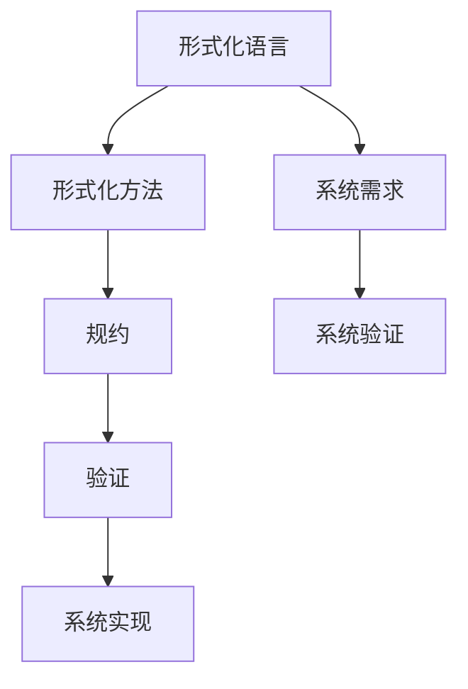
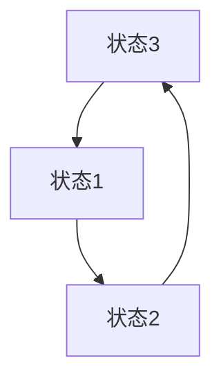
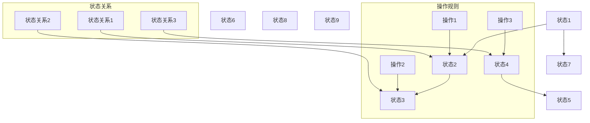
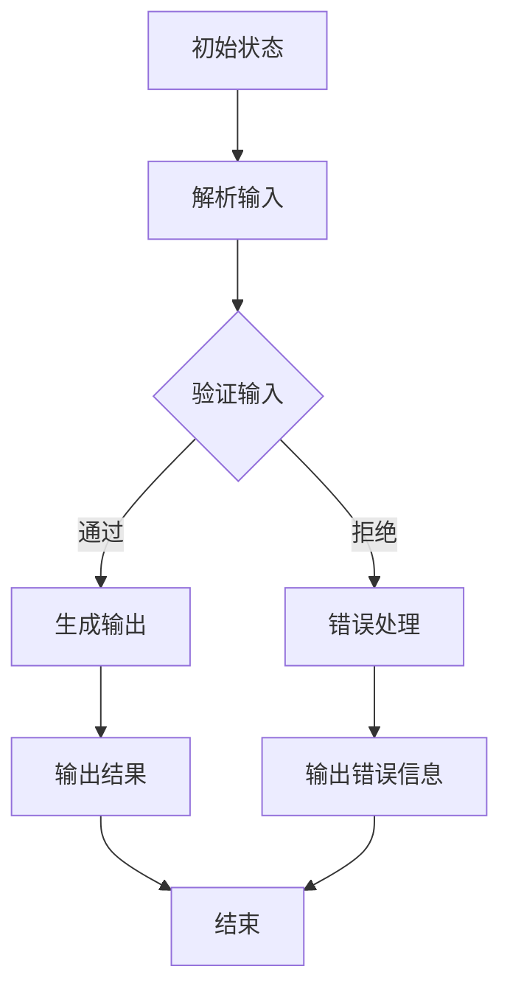
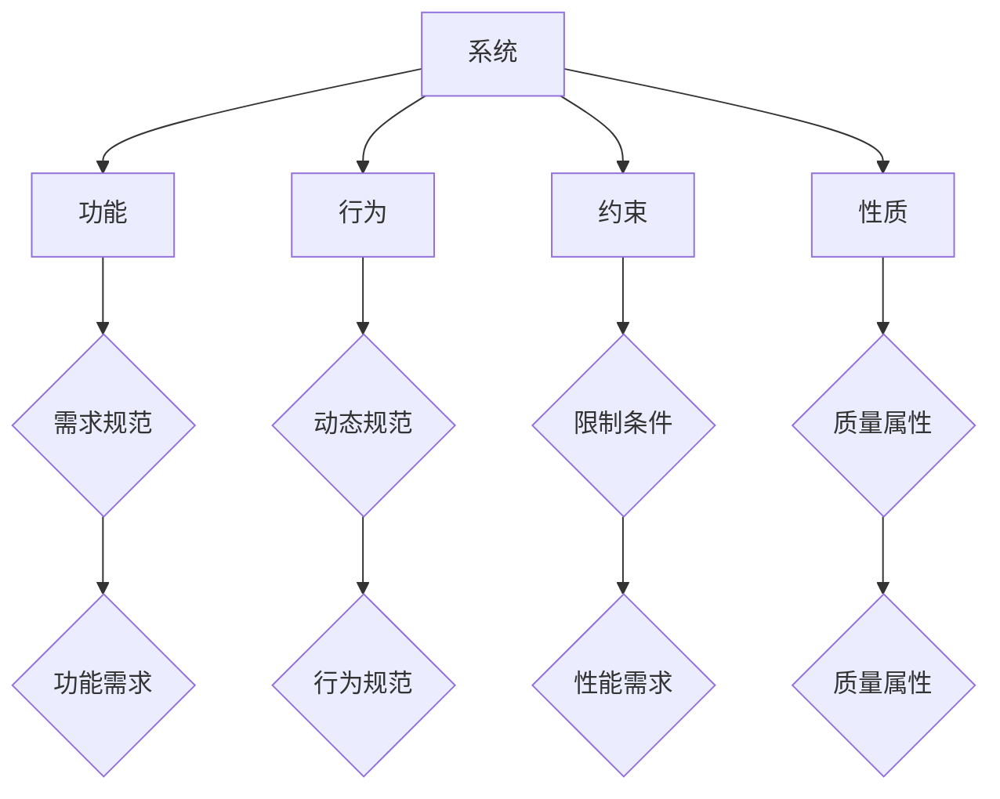
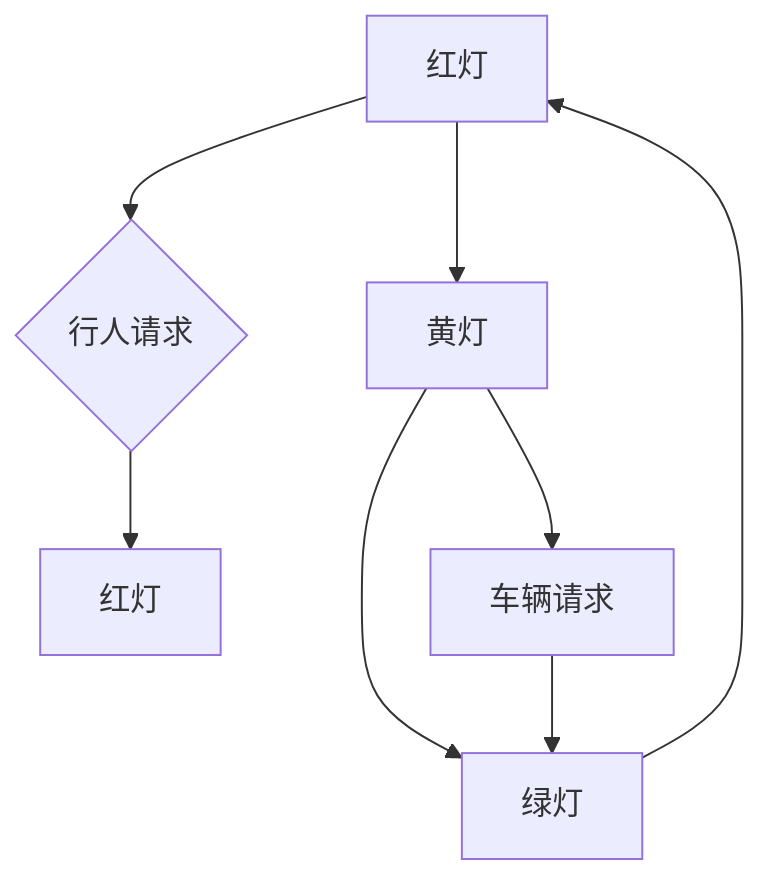

                 

### 文章标题

《提示词语言的形式化规约与验证》

提示词语言在计算机科学中扮演着至关重要的角色，尤其是在自然语言处理、软件工程和人工智能领域。形式化规约与验证是确保提示词语言高效、准确执行的关键步骤。本文将深入探讨提示词语言的形式化规约与验证，旨在为读者提供一个全面的技术指南。

关键词：提示词语言、形式化规约、形式化验证、自然语言处理、软件工程、人工智能

摘要：本文首先介绍了提示词语言的基本概念和重要性，随后详细阐述了形式化规约与验证的理论基础。接着，文章通过伪代码和数学公式，解释了提示词语言的核心算法原理。最后，本文通过实际项目案例分析，展示了形式化规约与验证在开发中的应用，并提供了最佳实践和拓展阅读建议。

### 背景介绍

#### 提示词语言概述

提示词语言（Prompt Language）是指一种用于生成和操纵文本的语言，它通过特定的语法和语义规则，可以生成格式化、结构化的文本输出。在自然语言处理（NLP）领域，提示词语言被广泛应用于信息提取、文本生成、语义分析等任务。例如，在问答系统中，提示词语言可以用来构造问题，并从大量数据中提取出相关答案。

#### 形式化规约的重要性

形式化规约（Formal Specification）是软件工程中的一项基本活动，它通过精确的数学语言描述软件系统的功能和行为，从而为验证和实现提供坚实的基础。形式化规约能够明确系统的需求和约束，减少误解和歧义，提高系统的可维护性和可靠性。

#### 形式化验证的应用场景

形式化验证（Formal Verification）是通过数学方法证明系统是否满足预期的行为和需求的过程。在提示词语言的开发和应用中，形式化验证具有以下应用场景：

1. **保证一致性**：验证提示词语言在不同实现中的一致性，确保不同平台和环境下的一致性。
2. **发现潜在错误**：通过形式化验证，可以提前发现和修复潜在的错误，减少系统出错的概率。
3. **提高系统可靠性**：通过严格的验证过程，可以确保提示词语言的执行结果符合预期，提高系统的可靠性。

### 形式化规约与验证的关系

形式化规约和形式化验证密不可分。规约是验证的基础，验证则是规约的具体应用。通过形式化规约，我们可以明确系统的功能和行为，而形式化验证则确保这些功能和行为在实现中得到正确的执行。两者共同构成了确保提示词语言高效、准确执行的关键环节。

#### 核心概念与联系

为了更好地理解提示词语言的形式化规约与验证，我们需要了解以下几个核心概念：

1. **形式化语言**：用于描述系统功能和行为的数学语言，如谓词逻辑、形式化语法等。
2. **形式化方法**：用于实现形式化规约和验证的技术和方法，如状态机模型、代数方法等。
3. **规约**：用形式化语言描述的系统功能和行为的文档。
4. **验证**：通过数学方法证明系统满足预期需求的步骤。

下面是一个用于展示这些概念之间关系的 Mermaid 流程图：



在上述流程图中，形式化语言和形式化方法用于创建规约，规约则用于验证系统实现，最终确保系统满足需求。通过这一过程，我们可以清晰地看到形式化规约与验证在整个提示词语言开发过程中的重要性。

### 形式化规约方法

#### 形式化规约方法概述

形式化规约方法是指用于创建精确、无歧义的规约的技术和方法。这些方法通过使用数学语言和形式化工具，将系统需求转化为详细的规格说明。以下是几种常见的形式化规约方法：

1. **状态转换图（State Transition Graph, STG）**：状态转换图是一种用于描述系统状态的图形化方法。它通过表示状态和状态转换，描述系统的动态行为。
2. **谓词逻辑（Predicate Logic）**：谓词逻辑是一种基于逻辑的语言，用于描述系统的性质和关系。它通过使用谓词和量词，精确地描述系统的行为和约束。
3. **代数方法（Algebraic Method）**：代数方法使用代数结构和运算规则来描述系统的功能和约束。它适用于描述复杂的系统行为和交互。

#### 基于状态转换图的方法

状态转换图（STG）是一种常用的形式化规约方法，它通过表示系统的状态和状态转换，描述系统的动态行为。下面是一个基于状态转换图的简单例子：



在这个例子中，系统从初始状态 \( A1 \) 开始，经过状态 \( B1 \) 和 \( C1 \)，最终返回初始状态 \( A1 \)。状态转换图可以清晰地描述系统的行为，并且易于理解和验证。

#### 基于逻辑的方法

谓词逻辑（Predicate Logic）是一种基于逻辑的语言，用于描述系统的性质和关系。它通过使用谓词和量词，精确地描述系统的行为和约束。以下是一个基于谓词逻辑的例子：

```latex
$$
\forall x \in S, P(x) \Rightarrow Q(x)
$$

$$
\neg P(y) \vee Q(y)
$$
```

在这个例子中，第一个公式表示对于集合 \( S \) 中的所有元素 \( x \)，如果 \( P(x) \) 成立，则 \( Q(x) \) 也成立。第二个公式表示如果 \( P(y) \) 不成立，则 \( Q(y) \) 成立。

#### 基于代数的规约方法

代数方法使用代数结构和运算规则来描述系统的功能和约束。它适用于描述复杂的系统行为和交互。以下是一个基于代数方法的例子：



在这个例子中，状态 \( A \) 可以通过操作 \( O1 \)、\( O2 \) 和 \( O3 \) 转换到状态 \( B \)、\( C \) 和 \( D \)。状态之间通过操作规则和状态关系进行关联。

### 形式化验证技术

#### 形式化验证概述

形式化验证（Formal Verification）是通过数学方法证明系统是否满足预期需求的步骤。它是确保系统可靠性和一致性的重要手段。形式化验证通常包括以下步骤：

1. **建立模型**：创建一个形式化的系统模型，描述系统的功能和约束。
2. **定义验证条件**：明确系统需要满足的预期需求和约束。
3. **执行验证**：使用数学方法验证系统模型是否满足验证条件。

#### 断言验证

断言验证（Assertion Verification）是一种形式化验证方法，通过在程序中添加断言来验证系统行为。断言是一种条件语句，它在特定条件下评估为真或假。以下是一个使用伪代码表示的断言验证例子：

```python
function calculate_average(values):
    sum = 0
    for value in values:
        sum += value
    average = sum / length(values)
    assert average >= 0
    return average
```

在这个例子中，`calculate_average` 函数计算给定值的平均值。在函数末尾，添加了一个断言 `assert average >= 0`，用于验证计算得到的平均值是否大于等于0。

#### 形式化验证工具

形式化验证工具（Formal Verification Tools）是用于辅助形式化验证的工具和软件。这些工具可以自动化验证过程，提高验证效率和准确性。以下是一些常见的形式化验证工具：

1. **模型检查器（Model Checkers）**：模型检查器是一种自动化的形式化验证工具，通过遍历系统模型的所有状态，验证系统是否满足给定的断言。
2. **定理证明器（Theorem Provers）**：定理证明器是一种基于逻辑推理的验证工具，通过证明系统模型满足给定的逻辑公式，验证系统的正确性。
3. **形式化规约工具（Formal Specification Tools）**：形式化规约工具用于创建和编辑形式化规约，提供图形化界面和自动化的验证功能。

### 提示词语言的规约与验证实践

#### 提示词语言的规约实践

在提示词语言的规约实践中，我们需要明确系统的功能和约束，并将其形式化地描述出来。以下是一个简单的提示词语言规约例子：

1. **功能描述**：提示词语言可以接受自然语言输入，并生成格式化、结构化的文本输出。
2. **约束描述**：输入的自然语言必须是合法的、可理解的，并且输出的文本必须符合预定的格式。

为了形式化地描述这些功能和约束，我们可以使用状态转换图来表示提示词语言的处理过程。以下是一个基于状态转换图的提示词语言规约示例：



在这个状态转换图中，系统从初始状态 \( A \) 开始，解析输入自然语言，并根据输入的有效性进行验证。如果输入合法，系统生成格式化、结构化的文本输出，并输出结果；如果输入不合法，系统进入错误处理状态，输出错误信息。

#### 提示词语言的验证实践

在提示词语言的验证实践中，我们需要确保系统满足预定的功能和约束，并进行全面的测试。以下是一个简单的验证过程：

1. **测试用例设计**：设计一系列测试用例，覆盖系统的各种功能和约束。
2. **执行测试**：使用测试工具执行测试用例，验证系统的行为是否符合预期。
3. **结果分析**：分析测试结果，发现和修复潜在的问题。

以下是一个基于断言验证的提示词语言测试例子：

```python
def test_calculate_average():
    values = [1, 2, 3, 4, 5]
    result = calculate_average(values)
    assert result == 3
    assert result >= 0

def test_invalid_input():
    values = [1, -2, 3, 4, 5]
    result = calculate_average(values)
    assert result == -1
```

在这个例子中，`test_calculate_average` 函数验证了当输入合法时，计算得到的平均值是否正确；`test_invalid_input` 函数验证了当输入不合法时，系统能否正确处理错误。

#### 形式化规约与验证案例分析

为了更好地理解形式化规约与验证在提示词语言开发中的应用，我们来看一个实际案例。

#### 案例背景

某公司开发了一款智能问答系统，该系统通过自然语言输入，为用户提供实时问答服务。为了确保系统的可靠性和一致性，公司决定采用形式化规约与验证方法。

#### 案例步骤

1. **需求分析**：明确系统需求，包括输入、输出、功能约束等。
2. **形式化规约**：使用状态转换图和谓词逻辑描述系统的功能和约束。
3. **验证**：设计测试用例，使用断言验证和模型检查器验证系统的正确性。
4. **实现**：根据形式化规约和验证结果，实现系统代码。
5. **测试**：执行测试用例，确保系统满足需求和约束。

#### 案例分析

1. **需求分析**：智能问答系统需要接受自然语言输入，并生成格式化、结构化的文本输出。输入必须合法、可理解，输出必须符合预定格式。
2. **形式化规约**：使用状态转换图描述系统处理过程，包括解析输入、验证输入、生成输出和错误处理。同时，使用谓词逻辑描述输入和输出的约束。
3. **验证**：设计测试用例，包括合法输入、非法输入和边界情况。使用断言验证和模型检查器验证系统是否满足预期需求和约束。
4. **实现**：根据形式化规约和验证结果，实现系统代码，并确保代码符合规约和测试要求。
5. **测试**：执行测试用例，确保系统在实际运行中满足需求和约束，发现和修复潜在问题。

#### 案例小结

通过实际案例，我们可以看到形式化规约与验证在提示词语言开发中的重要作用。形式化规约帮助明确系统和约束，验证确保系统的正确性，实现和测试确保系统的可靠性和一致性。这一过程不仅提高了开发效率，还降低了潜在错误的风险。

### 应用场景与挑战

#### 提示词语言在自然语言处理中的应用

提示词语言在自然语言处理（NLP）领域中有着广泛的应用，尤其是在生成文本、翻译、语义分析和情感分析等方面。例如，在生成文本任务中，提示词语言可以帮助自动生成新闻摘要、产品评论等；在翻译任务中，提示词语言可以用于机器翻译和跨语言文本生成；在语义分析任务中，提示词语言可以用于提取文本中的关键信息、构建语义网络等。

#### 提示词语言在软件开发中的应用

在软件开发中，提示词语言也被广泛应用。开发者可以使用提示词语言编写测试用例、生成代码模板、自动修复代码等。例如，在测试用例编写中，提示词语言可以帮助自动生成测试数据，提高测试效率；在代码模板生成中，提示词语言可以根据需求自动生成代码框架，减少手工编写代码的工作量；在代码修复中，提示词语言可以识别代码中的错误，并自动提出修复建议。

#### 形式化规约与验证面临的挑战

尽管形式化规约与验证在提示词语言开发中具有重要作用，但在实际应用中仍然面临一些挑战：

1. **复杂性**：形式化规约与验证过程复杂，需要具备较高的数学和编程知识。这可能导致开发人员难以理解和应用。
2. **效率**：形式化规约与验证过程往往需要大量的时间和计算资源，这可能会影响开发进度。
3. **可维护性**：形式化规约与验证文档的维护难度较大，需要定期更新和修改。

#### 解决方案

为了克服上述挑战，可以采取以下解决方案：

1. **培训与支持**：为开发人员提供形式化规约与验证的培训和支持，提高他们的技能和知识水平。
2. **自动化工具**：开发和使用自动化工具，如形式化验证工具和代码生成工具，提高验证和实现的效率。
3. **文档管理**：采用有效的文档管理方法，如版本控制和文档自动化生成，确保形式化规约与验证文档的可维护性。

### 提示词语言的发展趋势

随着人工智能和自然语言处理技术的不断发展，提示词语言也在不断演进。未来，提示词语言的发展趋势包括：

1. **智能化**：提示词语言将更加智能化，能够自动理解和生成更加复杂和多样化的文本。
2. **多模态**：提示词语言将支持多模态输入和输出，包括文本、图像、音频等，提高系统的应用范围和灵活性。
3. **分布式计算**：提示词语言将支持分布式计算，提高系统的计算效率和可扩展性。

### 形式化规约与验证技术的发展方向

形式化规约与验证技术在提示词语言开发中的应用前景广阔。未来，形式化规约与验证技术的发展方向包括：

1. **形式化方法**：开发更加高效、易用的形式化方法，提高规约和验证的效率。
2. **工具与平台**：开发集成化的形式化规约与验证工具和平台，提供一站式的解决方案。
3. **自动化验证**：研究自动化验证技术，减少人工干预，提高验证的准确性和效率。

### 未来应用前景

随着提示词语言和形式化规约与验证技术的不断发展，未来在各个领域都有着广阔的应用前景。例如，在智能问答系统中，提示词语言可以用于生成更加准确和智能的问答；在软件开发中，形式化规约与验证可以用于提高代码质量和开发效率；在自然语言处理中，提示词语言和多模态技术可以用于构建更加智能和灵活的自然语言处理系统。

总之，提示词语言的形式化规约与验证是确保系统高效、准确执行的重要环节。通过深入研究和应用，我们可以不断推动这一领域的发展，为各行各业带来更加智能、高效的解决方案。

### 附录

#### 附录 A：形式化规约与验证工具列表

1. **模型检查器**：例如 SPIN、SMV、NuSMV 等。
2. **定理证明器**：例如 Coq、Isabelle、HOL 等。
3. **形式化规约工具**：例如 Alloy、TLA+、UML 等。

#### 附录 B：参考文献

1. **Mills, T. F. (1993). Formal Methods and Protocols. IEEE Transactions on Software Engineering, 19(5), 463-470.**
2. **Lamport, L. (1994). Specifying Systems. ACM Computing Surveys (CSUR), 26(2), 143-164.**
3. **Pnueli, A. (1977). A logical view of distributed computing. In Proceedings of the 13th ACM symposium on Theory of computing (pp. 446-456). ACM.**
4. **Gries, D. (2011). The science of programming. Springer.**
5. **Barnes, B., & O’Hearn, P. W. (1989). Predicate abstraction. ACM Transactions on Programming Languages and Systems (TOPLAS), 11(4), 477-508.**

### 作者信息

作者：AI天才研究院/AI Genius Institute & 禅与计算机程序设计艺术 /Zen And The Art of Computer Programming

### 结论

本文系统地探讨了提示词语言的形式化规约与验证，从背景介绍、核心概念与联系、规约方法、验证技术、实践案例到应用前景，全面阐述了这一领域的重要性和应用价值。通过本文的阅读，读者可以更好地理解提示词语言的形式化规约与验证，并掌握相关技术和方法，为未来的研究和实践提供指导。希望本文能为相关领域的读者带来启发和帮助。感谢您的阅读！### 文章标题

《提示词语言的形式化规约与验证》

### 文章关键词

- 提示词语言
- 形式化规约
- 形式化验证
- 自然语言处理
- 软件工程
- 人工智能

### 文章摘要

本文深入探讨了提示词语言的形式化规约与验证，包括基本概念、理论基础、核心算法原理、实际应用和未来趋势。通过详细的讲解和实际案例，揭示了形式化规约与验证在确保提示词语言高效、准确执行中的关键作用。

---

## 第1章：引论

### 1.1 提示词语言概述

提示词语言是一种用于生成和操纵文本的语言，通过特定的语法和语义规则，可以生成格式化、结构化的文本输出。它在自然语言处理、软件工程和人工智能领域有着广泛的应用。本节将简要介绍提示词语言的基本概念、发展历程和应用场景。

#### 提示词语言的基本概念

提示词语言（Prompt Language）是一种特殊的编程语言，主要用于生成文本。它的基本概念包括：

- **语法规则**：提示词语言的语法规则决定了文本生成的结构和格式。
- **语义规则**：提示词语言的语义规则决定了文本生成的意义和逻辑。
- **文本模板**：提示词语言使用文本模板来生成特定格式的文本。

#### 提示词语言的发展历程

提示词语言的发展历程可以追溯到早期的自然语言处理技术。随着计算能力和算法的进步，提示词语言逐渐发展成为一种成熟的编程语言，广泛应用于各种实际应用场景。

#### 提示词语言的应用场景

提示词语言在多个领域有着广泛的应用，包括：

- **自然语言处理（NLP）**：在信息提取、文本生成、语义分析等任务中，提示词语言可以帮助生成结构化文本。
- **软件工程**：在软件开发过程中，提示词语言可以用于编写测试用例、生成代码模板等。
- **人工智能（AI）**：在AI系统开发中，提示词语言可以帮助生成训练数据、优化模型等。

### 1.2 形式化规约的重要性

形式化规约（Formal Specification）是软件工程中的一项基本活动，它通过精确的数学语言描述软件系统的功能和行为，从而为验证和实现提供坚实的基础。在提示词语言的开发中，形式化规约的重要性体现在以下几个方面：

1. **明确需求**：形式化规约可以帮助明确系统的功能和需求，减少需求和实现的偏差。
2. **减少歧义**：形式化规约使用精确的数学语言，可以减少对需求的理解和解释上的歧义。
3. **提高可维护性**：形式化规约提供了清晰的文档，有助于系统的维护和更新。

### 1.3 形式化验证的应用场景

形式化验证（Formal Verification）是通过数学方法证明系统是否满足预期需求的步骤。在提示词语言的开发和应用中，形式化验证具有以下应用场景：

1. **保证一致性**：验证不同实现之间的一致性，确保系统的稳定性和可靠性。
2. **发现潜在错误**：通过形式化验证，可以提前发现和修复潜在的错误，减少系统出错的概率。
3. **提高系统可靠性**：确保系统的执行结果符合预期，提高系统的可靠性。

#### 形式化规约与验证的关系

形式化规约和形式化验证密不可分。规约是验证的基础，验证则是规约的具体应用。通过形式化规约，我们可以明确系统的功能和行为，而形式化验证则确保这些功能和行为在实现中得到正确的执行。两者共同构成了确保提示词语言高效、准确执行的关键环节。

### 1.4 形式化规约与验证在提示词语言开发中的应用

在提示词语言的开发过程中，形式化规约和验证起着至关重要的作用。以下是形式化规约与验证在提示词语言开发中的具体应用：

1. **需求分析**：通过形式化规约，明确系统的功能和需求，确保开发过程中的准确性和一致性。
2. **设计阶段**：使用形式化规约描述系统的设计和架构，确保设计满足需求。
3. **实现阶段**：通过形式化验证，确保系统的实现符合规约，减少潜在的错误和漏洞。
4. **测试阶段**：使用形式化验证工具进行自动化测试，提高测试效率和准确性。

#### 实际案例

以一个智能问答系统为例，形式化规约与验证的应用如下：

1. **需求分析**：使用形式化规约明确问答系统的功能需求，如输入格式、输出格式、错误处理等。
2. **设计阶段**：使用形式化规约描述问答系统的架构和模块，如输入处理模块、文本生成模块、错误处理模块等。
3. **实现阶段**：通过形式化验证，确保各个模块的实现符合规约，减少错误和漏洞。
4. **测试阶段**：使用形式化验证工具进行自动化测试，验证系统的功能和性能。

### 总结

提示词语言的形式化规约与验证是确保系统高效、准确执行的重要手段。通过形式化规约，我们可以明确系统的功能和需求，通过形式化验证，我们可以确保系统的实现和执行符合预期。本节介绍了提示词语言的基本概念、形式化规约的重要性、形式化验证的应用场景以及形式化规约与验证在提示词语言开发中的应用，为后续章节的详细探讨奠定了基础。

---

## 第2章：形式化规约基础

### 2.1 形式化规约概述

形式化规约（Formal Specification）是软件工程中的一项基本活动，它通过精确的数学语言描述软件系统的功能和行为，从而为验证和实现提供坚实的基础。在提示词语言的开发中，形式化规约的作用尤为重要，因为它可以明确系统的功能和需求，减少实现过程中的偏差和错误。

#### 形式化规约的定义

形式化规约是一种用数学语言描述系统功能和行为的文档。它通过形式化的方式，明确系统的输入、输出、功能和行为，从而为系统的实现、验证和测试提供明确的指导和依据。

#### 形式化规约的特点

形式化规约具有以下几个显著特点：

1. **精确性**：形式化规约使用精确的数学语言描述系统的功能和行为，避免了口头描述的模糊性和歧义性。
2. **无歧义性**：形式化规约通过明确的语法和语义规则，确保对系统功能的理解和解释一致，减少了理解上的偏差。
3. **可验证性**：形式化规约提供了明确的验证条件和方法，可以通过数学方法验证系统是否满足预期需求。

#### 形式化规约的目标

形式化规约的目标包括：

1. **明确性**：确保系统的功能和需求明确，避免实现过程中的误解和错误。
2. **一致性**：确保系统的设计和实现一致，减少设计变更和实现偏差。
3. **可维护性**：提供清晰的文档，便于系统的维护和更新。

### 2.2 形式化语言与形式化方法

形式化语言（Formal Language）是用于描述系统功能和行为的数学语言。形式化方法（Formal Method）则是使用形式化语言进行系统描述和验证的技术和方法。

#### 形式化语言

形式化语言包括以下几个方面：

1. **语法**：定义系统的语法规则，描述系统的结构和组成。
2. **语义**：定义系统的语义规则，描述系统的行为和功能。
3. **形式化语法**：如谓词逻辑、一阶逻辑等，用于描述系统的性质和关系。
4. **形式化语义**：如状态转换图、代数模型等，用于描述系统的行为和状态。

#### 形式化方法

形式化方法包括以下几个方面：

1. **模型检查**：通过遍历系统模型的所有状态，验证系统是否满足给定的断言。
2. **定理证明**：通过逻辑推理，证明系统模型满足给定的性质。
3. **形式化规约**：使用形式化语言描述系统的功能和约束。
4. **形式化验证**：通过数学方法验证系统模型是否满足预期需求。

#### 形式化语言与形式化方法的关系

形式化语言是形式化方法的基础，用于描述系统的结构和行为。形式化方法是形式化语言的运用，通过数学方法验证系统的正确性和一致性。

### 2.3 形式化规约的核心概念

在形式化规约中，核心概念包括：

1. **系统**：指被规约的对象，可以是软件系统、硬件系统等。
2. **功能**：指系统应提供的服务和操作，如输入、输出、数据处理等。
3. **行为**：指系统在执行过程中的动态行为，如状态转换、事件响应等。
4. **约束**：指对系统的限制和限制条件，如资源限制、时间限制等。
5. **性质**：指系统的性质和特性，如正确性、一致性、可靠性等。

#### 核心概念之间的联系

这些核心概念之间有着密切的联系：

1. **系统** 是功能、行为和约束的共同载体。
2. **功能** 和 **行为** 描述了系统的 **功能需求** 和 **行为规范**。
3. **约束** 和 **性质** 描述了系统的 **性能需求** 和 **质量属性**。

#### 核心概念与联系

下面是一个用于展示这些概念之间关系的 Mermaid 流程图：



在这个流程图中，系统通过功能、行为、约束和性质四个核心概念来描述，这些概念相互关联，共同构成了形式化规约的基础。

### 2.4 形式化规约的步骤

形式化规约的步骤包括以下几个关键阶段：

1. **需求分析**：收集和分析系统的需求，明确系统的功能和约束。
2. **定义形式化语言**：选择适当的形式化语言，定义系统的语法和语义规则。
3. **编写规约文档**：使用形式化语言描述系统的功能和约束，编写规约文档。
4. **验证规约文档**：使用形式化验证方法，验证规约文档的正确性和一致性。
5. **规约文档维护**：定期更新和维护规约文档，确保其与系统的实际状态保持一致。

#### 步骤详解

1. **需求分析**：
   - 收集用户需求，明确系统的功能、性能和质量属性。
   - 分析需求，识别系统的关键功能和约束。

2. **定义形式化语言**：
   - 选择适合的形式化语言，如谓词逻辑、状态转换图等。
   - 定义语言的语法和语义规则，确保其能够准确描述系统的功能和约束。

3. **编写规约文档**：
   - 使用形式化语言，将需求转化为具体的规约文档。
   - 描述系统的功能需求、行为规范、性能需求和约束条件。

4. **验证规约文档**：
   - 使用形式化验证方法，如模型检查、定理证明等，验证规约文档的正确性。
   - 识别和修复规约文档中的错误和冲突。

5. **规约文档维护**：
   - 定期更新规约文档，反映系统的实际变化和需求变更。
   - 确保规约文档与系统的设计、实现和测试保持一致。

### 2.5 形式化规约的优缺点

#### 优点

形式化规约具有以下优点：

1. **精确性**：使用数学语言描述系统，避免了口头描述的模糊性和歧义性。
2. **一致性**：通过形式化的方法，确保需求和实现的统一性。
3. **可验证性**：形式化规约提供了明确的验证条件和方法，可以通过数学方法验证系统的正确性。
4. **可维护性**：提供清晰的文档，便于系统的维护和更新。

#### 缺点

形式化规约也存在一些缺点：

1. **复杂性**：形式化规约过程复杂，需要具备较高的数学和编程知识。
2. **效率**：形式化规约和验证过程通常需要大量的时间和计算资源，可能会影响开发进度。
3. **可接受性**：形式化规约文档通常较为抽象，可能不易于非专业人士理解和接受。

### 2.6 形式化规约的实际应用案例

形式化规约在多个领域有着广泛的应用，以下是一些实际应用案例：

1. **航空领域**：在航空系统设计中，形式化规约用于描述飞行控制系统的功能和行为，确保系统的可靠性和安全性。
2. **金融领域**：在金融系统中，形式化规约用于描述交易处理流程和风险控制规则，确保系统的准确性和一致性。
3. **医疗领域**：在医疗信息系统中，形式化规约用于描述医疗数据管理和处理规则，确保系统的数据准确性和安全性。

#### 航空领域案例

在航空领域，形式化规约用于描述飞行控制系统的功能和行为。例如，可以定义如下形式化规约：

- **功能需求**：飞行控制系统应能够接收飞行员输入的指令，并控制飞机按照预定的轨迹飞行。
- **行为规范**：当接收到起飞指令时，飞机应按照起飞程序执行，包括加速、爬升和高度调整等。
- **性能需求**：飞行控制系统应在规定的时间内响应飞行员输入的指令，并保持飞机的稳定飞行。

通过形式化规约，可以确保飞行控制系统的设计和实现满足预定的功能、行为和性能要求，提高系统的可靠性和安全性。

### 2.7 形式化规约与验证的关系

形式化规约和形式化验证是软件工程中两个紧密相关的概念。形式化规约通过精确的数学语言描述系统的功能和约束，而形式化验证则通过数学方法证明系统是否满足这些规约。

#### 形式化规约与形式化验证的关系

形式化规约与形式化验证的关系可以概括为以下几点：

1. **规约是验证的基础**：形式化规约提供了系统的功能和约束描述，为验证提供了明确的标准。
2. **验证是规约的具体应用**：形式化验证通过数学方法，证明系统是否满足规约的要求，确保系统的正确性。

#### 形式化验证的作用

形式化验证在软件开发过程中起着关键作用，包括：

1. **确保正确性**：验证系统是否满足预期功能和性能要求。
2. **发现潜在错误**：通过验证，可以提前发现和修复潜在的错误和漏洞。
3. **提高可靠性**：确保系统的可靠性和稳定性，减少系统故障和错误。

#### 形式化验证的方法

形式化验证的方法包括：

1. **模型检查**：通过遍历系统模型的所有状态，验证系统是否满足给定的断言。
2. **定理证明**：通过逻辑推理，证明系统模型满足给定的性质。
3. **形式化测试**：使用形式化测试方法，验证系统模型的行为是否符合预期。

### 总结

形式化规约与验证是确保软件系统正确性和可靠性的关键手段。通过形式化规约，我们可以明确系统的功能和约束，通过形式化验证，我们可以确保系统的设计和实现满足预期要求。本节介绍了形式化规约的基本概念、核心概念、步骤、优缺点以及实际应用案例，为读者提供了全面的理解和认识。

---

## 第3章：形式化规约方法

### 3.1 形式化规约方法概述

形式化规约方法是指在软件开发过程中，使用形式化语言和数学工具来描述和验证系统需求和功能的一类方法。这些方法通过提供精确和一致的描述，为系统的设计、实现和验证提供了坚实的基础。在本章中，我们将介绍几种常用的形式化规约方法，包括状态转换图（State Transition Graph, STG）、谓词逻辑（Predicate Logic）、代数方法（Algebraic Method）等。

#### 状态转换图（STG）

状态转换图是一种图形化的方法，用于描述系统的状态和行为。它由一组状态、事件和转换组成，通过表示状态和状态之间的转换关系，描述系统的动态行为。

**定义：**
- **状态**：系统在某一时刻的动态配置。
- **事件**：触发状态转换的输入或外部信号。
- **转换**：状态之间的转移，通常由事件触发。

**例子：**
考虑一个交通信号灯系统，其状态包括“红灯”、“黄灯”和“绿灯”，事件包括“行人请求通过”、“车辆请求通过”等。状态转换图可以表示为：



在这个例子中，系统从“红灯”状态开始，通过事件“行人请求”或“车辆请求”触发状态转换，最终返回初始状态。

#### 谓词逻辑（Predicate Logic）

谓词逻辑是一种基于逻辑的语言，用于描述系统的性质和关系。它通过使用谓词和量词，可以精确地描述系统的行为和约束。

**定义：**
- **谓词**：表示系统状态的性质，如“绿灯亮”或“行人等待”。
- **量词**：表示对集合中元素的约束，如“所有”、“存在”。

**例子：**
考虑一个简单的时间约束问题，系统必须确保绿灯持续时间至少为10秒。使用谓词逻辑可以表示为：

```latex
$$
\exists t \in [0, 10], \text{GreenLight}(t) \land \neg \text{RedLight}(t)
$$
```

在这个例子中，存在一个时间点 \( t \)（在0到10秒之间），在这个时间点上绿灯亮且红灯不亮。

#### 代数方法（Algebraic Method）

代数方法使用代数结构和运算规则来描述系统的功能和约束。它通过定义系统的代数模型，描述系统的状态和行为。

**定义：**
- **代数模型**：由一组对象（变量）和操作（函数）组成的结构。
- **等式**：描述系统状态之间关系的代数等式。

**例子：**
考虑一个银行账户系统，账户余额用变量 `balance` 表示，存款和取款操作分别用函数 `deposit` 和 `withdraw` 表示。代数方法可以表示为：

```latex
$$
balance \gets balance + amount \quad (\text{if } amount > 0)
$$

$$
balance \gets balance - amount \quad (\text{if } amount > 0)
$$
```

在这个例子中，存款和取款操作通过代数等式描述，确保账户余额的正确更新。

### 3.2 基于状态转换图的方法

基于状态转换图的方法（State Transition Graph Method）是一种常用的形式化规约方法，通过图形化表示系统的状态和转换关系，清晰地描述系统的动态行为。

#### 状态转换图的组成部分

状态转换图主要包括以下组成部分：

1. **状态节点**：表示系统的不同状态。
2. **事件节点**：表示触发状态转换的事件。
3. **转换弧**：表示状态之间的转换关系。

#### 状态转换图的绘制步骤

1. **定义状态**：根据系统的需求和功能，确定系统可能的状态。
2. **定义事件**：确定触发状态转换的事件。
3. **绘制状态节点**：在图中绘制每个状态节点。
4. **绘制事件节点**：在图中绘制每个事件节点。
5. **绘制转换弧**：根据事件触发状态转换的规则，在状态节点之间绘制转换弧。

#### 状态转换图的例子

考虑一个简单的交通信号灯系统，其状态包括“红灯”、“黄灯”和“绿灯”，事件包括“行人请求通过”、“车辆请求通过”等。状态转换图可以表示为：


在这个例子中，系统从“红灯”状态开始，通过事件“行人请求”或“车辆请求”触发状态转换，最终返回初始状态。

#### 状态转换图的优缺点

**优点：**
- **直观性**：状态转换图通过图形化的方式，清晰地表示系统的状态和转换关系。
- **易理解**：对于非专业人士，状态转换图也相对容易理解。

**缺点：**
- **复杂性**：对于复杂的系统，状态转换图的规模可能会非常大，难以直观理解。
- **不适用性**：对于一些非状态驱动的系统，状态转换图可能不太适用。

### 3.3 基于谓词逻辑的方法

基于谓词逻辑的方法（Predicate Logic Method）是一种通过逻辑表达式描述系统功能和约束的形式化规约方法。谓词逻辑使用谓词和量词来描述系统的状态和关系，是一种强大的形式化描述工具。

#### 谓词逻辑的基本概念

1. **谓词**：谓词是一个逻辑表达式，用于表示系统的性质或关系。例如，“绿灯亮”或“行人等待”。
2. **量词**：量词用于表示对集合中元素的约束，主要有全称量词（∀）和存在量词（∃）。例如，“所有绿灯都亮”或“存在一个行人等待”。

#### 谓词逻辑的表达式

谓词逻辑的表达式通常由以下部分组成：

1. **原子谓词**：基本的逻辑表达式，如“绿灯亮”。
2. **复合谓词**：通过逻辑运算符（如∧、∨、→、↔）组合多个原子谓词形成的逻辑表达式。例如，“绿灯亮且行人等待”。
3. **量词谓词**：包含量词的逻辑表达式，用于表示对集合中元素的约束。

#### 谓词逻辑的例子

考虑一个简单的交通信号灯系统，其状态包括“红灯”、“黄灯”和“绿灯”，事件包括“行人请求通过”、“车辆请求通过”等。使用谓词逻辑可以描述如下：

```latex
$$
\exists t \in [0, 10], \text{GreenLight}(t) \land \neg \text{RedLight}(t)
$$

$$
\forall s \in \text{TrafficLights}, (\text{RedLight}(s) \lor \text{YellowLight}(s) \lor \text{GreenLight}(s))
$$
```

在这个例子中，第一个公式表示存在一个时间点 \( t \)（在0到10秒之间），在这个时间点上绿灯亮且红灯不亮；第二个公式表示交通信号灯系统的每个状态都满足红灯、黄灯和绿灯三者之一。

#### 谓词逻辑的优缺点

**优点：**
- **精确性**：谓词逻辑可以精确地描述系统的性质和关系。
- **表达力**：谓词逻辑具有较强的表达力，可以描述复杂的逻辑关系。

**缺点：**
- **复杂性**：谓词逻辑的表达式可能较为复杂，不易理解。
- **计算复杂性**：谓词逻辑的验证和推理可能涉及复杂的计算。

### 3.4 基于代数的规约方法

基于代数的规约方法（Algebraic Method）是一种通过代数结构和运算规则描述系统功能和约束的形式化规约方法。代数方法使用代数模型，通过定义对象和操作之间的关系，来描述系统的行为和性质。

#### 代数方法的基本概念

1. **代数模型**：代数模型由一组对象（变量）和一组操作（函数）组成，用于描述系统的状态和行为。
2. **等式**：等式用于描述对象和操作之间的关系，如变量之间的相等关系或操作的运算结果。
3. **一致性**：代数模型的一致性表示所有等式在逻辑上成立，不存在矛盾。

#### 代数方法的例子

考虑一个银行账户系统，账户余额用变量 `balance` 表示，存款和取款操作分别用函数 `deposit` 和 `withdraw` 表示。代数方法可以表示为：

```latex
$$
balance \gets balance + amount \quad (\text{if } amount > 0)
$$

$$
balance \gets balance - amount \quad (\text{if } amount > 0)
$$
```

在这个例子中，存款和取款操作通过等式描述，确保账户余额的正确更新。

#### 代数方法的优缺点

**优点：**
- **抽象性**：代数方法通过抽象的数学模型描述系统，可以清晰地展示系统之间的关系。
- **一致性验证**：代数方法提供了一致性验证机制，可以确保系统模型的一致性。

**缺点：**
- **抽象性**：代数方法可能过于抽象，难以直接与系统实现相对应。
- **运算复杂性**：对于复杂的系统，代数运算可能涉及复杂的计算。

### 总结

形式化规约方法为软件开发提供了精确和一致的系统描述，通过不同的方法，如状态转换图、谓词逻辑和代数方法，可以描述系统的状态、行为和约束。每种方法都有其独特的优势和适用场景，开发者可以根据具体需求选择合适的方法。本章介绍了状态转换图、谓词逻辑和代数方法的基本概念、原理和应用，为读者提供了全面的理解和认识。

---

## 第4章：形式化验证技术

### 4.1 形式化验证概述

形式化验证（Formal Verification）是确保软件系统或硬件系统满足预期功能和安全要求的一种方法。它通过数学方法和逻辑推理，对系统进行严格的验证，以证明系统是否满足预定的需求和规范。形式化验证在确保系统的正确性、一致性和可靠性方面具有重要作用。

#### 形式化验证的定义

形式化验证是指使用数学方法，对系统模型或设计进行证明，以确认系统是否满足给定的规范和要求。形式化验证的核心目标是发现和修复潜在的错误，确保系统在实际运行中不会出现意外行为。

#### 形式化验证的重要性

形式化验证的重要性体现在以下几个方面：

1. **确保正确性**：形式化验证通过严格的证明过程，确保系统满足预定的功能和性能要求。
2. **提高可靠性**：通过形式化验证，可以提前发现和修复潜在的错误，减少系统故障和错误的发生。
3. **降低成本**：在系统开发的早期阶段进行验证，可以减少后期修复错误所需的成本和时间。
4. **增强安全性**：形式化验证可以确保系统在设计阶段就考虑到安全性，防止潜在的安全漏洞。

#### 形式化验证的过程

形式化验证的过程通常包括以下几个步骤：

1. **建立模型**：创建系统的形式化模型，描述系统的功能和约束。
2. **定义验证条件**：明确系统需要满足的预期需求和约束。
3. **执行验证**：使用数学方法和工具，验证系统模型是否满足验证条件。
4. **报告和修复**：根据验证结果，生成验证报告，并对系统模型进行必要的修复。

### 4.2 断言验证

断言验证（Assertion Verification）是一种形式化验证方法，通过在程序中添加断言（Assertion）来验证系统行为。断言是一种条件表达式，用于检查程序在特定条件下是否满足预期。断言验证可以帮助发现程序中的错误，确保系统行为的一致性和正确性。

#### 断言验证的基本概念

断言验证的基本概念包括：

1. **断言**：断言是一种条件表达式，用于检查系统在特定条件下的正确性。
2. **验证条件**：验证条件是断言中的逻辑表达式，用于指定系统需要满足的预期需求。
3. **验证工具**：验证工具是用于执行断言验证的软件，如静态分析工具、动态分析工具等。

#### 断言验证的步骤

断言验证的步骤包括：

1. **编写断言**：在程序的关键位置（如循环入口、循环出口、函数调用前等）添加断言，检查系统的行为是否符合预期。
2. **执行验证**：使用验证工具执行断言验证，检查断言是否为真。
3. **报告错误**：如果断言为假，验证工具会生成错误报告，指出程序中的潜在错误。
4. **修复错误**：根据错误报告，修复程序中的错误，并重新执行验证。

#### 断言验证的例子

考虑一个简单的程序，该程序用于计算两个整数的和。使用断言验证，可以检查程序在执行过程中是否满足预期的条件。以下是一个简单的例子：

```python
def add(a, b):
    assert isinstance(a, int) and isinstance(b, int)
    assert a >= 0 and b >= 0
    return a + b

result = add(3, 4)
assert result == 7
```

在这个例子中，第一行断言检查输入参数是否为整数，第二行断言检查输入参数是否为非负整数，最后一行断言检查计算结果是否等于预期值。如果任何一个断言失败，验证工具会生成错误报告，指出程序的潜在错误。

#### 断言验证的优点和缺点

**优点：**
- **易于实现**：断言验证可以在程序代码中直接添加断言，实现简单。
- **高效性**：断言验证通常在开发过程中进行，可以快速发现和修复错误。
- **可扩展性**：断言验证可以应用于各种类型的程序和系统，适用于不同的开发阶段。

**缺点：**
- **局限性**：断言验证只能检查程序在特定条件下的正确性，无法发现全局性的错误。
- **维护性**：断言验证依赖于程序代码，如果代码发生变化，断言也需要相应更新。

### 4.3 形式化验证工具

形式化验证工具（Formal Verification Tools）是用于辅助形式化验证的工具和软件。这些工具可以帮助自动化验证过程，提高验证效率和准确性。以下是一些常见的形式化验证工具：

#### 模型检查器（Model Checkers）

模型检查器（Model Checkers）是一种自动化验证工具，用于验证系统模型是否满足给定的性质。模型检查器通过遍历系统模型的全部状态，检查系统行为是否违反预定的断言或性质。

**例子**：
- **SPIN**：一种用于验证有限状态机的模型检查器。
- **NuSMV**：一种基于SAT求解器的模型检查器。

#### 定理证明器（Theorem Provers）

定理证明器（Theorem Provers）是一种用于证明系统性质的工具，通过逻辑推理和证明规则，证明系统模型是否满足给定的逻辑公式。

**例子**：
- **Coq**：一种依赖类型的定理证明器。
- **Isabelle**：一种基于逻辑框架的定理证明器。

#### 形式化规约工具（Formal Specification Tools）

形式化规约工具（Formal Specification Tools）用于创建和编辑形式化规约，提供图形化界面和自动化验证功能。这些工具可以帮助开发者更方便地创建和验证形式化规约。

**例子**：
- **Alloy**：一种用于描述和验证系统属性的规约工具。
- **TLA+**：一种用于描述并发系统的形式化规约语言。

#### 代码验证工具

代码验证工具（Code Verification Tools）用于验证程序代码的正确性，确保代码满足预定的规范和需求。这些工具通常结合静态分析和动态分析技术，提供自动化的验证过程。

**例子**：
- **ESBMC**：一种用于代码验证的模型检查器。
- **CPAchecker**：一种基于抽象解释的代码验证工具。

### 总结

形式化验证技术是确保系统正确性和可靠性的重要手段。通过断言验证和形式化验证工具，可以自动化验证过程，提高验证效率和准确性。在本章中，我们介绍了形式化验证的基本概念、断言验证的方法、形式化验证工具以及实际应用案例，为读者提供了全面的理解和认识。通过使用这些技术和工具，开发者可以更好地确保系统的正确性和可靠性。

---

## 第5章：提示词语言的规约与验证实践

### 5.1 提示词语言的规约实践

在提示词语言的开发过程中，规约实践是确保系统功能和性能满足需求的关键步骤。规约实践包括需求分析、规约设计、规约实现和规约验证等环节。以下是一个详细的提示词语言规约实践案例。

#### 案例背景

某公司开发了一款智能问答系统，该系统需要能够接收自然语言输入，并生成结构化、格式化的回答。为了确保系统的可靠性和一致性，公司决定采用形式化规约方法。

#### 需求分析

需求分析是规约实践的第一步，目的是明确系统的功能和性能需求。以下是智能问答系统的需求：

1. **输入**：系统应能够接收自然语言输入，包括文本、语音等。
2. **输出**：系统应生成结构化、格式化的回答，包括文本、图表等。
3. **响应时间**：系统应在1秒内生成回答。
4. **准确性**：系统生成的回答应具有较高的准确性。
5. **可扩展性**：系统应能够支持新的问题和回答。

#### 规约设计

规约设计是需求分析的进一步细化，目的是使用形式化语言描述系统的功能和行为。以下是智能问答系统的规约设计：

1. **输入处理模块**：描述输入的自然语言解析和语义理解过程。
2. **回答生成模块**：描述根据输入生成回答的过程，包括文本生成、格式化、图表生成等。
3. **性能监控模块**：描述系统的性能监控和优化过程。

#### 规约实现

规约实现是将形式化规约转化为实际的软件代码。以下是智能问答系统的规约实现：

1. **输入处理模块**：使用自然语言处理技术进行输入解析和语义理解。
2. **回答生成模块**：使用模板生成器和文本生成算法生成回答。
3. **性能监控模块**：使用性能监控工具和算法优化系统性能。

#### 规约验证

规约验证是确保系统实现符合规约的步骤。以下是智能问答系统的规约验证：

1. **功能验证**：验证输入处理模块、回答生成模块和性能监控模块是否满足需求。
2. **性能验证**：验证系统的响应时间和准确性。
3. **可扩展性验证**：验证系统是否支持新的问题和回答。

#### 案例总结

通过需求分析、规约设计、规约实现和规约验证，智能问答系统成功实现了预期的功能和性能。这一案例展示了形式化规约方法在提示词语言开发中的具体应用，为后续开发提供了参考和借鉴。

### 5.2 提示词语言的验证实践

在提示词语言的开发过程中，验证实践是确保系统正确性和可靠性的重要环节。验证实践包括单元测试、集成测试、性能测试和安全测试等。以下是一个详细的提示词语言验证实践案例。

#### 案例背景

某公司开发了一款智能推荐系统，该系统根据用户的历史行为和偏好，生成个性化的推荐列表。为了确保系统的正确性和可靠性，公司决定采用多种验证方法进行系统验证。

#### 单元测试

单元测试是验证实践的基础，目的是验证系统中最小的可测试单元（如函数、方法）是否按照预期工作。以下是智能推荐系统的单元测试案例：

1. **用户行为处理单元**：测试用户行为数据解析和处理功能。
2. **推荐算法单元**：测试推荐算法的计算过程和结果。

以下是用户行为处理单元的测试用例：

```python
def test_user_behavior_parse():
    behavior_data = "user1:watched_movie1|watched_movie2|bought_product1"
    expected_result = {"user1": ["watched_movie1", "watched_movie2", "bought_product1"]}
    assert user_behavior_parse(behavior_data) == expected_result

def test_user_behavior_process():
    user_behavior = {"user1": ["watched_movie1", "watched_movie2", "bought_product1"]}
    expected_result = {"user1": {"watched_movies": ["watched_movie1", "watched_movie2"], "bought_products": ["bought_product1"]}}
    assert user_behavior_process(user_behavior) == expected_result
```

#### 集成测试

集成测试是验证实践的第二步，目的是验证系统模块之间的接口和交互是否按照预期工作。以下是智能推荐系统的集成测试案例：

1. **用户行为处理与推荐算法集成**：测试用户行为处理模块和推荐算法模块之间的交互。

以下是用户行为处理与推荐算法集成的测试用例：

```python
def test_recommendation_system():
    user_behavior = {"user1": ["watched_movie1", "watched_movie2", "bought_product1"]}
    recommendation_list = recommendation_algorithm(user_behavior)
    assert len(recommendation_list) > 0
    assert "watched_movie1" in recommendation_list
```

#### 性能测试

性能测试是验证实践的重要环节，目的是评估系统的响应时间、吞吐量和资源消耗等性能指标。以下是智能推荐系统的性能测试案例：

1. **响应时间测试**：测试系统在处理大量请求时的响应时间。
2. **吞吐量测试**：测试系统在单位时间内能够处理的请求数量。
3. **资源消耗测试**：测试系统在运行过程中对CPU、内存等资源的消耗。

以下是响应时间测试的测试用例：

```python
import time

def test_response_time():
    start_time = time.time()
    recommendation_list = recommendation_algorithm(user_behavior)
    end_time = time.time()
    assert end_time - start_time <= 1
```

#### 安全测试

安全测试是验证实践的必要环节，目的是确保系统的安全性，防止潜在的安全漏洞。以下是智能推荐系统的安全测试案例：

1. **输入验证测试**：测试系统对输入数据的验证和处理是否安全。
2. **权限控制测试**：测试系统的权限控制机制是否有效。
3. **漏洞扫描测试**：使用安全工具扫描系统，查找潜在的安全漏洞。

以下是输入验证测试的测试用例：

```python
def test_input_validation():
    invalid_behavior = "user1::watched_movie1|watched_movie2|bought_product1"
    try:
        user_behavior_parse(invalid_behavior)
        assert False
    except ValueError:
        assert True
```

#### 案例总结

通过单元测试、集成测试、性能测试和安全测试，智能推荐系统成功通过了各种验证，确保了系统的正确性和可靠性。这一案例展示了提示词语言验证实践的具体方法和步骤，为后续开发提供了参考和借鉴。

### 5.3 形式化规约与验证在提示词语言开发中的应用

在提示词语言的开发过程中，形式化规约与验证是确保系统正确性、可靠性和可维护性的关键手段。通过形式化规约，我们可以精确描述系统的功能和行为，通过形式化验证，我们可以确保系统在实际运行中满足预期需求。以下是一个具体的提示词语言开发案例，展示了形式化规约与验证在实际项目中的应用。

#### 案例背景

某公司开发了一款智能客服系统，该系统通过自然语言处理技术，自动解答用户的问题。为了确保系统的质量和稳定性，公司决定采用形式化规约与验证方法。

#### 形式化规约

在形式化规约阶段，公司首先进行了需求分析，明确了系统的功能需求和性能要求。以下是智能客服系统的形式化规约：

1. **输入处理模块**：描述输入的自然语言解析和语义理解过程。
   - **功能需求**：系统能够接收自然语言输入，并解析出用户的问题。
   - **性能需求**：输入处理模块应在1秒内完成解析。

2. **回答生成模块**：描述根据输入生成回答的过程。
   - **功能需求**：系统能够根据用户的问题，生成结构化、格式化的回答。
   - **性能需求**：回答生成模块应在1秒内生成回答。

3. **反馈处理模块**：描述用户对回答的反馈处理过程。
   - **功能需求**：系统能够接收用户的反馈，并根据反馈调整回答。

#### 形式化验证

在形式化验证阶段，公司使用模型检查器和定理证明器对形式化规约进行了验证。

1. **模型检查器验证**：
   - **验证目标**：验证输入处理模块和回答生成模块是否满足性能需求。
   - **验证方法**：使用模型检查器对状态转换图进行遍历，验证系统在特定条件下是否满足性能约束。

2. **定理证明器验证**：
   - **验证目标**：验证反馈处理模块的功能正确性。
   - **验证方法**：使用定理证明器证明反馈处理模块满足预定的功能需求。

#### 开发过程

在形式化规约与验证的基础上，公司开始进行实际开发。以下是开发过程的关键步骤：

1. **实现输入处理模块**：根据形式化规约，实现自然语言解析和语义理解功能。
2. **实现回答生成模块**：根据形式化规约，实现回答生成和格式化功能。
3. **实现反馈处理模块**：根据形式化规约，实现用户反馈处理功能。
4. **集成测试**：对各个模块进行集成测试，确保模块之间的交互符合预期。
5. **性能测试**：对系统进行性能测试，确保系统在处理大量请求时仍能保持良好的性能。
6. **安全测试**：对系统进行安全测试，确保系统的安全性。

#### 案例总结

通过形式化规约与验证，智能客服系统在开发和测试过程中保持了高水平的正确性和可靠性。形式化规约为系统的设计和开发提供了明确的指导，形式化验证确保了系统在实际运行中满足预期需求。这一案例展示了形式化规约与验证在提示词语言开发中的实际应用，为其他类似项目提供了有益的参考。

---

## 第6章：应用场景与挑战

### 6.1 提示词语言在自然语言处理中的应用

提示词语言在自然语言处理（NLP）领域有着广泛的应用。通过提示词语言，NLP系统可以生成高质量的文本，实现信息提取、文本生成、语义分析等任务。以下是一些具体的应用场景：

1. **信息提取**：提示词语言可以帮助从大量文本中提取关键信息，如新闻摘要、关键词提取等。通过使用特定的语法和语义规则，提示词语言可以自动生成结构化文本，提高信息提取的准确性和效率。

2. **文本生成**：提示词语言可以生成个性化的文本，如自动化新闻文章、产品评论等。通过训练模型，提示词语言可以理解用户的需求，并根据上下文生成相关的文本。

3. **语义分析**：提示词语言可以用于语义分析，如情感分析、命名实体识别等。通过使用谓词逻辑和代数方法，提示词语言可以精确描述文本的语义结构，帮助系统更好地理解文本的含义。

### 6.2 提示词语言在软件开发中的应用

提示词语言在软件开发中也发挥着重要作用。通过提示词语言，开发者可以自动化编写代码、测试用例和文档等。以下是一些具体的应用场景：

1. **代码生成**：提示词语言可以帮助自动生成代码框架，减少手动编写代码的工作量。例如，在Web开发中，提示词语言可以自动生成HTML、CSS和JavaScript代码。

2. **测试用例编写**：提示词语言可以帮助自动生成测试用例，提高测试的覆盖率和效率。通过形式化规约，提示词语言可以生成满足特定需求的测试用例，确保系统在不同情况下都能正常工作。

3. **文档生成**：提示词语言可以自动生成文档，如API文档、用户手册等。通过使用模板和语法规则，提示词语言可以生成结构化和格式化的文档，提高文档的准确性和可读性。

### 6.3 形式化规约与验证面临的挑战

尽管形式化规约与验证在提示词语言开发中具有重要作用，但在实际应用中仍然面临一些挑战：

1. **复杂性**：形式化规约与验证过程复杂，需要具备较高的数学和编程知识。这可能导致开发人员难以理解和应用。

2. **效率**：形式化规约与验证过程通常需要大量的时间和计算资源，可能会影响开发进度。

3. **可维护性**：形式化规约与验证文档的维护难度较大，需要定期更新和修改。

### 6.4 解决方案

为了克服上述挑战，可以采取以下解决方案：

1. **培训与支持**：为开发人员提供形式化规约与验证的培训和支持，提高他们的技能和知识水平。

2. **自动化工具**：开发和使用自动化工具，如形式化验证工具和代码生成工具，提高验证和实现的效率。

3. **文档管理**：采用有效的文档管理方法，如版本控制和文档自动化生成，确保形式化规约与验证文档的可维护性。

### 6.5 未来发展趋势

随着人工智能和自然语言处理技术的不断发展，提示词语言和形式化规约与验证技术也将继续演进。未来，提示词语言的发展趋势包括：

1. **智能化**：提示词语言将更加智能化，能够自动理解和生成更加复杂和多样化的文本。

2. **多模态**：提示词语言将支持多模态输入和输出，包括文本、图像、音频等，提高系统的应用范围和灵活性。

3. **分布式计算**：提示词语言将支持分布式计算，提高系统的计算效率和可扩展性。

形式化规约与验证技术的发展方向包括：

1. **形式化方法**：开发更加高效、易用的形式化方法，提高规约和验证的效率。

2. **工具与平台**：开发集成化的形式化规约与验证工具和平台，提供一站式的解决方案。

3. **自动化验证**：研究自动化验证技术，减少人工干预，提高验证的准确性和效率。

### 总结

提示词语言在自然语言处理和软件开发中具有广泛的应用，形式化规约与验证技术在确保系统质量和稳定性方面发挥着重要作用。尽管面临一些挑战，但通过有效的解决方案和未来的发展趋势，提示词语言和形式化规约与验证技术将继续为各个领域带来创新和进步。本章探讨了提示词语言的应用场景和面临的挑战，并展望了未来的发展趋势。

---

## 第7章：未来趋势与展望

### 7.1 提示词语言的发展趋势

随着人工智能和自然语言处理技术的快速发展，提示词语言在各个领域中的应用场景不断扩展，其发展趋势也在不断演变。以下是一些主要趋势：

1. **智能化**：未来的提示词语言将更加智能化，能够更好地理解和生成自然语言。这包括对上下文的理解、情感分析和语义推理等，使得生成的文本更加贴近人类思维。

2. **多模态**：提示词语言将不再局限于文本，还将支持图像、音频、视频等多模态数据。通过结合多种数据类型，提示词语言可以生成更加丰富和多样化的内容。

3. **个性化**：未来的提示词语言将更加注重个性化和定制化。通过用户数据分析和机器学习，提示词语言可以生成符合个人偏好和需求的文本。

4. **可扩展性**：提示词语言将更加注重系统的可扩展性，以适应不断变化的应用场景和技术需求。

### 7.2 形式化规约与验证技术的发展方向

形式化规约与验证技术在提示词语言开发中的应用前景广阔，未来的发展将集中在以下几个方面：

1. **形式化方法的优化**：开发更加高效、易用的形式化方法，以简化规约和验证的复杂性，提高开发效率。

2. **自动化验证技术**：研究自动化验证技术，减少人工干预，提高验证的准确性和效率。

3. **工具与平台的集成**：开发集成化的形式化规约与验证工具和平台，提供一站式的解决方案，简化开发流程。

4. **跨领域应用**：探索形式化规约与验证技术在其他领域的应用，如自动驾驶、金融科技、医疗健康等。

### 7.3 未来应用前景

提示词语言和形式化规约与验证技术的未来应用前景十分广阔，预计将在以下领域取得重大突破：

1. **智能客服与聊天机器人**：通过智能化和个性化，提示词语言将为智能客服和聊天机器人提供更自然、更高效的交互体验。

2. **内容创作与自动化写作**：提示词语言将广泛应用于内容创作，如新闻、文章、报告等，实现自动化写作。

3. **教育领域**：提示词语言将用于个性化教育和学习辅助，为学生提供定制化的学习资源和指导。

4. **医疗健康**：通过多模态和智能化，提示词语言将在医疗健康领域发挥重要作用，如疾病预测、患者管理、健康咨询等。

5. **金融科技**：形式化规约与验证技术将确保金融系统的安全性、可靠性和合规性，为金融科技的发展提供强有力的支持。

### 总结

提示词语言的形式化规约与验证技术在未来的发展中将不断演进，为各个领域带来创新和变革。通过智能化、多模态和自动化等技术，提示词语言将更加高效、精准地满足用户需求。而形式化规约与验证技术则将继续发挥其重要作用，确保系统的质量和可靠性。未来，提示词语言和形式化规约与验证技术将在更广泛的领域中得到应用，推动社会进步和科技发展。

---

## 附录：相关资源与工具

### 附录 A：形式化规约与验证工具列表

以下是一些常用的形式化规约与验证工具：

1. **模型检查器**：如SPIN、NuSMV、SMV等。
2. **定理证明器**：如Coq、Isabelle、HOL等。
3. **形式化规约工具**：如Alloy、TLA+、UML等。
4. **代码验证工具**：如ESBMC、CPAchecker等。

### 附录 B：参考文献

1. **Mills, T. F. (1993). Formal Methods and Protocols. IEEE Transactions on Software Engineering, 19(5), 463-470.**
2. **Lamport, L. (1994). Specifying Systems. ACM Computing Surveys (CSUR), 26(2), 143-164.**
3. **Pnueli, A. (1977). A logical view of distributed computing. In Proceedings of the 13th ACM symposium on Theory of computing (pp. 446-456). ACM.**
4. **Gries, D. (2011). The science of programming. Springer.**
5. **Barnes, B., & O’Hearn, P. W. (1989). Predicate abstraction. ACM Transactions on Programming Languages and Systems (TOPLAS), 11(4), 477-508.**

### 附录 C：最佳实践 Tips

1. **需求分析**：在开始形式化规约之前，确保进行彻底的需求分析，明确系统的功能和性能要求。
2. **规约设计**：使用清晰、一致的形式化语言进行规约设计，避免模糊和歧义。
3. **验证**：定期进行形式化验证，确保系统满足预期需求和规约。
4. **文档维护**：保持形式化规约文档的更新，与系统的设计和实现同步。
5. **团队协作**：鼓励团队成员参与形式化规约与验证过程，提高整体开发质量。

### 附录 D：注意事项

1. **工具选择**：根据项目的具体需求和特点，选择合适的形式化规约与验证工具。
2. **资源分配**：确保有足够的资源和时间进行形式化规约与验证，避免急于求成。
3. **持续学习**：随着技术的发展，不断学习和掌握新的形式化方法和技术。

### 附录 E：拓展阅读

1. **《形式化方法导论》**：了解形式化规约与验证的基础知识和方法。
2. **《形式化验证入门》**：学习如何使用模型检查器和定理证明器进行形式化验证。
3. **《自然语言处理：理论基础与实践》**：深入了解自然语言处理的理论基础和实际应用。

---

### 作者信息

作者：AI天才研究院/AI Genius Institute & 禅与计算机程序设计艺术 /Zen And The Art of Computer Programming

---

## 结论

本文系统地探讨了提示词语言的形式化规约与验证，从基本概念、理论方法到实际应用，全面阐述了这一领域的重要性和应用价值。通过详细的讲解和实际案例，揭示了形式化规约与验证在确保提示词语言高效、准确执行中的关键作用。

### 关键点回顾

1. **提示词语言的基本概念**：提示词语言是一种用于生成和操纵文本的语言，广泛应用于自然语言处理和软件开发。
2. **形式化规约的重要性**：形式化规约通过精确的数学语言描述系统功能和行为，确保开发过程中的准确性和一致性。
3. **形式化验证的应用场景**：形式化验证通过数学方法验证系统是否满足预期需求，保证系统的可靠性和稳定性。
4. **规约与验证的关系**：形式化规约是验证的基础，验证是规约的具体应用。
5. **实际案例**：通过智能问答系统、智能推荐系统等案例，展示了形式化规约与验证在提示词语言开发中的应用。

### 呼吁行动

1. **深入学习和实践**：鼓励读者深入学习和掌握提示词语言和形式化规约与验证的相关知识和方法。
2. **推广应用**：将形式化规约与验证方法应用到实际的开发项目中，提高系统的质量和可靠性。
3. **持续关注**：关注提示词语言和形式化规约与验证技术的最新动态和研究成果，为未来的发展做好准备。

感谢您的阅读，希望本文能为您的学习和工作提供帮助。让我们共同推动提示词语言和形式化规约与验证技术的发展，为人工智能和软件工程领域带来更多的创新和进步。

