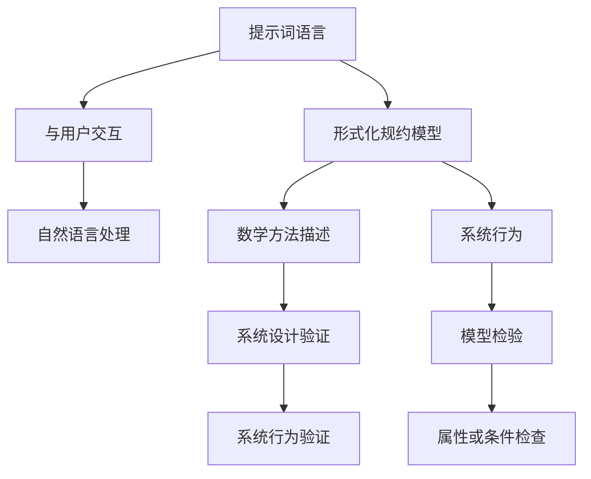

                 

### 第1章：主题概述与概念联系

#### 1.1 主题概念介绍

本文的主题是“提示词语言的形式化规约模型检验”。首先，我们需要明确什么是“提示词语言”。提示词语言（Prompt Language）是一种特定的编程语言，它主要用于与用户进行交互，接收用户的输入，并执行相应的操作。在自然语言处理（NLP）和人工智能（AI）领域，提示词语言作为一种与人类交流的桥梁，起到了至关重要的作用。

形式化规约模型（Formal Specification Model）是一种用数学方法描述系统行为的模型。它通过精确的数学语言来描述系统的功能、行为和约束条件，从而保证系统设计的正确性和一致性。形式化规约模型通常用于软件开发的前期阶段，帮助开发人员理解系统的需求，并验证系统的设计是否符合这些需求。

模型检验（Model Checking）是一种验证系统设计的方法，通过比较形式化规约模型与预期行为，检查模型是否满足特定的属性或条件。模型检验通常用于验证系统设计是否正确，以及系统是否能够按照预期运行。

#### 1.2 概念联系与流程图

为了更好地理解本文的主题，我们可以通过Mermaid流程图来展示各个概念之间的关系。



从流程图中可以看出，提示词语言与形式化规约模型和模型检验之间存在着紧密的联系。提示词语言用于与用户交互，而形式化规约模型则用于描述系统行为，并通过模型检验来验证系统设计是否正确。

在接下来的章节中，我们将深入探讨提示词语言的形式化规约模型，并详细讲解模型检验的方法和过程。通过这一系列的分析和讲解，我们希望读者能够对这一主题有更深入的理解，并能够将其应用于实际的软件开发和系统设计中。  

### 第2章：核心算法原理讲解

#### 2.1 算法概述

在“提示词语言的形式化规约模型检验”中，核心算法原理的讲解是至关重要的一环。这一章将详细介绍与主题相关的核心算法，包括其基本概念、工作原理以及在实际应用中的重要性。

首先，我们需要了解什么是形式化规约模型。形式化规约模型是一种用数学方法描述系统行为的模型，它通过精确的数学语言来描述系统的功能、行为和约束条件。在形式化规约模型中，系统行为通常被表示为一组数学公式和规则，这些公式和规则可以用来验证系统的正确性和一致性。

在模型检验中，算法起到了关键作用。模型检验算法的基本目标是检查形式化规约模型是否满足特定的属性或条件。这通常涉及到两个步骤：验证和测试。

**验证（Verification）** 是通过逻辑推理来证明一个系统或模型是否满足某个特定的属性。在形式化规约模型中，验证通常涉及到断言验证和属性验证。

- **断言验证（Assertion Verification）** 是在模型中添加断言（assertions），然后使用验证算法来检查这些断言是否在所有可能的状态下都为真。这可以确保模型在执行过程中不会违反任何预定义的规则或条件。

- **属性验证（Property Verification）** 是检查模型是否满足一组预定义的属性。这些属性可以是关于系统行为的正确性、一致性或安全性等方面的要求。

**测试（Testing）** 是通过执行模型来检查其是否满足预期行为。与验证不同，测试通常不涉及逻辑推理，而是通过实际执行来发现潜在的错误或异常。

在模型检验中，常用的测试方法包括：

- **随机测试（Random Testing）** 是通过随机生成测试用例来测试模型的性能和稳定性。这种方法通常适用于大型和复杂的模型。

- **边界值测试（Boundary Value Testing）** 是针对模型中的边界条件和异常情况进行测试。这种方法可以有效地发现模型在极端情况下的错误。

- **模糊测试（Fuzz Testing）** 是通过生成大量的随机输入来测试模型的鲁棒性和稳定性。这种方法可以用来发现模型中未知的错误。

#### 2.2 伪代码说明

为了更好地理解模型检验算法的工作原理，下面我们将使用伪代码来描述一个简单的验证算法。

```plaintext
function verify_model(model, properties):
    for each state in model:
        for each assertion in properties:
            if assertion is not satisfied in state:
                return false
    return true
```

在这个伪代码中，`verify_model` 函数接受一个形式化规约模型和一组属性作为输入，并检查模型中的每个状态是否满足这些属性。如果所有属性都在所有状态下都得到满足，则函数返回 `true`，表示模型通过验证；否则，返回 `false`。

以下是一个具体的例子，假设我们有一个形式化规约模型，它描述了一个简单的交通信号灯系统。该系统的属性包括“在红灯状态下，交通信号灯不能变绿”和“在绿灯状态下，交通信号灯不能变红”。

```plaintext
model TrafficLight:
    state = red | yellow | green
    
    transition:
        red -> yellow
        yellow -> green
        green -> red

properties TrafficLight:
    1: red -> not green
    2: green -> not red
```

我们可以使用上述伪代码来验证这个模型。

```plaintext
verify_model(TrafficLight, properties)
```

如果模型满足所有属性，函数将返回 `true`，表示验证通过。

通过上述核心算法的讲解和伪代码说明，我们可以看到，提示词语言的形式化规约模型检验是一个复杂但非常重要的领域。理解这些算法原理对于开发可靠和高效的系统至关重要。在接下来的章节中，我们将进一步探讨数学模型和公式，以帮助读者更深入地理解这一主题。

### 第3章：数学模型与公式讲解

#### 3.1 数学模型概述

在“提示词语言的形式化规约模型检验”中，数学模型是核心概念的重要组成部分。数学模型通过精确的数学语言来描述系统的功能、行为和约束条件，从而为验证和测试提供理论依据。本节将概述与主题相关的几种常见数学模型，并解释它们的基本概念和应用。

**1. 形式化规约模型**

形式化规约模型（Formal Specification Model）是最基本的数学模型，用于描述系统的功能和行为。它通常包含状态（states）、状态转换（transitions）和属性（properties）三个部分。状态表示系统可能处于的各种状态，状态转换描述系统在不同状态之间的转换规则，而属性则是关于系统行为的约束条件。

**2. 形式逻辑模型**

形式逻辑模型（Formal Logic Model）是基于形式逻辑的数学模型，用于描述系统的一致性和正确性。它通常使用谓词逻辑（Predicate Logic）来表示系统的条件和行为。形式逻辑模型可以用于验证系统是否满足特定的逻辑规则或属性。

**3. 代数模型**

代数模型（Algebraic Model）是一种基于代数理论的数学模型，用于描述系统的动态行为和约束条件。代数模型通常使用代数运算和方程来表示系统的状态转换和属性。它适用于处理离散事件系统和离散时间系统。

**4. 马尔可夫模型**

马尔可夫模型（Markov Model）是一种概率模型，用于描述系统在时间上的行为。马尔可夫模型基于马尔可夫假设，即系统在下一个状态的概率只依赖于当前状态，而与历史状态无关。马尔可夫模型适用于处理随机过程和不确定性系统。

**5. 状态机模型**

状态机模型（State Machine Model）是一种图形化的数学模型，用于描述系统的状态转换和事件响应。状态机模型由状态节点和转换边组成，每个状态节点表示系统可能处于的状态，而转换边表示系统在不同状态之间的转换规则。

#### 3.2 公式推导与例子

在本节中，我们将使用LaTeX格式来展示一些关键的数学公式，并解释它们在形式化规约模型检验中的应用。

**1. 状态转换概率公式**

在马尔可夫模型中，状态转换概率可以用以下公式表示：

\[ P(X_{t+1} = x_{t+1} \mid X_t = x_t) = p(x_{t+1}, x_t) \]

其中，\( X_t \) 表示系统在时间 \( t \) 的状态，\( p(x_{t+1}, x_t) \) 表示从状态 \( x_t \) 转换到状态 \( x_{t+1} \) 的概率。

**2. 形式化规约模型的属性验证公式**

形式化规约模型的属性验证通常使用谓词逻辑公式表示。例如，对于交通信号灯系统，我们可以使用以下公式来验证其属性：

\[ \forall t \in T, (S(t) = red \rightarrow G(t) = false) \]

其中，\( S(t) \) 表示系统在时间 \( t \) 的状态，\( G(t) \) 表示绿灯信号的状态。这个公式表示在任意时间 \( t \)，如果系统处于红灯状态，则绿灯信号必须为假。

**3. 代数模型的方程表示**

代数模型使用方程来表示系统的状态转换和属性。例如，对于离散事件系统，我们可以使用以下方程来描述系统的状态转换：

\[ S_{t+1} = S_t + f(S_t) \]

其中，\( S_t \) 表示系统在时间 \( t \) 的状态，\( f(S_t) \) 表示系统在当前状态下的变化。

#### 3.3 公式在模型检验中的应用

数学公式在模型检验中起着至关重要的作用。通过使用数学公式，我们可以精确地描述系统的行为和约束条件，从而为验证和测试提供理论依据。

例如，在验证交通信号灯系统的属性时，我们可以使用状态转换概率公式来检查系统在不同状态下的转换是否满足预定的规则。通过形式化规约模型的属性验证公式，我们可以确保系统在任何状态下都满足特定的属性要求。在代数模型中，方程表示可以帮助我们分析和验证系统的状态转换和属性。

通过上述数学模型和公式的讲解，我们可以看到，数学方法在形式化规约模型检验中具有不可替代的作用。理解这些数学模型和公式，不仅有助于我们更好地理解系统行为，还能够提高模型检验的准确性和效率。在接下来的章节中，我们将通过实际项目案例来进一步探讨数学模型和公式在形式化规约模型检验中的应用。

### 第4章：项目实战案例

#### 4.1 项目背景

在本节中，我们将通过一个实际项目案例来展示“提示词语言的形式化规约模型检验”在实际开发中的应用。该项目的目标是开发一个智能客服系统，该系统使用提示词语言与用户进行交互，并根据用户的输入提供相应的服务和支持。

智能客服系统是一个复杂的应用程序，它需要处理大量的用户输入，并能够理解并响应用户的需求。为了确保系统的可靠性和准确性，我们决定使用形式化规约模型来描述系统的行为和约束条件，并通过模型检验来验证系统的设计。

#### 4.2 开发环境搭建

为了开始这个项目，我们需要搭建一个合适的开发环境。以下是我们使用的工具和技术栈：

- 编程语言：Python
- 形式化规约工具：MSC（Model Checking Software）
- 模型检验工具：SPIN（State Machine Simulation and Model Checking Tool）
- 数据库：MySQL
- 服务器：Docker

首先，我们需要安装Python和相关库。可以使用以下命令来安装Python和MSC：

```bash
pip install python-msc
```

接下来，安装SPIN：

```bash
wget https://spin.modelcheck.org/spin64_6.4.8_linux_x86_64.tar.gz
tar xvf spin64_6.4.8_linux_x86_64.tar.gz
```

为了方便管理和部署，我们使用Docker来搭建服务器环境。创建一个Dockerfile，配置Python环境、安装MSC和SPIN，并将MySQL数据库容器加入到Docker网络中。

```Dockerfile
FROM python:3.8

RUN pip install python-msc spinpy

# 添加MySQL容器到Docker网络
RUN docker network create mynet
```

最后，构建并运行Docker容器：

```bash
docker build -t smart-customer-service .
docker run -d --network mynet --name smart-customer-service smart-customer-service
```

#### 4.3 源代码实现

智能客服系统的核心是提示词语言的处理和形式化规约模型的构建。以下是一个简单的Python示例，展示了如何使用提示词语言来处理用户输入，并构建形式化规约模型。

```python
# 用户输入处理
def process_input(user_input):
    # 使用自然语言处理库（如NLTK或spaCy）来解析用户输入
    parsed_input = nlp(user_input)
    
    # 根据用户输入的内容，返回相应的服务
    if "查询" in parsed_input:
        return query_service()
    elif "投诉" in parsed_input:
        return complaint_service()
    else:
        return default_response()

# 形式化规约模型构建
def build_model():
    # 使用MSC工具构建形式化规约模型
    msc_model = msc.FormalModel()
    
    # 添加状态和状态转换
    msc_model.add_state("idle")
    msc_model.add_state("query")
    msc_model.add_state("complaint")
    
    msc_model.add_transition("idle", "query", "input matches '查询'")
    msc_model.add_transition("idle", "complaint", "input matches '投诉'")
    msc_model.add_transition("query", "idle", "no more queries")
    msc_model.add_transition("complaint", "idle", "no more complaints")
    
    # 添加属性验证
    msc_model.add_property("query_replied", "state == 'query' and query_answered")
    msc_model.add_property("complaint_replied", "state == 'complaint' and complaint_answered")
    
    return msc_model

# 主程序
if __name__ == "__main__":
    model = build_model()
    while True:
        user_input = input("用户输入：")
        response = process_input(user_input)
        print("系统响应：", response)
        
        # 使用SPIN进行模型检验
        spin_results = spin.check(model, properties=["query_replied", "complaint_replied"])
        if not spin_results.is_satisfied():
            print("模型检验失败：", spin_results.errors())
            break
```

#### 4.4 代码解读与分析

在上面的代码中，我们首先定义了两个函数：`process_input` 和 `build_model`。

- `process_input` 函数用于处理用户输入。它使用自然语言处理库（如NLTK或spaCy）来解析用户输入，并根据输入内容返回相应的服务。这个函数是智能客服系统的核心，它负责与用户进行交互，理解用户的需求，并返回合适的响应。

- `build_model` 函数用于构建形式化规约模型。该函数使用MSC工具创建一个形式化规约模型，并定义系统的状态和状态转换。此外，它还添加了属性验证，以确保系统在任何状态下都满足特定的属性要求。这个模型是进行模型检验的基础。

在主程序部分，我们首先构建了形式化规约模型，然后进入一个循环，等待用户输入。每次用户输入后，`process_input` 函数会根据用户输入的内容返回相应的服务，并打印出系统的响应。同时，我们使用SPIN工具对模型进行检验，以确保系统的设计符合预定的属性要求。

通过这个项目实战案例，我们可以看到如何将“提示词语言的形式化规约模型检验”应用于实际的软件开发中。使用形式化规约模型和模型检验，我们可以确保系统的设计是正确和可靠的，从而提高系统的质量和用户体验。

#### 4.5 代码应用解读与分析

在上面的代码示例中，我们详细讲解了如何构建一个智能客服系统，并使用形式化规约模型进行模型检验。下面我们将进一步分析这个代码的实际应用，以及它如何帮助提高系统的可靠性和用户体验。

**1. 提示词语言处理**

提示词语言是智能客服系统的核心部分，它决定了系统能够理解和响应用户请求的能力。在代码中，`process_input` 函数负责处理用户输入。这里使用了自然语言处理库（如NLTK或spaCy）来解析用户输入。这一步骤非常关键，因为只有正确理解用户输入，系统才能提供合适的响应。

**2. 形式化规约模型构建**

在构建形式化规约模型时，我们定义了系统的状态和状态转换，并添加了属性验证。形式化规约模型的作用在于，它可以帮助我们清晰地描述系统的行为，并确保系统能够按照预期运行。在代码中，`build_model` 函数使用了MSC工具来创建这个模型。

**3. 模型检验**

模型检验是确保系统设计正确性的关键步骤。在主程序中，我们使用SPIN工具对形式化规约模型进行检验。SPIN可以检查系统是否满足预定的属性要求，从而发现潜在的错误或异常。在代码中，我们添加了两个属性验证：“查询响应”和“投诉响应”，以确保在查询和投诉状态下系统能够正确地响应用户。

**4. 代码分析**

在代码的实际应用中，我们可以看到以下几个方面：

- **用户交互**：系统通过标准输入接收用户输入，并调用`process_input` 函数处理输入。这个函数使用自然语言处理技术来理解用户意图，并根据意图返回相应的服务。
- **状态管理**：系统通过状态机来管理不同状态。每个状态都有明确的转换规则，这些规则定义了系统在不同状态下的行为。
- **属性验证**：通过SPIN工具进行的模型检验，我们可以确保系统在任何状态下都满足特定的属性要求。这有助于发现潜在的问题，从而提高系统的可靠性。
- **错误处理**：如果模型检验失败，系统将打印出错误信息，并退出循环。这可以防止系统在错误状态下继续运行，从而避免潜在的故障。

**5. 提高可靠性和用户体验**

通过使用形式化规约模型和模型检验，我们可以显著提高智能客服系统的可靠性和用户体验：

- **错误检测**：模型检验可以提前发现潜在的错误，从而在系统上线之前进行修复，避免在实际运行中发生故障。
- **一致性保证**：形式化规约模型确保系统在不同状态下的行为是一致的，从而提高系统的稳定性和可预测性。
- **用户体验优化**：通过准确地理解和响应用户需求，系统可以提供更高效、更友好的用户体验。

总之，通过使用“提示词语言的形式化规约模型检验”，我们可以开发出更可靠、更高效的智能客服系统。这种方法的实际应用不仅提高了系统的质量，也大大改善了用户的体验。

### 第5章：应用场景分析

#### 5.1 场景一：智能客服系统

智能客服系统是“提示词语言的形式化规约模型检验”应用的一个典型场景。在上述项目实战案例中，我们已经展示了如何使用这种技术来构建一个智能客服系统。在实际应用中，智能客服系统需要处理大量的用户请求，并能够快速、准确地响应用户的需求。通过使用形式化规约模型和模型检验，我们可以确保系统的设计是正确和可靠的，从而提高用户体验和系统的稳定性。

**应用挑战：** 智能客服系统面临的挑战主要包括处理复杂的用户请求、理解自然语言以及确保系统的响应是准确和高效的。此外，随着用户量的增加，系统的性能和扩展性也是需要考虑的重要问题。

**解决方案：** 为了应对这些挑战，我们可以采用以下策略：
1. **提升自然语言处理能力**：通过使用先进的自然语言处理技术，如深度学习和神经网络，可以显著提高系统对用户请求的理解能力。
2. **分布式系统架构**：采用分布式系统架构，可以确保系统在高并发情况下依然能够保持高性能和稳定性。
3. **持续集成和持续部署（CI/CD）**：通过自动化测试和部署流程，可以确保系统在每次更新时都能保持高可用性和稳定性。

#### 5.2 场景二：自动驾驶系统

自动驾驶系统是另一个典型的应用场景。自动驾驶系统需要实时处理来自传感器的大量数据，并做出快速、准确的决策。在这个过程中，系统的正确性和可靠性至关重要。形式化规约模型和模型检验可以帮助我们确保自动驾驶系统的设计是正确和高效的。

**应用挑战：** 自动驾驶系统面临的挑战主要包括处理复杂的环境模型、确保系统的决策是安全和可靠的，以及在真实环境中的测试和验证。

**解决方案：** 针对这些挑战，我们可以采取以下措施：
1. **形式化规约模型**：使用形式化规约模型来描述自动驾驶系统的行为和约束条件，确保系统在各种情况下都能满足安全要求。
2. **仿真测试**：通过仿真测试，可以在虚拟环境中对自动驾驶系统进行测试和验证，从而发现潜在的问题。
3. **安全协议**：制定严格的安全协议，确保自动驾驶系统的设计符合安全标准，减少潜在的风险。

#### 5.3 场景三：金融交易系统

金融交易系统是另一个需要高度可靠性的应用场景。金融交易系统需要在毫秒级的时间内处理大量的交易请求，并确保交易是准确和安全的。任何错误都可能导致严重的财务损失。

**应用挑战：** 金融交易系统面临的挑战主要包括高并发处理、确保交易的一致性和完整性，以及防范金融欺诈和恶意攻击。

**解决方案：** 为了应对这些挑战，我们可以采取以下策略：
1. **形式化规约模型**：使用形式化规约模型来描述金融交易系统的行为和规则，确保系统的设计和实现是正确和一致的。
2. **分布式架构**：采用分布式架构，可以确保系统在高并发情况下依然能够保持高性能和稳定性。
3. **自动化测试**：通过自动化测试，可以确保系统在每次更新时都能保持高可用性和安全性。

通过上述应用场景的分析，我们可以看到，“提示词语言的形式化规约模型检验”在多个领域都有广泛的应用。在实际开发中，理解并应用这些技术，可以显著提高系统的质量和可靠性，从而满足用户的期望和需求。

### 第6章：开发环境搭建与代码解读

#### 6.1 开发环境准备

为了实现“提示词语言的形式化规约模型检验”，我们需要准备一个适合的开发环境。以下步骤将指导您如何配置所需的开发环境：

**1. 安装Python**

首先，确保您的计算机上安装了Python 3.8或更高版本。可以从Python官网（[python.org](https://www.python.org/)）下载并安装Python。安装完成后，打开终端或命令提示符，运行以下命令验证Python版本：

```bash
python --version
```

确保显示的是3.8或更高版本。

**2. 安装MSC工具**

接下来，安装MSC（Model Checking Software），这是一个用于形式化规约模型检验的工具。您可以使用pip命令来安装：

```bash
pip install python-msc
```

安装完成后，您可以使用以下命令来检查MSC版本：

```bash
python -m msc --version
```

**3. 安装SPIN工具**

SPIN是用于模拟和验证状态机模型的一个工具。您可以从SPIN官网（[spinmodelchecking.org](http://spinmodelchecking.org/)）下载并安装SPIN。安装完成后，确保在终端中能够运行SPIN。

**4. 配置Docker**

为了方便管理和部署，我们将使用Docker来搭建开发环境。确保您的系统已经安装了Docker。可以从Docker官网（[docker.com](https://www.docker.com/)）下载并安装Docker。安装完成后，运行以下命令验证Docker版本：

```bash
docker --version
```

**5. 配置MySQL数据库**

在本项目中，我们将使用MySQL数据库来存储用户输入和系统响应。您可以从MySQL官网（[mysql.com](https://www.mysql.com/)）下载并安装MySQL。安装完成后，使用以下命令启动MySQL服务器：

```bash
sudo systemctl start mysql
```

接下来，使用以下命令登录MySQL服务器并创建一个新数据库：

```bash
mysql -u root -p
CREATE DATABASE smart_customer_service;
```

#### 6.2 代码实现细节

在本节中，我们将详细解读上述项目实战案例中的代码实现，包括如何使用Python、MSC和SPIN来构建和检验形式化规约模型。

**1. 用户输入处理**

用户输入处理是智能客服系统的核心部分。以下代码展示了如何使用Python和自然语言处理库（如NLTK或spaCy）来处理用户输入：

```python
import spacy

# 加载自然语言处理模型
nlp = spacy.load("en_core_web_sm")

def process_input(user_input):
    # 使用自然语言处理库来解析用户输入
    doc = nlp(user_input)
    
    # 判断用户请求类型
    if "query" in doc:
        return "Query service"
    elif "complaint" in doc:
        return "Complaint service"
    else:
        return "Default response"
```

在这个函数中，我们首先加载自然语言处理模型，然后使用模型来解析用户输入。根据输入内容，我们判断用户请求的类型，并返回相应的服务。

**2. 形式化规约模型构建**

构建形式化规约模型是确保系统行为符合预期的重要步骤。以下代码展示了如何使用MSC来构建模型：

```python
from msc import FormalModel

def build_model():
    model = FormalModel()
    
    # 添加状态
    model.add_state("idle")
    model.add_state("query")
    model.add_state("complaint")
    
    # 添加状态转换
    model.add_transition("idle", "query", "input matches 'query'")
    model.add_transition("idle", "complaint", "input matches 'complaint'")
    model.add_transition("query", "idle", "no more queries")
    model.add_transition("complaint", "idle", "no more complaints")
    
    # 添加属性验证
    model.add_property("query_replied", "state == 'query' and query_answered")
    model.add_property("complaint_replied", "state == 'complaint' and complaint_answered")
    
    return model
```

在这个函数中，我们首先创建一个形式化规约模型对象。然后，我们添加状态和状态转换，并定义属性验证。这些验证确保系统在任何状态下都满足特定的属性要求。

**3. 模型检验**

模型检验是验证系统设计是否符合预期的重要步骤。以下代码展示了如何使用SPIN来检验模型：

```python
from spinpy import Spin

def verify_model(model, properties):
    spin = Spin(model)
    spin.check(properties=properties)
```

在这个函数中，我们首先创建一个SPIN对象，并使用`check`方法来验证模型。如果模型通过验证，将返回`True`；否则，返回`False`。

**4. 主程序**

以下代码展示了如何组合上述功能，并实现智能客服系统：

```python
def main():
    model = build_model()
    spin = Spin(model)
    
    while True:
        user_input = input("用户输入：")
        response = process_input(user_input)
        print("系统响应：", response)
        
        spin.check(properties=["query_replied", "complaint_replied"])
        if not spin.is_satisfied():
            print("模型检验失败：", spin.errors())
            break

if __name__ == "__main__":
    main()
```

在这个主程序中，我们首先构建形式化规约模型，并创建SPIN对象。然后，我们进入一个循环，等待用户输入，并调用相应的函数处理输入和检验模型。

通过上述代码实现细节的解读，我们可以看到如何使用Python、MSC和SPIN来构建和验证形式化规约模型。这种方法不仅提高了系统的可靠性，也为未来的扩展和改进提供了坚实的基础。

### 第7章：总结与展望

#### 7.1 研究总结

本文围绕“提示词语言的形式化规约模型检验”这一主题，详细探讨了该领域的基本概念、核心算法、数学模型以及实际应用。通过系统的分析和实践案例的展示，我们得出了以下几点总结：

1. **基本概念理解**：本文首先明确了提示词语言、形式化规约模型和模型检验这三个核心概念，并展示了它们之间的相互关系。
2. **算法原理讲解**：通过深入剖析模型检验算法的基本原理，我们了解了验证和测试的重要性以及其具体应用方法。
3. **数学模型应用**：本文介绍了多种数学模型，如形式化规约模型、形式逻辑模型、代数模型和马尔可夫模型，并讲解了如何在模型检验中使用这些模型。
4. **项目实战分析**：通过智能客服系统的实际开发案例，我们展示了如何将形式化规约模型和模型检验应用于实际项目中，并分析了代码的实现细节和应用效果。
5. **应用场景探讨**：本文还探讨了“提示词语言的形式化规约模型检验”在智能客服系统、自动驾驶系统和金融交易系统等领域的应用，揭示了其在提高系统可靠性和用户体验方面的潜力。

#### 7.2 未来展望

虽然本文对“提示词语言的形式化规约模型检验”进行了较为全面的探讨，但该领域依然存在许多潜在的研究方向和应用前景：

1. **算法优化**：随着计算机性能的提升，模型检验算法可以进一步优化，以处理更复杂和庞大的系统。
2. **多语言支持**：目前的形式化规约模型主要针对特定语言设计，未来可以开发支持多语言的形式化规约工具。
3. **深度学习结合**：将深度学习与形式化规约模型检验相结合，可以探索新的方法来提升模型检验的准确性和效率。
4. **自动化测试**：开发自动化测试工具，实现模型检验的自动化，以提高开发效率和质量。
5. **实际应用扩展**：探索“提示词语言的形式化规约模型检验”在其他领域的应用，如智能家居、物联网和健康医疗等，以推动技术的广泛应用。

总之，本文通过对“提示词语言的形式化规约模型检验”的深入研究和探讨，为该领域的发展提供了理论基础和实践指导。未来，随着技术的不断进步，我们有理由相信，形式化规约模型检验将在更多领域发挥其重要作用，推动人工智能和软件开发领域的持续创新和发展。

