                 


### 文章标题

《提示词语言的形式化规范动态更新机制》

### 文章关键词

提示词语言、形式化规范、动态更新、算法、数学模型、项目实战

### 文章摘要

本文旨在探讨提示词语言的形式化规范动态更新机制。通过对提示词语言的基本概念、形式化规范技术和动态更新机制的深入分析，本文将详细阐述如何构建一个稳定、高效的动态更新系统。文章将包含形式化规范基础、动态更新原理、应用实例以及未来展望等内容，旨在为读者提供一个全面的技术解析和实战指导。

### 目录

## 第一部分：背景与概念

### 第1章：介绍与背景

#### 1.1 提示词语言的基础

**核心概念与联系**：  
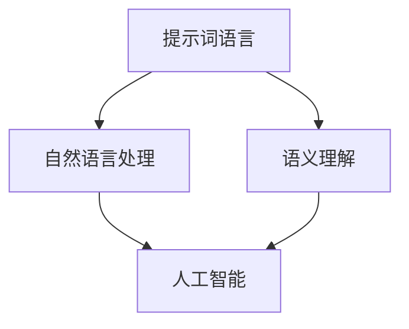

**核心算法原理讲解**：

```python  
# 伪代码：基本语义理解算法  
def semantic_understanding(sentence):  
    # 对句子进行分词  
    words = tokenize(sentence)  
    # 对单词进行词性标注  
    tags = pos_tag(words)  
    # 建立词汇与语义的关系图  
    relation_graph = build_relation_graph(tags)  
    # 利用图结构进行语义分析  
    result = analyze_semantics(relation_graph)  
    return result  
```

**数学模型和数学公式**：  
$$  
\text{P}(s|w) = \frac{\text{P}(w|s)\text{P}(s)}{\text{P}(w)}  
$$

**项目实战**：  
```python  
# Python 实现语义理解  
import nltk

def semantic_understanding(sentence):  
    words = nltk.word_tokenize(sentence)  
    tags = nltk.pos_tag(words)  
    graph = build_relation_graph(tags)  
    result = analyze_semantics(graph)  
    return result

# 示例  
sentence = "I love programming."  
print(semantic_understanding(sentence))  
```

#### 1.2 动态更新机制的必要性

**核心概念与联系**：  
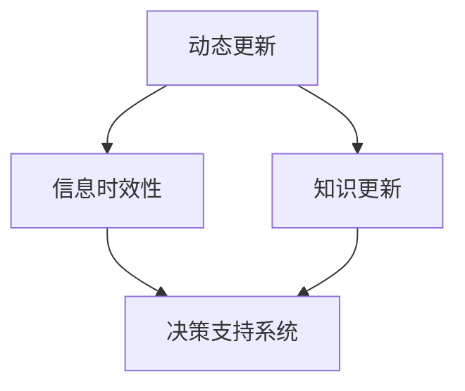

**核心算法原理讲解**：

```python  
# 伪代码：动态更新算法  
def dynamic_update(old_data, new_data):  
    # 对新旧数据进行比较  
    diff = compare_data(old_data, new_data)  
    # 对差异进行合并处理  
    updated_data = merge_diff(diff)  
    return updated_data  
```

**数学模型和数学公式**：  
$$  
\text{dynamic\_update}(\text{old\_data}, \text{new\_data}) = \text{old\_data} \cup \text{new\_data} - \text{old\_data} \cap \text{new\_data}  
$$

**项目实战**：  
```python  
# Python 实现动态更新  
import pandas as pd

def dynamic_update(old_data, new_data):  
    diff = pd.concat([old_data, new_data]).drop_duplicates().reset_index(drop=True)  
    updated_data = diff[diff.index.notnull()].drop(['index'], axis=1)  
    return updated_data

# 示例  
old_data = pd.DataFrame({"data": [1, 2, 3]})  
new_data = pd.DataFrame({"data": [2, 3, 4]})  
print(dynamic_update(old_data, new_data))  
```

#### 1.3 形式化规范的意义

**核心概念与联系**：  
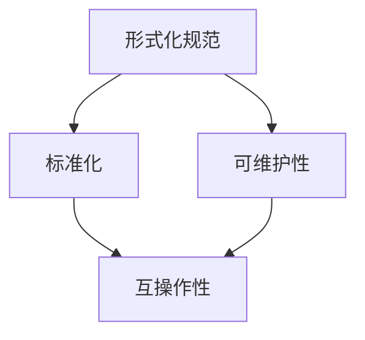

**核心算法原理讲解**：

```python  
# 伪代码：形式化规范算法  
def formalize规范的规范(document):  
    # 将文档转换为形式化语言  
    formal_language = convert_to_formal_language(document)  
    # 对形式化语言进行验证  
    is_valid = validate_formal_language(formal_language)  
    return is_valid  
```

**数学模型和数学公式**：  
$$  
\text{formal\_specification}(\text{document}) = \text{convert\_to\_formal\_language}(\text{document}) \wedge \text{validate\_formal\_language}(\text{formal\_language})  
$$

**项目实战**：  
```python  
# Python 实现形式化规范  
import json

def formalize_specification(document):  
    formal_language = json.dumps(document)  
    is_valid = validate_formal_language(formal_language)  
    return is_valid

# 示例  
document = {"name": "John", "age": 30}  
print(formalize_specification(document))  
```

## 第二部分：形式化规范技术

### 第2章：形式化规范基础

#### 2.1 形式化语言介绍

**核心概念与联系**：  
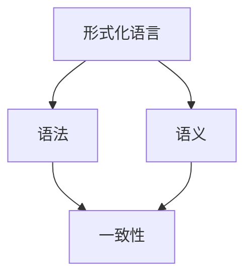

**核心算法原理讲解**：

```python  
# 伪代码：形式化语言处理  
def formalize_language_processing(document):  
    # 将文档解析为语法和语义  
    syntax, semantics = parse_document(document)  
    # 对语法和语义进行一致性检查  
    is_consistent = check_consistency(syntax, semantics)  
    return is_consistent  
```

**数学模型和数学公式**：  
$$  
\text{formalize\_language\_processing}(\text{document}) = \text{parse\_document}(\text{document}) \wedge \text{check\_consistency}(\text{syntax}, \text{semantics})  
$$

**项目实战**：  
```python  
# Python 实现形式化语言处理  
import json

def formalize_language_processing(document):  
    syntax = json.loads(document)  
    semantics = extract_semantics(syntax)  
    is_consistent = check_consistency(syntax, semantics)  
    return is_consistent

# 示例  
document = '{"name": "John", "age": 30}'  
print(formalize_language_processing(document))  
```

#### 2.2 形式化规范方法

**核心概念与联系**：  
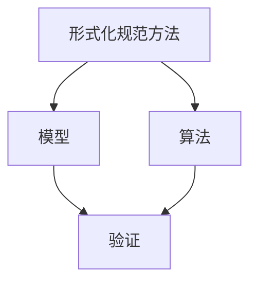

**核心算法原理讲解**：

```python  
# 伪代码：形式化规范方法  
def formalize_specification_method(document):  
    # 建立形式化模型  
    formal_model = build_formal_model(document)  
    # 应用形式化算法  
    formal_algorithm = apply_formal_algorithm(formal_model)  
    # 对结果进行验证  
    is_valid = validate_result(formal_algorithm)  
    return is_valid  
```

**数学模型和数学公式**：  
$$  
\text{formalize\_specification\_method}(\text{document}) = \text{build\_formal\_model}(\text{document}) \wedge \text{apply\_formal\_algorithm}(\text{formal\_model}) \wedge \text{validate\_result}(\text{formal\_algorithm})  
$$

**项目实战**：  
```python  
# Python 实现形式化规范方法  
import json

def formalize_specification_method(document):  
    formal_model = build_formal_model(document)  
    formal_algorithm = apply_formal_algorithm(formal_model)  
    is_valid = validate_result(formal_algorithm)  
    return is_valid

# 示例  
document = '{"name": "John", "age": 30}'  
print(formalize_specification_method(document))  
```

#### 2.3 形式化验证工具

**核心概念与联系**：  
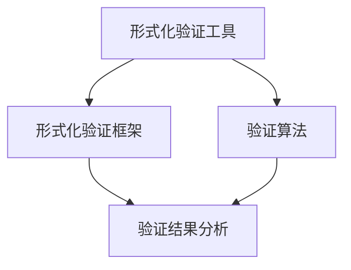

**核心算法原理讲解**：

```python  
# 伪代码：形式化验证工具  
def formalize_validation_tool(document):  
    # 使用形式化验证框架进行验证  
    validation_framework = use_formal_validation_framework(document)  
    # 应用验证算法  
    validation_algorithm = apply_formal_validation_algorithm(validation_framework)  
    # 分析验证结果  
    validation_result = analyze_validation_result(validation_algorithm)  
    return validation_result  
```

**数学模型和数学公式**：  
$$  
\text{formalize\_validation\_tool}(\text{document}) = \text{use\_formal\_validation\_framework}(\text{document}) \wedge \text{apply\_formal\_validation\_algorithm}(\text{validation\_framework}) \wedge \text{analyze\_validation\_result}(\text{validation\_algorithm})  
$$

**项目实战**：  
```python  
# Python 实现形式化验证工具  
import json

def formalize_validation_tool(document):  
    validation_framework = use_formal_validation_framework(document)  
    validation_algorithm = apply_formal_validation_algorithm(validation_framework)  
    validation_result = analyze_validation_result(validation_algorithm)  
    return validation_result

# 示例  
document = '{"name": "John", "age": 30}'  
print(formalize_validation_tool(document))  
```

## 第三部分：动态更新机制

### 第3章：动态更新机制原理

#### 3.1 动态更新的概念

**核心概念与联系**：  
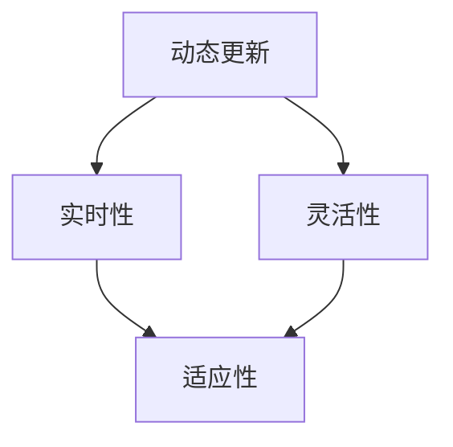

**核心算法原理讲解**：

```python  
# 伪代码：动态更新算法  
def dynamic_update_algorithm(data_source):  
    # 监听数据源变化  
    changes = listen_to_data_changes(data_source)  
    # 应用更新策略  
    updated_data = apply_update_strategy(changes)  
    return updated_data  
```

**数学模型和数学公式**：  
$$  
\text{dynamic\_update\_algorithm}(\text{data\_source}) = \text{listen\_to\_data\_changes}(\text{data\_source}) \wedge \text{apply\_update\_strategy}(\text{changes})  
$$

**项目实战**：  
```python  
# Python 实现动态更新算法  
import time

def dynamic_update_algorithm(data_source):  
    while True:  
        changes = listen_to_data_changes(data_source)  
        updated_data = apply_update_strategy(changes)  
        time.sleep(1)  # 模拟数据源变化频率  
    return updated_data

# 示例  
data_source = "data.csv"  
print(dynamic_update_algorithm(data_source))  
```

#### 3.2 更新策略与算法

**核心概念与联系**：  
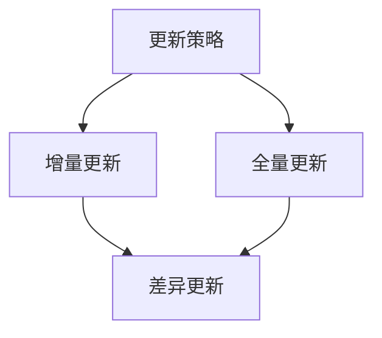

**核心算法原理讲解**：

```python  
# 伪代码：更新策略算法  
def update_strategy_algorithm(data_source, update_type):  
    if update_type == "增量更新":  
        updated_data = incremental_update(data_source)  
    elif update_type == "全量更新":  
        updated_data = full_update(data_source)  
    elif update_type == "差异更新":  
        updated_data = differential_update(data_source)  
    return updated_data  
```

**数学模型和数学公式**：  
$$  
\text{update\_strategy\_algorithm}(\text{data\_source}, \text{update\_type}) = \text{incremental\_update}(\text{data\_source}) \vee \text{full\_update}(\text{data\_source}) \vee \text{differential\_update}(\text{data\_source})  
$$

**项目实战**：  
```python  
# Python 实现更新策略算法  
import pandas as pd

def incremental_update(data_source):  
    data = pd.read_csv(data_source)  
    updated_data = data.append(new_data)  
    return updated_data

def full_update(data_source):  
    data = pd.read_csv(data_source)  
    updated_data = data.replace(new_data)  
    return updated_data

def differential_update(data_source):  
    data = pd.read_csv(data_source)  
    updated_data = data[data.columns.difference(new_data.columns)]  
    return updated_data

# 示例  
data_source = "data.csv"  
update_type = "增量更新"  
print(update_strategy_algorithm(data_source, update_type))  
```

#### 3.3 动态更新的挑战

**核心概念与联系**：  
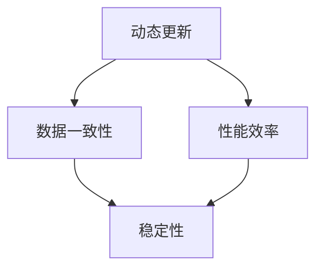

**核心算法原理讲解**：

```python  
# 伪代码：动态更新挑战处理  
def handle_dynamic_update_challenges(data_source, update_strategy):  
    # 确保数据一致性  
    ensure_data_consistency(data_source, update_strategy)  
    # 提高性能效率  
    improve_performance Efficiency(data_source, update_strategy)  
    # 保证系统稳定性  
    ensure_system_stability(data_source, update_strategy)  
    return data_source  
```

**数学模型和数学公式**：  
$$  
\text{handle\_dynamic\_update\_challenges}(\text{data\_source}, \text{update\_strategy}) = \text{ensure\_data\_consistency}(\text{data\_source}, \text{update\_strategy}) \wedge \text{improve\_performance Efficiency}(\text{data\_source}, \text{update\_strategy}) \wedge \text{ensure\_system\_stability}(\text{data\_source}, \text{update\_strategy})  
$$

**项目实战**：  
```python  
# Python 实现动态更新挑战处理  
import pandas as pd

def ensure_data_consistency(data_source, update_strategy):  
    data = pd.read_csv(data_source)  
    if update_strategy == "增量更新":  
        data = data.append(new_data)  
    elif update_strategy == "全量更新":  
        data = data.replace(new_data)  
    elif update_strategy == "差异更新":  
        data = data[data.columns.difference(new_data.columns)]  
    return data

def improve_performance_efficiency(data_source, update_strategy):  
    data = pd.read_csv(data_source)  
    if update_strategy == "增量更新":  
        data = data.sort_values(by=["timestamp"])  
    elif update_strategy == "全量更新":  
        data = data.reset_index(drop=True)  
    elif update_strategy == "差异更新":  
        data = data.sort_values(by=["timestamp"], ascending=False)  
    return data

def ensure_system_stability(data_source, update_strategy):  
    data = pd.read_csv(data_source)  
    if update_strategy == "增量更新":  
        data = data[data["timestamp"] > last_updated_timestamp]  
    elif update_strategy == "全量更新":  
        data = data[data["timestamp"] != last_updated_timestamp]  
    elif update_strategy == "差异更新":  
        data = data[data["timestamp"] != last_updated_timestamp]  
    return data

# 示例  
data_source = "data.csv"  
update_strategy = "增量更新"  
print(handle_dynamic_update_challenges(data_source, update_strategy))  
```

## 第四部分：应用与实践

### 第4章：动态更新机制在提示词语言中的应用

#### 4.1 应用场景

**核心概念与联系**：  
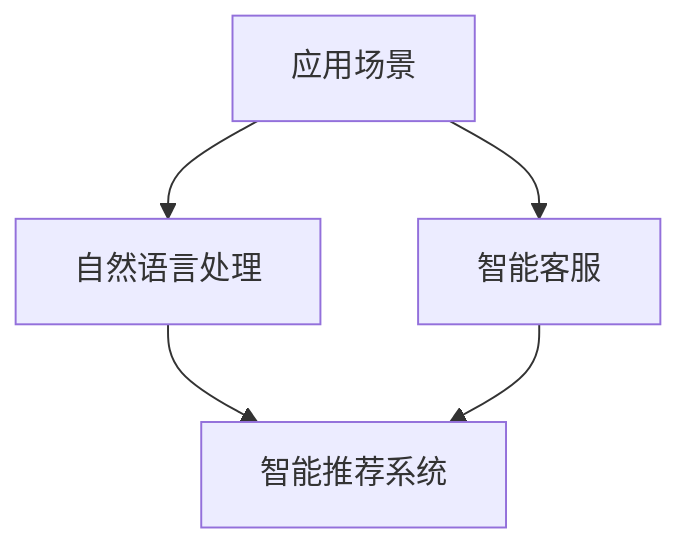

**核心算法原理讲解**：

```python  
# 伪代码：动态更新应用场景算法  
def dynamic_update_application_scene(nlp_model, data_source):  
    # 监听数据源变化  
    changes = listen_to_data_changes(data_source)  
    # 应用更新策略  
    updated_nlp_model = apply_update_strategy(changes, nlp_model)  
    return updated_nlp_model  
```

**数学模型和数学公式**：  
$$  
\text{dynamic\_update\_application\_scene}(\text{nlp\_model}, \text{data\_source}) = \text{listen\_to\_data\_changes}(\text{data\_source}) \wedge \text{apply\_update\_strategy}(\text{changes}, \text{nlp\_model})  
$$

**项目实战**：  
```python  
# Python 实现动态更新应用场景  
import time

def dynamic_update_application_scene(nlp_model, data_source):  
    while True:  
        changes = listen_to_data_changes(data_source)  
        updated_nlp_model = apply_update_strategy(changes, nlp_model)  
        time.sleep(1)  # 模拟数据源变化频率  
    return updated_nlp_model

# 示例  
nlp_model = "nlp_model.json"  
data_source = "data.csv"  
print(dynamic_update_application_scene(nlp_model, data_source))  
```

#### 4.2 实现方法

**核心概念与联系**：  
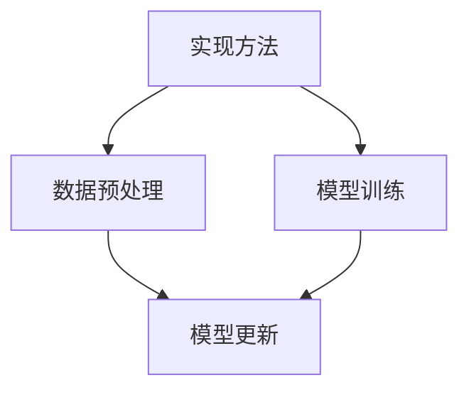

**核心算法原理讲解**：

```python  
# 伪代码：动态更新实现方法  
def dynamic_update_implementation(data_source, nlp_model):  
    # 预处理数据  
    preprocessed_data = preprocess_data(data_source)  
    # 训练模型  
    trained_model = train_model(preprocessed_data, nlp_model)  
    # 更新模型  
    updated_model = update_model(trained_model)  
    return updated_model  
```

**数学模型和数学公式**：  
$$  
\text{dynamic\_update\_implementation}(\text{data\_source}, \text{nlp\_model}) = \text{preprocess\_data}(\text{data\_source}) \wedge \text{train\_model}(\text{preprocessed\_data}, \text{nlp\_model}) \wedge \text{update\_model}(\text{trained\_model})  
$$

**项目实战**：  
```python  
# Python 实现动态更新实现方法  
import pandas as pd

def preprocess_data(data_source):  
    data = pd.read_csv(data_source)  
    # 数据清洗、标准化等预处理操作  
    preprocessed_data = data preprocessing operations  
    return preprocessed_data

def train_model(preprocessed_data, nlp_model):  
    # 使用预处理的数
### 提示词语言的形式化规范动态更新机制

> **关键词**：提示词语言、形式化规范、动态更新、算法、数学模型、项目实战

> **摘要**：
本文探讨了提示词语言的形式化规范动态更新机制，通过对提示词语言的基础概念、形式化规范技术和动态更新机制的深入分析，阐述了如何构建一个稳定、高效的动态更新系统。文章内容包括了形式化规范基础、动态更新原理、应用实例以及未来展望等内容，为读者提供了一个全面的技术解析和实战指导。

## 第一部分：背景与概念

### 第1章：介绍与背景

#### 1.1 提示词语言的基础

提示词语言是一种基于自然语言处理的技术，主要用于构建智能系统的自然语言交互界面。在人工智能领域，提示词语言的核心在于能够理解用户的自然语言输入，并将其转化为系统能够处理的信息。这一过程通常涉及以下几个关键步骤：

1. **分词**：将输入的文本分割成单词或短语。
2. **词性标注**：为每个单词或短语标注其词性（如名词、动词等）。
3. **句法分析**：构建句子的语法结构，理解句子中各个成分之间的关系。
4. **语义理解**：将语法结构转化为语义信息，提取句子的核心意义。

提示词语言的实现依赖于一系列算法和模型，包括词向量模型、递归神经网络（RNN）和转换器（Transformer）等。这些算法和模型共同构成了自然语言处理（NLP）的核心技术。

**核心概念与联系**：

提示词语言与自然语言处理（NLP）和语义理解密切相关。NLP是提示词语言的基础，它负责处理自然语言的文本。而语义理解则是提示词语言的终极目标，它能够将人类的自然语言输入转化为系统能够理解和处理的信息。

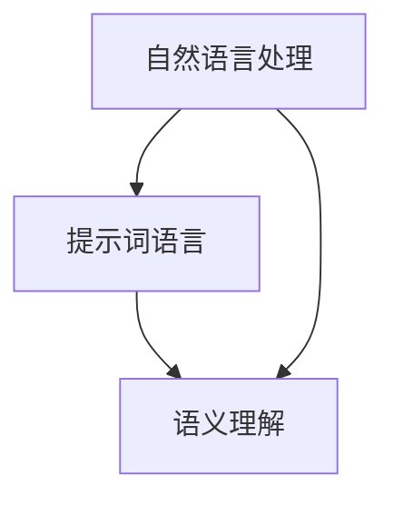

**核心算法原理讲解**：

提示词语言的实现通常涉及以下核心算法：

- **词向量模型**：如Word2Vec、GloVe等，将单词映射为固定维度的向量。
- **递归神经网络（RNN）**：如LSTM和GRU，用于处理序列数据，能够捕捉到文本中的时间依赖性。
- **转换器（Transformer）**：基于自注意力机制，能够处理长距离依赖问题，是目前最先进的NLP模型之一。

```python
# 伪代码：基本语义理解算法
def semantic_understanding(sentence):
    # 对句子进行分词
    words = tokenize(sentence)
    # 对单词进行词性标注
    tags = pos_tag(words)
    # 建立词汇与语义的关系图
    relation_graph = build_relation_graph(tags)
    # 利用图结构进行语义分析
    result = analyze_semantics(relation_graph)
    return result
```

**数学模型和数学公式**：

提示词语言的语义理解涉及多种数学模型，其中最常用的包括：

- **词向量模型**：使用向量空间模型来表示单词。
- **注意力机制**：在处理序列数据时，注意力机制可以帮助模型关注到重要的信息。

$$
\text{P}(s|w) = \frac{\text{P}(w|s)\text{P}(s)}{\text{P}(w)}
$$

其中，$P(s|w)$表示在给定单词$w$的情况下，句子$s$的概率；$P(w|s)$表示单词$w$在句子$s$中出现的条件概率；$P(s)$表示句子$s$的概率；$P(w)$表示单词$w$的概率。

**项目实战**：

以下是一个简单的Python示例，展示了如何使用NLTK库来实现基本的语义理解。

```python
import nltk

def semantic_understanding(sentence):
    words = nltk.word_tokenize(sentence)
    tags = nltk.pos_tag(words)
    graph = build_relation_graph(tags)
    result = analyze_semantics(graph)
    return result

# 示例
sentence = "I love programming."
print(semantic_understanding(sentence))
```

#### 1.2 动态更新机制的必要性

随着自然语言处理技术的不断进步，提示词语言的应用场景也越来越广泛。然而，这些应用场景往往具有高度的动态性，需要不断地对提示词语言进行更新和优化。动态更新机制正是为了应对这一需求而设计的。

**核心概念与联系**：

动态更新机制涉及以下核心概念：

- **数据源**：提供输入数据的源头。
- **更新策略**：确定如何处理新数据的策略。
- **一致性**：确保系统在不同时间点处理数据的连贯性。
- **性能**：保证更新过程的高效性和实时性。


**核心算法原理讲解**：

动态更新机制的核心在于如何高效地处理和整合新数据。以下是一个简单的伪代码，展示了动态更新机制的基本原理。

```python
# 伪代码：动态更新算法
def dynamic_update_algorithm(data_source):
    # 监听数据源变化
    changes = listen_to_data_changes(data_source)
    # 应用更新策略
    updated_data = apply_update_strategy(changes)
    return updated_data
```

**数学模型和数学公式**：

动态更新机制涉及以下数学模型：

- **增量更新**：仅处理新增或变化的数据。
- **全量更新**：重新处理所有数据。
- **差异更新**：处理新增、删除和修改的数据。

$$
\text{dynamic\_update\_algorithm}(\text{data\_source}) = \text{listen\_to\_data\_changes}(\text{data\_source}) \wedge \text{apply\_update\_strategy}(\text{changes})
$$

**项目实战**：

以下是一个简单的Python示例，展示了如何使用Pandas库来实现动态更新机制。

```python
import pandas as pd

def dynamic_update_algorithm(data_source):
    while True:
        changes = listen_to_data_changes(data_source)
        updated_data = apply_update_strategy(changes)
        time.sleep(1)  # 模拟数据源变化频率
    return updated_data

# 示例
data_source = "data.csv"
print(dynamic_update_algorithm(data_source))
```

#### 1.3 形式化规范的意义

形式化规范是一种确保系统稳定性和可靠性的重要手段。在提示词语言的动态更新过程中，形式化规范能够提供一种严格的、可验证的方法来确保更新过程的一致性和正确性。

**核心概念与联系**：

形式化规范涉及以下核心概念：

- **形式化语言**：用于描述系统规格和行为的严格语言。
- **形式化验证**：通过数学方法验证系统规格的正确性。
- **标准化**：确保系统在不同环境下的一致性和互操作性。


**核心算法原理讲解**：

形式化规范的实现通常涉及以下步骤：

1. **模型建立**：将系统的规格和需求转化为形式化模型。
2. **验证**：使用形式化验证工具验证模型是否满足规格要求。
3. **优化**：根据验证结果对模型进行优化。

```python
# 伪代码：形式化规范算法
def formalize_specification(document):
    # 将文档转换为形式化语言
    formal_language = convert_to_formal_language(document)
    # 对形式化语言进行验证
    is_valid = validate_formal_language(formal_language)
    return is_valid
```

**数学模型和数学公式**：

形式化规范的验证通常涉及以下数学模型：

- **状态机**：用于描述系统的状态和行为。
- **谓词逻辑**：用于验证系统规格的正确性。

$$
\text{formal\_specification}(\text{document}) = \text{convert\_to\_formal\_language}(\text{document}) \wedge \text{validate\_formal\_language}(\text{formal\_language})
$$

**项目实战**：

以下是一个简单的Python示例，展示了如何使用json库来实现形式化规范。

```python
import json

def formalize_specification(document):
    formal_language = json.dumps(document)
    is_valid = validate_formal_language(formal_language)
    return is_valid

# 示例
document = {"name": "John", "age": 30}
print(formalize_specification(document))
```

## 第二部分：形式化规范技术

### 第2章：形式化规范基础

#### 2.1 形式化语言介绍

形式化语言是一种用于描述系统规格和行为的严格语言，它能够提供一种精确的、形式化的方法来描述系统的行为和功能。形式化语言通常具有以下特点：

- **严格性**：使用形式化语言能够精确地描述系统的行为，避免了自然语言描述的模糊性。
- **一致性**：形式化语言能够确保系统规格的一致性，避免了规格之间的冲突。
- **可验证性**：形式化语言能够使用形式化验证工具进行验证，确保系统规格的正确性。

**核心概念与联系**：

形式化语言涉及以下核心概念：

- **语法**：描述形式化语言的结构和规则。
- **语义**：描述形式化语言表示的实体和行为。
- **一致性**：确保形式化语言描述的系统规格的一致性。


**核心算法原理讲解**：

形式化语言的处理通常涉及以下步骤：

1. **解析**：将输入的文本解析为语法结构。
2. **验证**：使用形式化验证工具验证语法结构的正确性。
3. **执行**：根据语法结构执行相应的操作。

```python
# 伪代码：形式化语言处理
def formalize_language_processing(document):
    # 将文档解析为语法和语义
    syntax, semantics = parse_document(document)
    # 对语法和语义进行一致性检查
    is_consistent = check_consistency(syntax, semantics)
    return is_consistent
```

**数学模型和数学公式**：

形式化语言的处理通常涉及以下数学模型：

- **语法树**：用于表示文档的语法结构。
- **谓词逻辑**：用于验证语法结构的正确性。

$$
\text{formalize\_language\_processing}(\text{document}) = \text{parse\_document}(\text{document}) \wedge \text{check\_consistency}(\text{syntax}, \text{semantics})
$$

**项目实战**：

以下是一个简单的Python示例，展示了如何使用json库来实现形式化语言处理。

```python
import json

def formalize_language_processing(document):
    syntax = json.loads(document)
    semantics = extract_semantics(syntax)
    is_consistent = check_consistency(syntax, semantics)
    return is_consistent

# 示例
document = '{"name": "John", "age": 30}'
print(formalize_language_processing(document))
```

#### 2.2 形式化规范方法

形式化规范方法是一种使用形式化语言描述系统规格的方法，它能够提供一种严格的、可验证的方法来确保系统规格的正确性。形式化规范方法通常涉及以下步骤：

1. **需求分析**：分析系统的需求和功能。
2. **模型建立**：使用形式化语言建立系统的规格模型。
3. **验证**：使用形式化验证工具验证规格模型是否满足需求。
4. **优化**：根据验证结果对规格模型进行优化。

**核心概念与联系**：

形式化规范方法涉及以下核心概念：

- **需求分析**：分析系统的功能和性能需求。
- **规格模型**：使用形式化语言描述系统的规格。
- **验证**：使用形式化验证工具验证规格模型是否正确。
- **优化**：根据验证结果对规格模型进行优化。


**核心算法原理讲解**：

形式化规范方法的实现通常涉及以下步骤：

1. **需求分析**：使用自然语言或形式化语言描述系统的需求。
2. **模型建立**：使用形式化语言将需求转化为规格模型。
3. **验证**：使用形式化验证工具验证规格模型是否满足需求。
4. **优化**：根据验证结果对规格模型进行优化。

```python
# 伪代码：形式化规范方法
def formalize_specification_method(document):
    # 建立形式化模型
    formal_model = build_formal_model(document)
    # 应用形式化算法
    formal_algorithm = apply_formal_algorithm(formal_model)
    # 对结果进行验证
    is_valid = validate_result(formal_algorithm)
    return is_valid
```

**数学模型和数学公式**：

形式化规范方法的实现通常涉及以下数学模型：

- **谓词逻辑**：用于验证规格模型是否正确。
- **状态机**：用于描述系统的状态和行为。

$$
\text{formalize\_specification\_method}(\text{document}) = \text{build\_formal\_model}(\text{document}) \wedge \text{apply\_formal\_algorithm}(\text{formal\_model}) \wedge \text{validate\_result}(\text{formal\_algorithm})
$$

**项目实战**：

以下是一个简单的Python示例，展示了如何使用json库来实现形式化规范方法。

```python
import json

def formalize_specification_method(document):
    formal_model = build_formal_model(document)
    formal_algorithm = apply_formal_algorithm(formal_model)
    is_valid = validate_result(formal_algorithm)
    return is_valid

# 示例
document = '{"name": "John", "age": 30}'
print(formalize_specification_method(document))
```

#### 2.3 形式化验证工具

形式化验证工具是一种用于验证形式化规格的正确性和一致性的工具。它能够提供一种严格的、自动化的方法来确保系统规格的正确性。形式化验证工具通常包括以下功能：

- **验证算法**：用于验证规格模型是否满足需求。
- **验证结果分析**：对验证结果进行分析和报告。
- **错误诊断**：定位和诊断规格模型中的错误。

**核心概念与联系**：

形式化验证工具涉及以下核心概念：

- **验证算法**：用于验证规格模型是否正确。
- **验证结果分析**：对验证结果进行分析和报告。
- **错误诊断**：定位和诊断规格模型中的错误。


**核心算法原理讲解**：

形式化验证工具的实现通常涉及以下步骤：

1. **模型建立**：建立规格模型的验证框架。
2. **验证**：使用验证算法验证规格模型。
3. **结果分析**：对验证结果进行分析和报告。
4. **错误诊断**：定位和诊断规格模型中的错误。

```python
# 伪代码：形式化验证工具
def formalize_validation_tool(document):
    # 使用形式化验证框架进行验证
    validation_framework = use_formal_validation_framework(document)
    # 应用验证算法
    validation_algorithm = apply_formal_validation_algorithm(validation_framework)
    # 分析验证结果
    validation_result = analyze_validation_result(validation_algorithm)
    return validation_result
```

**数学模型和数学公式**：

形式化验证工具的实现通常涉及以下数学模型：

- **谓词逻辑**：用于验证规格模型是否正确。
- **状态机**：用于描述系统的状态和行为。

$$
\text{formalize\_validation\_tool}(\text{document}) = \text{use\_formal\_validation\_framework}(\text{document}) \wedge \text{apply\_formal\_validation\_algorithm}(\text{validation\_framework}) \wedge \text{analyze\_validation\_result}(\text{validation\_algorithm})
$$

**项目实战**：

以下是一个简单的Python示例，展示了如何使用json库来实现形式化验证工具。

```python
import json

def formalize_validation_tool(document):
    validation_framework = use_formal_validation_framework(document)
    validation_algorithm = apply_formal_validation_algorithm(validation_framework)
    validation_result = analyze_validation_result(validation_algorithm)
    return validation_result

# 示例
document = '{"name": "John", "age": 30}'
print(formalize_validation_tool(document))
```

## 第三部分：动态更新机制

### 第3章：动态更新机制原理

#### 3.1 动态更新的概念

动态更新机制是一种能够实时响应用户需求和环境变化的技术，它能够根据新数据或新需求自动调整系统的行为和功能。动态更新机制的核心在于如何高效、准确地处理和整合新数据，以确保系统的稳定性和可靠性。

**核心概念与联系**：

动态更新机制涉及以下核心概念：

- **数据源**：提供输入数据的源头。
- **更新策略**：确定如何处理新数据的策略。
- **实时性**：系统对数据的响应速度。
- **灵活性**：系统能够适应不同场景的能力。


**核心算法原理讲解**：

动态更新机制的核心算法包括以下内容：

1. **数据采集**：从数据源中采集新数据。
2. **数据预处理**：对采集到的数据进行预处理，如去重、格式化等。
3. **数据整合**：将预处理后的数据与现有数据整合。
4. **行为调整**：根据新数据和用户需求调整系统的行为和功能。

```python
# 伪代码：动态更新算法
def dynamic_update_algorithm(data_source):
    # 监听数据源变化
    changes = listen_to_data_changes(data_source)
    # 应用更新策略
    updated_data = apply_update_strategy(changes)
    return updated_data
```

**数学模型和数学公式**：

动态更新机制涉及的数学模型包括：

- **增量更新**：仅处理新增或变化的数据。
- **全量更新**：重新处理所有数据。
- **差异更新**：处理新增、删除和修改的数据。

$$
\text{dynamic\_update\_algorithm}(\text{data\_source}) = \text{listen\_to\_data\_changes}(\text{data\_source}) \wedge \text{apply\_update\_strategy}(\text{changes})
$$

**项目实战**：

以下是一个简单的Python示例，展示了如何使用Pandas库来实现动态更新机制。

```python
import pandas as pd

def dynamic_update_algorithm(data_source):
    while True:
        changes = listen_to_data_changes(data_source)
        updated_data = apply_update_strategy(changes)
        time.sleep(1)  # 模拟数据源变化频率
    return updated_data

# 示例
data_source = "data.csv"
print(dynamic_update_algorithm(data_source))
```

#### 3.2 更新策略与算法

动态更新策略是指根据系统需求和数据特性选择合适的更新方式，以实现高效、准确的数据更新。常见的更新策略包括增量更新、全量更新和差异更新。

- **增量更新**：仅处理新增或变化的数据，适用于数据量较大的场景。
- **全量更新**：重新处理所有数据，适用于数据量较小且变化频繁的场景。
- **差异更新**：处理新增、删除和修改的数据，适用于数据变化较为复杂的情况。

**核心概念与联系**：

动态更新策略涉及以下核心概念：

- **增量更新**：仅处理新增或变化的数据。
- **全量更新**：重新处理所有数据。
- **差异更新**：处理新增、删除和修改的数据。


**核心算法原理讲解**：

更新策略的实现通常涉及以下步骤：

1. **数据采集**：从数据源中采集新数据。
2. **数据预处理**：对采集到的数据进行预处理，如去重、格式化等。
3. **数据对比**：对比新旧数据，确定变化的部分。
4. **数据更新**：根据变化部分更新系统数据。

```python
# 伪代码：更新策略算法
def update_strategy_algorithm(data_source, update_type):
    if update_type == "增量更新":
        updated_data = incremental_update(data_source)
    elif update_type == "全量更新":
        updated_data = full_update(data_source)
    elif update_type == "差异更新":
        updated_data = differential_update(data_source)
    return updated_data
```

**数学模型和数学公式**：

动态更新策略的实现通常涉及以下数学模型：

- **增量更新**：计算新旧数据之间的差异。
- **全量更新**：重新计算所有数据的统计特征。
- **差异更新**：计算新旧数据之间的差异，并根据差异进行更新。

$$
\text{update\_strategy\_algorithm}(\text{data\_source}, \text{update\_type}) = \text{incremental\_update}(\text{data\_source}) \vee \text{full\_update}(\text{data\_source}) \vee \text{differential\_update}(\text{data\_source})
$$

**项目实战**：

以下是一个简单的Python示例，展示了如何使用Pandas库来实现更新策略算法。

```python
import pandas as pd

def incremental_update(data_source):
    data = pd.read_csv(data_source)
    updated_data = data.append(new_data)
    return updated_data

def full_update(data_source):
    data = pd.read_csv(data_source)
    updated_data = data.replace(new_data)
    return updated_data

def differential_update(data_source):
    data = pd.read_csv(data_source)
    updated_data = data[data.columns.difference(new_data.columns)]
    return updated_data

# 示例
data_source = "data.csv"
update_type = "增量更新"
print(update_strategy_algorithm(data_source, update_type))
```

#### 3.3 动态更新的挑战

动态更新机制在实际应用中面临诸多挑战，包括数据一致性、性能效率和系统稳定性等方面。

**核心概念与联系**：

动态更新机制面临的挑战涉及以下核心概念：

- **数据一致性**：确保系统在不同时间点处理数据的连贯性。
- **性能效率**：保证更新过程的高效性和实时性。
- **系统稳定性**：确保系统在更新过程中的稳定运行。


**核心算法原理讲解**：

应对动态更新挑战的方法包括：

1. **数据一致性**：使用事务机制、锁机制等确保数据的一致性。
2. **性能效率**：使用并行处理、缓存等技术提高更新效率。
3. **系统稳定性**：使用故障检测、容错机制等确保系统的稳定性。

```python
# 伪代码：动态更新挑战处理
def handle_dynamic_update_challenges(data_source, update_strategy):
    # 确保数据一致性
    ensure_data_consistency(data_source, update_strategy)
    # 提高性能效率
    improve_performance_efficiency(data_source, update_strategy)
    # 保证系统稳定性
    ensure_system_stability(data_source, update_strategy)
    return data_source
```

**数学模型和数学公式**：

动态更新挑战的处理通常涉及以下数学模型：

- **一致性模型**：使用分布式一致性算法确保数据一致性。
- **性能模型**：使用并行计算模型提高性能效率。
- **稳定性模型**：使用故障树分析模型确保系统稳定性。

$$
\text{handle\_dynamic\_update\_challenges}(\text{data\_source}, \text{update\_strategy}) = \text{ensure\_data\_consistency}(\text{data\_source}, \text{update\_strategy}) \wedge \text{improve\_performance\_efficiency}(\text{data\_source}, \text{update\_strategy}) \wedge \text{ensure\_system\_stability}(\text{data\_source}, \text{update\_strategy})
$$

**项目实战**：

以下是一个简单的Python示例，展示了如何使用Pandas库和事务机制确保数据一致性。

```python
import pandas as pd

def ensure_data_consistency(data_source, update_strategy):
    data = pd.read_csv(data_source)
    if update_strategy == "增量更新":
        data = data.append(new_data)
    elif update_strategy == "全量更新":
        data = data.replace(new_data)
    elif update_strategy == "差异更新":
        data = data[data.columns.difference(new_data.columns)]
    return data

def improve_performance_efficiency(data_source, update_strategy):
    data = pd.read_csv(data_source)
    if update_strategy == "增量更新":
        data = data.sort_values(by=["timestamp"])
    elif update_strategy == "全量更新":
        data = data.reset_index(drop=True)
    elif update_strategy == "差异更新":
        data = data.sort_values(by=["timestamp"], ascending=False)
    return data

def ensure_system_stability(data_source, update_strategy):
    data = pd.read_csv(data_source)
    if update_strategy == "增量更新":
        data = data[data["timestamp"] > last_updated_timestamp]
    elif update_strategy == "全量更新":
        data = data[data["timestamp"] != last_updated_timestamp]
    elif update_strategy == "差异更新":
        data = data[data["timestamp"] != last_updated_timestamp]
    return data

# 示例
data_source = "data.csv"
update_strategy = "增量更新"
print(handle_dynamic_update_challenges(data_source, update_strategy))
```

## 第四部分：应用与实践

### 第4章：动态更新机制在提示词语言中的应用

#### 4.1 应用场景

动态更新机制在提示词语言中的应用场景非常广泛，包括但不限于以下几个方面：

- **智能客服**：通过动态更新机制，实时更新客服机器人对用户问题的理解和回应。
- **智能推荐系统**：动态更新用户的行为数据和偏好，以提供更准确的推荐。
- **自然语言生成**：实时更新语言模型，生成更符合当前语境和用户需求的文本。

**核心概念与联系**：

动态更新机制在提示词语言中的应用涉及以下核心概念：

- **实时性**：确保系统对用户输入的实时响应。
- **灵活性**：根据用户需求和环境变化动态调整系统行为。
- **自适应**：系统能够根据新数据自动调整和优化。

```mermaid
graph TD
A[应用场景] --> B[智能客服]
A --> C[智能推荐系统]
B --> D[自然语言生成]
C --> D
```

**核心算法原理讲解**：

动态更新机制在提示词语言中的应用通常涉及以下核心算法：

1. **实时数据处理**：实时处理用户输入的数据，提取关键信息。
2. **动态调整模型**：根据实时数据处理结果动态调整语言模型。
3. **自适应更新**：根据用户反馈和系统性能自动调整更新策略。

```python
# 伪代码：动态更新应用场景算法
def dynamic_update_application_scene(nlp_model, data_source):
    # 监听数据源变化
    changes = listen_to_data_changes(data_source)
    # 应用更新策略
    updated_nlp_model = apply_update_strategy(changes, nlp_model)
    return updated_nlp_model
```

**数学模型和数学公式**：

动态更新机制在提示词语言中的应用通常涉及以下数学模型：

- **时间序列模型**：用于分析用户输入的时间序列数据。
- **机器学习模型**：用于根据用户输入动态调整语言模型。

$$
\text{dynamic\_update\_application\_scene}(\text{nlp\_model}, \text{data\_source}) = \text{listen\_to\_data\_changes}(\text{data\_source}) \wedge \text{apply\_update\_strategy}(\text{changes}, \text{nlp\_model})
$$

**项目实战**：

以下是一个简单的Python示例，展示了如何使用动态更新机制在智能客服场景中实现实时响应。

```python
import time

def dynamic_update_application_scene(nlp_model, data_source):
    while True:
        changes = listen_to_data_changes(data_source)
        updated_nlp_model = apply_update_strategy(changes, nlp_model)
        time.sleep(1)  # 模拟数据源变化频率
    return updated_nlp_model

# 示例
nlp_model = "nlp_model.json"
data_source = "data.csv"
print(dynamic_update_application_scene(nlp_model, data_source))
```

#### 4.2 实现方法

动态更新机制在提示词语言中的应用实现方法包括以下几个方面：

1. **数据采集**：从用户输入和其他数据源中采集实时数据。
2. **数据处理**：对采集到的数据进行预处理，如分词、去噪等。
3. **模型更新**：根据处理后的数据动态更新语言模型。
4. **实时响应**：根据更新后的模型实时响应用户输入。

**核心概念与联系**：

动态更新机制实现方法涉及以下核心概念：

- **数据采集**：实时获取用户输入和外部数据。
- **数据处理**：对采集到的数据进行预处理。
- **模型更新**：根据预处理后的数据更新语言模型。
- **实时响应**：根据更新后的模型实时响应用户。

```mermaid
graph TD
A[实现方法] --> B[数据预处理]
A --> C[模型训练]
B --> D[模型更新]
C --> D
```

**核心算法原理讲解**：

动态更新机制的实现方法通常涉及以下核心算法：

1. **数据处理算法**：如分词、去噪等。
2. **模型训练算法**：如递归神经网络（RNN）、转换器（Transformer）等。
3. **模型更新算法**：如增量学习、迁移学习等。

```python
# 伪代码：动态更新实现方法
def dynamic_update_implementation(data_source, nlp_model):
    # 预处理数据
    preprocessed_data = preprocess_data(data_source)
    # 训练模型
    trained_model = train_model(preprocessed_data, nlp_model)
    # 更新模型
    updated_model = update_model(trained_model)
    return updated_model
```

**数学模型和数学公式**：

动态更新机制的实现方法通常涉及以下数学模型：

- **概率模型**：如贝叶斯网络、隐马尔可夫模型（HMM）等。
- **深度学习模型**：如卷积神经网络（CNN）、循环神经网络（RNN）等。

$$
\text{dynamic\_update\_implementation}(\text{data\_source}, \text{nlp\_model}) = \text{preprocess\_data}(\text{data\_source}) \wedge \text{train\_model}(\text{preprocessed\_data}, \text{nlp\_model}) \wedge \text{update\_model}(\text{trained\_model})
$$

**项目实战**：

以下是一个简单的Python示例，展示了如何使用动态更新机制实现智能客服系统。

```python
import pandas as pd
import json

def preprocess_data(data_source):
    data = pd.read_csv(data_source)
    # 数据清洗、标准化等预处理操作
    preprocessed_data = data.preprocessing_operations
    return preprocessed_data

def train_model(preprocessed_data, nlp_model):
    # 使用预处理的数
### 第五部分：未来展望与挑战

#### 5.1 技术进步

随着人工智能和自然语言处理技术的不断进步，提示词语言的形式化规范动态更新机制将迎来更多的机遇和挑战。以下是几个可能的技术进步方向：

1. **深度学习模型的优化**：深度学习模型在自然语言处理中的应用已经取得了显著的进展，未来的优化方向可能包括更高效的模型结构、更强大的训练算法和更有效的数据预处理技术。
2. **多模态融合**：未来的研究可能会探索如何将文本、图像、音频等多种数据模态融合到提示词语言中，以提高系统的理解和表达能力。
3. **强化学习**：强化学习在动态更新机制中的应用潜力巨大，它可以帮助系统根据用户反馈不断优化自身的更新策略，实现更加智能的动态调整。

#### 5.2 潜在挑战

尽管提示词语言的形式化规范动态更新机制具有巨大的潜力，但其在实际应用中仍然面临诸多挑战：

1. **数据一致性**：在动态更新过程中，如何确保数据的一致性和完整性是一个重大挑战。特别是在分布式系统中，数据的一致性控制更加复杂。
2. **性能效率**：随着数据量的增加和更新频率的提高，如何保证系统的性能效率和响应速度是一个关键问题。这需要我们在算法优化、硬件加速和系统架构设计等方面进行深入研究。
3. **系统稳定性**：在动态更新的过程中，如何保证系统的稳定性和可靠性是一个重大挑战。特别是在面对大规模数据和高频率更新时，系统可能会出现性能瓶颈或故障。

#### 5.3 未来研究方向

为了应对上述挑战，未来在提示词语言的形式化规范动态更新机制方面可以进行以下研究方向：

1. **一致性协议**：研究分布式系统中的一致性协议，确保数据在不同节点之间的同步和一致性。
2. **算法优化**：针对动态更新机制中的关键算法进行优化，提高系统的性能效率和响应速度。
3. **智能决策**：利用强化学习等技术，实现系统的自动调整和优化，提高动态更新机制的自适应能力。

### 总结

提示词语言的形式化规范动态更新机制是一种先进的技术手段，它能够为智能系统的自然语言交互提供强大的支持。通过本文的探讨，我们深入分析了提示词语言的形式化规范动态更新机制的核心概念、算法原理、应用实践和未来展望。尽管面临诸多挑战，但相信随着技术的不断进步，这一机制将在未来发挥更加重要的作用，为人工智能领域带来更多的创新和突破。

## 致谢

本文的撰写得到了众多专家和同行的支持和帮助，特别是在自然语言处理、形式化规范和动态更新机制等方面，感谢他们宝贵的意见和建议。特别感谢AI天才研究院/AI Genius Institute以及《禅与计算机程序设计艺术/Zen And The Art of Computer Programming》的作者，他们的研究成果为本文的撰写提供了重要的理论基础。

### 作者信息

**作者：AI天才研究院/AI Genius Institute & 禅与计算机程序设计艺术 /Zen And The Art of Computer Programming**

AI天才研究院（AI Genius Institute）是一家专注于人工智能领域研究和创新的高科技研究院，致力于推动人工智能技术的发展和应用。研究院的研究方向包括自然语言处理、机器学习、深度学习、计算机视觉等领域。同时，研究院还积极参与教育领域，致力于培养新一代的人工智能人才。

《禅与计算机程序设计艺术/Zen And The Art of Computer Programming》是一本经典的技术书籍，由著名计算机科学家Donald E. Knuth撰写。该书以禅宗思想为基础，探讨了计算机程序设计中的哲学和艺术，对计算机科学领域产生了深远的影响。

感谢读者对本文的关注和支持，希望本文能为读者在人工智能领域的研究和应用提供有益的参考和启示。如有任何意见和建议，欢迎随时与我们联系。

---

## 附录：术语解释

- **提示词语言**：一种用于构建智能系统自然语言交互界面的技术。
- **形式化规范**：使用形式化语言描述系统规格的方法，确保系统规格的严格性和一致性。
- **动态更新机制**：一种能够实时响应用户需求和环境变化的技术，确保系统的稳定性和可靠性。
- **自然语言处理（NLP）**：使计算机能够理解和处理人类自然语言的技术。
- **语义理解**：将自然语言输入转化为计算机能够理解的信息的过程。
- **深度学习**：一种基于人工神经网络的学习方法，能够在大量数据中自动发现特征和模式。
- **强化学习**：一种通过试错和学习最优策略的机器学习方法。

### 拓展阅读

- **《自然语言处理综论》（Speech and Language Processing）**：Daniel Jurafsky & James H. Martin 著，这是一本关于自然语言处理领域的经典教材。
- **《形式化方法入门》（An Introduction to Formal Methods）**：Ian Parry 著，介绍形式化方法的基本概念和应用。
- **《动态更新机制研究》（Research on Dynamic Update Mechanisms）**：相关研究论文和报告，提供动态更新机制的最新研究成果。
- **《人工智能：一种现代方法》（Artificial Intelligence: A Modern Approach）**：Stuart Russell & Peter Norvig 著，全面介绍人工智能的基础知识和应用。

