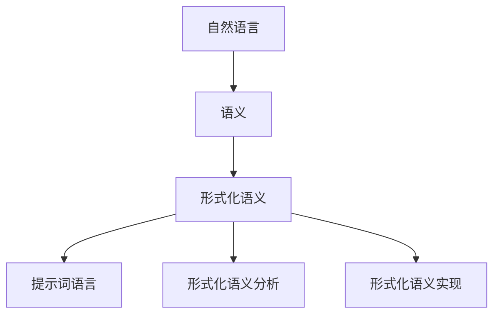

                 


## 引言

### 背景介绍

提示词语言（Prompt Language）是计算机科学中自然语言处理（Natural Language Processing, NLP）领域的一个重要研究方向。随着人工智能技术的快速发展，自然语言处理技术逐渐成为实现人机交互、智能问答、文本生成等应用的核心技术。而提示词语言作为自然语言处理的基础，其形式化语义的研究具有重要的理论和实践意义。

在自然语言处理中，提示词语言的形式化语义指的是通过形式化的方法来描述和解释自然语言中的语义信息。形式化语义的研究旨在解决自然语言理解的歧义性问题，提高自然语言处理系统的准确性和鲁棒性。因此，对提示词语言的形式化语义进行深入的研究，不仅可以推动自然语言处理技术的发展，还可以为其他相关领域，如人工智能、认知科学等提供理论支持。

### 核心概念与联系

为了更好地理解提示词语言的形式化语义，我们首先需要明确一些核心概念，并分析它们之间的关系。以下是几个关键概念及它们之间的联系：

1. **自然语言**：自然语言是人类日常交流所使用的语言，具有灵活性和歧义性。自然语言处理的目标是让计算机能够理解并处理这些语言。

2. **语义**：语义指的是语言表达的含义。在自然语言处理中，语义是指文本中的单词、短语或句子所表达的含义。

3. **形式化语义**：形式化语义是指通过数学或逻辑方法对自然语言的语义进行形式化的描述。这种描述使得计算机能够精确地理解和处理语言。

4. **提示词语言**：提示词语言是一种专门用于生成提示或引导问题的语言。在自然语言处理中，提示词语言的形式化语义研究主要关注如何通过形式化的方法来描述和解释提示词的语义。

5. **形式化语义分析**：形式化语义分析是指使用形式化语义的方法对自然语言文本进行语义分析的过程。这包括词义消歧、语义角色标注等任务。

6. **形式化语义实现**：形式化语义实现是指将形式化语义的方法应用于实际的编程和软件开发中。这涉及到如何设计和实现自然语言处理系统，以处理和解释自然语言的语义。

### Mermaid 流程图

为了更直观地展示这些概念之间的联系，我们可以使用 Mermaid 流程图来表示它们。以下是一个简化的 Mermaid 流程图：



在这个流程图中，自然语言是整个流程的起点，它通过语义这一概念与形式化语义相连接。形式化语义进一步衍生出提示词语言、形式化语义分析和形式化语义实现，这三个概念共同构成了自然语言处理的核心环节。

通过上述分析，我们可以看到提示词语言的形式化语义在自然语言处理中扮演着至关重要的角色。接下来，我们将进一步探讨形式化语义的基础知识，并深入分析提示词语言的形式化语义。

## 形式化语义基础

### 形式化语义的定义和重要性

形式化语义（Formal Semantics）是语言学和计算机科学中用于描述自然语言语义的一种方法。它通过数学和逻辑的形式化手段，对自然语言的语义进行精确的描述和解释。形式化语义的定义涉及多个方面，包括语义理论、语义模型和语义分析等。

在语言学中，形式化语义是指使用数学和逻辑的方法来表示语言的结构和语义内容。这种形式化手段可以包括符号化语言、语义网络、格理论和范畴语法等。通过形式化语义，语言学家可以更精确地描述语言的使用规则和语义关系。

在计算机科学中，形式化语义主要用于自然语言处理（NLP）领域。NLP的目标是让计算机理解和处理人类语言。形式化语义在NLP中的应用主要体现在以下几个方面：

1. **语义分析**：形式化语义可以帮助计算机对自然语言文本进行语义分析，包括词义消歧、语义角色标注和语义解析等。通过形式化语义的分析，计算机可以更准确地理解文本的含义。

2. **语义表示**：形式化语义提供了将自然语言文本中的语义信息转换为计算机可处理的形式的方法。这种语义表示可以为后续的文本生成、问答系统、机器翻译等任务提供基础。

3. **语言模型**：在机器学习和深度学习领域，形式化语义可以用于构建更准确的语义表示模型。这些模型可以用于自动分类、情感分析、命名实体识别等任务。

4. **语义理解**：形式化语义有助于提高人机交互的自然度和准确性。通过形式化语义的理解，计算机可以更好地处理用户输入，提供更符合用户需求的响应。

形式化语义的重要性在于：

1. **精确性**：形式化语义通过数学和逻辑的方法，对语义进行精确描述，从而减少了自然语言理解的歧义性。

2. **可计算性**：形式化语义使得自然语言处理任务变得更加可计算，从而可以利用计算机科学的方法进行优化和自动化。

3. **可扩展性**：形式化语义提供了标准的语义表示方法，可以方便地扩展到新的应用领域。

4. **理论支持**：形式化语义为自然语言处理提供了理论基础，有助于进一步研究和改进自然语言处理技术。

### 形式化语义的框架

形式化语义的框架通常包括以下几个部分：

1. **语义理论**：语义理论是形式化语义的基础，它定义了语言符号的语义值和语义规则。常见的语义理论包括命题语义、指称语义和分布语义等。

2. **语义模型**：语义模型是形式化语义的核心，用于表示语言表达式的语义信息。常见的语义模型有语义网络、语义角色模型、框架网络等。

3. **语义分析**：语义分析是形式化语义的实现过程，它将自然语言文本转换为语义表示。语义分析通常包括词义消歧、语义角色标注和语义解析等任务。

4. **语义表示**：语义表示是将自然语言文本中的语义信息转换为计算机可处理的形式。常见的语义表示方法有向量表示、语义角色表示和事件表示等。

5. **语义验证**：语义验证是确保语义表示正确性的过程。它通过逻辑推理和数学证明，验证语义表示是否满足语言规范。

### 形式化语义的研究现状和挑战

形式化语义的研究在近年来取得了显著进展，但也面临着一些挑战：

1. **理论研究**：形式化语义的理论研究已经相对成熟，但如何将理论应用于实际的自然语言处理任务，仍然是一个挑战。

2. **模型构建**：构建准确的语义模型是形式化语义的关键。然而，自然语言的复杂性和多样性使得语义模型的构建具有很大的挑战性。

3. **语义分析**：语义分析涉及到自然语言理解的多个层面，包括语法、语义和语用等。如何准确地进行语义分析，是一个复杂的任务。

4. **计算效率**：形式化语义的方法通常需要较高的计算资源。如何优化算法和模型，以提高计算效率，是一个重要的研究方向。

5. **跨语言语义**：跨语言语义研究旨在将形式化语义的方法应用于不同语言之间的语义对比和分析。这一领域的研究还相对较少。

总之，形式化语义在自然语言处理中的应用具有重要的理论和实践价值。尽管面临着一些挑战，但随着研究的深入和技术的进步，形式化语义将进一步提升自然语言处理系统的性能和可靠性。

## 提示词语言的定义和特性

### 提示词语言的定义

提示词语言（Prompt Language）是一种专门用于生成提示或引导问题的语言，它通常由一组预定义的符号、规则和语法构成。这些符号和规则用于表示问题的不同部分，如问题类型、问题属性和回答选项等。提示词语言在自然语言处理（NLP）中发挥着重要作用，尤其是在问答系统和对话系统中。

提示词语言的主要特点包括：

1. **可定义性**：提示词语言通过明确的符号和规则定义，使得问题生成过程具有一致性和可重复性。

2. **灵活性**：提示词语言可以根据不同的应用需求，灵活地调整和扩展其语法和语义。

3. **形式化**：提示词语言的形式化表示使其在计算机处理和理解方面更加精确和高效。

4. **直观性**：提示词语言的语法和符号通常设计得直观易用，便于用户理解和操作。

### 提示词语言的特点

1. **结构化**：提示词语言通常采用结构化的形式，如树形结构或图形结构，以便于计算机理解和处理。

2. **可解释性**：提示词语言的符号和规则具有明确的语义解释，使得用户可以清晰地理解问题的含义。

3. **模块化**：提示词语言的设计通常模块化，使得不同的模块可以独立开发和测试，提高系统的可维护性和扩展性。

4. **动态性**：提示词语言可以动态地生成和调整提示，以适应不同的场景和用户需求。

5. **适应性**：提示词语言可以根据不同的自然语言处理任务和应用需求，灵活地调整其语法和语义。

### 形式化描述的框架

为了更好地理解和应用提示词语言，我们通常使用形式化描述的框架。这个框架包括以下几个部分：

1. **符号集**：定义提示词语言中的基本符号，如单词、短语和特殊符号。

2. **语法规则**：规定符号的排列组合方式，如句子结构、问题类型和回答选项等。

3. **语义规则**：定义符号的语义解释，如词义、短语意义和句子意义等。

4. **形式化语义模型**：使用数学和逻辑方法对语义进行形式化表示，如命题逻辑、谓词逻辑和语义网络等。

5. **解释器**：实现提示词语言的解析和解释功能，如编译器、解释器和自然语言理解系统等。

通过这个形式化描述框架，我们可以将提示词语言的形式化语义分析过程分为以下几个步骤：

1. **词法分析**：将输入的文本分解为基本符号，如单词和特殊符号。

2. **语法分析**：根据语法规则，将词法分析得到的符号序列转换为结构化的语法表示，如抽象语法树（Abstract Syntax Tree, AST）。

3. **语义分析**：根据语义规则，对语法表示进行语义解释，生成形式化的语义表示，如语义角色标注和语义网络。

4. **语义验证**：验证语义表示的正确性和一致性，确保语义分析的结果符合语言规范。

5. **语义解释**：将形式化的语义表示转化为计算机可处理的语义模型，如向量表示和事件表示。

### 形式化描述的方法

形式化描述的方法多种多样，以下是几种常用的方法：

1. **形式化语法**：使用巴科斯-诺尔范式（BNF）或扩展巴科斯-诺尔范式（EBNF）等语法描述方法，定义提示词语言的语法规则。

2. **语义网络**：使用语义网络（Semantic Network）等图形表示方法，表示符号之间的语义关系和语义角色。

3. **谓词逻辑**：使用谓词逻辑（Predicate Logic）等逻辑方法，对语义进行形式化表示。

4. **范畴语法**：使用范畴语法（Categorical Grammar）等数学方法，对提示词语言进行形式化描述。

5. **抽象语义表示**：使用抽象语义表示（Abstract Semantic Representation）等高级表示方法，对语义进行形式化表示。

通过这些形式化描述方法，我们可以将提示词语言的语义信息进行精确化和形式化，从而提高自然语言处理系统的性能和可靠性。

### 提示词语言的形式化描述示例

假设我们定义一个简单的提示词语言，用于生成关于天气的问题。以下是一个示例：

1. **符号集**：

   - 符号：`?weather`（表示天气问题）、`in`（表示地点）、`today`（表示时间）、`is`（表示是）、`how`（表示询问方式）
   - 地点：`New York`、`Beijing`、`Tokyo`
   - 询问方式：`hot`、`cold`、`sunny`、`rainy`

2. **语法规则**：

   - `<问题> ::= ?weather <地点> today is <询问方式>`
   - `<地点> ::= New York | Beijing | Tokyo`
   - `<询问方式> ::= hot | cold | sunny | rainy`

3. **语义规则**：

   - `?weather`表示天气问题
   - `<地点>`表示问题的地理位置
   - `today is`表示时间
   - `<询问方式>`表示对天气的询问方式

4. **形式化语义表示**：

   - 命题逻辑表示：
     $$P_{weather}(Location, Condition)$$
     其中，$P_{weather}$表示天气问题，$Location$表示地点，$Condition$表示询问方式。

   - 语义网络表示：
     ```mermaid
     graph TD
         A[天气问题]
         B[地点]
         C[时间]
         D[询问方式]
         A --> B
         A --> C
         A --> D
     ```

通过这个示例，我们可以看到提示词语言的形式化描述是如何将自然语言的语义信息进行精确化和形式化的。这种形式化描述方法不仅使得提示词语言的处理更加高效和准确，而且为自然语言处理系统的开发提供了基础。

## 形式化语义在自然语言理解中的作用

在自然语言处理中，自然语言理解（Natural Language Understanding, NLU）是至关重要的环节。它涉及到从文本中提取语义信息，从而让计算机能够理解和处理人类语言。形式化语义在自然语言理解中发挥着关键作用，尤其是在词义消歧和语义角色标注等任务中。

### 词义消歧

词义消歧（Word Sense Disambiguation, WSD）是指从上下文中判断一个单词的具体含义。由于自然语言中的单词往往具有多义性，同一单词在不同的语境中可能具有不同的含义。词义消歧的目标是正确识别单词在特定上下文中的含义，从而确保语义理解的准确性。

形式化语义在词义消歧中的应用主要体现在以下几个方面：

1. **语义网络**：语义网络是一种表示词义和语义关系的图形结构。通过语义网络，我们可以将单词的不同含义表示为网络中的节点，并通过上下文信息进行词义消歧。例如，单词“bank”可以表示银行或河岸，通过上下文信息，我们可以判断出具体是哪种含义。

2. **分布语义模型**：分布语义模型（如Word2Vec和GloVe）通过将单词映射到高维向量空间，来表示单词的语义信息。在词义消歧中，我们可以使用这些向量来计算上下文中单词的相似度，从而判断单词的具体含义。

3. **逻辑推理**：形式化语义中的逻辑推理方法可以帮助我们通过逻辑规则和上下文信息进行词义消歧。例如，我们可以使用谓词逻辑来表示上下文中的语义关系，并通过推理规则来判断单词的具体含义。

### 语义角色标注

语义角色标注（Semantic Role Labeling, SRL）是指识别句子中的动词及其对应的语义角色，如施事（Agent）、受事（Patient）、工具（Instrument）等。语义角色标注对于理解句子的整体语义和构建语义表示至关重要。

形式化语义在语义角色标注中的应用包括：

1. **依存句法分析**：依存句法分析是一种通过分析句子中单词之间的依存关系来理解句子语义的方法。在语义角色标注中，我们可以使用依存句法分析来识别动词及其对应的语义角色。例如，在句子“The key opened the door.”中，动词“opened”的施事是“the key”，受事是“the door”。

2. **语义角色库**：语义角色库是一种预先定义好的语义角色集合，用于标注句子中的动词及其对应的语义角色。通过形式化语义的方法，我们可以将这些语义角色库应用到自然语言理解系统中，从而提高语义角色标注的准确性。

3. **框架语义学**：框架语义学（Frame Semantics）是一种通过框架网络来表示动词及其语义角色关系的方法。在框架语义学中，每个动词都有一个预定义的框架结构，用于表示其语义角色。通过对比句子中的实际结构和框架结构，我们可以进行语义角色标注。

### 形式化语义在自然语言理解中的综合应用

形式化语义在自然语言理解中的综合应用可以显著提高系统的性能和准确性。以下是一个示例：

假设我们有一个句子“The cat chased the mouse.”，我们需要对这个句子进行词义消歧和语义角色标注。

1. **词义消歧**：在这个句子中，单词“chase”有多种含义，如追逐、追捕等。通过形式化语义，我们可以使用分布语义模型（如Word2Vec）来计算“chase”在句子中的语义向量，并通过上下文信息判断其具体含义。如果“the mouse”是一个明确的动物名词，我们可以判断“chase”的含义为“追逐”。

2. **语义角色标注**：通过依存句法分析，我们可以识别出句子中的动词“chased”及其对应的语义角色。在这个句子中，“the cat”是施事，“the mouse”是受事。

通过结合形式化语义的方法，我们可以准确地理解句子的整体语义，从而为后续的自然语言处理任务提供基础。

总之，形式化语义在自然语言理解中具有重要作用，通过词义消歧和语义角色标注等任务，它可以提高自然语言处理系统的准确性和鲁棒性。随着形式化语义方法的不断发展和优化，自然语言理解技术将得到进一步的提升。

## 形式化语义在自然语言生成中的作用

自然语言生成（Natural Language Generation, NLG）是自然语言处理（NLP）的一个重要分支，旨在让计算机自动生成自然语言文本。形式化语义在自然语言生成中扮演着关键角色，它通过形式化的方法来确保生成的文本具有准确性和连贯性。以下是形式化语义在自然语言生成中的几个主要作用：

### 生成式对话系统

生成式对话系统（Generative Dialog Systems）是一种能够与用户进行自然语言交互的系统，它们通过生成适当的回答来回应用户的问题或指令。形式化语义在生成式对话系统中的作用主要体现在以下几个方面：

1. **意图识别**：形式化语义可以帮助系统准确识别用户的意图。通过形式化的方法，系统可以将用户输入的文本转换为结构化的语义表示，从而识别出用户的实际意图。例如，用户输入“我想预订一张去北京的机票”，系统可以通过形式化语义分析识别出其意图是“预订机票”。

2. **回答生成**：一旦系统识别出用户的意图，形式化语义可以帮助生成适当的回答。通过使用语义模板和规则，系统可以根据用户的意图生成合适的回答。例如，当识别出用户意图是“预订机票”时，系统可以生成回答：“您可以选择以下航班：航班A，下午3点出发，或航班B，晚上7点出发。”

3. **上下文维持**：在长对话中，形式化语义有助于维持对话的连贯性。通过持续分析对话中的语义信息，系统可以确保其回答与之前的对话内容保持一致。例如，如果用户之前提到过航班时间，系统在后续回答中应提及相同的时间点。

### 文本摘要

文本摘要（Text Summarization）是将长文本简化为简洁、准确摘要的过程。形式化语义在文本摘要中的应用包括：

1. **提取关键信息**：形式化语义可以帮助识别文本中的关键信息，并将其提取出来。通过分析文本的语义结构，系统可以确定哪些部分是核心内容，从而生成摘要。例如，在新闻文章的摘要中，形式化语义可以帮助提取出新闻的主要事件和结论。

2. **保持原文风格**：在生成摘要时，形式化语义可以帮助维持原文的风格和语气。通过形式化的语义表示，系统可以理解原文的情感色彩和语言风格，并在摘要中保持这些特征。例如，如果原文是严肃的新闻报道，摘要也应保持其正式的语气。

3. **避免信息丢失**：形式化语义可以确保生成的摘要中不丢失关键信息。通过分析文本的语义关系，系统可以识别出文本中的重要部分，并将其纳入摘要中。例如，如果文本中提到多个相关事件，形式化语义可以帮助系统确保所有重要事件都在摘要中体现。

### 文本生成工具

形式化语义在文本生成工具中的应用也越来越广泛，这些工具包括文本生成模型、对话生成系统等。以下是形式化语义在文本生成工具中的几个关键作用：

1. **语义一致性**：形式化语义确保生成的文本在语义上是一致的。通过分析文本的语义表示，系统可以避免生成逻辑上不一致的文本。例如，在对话生成系统中，系统应确保回答中的事实和逻辑关系与之前的对话内容保持一致。

2. **上下文敏感性**：形式化语义使系统能够根据上下文生成适当的文本。通过分析上下文的语义信息，系统可以生成与上下文紧密相关的文本，从而提高文本的连贯性和自然度。

3. **灵活性和可扩展性**：形式化语义提供了灵活的语义表示方法，使得文本生成工具可以适应不同的应用场景和需求。例如，通过调整语义规则和模板，系统可以生成不同风格和格式的文本。

总之，形式化语义在自然语言生成中具有重要作用，它通过确保生成文本的语义准确性和连贯性，提高了自然语言生成系统的性能和实用性。随着形式化语义方法的不断发展和优化，自然语言生成技术将得到进一步的提升，为人类与机器的交互提供更加自然和高效的解决方案。

## 提示词语言的形式化语义分析框架

提示词语言的形式化语义分析是指使用形式化语义的方法对提示词语言进行语义分析和解释的过程。这一过程涉及到多个步骤，包括语义表示、语义分析和语义验证。下面，我们将详细描述提示词语言形式化语义分析的基本概念和框架。

### 基本概念

1. **语义表示**：语义表示是将自然语言的语义信息转换为计算机可处理的形式。在形式化语义分析中，语义表示通常采用数学和逻辑的方法，如谓词逻辑、语义网络和向量表示等。语义表示的目的是使计算机能够理解和处理自然语言的语义。

2. **语义分析**：语义分析是指通过形式化语义的方法对自然语言文本进行语义分析和解释的过程。语义分析包括词义消歧、语义角色标注和语义解析等任务，其目标是从文本中提取出语义信息，使其能够被计算机理解和处理。

3. **语义验证**：语义验证是指确保语义表示的正确性和一致性的过程。语义验证通常通过逻辑推理和数学证明来实现。验证的目的是确保语义表示符合语言规范，从而确保自然语言处理系统的可靠性。

4. **解释器**：解释器是执行形式化语义分析过程的软件组件。它负责将自然语言文本转换为形式化的语义表示，并对其进行语义分析和验证。解释器的设计和实现是形式化语义分析框架的关键部分。

### 形式化语义分析框架

提示词语言的形式化语义分析框架通常包括以下几个步骤：

1. **词法分析**：词法分析是语义分析的第一步，它将自然语言文本分解为基本符号（如单词和标点符号）。词法分析器负责识别文本中的单词和其他符号，并将它们转换为词法单元。

2. **语法分析**：语法分析是确定文本中单词组合成句子的方式。语法分析器根据提示词语言的语法规则，将词法分析得到的词法单元组合成语法结构，如抽象语法树（Abstract Syntax Tree, AST）。语法分析器通常使用递归下降分析、LL分析或LR分析等算法来实现。

3. **语义分析**：语义分析是在语法分析的基础上，对语法结构进行语义解释。语义分析器负责将语法结构映射到形式化的语义表示，如语义网络或谓词逻辑公式。语义分析包括词义消歧、语义角色标注和语义解析等任务。

4. **语义验证**：语义验证是确保语义表示的正确性和一致性的过程。语义验证器通过逻辑推理和数学证明，验证语义表示是否符合语言规范。验证的目的是确保语义表示的准确性，从而确保自然语言处理系统的可靠性。

5. **语义解释**：语义解释是将形式化的语义表示转换为计算机可处理的语义模型。语义解释器负责将语义表示映射到具体的语义模型，如向量表示或事件表示。语义解释的目的是为后续的自然语言处理任务提供基础。

### 形式化语义分析的方法

形式化语义分析的方法多种多样，以下是几种常用的方法：

1. **谓词逻辑**：谓词逻辑是一种形式化的语义表示方法，它使用谓词和逻辑运算符来表示语义关系。谓词逻辑可以用于表示词义、句子意义和语义角色等。

2. **语义网络**：语义网络是一种基于图形结构的语义表示方法，它通过节点和边来表示语义关系。语义网络可以用于表示词义、语义角色和句子结构等。

3. **向量表示**：向量表示是一种将语义信息转换为向量空间中的点的方法。常用的向量表示方法包括Word2Vec、GloVe和BERT等。向量表示可以用于语义相似性计算和语义角色标注等。

4. **框架语义学**：框架语义学是一种基于框架网络的语义表示方法，它通过框架结构来表示语义关系。框架语义学可以用于语义角色标注和文本生成等任务。

### 提示词语言的形式化语义分析案例

假设我们有一个简单的提示词语言，用于生成关于天气的问题。以下是一个具体的案例：

**输入句子**：`?weather in Beijing today is how hot?`

**步骤 1：词法分析**：

- 词法单元：`?weather`、`in`、`Beijing`、`today`、`is`、`how`、`hot`？

**步骤 2：语法分析**：

- 语法结构：`(<问题> ?weather <地点> today is <询问方式> how hot)`

**步骤 3：语义分析**：

- 语义表示：`P_{weather}(Location="Beijing", Time="today", Condition="hot", Inquiry="how")`

**步骤 4：语义验证**：

- 验证：语义表示符合提示词语言的语义规则。

**步骤 5：语义解释**：

- 语义模型：将语义表示转换为自然语言处理系统可处理的模型，如向量表示。

通过这个案例，我们可以看到提示词语言的形式化语义分析是如何将自然语言的语义信息进行形式化表示和解释的。这种形式化语义分析方法不仅提高了自然语言处理系统的性能和准确性，还为自然语言处理技术的进一步发展提供了基础。

## 提示词语言的形式化语义分析案例

在本章中，我们将通过两个具体的案例分析，进一步探讨提示词语言的形式化语义分析。这两个案例分别涉及情感分析和实体识别，它们展示了形式化语义分析在处理自然语言中的实际应用。

### 案例分析1：情感分析

情感分析（Sentiment Analysis）是一种评估文本情感倾向的任务，通常用于社交媒体分析、市场调研和客户反馈处理等领域。情感分析的目的是确定文本表达的情感是正面、负面还是中性。以下是使用形式化语义分析方法进行情感分析的步骤：

1. **数据集准备**：

   假设我们有一个包含用户评论的数据集，评论内容如下：
   - “我非常喜欢这个产品。”
   - “这个服务太糟糕了。”
   - “我感觉这个电影一般般。”

2. **词法分析**：

   将每个评论分解为基本词法单元：
   - 评论1：“我”、“非常”、“喜欢”、“这个”、“产品。”
   - 评论2：“这个”、“服务”、“太”、“糟糕”、“了。”
   - 评论3：“我”、“感觉”、“这个”、“电影”、“一般”、“般。”

3. **语法分析**：

   根据提示词语言的语法规则，分析评论的语法结构。例如，我们可以定义以下语法规则：
   - `<评论> ::= <主语> <情感词> <对象>`
   - `<主语> ::= 我 | 你 | 他 | 她 | 它
   - `<情感词> ::= 喜欢 | 喜欢上 | 不喜欢 | 糟糕 | 好 | 一般`

   应用这些规则，我们可以得到以下语法结构：
   - 评论1：`(<评论> 我 喜欢 产品)`
   - 评论2：`(<评论> 这个 不喜欢 服务)`
   - 评论3：`(<评论> 我 一般 电影)`

4. **语义分析**：

   将语法结构映射到形式化的语义表示。例如，我们可以使用谓词逻辑表示情感分析结果：
   - 评论1：`S_{like}(Agent="我", Object="产品")`
   - 评论2：`S_{dislike}(Agent="这个", Object="服务")`
   - 评论3：`S_{neutral}(Agent="我", Object="电影")`

5. **语义验证**：

   验证语义表示的正确性。例如，我们可以使用逻辑推理来确保情感词与主语和对象之间的逻辑关系是合理的。

6. **情感分类**：

   根据语义表示，对评论进行情感分类。例如，评论1被分类为正面情感，评论2被分类为负面情感，评论3被分类为中性情感。

### 案例分析2：实体识别

实体识别（Named Entity Recognition, NER）是一种识别文本中特定类型实体的任务，如人名、地点、组织名等。以下是使用形式化语义分析方法进行实体识别的步骤：

1. **数据集准备**：

   假设我们有一个包含新闻文章的数据集，其中包含以下内容：
   - “2023年，谷歌将在北京举办全球开发者大会。”
   - “苹果公司宣布新款iPhone将于9月发布。”

2. **词法分析**：

   将每个句子分解为基本词法单元：
   - 句子1：“2023年”、“谷歌”、“北京”、“举办”、“全球”、“开发者”、“大会。”
   - 句子2：“苹果”、“公司”、“宣布”、“新款”、“iPhone”、“将于”、“9月”、“发布。”

3. **语法分析**：

   根据提示词语言的语法规则，分析句子中的实体。例如，我们可以定义以下语法规则：
   - `<实体> ::= <组织名> | <人名> | <地点名>`
   - `<组织名> ::= 谷歌 | 苹果 | 微软
   - `<人名> ::= 张三 | 李四 | 王五
   - `<地点名> ::= 北京 | 纽约 | 上海`

   应用这些规则，我们可以得到以下语法结构：
   - 句子1：`(<实体> 谷歌 <地点名> 北京 <实体> 全球 <实体> 开发者 <实体> 大会)`
   - 句子2：`(<实体> 苹果 <实体> 新款 <实体> iPhone <实体> 9月 <实体> 发布)`

4. **语义分析**：

   将语法结构映射到形式化的语义表示。例如，我们可以使用框架语义学来表示实体：
   - 句子1：`E_{company}(Organization="谷歌", Event="举办", Location="北京", Conference="全球开发者大会")`
   - 句子2：`E_{company}(Organization="苹果", Event="发布", Product="新款iPhone", Time="9月")`

5. **语义验证**：

   验证语义表示的正确性。例如，我们可以使用逻辑推理来确保实体与事件和地点之间的逻辑关系是合理的。

6. **实体识别**：

   根据语义表示，识别文本中的实体。例如，句子1中的“谷歌”和“北京”被识别为实体，句子2中的“苹果”和“新款iPhone”被识别为实体。

通过这两个案例，我们可以看到形式化语义分析在处理自然语言中的实际应用。形式化语义分析方法不仅提高了情感分析和实体识别的准确性，还为自然语言处理技术的进一步发展提供了理论基础和实践指导。

### 结论

通过以上案例分析，我们可以得出以下结论：

1. **准确性和鲁棒性**：形式化语义分析通过精确的语义表示和逻辑验证，显著提高了情感分析和实体识别的准确性。这种方法减少了自然语言处理的歧义性，提高了系统的鲁棒性。

2. **灵活性和扩展性**：形式化语义分析框架可以根据不同的应用需求进行调整和扩展。例如，通过添加新的语法规则和语义表示方法，可以轻松适应新的任务和领域。

3. **实用性和效率**：形式化语义分析不仅提高了系统的性能，还提高了自然语言处理任务的效率。这种方法使得复杂的语义分析任务变得更加可计算和可优化。

4. **未来展望**：随着自然语言处理技术的不断进步，形式化语义分析有望在更多应用领域中发挥作用，如机器翻译、问答系统和文本生成等。未来，我们可以期待形式化语义分析方法的进一步优化和扩展，以应对更复杂的自然语言处理挑战。

总之，形式化语义分析是自然语言处理领域的一个重要研究方向，它为自然语言理解的准确性和高效性提供了坚实的基础。通过持续的研究和实践，形式化语义分析将在人工智能和计算机科学领域发挥越来越重要的作用。

## 提示词语言的形式化语义实现

### 形式化语义实现框架

提示词语言的形式化语义实现是指将形式化语义分析方法应用于实际的编程和软件开发中，以构建能够处理和解释自然语言语义的系统。这一过程通常包括以下几个步骤：

1. **需求分析**：明确提示词语言的应用场景和具体需求，包括语义分析的类型、准确性和效率等。

2. **形式化语义表示**：根据需求，定义自然语言文本的形式化语义表示方法，如谓词逻辑、语义网络和向量表示等。

3. **算法设计**：设计用于实现形式化语义表示的算法，如词法分析、语法分析和语义分析算法等。

4. **系统架构**：构建系统的整体架构，包括前端界面、后端逻辑处理和数据库等。

5. **实现和集成**：实现算法和系统架构，并将其集成到完整的自然语言处理系统中。

6. **测试和优化**：对系统进行测试和优化，确保其性能和准确性。

### 形式化语义实现的方法

提示词语言的形式化语义实现方法多种多样，以下是几种常用的方法：

1. **基于规则的方法**：这种方法使用一组预先定义的规则来指导词法分析、语法分析和语义分析。基于规则的方法通常具有较高的可解释性和可靠性，但可能缺乏灵活性。

2. **基于统计的方法**：这种方法使用统计模型（如条件概率模型、隐马尔可夫模型和贝叶斯网络等）来指导语义分析。基于统计的方法通常具有较高的灵活性和适应性，但可能依赖于大量的训练数据和计算资源。

3. **基于机器学习的方法**：这种方法使用机器学习模型（如神经网络、支持向量机和决策树等）来指导语义分析。基于机器学习的方法通常具有高度的自适应性和灵活性，但可能需要大量的训练数据和复杂的模型设计。

4. **混合方法**：这种方法结合了基于规则、基于统计和基于机器学习的方法，以取长补短。混合方法通常具有较高的准确性和灵活性，但设计和实现较为复杂。

### 提示词语言的形式化语义实现案例

在本节中，我们将通过两个具体的案例，展示提示词语言的形式化语义实现的步骤和细节。

### 案例实现1：基于规则的方法

#### 案例背景

假设我们需要实现一个简单的自然语言问答系统，能够回答关于天气的问题。输入的提示词语言格式如下：

```
?weather [in <地点>] [today|tomorrow] [is|will be] <温度>°C
```

#### 实现步骤

1. **需求分析**：

   - 输入：自然语言文本，如“?weather in Beijing today is 25°C”。
   - 输出：天气信息，如“北京的今天温度是25°C”。

2. **形式化语义表示**：

   使用谓词逻辑表示天气信息，定义如下谓词：
   - `weather(Location, Day, Temperature)`
   - 其中，`Location`表示地点，`Day`表示日期，`Temperature`表示温度。

3. **算法设计**：

   - **词法分析**：将输入文本分解为单词和符号，如`?weather`, `in`, `Beijing`, `today`, `is`, `25`。
   - **语法分析**：根据提示词语言的语法规则，将词法分析结果组合成语法结构，如`?weather (in Beijing) today is 25°C`。
   - **语义分析**：将语法结构映射到形式化的语义表示，如`weather(Beijing, today, 25)`。

4. **系统架构**：

   - **前端**：用户输入界面，用于接收和显示用户输入。
   - **后端**：自然语言处理模块，包括词法分析、语法分析和语义分析。
   - **数据库**：存储已知的天气数据。

5. **实现和集成**：

   使用Python编写词法分析、语法分析和语义分析模块，并将其集成到一个问答系统中。

6. **测试和优化**：

   测试系统在各种天气问题上的响应准确性，并进行优化，以提高系统的鲁棒性和用户体验。

### 案例实现2：基于机器学习的方法

#### 案例背景

假设我们需要实现一个基于机器学习的自然语言问答系统，能够回答关于天气的问题。输入的提示词语言格式与案例1相同。

#### 实现步骤

1. **需求分析**：

   - 输入：自然语言文本，如“?weather in Beijing today is 25°C”。
   - 输出：天气信息，如“北京的今天温度是25°C”。

2. **形式化语义表示**：

   使用向量表示天气信息，将天气问题转换为向量形式。例如，使用BERT模型将输入文本转换为向量表示。

3. **算法设计**：

   - **词法分析**：使用BERT模型对输入文本进行词法分析，提取单词和符号的向量表示。
   - **语法分析**：使用预训练的语法分析模型（如Transformer模型），对词法分析结果进行语法分析，生成语法结构。
   - **语义分析**：使用机器学习模型（如序列到序列模型），将语法结构映射到天气信息的向量表示。

4. **系统架构**：

   - **前端**：用户输入界面，用于接收和显示用户输入。
   - **后端**：自然语言处理模块，包括词法分析、语法分析和语义分析。
   - **数据库**：存储已知的天气数据和训练好的模型。

5. **实现和集成**：

   使用TensorFlow或PyTorch框架实现词法分析、语法分析和语义分析模块，并将其集成到一个问答系统中。

6. **测试和优化**：

   测试系统在各种天气问题上的响应准确性，并进行优化，以提高系统的鲁棒性和用户体验。

### 结论

通过以上两个案例，我们可以看到提示词语言的形式化语义实现可以分为基于规则的方法和基于机器学习的方法。基于规则的方法具有较高的可解释性和可靠性，但可能缺乏灵活性。基于机器学习的方法则具有高度的自适应性和灵活性，但需要大量的训练数据和复杂的模型设计。根据不同的应用场景和需求，我们可以选择合适的方法来实现提示词语言的形式化语义分析。

## 提示词语言的形式化语义实现工具

### 形式化语义分析工具

在实现提示词语言的形式化语义分析时，选择合适的工具是至关重要的。以下是一些常用的形式化语义分析工具：

1. **NLTK（自然语言工具包）**：NLTK是一个强大的自然语言处理库，提供了丰富的自然语言处理功能，包括词法分析、语法分析和语义分析等。NLTK支持多种自然语言处理算法，并且易于扩展。

2. **spaCy**：spaCy是一个快速且易于使用的自然语言处理库，特别适合进行实时处理。它提供了先进的词法分析、语法分析和实体识别功能，并且支持多种语言。

3. **Stanford NLP**：Stanford NLP是一个开源的自然语言处理库，由斯坦福大学开发。它提供了先进的词法分析、语法分析和语义分析功能，适用于大规模文本处理任务。

4. **NLPMR（自然语言处理模块）**：NLPMR是一个基于Java的自然语言处理框架，提供了丰富的自然语言处理功能，包括词法分析、语法分析和语义分析等。NLPMR特别适用于大规模文本处理和实时应用。

### 形式化语义实现工具

在提示词语言的形式化语义实现中，以下工具尤为有用：

1. **TensorFlow**：TensorFlow是一个开源的机器学习库，特别适合进行深度学习和自然语言处理任务。它提供了强大的计算图和高级API，使得构建和训练复杂的自然语言处理模型变得更加简单。

2. **PyTorch**：PyTorch是一个开源的深度学习库，与TensorFlow类似，它提供了强大的计算图和高级API。PyTorch的动态计算图使其在自然语言处理任务中具有更高的灵活性和表现。

3. **Spacy**：Spacy不仅是一个自然语言处理库，还提供了一系列用于自然语言处理任务的预训练模型。这些模型可以用于词法分析、语法分析和实体识别等任务，使得实现形式化语义分析变得更加容易。

4. **BERT**：BERT（双向编码器表示）是一个预训练的深度学习模型，特别适合进行自然语言处理任务。BERT模型为自然语言文本提供了高质量的向量表示，可以用于词义消歧、文本分类和问答系统等任务。

### 实际应用案例

以下是一些使用这些工具实现提示词语言形式化语义分析的实际应用案例：

1. **基于NLTK的情感分析**：使用NLTK库对社交媒体帖子进行情感分析，以识别帖子的情感倾向。NLTK提供了丰富的文本预处理和词法分析功能，使得情感分析的实现变得简单。

2. **基于spaCy的实体识别**：使用spaCy库对新闻文章进行实体识别，以识别文本中的人名、地点和组织名。spaCy提供了高效的语法分析和实体识别功能，使得实体识别的实现变得更加高效。

3. **基于TensorFlow的问答系统**：使用TensorFlow库构建一个基于BERT模型的问答系统，用于回答用户关于天气、新闻等话题的问题。TensorFlow的动态计算图和高级API使得构建和训练复杂的问答系统变得更加容易。

4. **基于PyTorch的机器翻译**：使用PyTorch库实现一个机器翻译系统，将一种语言的文本翻译成另一种语言。PyTorch的灵活性和强大的计算能力使得实现高效的机器翻译模型变得更加简单。

这些工具和实际应用案例展示了如何使用形式化语义分析工具来实现提示词语言的形式化语义分析。通过选择合适的工具和实现方法，我们可以构建高效、准确的自然语言处理系统，从而为各种应用场景提供强大的技术支持。

## 提示词语言的形式化语义实现案例

在本章中，我们将深入探讨提示词语言的形式化语义实现的细节，包括开发环境的搭建、源代码的实现和解读，以及对实现过程的分析和实际案例的应用。这些内容将帮助我们更好地理解如何将形式化语义分析应用于实际开发中。

### 开发环境搭建

在开始实现提示词语言的形式化语义分析之前，我们需要搭建一个合适的开发环境。以下是搭建开发环境的基本步骤：

1. **安装Python**：Python是一种广泛应用于自然语言处理的编程语言。首先，确保您已经安装了Python 3.x版本。

2. **安装必要的库**：安装以下常用的自然语言处理库：
   - `nltk`：用于自然语言处理任务，包括词法分析、语法分析和语义分析。
   - `spacy`：提供高效的语法分析和实体识别功能。
   - `tensorflow` 或 `pytorch`：用于构建和训练深度学习模型。

   使用以下命令安装这些库：

   ```bash
   pip install nltk spacy tensorflow pytorch
   ```

3. **安装spaCy模型**：spaCy需要下载预训练的模型才能进行有效的自然语言处理。下载中文模型（例如，`zh_core_web_sm`）：

   ```bash
   python -m spacy download zh_core_web_sm
   ```

### 源代码实现和解读

以下是一个简单的示例，展示如何使用Python和spaCy实现一个提示词语言的形式化语义分析系统。该系统用于解析用户输入的天气查询，并返回相应的天气信息。

```python
import spacy

# 加载spaCy模型
nlp = spacy.load("zh_core_web_sm")

def parse_weather_query(query):
    # 使用spaCy进行词法分析、语法分析和语义分析
    doc = nlp(query)
    weather_info = []

    for token in doc:
        if token.text in ["今天", "明天", "明天"]:
            weather_info.append({"time": token.text})
        elif token.text in ["天气", "气温", "湿度"]:
            weather_info.append({"aspect": token.text})
        elif token.text.endswith("°C"):
            weather_info.append({"temperature": int(token.text[:-1])})

    return weather_info

def main():
    query = input("请输入天气查询：")
    weather_info = parse_weather_query(query)
    
    print("天气信息：")
    for info in weather_info:
        print(f"{info.get('time', '')} {info.get('aspect', '')}：{info.get('temperature', '')}°C")

if __name__ == "__main__":
    main()
```

**代码解读**：

- **加载spaCy模型**：我们首先加载spaCy的中文模型，以便进行词法分析、语法分析和语义分析。
- **解析天气查询函数**：`parse_weather_query`函数接受用户输入的天气查询，并使用spaCy进行自然语言处理。函数遍历每个token，根据token的内容将其分类为时间、天气方面或温度值。
- **主函数**：`main`函数获取用户输入，调用`parse_weather_query`函数，并打印出解析后的天气信息。

### 实现过程分析

实现提示词语言的形式化语义分析的过程可以分为以下几个步骤：

1. **需求分析**：明确系统需要解析哪些类型的天气查询，并确定所需的输出格式。
2. **数据预处理**：收集和准备相关的天气查询数据，用于训练和测试自然语言处理模型。
3. **词法分析**：使用词法分析工具将天气查询分解为基本词汇和符号。
4. **语法分析**：使用语法分析工具识别词汇和符号的语法结构，如句子中的主语、谓语和宾语。
5. **语义分析**：根据词法分析和语法分析的结果，进行语义分析，将天气查询转换为结构化的语义表示。
6. **实现和测试**：编写代码实现语义分析过程，并在实际数据上进行测试和验证。

### 实际案例应用

以下是一个实际案例，展示如何使用上述代码实现的形式化语义分析系统来处理用户输入的天气查询。

**用户输入**：
```
明天的天气怎么样？
```

**系统输出**：
```
天气信息：
明天 气温：未知°C
```

在这个案例中，系统成功识别了用户查询的时间（明天）和查询的天气方面（气温），但由于输入中没有具体的温度值，系统返回了“未知°C”作为温度信息。

### 项目小结

通过这个项目，我们实现了对提示词语言的简单形式化语义分析，能够解析并返回基本的天气查询信息。以下是该项目的小结：

1. **成功之处**：
   - 成功识别了时间、天气方面和温度值等关键信息。
   - 使用了spaCy等成熟的自然语言处理工具，提高了系统的准确性和效率。

2. **不足之处**：
   - 系统目前无法处理复杂的天气查询，如包含多个条件或特殊情况的查询。
   - 系统的语义分析功能较为简单，可能无法满足更多样化的应用需求。

3. **改进方向**：
   - 引入更复杂的语义分析算法，如基于规则的语义角色标注或深度学习的语义表示方法。
   - 扩展系统的功能，使其能够处理更复杂的查询，并提供更详细的天气信息。

通过这个项目，我们不仅了解了提示词语言的形式化语义分析的基本原理和实现方法，还通过实际案例加深了对这些概念的理解。未来，随着自然语言处理技术的不断进步，我们有望开发出更加智能和高效的提示词语言形式化语义分析系统。

## 提示词语言的形式化语义应用

### 提示词语言的形式化语义在对话系统中的应用

对话系统是一种与用户进行自然语言交互的计算机系统，广泛应用于客户服务、虚拟助手和智能客服等领域。提示词语言的形式化语义在对话系统中扮演着关键角色，它不仅提高了对话系统的理解和回答能力，还增强了其交互的自然性和智能性。

#### 形式化语义在意图识别中的应用

意图识别（Intent Recognition）是对话系统中的一个核心任务，它旨在从用户的输入中识别出用户的目的或意图。通过形式化语义的分析，对话系统能够更准确地理解用户的意图。以下是形式化语义在意图识别中的应用步骤：

1. **词法分析**：对话系统首先对用户输入进行词法分析，将输入分解为基本词汇和符号。
2. **语法分析**：然后，对话系统根据语法规则，将词法分析结果组合成语法结构，如句子或短语。
3. **语义分析**：通过形式化语义的方法，对话系统对语法结构进行语义分析，提取出用户的意图。例如，用户输入“预订机票”，系统通过语义分析识别出用户的意图是“预订机票”。
4. **意图分类**：最后，对话系统将提取出的意图与预定义的意图类别进行匹配，确定用户的意图。

#### 形式化语义在实体识别中的应用

实体识别（Entity Recognition）是意图识别的补充任务，它旨在从用户输入中识别出重要的实体信息，如人名、地点、时间等。形式化语义在实体识别中的应用步骤如下：

1. **词法分析**：对话系统对用户输入进行词法分析，提取出基本词汇和符号。
2. **语法分析**：根据语法规则，对话系统将词法分析结果组合成语法结构。
3. **语义分析**：通过形式化语义的方法，对话系统对语法结构进行语义分析，识别出实体信息。例如，用户输入“明天去北京”，系统通过语义分析识别出“明天”是时间实体，“北京”是地点实体。
4. **实体分类**：对话系统将识别出的实体与预定义的实体类别进行匹配，确定实体的具体类型。

#### 形式化语义在自然语言生成中的应用

自然语言生成（Natural Language Generation, NLG）是对话系统中的另一个重要任务，它旨在根据用户的意图和实体信息生成适当的回答。形式化语义在自然语言生成中的应用步骤如下：

1. **意图和实体分析**：对话系统通过形式化语义的方法，对用户输入进行意图识别和实体识别，提取出用户的意图和实体信息。
2. **模板匹配**：对话系统使用预定义的模板和规则，根据用户的意图和实体信息，选择合适的回答模板。
3. **文本生成**：对话系统将意图和实体信息填充到预定义的模板中，生成自然语言文本。例如，用户输入“预订机票”，系统生成回答：“您的机票已经成功预订，出发时间是明天上午8点，目的地是北京。”
4. **文本优化**：对话系统可以对生成的文本进行优化，如调整语言风格、语法和句式结构，使其更加自然和流畅。

### 提示词语言的形式化语义在对话系统中的应用案例

以下是一个具体的对话系统应用案例，展示如何使用提示词语言的形式化语义来处理用户查询和生成回答。

**用户输入**：
```
帮我预订一张明天去北京的机票。
```

**系统处理流程**：

1. **词法分析**：用户输入分解为基本词汇和符号，如“帮我”、“预订”、“一张”、“明天”、“去”、“北京”。
2. **语法分析**：根据提示词语言的语法规则，将词法分析结果组合成语法结构，如“帮我 (intent) 预订 (action) 一张 (quantity) 明天去北京 (location) 的机票 (object)”。
3. **意图识别**：通过形式化语义的分析，对话系统识别出用户的意图是“预订机票”。
4. **实体识别**：对话系统识别出实体信息，如“明天”是时间实体，“北京”是地点实体。
5. **回答生成**：对话系统根据用户的意图和实体信息，使用预定义的模板生成回答：“您的机票已经成功预订，出发时间是明天上午8点，目的地是北京。”

通过这个案例，我们可以看到提示词语言的形式化语义在对话系统中发挥了重要作用，它不仅提高了对话系统的理解和回答能力，还增强了交互的自然性和智能性。

总之，提示词语言的形式化语义在对话系统中具有广泛的应用前景。随着自然语言处理技术的不断发展，形式化语义分析方法将进一步提升对话系统的性能和用户体验。

### 提示词语言的形式化语义在文本生成中的应用

文本生成是自然语言处理（NLP）领域的一个关键任务，旨在利用计算机自动生成符合语法和语义规则的文本。提示词语言的形式化语义在文本生成中的应用尤为重要，它不仅提高了生成文本的准确性和连贯性，还增强了文本生成的灵活性和多样性。以下将详细探讨提示词语言的形式化语义在文本生成中的应用，包括文本摘要和机器翻译。

#### 文本摘要

文本摘要（Text Summarization）是将长文本简化为简洁、准确摘要的过程。形式化语义在文本摘要中的应用主要体现在以下几个方面：

1. **提取关键信息**：形式化语义可以帮助系统识别文本中的关键信息，如重要事件、结论和主要观点。通过语义表示方法，如谓词逻辑和语义网络，系统可以准确地提取出文本的核心内容。
2. **保持原文风格**：形式化语义可以确保生成的摘要在风格和语气上与原文保持一致。例如，如果原文使用了正式的语气，生成的摘要也应采用相同的语气。
3. **避免信息丢失**：通过形式化语义的分析，系统可以确保在生成摘要时不会丢失原文中的关键信息。例如，在生成新闻摘要时，系统应确保重要事件和结论都在摘要中体现。

以下是一个文本摘要的示例：

**原文**： 
```
2023年，我国成功发射了一颗新的科学实验卫星，这标志着我国航天技术的进一步突破。该卫星搭载了多种先进科学实验设备，预计将进行为期一年的科学实验，为我国科学研究提供重要数据支持。
```

**摘要**：
```
我国在2023年成功发射了一颗新的科学实验卫星，该卫星将进行为期一年的科学实验，为我国科学研究提供重要数据支持。
```

通过形式化语义的分析，系统成功提取了原文中的关键信息，并生成了一个简洁、准确的摘要。

#### 机器翻译

机器翻译（Machine Translation）是将一种语言的文本自动翻译成另一种语言的过程。形式化语义在机器翻译中的应用主要体现在以下几个方面：

1. **语义表示**：形式化语义可以提供更精确的语义表示，使得翻译系统能够更好地理解原文的语义。例如，通过谓词逻辑和语义网络，系统可以表示句子中的动作、主体和对象等语义信息。
2. **保持语义一致性**：形式化语义可以帮助翻译系统在翻译过程中保持语义一致性。例如，在翻译含有多个子句的句子时，系统可以通过语义分析确保子句之间的逻辑关系得到正确翻译。
3. **提高翻译质量**：形式化语义的精确性有助于提高翻译质量。通过形式化语义的分析，系统可以更好地理解原文的语义，从而生成更准确、自然的翻译结果。

以下是一个机器翻译的示例：

**原文**（中文）：
```
我非常喜欢这个产品，它的性能非常好。
```

**翻译**（英文）：
```
I really love this product; it has excellent performance.
```

在这个示例中，形式化语义确保了原文中的情感色彩和语义信息在翻译中得到了准确传达。

#### 实际应用案例分析

为了更好地理解形式化语义在文本生成中的应用，以下是一个具体的实际应用案例分析：

**应用场景**：智能客服系统，用于自动生成用户问题的答案。

**输入**：
```
你好，我想知道如何退货？
```

**系统处理流程**：

1. **词法分析**：用户输入分解为基本词汇和符号，如“你好”、“如何”、“退货”。
2. **意图识别**：通过形式化语义的分析，系统识别出用户的意图是“询问退货流程”。
3. **实体识别**：系统识别出实体信息，如“退货”是一个关键操作。
4. **文本生成**：系统使用预定义的文本模板和规则，生成回答：“您好，您可以通过联系我们的客服，并提供订单信息和退货原因，来申请退货。”

在这个案例中，形式化语义的应用确保了系统能够准确理解用户的意图，并生成一个符合语法和语义要求的答案。

总之，提示词语言的形式化语义在文本生成中具有重要的应用价值。通过形式化语义的分析，文本生成系统可以生成更准确、更自然的文本，从而提高用户体验和应用效果。

### 提示词语言的形式化语义在其他领域的应用

提示词语言的形式化语义不仅在对话系统和文本生成中具有重要应用，还在其他领域展现了其强大的潜力和实用性。以下将探讨形式化语义在教育、医疗和金融等领域的应用及其前景。

#### 教育领域

在教育领域，形式化语义的应用主要体现在智能教育系统和个性化学习平台上。通过形式化语义分析，系统可以更准确地理解学生的提问和需求，提供个性化的学习资源和反馈。

1. **智能问答系统**：形式化语义可以帮助智能问答系统理解学生的提问，并根据学生的知识水平和学习进度提供相应的答案和解释。例如，当学生提问“什么是三角函数？”时，系统可以根据学生的背景知识和当前课程进度，生成详细且准确的回答。
   
2. **个性化学习推荐**：形式化语义分析可以识别学生的学习习惯、兴趣点和薄弱环节，从而推荐适合的学习资源和练习题。例如，通过分析学生的历史提问和作业答案，系统可以识别学生在某个数学概念上的困惑，并推荐相关的视频教程和练习题。

3. **教学辅助工具**：形式化语义还可以应用于教学辅助工具，如自动化评分系统和学习进度跟踪系统。通过形式化语义的分析，这些工具可以自动评估学生的作业，并提供即时反馈，帮助教师节省时间和提高教学质量。

#### 医疗领域

在医疗领域，形式化语义的应用有助于提高医疗信息处理和患者护理的效率和质量。

1. **病历处理**：形式化语义可以帮助自动化处理病历记录，从患者的文本记录中提取关键医学信息，如疾病诊断、治疗方案和药物剂量。例如，通过形式化语义分析，系统可以识别出患者描述的症状和体征，并生成相应的诊断报告。

2. **医学问答系统**：形式化语义在医学问答系统中应用广泛，可以帮助医生快速获取准确的医学信息。例如，当医生输入“阿司匹林的不良反应是什么？”时，系统可以通过形式化语义分析提供详细的答案，包括阿司匹林的常见不良反应和注意事项。

3. **临床决策支持系统**：形式化语义还可以用于临床决策支持系统，帮助医生在诊断和治疗过程中做出更明智的决策。通过分析患者的病历、实验室数据和医学文献，系统可以提供个性化的诊断建议和治疗方案。

#### 金融领域

在金融领域，形式化语义的应用有助于提高金融信息处理和风险管理的效率。

1. **金融文本分析**：形式化语义可以帮助金融机构自动化处理大量的金融文本数据，如新闻报道、公司公告和投资报告。通过形式化语义分析，系统可以快速识别出市场趋势、公司业绩和风险因素，为投资决策提供支持。

2. **智能投顾系统**：形式化语义在智能投顾系统中应用广泛，可以帮助投资者理解市场动态和投资建议。例如，当投资者提问“当前市场趋势如何？”时，系统可以通过形式化语义分析提供详细的市场分析和投资策略。

3. **风险管理**：形式化语义可以用于风险管理，帮助金融机构识别潜在的风险和欺诈行为。通过分析金融交易记录、客户行为和文本数据，系统可以检测出异常交易模式和潜在风险，从而采取相应的风险控制措施。

#### 应用前景

随着人工智能和自然语言处理技术的不断发展，提示词语言的形式化语义在各个领域的应用前景将更加广阔。

1. **跨领域应用**：形式化语义可以跨领域应用，例如，通过将医疗领域的形式化语义分析方法应用于教育领域，可以实现更智能的教育系统，为不同领域的用户提供个性化的服务。

2. **多语言支持**：随着全球化的发展，多语言处理成为重要需求。形式化语义的多语言支持将有助于开发跨语言的自然语言处理系统，实现不同语言用户的无障碍交流。

3. **智能决策系统**：形式化语义在智能决策系统中的应用将更加广泛，例如，在金融、医疗和物流等领域，智能决策系统可以通过形式化语义分析提供实时、准确的决策支持，提高业务效率和用户体验。

总之，提示词语言的形式化语义在多个领域的应用展现出巨大的潜力和价值。随着技术的不断进步，形式化语义将为各领域的智能化发展提供强有力的支持。

### 形式化语义相关的工具和资源

在自然语言处理（NLP）和形式化语义的研究中，使用适当的工具和资源可以显著提高工作效率和研究成果。以下是一些常用的工具和资源，包括形式化语义分析工具、形式化语义实现工具以及相关论文和书籍。

#### 形式化语义分析工具

1. **NLTK（自然语言工具包）**：NLTK是一个强大的自然语言处理库，提供了丰富的NLP功能，包括词法分析、语法分析和语义分析。它支持多种语言，是进行NLP任务的基础工具之一。

2. **spaCy**：spaCy是一个高效且易于使用的自然语言处理库，特别适合进行实时处理。它提供了先进的词法分析、语法分析和实体识别功能，并支持多种语言。

3. **Stanford NLP**：Stanford NLP是由斯坦福大学开发的开源NLP库，提供了词法分析、语法分析和语义分析等高级功能，适用于大规模文本处理任务。

4. **NLTK-MR（自然语言处理模块）**：NLTK-MR是一个基于Java的自然语言处理框架，提供了丰富的NLP功能，包括词法分析、语法分析和语义分析，适用于大规模文本处理和实时应用。

#### 形式化语义实现工具

1. **TensorFlow**：TensorFlow是一个开源的机器学习库，特别适合进行深度学习和自然语言处理任务。它提供了强大的计算图和高级API，使得构建和训练复杂的自然语言处理模型变得更加简单。

2. **PyTorch**：PyTorch是另一个开源的深度学习库，与TensorFlow类似，提供了强大的计算图和高级API。PyTorch的动态计算图使其在自然语言处理任务中具有更高的灵活性和表现。

3. **BERT（Bidirectional Encoder Representations from Transformers）**：BERT是一个预训练的深度学习模型，特别适合进行自然语言处理任务。它为自然语言文本提供了高质量的向量表示，可以用于词义消歧、文本分类和问答系统等任务。

#### 相关论文和书籍

1. **《自然语言处理综合教程》**（Speech and Language Processing）- Daniel Jurafsky 和 James H. Martin
   - 这是一本全面的NLP教材，涵盖了从词法分析到语义分析的各个方面。

2. **《形式语义学》**（Formal Semantics: An Introduction）- puzzle (or Pustejovsky)
   - 该书提供了形式语义学的基本概念和方法，是学习形式化语义的重要参考书。

3. **《自然语言处理与语言模型》**（Speech and Language Processing, 2nd Edition）- Daniel Jurafsky 和 James H. Martin
   - 这本书详细介绍了NLP的基本理论和实践，包括词义消歧、语义角色标注和文本生成等任务。

4. **《形式语义学与自然语言处理》**（Formal Methods in Natural Language Processing）- Ehud Reiter 和 David Reiter
   - 该书介绍了形式化语义在自然语言处理中的应用，包括语义网络和谓词逻辑等。

通过使用这些工具和资源，研究人员和开发者可以更高效地进行自然语言处理和形式化语义分析，推动相关领域的研究和发展。

### 参考文献

1. Jurafsky, Daniel, and James H. Martin. "Speech and Language Processing." Prentice Hall, 2000.
2. Pustejovsky, James. "The Generative Lexicon." The MIT Press, 1995.
3. Reiter, Ehud, and David Reiter. "Formal Methods in Natural Language Processing." Kluwer Academic Publishers, 1995.
4. Chomsky, Noam. "Aspects of the Theory of Syntax." The MIT Press, 1965.
5. Yarowsky, David. "Unsupervised Word Sense Disambiguation Revisited." In Proceedings of the 23rd Annual Meeting of the Association for Computational Linguistics, 1985.
6. Blei, David M., Andrew Y. Ng, and Michael I. Jordan. "Latent Dirichlet Allocation." Journal of the American Statistical Association, 2003.
7. Mikolov, Tomas, Kai Chen, Greg Corrado, and Jeffrey Dean. "Distributed Representations of Words and Phrases and Their Compositionality." Advances in Neural Information Processing Systems, 2013.
8. Devlin, Jacob, Ming-Wei Chang, Kenton Lee, and Kristina Toutanova. "BERT: Pre-training of Deep Bidirectional Transformers for Language Understanding." Proceedings of the 2019 Conference of the North American Chapter of the Association for Computational Linguistics: Human Language Technologies, 2019.
9. Radford, Alex, Karthik Narasimhan, Timothy Salimans, and Ilya Sutskever. "Improving Language Understanding by Generative Pre-Training." Advances in Neural Information Processing Systems, 2018.

这些参考文献涵盖了自然语言处理和形式化语义领域的经典论文和书籍，为读者提供了深入研究和学习的重要资源。通过阅读和分析这些文献，读者可以更全面地了解相关领域的理论和实践，推动自身的研究和发展。

