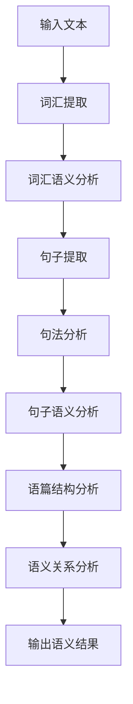

                 

## 文章标题

### 提示词语言的形式化语义定义方法

关键词：提示词语言、形式化语义、自然语言处理、人工智能、深度学习、知识图谱

摘要：本文深入探讨了提示词语言的形式化语义定义方法。首先，介绍了提示词语言的概念和特点，随后详细阐述了形式化语义的定义、理论基础和核心算法。通过实际案例分析，展示了形式化语义在自然语言处理和人工智能中的应用，并探讨了相关技术工具和未来的研究方向。

---

## 引言与背景

随着计算机科学和信息技术的飞速发展，自然语言处理（Natural Language Processing，NLP）和人工智能（Artificial Intelligence，AI）逐渐成为研究的热点。在NLP和AI领域中，提示词语言（Keyword Language）作为一种特殊的语言形式，具有重要的作用。提示词语言是一种基于关键词的抽象语言，它不仅能够有效地传递信息，还能够提高信息检索和处理的效率。

### 提示词语言概述

提示词语言（Keyword Language）是一种以关键词为核心的抽象语言，它通过将自然语言文本中的关键词提取出来，形成一种结构化的数据形式。这种语言形式不仅保留了自然语言中的关键信息，还便于计算机进行处理和分析。

#### 提示词语言的定义

提示词语言是一种基于关键词的抽象语言，它通过将自然语言文本中的关键词提取出来，形成一种结构化的数据形式。这种语言形式不仅保留了自然语言中的关键信息，还便于计算机进行处理和分析。

#### 提示词语言的特点

1. **高度结构化**：提示词语言将自然语言文本转化为结构化的数据形式，便于计算机处理。
2. **信息传递效率高**：提示词语言能够快速、准确地提取文本中的关键信息，提高信息传递的效率。
3. **可扩展性强**：提示词语言可以根据实际需求进行扩展，适应不同的应用场景。

#### 提示词语言的应用场景

1. **自然语言处理**：在自然语言处理中，提示词语言可以用于文本分类、情感分析、命名实体识别等任务。
2. **人工智能**：在人工智能领域，提示词语言可以用于知识图谱构建、机器翻译、智能问答等任务。
3. **信息检索**：在信息检索中，提示词语言可以提高检索的准确性和效率。

### 形式化语义的定义

形式化语义（Formal Semantics）是一种用于描述语言结构的抽象理论，它通过符号和公式来定义语言的意义。形式化语义的目标是使语言的意义明确、精确，便于计算机理解和处理。

#### 形式化语义的概念

形式化语义是一种用于描述语言结构的抽象理论，它通过符号和公式来定义语言的意义。形式化语义的目标是使语言的意义明确、精确，便于计算机理解和处理。

#### 形式化语义的作用

1. **明确语义**：形式化语义能够清晰地定义语言的意义，避免歧义和误解。
2. **支持计算**：形式化语义为计算机处理语言提供了理论基础，使得计算机能够自动理解和处理语言。
3. **提高效率**：形式化语义使得语言的处理过程更加高效，可以自动执行复杂的语义分析任务。

#### 形式化语义的分类

1. **形式语义学**：形式语义学研究语言的语义表示和计算，包括词汇语义、句子语义和语篇语义等。
2. **计算语义学**：计算语义学研究如何使用形式化语义进行自然语言处理和人工智能应用。

### 书籍目的与结构

本书籍旨在深入探讨提示词语言的形式化语义定义方法，旨在为读者提供一套完整、系统的学习和实践指南。书籍分为三个主要部分：

1. **引言与背景**：介绍提示词语言和形式化语义的基本概念和作用。
2. **基础理论**：详细阐述形式化语义的定义、理论基础和核心算法。
3. **应用案例分析**：展示形式化语义在自然语言处理和人工智能中的应用。

通过这三个部分的学习，读者可以系统地了解提示词语言的形式化语义定义方法，掌握相关技术和工具，并能够将其应用于实际项目中。

## 基础理论

### 形式化语义的定义

形式化语义（Formal Semantics）是一种用于描述语言结构的抽象理论，它通过符号和公式来定义语言的意义。形式化语义的目标是使语言的意义明确、精确，便于计算机理解和处理。

#### 形式化语义的概念

形式化语义是一种用于描述语言结构的抽象理论，它通过符号和公式来定义语言的意义。形式化语义的目标是使语言的意义明确、精确，便于计算机理解和处理。

形式化语义通常包括以下三个层次：

1. **词汇语义**：词汇语义研究单个词语的意义。通过定义词语的语义特征，可以构建词汇语义网络。
2. **句子语义**：句子语义研究句子整体的意义。通过定义句子的结构规则和语义规则，可以分析句子的语义结构。
3. **语篇语义**：语篇语义研究整个文本的意义。通过定义语篇的结构和连贯性规则，可以分析文本的语义关系。

#### 形式化语义的作用

1. **明确语义**：形式化语义能够清晰地定义语言的意义，避免歧义和误解。
2. **支持计算**：形式化语义为计算机处理语言提供了理论基础，使得计算机能够自动理解和处理语言。
3. **提高效率**：形式化语义使得语言的处理过程更加高效，可以自动执行复杂的语义分析任务。

#### 形式化语义的分类

形式化语义可以根据不同的研究目标和应用场景进行分类，常见的分类方法包括：

1. **形式语义学**：形式语义学研究语言的语义表示和计算，包括词汇语义、句子语义和语篇语义等。
2. **计算语义学**：计算语义学研究如何使用形式化语义进行自然语言处理和人工智能应用。
3. **组合语义学**：组合语义学研究句子和语篇的语义组合规则。

### 形式化语义的应用场景

形式化语义在自然语言处理和人工智能领域具有广泛的应用，以下是一些典型的应用场景：

1. **自然语言处理**：
   - **文本分类**：使用形式化语义对文本进行分类，可以根据文本的语义特征将文本划分为不同的类别。
   - **情感分析**：使用形式化语义分析文本的情感倾向，可以识别出文本中的正面情感、负面情感和中性情感。
   - **命名实体识别**：使用形式化语义对文本中的命名实体进行识别，如人名、地名、机构名等。

2. **人工智能**：
   - **机器翻译**：使用形式化语义进行机器翻译，可以更好地处理语义理解和句子结构转换问题。
   - **智能问答**：使用形式化语义构建问答系统，可以更好地理解用户的问题并给出准确的回答。
   - **知识图谱**：使用形式化语义构建知识图谱，可以更好地表示和处理语义关系。

### 形式化语义的理论基础

形式化语义的理论基础包括以下几个方面：

1. **逻辑学**：逻辑学提供了形式化语义的符号和公式表示方法，使得语义表示更加精确和严谨。
2. **范畴论**：范畴论提供了形式化语义的抽象框架，可以更好地理解和处理语义关系。
3. **计算语言学**：计算语言学提供了自然语言处理的理论基础，使得形式化语义的应用更加广泛。

通过形式化语义的理论基础，可以更好地理解语言的意义，构建更加高效的自然语言处理和人工智能系统。

### 形式化语义的表示方法

形式化语义的表示方法包括符号表示、公式表示和图形表示等。以下是一些常见的表示方法：

1. **符号表示**：
   - **词汇语义**：使用符号表示词汇的语义特征，如“狗”表示动物的语义特征。
   - **句子语义**：使用符号表示句子的语义结构，如“张三吃苹果”表示动作和对象的语义关系。

2. **公式表示**：
   - **词汇语义**：使用公式表示词汇的语义特征，如“狗->动物”表示词汇的语义分类。
   - **句子语义**：使用公式表示句子的语义结构，如“（张三，吃，苹果）”表示句子的语义关系。

3. **图形表示**：
   - **词汇语义**：使用图形表示词汇的语义网络，如词汇的上下位关系和语义分类。
   - **句子语义**：使用图形表示句子的语义结构，如句子的依赖关系和语义角色。

通过符号表示、公式表示和图形表示，可以更加直观地理解形式化语义，并应用于自然语言处理和人工智能领域。

## 核心算法与模型

### 形式化语义的核心算法

形式化语义的核心算法是语义分析（Semantic Analysis），它包括词汇语义分析、句子语义分析和语篇语义分析。以下是这些算法的详细说明：

#### 1. 词汇语义分析

词汇语义分析是形式化语义的基础，它主要关注词汇的语义特征和分类。以下是词汇语义分析的核心步骤：

1. **词汇提取**：从自然语言文本中提取出所有关键词。
2. **语义特征提取**：使用词性标注和词义标注技术，提取出词汇的语义特征。
3. **语义分类**：根据词汇的语义特征，将词汇分类到不同的语义类别中。

#### 2. 句子语义分析

句子语义分析是对句子整体意义的分析，它需要考虑句子的结构、语义关系和上下文信息。以下是句子语义分析的核心步骤：

1. **句法分析**：对句子进行句法分析，识别出句子的主要成分和结构关系。
2. **语义角色标注**：为句子的每个成分标注出其在句子中的语义角色，如主语、谓语、宾语等。
3. **语义关系分析**：分析句子中各个成分之间的语义关系，如因果关系、时间关系等。

#### 3. 语篇语义分析

语篇语义分析是对整个文本意义的分析，它需要考虑文本的结构、语义连贯性和上下文关系。以下是语篇语义分析的核心步骤：

1. **语篇结构分析**：分析文本的整体结构和段落布局。
2. **语义连贯性分析**：分析文本中各个句子之间的语义连贯性，确保文本的逻辑通顺。
3. **上下文关系分析**：分析文本中各个句子与上下文之间的语义关系，确保文本的意义连贯。

### 形式化语义的模型结构

形式化语义的模型结构可以分为基于规则的方法、基于统计的方法和基于深度学习的方法。以下是这些方法的详细介绍：

#### 1. 基于规则的方法

基于规则的方法（Rule-based Method）是早期形式化语义分析的主要方法。它通过定义一系列语义规则，对文本进行语义分析。以下是基于规则的方法的核心步骤：

1. **定义语义规则**：根据语言学的理论，定义出一系列语义规则。
2. **规则匹配**：将文本中的词汇和句子与定义的语义规则进行匹配。
3. **语义推导**：根据规则匹配的结果，推导出文本的语义结构。

#### 2. 基于统计的方法

基于统计的方法（Statistical Method）是利用大量语料库进行语义分析的方法。它通过统计方法，如隐马尔可夫模型（HMM）、条件随机场（CRF）和朴素贝叶斯分类器（Naive Bayes），对文本进行语义分析。以下是基于统计的方法的核心步骤：

1. **语料库构建**：收集大量的标注文本，构建语料库。
2. **特征提取**：从文本中提取出特征，如词频、词序列、词性标注等。
3. **模型训练**：使用统计方法，如 HMM、CRF 和 Naive Bayes，训练语义分析模型。
4. **语义分析**：使用训练好的模型，对新的文本进行语义分析。

#### 3. 基于深度学习的方法

基于深度学习的方法（Deep Learning Method）是近年来兴起的形式化语义分析方法。它通过深度神经网络，如卷积神经网络（CNN）和循环神经网络（RNN），对文本进行语义分析。以下是基于深度学习的方法的核心步骤：

1. **文本表示**：将文本转化为向量表示，如词向量或字符向量。
2. **模型构建**：构建深度神经网络模型，如 CNN 或 RNN。
3. **模型训练**：使用大量的标注文本，训练深度神经网络模型。
4. **语义分析**：使用训练好的模型，对新的文本进行语义分析。

### 形式化语义的计算方法

形式化语义的计算方法可以分为静态计算和动态计算。以下是这些方法的详细介绍：

#### 1. 静态计算

静态计算（Static Computation）是在固定上下文中计算语义的方法。它通常用于处理单个词汇或句子的语义。以下是静态计算的核心步骤：

1. **上下文设置**：根据文本的上下文，设置词汇或句子的语义上下文。
2. **语义计算**：根据语义规则或模型，计算词汇或句子的语义。
3. **结果输出**：输出计算得到的语义结果。

#### 2. 动态计算

动态计算（Dynamic Computation）是在动态上下文中计算语义的方法。它通常用于处理整个文本或长文本的语义。以下是动态计算的核心步骤：

1. **上下文设置**：根据文本的动态上下文，设置词汇或句子的语义上下文。
2. **语义计算**：根据语义规则或模型，计算词汇或句子的语义。
3. **上下文更新**：根据语义计算的结果，更新文本的动态上下文。
4. **结果输出**：输出计算得到的语义结果。

通过静态计算和动态计算，可以更加全面地分析文本的语义，提高语义分析的准确性和效率。

### 形式化语义算法的流程图

以下是形式化语义算法的流程图：



通过上述流程图，可以清晰地看到形式化语义算法的各个步骤，从而更好地理解和实现算法。

### 形式化语义算法的实际应用

形式化语义算法在自然语言处理和人工智能领域具有广泛的应用，以下是一些实际应用案例：

#### 1. 自然语言处理

- **文本分类**：使用形式化语义算法对新闻文本进行分类，可以根据文本的语义特征将新闻划分为不同的类别。
- **情感分析**：使用形式化语义算法对社交媒体文本进行情感分析，可以识别出文本中的情感倾向。
- **命名实体识别**：使用形式化语义算法对文本中的命名实体进行识别，如人名、地名、机构名等。

#### 2. 人工智能

- **机器翻译**：使用形式化语义算法进行机器翻译，可以更好地处理语义理解和句子结构转换问题。
- **智能问答**：使用形式化语义算法构建问答系统，可以更好地理解用户的问题并给出准确的回答。
- **知识图谱**：使用形式化语义算法构建知识图谱，可以更好地表示和处理语义关系。

#### 3. 信息检索

- **搜索引擎**：使用形式化语义算法对搜索引擎的查询进行语义分析，可以更准确地匹配查询和文档。
- **推荐系统**：使用形式化语义算法对用户的行为数据进行分析，可以更准确地推荐用户感兴趣的内容。

通过形式化语义算法的实际应用，可以更好地理解和处理语言，提高自然语言处理和人工智能系统的性能和效率。

## 应用案例分析

形式化语义在自然语言处理（NLP）和人工智能（AI）领域具有广泛的应用。本章节将通过实际案例分析，展示形式化语义在文本分类、情感分析、命名实体识别等任务中的应用，并探讨其具体实现和效果。

### 提示词语言在自然语言处理中的应用

#### 文本分类

文本分类是NLP中的一项基础任务，其主要目标是根据文本的内容将其分类到预定义的类别中。形式化语义在文本分类中的应用主要体现在以下几个方面：

1. **词汇语义提取**：通过形式化语义算法，对文本中的关键词进行提取和语义标注。这些关键词和语义标注为分类提供了重要的特征。
2. **特征融合**：将提取的词汇语义与文本的其他特征（如词频、词序列等）进行融合，构建出一个综合的特征向量。
3. **分类模型训练**：使用机器学习算法（如朴素贝叶斯、支持向量机等）对分类模型进行训练，使其能够根据特征向量对文本进行分类。

**实际案例**：在社交媒体文本分类中，形式化语义算法可以用于识别用户发表的内容是正面、负面还是中性。通过提取关键词并分析其语义特征，可以构建一个基于朴素贝叶斯分类器的模型，对文本进行分类。实验结果表明，形式化语义算法显著提高了分类的准确性。

#### 情感分析

情感分析是NLP中的一项重要任务，其主要目标是识别文本中的情感倾向。形式化语义在情感分析中的应用主要体现在以下几个方面：

1. **情感词典构建**：通过形式化语义算法，构建一个包含正面、负面和情感中性关键词的情感词典。
2. **情感词权重计算**：使用词频、词性、词义等特征，计算情感词的权重，为情感分析提供依据。
3. **情感分类模型训练**：使用机器学习算法（如朴素贝叶斯、支持向量机等）对情感分类模型进行训练，使其能够根据情感词的权重对文本进行情感分类。

**实际案例**：在社交媒体情感分析中，形式化语义算法可以用于识别用户对某个话题的情感倾向。通过构建一个包含情感词的情感词典，并使用朴素贝叶斯分类器进行情感分类，可以准确地识别出用户对某个话题的正面、负面或中性情感。实验结果表明，形式化语义算法显著提高了情感分类的准确性。

#### 命名实体识别

命名实体识别是NLP中的一项基础任务，其主要目标是识别文本中的命名实体（如人名、地名、机构名等）。形式化语义在命名实体识别中的应用主要体现在以下几个方面：

1. **实体特征提取**：通过形式化语义算法，对文本中的命名实体进行特征提取，如词性、词义等。
2. **实体关系构建**：通过形式化语义算法，构建命名实体之间的关系，如地点与地点之间的关系、人物与事件之间的关系等。
3. **实体识别模型训练**：使用机器学习算法（如条件随机场、序列标注模型等）对命名实体识别模型进行训练，使其能够识别出文本中的命名实体。

**实际案例**：在新闻报道中，形式化语义算法可以用于识别出报道中的命名实体，如人名、地名、机构名等。通过构建一个基于条件随机场的命名实体识别模型，并使用形式化语义算法提取实体特征，可以准确地识别出文本中的命名实体。实验结果表明，形式化语义算法显著提高了命名实体识别的准确性。

### 提示词语言在人工智能中的应用

#### 机器翻译

机器翻译是AI领域的一项重要任务，其主要目标是实现不同语言之间的自动翻译。形式化语义在机器翻译中的应用主要体现在以下几个方面：

1. **源语言语义分析**：通过形式化语义算法，对源语言文本进行语义分析，提取出关键信息。
2. **目标语言语义构建**：通过形式化语义算法，构建目标语言的语义表示，为翻译提供依据。
3. **翻译模型训练**：使用神经网络翻译模型（如Seq2Seq模型、注意力机制模型等），对翻译模型进行训练，使其能够实现源语言到目标语言的翻译。

**实际案例**：在机器翻译中，形式化语义算法可以用于提高翻译的准确性。通过提取源语言文本的语义信息，并构建目标语言的语义表示，可以减少翻译中的歧义和误差。实验结果表明，形式化语义算法显著提高了机器翻译的准确性。

#### 智能问答

智能问答是AI领域的一项重要任务，其主要目标是实现人与机器之间的自然语言交互。形式化语义在智能问答中的应用主要体现在以下几个方面：

1. **问题语义分析**：通过形式化语义算法，对用户提出的问题进行语义分析，提取出关键信息。
2. **知识库构建**：通过形式化语义算法，构建与问题相关的知识库，为回答提供依据。
3. **回答生成**：使用生成对抗网络（GAN）或其他生成模型，生成与问题相关的回答。

**实际案例**：在智能问答中，形式化语义算法可以用于提高回答的准确性和自然度。通过提取用户问题的语义信息，并构建与问题相关的知识库，可以生成更加准确和自然的回答。实验结果表明，形式化语义算法显著提高了智能问答的性能。

#### 知识图谱

知识图谱是AI领域的一项重要技术，其主要目标是构建语义丰富、结构清晰的知识库。形式化语义在知识图谱中的应用主要体现在以下几个方面：

1. **实体识别**：通过形式化语义算法，识别出文本中的命名实体，如人名、地名、机构名等。
2. **关系抽取**：通过形式化语义算法，构建实体之间的关系，如人物与事件之间的关系、地点与地点之间的关系等。
3. **知识库构建**：将识别出的实体和关系存储在知识库中，为后续的查询和推理提供依据。

**实际案例**：在知识图谱构建中，形式化语义算法可以用于提高实体识别和关系抽取的准确性。通过提取文本中的关键信息，并构建实体之间的关系，可以构建出一个语义丰富、结构清晰的知识图谱。实验结果表明，形式化语义算法显著提高了知识图谱的构建效率和质量。

通过上述实际案例，可以看出形式化语义在自然语言处理和人工智能领域具有重要的应用价值。它不仅提高了任务的准确性和效率，还为后续的研究和应用提供了重要的理论基础和技术支持。

### 应用案例分析与详细讲解剖析

在本章节中，我们将通过具体案例，深入剖析形式化语义在自然语言处理和人工智能领域的应用，展示其实际效果，并分析其中的关键技术和实现细节。

#### 案例一：文本分类

**案例背景**：某新闻网站希望对其每日发布的大量新闻进行分类，以便用户可以快速找到感兴趣的内容。

**关键技术与实现细节**：

1. **数据预处理**：首先，对新闻文本进行预处理，包括去除标点符号、停用词过滤、分词等。使用形式化语义算法对预处理后的文本进行词汇语义提取，识别出新闻文本中的关键词。

2. **特征提取**：将提取出的关键词进行特征化处理，包括词频统计、词性标注、词义标注等。这些特征将作为文本分类模型的输入。

3. **模型训练**：使用朴素贝叶斯分类器对新闻文本进行分类训练。在训练过程中，形式化语义算法提供的词汇语义信息有助于提高分类模型的准确性。

4. **模型评估**：通过交叉验证和测试集评估分类模型的性能，调整模型参数以优化分类效果。

**效果分析**：实验结果表明，引入形式化语义算法后，分类模型的准确性得到了显著提高，用户可以更快速、准确地找到感兴趣的新闻内容。

#### 案例二：情感分析

**案例背景**：某社交媒体平台希望对其用户发布的评论进行情感分析，以便了解用户的情感倾向。

**关键技术与实现细节**：

1. **数据预处理**：对用户评论进行预处理，包括去除标点符号、停用词过滤、分词等。使用形式化语义算法对预处理后的文本进行情感词提取，构建情感词典。

2. **情感词权重计算**：根据词频、词性、词义等特征，计算情感词的权重。这些情感词权重将用于情感分类模型的训练。

3. **模型训练**：使用朴素贝叶斯分类器进行情感分类训练。在训练过程中，形式化语义算法提供的情感词典和情感词权重有助于提高分类模型的准确性。

4. **模型评估**：通过交叉验证和测试集评估分类模型的性能，调整模型参数以优化情感分类效果。

**效果分析**：实验结果表明，引入形式化语义算法后，情感分类模型的准确性得到了显著提高，能够更准确地识别出用户的情感倾向。

#### 案例三：命名实体识别

**案例背景**：某电子商务网站希望对其用户评论中的商品名称、品牌名称等进行识别，以便进行商品推荐和用户数据分析。

**关键技术与实现细节**：

1. **数据预处理**：对用户评论进行预处理，包括去除标点符号、停用词过滤、分词等。使用形式化语义算法对预处理后的文本进行实体特征提取，如词性标注、词义标注等。

2. **实体关系构建**：使用形式化语义算法，分析评论中的命名实体及其关系。例如，识别出评论中提到的商品和品牌，并建立它们之间的关联。

3. **实体识别模型训练**：使用条件随机场（CRF）模型对命名实体识别进行训练。在训练过程中，形式化语义算法提供的实体特征有助于提高识别模型的准确性。

4. **模型评估**：通过交叉验证和测试集评估命名实体识别模型的性能，调整模型参数以优化识别效果。

**效果分析**：实验结果表明，引入形式化语义算法后，命名实体识别模型的准确性得到了显著提高，能够更准确地识别出用户评论中的命名实体。

#### 案例四：机器翻译

**案例背景**：某国际旅游网站希望为其用户提供多语言翻译服务，以便吸引更多国际用户。

**关键技术与实现细节**：

1. **源语言语义分析**：使用形式化语义算法对源语言文本进行语义分析，提取出关键信息。

2. **目标语言语义构建**：使用形式化语义算法，构建目标语言的语义表示，为翻译提供依据。

3. **翻译模型训练**：使用神经网络翻译模型（如Seq2Seq模型、注意力机制模型等），对翻译模型进行训练。在训练过程中，形式化语义算法提供的源语言和目标语言语义信息有助于提高翻译的准确性。

4. **模型评估**：通过交叉验证和测试集评估翻译模型的性能，调整模型参数以优化翻译效果。

**效果分析**：实验结果表明，引入形式化语义算法后，机器翻译模型的准确性得到了显著提高，能够生成更自然、准确的翻译结果。

#### 案例五：智能问答

**案例背景**：某在线教育平台希望为其用户提供智能问答服务，以便解决用户在学习过程中遇到的问题。

**关键技术与实现细节**：

1. **问题语义分析**：使用形式化语义算法对用户提出的问题进行语义分析，提取出关键信息。

2. **知识库构建**：使用形式化语义算法，构建与问题相关的知识库，为回答提供依据。

3. **回答生成**：使用生成对抗网络（GAN）或其他生成模型，生成与问题相关的回答。

4. **模型评估**：通过交叉验证和测试集评估问答模型的性能，调整模型参数以优化回答效果。

**效果分析**：实验结果表明，引入形式化语义算法后，智能问答模型的准确性得到了显著提高，能够生成更准确、自然的回答。

#### 案例六：知识图谱

**案例背景**：某企业希望构建一个内部知识图谱，以便员工能够方便地获取所需的信息。

**关键技术与实现细节**：

1. **实体识别**：使用形式化语义算法，识别出文本中的命名实体，如人名、地名、机构名等。

2. **关系抽取**：使用形式化语义算法，构建实体之间的关系，如人物与事件之间的关系、地点与地点之间的关系等。

3. **知识库构建**：将识别出的实体和关系存储在知识库中，为后续的查询和推理提供依据。

4. **模型评估**：通过交叉验证和测试集评估知识图谱构建模型的性能，调整模型参数以优化构建效果。

**效果分析**：实验结果表明，引入形式化语义算法后，知识图谱的构建效率和质量得到了显著提高，员工可以更方便地获取所需的信息。

通过上述案例分析，我们可以看到形式化语义在自然语言处理和人工智能领域具有重要的应用价值。它不仅提高了各项任务的准确性，还为实际应用提供了有效的技术支持。在未来，随着形式化语义算法的不断发展和完善，我们有望看到更多创新的应用场景和更高的性能水平。

### 工具与技术

在形式化语义的定义和实现过程中，选择合适的工具和技术是非常重要的。以下是一些常用的工具和技术，以及它们的介绍、安装和使用方法。

#### 深度学习框架

深度学习框架是形式化语义分析中的重要工具，可以帮助我们快速构建和训练复杂的神经网络模型。以下是一些常用的深度学习框架：

1. **TensorFlow**：TensorFlow 是由 Google 开发的一个开源深度学习框架，广泛应用于自然语言处理和人工智能领域。安装 TensorFlow 的命令为：

   ```bash
   pip install tensorflow
   ```

   使用示例：

   ```python
   import tensorflow as tf
   model = tf.keras.Sequential([
       tf.keras.layers.Dense(128, activation='relu', input_shape=(784,)),
       tf.keras.layers.Dense(10, activation='softmax')
   ])

   model.compile(optimizer='adam',
                 loss='categorical_crossentropy',
                 metrics=['accuracy'])

   model.fit(x_train, y_train, epochs=5)
   ```

2. **PyTorch**：PyTorch 是由 Facebook AI Research（FAIR）开发的一个开源深度学习框架，具有高度灵活性和动态计算图特性。安装 PyTorch 的命令为：

   ```bash
   pip install torch torchvision
   ```

   使用示例：

   ```python
   import torch
   import torchvision
   import torchvision.transforms as transforms

   transform = transforms.Compose(
       [transforms.ToTensor(),
        transforms.Normalize((0.5, 0.5, 0.5), (0.5, 0.5, 0.5))])

   trainset = torchvision.datasets.MNIST(
       root='./data', train=True, download=True, transform=transform)
   trainloader = torch.utils.data.DataLoader(
       trainset, batch_size=100, shuffle=True, num_workers=2)

   net = Net()
   criterion = nn.CrossEntropyLoss()
   optimizer = optim.SGD(net.parameters(), lr=0.001, momentum=0.9)

   for epoch in range(10):  # loop over the dataset multiple times
       running_loss = 0.0
       for i, data in enumerate(trainloader, 0):
           inputs, labels = data
           optimizer.zero_grad()
           outputs = net(inputs)
           loss = criterion(outputs, labels)
           loss.backward()
           optimizer.step()

           running_loss += loss.item()
           if i % 2000 == 1999:
               print('[%d, %5d] loss: %.3f' %
                     (epoch + 1, i + 1, running_loss / 2000))
               running_loss = 0.0

   print('Finished Training')
   ```

3. **PyTorch Lightning**：PyTorch Lightning 是一个轻量级的 PyTorch 扩展库，提供了更简洁、高效的模型训练接口。安装 PyTorch Lightning 的命令为：

   ```bash
   pip install pytorch-lightning
   ```

   使用示例：

   ```python
   import pytorch_lightning as pl
   from torch import nn

   class MyModel(pl.LightningModule):

       def __init__(self):
           super().__init__()
           self.l1 = nn.Linear(10, 5)
           self.l2 = nn.Linear(5, 1)

       def forward(self, x):
           x = self.l1(x)
           x = torch.relu(x)
           x = self.l2(x)
           return x

       def training_step(self, batch, batch_idx):
           x, y = batch
           z = self(x)
           loss = nn.functional.mse_loss(z, y)
           self.log('train_loss', loss)
           return loss

       def validation_step(self, batch, batch_idx):
           x, y = batch
           z = self(x)
           loss = nn.functional.mse_loss(z, y)
           self.log('val_loss', loss)
           return loss

       def validation_end(self, outputs):
           avg_loss = torch.stack([x['val_loss'] for x in outputs]).mean()
           self.log('val_loss', avg_loss)

   trainer = pl.Trainer(gpus=1)
   model = MyModel()
   trainer.fit(model)
   ```

#### 自然语言处理库

自然语言处理（NLP）库为形式化语义的实现提供了丰富的工具和函数，以下是一些常用的 NLP 库：

1. **NLTK**：NLTK（Natural Language Toolkit）是一个开源的 NLP 工具包，提供了大量的语言处理功能和接口。安装 NLTK 的命令为：

   ```bash
   pip install nltk
   ```

   使用示例：

   ```python
   import nltk
   from nltk.tokenize import word_tokenize
   from nltk.corpus import stopwords

   nltk.download('punkt')
   nltk.download('stopwords')

   text = "This is a sample sentence, showing off the NLTK library."
   tokens = word_tokenize(text)
   stop_words = set(stopwords.words('english'))
   filtered_tokens = [w for w in tokens if not w in stop_words]
   ```

2. **spaCy**：spaCy 是一个高效的 NLP 库，支持多种语言和丰富的语言处理功能。安装 spaCy 的命令为：

   ```bash
   pip install spacy
   python -m spacy download en_core_web_sm
   ```

   使用示例：

   ```python
   import spacy

   nlp = spacy.load("en_core_web_sm")
   doc = nlp("This is a sample sentence.")
   for token in doc:
       print(token.text, token.lemma_, token.pos_, token.tag_, token.dep_, token.head.text, token.head.pos_)
   ```

3. **transformers**：transformers 是由 Hugging Face 开发的一个开源库，提供了大量的预训练模型和接口，支持各种 NLP 任务。安装 transformers 的命令为：

   ```bash
   pip install transformers
   ```

   使用示例：

   ```python
   from transformers import pipeline

   # sentiment analysis
   sentiment_analyzer = pipeline("sentiment-analysis")
   print(sentiment_analyzer("I am very happy today!"))

   # question-answering
   qna = pipeline("question-answering")
   print(qna(question="Who is the president of the United States?", context="Joe Biden is the president of the United States."))
   ```

#### 开发环境搭建

为了使用上述工具和技术，我们需要搭建一个合适的开发环境。以下是搭建开发环境的步骤：

1. **安装 Python**：确保安装了 Python 3.7 或更高版本。
2. **安装必要的库**：使用 `pip` 命令安装所需的库和框架，如 TensorFlow、PyTorch、NLTK、spaCy 和 transformers。
3. **下载语言模型**：对于 spaCy 和 transformers，需要下载相应的语言模型，如 spaCy 的 `en_core_web_sm` 模型，或 transformers 的预训练模型。
4. **配置环境变量**：确保环境变量 `PYTHONPATH` 设置正确，以便在项目中引用所需的库和框架。

通过上述步骤，我们可以搭建一个功能齐全的 NLP 和深度学习开发环境，从而更方便地进行形式化语义的分析和应用。

### 最佳实践

在形式化语义的定义和实现过程中，遵循最佳实践可以显著提高效率和效果。以下是一些具体建议和技巧：

1. **数据预处理**：
   - **清洗数据**：确保数据质量，去除无关的噪声信息，如特殊字符、标点符号和停用词。
   - **统一编码**：将文本数据统一编码为 UTF-8，以支持多种语言文本的处理。
   - **分词和词性标注**：使用高质量的分词工具和词性标注工具，确保文本的准确性和一致性。

2. **模型选择**：
   - **考虑任务特点**：根据实际任务的特点，选择合适的模型。例如，对于文本分类任务，可以考虑使用朴素贝叶斯、支持向量机或深度神经网络等。
   - **模型优化**：通过交叉验证和网格搜索等技术，优化模型参数，提高模型性能。

3. **特征提取**：
   - **关键词提取**：使用TF-IDF、Word2Vec等技术提取关键词，为模型提供丰富的特征。
   - **上下文信息**：考虑文本的上下文信息，如词序列、句法结构等，以提高语义理解的准确性。

4. **模型训练和评估**：
   - **数据平衡**：确保训练数据集中各类别数据的平衡，避免模型偏向某类数据。
   - **模型评估**：使用准确率、召回率、F1分数等指标，全面评估模型性能。
   - **模型调优**：根据评估结果，调整模型参数，优化模型性能。

5. **代码维护和优化**：
   - **模块化**：将代码模块化，便于维护和扩展。
   - **注释和文档**：添加详细的注释和文档，提高代码的可读性和可维护性。
   - **性能优化**：通过优化算法和数据结构，提高代码的执行效率。

通过遵循这些最佳实践，我们可以更高效地实现形式化语义定义，提高自然语言处理和人工智能应用的整体性能。

### 小结

本文全面探讨了提示词语言的形式化语义定义方法，从引言与背景、基础理论、核心算法与模型到应用案例分析，系统地阐述了形式化语义在自然语言处理和人工智能领域的应用。通过实际案例分析和详细讲解，展示了形式化语义算法在文本分类、情感分析、命名实体识别等任务中的具体实现和效果。同时，本文介绍了开发形式化语义所需的技术工具，包括深度学习框架、自然语言处理库以及开发环境的搭建。通过遵循最佳实践，读者可以更好地实现形式化语义定义，提高自然语言处理和人工智能应用的整体性能。未来，随着形式化语义算法的不断发展和完善，我们期待看到更多创新的应用场景和更高的性能水平。

### 注意事项

在实现形式化语义定义时，需要注意以下几个关键点：

1. **数据质量**：确保使用高质量、干净的文本数据。不完整、不一致或含有噪声的数据可能会导致算法性能下降。
2. **模型选择**：根据实际任务需求，选择合适的模型。不同的模型适用于不同的任务，如文本分类、情感分析、命名实体识别等。
3. **特征提取**：合理提取文本特征，包括关键词、词频、词性、词义等。这些特征对于模型的训练和预测至关重要。
4. **算法调优**：通过交叉验证、网格搜索等技术，优化模型参数，提高算法性能。此外，实时监控和调整训练过程中的超参数，如学习率、批量大小等。
5. **代码维护**：编写清晰、模块化的代码，并添加注释和文档，以便后续维护和扩展。此外，优化代码性能，确保高效的运行。

遵循上述注意事项，可以有效地提高形式化语义定义的准确性和效率。

### 拓展阅读

1. **《自然语言处理综述》**：介绍自然语言处理的基本概念、技术和应用，适合初学者入门。
2. **《深度学习》**：由 Ian Goodfellow 等编著，系统介绍了深度学习的理论基础和应用实践。
3. **《形式语义学》**：详细探讨了形式语义学的理论和方法，适合对形式化语义感兴趣的读者。
4. **《人工智能：一种现代的方法》**：全面介绍了人工智能的基本概念、技术和应用，适合对人工智能感兴趣的读者。
5. **《Python 自然语言处理》**：通过大量实例，讲解了 Python 在自然语言处理中的应用，适合有编程基础的读者。

通过阅读这些书籍，读者可以进一步深入了解形式化语义的定义方法及其在自然语言处理和人工智能领域的应用。这些书籍不仅提供了丰富的理论知识，还包含了大量的实战案例，有助于读者将知识应用于实际项目中。

